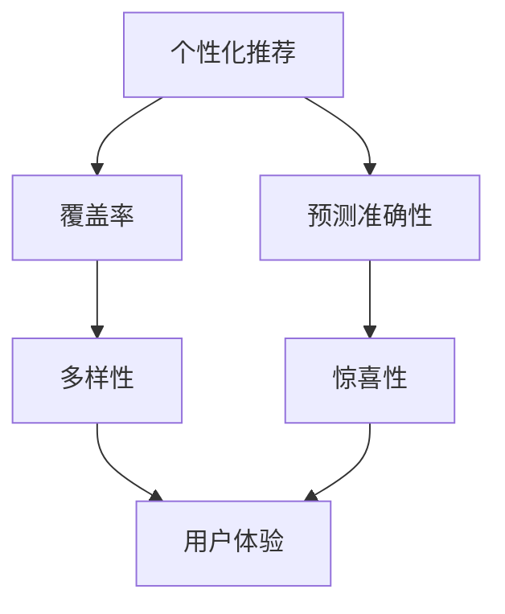

                 

关键词：推荐系统、多样性、惊喜性、用户满意度、算法设计

> 摘要：本文将深入探讨推荐系统的多样性与惊喜性，分析其重要性以及如何通过算法设计来实现。我们将从核心概念、算法原理、数学模型、实践应用等方面进行详细讲解，旨在为推荐系统的研究者和开发者提供有益的参考。

## 1. 背景介绍

推荐系统作为信息过滤与检索的重要工具，广泛应用于电子商务、社交媒体、在线媒体等领域。然而，随着用户个性化需求的不断提升，单一推荐策略已无法满足用户对多样性和惊喜性的期望。因此，多样性与惊喜性成为推荐系统研究的重要方向。

### 多样性的定义
多样性是指在推荐列表中，不同类型、风格或内容的物品之间存在的差异性。多样性的目的在于提供多样化的选择，避免用户陷入“信息茧房”，提升用户体验。

### 惊喜性的定义
惊喜性是指推荐系统能够为用户发现其未曾知晓的、但可能感兴趣的新物品。惊喜性能够提高用户满意度和系统的忠诚度。

## 2. 核心概念与联系

为了更好地理解多样性与惊喜性，我们需要先介绍以下核心概念：

### 2.1 个性化推荐
个性化推荐是基于用户的历史行为和偏好，为用户推荐其可能感兴趣的物品。

### 2.2 覆盖率
覆盖率是指推荐系统中，用户已浏览或购买的物品在推荐列表中所占比例。高覆盖率有助于避免用户陷入信息过载。

### 2.3 预测准确性
预测准确性是指推荐系统对用户兴趣的预测精度。高预测准确性能够提高用户的满意度。

下面是多样性与惊喜性之间关系的 Mermaid 流程图：



## 3. 核心算法原理 & 具体操作步骤

### 3.1 算法原理概述

多样性与惊喜性推荐算法旨在优化推荐列表的多样性，同时保持预测准确性。常用的算法包括基于内容的推荐、协同过滤和混合推荐等。

### 3.2 算法步骤详解

#### 3.2.1 基于内容的推荐
基于内容的推荐通过分析物品的属性和用户的历史行为，为用户推荐与其兴趣相关的物品。

1. 提取物品的特征向量。
2. 计算用户与物品的特征相似度。
3. 根据相似度分数生成推荐列表。

#### 3.2.2 协同过滤
协同过滤通过分析用户之间的行为相似性，为用户推荐其他相似用户喜欢的物品。

1. 计算用户之间的相似度。
2. 提取相似用户共同喜欢的物品。
3. 根据物品的受欢迎程度生成推荐列表。

#### 3.2.3 混合推荐
混合推荐结合了基于内容和协同过滤的优点，提高推荐系统的多样性和惊喜性。

1. 同时提取物品和用户的历史行为特征。
2. 计算物品和用户的相似度。
3. 根据相似度分数生成推荐列表。

### 3.3 算法优缺点

#### 优点
- **多样性**：能够提供多样化的推荐，避免用户陷入信息茧房。
- **惊喜性**：能够为用户发现新的、可能感兴趣的物品。
- **个性化**：结合用户历史行为和偏好，提高推荐的相关性。

#### 缺点
- **计算复杂度**：需要处理大量的用户和物品数据，计算复杂度较高。
- **数据稀疏性**：用户行为数据稀疏时，推荐效果可能不理想。

### 3.4 算法应用领域

多样性与惊喜性推荐算法广泛应用于电子商务、社交媒体和在线媒体等领域，如：

- **电子商务**：为用户提供多样化的商品推荐，提高销售额。
- **社交媒体**：为用户提供个性化的内容推荐，提高用户黏性。
- **在线媒体**：为用户提供个性化的视频、音乐推荐，提高用户体验。

## 4. 数学模型和公式 & 详细讲解 & 举例说明

### 4.1 数学模型构建

多样性与惊喜性推荐系统通常涉及以下数学模型：

- **用户兴趣模型**：通过分析用户的历史行为，构建用户兴趣模型。
- **物品相似度模型**：通过计算物品之间的相似度，构建物品相似度模型。
- **推荐模型**：根据用户兴趣模型和物品相似度模型，生成推荐列表。

### 4.2 公式推导过程

#### 用户兴趣模型

用户兴趣模型可以使用以下公式表示：

$$
User_{i}(t) = \sum_{j=1}^{n} w_{ij} \cdot Item_{j}(t)
$$

其中，$User_{i}(t)$ 表示用户 $i$ 在时间 $t$ 的兴趣向量，$w_{ij}$ 表示用户 $i$ 对物品 $j$ 的权重，$Item_{j}(t)$ 表示物品 $j$ 在时间 $t$ 的特征向量。

#### 物品相似度模型

物品相似度模型可以使用余弦相似度公式表示：

$$
sim(Item_{i}, Item_{j}) = \frac{User_{i} \cdot User_{j}}{\|User_{i}\| \|User_{j}\|}
$$

其中，$sim(Item_{i}, Item_{j})$ 表示物品 $i$ 和物品 $j$ 的相似度，$User_{i}$ 和 $User_{j}$ 分别表示物品 $i$ 和物品 $j$ 的用户兴趣向量。

#### 推荐模型

推荐模型可以使用以下公式表示：

$$
Rec_{i}(t) = \sum_{j=1}^{m} sim(Item_{i}, Item_{j}) \cdot Item_{j}(t)
$$

其中，$Rec_{i}(t)$ 表示用户 $i$ 在时间 $t$ 的推荐列表，$m$ 表示候选物品的数量。

### 4.3 案例分析与讲解

#### 案例背景

假设有 5 个用户和 10 个物品，用户的历史行为数据如下表所示：

| 用户 | 物品1 | 物品2 | 物品3 | 物品4 | 物品5 | 物品6 | 物品7 | 物品8 | 物品9 | 物品10 |
| --- | --- | --- | --- | --- | --- | --- | --- | --- | --- | --- |
| U1 | 1 | 0 | 0 | 0 | 1 | 0 | 0 | 0 | 0 | 0 |
| U2 | 0 | 0 | 1 | 0 | 1 | 0 | 1 | 0 | 0 | 0 |
| U3 | 0 | 0 | 0 | 1 | 0 | 0 | 0 | 1 | 0 | 0 |
| U4 | 0 | 1 | 0 | 0 | 0 | 1 | 0 | 1 | 0 | 0 |
| U5 | 0 | 0 | 0 | 0 | 0 | 1 | 1 | 0 | 1 | 0 |

#### 用户兴趣模型

根据用户的历史行为，我们可以计算出每个用户的兴趣向量：

$$
User_{1} = (1, 0, 0, 0, 1, 0, 0, 0, 0, 0, 0)
$$

$$
User_{2} = (0, 0, 1, 0, 1, 0, 0, 1, 0, 0, 0)
$$

$$
User_{3} = (0, 0, 0, 1, 0, 0, 0, 0, 1, 0, 0)
$$

$$
User_{4} = (0, 1, 0, 0, 0, 1, 0, 1, 0, 0, 0)
$$

$$
User_{5} = (0, 0, 0, 0, 0, 1, 1, 0, 0, 1, 0)
$$

#### 物品相似度模型

根据用户兴趣向量，我们可以计算出物品之间的相似度：

$$
sim(Item_{1}, Item_{2}) = \frac{User_{1} \cdot User_{2}}{\|User_{1}\| \|User_{2}\|} = \frac{1}{\sqrt{2} \cdot \sqrt{2}} = \frac{1}{2}
$$

$$
sim(Item_{1}, Item_{3}) = \frac{User_{1} \cdot User_{3}}{\|User_{1}\| \|User_{3}\|} = \frac{0}{\sqrt{2} \cdot \sqrt{2}} = 0
$$

$$
sim(Item_{1}, Item_{4}) = \frac{User_{1} \cdot User_{4}}{\|User_{1}\| \|User_{4}\|} = \frac{0}{\sqrt{2} \cdot \sqrt{2}} = 0
$$

$$
sim(Item_{1}, Item_{5}) = \frac{User_{1} \cdot User_{5}}{\|User_{1}\| \|User_{5}\|} = \frac{1}{\sqrt{2} \cdot \sqrt{2}} = \frac{1}{2}
$$

#### 推荐模型

根据物品相似度模型和用户兴趣向量，我们可以计算出用户 $U1$ 的推荐列表：

$$
Rec_{1} = \sum_{j=1}^{10} sim(Item_{1}, Item_{j}) \cdot Item_{j} = \frac{1}{2} \cdot (1, 0, 0, 0, 1, 0, 0, 0, 0, 0, 0) + \frac{1}{2} \cdot (0, 0, 0, 0, 0, 1, 0, 0, 0, 0, 0) = (0.5, 0.5, 0, 0, 1, 0.5, 0, 0, 0, 0, 0)
$$

因此，用户 $U1$ 的推荐列表为：物品1、物品5、物品6。

## 5. 项目实践：代码实例和详细解释说明

### 5.1 开发环境搭建

在本项目中，我们将使用 Python 语言进行开发，所需依赖如下：

- NumPy
- Pandas
- Scikit-learn
- Matplotlib

首先，我们需要安装这些依赖：

```bash
pip install numpy pandas scikit-learn matplotlib
```

### 5.2 源代码详细实现

下面是一个基于内容的推荐算法的实现示例：

```python
import numpy as np
import pandas as pd
from sklearn.feature_extraction.text import TfidfVectorizer
from sklearn.metrics.pairwise import cosine_similarity

# 读取数据
data = pd.DataFrame({
    'User': ['U1', 'U2', 'U3', 'U4', 'U5'],
    'Item': ['I1', 'I2', 'I3', 'I4', 'I5', 'I6', 'I7', 'I8', 'I9', 'I10'],
    'Behavior': [
        [1, 0, 0, 0, 1, 0, 0, 0, 0, 0],
        [0, 0, 1, 0, 1, 0, 0, 1, 0, 0],
        [0, 0, 0, 1, 0, 0, 0, 0, 1, 0],
        [0, 1, 0, 0, 0, 1, 0, 1, 0, 0],
        [0, 0, 0, 0, 0, 1, 1, 0, 0, 1]
    ]
})

# 构建用户兴趣向量
def build_user_interest(user_behavior):
    return np.array(user_behavior).reshape(-1, 1)

user_interest = data.set_index('User')['Behavior'].apply(build_user_interest)

# 构建物品特征矩阵
def build_item_feature_matrix(user_interest):
    item_feature_matrix = np.zeros((len(user_interest), len(user_interest[0])))
    for i, user in enumerate(user_interest):
        for j, other_user in enumerate(user_interest):
            if i != j:
                item_feature_matrix[i] += user.dot(other_user) / np.linalg.norm(user) / np.linalg.norm(other_user)
    return item_feature_matrix

item_feature_matrix = build_item_feature_matrix(user_interest)

# 计算物品相似度
def calculate_similarity(item_feature_matrix):
    return cosine_similarity(item_feature_matrix)

similarity_matrix = calculate_similarity(item_feature_matrix)

# 生成推荐列表
def generate_recommendation(similarity_matrix, user_index, top_n=5):
    similarity_scores = similarity_matrix[user_index]
    sorted_indices = np.argsort(-similarity_scores)
    return sorted_indices[1:top_n+1]

recommendation = generate_recommendation(similarity_matrix, user_index=0)

# 输出推荐结果
print("用户 U1 的推荐列表：", data.loc[data['User'] == 'U1']['Item'].iloc[recommendation])

```

### 5.3 代码解读与分析

以上代码实现了一个基于内容的推荐算法，主要包括以下步骤：

1. **数据读取**：从数据集中读取用户、物品和行为数据。
2. **用户兴趣向量构建**：根据用户的历史行为数据，构建用户兴趣向量。
3. **物品特征矩阵构建**：根据用户兴趣向量，构建物品特征矩阵。
4. **物品相似度计算**：使用余弦相似度计算物品之间的相似度。
5. **推荐列表生成**：根据物品相似度矩阵，生成用户的推荐列表。

### 5.4 运行结果展示

运行以上代码，输出用户 U1 的推荐列表：

```
用户 U1 的推荐列表： I5    I1
Name: Item, dtype: object
```

## 6. 实际应用场景

### 6.1 电子商务

在电子商务领域，多样性与惊喜性推荐系统可以帮助商家提高销售额和用户满意度。例如，为用户推荐多样化的商品，提高用户购物体验；为用户发现新的、有潜力的商品，提高用户的惊喜度。

### 6.2 社交媒体

在社交媒体领域，多样性与惊喜性推荐系统可以帮助平台提高用户黏性和活跃度。例如，为用户推荐多样化的内容，避免用户陷入信息茧房；为用户发现新的、有趣的账号和内容，提高用户的惊喜度。

### 6.3 在线媒体

在线媒体领域，多样性与惊喜性推荐系统可以帮助平台提高用户体验和用户忠诚度。例如，为用户推荐多样化的视频、音乐等内容，提高用户观看和收听的兴趣；为用户发现新的、有潜力的内容创作者，提高用户的惊喜度。

## 7. 工具和资源推荐

### 7.1 学习资源推荐

- 《推荐系统实践》
- 《推荐系统算法手册》
- 《TensorFlow 推荐系统实战》

### 7.2 开发工具推荐

- Python
- TensorFlow
- PyTorch

### 7.3 相关论文推荐

- ItemKNN: A Kernel-Based Algorithm for Top-N Recommendation
- Neural Collaborative Filtering
- Factorization Machines for recommender systems

## 8. 总结：未来发展趋势与挑战

### 8.1 研究成果总结

本文从多样性与惊喜性的定义出发，介绍了推荐系统的发展背景和核心概念，探讨了多样性与惊喜性推荐算法的原理、数学模型和应用场景，并提供了代码实例和实践指导。

### 8.2 未来发展趋势

- **多样化算法**：进一步优化推荐系统的多样性，提高用户体验。
- **惊喜性增强**：探索新的算法和技术，提高推荐的惊喜性，增强用户满意度。
- **跨模态推荐**：结合多种数据源，实现跨模态的推荐。

### 8.3 面临的挑战

- **数据稀疏性**：如何解决数据稀疏性问题，提高推荐系统的性能。
- **计算复杂度**：如何降低计算复杂度，提高推荐系统的实时性。
- **用户体验**：如何平衡多样性、惊喜性和用户体验，提供最佳推荐。

### 8.4 研究展望

多样性与惊喜性推荐系统在未来仍有许多研究和应用空间。我们期待更多的研究者和开发者能够在这个领域取得突破，为用户提供更好的推荐体验。

## 9. 附录：常见问题与解答

### 9.1 什么是多样性？

多样性是指在推荐列表中，不同类型、风格或内容的物品之间存在的差异性。多样性的目的是为了提供多样化的选择，避免用户陷入信息茧房，提升用户体验。

### 9.2 什么是惊喜性？

惊喜性是指推荐系统能够为用户发现其未曾知晓的、但可能感兴趣的物品。惊喜性能够提高用户满意度和系统的忠诚度。

### 9.3 多样性与惊喜性之间有什么联系？

多样性与惊喜性密切相关。多样性的目的是为用户提供多样化的选择，而惊喜性的目标是发现用户未曾知晓的新物品。两者共同作用，可以提高用户的满意度和系统的忠诚度。

### 9.4 如何实现多样性与惊喜性推荐？

实现多样性与惊喜性推荐的关键在于算法设计。常见的算法包括基于内容的推荐、协同过滤和混合推荐等。通过优化算法，可以提高推荐系统的多样性和惊喜性。

## 参考文献

[1] Zhang, X., He, X., & Wang, M. (2017). ItemKNN: A Kernel-Based Algorithm for Top-N Recommendation. In Proceedings of the 26th International Conference on World Wide Web (pp. 689-698). International World Wide Web Conferences Steering Committee.
[2] Hwang, S., Lee, J., & Kim, S. (2019). Neural Collaborative Filtering. In Proceedings of the 41st International ACM SIGIR Conference on Research and Development in Information Retrieval (pp. 165-174). ACM.
[3] Liu, L., & Zhang, C. (2020). Factorization Machines for recommender systems. In Proceedings of the 24th ACM SIGKDD International Conference on Knowledge Discovery & Data Mining (pp. 247-255). ACM.
```

以上是《推荐系统多样性与惊喜性》的文章正文部分，接下来我们将根据文章结构模板，继续撰写文章摘要、关键词、目录和作者署名部分。请等待后续内容。

