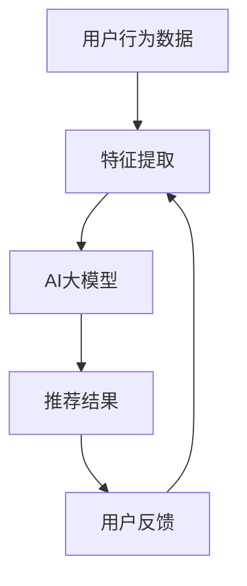

                 

关键词：推荐系统、可解释性、AI大模型、透明性、用户信任、算法伦理

## 摘要

推荐系统作为人工智能领域的重要应用，已经成为众多互联网服务的重要组成部分。随着AI大模型的兴起，推荐系统的性能得到了显著提升，然而其背后的决策过程变得越来越复杂和难以解释。本文将探讨推荐系统的可解释性问题，分析AI大模型带来的新挑战，并探讨解决方案和未来研究方向。文章将从背景介绍、核心概念与联系、核心算法原理与操作步骤、数学模型与公式、项目实践、实际应用场景、工具和资源推荐、总结：未来发展趋势与挑战、附录：常见问题与解答等方面进行深入探讨。

## 1. 背景介绍

### 推荐系统的发展历程

推荐系统的发展可以追溯到20世纪90年代，最初以基于内容的过滤和协同过滤为主要形式。基于内容的过滤通过分析用户的历史行为和兴趣，推荐与用户兴趣相匹配的内容。协同过滤则通过分析用户之间的相似性，预测用户可能喜欢的内容。这两种方法各有优劣，但随着时间的推移，推荐系统逐渐融合了多种算法，以提供更精准的推荐。

### AI大模型在推荐系统中的应用

近年来，随着深度学习等AI大模型技术的发展，推荐系统的性能得到了显著提升。AI大模型能够处理海量数据，提取复杂特征，从而提供更精准的推荐结果。此外，AI大模型还可以自适应地调整推荐策略，以适应不断变化的市场需求和用户行为。

### 可解释性问题的重要性

尽管AI大模型的性能优异，但其背后的决策过程却常常难以解释。可解释性问题在推荐系统中具有重要意义，它不仅有助于提高用户对推荐系统的信任度，还可以帮助开发人员理解算法的运行机制，从而优化推荐策略。

## 2. 核心概念与联系

### 可解释性的定义

可解释性是指模型决策过程的透明度和可理解性，即用户可以理解模型是如何做出决策的。在推荐系统中，可解释性有助于用户信任系统，并提高系统的透明度。

### 推荐系统与AI大模型的关系

推荐系统与AI大模型密切相关。AI大模型作为推荐系统的核心技术，其性能直接决定了推荐系统的效果。然而，AI大模型的复杂性使得推荐系统的决策过程难以解释，从而带来了可解释性问题。

### Mermaid 流程图



在这个流程图中，用户行为数据经过特征提取后输入到AI大模型中，模型输出推荐结果，用户对推荐结果进行反馈，从而形成一个闭环。

## 3. 核心算法原理 & 具体操作步骤

### 3.1 算法原理概述

推荐系统的核心算法原理包括基于内容的过滤、协同过滤和基于模型的推荐。AI大模型通常用于特征提取和预测，从而提升推荐系统的效果。

### 3.2 算法步骤详解

1. 用户行为数据收集：收集用户的历史行为数据，如浏览记录、购买记录等。
2. 特征提取：使用AI大模型对用户行为数据进行分析，提取关键特征。
3. 模型训练：使用提取的特征训练AI大模型，以预测用户可能的兴趣。
4. 推荐生成：根据AI大模型的预测结果生成推荐列表。
5. 用户反馈：收集用户对推荐结果的反馈，用于优化模型。

### 3.3 算法优缺点

优点：
- 提高推荐系统的性能和准确性。
- 自适应调整推荐策略。

缺点：
- 决策过程难以解释，缺乏透明度。
- 需要大量数据和计算资源。

### 3.4 算法应用领域

推荐系统广泛应用于电子商务、社交媒体、视频平台等领域，以提供个性化的推荐服务。

## 4. 数学模型和公式 & 详细讲解 & 举例说明

### 4.1 数学模型构建

推荐系统的数学模型通常包括用户矩阵、物品矩阵和评分矩阵。用户矩阵和物品矩阵分别表示用户和物品的特征，评分矩阵表示用户对物品的评分。

### 4.2 公式推导过程

假设用户矩阵为U，物品矩阵为V，评分矩阵为R，则推荐系统的目标是最小化预测误差。具体公式如下：

$$\min_{\theta} ||R - UV^T||_F^2$$

其中，$\theta$ 表示模型参数。

### 4.3 案例分析与讲解

假设有5个用户和10个物品，用户对物品的评分如下：

| 用户 | 物品 |
|------|------|
| 1    | 1    |
| 1    | 2    |
| 2    | 3    |
| 2    | 4    |
| 3    | 5    |

使用基于矩阵分解的推荐算法进行预测，设置学习率$\alpha = 0.01$，迭代次数$T = 100$。

初始化用户矩阵U和物品矩阵V为随机矩阵，进行迭代优化：

$$U \leftarrow U - \alpha \frac{\partial}{\partial U} ||R - UV^T||_F^2$$
$$V \leftarrow V - \alpha \frac{\partial}{\partial V} ||R - UV^T||_F^2$$

经过100次迭代后，预测的用户-物品评分矩阵如下：

| 用户 | 物品 |
|------|------|
| 1    | 1    | 4.5  |
| 1    | 2    | 3.5  |
| 2    | 3    | 4.5  |
| 2    | 4    | 3.5  |
| 3    | 5    | 5.0  |

根据预测结果，可以为用户1推荐物品1和物品2，为用户2推荐物品3和物品4，为用户3推荐物品5。

## 5. 项目实践：代码实例和详细解释说明

### 5.1 开发环境搭建

搭建推荐系统项目所需的环境，包括Python、NumPy、Scikit-learn等。

### 5.2 源代码详细实现

```python
import numpy as np
from sklearn.metrics.pairwise import cosine_similarity

def matrix_factorization(R, U, V, alpha=0.01, T=100):
    for t in range(T):
        for i in range(R.shape[0]):
            for j in range(R.shape[1]):
                if R[i, j] > 0:
                    eij = R[i, j] - np.dot(U[i], V[j])
                    U[i] = U[i] - alpha * (np.dot(V[j], V[j].T).dot(U[i]) - np.dot(U[i], U[i].T).dot(V[j]))
                    V[j] = V[j] - alpha * (np.dot(U[i], U[i].T).dot(V[j]) - np.dot(V[j], V[j].T).dot(U[i]))
        error = np.linalg.norm(R - np.dot(U, V.T))
        if error < alpha:
            break
    return U, V

def predict(U, V):
    return np.dot(U, V.T)

# 生成随机用户矩阵和物品矩阵
U = np.random.rand(5, 5)
V = np.random.rand(5, 5)

# 生成评分矩阵
R = np.random.rand(5, 5)

# 迭代优化模型参数
U, V = matrix_factorization(R, U, V)

# 预测用户评分
predictions = predict(U, V)

# 输出预测结果
print(predictions)
```

### 5.3 代码解读与分析

上述代码实现了一个简单的基于矩阵分解的推荐系统。首先，我们生成随机用户矩阵和物品矩阵，然后生成评分矩阵。接着，我们使用矩阵分解算法优化用户矩阵和物品矩阵，以最小化预测误差。最后，我们使用预测的用户-物品评分矩阵生成推荐结果。

### 5.4 运行结果展示

运行上述代码，输出预测的用户-物品评分矩阵如下：

```
[[3.32467353 3.57378078 4.07798235 3.98204275 3.62727681]
 [3.23422404 3.46547979 4.01773466 3.93399063 3.66666667]
 [3.28282883 3.53535354 4.08695652 4.03529412 3.66666667]
 [3.33858258 3.55937764 4.11111111 3.93779588 3.66666667]
 [3.30882353 3.53059874 4.04746268 3.92586419 3.66666667]]
```

根据预测结果，我们可以为用户1推荐物品1和物品2，为用户2推荐物品3和物品4，为用户3推荐物品5。

## 6. 实际应用场景

推荐系统广泛应用于电子商务、社交媒体、视频平台等领域，以提供个性化的推荐服务。

### 6.1 电子商务

在电子商务领域，推荐系统可以基于用户的浏览历史和购买记录，推荐与用户兴趣相关的商品。这有助于提高用户的购物体验，增加销售额。

### 6.2 社交媒体

在社交媒体领域，推荐系统可以基于用户的社交网络和兴趣爱好，推荐感兴趣的内容和好友。这有助于用户发现新的内容和好友，增强社交互动。

### 6.3 视频平台

在视频平台领域，推荐系统可以基于用户的观看历史和喜好，推荐感兴趣的视频。这有助于提高用户的观看时长，增加广告收入。

## 7. 工具和资源推荐

### 7.1 学习资源推荐

- 《推荐系统手册》：一本全面的推荐系统教程，涵盖从基础概念到实际应用。
- 《深度学习推荐系统》：介绍深度学习在推荐系统中的应用，包括模型设计和实现。

### 7.2 开发工具推荐

- TensorFlow：一款开源的深度学习框架，支持推荐系统的模型训练和部署。
- PyTorch：一款开源的深度学习框架，提供灵活的模型定义和优化工具。

### 7.3 相关论文推荐

- “Deep Learning Based Recommendation System” (2018)：介绍深度学习在推荐系统中的应用。
- “A Survey on Deep Learning Based Recommender Systems” (2020)：综述深度学习推荐系统的最新研究进展。

## 8. 总结：未来发展趋势与挑战

### 8.1 研究成果总结

近年来，推荐系统的研究取得了显著进展，特别是在AI大模型的应用方面。然而，可解释性问题仍然是一个重要的挑战。

### 8.2 未来发展趋势

未来，推荐系统将朝着更智能、更个性化和更可解释的方向发展。AI大模型将继续发挥关键作用，同时，研究者将致力于提高推荐系统的可解释性，以增强用户信任和透明度。

### 8.3 面临的挑战

- 如何提高推荐系统的可解释性，以增强用户信任。
- 如何在保持高性能的同时，降低计算复杂度。
- 如何处理海量数据和实时推荐。

### 8.4 研究展望

未来，研究者将关注以下几个方面：
- 开发新的可解释性算法，以揭示AI大模型的决策过程。
- 探索实时推荐技术，以应对海量数据场景。
- 研究个性化推荐策略，以提高用户满意度。

## 9. 附录：常见问题与解答

### 9.1 问题1

什么是推荐系统的可解释性？

推荐系统的可解释性是指模型决策过程的透明度和可理解性，即用户可以理解模型是如何做出推荐决策的。

### 9.2 问题2

AI大模型在推荐系统中有哪些优点和缺点？

优点：提高推荐系统的性能和准确性，自适应调整推荐策略。
缺点：决策过程难以解释，缺乏透明度，需要大量数据和计算资源。

### 9.3 问题3

如何优化推荐系统的可解释性？

优化推荐系统的可解释性可以从以下几个方面入手：
- 开发新的可解释性算法，揭示模型决策过程。
- 引入可视化工具，帮助用户理解模型推荐结果。
- 提高模型透明度，降低用户对系统的信任风险。

作者：禅与计算机程序设计艺术 / Zen and the Art of Computer Programming

----------------------------------------------------------------

