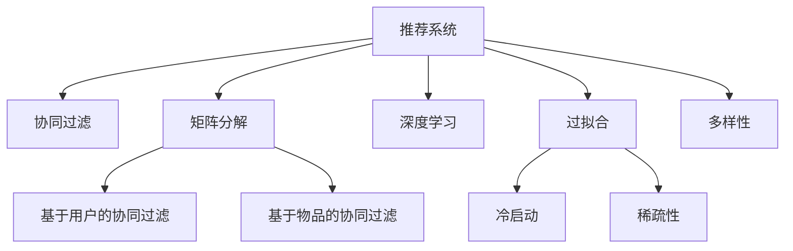

                 

# 推荐系统的局限：过拟合与多样性

> 关键词：推荐系统,过拟合,多样性,协同过滤,矩阵分解,深度学习

## 1. 背景介绍

### 1.1 问题由来
推荐系统在互联网时代发挥着至关重要的作用，通过分析用户的历史行为数据，为用户推荐个性化的商品、内容、服务等，极大地提升了用户体验和满意度。然而，推荐系统在实际应用中也面临着诸多挑战，其中过拟合与多样性问题尤为突出。

过拟合问题指的是推荐系统容易根据用户历史行为数据中的特定模式，生成过于相似或者同质化的推荐结果。随着数据的增多，模型对历史数据的依赖逐渐增强，往往导致对新数据的不适应，从而限制了模型的泛化能力。而多样性问题则是指推荐系统倾向于推荐同质化或热门物品，而忽视了长尾和新颖物品，使得推荐结果缺乏多样性和创新性。

这些问题不仅影响用户体验，还限制了推荐系统的多样性和创新性，迫切需要得到有效的解决。本文将从核心概念与联系、核心算法原理、操作步骤等角度对这些问题进行深入探讨，并提出相应的解决方案。

### 1.2 问题核心关键点
- 过拟合与多样性：推荐系统在实际应用中容易生成同质化推荐结果，限制了推荐结果的多样性，影响用户体验。
- 协同过滤：基于用户行为数据的推荐方法，存在冷启动问题和数据稀疏性问题。
- 矩阵分解：将用户行为数据表示为低维稠密矩阵，通过矩阵分解获取用户-物品关联关系。
- 深度学习：通过神经网络模型学习用户行为数据的复杂特征，提升推荐精度和多样性。

## 2. 核心概念与联系

### 2.1 核心概念概述

为了更好地理解推荐系统的过拟合与多样性问题，本节将介绍几个密切相关的核心概念：

- **推荐系统**：利用用户行为数据，为用户推荐个性化商品、内容、服务等。
- **协同过滤**：基于用户行为数据进行推荐，常见方法包括基于用户的协同过滤和基于物品的协同过滤。
- **矩阵分解**：将用户行为数据表示为低维稠密矩阵，通过矩阵分解获取用户-物品关联关系。
- **深度学习**：通过神经网络模型学习用户行为数据的复杂特征，提升推荐精度和多样性。
- **过拟合**：模型在历史数据上表现良好，但在新数据上表现差，泛化能力不足。
- **多样性**：推荐结果中包含足够多且不同的物品，避免同质化和热门物品的过度推荐。
- **冷启动**：新用户或新物品的推荐问题，由于缺乏足够的历史数据，推荐难度较大。
- **稀疏性**：用户行为数据通常非常稀疏，难以进行有效的推荐。

这些概念之间的逻辑关系可以通过以下Mermaid流程图来展示：



这个流程图展示推荐系统的核心概念及其之间的关系：

1. 推荐系统通过协同过滤、矩阵分解、深度学习等方法，学习用户行为数据，生成个性化推荐。
2. 协同过滤和矩阵分解方法由于冷启动和稀疏性问题，可能面临推荐效果不佳的问题。
3. 深度学习方法可以有效地处理非线性关系，提升推荐精度和多样性，但需要大量数据支持。
4. 过拟合与多样性是推荐系统面临的主要挑战，需要在算法和数据处理上进行改进。

这些概念共同构成了推荐系统的学习和应用框架，使其能够在各种场景下发挥强大的推荐能力。通过理解这些核心概念，我们可以更好地把握推荐系统的设计思路和优化方向。

## 3. 核心算法原理 & 具体操作步骤
### 3.1 算法原理概述

推荐系统的核心算法原理包括协同过滤、矩阵分解和深度学习等方法。这些方法分别从用户行为数据、用户-物品关联矩阵和神经网络模型中，提取特征进行推荐。

协同过滤算法通过分析用户行为数据，获取用户之间的相似性和物品之间的相似性，从而实现个性化推荐。矩阵分解方法将用户行为数据表示为低维稠密矩阵，通过矩阵分解获取用户-物品关联关系，从而进行推荐。深度学习方法通过神经网络模型学习用户行为数据的复杂特征，提升推荐精度和多样性。

### 3.2 算法步骤详解

协同过滤和矩阵分解算法通常包括以下关键步骤：

**Step 1: 准备用户行为数据**
- 收集用户的行为数据，包括浏览、点击、购买等行为。
- 将行为数据转换为用户-物品关联矩阵，每一行表示用户的行为，每一列表示物品的特征。

**Step 2: 矩阵分解**
- 使用矩阵分解算法，如奇异值分解(SVD)，将用户-物品关联矩阵表示为低维稠密矩阵。
- 通过低维矩阵的乘积，计算用户对物品的评分，从而进行推荐。

**Step 3: 协同过滤**
- 根据用户行为数据，计算用户之间的相似性和物品之间的相似性。
- 基于相似性度量，为用户推荐物品或物品推荐用户。

深度学习算法通常包括以下关键步骤：

**Step 1: 准备数据集**
- 收集用户行为数据，并将其表示为向量形式。
- 将数据集分为训练集、验证集和测试集。

**Step 2: 设计神经网络模型**
- 设计输入层、隐藏层和输出层，并选择合适的损失函数和优化器。
- 定义神经网络的参数，包括权重和偏置。

**Step 3: 训练模型**
- 使用训练集数据，通过反向传播算法计算损失函数的梯度。
- 使用优化器更新模型参数，最小化损失函数。
- 在验证集上评估模型性能，避免过拟合。

**Step 4: 测试和应用**
- 使用测试集数据，评估模型的泛化能力和推荐效果。
- 将训练好的模型应用到实际推荐场景中，进行实时推荐。

### 3.3 算法优缺点

协同过滤算法和矩阵分解算法的优缺点如下：

**协同过滤算法**
- 优点：计算效率高，不需要显式表示用户-物品关联关系。
- 缺点：存在冷启动问题和数据稀疏性问题，难以处理新用户和新物品。

**矩阵分解算法**
- 优点：可以有效地处理数据稀疏性问题，适用于大规模数据集。
- 缺点：计算复杂度高，模型需要大量的内存和计算资源。

深度学习算法的优缺点如下：

**深度学习算法**
- 优点：可以处理非线性关系，提升推荐精度和多样性。
- 缺点：需要大量数据支持，计算资源消耗大，容易出现过拟合。

### 3.4 算法应用领域

推荐系统在多个领域得到了广泛的应用，例如：

- 电商推荐：为购物网站用户推荐商品，提升购买转化率。
- 视频推荐：为用户推荐感兴趣的视频内容，提高观看体验。
- 音乐推荐：为用户推荐歌曲和专辑，提升音乐收听满意度。
- 新闻推荐：为用户推荐新闻文章，提升阅读体验。
- 社交推荐：为社交网络用户推荐好友和内容，促进互动。
- 广告推荐：为用户推荐广告内容，提升广告效果。

除了这些经典应用外，推荐系统还被创新性地应用于更多场景中，如内容生成、医疗推荐、智能客服等，为各行业带来了新的突破。

## 4. 数学模型和公式 & 详细讲解
### 4.1 数学模型构建

推荐系统的数学模型构建通常包括用户行为数据的表示和评分预测两部分。

假设用户行为数据表示为 $U \times I$ 的评分矩阵 $R$，其中 $U$ 为用户数，$I$ 为物品数。推荐系统通过计算用户对物品的评分 $r_{ui}$，生成推荐结果。

### 4.2 公式推导过程

推荐系统常用的评分预测方法包括矩阵分解和深度学习。

**矩阵分解**
- 假设用户行为矩阵 $R$ 可以表示为 $U \times I$ 的低维矩阵 $P \times Q$，其中 $P$ 和 $Q$ 分别为用户和物品的潜在因子矩阵。
- 设用户 $u$ 对物品 $i$ 的潜在因子向量为 $\vec{p}_u$ 和 $\vec{q}_i$，则评分预测公式为：
$$
r_{ui} = \vec{p}_u \cdot \vec{q}_i + b
$$
其中 $b$ 为偏置项。

**深度学习**
- 假设用户行为数据 $X_u$ 表示为 $d$ 维向量，物品行为数据 $X_i$ 表示为 $d$ 维向量。
- 设神经网络模型为 $f(X_u, X_i)$，则评分预测公式为：
$$
r_{ui} = f(X_u, X_i)
$$

### 4.3 案例分析与讲解

**案例一：电商推荐系统**
- 假设用户行为数据 $X_u$ 表示为用户购买历史，物品行为数据 $X_i$ 表示为物品的标签。
- 使用深度学习模型进行推荐，设计如下神经网络：
$$
f(X_u, X_i) = X_u \cdot W_{iu} \cdot X_i + b
$$
其中 $W_{iu}$ 为权重矩阵。
- 训练模型时，使用交叉熵损失函数，最小化预测评分与真实评分之间的差异。

**案例二：视频推荐系统**
- 假设用户行为数据 $X_u$ 表示为用户观看的视频时长，物品行为数据 $X_i$ 表示为视频的标签。
- 使用协同过滤算法进行推荐，计算用户 $u$ 对物品 $i$ 的评分：
$$
r_{ui} = \sum_k \alpha_{uk} \beta_{ki}
$$
其中 $\alpha_{uk}$ 为用户 $u$ 对物品 $k$ 的评分，$\beta_{ki}$ 为物品 $k$ 对物品 $i$ 的评分。

## 5. 项目实践：代码实例和详细解释说明
### 5.1 开发环境搭建

在进行推荐系统开发前，我们需要准备好开发环境。以下是使用Python进行PyTorch开发的环境配置流程：

1. 安装Anaconda：从官网下载并安装Anaconda，用于创建独立的Python环境。

2. 创建并激活虚拟环境：
```bash
conda create -n pytorch-env python=3.8 
conda activate pytorch-env
```

3. 安装PyTorch：根据CUDA版本，从官网获取对应的安装命令。例如：
```bash
conda install pytorch torchvision torchaudio cudatoolkit=11.1 -c pytorch -c conda-forge
```

4. 安装TensorFlow：
```bash
pip install tensorflow==2.3
```

5. 安装TensorFlow Serving：
```bash
pip install tensorflow-serving-api
```

6. 安装TensorFlow Serving的Gunicorn Web Server：
```bash
pip install gunicorn==20.0.4
```

完成上述步骤后，即可在`pytorch-env`环境中开始推荐系统的开发。

### 5.2 源代码详细实现

这里以深度学习推荐系统为例，给出使用TensorFlow进行推荐系统的PyTorch代码实现。

首先，定义推荐模型的架构：

```python
import tensorflow as tf
from tensorflow.keras import layers

class RecommendationModel(tf.keras.Model):
    def __init__(self, user_dim, item_dim, hidden_dim):
        super(RecommendationModel, self).__init__()
        self.user_embedding = layers.Embedding(user_dim, hidden_dim, input_length=1)
        self.item_embedding = layers.Embedding(item_dim, hidden_dim, input_length=1)
        self.interaction = layers.Dot(dots='mul')
        
    def call(self, user, item):
        user_embed = self.user_embedding(user)
        item_embed = self.item_embedding(item)
        prediction = self.interaction([user_embed, item_embed])
        return prediction

# 创建模型
model = RecommendationModel(user_dim=1000, item_dim=1000, hidden_dim=128)
model.compile(loss='mean_squared_error', optimizer='adam')
```

然后，定义训练和评估函数：

```python
from tensorflow.keras.preprocessing import sequence

def train_epoch(model, train_data, batch_size, optimizer):
    train_data = sequence.pad_sequences(train_data)
    model.fit(train_data, epochs=1, batch_size=batch_size, verbose=1, callbacks=[optimizer])

def evaluate(model, test_data, batch_size):
    test_data = sequence.pad_sequences(test_data)
    mse = model.evaluate(test_data)
    print(f"Test MSE: {mse:.3f}")
```

最后，启动训练流程并在测试集上评估：

```python
epochs = 5
batch_size = 64

for epoch in range(epochs):
    print(f"Epoch {epoch+1}, training...")
    train_epoch(model, train_data, batch_size, optimizer)
    print(f"Epoch {epoch+1}, evaluating...")
    evaluate(model, test_data, batch_size)
```

以上就是使用TensorFlow对推荐系统进行训练和评估的完整代码实现。可以看到，TensorFlow提供了强大的深度学习框架，可以方便地实现推荐模型的训练和评估。

### 5.3 代码解读与分析

让我们再详细解读一下关键代码的实现细节：

**RecommendationModel类**
- `__init__`方法：定义模型的输入层、隐藏层和输出层。
- `call`方法：定义模型的前向传播过程。

**train_epoch函数**
- 使用 `sequence.pad_sequences` 方法对数据进行填充，保证批处理的一致性。
- 使用 `fit` 方法进行模型训练，设置训练轮数、批处理大小和优化器等参数。

**evaluate函数**
- 使用 `evaluate` 方法进行模型评估，计算预测评分与真实评分之间的均方误差。

**训练流程**
- 定义总的训练轮数和批处理大小，循环迭代
- 每个epoch内，先进行训练，再评估模型性能
- 所有epoch结束后，评估测试集上的模型性能

可以看到，TensorFlow和PyTorch都提供了强大的深度学习框架，可以方便地实现推荐系统的训练和评估。开发者可以根据自己的需求选择合适的框架和模型，快速实现推荐系统。

## 6. 实际应用场景
### 6.1 智能客服系统

推荐系统在智能客服系统中发挥着重要作用，通过分析用户的历史行为数据，为用户推荐个性化的问题解答，提升客户满意度。

在技术实现上，可以收集用户的咨询历史、常见问题等数据，使用协同过滤或矩阵分解方法，为用户推荐最相关的答案。对于新出现的问题，可以结合自然语言处理技术，动态生成或检索推荐答案。如此构建的智能客服系统，能够显著提升客户咨询体验和问题解决效率。

### 6.2 金融风险管理

推荐系统在金融风险管理中也有着重要的应用。通过对用户的历史交易行为和风险偏好进行分析，为用户推荐最合适的金融产品，降低金融风险。

在技术实现上，可以收集用户的历史交易数据、风险偏好、财务状况等数据，使用协同过滤或矩阵分解方法，为用户推荐合适的金融产品。同时，结合深度学习技术，提升推荐模型的准确性和多样性。如此构建的金融推荐系统，能够帮助金融机构更好地管理客户风险，提升客户满意度。

### 6.3 个性化推荐系统

推荐系统在个性化推荐领域有着广泛的应用，通过分析用户的历史行为数据，为用户推荐个性化的商品、内容、服务等。

在技术实现上，可以收集用户的历史浏览、购买、评价等数据，使用协同过滤或矩阵分解方法，为用户推荐最相关的商品或内容。同时，结合深度学习技术，提升推荐模型的精度和多样性。如此构建的个性化推荐系统，能够显著提升用户体验，促进用户购买转化。

### 6.4 未来应用展望

随着推荐系统技术的不断发展，其在多个领域的应用前景广阔。

在智慧医疗领域，推荐系统可以为用户推荐个性化的健康信息，提升医疗服务质量。

在智能教育领域，推荐系统可以为用户推荐个性化的学习内容，提升学习效果。

在智慧城市治理中，推荐系统可以为用户推荐最新的城市事件信息，提升城市管理效率。

此外，在企业生产、社会治理、文娱传媒等众多领域，推荐系统也将不断得到应用，为各行各业带来新的发展机遇。

## 7. 工具和资源推荐
### 7.1 学习资源推荐

为了帮助开发者系统掌握推荐系统的理论基础和实践技巧，这里推荐一些优质的学习资源：

1. 《推荐系统实战》系列博文：由推荐系统专家撰写，深入浅出地介绍了推荐系统的原理、算法和实践。

2. CS223《推荐系统》课程：斯坦福大学开设的推荐系统课程，有Lecture视频和配套作业，带你入门推荐系统领域的基本概念和经典模型。

3. 《推荐系统》书籍：亚马逊公司推出的推荐系统经典书籍，全面介绍了推荐系统的理论、算法和实践。

4. Google Scholar：推荐系统领域的学术论文库，涵盖最新的研究论文和综述文章。

5. Kaggle竞赛：通过参加Kaggle的推荐系统竞赛，实践推荐系统算法，提升实战能力。

通过对这些资源的学习实践，相信你一定能够快速掌握推荐系统的精髓，并用于解决实际的推荐问题。

### 7.2 开发工具推荐

高效的开发离不开优秀的工具支持。以下是几款用于推荐系统开发的常用工具：

1. TensorFlow：由Google主导开发的开源深度学习框架，生产部署方便，适合大规模工程应用。

2. PyTorch：基于Python的开源深度学习框架，灵活动态的计算图，适合快速迭代研究。

3. Spark MLlib：Apache Spark的推荐系统库，支持分布式计算，适合大数据场景。

4. Hadoop YARN：Apache Hadoop的资源管理器，支持大规模数据处理和推荐系统应用。

5. Google Cloud AI Platform：Google提供的推荐系统平台，支持在线模型部署和A/B测试。

合理利用这些工具，可以显著提升推荐系统的开发效率，加快创新迭代的步伐。

### 7.3 相关论文推荐

推荐系统技术的发展源于学界的持续研究。以下是几篇奠基性的相关论文，推荐阅读：

1. The BellKor Algorithm for Bipartite Matching（BellKor算法）：提出了BellKor算法，用于解决大规模协同过滤问题，提升了推荐系统性能。

2. SVD: A Geometric Approach to Recommender System（奇异值分解）：提出奇异值分解方法，将用户行为数据表示为低维稠密矩阵，用于协同过滤和推荐系统。

3. Deep Associative Recommendations using the Layers of Neural Networks（深度推荐系统）：提出深度推荐系统方法，通过神经网络模型学习用户行为数据的复杂特征，提升推荐精度和多样性。

4. Practical Recommendation Systems in Commercial Applications：介绍了推荐系统在商业应用中的实践经验，提供了推荐系统应用的最佳实践。

这些论文代表了大规模推荐系统技术的发展脉络。通过学习这些前沿成果，可以帮助研究者把握学科前进方向，激发更多的创新灵感。

## 8. 总结：未来发展趋势与挑战

### 8.1 总结

本文对推荐系统的过拟合与多样性问题进行了全面系统的介绍。首先阐述了推荐系统在实际应用中容易生成同质化推荐结果的问题，明确了过拟合与多样性在推荐系统中的核心地位。其次，从核心概念到实际操作，详细讲解了协同过滤、矩阵分解和深度学习等推荐算法，并给出了具体的代码实现。同时，本文还广泛探讨了推荐系统在智能客服、金融风险管理、个性化推荐等多个行业领域的应用前景，展示了推荐系统的巨大潜力。此外，本文精选了推荐系统的各类学习资源，力求为读者提供全方位的技术指引。

通过本文的系统梳理，可以看到，推荐系统在推荐结果多样性方面仍面临诸多挑战。如何在大规模数据下，平衡推荐精度和多样性，避免同质化和热门物品的过度推荐，将成为推荐系统发展的关键。

### 8.2 未来发展趋势

展望未来，推荐系统的技术将呈现以下几个发展趋势：

1. 数据驱动与算法协同：推荐系统将更加注重数据驱动和算法优化，通过数据增强和算法创新，提升推荐效果。

2. 模型融合与混合推荐：推荐系统将融合多种算法，构建混合推荐模型，提升推荐精度和多样性。

3. 深度学习与强化学习结合：推荐系统将结合深度学习和强化学习技术，提升推荐模型的自适应能力和个性化水平。

4. 动态推荐与实时学习：推荐系统将采用实时学习技术，动态调整推荐策略，提升推荐效果。

5. 跨模态推荐：推荐系统将融合图像、语音、文本等多模态信息，提升推荐模型的综合能力和应用范围。

以上趋势凸显了推荐系统的广阔前景。这些方向的探索发展，必将进一步提升推荐系统的推荐效果和应用范围，为推荐系统的落地应用带来新的突破。

### 8.3 面临的挑战

尽管推荐系统技术已经取得了瞩目成就，但在迈向更加智能化、普适化应用的过程中，它仍面临着诸多挑战：

1. 数据质量瓶颈。推荐系统依赖高质量的标注数据和用户行为数据，数据的缺失、噪声和偏差都将影响推荐效果。如何提高数据质量，优化数据处理流程，将是重要的研究方向。

2. 推荐算法瓶颈。推荐算法需要在大规模数据上进行训练和预测，计算复杂度高，容易发生过拟合和冷启动问题。如何设计高效的算法，提升推荐模型的泛化能力和冷启动性能，将是重要的研究课题。

3. 个性化瓶颈。推荐系统面临多样性不足的问题，难以推荐新颖和多样化的物品。如何提升推荐模型的个性化水平，避免热门物品的过度推荐，将是重要的研究方向。

4. 隐私和安全瓶颈。推荐系统需要处理大量用户隐私数据，如何保护用户隐私，避免数据泄露和滥用，将是重要的研究课题。

5. 公平性瓶颈。推荐系统容易产生推荐偏差，导致部分用户群体被歧视。如何确保推荐系统的公平性，避免推荐偏差，将是重要的研究课题。

6. 跨领域适应瓶颈。推荐系统通常面向特定领域，如何构建通用的推荐模型，适应不同领域的用户行为数据，将是重要的研究课题。

正视推荐系统面临的这些挑战，积极应对并寻求突破，将使推荐系统走向成熟的框架。相信随着学界和产业界的共同努力，这些挑战终将一一被克服，推荐系统必将在推荐效果的提升和应用范围的拓展中发挥更大的作用。

### 8.4 研究展望

面对推荐系统面临的诸多挑战，未来的研究需要在以下几个方面寻求新的突破：

1. 优化数据质量。通过数据清洗、数据增强和数据合成等方法，提升推荐系统所需数据的质量和多样性，确保推荐模型的泛化能力和鲁棒性。

2. 设计高效算法。结合深度学习、协同过滤和强化学习等算法，构建混合推荐模型，提升推荐系统的精度和多样性。同时，优化模型训练和预测算法，提高推荐效率和实时性。

3. 增强个性化水平。结合用户行为数据和专家知识，构建个性化推荐模型，提升推荐系统的个性化水平，避免热门物品的过度推荐。

4. 保护用户隐私。结合隐私保护技术和推荐系统，构建隐私保护推荐模型，保护用户隐私，避免数据泄露和滥用。

5. 确保公平性。结合公平性评估指标和推荐算法，构建公平性推荐模型，确保推荐系统的公平性和公正性。

6. 适应跨领域应用。结合跨领域推荐模型和跨领域推荐策略，构建通用的推荐系统，适应不同领域的用户行为数据，提升推荐系统的应用范围。

这些研究方向的探索，必将引领推荐系统技术迈向更高的台阶，为推荐系统的发展提供新的思路和方向。总之，推荐系统需要在数据质量、算法设计、个性化水平、隐私保护、公平性以及跨领域适应等方面进行深入研究，才能在实际应用中发挥更大的作用，更好地满足用户需求。

## 9. 附录：常见问题与解答

**Q1：如何缓解推荐系统中的过拟合问题？**

A: 过拟合是推荐系统面临的主要挑战之一，缓解过拟合问题的方法包括：

1. 数据增强：通过数据增强技术，扩充训练集，提升模型泛化能力。

2. 正则化：通过L2正则、Dropout等正则化技术，避免模型过拟合。

3. 模型融合：结合多种推荐算法，构建混合推荐模型，提升模型泛化能力。

4. 参数共享：通过参数共享技术，减少模型的参数量，提升模型的泛化能力。

5. 在线学习：通过在线学习技术，实时更新模型，避免模型过拟合。

**Q2：推荐系统在应用中如何平衡推荐精度和多样性？**

A: 推荐系统需要在推荐精度和多样性之间找到平衡点，具体方法包括：

1. 设置多样性约束：通过多样性约束，确保推荐结果中包含一定比例的新物品，避免热门物品的过度推荐。

2. 引入负采样：通过负采样技术，引入负物品，提升推荐结果的多样性。

3. 结合专家知识：通过专家知识，提升推荐系统的多样性和个性化水平。

4. 动态调整推荐策略：通过实时学习技术，动态调整推荐策略，提升推荐效果。

**Q3：推荐系统在推荐过程中如何避免热门物品的过度推荐？**

A: 推荐系统可以通过以下方法避免热门物品的过度推荐：

1. 设置多样性约束：通过多样性约束，确保推荐结果中包含一定比例的新物品，避免热门物品的过度推荐。

2. 引入负采样：通过负采样技术，引入负物品，提升推荐结果的多样性。

3. 动态调整推荐策略：通过实时学习技术，动态调整推荐策略，提升推荐效果。

4. 结合专家知识：通过专家知识，提升推荐系统的多样性和个性化水平。

**Q4：推荐系统在推荐过程中如何保护用户隐私？**

A: 推荐系统可以通过以下方法保护用户隐私：

1. 数据匿名化：通过数据匿名化技术，保护用户隐私，避免数据泄露。

2. 差分隐私：通过差分隐私技术，保护用户隐私，避免数据滥用。

3. 本地推荐：通过本地推荐技术，避免用户隐私泄露到第三方平台。

4. 分布式推荐：通过分布式推荐技术，避免用户隐私泄露到中心服务器。

**Q5：推荐系统在推荐过程中如何确保公平性？**

A: 推荐系统可以通过以下方法确保公平性：

1. 公平性评估：通过公平性评估指标，评估推荐系统的公平性，避免推荐偏差。

2. 公平性约束：通过公平性约束，确保推荐系统的公平性和公正性。

3. 公平性优化：通过公平性优化技术，提升推荐系统的公平性。

4. 公平性监控：通过公平性监控技术，实时监控推荐系统的公平性，及时进行调整。

这些方法可以帮助推荐系统在推荐过程中保护用户隐私，确保公平性，提升推荐效果。

---

作者：禅与计算机程序设计艺术 / Zen and the Art of Computer Programming

