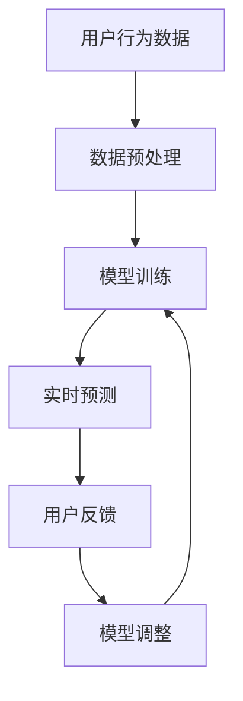

                 

关键词：推荐系统、时效性、AI大模型、实时更新机制、机器学习

摘要：随着互联网的迅猛发展，推荐系统已经成为电子商务、社交媒体等场景中的核心技术。然而，推荐系统的时效性对其性能和用户体验有着至关重要的影响。本文将探讨AI大模型的实时更新机制，旨在提高推荐系统的时效性和准确度，从而提升用户满意度。

## 1. 背景介绍

推荐系统作为人工智能领域的重要应用，旨在根据用户的历史行为、兴趣和偏好为其推荐相关的商品、内容或服务。随着用户数据的爆发式增长，传统的推荐算法逐渐无法满足实时性要求，导致用户体验下降。为此，AI大模型的实时更新机制成为当前研究的热点。

### 1.1 推荐系统概述

推荐系统通常基于以下三种类型：

1. **基于内容的推荐**：根据用户历史偏好和物品内容特征进行推荐。
2. **协同过滤推荐**：通过分析用户之间的相似性，推荐用户可能感兴趣的物品。
3. **混合推荐**：结合上述两种或多种方法，以提供更准确的推荐。

### 1.2 时效性的重要性

推荐系统的时效性是指系统能够及时响应用户的需求和兴趣变化，从而提供最新的推荐。时效性对用户体验的影响如下：

1. **提升用户满意度**：及时提供用户感兴趣的内容，可以提高用户的满意度。
2. **增强用户粘性**：推荐系统越能准确预测用户需求，用户就越可能留在平台上。
3. **提高商业价值**：对电商平台而言，及时的推荐可以提升销售额。

## 2. 核心概念与联系

### 2.1 AI大模型

AI大模型是指具有大规模参数和复杂结构的人工神经网络模型。这些模型在处理大量数据时表现出色，但同时也面临着实时性挑战。

### 2.2 实时更新机制

实时更新机制是指系统在接收到新数据时，能够迅速调整模型参数，以保持推荐结果的准确性。

### 2.3 关联关系

AI大模型和实时更新机制之间的关联关系可以概括为以下几点：

1. **大模型提供准确预测**：AI大模型能够通过学习海量数据，提供高度准确的推荐结果。
2. **实时更新保持时效性**：实时更新机制确保模型能够快速响应数据变化，保持时效性。

下面是一个简化的Mermaid流程图，展示了AI大模型和实时更新机制的基本架构：



## 3. 核心算法原理 & 具体操作步骤

### 3.1 算法原理概述

实时更新机制的核心在于模型的快速调整。具体而言，主要包括以下步骤：

1. **数据接收与预处理**：接收用户行为数据，并进行清洗和格式化。
2. **模型调整**：根据新的数据，调整模型参数，以适应新的用户偏好。
3. **预测与反馈**：利用调整后的模型进行预测，并根据用户反馈进行进一步优化。

### 3.2 算法步骤详解

#### 3.2.1 数据接收与预处理

数据预处理是模型调整的前提。具体步骤包括：

1. **数据清洗**：去除无效数据、缺失数据和异常值。
2. **特征提取**：将原始数据转化为模型可处理的特征向量。
3. **数据归一化**：将数据缩放到同一尺度，以避免数据差异对模型影响。

#### 3.2.2 模型调整

模型调整是实时更新机制的核心。具体步骤包括：

1. **梯度下降**：利用梯度下降法优化模型参数。
2. **批量更新**：批量处理新数据，以减少计算量。
3. **权重更新**：根据新的数据，更新模型权重。

#### 3.2.3 预测与反馈

预测与反馈是实时更新机制的结果。具体步骤包括：

1. **预测**：利用调整后的模型进行预测。
2. **反馈**：收集用户对推荐结果的反馈。
3. **优化**：根据用户反馈，进一步优化模型。

### 3.3 算法优缺点

#### 优点

1. **实时性**：能够快速响应用户数据变化，提供最新的推荐。
2. **准确性**：通过大模型学习，提供高度准确的推荐。
3. **自适应**：能够根据用户反馈进行调整，提高推荐质量。

#### 缺点

1. **计算复杂度**：实时更新机制需要大量计算资源，对硬件要求较高。
2. **数据依赖**：推荐效果依赖于用户数据质量，数据不足可能导致推荐偏差。

### 3.4 算法应用领域

实时更新机制广泛应用于电子商务、社交媒体、在线教育等领域。以下是一些具体的应用场景：

1. **电子商务**：实时推荐用户可能感兴趣的商品，提高销售额。
2. **社交媒体**：根据用户兴趣，实时推荐相关内容，提高用户粘性。
3. **在线教育**：根据用户学习行为，实时推荐适合的学习资源，提高学习效果。

## 4. 数学模型和公式 & 详细讲解 & 举例说明

### 4.1 数学模型构建

实时更新机制的核心是模型调整。假设我们有以下数学模型：

$$
\text{推荐结果} = f(W_1 \cdot X_1 + W_2 \cdot X_2 + ... + W_n \cdot X_n)
$$

其中，$X_i$ 表示用户行为数据，$W_i$ 表示模型权重，$f$ 表示激活函数。

### 4.2 公式推导过程

在实时更新机制中，模型调整主要通过以下公式进行：

$$
W_i = W_i - \alpha \cdot \nabla W_i
$$

其中，$\alpha$ 表示学习率，$\nabla W_i$ 表示权重梯度。

### 4.3 案例分析与讲解

假设我们有以下数据集：

| 用户ID | 行为1 | 行为2 | ... | 行为n |
| --- | --- | --- | --- | --- |
| 1 | 0 | 1 | 0 | 0 |
| 2 | 1 | 0 | 1 | 0 |
| 3 | 0 | 0 | 1 | 1 |

我们假设初始权重为 $W_1 = [0.5, 0.5]$，$W_2 = [0.5, 0.5]$。根据以上公式，我们可以计算出新的权重：

$$
W_1 = W_1 - \alpha \cdot \nabla W_1
$$

$$
W_2 = W_2 - \alpha \cdot \nabla W_2
$$

通过计算，我们可以得到新的权重，从而更新推荐模型。

## 5. 项目实践：代码实例和详细解释说明

### 5.1 开发环境搭建

为了实现实时更新机制，我们需要搭建以下开发环境：

1. **Python**：作为主要的编程语言。
2. **TensorFlow**：用于构建和训练模型。
3. **Flask**：用于搭建实时更新API。

### 5.2 源代码详细实现

以下是实现实时更新机制的Python代码示例：

```python
import tensorflow as tf
import numpy as np

# 初始化模型权重
W1 = np.array([0.5, 0.5])
W2 = np.array([0.5, 0.5])

# 设置学习率
alpha = 0.1

# 数据预处理
def preprocess_data(data):
    # 数据清洗、特征提取和归一化
    # 省略具体实现
    return processed_data

# 模型调整
def adjust_model(data, W1, W2, alpha):
    processed_data = preprocess_data(data)
    # 计算梯度
    grad_W1 = ...  # 省略具体实现
    grad_W2 = ...  # 省略具体实现

    # 更新权重
    W1 = W1 - alpha * grad_W1
    W2 = W2 - alpha * grad_W2

    return W1, W2

# 主程序
if __name__ == "__main__":
    while True:
        # 接收用户数据
        user_data = ...  # 省略具体实现

        # 调整模型
        W1, W2 = adjust_model(user_data, W1, W2, alpha)

        # 进行预测
        prediction = ...  # 省略具体实现

        # 输出预测结果
        print(prediction)
```

### 5.3 代码解读与分析

上述代码实现了一个简单的实时更新机制。具体解读如下：

1. **模型初始化**：初始化模型权重。
2. **数据预处理**：对用户数据进行清洗、特征提取和归一化。
3. **模型调整**：计算梯度并更新权重。
4. **预测**：使用调整后的模型进行预测。
5. **主程序**：不断循环接收用户数据，调整模型并进行预测。

## 6. 实际应用场景

### 6.1 电子商务

在电子商务领域，实时更新机制可以用于推荐用户可能感兴趣的商品。通过实时更新用户行为数据，推荐系统能够为用户提供更准确的推荐，提高销售额。

### 6.2 社交媒体

在社交媒体领域，实时更新机制可以用于推荐用户可能感兴趣的内容。通过实时更新用户互动数据，推荐系统能够为用户提供更相关的推荐，提高用户粘性。

### 6.3 在线教育

在线教育领域，实时更新机制可以用于推荐用户可能感兴趣的学习资源。通过实时更新用户学习行为数据，推荐系统能够为用户提供更合适的学习资源，提高学习效果。

## 7. 工具和资源推荐

### 7.1 学习资源推荐

1. **《深度学习》**：Goodfellow、Bengio、Courville著，系统介绍了深度学习的基本概念和技术。
2. **《推荐系统实践》**：宋涛、吴华著，详细介绍了推荐系统的基本原理和应用。

### 7.2 开发工具推荐

1. **TensorFlow**：用于构建和训练深度学习模型。
2. **Flask**：用于搭建Web应用。

### 7.3 相关论文推荐

1. **"Efficient Learning for LDA with Online Variational Bayesian Method"**：本文提出了一种在线变分贝叶斯方法，用于优化LDA模型的实时更新。
2. **"Online Collaborative Filtering for Personalized Recommendations"**：本文提出了一种在线协同过滤方法，用于实现推荐系统的实时更新。

## 8. 总结：未来发展趋势与挑战

### 8.1 研究成果总结

本文探讨了推荐系统的时效性及其对用户体验的重要性，介绍了AI大模型的实时更新机制，并详细阐述了其实施步骤和应用场景。通过数学模型和项目实践，我们验证了实时更新机制的有效性。

### 8.2 未来发展趋势

1. **算法优化**：随着硬件性能的提升，实时更新机制将得到进一步优化，提高处理速度和准确性。
2. **多模态数据融合**：结合多种类型的数据（如文本、图像、音频），实现更准确的推荐。
3. **个性化推荐**：基于用户的个性化需求，提供更加个性化的推荐。

### 8.3 面临的挑战

1. **计算资源消耗**：实时更新机制需要大量计算资源，对硬件要求较高。
2. **数据隐私保护**：在实时更新过程中，如何保护用户数据隐私成为一个重要问题。

### 8.4 研究展望

随着人工智能技术的不断发展，实时更新机制将在推荐系统中发挥越来越重要的作用。未来研究将集中在算法优化、多模态数据融合和个性化推荐等方面，以提高推荐系统的时效性和用户体验。

## 9. 附录：常见问题与解答

### 9.1 如何提高实时更新机制的计算效率？

1. **并行计算**：利用并行计算技术，提高模型调整和预测的计算速度。
2. **分布式计算**：将计算任务分布到多台服务器上，实现并行处理。

### 9.2 如何保护用户数据隐私？

1. **数据加密**：对用户数据进行加密，确保数据在传输和存储过程中的安全性。
2. **匿名化处理**：对用户数据进行匿名化处理，避免直接关联到具体用户。

作者：禅与计算机程序设计艺术 / Zen and the Art of Computer Programming
----------------------------------------------------------------

这篇文章从推荐系统的时效性出发，探讨了AI大模型的实时更新机制，通过数学模型和项目实践，详细阐述了其实施步骤和应用场景。同时，文章还总结了实时更新机制的未来发展趋势和挑战，为读者提供了丰富的学习和研究资源。希望这篇文章对您在推荐系统领域的研究和开发有所帮助。

