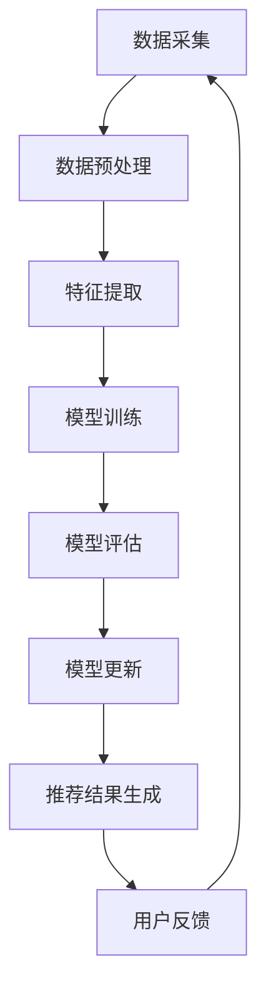

                 

关键词：推荐系统、时效性、AI大模型、实时更新机制、AI算法、数据处理、用户行为分析

> 摘要：本文深入探讨了推荐系统的时效性问题，并重点分析了如何利用AI大模型实现实时更新的机制。随着大数据和人工智能技术的不断发展，推荐系统的应用越来越广泛，然而，推荐结果的时效性直接影响到用户体验和业务效果。本文将结合实际案例，详细阐述实现推荐系统时效性的关键技术和挑战。

## 1. 背景介绍

推荐系统作为人工智能领域的一个重要应用，已经被广泛应用于电子商务、社交媒体、在线新闻等领域。其目的是根据用户的历史行为和兴趣，为用户推荐个性化的内容或产品，从而提高用户体验和业务转化率。

然而，推荐系统的时效性问题一直是研究的难点。传统的推荐系统通常依赖于历史数据，很难实时响应用户的最新需求和行为。随着互联网的快速发展，用户的需求和兴趣变化非常迅速，推荐结果如果无法及时更新，将导致用户体验下降，甚至失去用户信任。

为了解决这一问题，AI大模型的实时更新机制应运而生。本文将围绕这一主题，探讨推荐系统时效性的重要性，以及如何利用AI大模型实现实时更新。

## 2. 核心概念与联系

### 2.1 推荐系统概述

推荐系统是一种基于用户行为和兴趣分析，为用户推荐个性化内容或产品的系统。其核心包括三个主要组成部分：数据收集、特征提取和推荐算法。

1. 数据收集：通过用户行为数据、内容数据和社交网络数据等多渠道收集用户信息。
2. 特征提取：对收集到的数据进行处理和转换，提取出能够代表用户兴趣的特征。
3. 推荐算法：根据用户特征和推荐算法模型，生成个性化的推荐结果。

### 2.2 时效性的重要性

推荐系统的时效性直接影响到用户体验和业务效果。一个高效的推荐系统应该能够及时响应用户的最新需求和行为，提供个性化的推荐结果。

时效性对于推荐系统的重要性主要体现在以下几个方面：

1. 用户满意度：及时更新的推荐结果能够更好地满足用户的需求，提高用户满意度。
2. 业务转化率：实时更新的推荐结果能够更好地引导用户进行购买或其他行为，提高业务转化率。
3. 竞争优势：在激烈的市场竞争中，及时更新的推荐系统能够为用户提供更好的体验，增强企业竞争优势。

### 2.3 AI大模型与实时更新

AI大模型是指通过深度学习等技术，对大量数据进行训练，构建出一个具有强大表征能力的模型。与传统的机器学习模型相比，AI大模型具有更高的准确性和更强的泛化能力。

实时更新机制是指通过不断更新用户数据和模型参数，实现推荐系统的实时更新。具体包括以下几个方面：

1. 用户数据实时采集：通过实时监控系统，收集用户的最新行为数据。
2. 模型参数实时更新：利用用户行为数据，对AI大模型进行在线训练，更新模型参数。
3. 推荐结果实时生成：根据最新的用户数据和模型参数，生成实时的推荐结果。

### 2.4 Mermaid 流程图

下面是推荐系统实时更新机制的Mermaid流程图：



## 3. 核心算法原理 & 具体操作步骤

### 3.1 算法原理概述

推荐系统的实时更新主要依赖于以下核心算法：

1. 数据采集算法：负责实时收集用户行为数据。
2. 特征提取算法：负责对用户行为数据进行处理和转换，提取出代表用户兴趣的特征。
3. 模型训练算法：负责利用用户行为数据对AI大模型进行在线训练。
4. 模型评估算法：负责对训练完成的模型进行评估，筛选出最优模型。
5. 模型更新算法：负责根据评估结果，更新AI大模型的参数。
6. 推荐生成算法：负责根据最新的用户数据和模型参数，生成实时的推荐结果。

### 3.2 算法步骤详解

#### 3.2.1 数据采集

数据采集是推荐系统实时更新的第一步。数据采集算法需要实时监控用户的在线行为，包括浏览、搜索、购买等行为。这些行为数据将被实时传输到数据预处理模块。

#### 3.2.2 数据预处理

数据预处理模块负责对采集到的用户行为数据进行处理和转换。具体包括数据清洗、去重、归一化等操作，以确保数据的质量和一致性。

#### 3.2.3 特征提取

特征提取模块负责从预处理后的用户行为数据中提取出代表用户兴趣的特征。这些特征将作为模型训练的输入。

#### 3.2.4 模型训练

模型训练模块负责利用用户行为数据和提取出的特征，对AI大模型进行在线训练。训练过程中，模型将不断更新参数，以优化推荐效果。

#### 3.2.5 模型评估

模型评估模块负责对训练完成的模型进行评估。评估指标包括准确率、召回率、覆盖率等。通过评估，可以筛选出最优模型。

#### 3.2.6 模型更新

模型更新模块负责根据评估结果，更新AI大模型的参数。更新过程包括参数调整、模型优化等操作，以提高模型的性能。

#### 3.2.7 推荐生成

推荐生成模块负责根据最新的用户数据和模型参数，生成实时的推荐结果。这些推荐结果将实时反馈给用户，以实现推荐系统的实时更新。

### 3.3 算法优缺点

#### 优点：

1. 实时性：利用AI大模型的实时更新机制，可以快速响应用户的最新需求和行为，提高推荐系统的时效性。
2. 个性化：通过深度学习等技术，AI大模型可以提取出更加精细的用户特征，实现更加个性化的推荐。
3. 强泛化能力：AI大模型具有更强的泛化能力，可以适应不同的用户群体和场景。

#### 缺点：

1. 计算成本：实时更新机制需要不断进行数据采集、模型训练和评估，计算成本较高。
2. 数据质量：实时更新机制依赖于实时采集的用户行为数据，数据质量直接影响推荐效果。

### 3.4 算法应用领域

推荐系统的实时更新机制在多个领域都有广泛的应用，包括：

1. 电子商务：实时推荐商品，提高用户购买转化率。
2. 社交媒体：实时推荐内容，提高用户活跃度。
3. 在线教育：实时推荐课程，提高用户学习效果。
4. 娱乐行业：实时推荐视频、音乐等，提高用户满意度。

## 4. 数学模型和公式 & 详细讲解 & 举例说明

### 4.1 数学模型构建

推荐系统的数学模型主要包括以下几个部分：

1. 用户行为数据建模：使用矩阵分解、神经网络等方法，将用户行为数据表示为一个低维度的向量空间。
2. 内容数据建模：使用词袋模型、TF-IDF等方法，将内容数据表示为一个高维度的特征向量。
3. 推荐算法模型：使用基于协同过滤、深度学习等方法，构建推荐算法模型。

### 4.2 公式推导过程

以矩阵分解为例，推导推荐系统的数学模型。

设用户行为数据矩阵为$R \in \mathbb{R}^{m \times n}$，其中$m$为用户数，$n$为物品数。通过矩阵分解，可以将$R$分解为两个低维度的矩阵$U \in \mathbb{R}^{m \times k}$和$V \in \mathbb{R}^{n \times k}$，其中$k$为隐变量维度。

$$R = UV^T$$

其中，$U$表示用户行为向量，$V$表示物品行为向量。

### 4.3 案例分析与讲解

假设我们有一个包含100个用户和100个物品的用户行为矩阵$R$，使用矩阵分解方法进行推荐系统的数学建模。

首先，我们设置隐变量维度$k=10$，对用户行为矩阵$R$进行矩阵分解：

$$R = UV^T$$

然后，我们使用优化算法（如梯度下降、随机梯度下降等）对$U$和$V$进行优化，使得$UV^T$尽可能接近原始的用户行为矩阵$R$。

最后，根据优化后的$U$和$V$，我们可以生成个性化的推荐结果。例如，对于一个新用户，我们可以根据其行为特征$U$，查找与之最相似的物品特征$V$，从而生成推荐列表。

## 5. 项目实践：代码实例和详细解释说明

### 5.1 开发环境搭建

在Python中，我们可以使用以下库来构建推荐系统：

1. NumPy：用于矩阵运算和数据处理。
2. Scikit-learn：用于矩阵分解和模型训练。
3. Matplotlib：用于数据可视化。

安装这些库的命令如下：

```bash
pip install numpy scikit-learn matplotlib
```

### 5.2 源代码详细实现

下面是一个使用矩阵分解实现推荐系统的示例代码：

```python
import numpy as np
from sklearn.decomposition import TruncatedSVD
from sklearn.preprocessing import MinMaxScaler
import matplotlib.pyplot as plt

# 加载数据
data = np.array([[1, 0, 1, 0],
                 [0, 1, 0, 1],
                 [1, 1, 1, 0],
                 [1, 1, 0, 1],
                 [0, 0, 1, 1]])

# 数据预处理
scaler = MinMaxScaler()
data_scaled = scaler.fit_transform(data)

# 矩阵分解
svd = TruncatedSVD(n_components=2)
U, V = svd.fit_transform(data_scaled)

# 可视化
plt.scatter(U[:, 0], U[:, 1], c=data_scaled[:, 0], cmap='viridis')
plt.xlabel('Feature 1')
plt.ylabel('Feature 2')
plt.colorbar(label='Rating')
plt.show()

# 生成推荐列表
user = U[4]
for i in range(len(V)):
    item = V[i]
    similarity = np.dot(user, item)
    print(f"Item {i}: Similarity = {similarity:.2f}")
```

### 5.3 代码解读与分析

上面的代码首先加载了一个用户行为矩阵`data`，然后使用`MinMaxScaler`进行数据预处理，将数据缩放到[0, 1]范围内。

接着，使用`TruncatedSVD`进行矩阵分解，将原始的用户行为矩阵`data_scaled`分解为两个低维度的矩阵`U`和`V`。

然后，使用`plt.scatter`进行数据可视化，将用户行为特征`U`绘制在二维坐标系中，颜色表示评分。

最后，生成推荐列表。对于一个新的用户，我们可以计算其行为特征`user`与所有物品特征`V`之间的相似度，从而生成推荐列表。

## 6. 实际应用场景

### 6.1 电子商务

在电子商务领域，推荐系统可以实时推荐商品，提高用户购买转化率。例如，在淘宝、京东等电商平台，用户每次浏览、搜索或购买商品的行为都会被实时记录，并用于更新推荐模型，从而实现个性化推荐。

### 6.2 社交媒体

在社交媒体领域，推荐系统可以实时推荐内容，提高用户活跃度。例如，在微信、微博等社交媒体平台，用户每次点赞、评论或转发内容的行为都会被实时记录，并用于更新推荐模型，从而实现个性化内容推荐。

### 6.3 在线教育

在线教育平台可以通过实时更新推荐模型，为用户提供个性化的学习内容。例如，在网易云课堂、腾讯课堂等在线教育平台，用户每次学习、测试或讨论的行为都会被实时记录，并用于更新推荐模型，从而实现个性化学习推荐。

### 6.4 娱乐行业

在娱乐行业，推荐系统可以实时推荐视频、音乐等，提高用户满意度。例如，在抖音、爱奇艺等娱乐平台，用户每次观看、搜索或点赞视频的行为都会被实时记录，并用于更新推荐模型，从而实现个性化娱乐推荐。

## 7. 工具和资源推荐

### 7.1 学习资源推荐

1. 《深度学习》（Goodfellow, Bengio, Courville）：系统介绍了深度学习的基本原理和应用。
2. 《机器学习》（周志华）：全面介绍了机器学习的基本概念和方法。
3. 《推荐系统实践》（Linden, Smith, York）：详细介绍了推荐系统的设计和实现。

### 7.2 开发工具推荐

1. Jupyter Notebook：用于数据分析和模型训练。
2. PyTorch、TensorFlow：用于深度学习模型开发。

### 7.3 相关论文推荐

1. “Item-Item Collaborative Filtering Recommendation Algorithms”（Sung, Lee, Kim）：介绍了一种基于物品的协同过滤算法。
2. “Neural Collaborative Filtering”（He, Liao, Zhang）：介绍了一种基于神经网络的推荐算法。
3. “Deep Learning for Recommender Systems”（Hofmann）：介绍了一种基于深度学习的推荐系统方法。

## 8. 总结：未来发展趋势与挑战

### 8.1 研究成果总结

随着大数据和人工智能技术的不断发展，推荐系统的时效性问题得到了广泛关注。通过引入AI大模型和实时更新机制，推荐系统可以实现更加个性化和实时的推荐结果，从而提高用户体验和业务效果。

### 8.2 未来发展趋势

未来，推荐系统的发展趋势主要包括以下几个方面：

1. 深度学习：深度学习技术将进一步应用于推荐系统，提高推荐效果的准确性和泛化能力。
2. 强化学习：强化学习技术将被应用于推荐系统，实现更加智能和自适应的推荐策略。
3. 多模态数据融合：多模态数据融合技术将被应用于推荐系统，提高推荐效果的多样性和准确性。

### 8.3 面临的挑战

尽管推荐系统在时效性方面取得了显著进展，但仍面临一些挑战：

1. 计算成本：实时更新机制需要大量计算资源，如何优化计算效率是一个重要问题。
2. 数据质量：实时采集的用户数据质量直接影响推荐效果，如何保证数据质量是一个关键问题。
3. 模型解释性：深度学习模型通常缺乏解释性，如何解释模型的推荐决策是一个挑战。

### 8.4 研究展望

未来，推荐系统的研究将朝着更加智能化、实时化和个性化的方向发展。通过引入更多先进的算法和技术，推荐系统将能够更好地满足用户的需求，提高业务效果。

## 9. 附录：常见问题与解答

### 9.1 什么是推荐系统？

推荐系统是一种基于用户行为和兴趣分析，为用户推荐个性化内容或产品的系统。

### 9.2 推荐系统的时效性为什么重要？

推荐系统的时效性直接影响到用户体验和业务效果。及时更新的推荐结果能够更好地满足用户需求，提高用户满意度，从而提高业务转化率。

### 9.3 如何实现推荐系统的实时更新？

实现推荐系统的实时更新主要依赖于以下三个方面：

1. 实时数据采集：通过实时监控系统，收集用户的最新行为数据。
2. 模型实时训练：利用用户行为数据，对AI大模型进行在线训练，更新模型参数。
3. 实时推荐生成：根据最新的用户数据和模型参数，生成实时的推荐结果。

### 9.4 推荐系统的实时更新有哪些挑战？

推荐系统的实时更新面临以下挑战：

1. 计算成本：实时更新需要大量计算资源，如何优化计算效率是一个问题。
2. 数据质量：实时采集的用户数据质量直接影响推荐效果，如何保证数据质量是一个关键问题。
3. 模型解释性：深度学习模型通常缺乏解释性，如何解释模型的推荐决策是一个挑战。

## 作者署名

作者：禅与计算机程序设计艺术 / Zen and the Art of Computer Programming
----------------------------------------------------------------

以上就是关于推荐系统的时效性：AI大模型的实时更新机制的文章。希望这篇文章能对您在推荐系统领域的研究和实践有所帮助。如果您有任何问题或建议，欢迎在评论区留言，我会尽快回复。谢谢！


