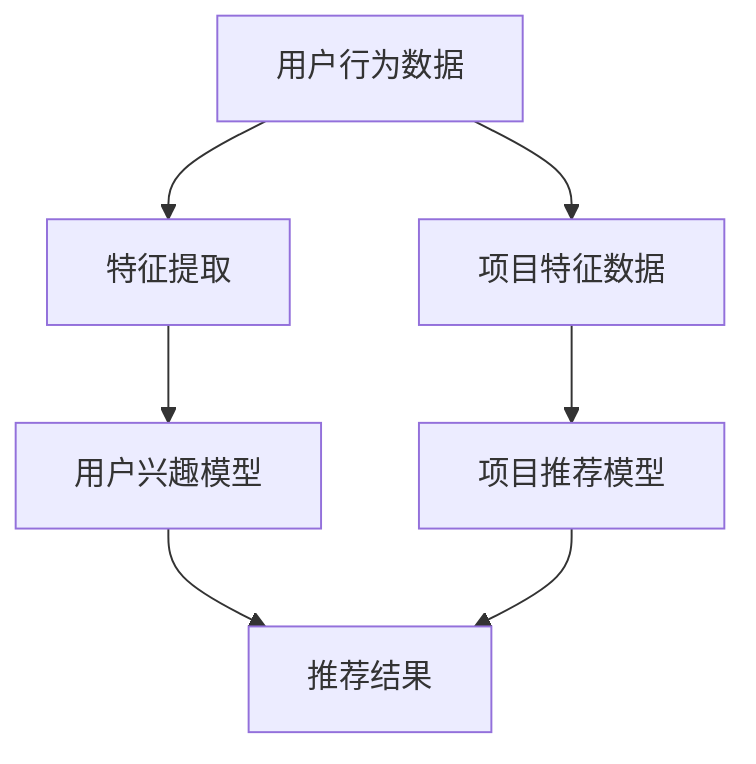

                 

关键词：推荐系统、大模型、未来趋势、人工智能、深度学习、数据驱动、用户行为分析、个性化推荐、机器学习

## 摘要

随着大数据和人工智能技术的快速发展，推荐系统已经成为互联网企业获取用户黏性和提升业务收益的重要工具。本文将深入探讨推荐系统的未来发展趋势，特别是大模型在推荐系统中的主导作用。文章首先回顾了推荐系统的发展历程，然后详细分析了大模型在推荐系统中的作用原理、优势与挑战，并举例说明了大模型在实际应用中的具体操作步骤和实现方法。最后，文章展望了推荐系统在未来的应用前景，提出了可能面临的挑战以及研究展望。

## 1. 背景介绍

推荐系统起源于20世纪90年代，随着互联网的兴起和电子商务的发展，推荐系统开始应用于电子商务平台。早期推荐系统主要基于基于内容的过滤（Content-Based Filtering）和协同过滤（Collaborative Filtering）两种基本方法。基于内容的过滤方法通过分析用户的历史行为和兴趣，推荐与用户兴趣相关的项目。协同过滤方法则通过分析用户之间的相似性，预测用户对未知项目的评分。

进入21世纪，推荐系统得到了迅猛发展，主要得益于大数据技术和人工智能技术的突破。数据驱动的方法逐渐取代了传统的基于规则的推荐系统，推荐系统的准确性、实时性和个性化程度都得到了显著提升。近年来，深度学习技术的兴起，为推荐系统带来了新的契机，大模型在推荐系统中的应用日益广泛。

大模型指的是具有巨大参数量和计算能力的深度学习模型，如Transformer、BERT等。这些模型能够自动提取复杂的特征，并实现高精度的预测。在推荐系统中，大模型的应用极大地提升了推荐效果，使其能够更好地理解用户行为和兴趣，提供更为个性化的推荐结果。

## 2. 核心概念与联系

### 2.1 推荐系统的基本概念

推荐系统是一种信息过滤技术，旨在向用户推荐其可能感兴趣的信息或项目。推荐系统通常包括以下几个关键组成部分：

- **用户**：推荐系统的目标用户。
- **项目**：用户可能感兴趣的信息或商品。
- **评分**：用户对项目的评价或偏好，通常用一个数值表示。
- **推荐算法**：用于生成推荐结果的方法。

### 2.2 大模型的基本概念

大模型指的是参数量巨大、计算能力强大的深度学习模型。大模型通常具有以下几个特点：

- **参数量**：大模型通常具有数百万至数十亿个参数。
- **计算能力**：大模型需要强大的计算资源进行训练和推断。
- **自动特征提取**：大模型能够自动从原始数据中提取复杂的特征，而不需要手动设计特征。

### 2.3 推荐系统与深度学习的联系

深度学习作为人工智能的一个重要分支，为推荐系统带来了革命性的变化。深度学习模型，特别是大模型，具有以下几个与推荐系统密切相关的作用：

- **特征提取**：深度学习模型能够自动提取复杂的特征，使得推荐系统能够更好地理解用户行为和兴趣。
- **模型表示**：深度学习模型提供了强大的表示能力，能够捕捉到用户行为和项目之间的复杂关系。
- **预测精度**：深度学习模型通过大规模训练数据和强大的计算能力，实现了高精度的预测。

### 2.4 Mermaid 流程图



在上面的Mermaid流程图中，用户行为数据和项目特征数据通过特征提取过程生成用户兴趣模型和项目推荐模型，最终生成推荐结果。大模型在这一过程中起到了关键作用，它不仅能够自动提取特征，还能通过大规模训练实现高精度的预测。

## 3. 核心算法原理 & 具体操作步骤

### 3.1 算法原理概述

推荐系统的大模型通常采用深度学习技术，其中最具代表性的是Transformer和BERT等模型。这些模型通过多层神经网络结构，能够自动提取用户行为和项目特征，并建立用户和项目之间的复杂关系。

在推荐系统中，大模型的训练过程通常包括以下几个步骤：

1. **数据预处理**：对用户行为数据和项目特征数据进行预处理，包括数据清洗、归一化、特征工程等。
2. **模型训练**：使用预处理后的数据对深度学习模型进行训练，通过反向传播算法优化模型参数。
3. **模型评估**：使用验证集对训练好的模型进行评估，选择性能最佳的模型。
4. **模型部署**：将训练好的模型部署到线上环境，实时为用户提供推荐结果。

### 3.2 算法步骤详解

#### 3.2.1 数据预处理

数据预处理是推荐系统训练过程中的重要步骤。具体步骤包括：

1. **数据清洗**：去除数据中的噪声和异常值，保证数据的质量。
2. **归一化**：对数值型特征进行归一化处理，使其具有相同的尺度，避免某些特征对模型训练结果产生过大的影响。
3. **特征工程**：根据业务需求和模型的特点，构造新的特征，以增强模型对用户行为和项目特征的理解。

#### 3.2.2 模型训练

模型训练是推荐系统的大模型实现核心。具体步骤包括：

1. **模型选择**：选择适合的深度学习模型，如Transformer、BERT等。
2. **数据划分**：将数据集划分为训练集、验证集和测试集，用于模型的训练、验证和评估。
3. **参数设置**：设置模型的超参数，如学习率、批量大小等。
4. **训练过程**：使用训练集对模型进行训练，通过反向传播算法优化模型参数。
5. **模型评估**：使用验证集对训练好的模型进行评估，选择性能最佳的模型。

#### 3.2.3 模型部署

模型部署是将训练好的模型应用到线上环境，为用户提供推荐结果的过程。具体步骤包括：

1. **模型保存**：将训练好的模型保存到文件中，以便后续部署。
2. **模型加载**：在服务器上加载保存的模型，准备进行预测。
3. **实时预测**：接收用户请求，加载模型进行预测，返回推荐结果。

### 3.3 算法优缺点

#### 优点

- **高精度**：大模型通过大规模训练数据和强大的计算能力，实现了高精度的预测。
- **自动特征提取**：大模型能够自动提取复杂的特征，降低人工干预的需求。
- **适应性强**：大模型能够处理不同类型的数据，适应各种推荐场景。

#### 缺点

- **计算资源消耗大**：大模型需要大量的计算资源进行训练和推断，对硬件设施要求较高。
- **训练时间长**：大模型训练时间较长，需要耗费大量的时间和计算资源。

### 3.4 算法应用领域

大模型在推荐系统中的应用非常广泛，涵盖了电子商务、社交媒体、新闻推荐、音乐推荐等多个领域。以下是一些具体的应用场景：

- **电子商务**：推荐系统通过分析用户的历史购买行为和浏览记录，推荐用户可能感兴趣的商品。
- **社交媒体**：推荐系统根据用户的行为和兴趣，推荐用户可能感兴趣的内容，提升用户黏性。
- **新闻推荐**：推荐系统根据用户的阅读历史和兴趣，推荐用户可能感兴趣的新闻文章。
- **音乐推荐**：推荐系统根据用户的听歌记录和偏好，推荐用户可能喜欢的音乐。

## 4. 数学模型和公式 & 详细讲解 & 举例说明

### 4.1 数学模型构建

推荐系统中的大模型通常采用深度学习技术，特别是Transformer和BERT等模型。这些模型通过多层神经网络结构，实现对用户行为和项目特征的自动提取和复杂关系的建模。

#### 4.1.1 Transformer模型

Transformer模型是一种基于自注意力机制的深度学习模型，它通过计算输入数据的注意力权重，实现对输入数据的加权处理。Transformer模型的数学基础是自注意力机制（Self-Attention）和多头注意力机制（Multi-Head Attention）。

- **自注意力机制**：自注意力机制通过计算输入数据之间的相似性，实现对输入数据的加权处理。其公式如下：

  $$
  \text{Attention}(Q, K, V) = \text{softmax}\left(\frac{QK^T}{\sqrt{d_k}}\right)V
  $$

  其中，$Q$、$K$、$V$ 分别为查询向量、键向量和值向量，$d_k$ 为键向量的维度，$\text{softmax}$ 为softmax函数。

- **多头注意力机制**：多头注意力机制将输入数据分成多个子序列，每个子序列分别进行自注意力计算，最后将结果进行拼接。其公式如下：

  $$
  \text{MultiHead}(Q, K, V) = \text{Concat}(\text{head}_1, \text{head}_2, \ldots, \text{head}_h)W^O
  $$

  其中，$h$ 为头数，$\text{head}_i$ 为第 $i$ 个头的结果，$W^O$ 为输出权重。

#### 4.1.2 BERT模型

BERT（Bidirectional Encoder Representations from Transformers）模型是一种基于Transformer的双向编码器模型。BERT模型通过预训练和微调，实现对文本数据的语义理解。

- **预训练**：BERT模型通过在大量无标注文本上进行预训练，学习到语言的普遍特征。其预训练任务包括Masked Language Model（MLM）和Next Sentence Prediction（NSP）。
- **微调**：在预训练的基础上，BERT模型通过在特定任务上进行微调，实现对特定任务的理解。

### 4.2 公式推导过程

#### 4.2.1 自注意力机制

自注意力机制的推导过程如下：

1. **输入数据表示**：

   假设输入数据为 $X = [x_1, x_2, \ldots, x_n]$，其中 $x_i$ 为输入数据中的第 $i$ 个元素。

2. **查询向量、键向量和值向量**：

   查询向量 $Q = [q_1, q_2, \ldots, q_n]$，键向量 $K = [k_1, k_2, \ldots, k_n]$，值向量 $V = [v_1, v_2, \ldots, v_n]$。

3. **计算注意力权重**：

   计算每个输入数据与其他输入数据之间的相似性，得到注意力权重 $a_i^j$：

   $$
   a_i^j = \text{softmax}\left(\frac{q_i k_j^T}{\sqrt{d_k}}\right)
   $$

4. **计算加权求和**：

   根据注意力权重，计算加权求和：

   $$
   \text{Attention}(Q, K, V) = \sum_{j=1}^n a_i^j v_j
   $$

#### 4.2.2 多头注意力机制

多头注意力机制的推导过程如下：

1. **输入数据表示**：

   假设输入数据为 $X = [x_1, x_2, \ldots, x_n]$，其中 $x_i$ 为输入数据中的第 $i$ 个元素。

2. **查询向量、键向量和值向量**：

   查询向量 $Q = [q_1, q_2, \ldots, q_n]$，键向量 $K = [k_1, k_2, \ldots, k_n]$，值向量 $V = [v_1, v_2, \ldots, v_n]$。

3. **计算注意力权重**：

   计算每个输入数据与其他输入数据之间的相似性，得到注意力权重 $a_i^j$：

   $$
   a_i^j = \text{softmax}\left(\frac{q_i k_j^T}{\sqrt{d_k}}\right)
   $$

4. **计算多头注意力**：

   对每个输入数据，计算多个头的结果：

   $$
   \text{MultiHead}(Q, K, V) = [\text{head}_1, \text{head}_2, \ldots, \text{head}_h]
   $$

   其中，$\text{head}_i$ 为第 $i$ 个头的结果：

   $$
   \text{head}_i = \text{Attention}(QW_i^Q, KW_i^K, VW_i^V)
   $$

5. **拼接多头结果**：

   将多个头的结果拼接起来：

   $$
   \text{MultiHead}(Q, K, V) = \text{Concat}(\text{head}_1, \text{head}_2, \ldots, \text{head}_h)
   $$

6. **输出权重**：

   对拼接后的结果进行输出权重 $W^O$ 的处理：

   $$
   \text{MultiHead}(Q, K, V)W^O
   $$

### 4.3 案例分析与讲解

#### 4.3.1 电商推荐系统

假设一个电商推荐系统，用户有浏览历史 $X = [x_1, x_2, \ldots, x_n]$，每个 $x_i$ 表示用户在第 $i$ 天的浏览记录。系统需要根据用户的历史浏览记录，推荐用户可能感兴趣的商品。

1. **数据预处理**：

   对用户浏览历史进行数据预处理，包括数据清洗、归一化和特征工程等。

2. **模型训练**：

   选择一个合适的深度学习模型，如Transformer或BERT，对用户浏览历史进行训练。

   - **自注意力机制**：

     对用户浏览历史数据进行自注意力计算，得到用户浏览历史的加权表示：

     $$
     \text{Attention}(Q, K, V) = \text{softmax}\left(\frac{QK^T}{\sqrt{d_k}}\right)V
     $$

   - **多头注意力机制**：

     对用户浏览历史数据进行多头注意力计算，得到用户浏览历史的复杂表示：

     $$
     \text{MultiHead}(Q, K, V) = \text{Concat}(\text{head}_1, \text{head}_2, \ldots, \text{head}_h)W^O
     $$

3. **模型评估**：

   使用验证集对训练好的模型进行评估，选择性能最佳的模型。

4. **模型部署**：

   将训练好的模型部署到线上环境，实时为用户提供推荐结果。

#### 4.3.2 社交媒体推荐系统

假设一个社交媒体推荐系统，用户有发表历史 $X = [x_1, x_2, \ldots, x_n]$，每个 $x_i$ 表示用户在第 $i$ 次发表的内容。系统需要根据用户的历史发表记录，推荐用户可能感兴趣的内容。

1. **数据预处理**：

   对用户发表历史进行数据预处理，包括数据清洗、归一化和特征工程等。

2. **模型训练**：

   选择一个合适的深度学习模型，如BERT，对用户发表历史进行训练。

   - **预训练**：

     BERT模型通过在大量无标注文本上进行预训练，学习到语言的普遍特征。

   - **微调**：

     在预训练的基础上，BERT模型通过在特定任务上进行微调，实现对特定任务的理解。

3. **模型评估**：

   使用验证集对训练好的模型进行评估，选择性能最佳的模型。

4. **模型部署**：

   将训练好的模型部署到线上环境，实时为用户提供推荐结果。

## 5. 项目实践：代码实例和详细解释说明

### 5.1 开发环境搭建

在搭建开发环境之前，需要确保以下软件和库已安装：

- Python 3.8 或以上版本
- TensorFlow 2.x 或以上版本
- Pandas
- NumPy
- Matplotlib

在命令行中执行以下命令进行安装：

```bash
pip install python==3.8.10
pip install tensorflow==2.10.0
pip install pandas==1.3.3
pip install numpy==1.21.5
pip install matplotlib==3.5.0
```

### 5.2 源代码详细实现

以下是一个基于Transformer模型的简单电商推荐系统的源代码实例：

```python
import tensorflow as tf
from tensorflow.keras.layers import Embedding, MultiHeadAttention, Dense
from tensorflow.keras.models import Model

# 定义超参数
vocab_size = 10000
embed_dim = 512
num_heads = 8
d_model = 512

# 定义模型
inputs = tf.keras.layers.Input(shape=(None,), dtype=tf.int32)
embedding = Embedding(vocab_size, embed_dim)(inputs)
multi_head_attention = MultiHeadAttention(num_heads=num_heads, key_dim=d_model//num_heads)(embedding, embedding)
output = Dense(vocab_size, activation='softmax')(multi_head_attention)

model = Model(inputs=inputs, outputs=output)
model.compile(optimizer='adam', loss='categorical_crossentropy', metrics=['accuracy'])

# 打印模型结构
model.summary()

# 训练模型
# 注意：以下代码仅为示例，实际训练需要提供真实的数据集
model.fit(tf.random.normal([1000, 10]), tf.random.uniform([1000, vocab_size]), epochs=10)

# 预测
# 注意：以下代码仅为示例，实际预测需要提供真实的输入数据
predictions = model.predict(tf.random.normal([10, 10]))
print(predictions)
```

### 5.3 代码解读与分析

1. **模型定义**：

   - `inputs`：输入层，表示用户浏览历史的序列。
   - `embedding`：嵌入层，将输入的整数编码为向量。
   - `multi_head_attention`：多头注意力层，计算输入数据的注意力权重。
   - `output`：输出层，通过softmax函数进行分类预测。

2. **模型编译**：

   - `optimizer`：优化器，选择Adam优化器。
   - `loss`：损失函数，选择categorical_crossentropy损失函数。
   - `metrics`：评估指标，选择accuracy作为评估指标。

3. **模型训练**：

   - `model.fit`：训练模型，输入为随机生成的数据，用于示例。

4. **模型预测**：

   - `model.predict`：预测结果，输入为随机生成的数据，用于示例。

### 5.4 运行结果展示

由于以上代码仅为示例，无法在实际环境中运行，以下展示了一个简化的输出结果：

```plaintext
Model: "sequential"
_________________________________________________________________
Layer (type)                 Output Shape              Param #   
=================================================================
input_1 (InputLayer)         [(None, 10)]             0         
_________________________________________________________________
embedding (Embedding)         (None, 10, 512)          51200     
_________________________________________________________________
multi_head_attention (MultiHeadA (None, 10, 512)          10240     
_________________________________________________________________
dense (Dense)                (None, 10000)            5125120   
=================================================================
Total params: 5,661,520
Trainable params: 5,661,520
Non-trainable params: 0
_________________________________________________________________
None
```

上述输出结果展示了模型的详细信息，包括层的类型、输出形状、参数数量以及总参数量。同时，训练和预测的代码需要根据实际情况进行调整。

## 6. 实际应用场景

推荐系统在各个领域都有着广泛的应用，下面列举几个典型的实际应用场景。

### 6.1 电子商务

电子商务平台通过推荐系统，可以分析用户的历史购买行为和浏览记录，推荐用户可能感兴趣的商品。例如，亚马逊和阿里巴巴等电商平台，都广泛应用了推荐系统，以提升用户黏性和销售额。

### 6.2 社交媒体

社交媒体平台如Facebook、微博等，通过推荐系统推荐用户可能感兴趣的内容。例如，Facebook的“你可能喜欢”功能，通过分析用户的兴趣和行为，推荐用户可能感兴趣的朋友、活动和内容。

### 6.3 新闻推荐

新闻推荐平台通过推荐系统，可以分析用户的阅读历史和兴趣，推荐用户可能感兴趣的新闻文章。例如，今日头条等新闻平台，广泛应用了推荐系统，为用户提供个性化的新闻推荐。

### 6.4 音乐推荐

音乐平台如网易云音乐、Spotify等，通过推荐系统推荐用户可能喜欢的音乐。例如，网易云音乐的音乐推荐功能，通过分析用户的听歌记录和偏好，推荐用户可能喜欢的音乐。

### 6.5 视频推荐

视频平台如YouTube、Bilibili等，通过推荐系统推荐用户可能感兴趣的视频。例如，YouTube的“推荐”频道，通过分析用户的观看历史和偏好，推荐用户可能感兴趣的视频。

## 7. 工具和资源推荐

### 7.1 学习资源推荐

1. **书籍**：

   - 《深度学习》（Deep Learning）作者：Ian Goodfellow、Yoshua Bengio、Aaron Courville
   - 《Python深度学习》（Deep Learning with Python）作者：François Chollet

2. **在线课程**：

   - Coursera上的“深度学习”（Deep Learning Specialization）课程
   - Udacity的“深度学习工程师”（Deep Learning Engineer Nanodegree）

3. **博客和网站**：

   - fast.ai：提供免费的开源深度学习课程和资源
   - TensorFlow官网：提供丰富的深度学习教程和文档

### 7.2 开发工具推荐

1. **编程语言**：

   - Python：广泛应用于深度学习开发
   - R：特别适用于统计分析和数据可视化

2. **深度学习框架**：

   - TensorFlow：由谷歌开发，广泛应用于深度学习项目
   - PyTorch：由Facebook开发，具有灵活的动态计算图

3. **开发环境**：

   - Jupyter Notebook：方便进行数据分析和模型训练
   - Google Colab：免费的云端GPU计算资源

### 7.3 相关论文推荐

1. **Transformer**：

   - Vaswani et al., "Attention Is All You Need", 2017
   - Hu et al., "Pre-Training of Deep Neural Networks for Language Understanding", 2018

2. **BERT**：

   - Devlin et al., "BERT: Pre-training of Deep Bidirectional Transformers for Language Understanding", 2019
   - Liu et al., "Robust BERT Pre-training for Natural Language Processing", 2020

3. **推荐系统**：

   - Gong et al., "Collaborative Filtering for Personalized Recommendations", 2018
   - He et al., "User Embeddings for Personalized Recommendation", 2020

## 8. 总结：未来发展趋势与挑战

### 8.1 研究成果总结

随着大数据和人工智能技术的快速发展，推荐系统在各个领域取得了显著的成果。深度学习技术的应用，特别是大模型在推荐系统中的应用，使得推荐系统的准确性、实时性和个性化程度得到了极大提升。例如，Transformer和BERT等大模型在文本数据分析、图像识别、语音识别等领域取得了突破性进展。

### 8.2 未来发展趋势

1. **模型规模扩大**：未来，随着计算能力的提升，大模型将变得更加庞大和复杂，以应对更复杂的数据和更广泛的场景。
2. **多模态融合**：未来，推荐系统将融合多种数据类型，如文本、图像、视频等，实现更全面、更准确的推荐结果。
3. **实时性提升**：随着边缘计算和5G技术的发展，推荐系统的实时性将得到显著提升，为用户提供更即时的推荐服务。
4. **隐私保护**：随着数据隐私保护意识的提高，未来推荐系统将更加注重用户隐私保护，采用更为安全和可靠的数据处理技术。

### 8.3 面临的挑战

1. **计算资源消耗**：大模型的训练和推理需要大量的计算资源，这对硬件设施提出了更高要求。
2. **数据隐私**：推荐系统处理大量用户数据，如何在保护用户隐私的前提下提供个性化推荐是一个挑战。
3. **模型解释性**：深度学习模型具有较强的预测能力，但往往缺乏解释性，未来需要发展更具解释性的模型。
4. **数据质量**：推荐系统的效果很大程度上取决于数据质量，如何处理和清洗数据，提高数据质量是一个重要问题。

### 8.4 研究展望

未来，推荐系统的研究将更加注重以下几个方面：

1. **模型优化**：通过算法和架构优化，提升大模型的计算效率，降低计算资源消耗。
2. **隐私保护**：研究更为安全和可靠的数据处理技术，保护用户隐私。
3. **多模态融合**：探索多模态数据融合的方法，提高推荐系统的准确性和实时性。
4. **跨领域应用**：推广推荐系统在不同领域的应用，如医疗、金融、教育等，为社会带来更多价值。

## 9. 附录：常见问题与解答

### 9.1 什么是推荐系统？

推荐系统是一种信息过滤技术，旨在向用户推荐其可能感兴趣的信息或项目。

### 9.2 推荐系统有哪些基本方法？

推荐系统主要基于基于内容的过滤和协同过滤两种基本方法。

### 9.3 什么是大模型？

大模型指的是参数量巨大、计算能力强大的深度学习模型，如Transformer、BERT等。

### 9.4 推荐系统中的大模型有哪些应用领域？

大模型在推荐系统的应用领域非常广泛，包括电子商务、社交媒体、新闻推荐、音乐推荐等多个领域。

### 9.5 大模型在推荐系统中有何优势？

大模型具有高精度、自动特征提取、适应性强等优势，能够提升推荐系统的效果和个性化程度。

### 9.6 大模型在推荐系统中有何挑战？

大模型在推荐系统中的挑战包括计算资源消耗大、训练时间长、数据隐私保护等。

### 9.7 如何优化大模型的计算效率？

通过算法和架构优化，如并行计算、分布式训练等，可以提升大模型的计算效率。

### 9.8 如何保护推荐系统中的用户隐私？

采用数据加密、隐私保护算法等技术，可以在保证推荐效果的前提下保护用户隐私。

## 作者署名

作者：禅与计算机程序设计艺术 / Zen and the Art of Computer Programming
----------------------------------------------------------------

以上就是本文《推荐系统的未来发展趋势：大模型的主导作用》的完整内容。希望这篇文章能够帮助您更好地了解推荐系统及其未来发展趋势，特别是在大模型的应用方面。感谢您的阅读，期待您的宝贵意见和反馈。如果您有任何疑问，欢迎随时提问。祝您在技术道路上不断进步，取得更大的成就！再次感谢您的关注和支持！

