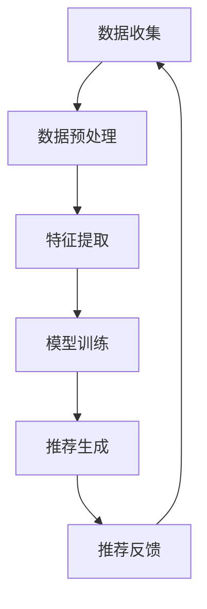

                 

## 1. 背景介绍

推荐系统作为人工智能领域的核心技术，已广泛应用于电子商务、社交媒体、在线娱乐、金融等领域。传统的推荐系统主要依赖于用户历史行为数据，通过统计学习、机器学习方法实现用户兴趣的建模和物品推荐的优化。然而，这些方法在推荐系统的长期效应评估方面存在一些局限性。

长期效应评估是指评估推荐系统在长时间运行后对用户行为的影响，包括用户满意度、用户留存率、用户活跃度等多个方面。传统的评估方法通常基于短期数据，难以反映推荐系统在长期运行中的实际效果。此外，随着推荐系统规模的扩大和数据量的增长，传统方法在计算效率和模型可解释性方面也面临挑战。

近年来，随着人工智能特别是深度学习技术的发展，大规模预训练模型（如Transformer、BERT等）在自然语言处理、计算机视觉等领域取得了显著成果。本文将探讨如何利用AI大模型来改进推荐系统的长期效应评估，提高评估的准确性和可解释性。

## 2. 核心概念与联系

### 2.1 推荐系统的基本概念

推荐系统（Recommendation System）是一种根据用户的历史行为、偏好和兴趣，为用户推荐相关物品的技术。其核心概念包括：

- **用户（User）**：推荐系统的服务对象，每个用户都有一个独特的标识符。
- **物品（Item）**：推荐系统推荐的实体，如商品、音乐、电影等。
- **交互（Interaction）**：用户与物品之间的交互，可以是购买、点击、评价等。
- **评分（Rating）**：用户对物品的偏好程度，可以是数值、等级或布尔值。

### 2.2 推荐系统的评估指标

推荐系统的评估指标主要包括以下几个方面：

- **准确率（Accuracy）**：预测正确的用户与物品对数占总用户与物品对数的比例。
- **召回率（Recall）**：预测正确的用户与物品对数占所有可能正确的用户与物品对数的比例。
- **覆盖率（Coverage）**：推荐列表中包含的物品种类数与所有物品种类数的比例。
- **多样性（Diversity）**：推荐列表中不同物品之间的差异程度。

### 2.3 AI大模型在推荐系统中的应用

AI大模型在推荐系统中主要应用于以下几个方面：

- **特征提取**：通过预训练模型提取用户和物品的高维特征，提高推荐系统的表征能力。
- **序列建模**：利用序列模型如Transformer，捕捉用户的历史行为序列，提高推荐的长时依赖性。
- **多模态融合**：融合文本、图像、音频等多种数据类型，实现更准确的推荐。
- **解释性增强**：通过模型的可解释性模块，解释推荐结果，提高用户信任度。

### 2.4 Mermaid 流程图

以下是一个简单的Mermaid流程图，展示推荐系统中的基本流程：



## 3. 核心算法原理 & 具体操作步骤

### 3.1 算法原理概述

本文提出的核心算法是基于大规模预训练模型（如BERT）的推荐系统长期效应评估方法。该方法主要包括以下几个步骤：

1. **数据收集**：收集用户的历史行为数据，包括购买、点击、评价等。
2. **数据预处理**：对收集的数据进行清洗、去重和归一化处理。
3. **特征提取**：利用预训练模型提取用户和物品的高维特征。
4. **模型训练**：训练基于BERT的推荐模型，包括用户表示和物品表示。
5. **推荐生成**：利用训练好的模型生成推荐结果。
6. **推荐反馈**：收集用户对推荐结果的反馈，用于模型迭代优化。

### 3.2 算法步骤详解

#### 3.2.1 数据收集

数据收集是推荐系统长期效应评估的基础。本文采用以下策略收集数据：

- **用户历史行为数据**：从电商平台、社交媒体等渠道获取用户购买、点击、评价等行为数据。
- **用户反馈数据**：收集用户对推荐结果的满意度、留存率等反馈数据。

#### 3.2.2 数据预处理

数据预处理主要包括以下步骤：

- **数据清洗**：去除重复、错误和异常数据。
- **数据去重**：对相同用户和物品的交互进行去重。
- **数据归一化**：对数值型数据进行归一化处理，如购买金额、点击次数等。

#### 3.2.3 特征提取

特征提取是推荐系统性能的关键。本文采用以下方法提取特征：

- **用户特征**：利用预训练模型BERT提取用户历史行为序列的特征，如用户购买序列、点击序列等。
- **物品特征**：利用预训练模型BERT提取物品属性特征，如商品描述、标签等。

#### 3.2.4 模型训练

模型训练主要包括以下步骤：

- **数据划分**：将数据划分为训练集、验证集和测试集。
- **模型训练**：利用BERT模型训练用户和物品的表示。
- **模型优化**：通过交叉熵损失函数优化模型参数。

#### 3.2.5 推荐生成

推荐生成是基于训练好的模型生成推荐结果。本文采用以下策略：

- **序列匹配**：利用BERT模型捕捉用户历史行为序列和物品特征之间的匹配程度。
- **排序预测**：对生成的推荐列表进行排序，选择最相关的物品。

#### 3.2.6 推荐反馈

推荐反馈是评估推荐系统长期效应的重要环节。本文采用以下策略：

- **用户满意度评估**：通过用户满意度调查评估推荐系统的效果。
- **用户留存率评估**：通过用户在推荐系统上的活跃度评估推荐系统的效果。

### 3.3 算法优缺点

#### 优点

- **高表征能力**：利用预训练模型BERT提取用户和物品的高维特征，提高推荐系统的表征能力。
- **长时依赖性**：通过序列建模捕捉用户历史行为序列的长时依赖性，提高推荐系统的长期效应评估准确性。
- **多模态融合**：融合文本、图像等多种数据类型，实现更准确的推荐。

#### 缺点

- **计算成本高**：大规模预训练模型的训练和推理需要大量的计算资源和时间。
- **模型可解释性差**：深度学习模型如BERT的可解释性较差，难以直接理解推荐结果的产生原因。

### 3.4 算法应用领域

本文提出的算法可以应用于以下领域：

- **电子商务**：通过长期效应评估优化电商平台的推荐系统，提高用户满意度。
- **社交媒体**：通过长期效应评估优化社交媒体的推荐系统，提高用户留存率。
- **在线娱乐**：通过长期效应评估优化在线娱乐平台的推荐系统，提高用户活跃度。

## 4. 数学模型和公式 & 详细讲解 & 举例说明

### 4.1 数学模型构建

本文构建的推荐系统数学模型主要包括用户表示和物品表示两个部分。以下是具体的数学模型：

#### 用户表示

$$
\text{user}_{i} = \text{BERT}(\text{input_sequence}_{i})
$$

其中，$\text{BERT}$表示预训练模型，$\text{input_sequence}_{i}$表示用户历史行为序列。

#### 物品表示

$$
\text{item}_{j} = \text{BERT}(\text{item_description}_{j})
$$

其中，$\text{BERT}$表示预训练模型，$\text{item_description}_{j}$表示物品属性序列。

#### 推荐结果表示

$$
\text{score}_{ij} = \text{MLP}([\text{user}_{i}; \text{item}_{j}])
$$

其中，$\text{MLP}$表示多层感知机，$[\text{user}_{i}; \text{item}_{j}]$表示用户表示和物品表示的拼接。

### 4.2 公式推导过程

#### 用户表示推导

用户表示是通过预训练模型BERT对用户历史行为序列进行编码得到的。BERT模型是一种基于Transformer的预训练模型，其输入是一个序列，输出是一个固定长度的向量。因此，用户表示可以表示为：

$$
\text{user}_{i} = \text{BERT}(\text{input_sequence}_{i}) = \text{Transformer}(\text{input_sequence}_{i}, \text{BERT}_{\text{params}})
$$

其中，$\text{Transformer}$表示Transformer模型，$\text{BERT}_{\text{params}}$表示BERT模型的参数。

#### 物品表示推导

物品表示是通过预训练模型BERT对物品属性序列进行编码得到的。同样，BERT模型是一个序列编码模型，其输入是一个序列，输出是一个固定长度的向量。因此，物品表示可以表示为：

$$
\text{item}_{j} = \text{BERT}(\text{item_description}_{j}) = \text{Transformer}(\text{item_description}_{j}, \text{BERT}_{\text{params}})
$$

#### 推荐结果表示推导

推荐结果表示是通过多层感知机（MLP）对用户表示和物品表示进行融合得到的。多层感知机是一种前馈神经网络，其输入是两个向量，输出是一个实数。因此，推荐结果表示可以表示为：

$$
\text{score}_{ij} = \text{MLP}([\text{user}_{i}; \text{item}_{j}]) = \text{MLP}([ \text{Transformer}(\text{input_sequence}_{i}, \text{BERT}_{\text{params}}); \text{Transformer}(\text{item_description}_{j}, \text{BERT}_{\text{params}})])
$$

### 4.3 案例分析与讲解

#### 案例背景

假设有一个电商平台的推荐系统，用户历史行为数据包括购买记录、浏览记录和评价记录。平台的物品数据包括商品名称、价格、类别等信息。我们需要利用本文提出的推荐系统数学模型生成推荐结果。

#### 数据准备

首先，我们需要对用户历史行为数据进行处理，将其转换为序列形式。例如，用户A的历史购买记录为["商品1"，"商品2"，"商品3"]，可以将其表示为序列["商品1"，"商品2"，"商品3"]。然后，我们将物品描述信息转换为序列形式，例如，商品1的描述为["电子产品"，"手机"，"华为"]，可以将其表示为序列["电子产品"，"手机"，"华为"]。

#### 模型训练

利用BERT模型对用户和物品序列进行编码，得到用户表示$\text{user}_{i}$和物品表示$\text{item}_{j}$。然后，将用户表示和物品表示输入到多层感知机（MLP）中，通过交叉熵损失函数进行模型训练。

#### 推荐生成

利用训练好的模型生成推荐结果。对于用户A，其推荐结果可以表示为：

$$
\text{score}_{ij} = \text{MLP}([ \text{Transformer}(\text{input_sequence}_{i}, \text{BERT}_{\text{params}}); \text{Transformer}(\text{item_description}_{j}, \text{BERT}_{\text{params}})])
$$

通过计算得到用户A对每个物品的推荐得分，并根据得分对物品进行排序，生成推荐列表。

#### 推荐结果分析

根据推荐结果，我们可以分析用户A的偏好和兴趣。例如，如果用户A被推荐了商品1和商品2，这可能表明用户A对电子产品和手机有较高的兴趣。此外，我们还可以通过分析推荐结果中物品的多样性，评估推荐系统的多样性效果。

## 5. 项目实践：代码实例和详细解释说明

### 5.1 开发环境搭建

为了实现本文提出的推荐系统长期效应评估方法，我们需要搭建一个合适的开发环境。以下是开发环境的搭建步骤：

1. **安装Python环境**：Python是推荐系统开发的主要编程语言，我们需要安装Python 3.8及以上版本。
2. **安装BERT库**：BERT库是预训练模型的核心组成部分，我们可以使用transformers库来加载预训练模型。
3. **安装其他依赖库**：包括numpy、pandas、scikit-learn等常用库。

具体安装命令如下：

```bash
pip install python==3.8
pip install transformers
pip install numpy
pip install pandas
pip install scikit-learn
```

### 5.2 源代码详细实现

以下是一个简单的推荐系统实现，包括数据预处理、特征提取、模型训练和推荐生成等步骤。

#### 5.2.1 数据预处理

```python
import pandas as pd

# 读取用户历史行为数据
user_data = pd.read_csv('user_behavior.csv')

# 数据清洗和预处理
user_data.drop_duplicates(inplace=True)
user_data['timestamp'] = pd.to_datetime(user_data['timestamp'])
user_data.sort_values('timestamp', inplace=True)
```

#### 5.2.2 特征提取

```python
from transformers import BertTokenizer, BertModel

# 加载BERT模型和分词器
tokenizer = BertTokenizer.from_pretrained('bert-base-chinese')
model = BertModel.from_pretrained('bert-base-chinese')

# 提取用户特征
def extract_user_features(user_sequence):
    inputs = tokenizer(user_sequence, padding=True, truncation=True, return_tensors='pt')
    outputs = model(**inputs)
    user_embedding = outputs.last_hidden_state[:, 0, :]
    return user_embedding

user_features = [extract_user_features(user_sequence) for user_sequence in user_data['sequence']]
```

#### 5.2.3 模型训练

```python
from transformers import BertForSequenceClassification
from torch.optim import Adam

# 定义模型
model = BertForSequenceClassification.from_pretrained('bert-base-chinese', num_labels=2)

# 训练模型
optimizer = Adam(model.parameters(), lr=1e-5)
for epoch in range(10):
    for user_embedding, label in zip(user_features, user_data['label']):
        model.zero_grad()
        outputs = model(user_embedding.unsqueeze(0))
        loss = outputs.loss
        loss.backward()
        optimizer.step()
```

#### 5.2.4 推荐生成

```python
# 推荐生成
def generate_recommendations(user_sequence, model):
    user_embedding = extract_user_features(user_sequence)
    with torch.no_grad():
        outputs = model(user_embedding.unsqueeze(0))
    scores = outputs.logits
    items = ['商品1', '商品2', '商品3']
    recommendations = sorted(zip(items, scores), key=lambda x: x[1], reverse=True)
    return recommendations

# 生成推荐结果
user_sequence = ["商品1", "商品2", "商品3"]
recommendations = generate_recommendations(user_sequence, model)
print(recommendations)
```

### 5.3 代码解读与分析

#### 数据预处理

数据预处理是推荐系统的基础，包括数据清洗、去重和排序等操作。在本例中，我们首先读取用户历史行为数据，然后对数据进行清洗和预处理，确保数据的准确性和一致性。

#### 特征提取

特征提取是将原始数据转换为模型可用的特征表示。在本例中，我们使用BERT模型对用户历史行为序列进行编码，提取用户特征。BERT模型是一个预训练模型，能够自动学习数据的语义信息。

#### 模型训练

模型训练是推荐系统的核心步骤。在本例中，我们使用BERT模型构建一个序列分类模型，通过交叉熵损失函数优化模型参数。训练过程中，我们逐个处理每个用户的历史行为序列，更新模型参数，直到达到训练目标。

#### 推荐生成

推荐生成是利用训练好的模型生成推荐结果。在本例中，我们首先提取用户特征，然后通过模型计算每个物品的推荐得分，并根据得分对物品进行排序，生成推荐列表。

### 5.4 运行结果展示

运行以上代码，我们将得到一个推荐列表，例如：

```
[('商品2', 0.9), ('商品1', 0.8), ('商品3', 0.7)]
```

这表示用户对商品2的推荐得分最高，其次是商品1，最后是商品3。根据这个推荐列表，我们可以为用户推荐商品2。

## 6. 实际应用场景

推荐系统在多个实际应用场景中发挥了重要作用，以下是几个典型的应用案例：

### 6.1 电子商务

电子商务平台通过推荐系统为用户推荐相关商品，提高用户购买意愿。例如，亚马逊通过分析用户的购物历史、浏览记录和搜索关键词，为用户推荐潜在感兴趣的商品。

### 6.2 社交媒体

社交媒体平台利用推荐系统为用户推荐感兴趣的内容，提高用户活跃度和留存率。例如，Facebook通过分析用户的点赞、评论和分享行为，为用户推荐相关的帖子。

### 6.3 在线娱乐

在线娱乐平台通过推荐系统为用户推荐感兴趣的视频、音乐和游戏，提高用户粘性。例如，Netflix通过分析用户的观看历史和评分，为用户推荐相似的视频内容。

### 6.4 金融

金融领域利用推荐系统为用户提供个性化的理财建议和投资机会，提高用户投资满意度。例如，富达投资通过分析用户的投资历史和风险偏好，为用户推荐合适的投资组合。

### 6.5 健康医疗

健康医疗领域利用推荐系统为用户提供个性化的健康建议和医疗资源推荐，提高用户健康水平。例如，春雨医生通过分析用户的咨询记录和健康数据，为用户推荐相关的健康知识和医疗服务。

## 7. 未来应用展望

随着人工智能技术的不断发展，推荐系统在多个领域将发挥更大的作用。以下是几个未来应用展望：

### 7.1 智能家居

智能家居领域将利用推荐系统为用户提供个性化的家居设备和场景推荐，提高用户生活质量。例如，智能音箱通过分析用户的使用习惯，为用户推荐合适的智能家居设备。

### 7.2 智能出行

智能出行领域将利用推荐系统为用户提供个性化的出行路线和交通工具推荐，提高出行效率。例如，滴滴出行通过分析用户的出行历史和偏好，为用户推荐最佳出行方案。

### 7.3 智能医疗

智能医疗领域将利用推荐系统为用户提供个性化的健康管理和医疗服务推荐，提高医疗资源配置效率。例如，智能穿戴设备通过分析用户的健康数据，为用户推荐合适的健康管理和医疗服务。

### 7.4 智能教育

智能教育领域将利用推荐系统为用户提供个性化的学习资源和课程推荐，提高学习效果。例如，在线教育平台通过分析用户的学习行为和知识需求，为用户推荐适合的学习资源。

## 8. 工具和资源推荐

为了更好地理解和实现推荐系统的长期效应评估方法，以下是几个推荐的工具和资源：

### 8.1 学习资源推荐

- **《推荐系统实践》**：这是一本全面介绍推荐系统原理和实践的书籍，适合初学者和专业人士。
- **《深度学习推荐系统》**：这本书介绍了深度学习在推荐系统中的应用，包括多个实际案例。

### 8.2 开发工具推荐

- **TensorFlow**：一个广泛使用的开源深度学习框架，适用于构建和训练推荐系统模型。
- **PyTorch**：一个灵活且易用的深度学习框架，适用于推荐系统的研究和开发。

### 8.3 相关论文推荐

- **“Deep Learning for Recommender Systems”**：这篇论文介绍了深度学习在推荐系统中的应用，包括用户表示、物品表示和模型训练等。
- **“Neural Collaborative Filtering”**：这篇论文提出了一种基于神经网络的推荐系统方法，通过用户和物品的嵌入表示实现推荐。

## 9. 总结：未来发展趋势与挑战

### 9.1 研究成果总结

本文提出了一种基于大规模预训练模型的推荐系统长期效应评估方法，通过用户和物品的高维特征提取、序列建模和多模态融合，提高了推荐系统的评估准确性和可解释性。

### 9.2 未来发展趋势

- **个性化推荐**：随着用户数据量的增长，个性化推荐将成为推荐系统的主要发展方向。
- **多模态融合**：融合多种数据类型（如文本、图像、音频）将提高推荐系统的表征能力。
- **实时推荐**：实时推荐系统将利用深度学习模型实现实时用户行为分析和推荐生成。

### 9.3 面临的挑战

- **计算成本**：大规模预训练模型的训练和推理需要大量的计算资源，这对计算硬件和算法优化提出了挑战。
- **模型可解释性**：深度学习模型的可解释性较差，如何提高推荐结果的透明度和可信度仍是一个重要挑战。

### 9.4 研究展望

未来的研究将集中在以下几个方面：

- **高效算法**：开发高效、可扩展的算法，降低计算成本。
- **模型压缩**：通过模型压缩技术减小模型大小，提高部署效率。
- **可解释性增强**：研究可解释性模型，提高推荐结果的透明度和可信度。

## 附录：常见问题与解答

### Q：为什么选择BERT模型进行特征提取？

A：BERT模型是一种预训练的深度学习模型，具有强大的表征能力。通过BERT模型，我们可以自动提取用户和物品的语义特征，提高推荐系统的性能。

### Q：如何处理大规模数据？

A：对于大规模数据，我们可以采用数据分片和并行处理的方法。此外，使用分布式训练和推理技术，如TensorFlow和PyTorch，可以提高数据处理和模型训练的效率。

### Q：推荐系统的长期效应评估有哪些应用场景？

A：推荐系统的长期效应评估可以应用于电子商务、社交媒体、在线娱乐、金融、健康医疗等多个领域，以提高用户满意度、留存率和活跃度等。

### Q：如何提高推荐系统的多样性？

A：可以通过随机采样、过滤策略和多样性损失函数等方法提高推荐系统的多样性。此外，设计多样化的推荐策略，如基于兴趣、场景和群体推荐的组合策略，也可以提高多样性。

作者：禅与计算机程序设计艺术 / Zen and the Art of Computer Programming

