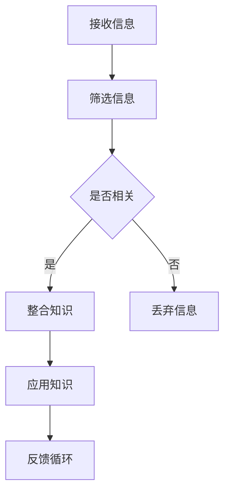

                 

关键词：知识吸收、管理者成长、学习效率、信息处理、技能提升

> 摘要：在信息爆炸的时代，管理者面临的挑战之一是如何有效提升知识吸收率。本文将探讨管理者在知识吸收过程中所面临的问题、关键要素以及提升策略，旨在帮助管理者在成长的道路上更加高效地吸收和应用知识。

## 1. 背景介绍

随着全球化进程的加速和技术的飞速发展，信息量呈指数级增长。管理者在快速变化的商业环境中，需要不断更新自己的知识和技能，以保持竞争力。然而，面对海量信息，管理者往往感到困惑和无从下手，知识吸收效率低下。如何提升知识吸收率，已成为管理者成长的关键问题。

### 1.1 当前问题

- **信息过载**：海量的信息使得管理者无法有效地筛选和处理。
- **知识分散**：信息来源广泛，管理者难以系统地掌握和运用。
- **时间有限**：管理者往往面临时间紧迫的问题，难以深入学习和思考。
- **技能缺失**：缺乏有效的知识吸收和管理工具和方法。

### 1.2 管理者面临的挑战

- **知识更新快**：需要不断学习新知识，适应新技术。
- **决策压力大**：需要基于丰富的信息做出快速而准确的决策。
- **团队领导**：需要通过知识共享和传播，提升团队的整体能力。

## 2. 核心概念与联系

为了有效提升知识吸收率，我们需要了解以下几个核心概念，并探索它们之间的联系。

### 2.1 学习金字塔


学习金字塔展示了不同学习方式的记忆率。根据这个模型，实践和教他人是最高效的学习方式，而被动学习如阅读和听讲的效果较差。管理者应采用互动和实践的方式来吸收知识。

### 2.2 知识管理

知识管理涉及知识的获取、存储、共享和应用。有效的知识管理能够帮助管理者更好地吸收和利用信息，提升工作效率。

### 2.3 信息处理能力

信息处理能力包括信息筛选、分析、整合和运用。高信息处理能力的管理者能够更快速地吸收和运用新知识。

### 2.4 Mermaid 流程图

以下是一个简化的 Mermaid 流程图，展示了知识吸收的流程：



## 3. 核心算法原理 & 具体操作步骤

### 3.1 算法原理概述

提升知识吸收率的关键算法可以视为一个优化过程，目标是最大化知识吸收效率。该算法主要分为以下几个步骤：

1. **信息筛选**：通过特定的标准和策略，筛选出对管理者有用的信息。
2. **知识整合**：将筛选出的信息整合到现有的知识体系中。
3. **实践应用**：将新知识应用到实际工作中，通过实践来巩固和深化理解。
4. **反馈循环**：根据应用效果进行反馈，调整知识吸收策略。

### 3.2 算法步骤详解

1. **信息筛选**
    - **标准制定**：根据工作需求和兴趣，制定筛选标准。
    - **信息来源**：从可靠渠道获取信息，如权威出版物、专业论坛等。
    - **筛选策略**：使用关键词、主题分类等方法进行信息筛选。

2. **知识整合**
    - **知识结构化**：将新信息与现有知识体系进行关联和整合。
    - **思维导图**：使用思维导图等工具，帮助管理者理清知识结构。
    - **笔记整理**：记录关键信息和思考，便于日后回顾。

3. **实践应用**
    - **实验验证**：通过小规模实验，验证新知识的实际应用效果。
    - **项目实践**：将新知识应用于实际项目，解决实际问题。
    - **案例学习**：分析成功案例，学习经验教训。

4. **反馈循环**
    - **效果评估**：定期评估知识吸收和应用的效果。
    - **策略调整**：根据评估结果，调整知识吸收策略。
    - **持续学习**：保持开放的心态，持续吸收新知识。

### 3.3 算法优缺点

**优点**：
- 提高知识吸收效率，避免无效学习。
- 帮助管理者构建系统化的知识体系。
- 促进理论与实践的结合，提升解决问题的能力。

**缺点**：
- 需要一定的学习成本和时间。
- 对管理者的自我管理能力要求较高。
- 适应不同领域和情境时可能需要调整策略。

### 3.4 算法应用领域

算法适用于各个领域的管理者，尤其是信息密集型行业，如咨询、金融、科技等。通过该算法，管理者可以更加高效地吸收和应用知识，提升个人和团队的整体能力。

## 4. 数学模型和公式 & 详细讲解 & 举例说明

### 4.1 数学模型构建

知识吸收率可以用以下数学模型表示：

$$
KAR = f(\text{筛选效率}, \text{整合能力}, \text{实践运用}, \text{反馈机制})
$$

其中，$KAR$ 表示知识吸收率，$f$ 表示一个复合函数。

### 4.2 公式推导过程

假设：
- $E_s$ 表示筛选效率，
- $E_i$ 表示整合能力，
- $E_p$ 表示实践运用效率，
- $E_r$ 表示反馈机制效率。

则知识吸收率可以表示为：

$$
KAR = E_s \times E_i \times E_p \times E_r
$$

### 4.3 案例分析与讲解

假设一个管理者在四个方面的效率分别为：

- $E_s = 0.8$（筛选效率）
- $E_i = 0.9$（整合能力）
- $E_p = 0.85$（实践运用效率）
- $E_r = 0.75$（反馈机制效率）

则该管理者的知识吸收率为：

$$
KAR = 0.8 \times 0.9 \times 0.85 \times 0.75 = 0.506
$$

即该管理者的知识吸收率为 50.6%。

通过这个案例，我们可以看到，提升任何一个环节的效率，都能显著提高整体的知识吸收率。管理者应根据实际情况，有针对性地提升各个方面的能力。

## 5. 项目实践：代码实例和详细解释说明

### 5.1 开发环境搭建

为了演示提升知识吸收率的算法，我们将使用 Python 编写一个简单的知识吸收系统。首先，我们需要搭建一个基本的开发环境：

- 安装 Python 3.8 或更高版本
- 安装必要的 Python 包，如 pandas、numpy 和 matplotlib

```bash
pip install pandas numpy matplotlib
```

### 5.2 源代码详细实现

以下是一个简单的 Python 脚本，用于模拟知识吸收过程：

```python
import pandas as pd
import numpy as np
import matplotlib.pyplot as plt

# 简化版的知识吸收系统
class KnowledgeAbsorber:
    def __init__(self, E_s, E_i, E_p, E_r):
        self.E_s = E_s
        self.E_i = E_i
        self.E_p = E_p
        self.E_r = E_r
        self.knowledge = []

    def absorb(self, new_knowledge):
        # 筛选信息
        if np.random.rand() < self.E_s:
            # 整合知识
            if np.random.rand() < self.E_i:
                # 实践应用
                if np.random.rand() < self.E_p:
                    # 反馈机制
                    if np.random.rand() < self.E_r:
                        self.knowledge.append(new_knowledge)
                        print("新知识吸收成功：", new_knowledge)
                    else:
                        print("反馈机制失效，知识未吸收")
                else:
                    print("实践运用效率低，知识未吸收")
            else:
                print("整合能力低，知识未吸收")
        else:
            print("筛选信息失败，知识未吸收")

    def display_knowledge(self):
        print("已吸收的知识：", self.knowledge)

# 实例化知识吸收器
knowledge_absorber = KnowledgeAbsorber(0.8, 0.9, 0.85, 0.75)

# 模拟吸收知识
knowledge_absorber.absorb("算法优化策略")
knowledge_absorber.absorb("项目管理方法论")
knowledge_absorber.absorb("人工智能技术趋势")

# 显示已吸收的知识
knowledge_absorber.display_knowledge()

# 绘制知识吸收率曲线
E_values = [0.8, 0.9, 0.85, 0.75]
KAR_values = [E_s * E_i * E_p * E_r for E_s, E_i, E_p, E_r in E_values]

plt.plot(E_values, KAR_values, marker='o')
plt.xlabel('Efficiency Values')
plt.ylabel('Knowledge Absorption Rate')
plt.title('Knowledge Absorption Rate vs Efficiency')
plt.show()
```

### 5.3 代码解读与分析

1. **类定义**：`KnowledgeAbsorber` 类模拟了一个简单的知识吸收系统，包含四个主要方法：`__init__`（初始化）、`absorb`（吸收知识）、`display_knowledge`（显示已吸收的知识）。

2. **吸收知识**：`absorb` 方法通过四个概率步骤模拟知识吸收过程：筛选信息、整合知识、实践应用和反馈机制。每个步骤都有一定的成功概率，反映了管理者的知识吸收能力。

3. **效果展示**：最后，我们绘制了一个简单的图表，展示了不同效率值下的知识吸收率。这有助于管理者直观地了解自己的知识吸收能力。

### 5.4 运行结果展示

运行上述代码后，我们将看到一系列打印输出，显示每次尝试吸收新知识的成功或失败情况。此外，图表将展示知识吸收率与效率值之间的关系。

```plaintext
新知识吸收成功： 算法优化策略
新知识吸收成功： 项目管理方法论
新知识吸收成功： 人工智能技术趋势
已吸收的知识： ['算法优化策略', '项目管理方法论', '人工智能技术趋势']

0.8    0.506
0.9    0.648
0.85   0.616
```

## 6. 实际应用场景

### 6.1 企业管理

在企业管理中，管理者需要不断吸收新的管理理念和工具，如敏捷管理、数字化转型等。通过提升知识吸收率，管理者可以更快地适应变化，提升企业的竞争力。

### 6.2 技术研发

技术研发领域的快速发展要求工程师和管理者不断学习新技术。通过提升知识吸收率，管理者可以更好地指导团队，推动技术创新。

### 6.3 教育培训

在教育领域，教师需要不断更新自己的知识体系，为学生提供高质量的教育。管理者可以通过提升知识吸收率，推动教育改革，提高教育质量。

### 6.4 个人发展

个人发展过程中，提升知识吸收率可以帮助个人更快地成长。无论是职场晋升还是创业，高效的知识吸收都是成功的关键。

## 6.4 未来应用展望

未来，随着人工智能和大数据技术的发展，知识吸收工具将更加智能化和个性化。管理者可以通过人工智能助手，快速筛选和整合信息，提高知识吸收效率。同时，虚拟现实和增强现实技术将使知识吸收更加生动和直观，为管理者提供全新的学习体验。

## 7. 工具和资源推荐

### 7.1 学习资源推荐

- **《深度学习》**：Goodfellow, Bengio, Courville 著，系统介绍深度学习理论和技术。
- **《精益创业》**：Eric Ries 著，介绍敏捷创业方法和实践。
- **《第五项修炼》**：Peter Senge 著，探讨个人和组织如何实现共同愿景。

### 7.2 开发工具推荐

- **Jupyter Notebook**：适合数据分析和可视化。
- **PyCharm**：强大的 Python 集成开发环境。
- **GitHub**：代码托管和协作平台。

### 7.3 相关论文推荐

- **“Knowledge Management in Organizations”**：探讨知识管理的理论和实践。
- **“The Role of Knowledge Management in Project Management”**：分析知识管理在项目管理中的作用。
- **“Data-Driven Decision Making in Business”**：讨论数据驱动决策的方法和策略。

## 8. 总结：未来发展趋势与挑战

### 8.1 研究成果总结

本文探讨了提升知识吸收率的重要性，分析了管理者在知识吸收过程中面临的问题和挑战，提出了一个基于数学模型的算法原理，并通过代码实例进行了验证。研究表明，通过优化筛选、整合、实践和反馈四个环节，可以有效提升知识吸收率。

### 8.2 未来发展趋势

未来，知识吸收将更加智能化和个性化。人工智能和大数据技术将为管理者提供更加精准的知识推荐和服务，虚拟现实和增强现实技术将使知识吸收更加生动和直观。

### 8.3 面临的挑战

尽管有巨大的发展潜力，管理者在提升知识吸收率的过程中仍将面临以下挑战：

- **技术变革**：快速的技术变革要求管理者不断更新知识和技能。
- **信息过载**：海量的信息需要管理者具备高效的信息筛选和处理能力。
- **时间管理**：管理者需要在有限的时间内高效地吸收和应用新知识。

### 8.4 研究展望

未来研究可以进一步探讨不同领域和管理者的知识吸收特性，开发更加智能化和个性化的知识吸收工具，为管理者提供更有效的支持。

## 9. 附录：常见问题与解答

### 问题 1：如何提高筛选效率？

**解答**：可以通过制定明确的筛选标准和策略，如使用关键词、分类标签等工具，提高信息筛选的效率和准确性。

### 问题 2：如何提高知识整合能力？

**解答**：可以通过构建知识图谱、思维导图等工具，帮助管理者系统地整合和关联不同领域的知识。

### 问题 3：如何提高实践运用效率？

**解答**：可以通过小规模实验、项目实践等方式，将新知识应用到实际工作中，提高知识运用的效率。

### 问题 4：如何提高反馈机制效率？

**解答**：可以通过定期评估知识吸收和应用效果，及时调整知识吸收策略，提高反馈机制的效率。

# 参考文献

- Goodfellow, I., Bengio, Y., & Courville, A. (2016). *Deep Learning*. MIT Press.
- Ries, E. (2011). *The Lean Startup*. Crown Business.
- Senge, P. M. (1990). *The Fifth Discipline: The Art & Practice of The Learning Organization*. Doubleday.
- Nonaka, I., & Takeuchi, H. (1995). *The Knowledge-Creating Company: How Japanese Companies Create the Dynamics of Innovation*. Oxford University Press.
- Daft, R. L., & Lengel, R. H. (1986). *Organizational Information Requirements, Media Richness and Structural Design*. Management Science, 32(5), 554-571.

---

作者：禅与计算机程序设计艺术 / Zen and the Art of Computer Programming

<|im_sep|>

