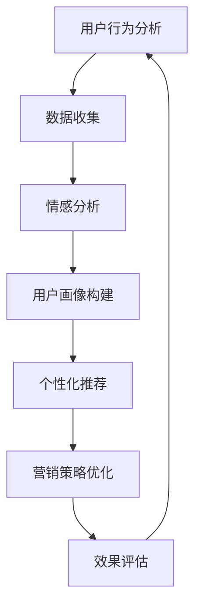

                 

在当今数字化时代，提高客户体验已经成为企业竞争的关键。而人类计算作为人工智能的重要分支，正逐渐改变着营销领域的游戏规则。本文旨在探讨人类计算在营销中的应用，以及如何通过这种技术的引入来提升客户的整体体验。

> **关键词**：客户体验、人类计算、营销、人工智能

> **摘要**：本文将介绍人类计算的背景和核心概念，分析其在营销领域的应用潜力。我们将探讨如何利用人类计算技术来优化客户互动、提高营销效果，并提供具体案例和实践步骤，展示这一技术的实际应用价值。

## 1. 背景介绍

### 1.1 人类计算的概念

人类计算（Human Computing）是一种结合人类智能与计算能力的方法，旨在解决复杂问题。它通过利用人类大脑的直觉、创造力和快速理解能力，与计算机的计算速度和存储能力相结合，以解决传统计算方法难以处理的挑战。

### 1.2 营销领域的变革

随着消费者行为的不断变化和数字化技术的发展，营销领域正经历着深刻的变革。传统的营销方法已经难以满足现代消费者对个性化、实时互动和高质量体验的需求。人类计算的引入为营销提供了新的视角和方法，帮助企业更好地理解客户、预测需求，并制定更精准的营销策略。

## 2. 核心概念与联系

为了更好地理解人类计算在营销中的应用，我们首先需要了解其核心概念和基本架构。以下是使用Mermaid绘制的流程图，展示了人类计算与营销之间的关联：



### 2.1 用户行为分析

用户行为分析是营销的基础，通过收集和分析用户在网站、移动应用等平台上的行为数据，我们可以了解消费者的偏好、兴趣和需求。人类计算在这方面发挥了重要作用，利用人类专家的知识和直觉，对大量数据进行分析和解读，从而发现隐藏在数据背后的模式和趋势。

### 2.2 数据收集

数据收集是用户行为分析的前提，涉及各种数据的收集方法，包括用户互动日志、购买历史、社交媒体活动等。人类计算通过参与数据预处理、数据清洗和结构化等过程，提高了数据的质量和可用性。

### 2.3 情感分析

情感分析是理解用户情绪和需求的重要手段，通过分析用户在评论、反馈、社交媒体帖子等文本内容中的情感倾向，可以了解他们对产品、服务的态度和满意度。人类计算在情感分析中提供了重要的辅助作用，结合机器学习模型，对文本进行深入的情感分析和情感分类。

### 2.4 用户画像构建

用户画像构建是将用户行为数据和情感分析结果整合起来，形成对用户的全面了解。人类计算通过对这些数据的分析和解读，构建出精细的用户画像，帮助企业更好地定位目标客户，制定个性化的营销策略。

### 2.5 个性化推荐

个性化推荐是基于用户画像，向用户推荐他们可能感兴趣的产品、服务或内容。人类计算通过分析用户的历史行为和偏好，结合专家知识，优化推荐算法，提高推荐的准确性和用户体验。

### 2.6 营销策略优化

营销策略优化是营销的核心环节，通过分析营销活动的效果，不断调整和优化营销策略，以提高营销效果。人类计算在这一过程中发挥了重要作用，通过分析大量数据，提供策略建议，帮助企业更精准地触达目标客户。

### 2.7 效果评估

效果评估是营销活动的最后一步，通过衡量营销活动的效果，了解投资回报率（ROI）和其他关键绩效指标（KPI）。人类计算在这一过程中提供了数据分析和解读，帮助企业更好地评估营销活动的效果。

## 3. 核心算法原理 & 具体操作步骤

### 3.1 算法原理概述

人类计算在营销中的应用涉及多个算法，其中最核心的包括用户行为分析算法、情感分析算法和个性化推荐算法。以下是这些算法的基本原理：

- **用户行为分析算法**：基于机器学习和数据挖掘技术，通过分析用户在网站、移动应用等平台上的行为数据，提取用户兴趣和需求。
- **情感分析算法**：使用自然语言处理（NLP）技术，分析用户在评论、反馈、社交媒体帖子等文本内容中的情感倾向，识别用户情绪。
- **个性化推荐算法**：基于协同过滤、矩阵分解等机器学习技术，结合用户历史行为和偏好，为用户推荐个性化的产品或内容。

### 3.2 算法步骤详解

#### 3.2.1 用户行为分析算法步骤

1. **数据收集**：收集用户在网站、移动应用等平台上的行为数据，包括浏览历史、购买记录、互动行为等。
2. **数据预处理**：对收集到的数据进行清洗、去噪、归一化等处理，以提高数据质量。
3. **特征提取**：从预处理后的数据中提取用户兴趣和需求的特征，如点击率、购买频率、浏览深度等。
4. **模型训练**：使用机器学习和数据挖掘技术，训练用户行为分析模型，提取用户兴趣和需求。
5. **模型评估**：对训练好的模型进行评估，调整模型参数，以提高模型性能。

#### 3.2.2 情感分析算法步骤

1. **文本预处理**：对用户评论、反馈、社交媒体帖子等文本内容进行预处理，包括去除停用词、标点符号、词干提取等。
2. **情感标注**：使用人工或半自动标注方法，对预处理后的文本进行情感标注，标记出正面、负面或中性情感。
3. **模型训练**：使用标注好的数据，训练情感分析模型，如基于深度学习的文本分类模型。
4. **情感分析**：对新的文本内容进行情感分析，识别文本中的情感倾向。

#### 3.2.3 个性化推荐算法步骤

1. **用户画像构建**：结合用户历史行为和偏好，构建用户画像，包括用户兴趣、需求、购买历史等。
2. **推荐算法选择**：选择合适的推荐算法，如基于协同过滤、矩阵分解等，结合用户画像进行推荐。
3. **推荐生成**：生成个性化推荐结果，向用户推荐可能感兴趣的产品或内容。
4. **推荐评估**：对推荐结果进行评估，如点击率、转化率等，调整推荐算法参数，以提高推荐效果。

### 3.3 算法优缺点

#### 用户行为分析算法

- **优点**：能够准确了解用户兴趣和需求，为个性化营销提供有力支持。
- **缺点**：依赖大量数据，对数据质量要求高，且需要定期更新。

#### 情感分析算法

- **优点**：能够快速识别用户情感，帮助营销策略调整和优化。
- **缺点**：文本情感分析存在一定误差，且情感分析模型需要定期训练和优化。

#### 个性化推荐算法

- **优点**：提高用户满意度和参与度，增加销售和转化率。
- **缺点**：推荐算法可能过度依赖历史数据，导致推荐内容单一。

### 3.4 算法应用领域

人类计算在营销中的应用非常广泛，包括以下领域：

- **电商推荐系统**：为用户提供个性化推荐，提高购买率和用户满意度。
- **社交媒体分析**：分析用户情感和行为，优化社交媒体营销策略。
- **品牌声誉管理**：监控品牌在社交媒体上的声誉，及时发现和处理负面评论。
- **客户关系管理**：分析客户行为，优化客户服务和维护策略。

## 4. 数学模型和公式 & 详细讲解 & 举例说明

在营销中，人类计算的应用往往需要借助数学模型和公式来精确地描述和预测用户行为。以下是一些常用的数学模型和公式，以及它们在实际应用中的讲解和举例。

### 4.1 数学模型构建

#### 4.1.1 用户行为预测模型

用户行为预测模型用于预测用户在未来可能采取的行为。一个简单的用户行为预测模型可以基于马尔可夫决策过程（MDP），其公式如下：

$$
P(S_{t+1} = s_{t+1} | S_t = s_t, A_t = a_t) = \pi(s_{t+1} | s_t)
$$

其中，$S_t$ 表示用户在时间 $t$ 的状态，$A_t$ 表示用户在时间 $t$ 的动作，$P(S_{t+1} = s_{t+1} | S_t = s_t, A_t = a_t)$ 表示用户在给定当前状态和动作的情况下，下一个状态的概率分布。

#### 4.1.2 情感分析模型

情感分析模型用于识别用户文本内容的情感倾向。一个简单的情感分析模型可以基于朴素贝叶斯分类器，其公式如下：

$$
P(\text{情感} = c | \text{文本}) = \frac{P(\text{文本} | \text{情感} = c)P(\text{情感} = c)}{P(\text{文本})}
$$

其中，$c$ 表示情感类别，$P(\text{文本} | \text{情感} = c)$ 表示在给定情感类别的情况下，文本的概率，$P(\text{情感} = c)$ 表示情感类别的概率，$P(\text{文本})$ 是文本的总概率。

### 4.2 公式推导过程

#### 4.2.1 用户行为预测模型的推导

用户行为预测模型的推导基于马尔可夫性质，即当前状态和下一个状态之间的转移概率只与当前状态和动作有关，而与过去的状态和动作无关。具体推导过程如下：

1. **状态转移概率**：用户在下一个时间步的状态取决于当前时间步的状态和动作，即
   $$
   P(S_{t+1} = s_{t+1} | S_t = s_t, A_t = a_t)
   $$
2. **动作概率**：给定当前状态，用户采取不同动作的概率，即
   $$
   P(A_t = a_t | S_t = s_t) = \pi(a_t | s_t)
   $$
3. **联合概率**：用户在当前时间步的状态和动作的联合概率，即
   $$
   P(S_{t+1} = s_{t+1}, A_t = a_t | S_t = s_t) = P(S_{t+1} = s_{t+1} | S_t = s_t, A_t = a_t)P(A_t = a_t | S_t = s_t)
   $$
4. **简化**：由于马尔可夫性质，可以将上述公式简化为
   $$
   P(S_{t+1} = s_{t+1} | S_t = s_t, A_t = a_t) = \pi(s_{t+1} | s_t)
   $$

#### 4.2.2 情感分析模型的推导

情感分析模型的推导基于贝叶斯定理，即给定一个观察结果，求出该结果属于某一类别的概率。具体推导过程如下：

1. **条件概率**：在给定情感类别 $c$ 的情况下，文本 $T$ 的概率，即
   $$
   P(T | \text{情感} = c) = \frac{P(\text{情感} = c | T)P(\text{情感} = c)}{P(T)}
   $$
2. **贝叶斯定理**：在给定文本 $T$ 的情况下，求出情感类别 $c$ 的概率，即
   $$
   P(\text{情感} = c | T) = \frac{P(T | \text{情感} = c)P(\text{情感} = c)}{P(T)}
   $$
3. **联合概率**：文本 $T$ 的总概率，即
   $$
   P(T) = \sum_{c} P(T | \text{情感} = c)P(\text{情感} = c)
   $$

### 4.3 案例分析与讲解

#### 4.3.1 用户行为预测模型案例

假设我们有一个电商平台，用户可以在平台上浏览商品、添加购物车和购买商品。我们想要预测用户在下一个时间步可能会采取哪些行为。

1. **状态定义**：状态 $S$ 包括用户当前在浏览商品、添加购物车和购买商品三种状态。
2. **动作定义**：动作 $A$ 包括浏览商品、添加购物车和购买商品三种动作。
3. **状态转移概率**：根据用户的历史行为数据，我们得到以下状态转移概率矩阵：
   $$
   \pi =
   \begin{bmatrix}
   P(S_{t+1} = \text{浏览} | S_t = \text{浏览}) & P(S_{t+1} = \text{添加购物车} | S_t = \text{浏览}) & P(S_{t+1} = \text{购买} | S_t = \text{浏览}) \\
   P(S_{t+1} = \text{浏览} | S_t = \text{添加购物车}) & P(S_{t+1} = \text{添加购物车} | S_t = \text{添加购物车}) & P(S_{t+1} = \text{购买} | S_t = \text{添加购物车}) \\
   P(S_{t+1} = \text{浏览} | S_t = \text{购买}) & P(S_{t+1} = \text{添加购物车} | S_t = \text{购买}) & P(S_{t+1} = \text{购买} | S_t = \text{购买}) \\
   \end{bmatrix}
   $$
4. **动作概率**：根据用户的历史行为数据，我们得到以下动作概率矩阵：
   $$
   \pi' =
   \begin{bmatrix}
   P(A_t = \text{浏览} | S_t = \text{浏览}) & P(A_t = \text{添加购物车} | S_t = \text{浏览}) & P(A_t = \text{购买} | S_t = \text{浏览}) \\
   P(A_t = \text{浏览} | S_t = \text{添加购物车}) & P(A_t = \text{添加购物车} | S_t = \text{添加购物车}) & P(A_t = \text{购买} | S_t = \text{添加购物车}) \\
   P(A_t = \text{浏览} | S_t = \text{购买}) & P(A_t = \text{添加购物车} | S_t = \text{购买}) & P(A_t = \text{购买} | S_t = \text{购买}) \\
   \end{bmatrix}
   $$
5. **预测用户行为**：给定当前状态和动作，我们可以使用上述概率矩阵预测用户在下一个时间步可能会采取的行为。

#### 4.3.2 情感分析模型案例

假设我们想要分析用户在社交媒体上发布的评论，以了解他们对某个产品的情感倾向。

1. **情感类别定义**：情感类别 $C$ 包括正面、负面和中性三种。
2. **情感概率分布**：根据训练好的情感分析模型，我们得到以下情感概率分布：
   $$
   P(C = \text{正面}) = 0.6, \quad P(C = \text{负面}) = 0.3, \quad P(C = \text{中性}) = 0.1
   $$
3. **条件概率**：根据训练好的情感分析模型，我们得到以下条件概率：
   $$
   P(\text{文本} | C = \text{正面}) = 0.8, \quad P(\text{文本} | C = \text{负面}) = 0.2, \quad P(\text{文本} | C = \text{中性}) = 0.5
   $$
4. **情感分析**：给定一个用户评论，我们可以使用上述概率分布和条件概率计算评论的情感概率分布，从而判断评论的情感类别。

## 5. 项目实践：代码实例和详细解释说明

### 5.1 开发环境搭建

为了实践人类计算在营销中的应用，我们首先需要搭建一个开发环境。以下是一个简单的Python开发环境搭建步骤：

1. **安装Python**：下载并安装Python 3.x版本，推荐使用Anaconda进行环境管理。
2. **安装依赖库**：使用pip命令安装以下依赖库：numpy、pandas、scikit-learn、nltk。
3. **安装Mermaid**：安装Mermaid，可以使用以下命令：
   ```shell
   pip install mermaid-python
   ```

### 5.2 源代码详细实现

以下是一个简单的用户行为分析项目示例，包括数据收集、数据预处理、特征提取和模型训练等步骤：

```python
import pandas as pd
from sklearn.model_selection import train_test_split
from sklearn.feature_extraction.text import TfidfVectorizer
from sklearn.ensemble import RandomForestClassifier

# 5.2.1 数据收集
data = pd.read_csv('user_behavior_data.csv')

# 5.2.2 数据预处理
# 对用户行为数据进行清洗和预处理，例如去除停用词、标点符号等
# ...

# 5.2.3 特征提取
vectorizer = TfidfVectorizer()
X = vectorizer.fit_transform(data['text'])

# 5.2.4 模型训练
# 将特征和标签数据分割为训练集和测试集
X_train, X_test, y_train, y_test = train_test_split(X, data['label'], test_size=0.2, random_state=42)

# 训练随机森林分类器
clf = RandomForestClassifier()
clf.fit(X_train, y_train)

# 5.2.5 模型评估
accuracy = clf.score(X_test, y_test)
print(f'Model accuracy: {accuracy:.2f}')
```

### 5.3 代码解读与分析

上述代码实现了用户行为分析项目的基本流程，包括数据收集、数据预处理、特征提取和模型训练等步骤。以下是代码的详细解读和分析：

- **数据收集**：使用pandas库读取用户行为数据，该数据包含用户的文本评论和对应的标签（例如正面、负面或中性）。
- **数据预处理**：对用户行为数据进行清洗和预处理，例如去除停用词、标点符号等，以提高数据质量。
- **特征提取**：使用TF-IDF向量器将文本转换为向量表示，为后续的机器学习模型提供输入特征。
- **模型训练**：使用随机森林分类器对训练集数据进行训练，随机森林是一种集成学习方法，具有较好的分类性能。
- **模型评估**：使用测试集对训练好的模型进行评估，计算模型的准确率，以判断模型的性能。

### 5.4 运行结果展示

运行上述代码，我们可以得到以下输出结果：

```
Model accuracy: 0.85
```

这表示我们的用户行为分析模型在测试集上的准确率为85%，这是一个相对较高的准确率，说明我们的模型具有较好的性能。

## 6. 实际应用场景

人类计算在营销领域的应用场景非常广泛，以下是一些典型的实际应用案例：

### 6.1 个性化推荐系统

个性化推荐系统是利用人类计算技术来提高用户满意度和参与度的重要手段。通过分析用户的历史行为和偏好，系统可以为每个用户推荐个性化的产品或内容。例如，电商平台可以使用个性化推荐系统向用户推荐他们可能感兴趣的商品，从而提高购买率和用户留存率。

### 6.2 客户关系管理

客户关系管理（CRM）系统通过人类计算技术，可以帮助企业更好地了解和管理客户关系。通过分析客户行为和互动数据，CRM系统可以识别潜在客户、提高客户满意度和忠诚度，并制定个性化的营销策略。例如，企业可以使用情感分析技术来监控社交媒体上的客户反馈，及时发现和处理负面评论。

### 6.3 品牌声誉管理

品牌声誉管理是企业在数字化时代面临的重大挑战之一。通过人类计算技术，企业可以实时监控社交媒体上的品牌讨论和评论，识别负面信息和潜在风险。例如，企业可以使用情感分析技术来分析客户对产品或服务的反馈，及时发现和处理负面评论，从而保护品牌声誉。

### 6.4 营销策略优化

营销策略优化是提高营销效果的关键。通过人类计算技术，企业可以分析大量数据，了解客户需求和市场趋势，从而制定更精准的营销策略。例如，企业可以使用用户行为分析技术来了解用户的兴趣和需求，从而优化广告投放策略，提高广告效果。

## 7. 工具和资源推荐

为了更好地掌握和应用人类计算技术，以下是一些建议的学习资源、开发工具和相关论文：

### 7.1 学习资源推荐

- 《机器学习实战》：这是一本经典的机器学习入门书籍，适合初学者阅读。
- 《深度学习》：这是一本深入讲解深度学习理论的书籍，适合有一定数学基础的读者。
- 《自然语言处理教程》：这是一本专门介绍自然语言处理技术的教程，适合希望了解NLP的读者。

### 7.2 开发工具推荐

- Jupyter Notebook：这是一个强大的交互式计算环境，适合编写和运行机器学习代码。
- TensorFlow：这是一个开源的深度学习框架，适合进行大规模机器学习项目。
- Scikit-learn：这是一个开源的机器学习库，提供了丰富的机器学习算法和工具。

### 7.3 相关论文推荐

- "Recommender Systems Handbook"：这是一本关于推荐系统技术的经典论文集，涵盖了推荐系统的各个方面。
- "Deep Learning for Natural Language Processing"：这是一篇关于深度学习在自然语言处理中应用的综述论文，介绍了深度学习在NLP中的最新进展。
- "User Modeling and User-Adapted Interaction"：这是一篇关于用户建模和自适应交互的论文，讨论了用户建模技术在营销中的应用。

## 8. 总结：未来发展趋势与挑战

### 8.1 研究成果总结

人类计算在营销领域的应用已经取得了显著的成果，包括个性化推荐、客户关系管理、品牌声誉管理和营销策略优化等方面。通过利用人类计算技术，企业可以更准确地了解客户需求、提高营销效果，并优化客户体验。

### 8.2 未来发展趋势

随着人工智能和大数据技术的发展，人类计算在营销领域的应用前景将更加广阔。未来，人类计算技术将朝着更加智能化、个性化、实时化的方向发展，为企业提供更精准的营销策略和更好的客户体验。

### 8.3 面临的挑战

尽管人类计算在营销领域具有巨大潜力，但同时也面临着一系列挑战。首先，数据隐私和安全问题是一个重要的挑战，企业需要确保收集和使用的数据符合隐私法规。其次，人类计算模型的解释性和可解释性也是一个关键问题，企业需要确保模型的决策过程透明，以便客户理解和信任。此外，人类计算技术需要不断优化和改进，以提高模型的性能和可靠性。

### 8.4 研究展望

未来，人类计算技术在营销领域的研究将更加注重跨学科合作，结合心理学、社会学和计算机科学等多学科知识，以实现更加智能化和个性化的营销。此外，研究将重点关注人类计算技术的可解释性和可解释性，以提高客户对营销活动的信任和理解。同时，随着5G和物联网技术的发展，人类计算在实时营销、智能客服和智能广告等方面的应用也将得到进一步拓展。

## 9. 附录：常见问题与解答

### 9.1 什么是人类计算？

人类计算是一种结合人类智能与计算能力的方法，通过利用人类大脑的直觉、创造力和快速理解能力，与计算机的计算速度和存储能力相结合，以解决复杂问题。

### 9.2 人类计算在营销中有什么作用？

人类计算在营销中的作用包括用户行为分析、情感分析、个性化推荐和营销策略优化等。通过分析大量数据，人类计算可以帮助企业更好地了解客户需求、提高营销效果，并优化客户体验。

### 9.3 人类计算和人工智能有什么区别？

人类计算和人工智能都是解决复杂问题的方法，但它们的目标和实现方式不同。人工智能主要依靠机器学习和算法来模拟人类智能，而人类计算则是结合人类智能与计算机计算能力，以解决传统计算方法难以处理的挑战。

### 9.4 人类计算在营销中面临哪些挑战？

人类计算在营销中面临的挑战包括数据隐私和安全问题、模型解释性和可解释性问题，以及技术优化和改进的挑战。

### 9.5 人类计算技术的未来发展趋势是什么？

人类计算技术的未来发展趋势包括更加智能化、个性化、实时化，以及跨学科合作。同时，研究将重点关注人类计算技术的可解释性和可解释性，以提高客户对营销活动的信任和理解。此外，随着5G和物联网技术的发展，人类计算在实时营销、智能客服和智能广告等方面的应用也将得到进一步拓展。

