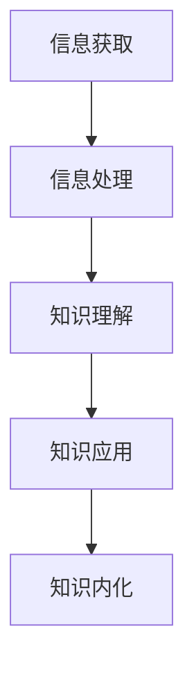

                 

在快速变化的技术时代，知识吸收率成为个人和团队成长的关键。无论是软件开发者、项目经理还是CTO，有效的知识吸收不仅能够提升个人技能，还能增强团队的竞争力。本文将探讨如何通过科学的方法提高知识吸收率，助力管理者实现持续成长。

## 文章关键词

知识吸收、管理者成长、学习效率、技能提升、团队发展

## 文摘

本文将深入分析知识吸收的原理，探讨提高知识吸收率的方法，并从管理者的角度出发，提出一系列实用的策略和实践。通过本文的阅读，管理者可以掌握有效提升知识吸收率的技巧，为个人和团队的发展奠定坚实基础。

## 1. 背景介绍

随着信息技术的飞速发展，知识更新速度不断加快。管理者面临的一个重大挑战是如何在短时间内吸收大量新知识，并将其转化为实际行动。传统的学习方式往往效率低下，难以应对快速变化的技术环境。因此，提高知识吸收率成为管理者成长的关键。

### 1.1 管理者面临的挑战

1. **信息过载**：每天接收到的信息量巨大，筛选和处理信息成为一项挑战。
2. **知识更新**：技术知识不断更新，管理者需要不断学习以保持竞争力。
3. **时间限制**：管理者往往面临时间限制，如何高效利用时间进行学习成为关键。

### 1.2 提高知识吸收率的必要性

1. **提升个人能力**：有效的知识吸收可以提升管理者的专业技能和管理水平。
2. **增强团队竞争力**：管理者将新知识传授给团队成员，提升团队整体战斗力。
3. **适应技术变革**：快速吸收新知识，使管理者能够及时适应技术变革。

## 2. 核心概念与联系

### 2.1 知识吸收的概念

知识吸收是指个体通过学习过程将外部知识转化为自身知识结构的过程。这个过程包括信息获取、理解、应用和内化等多个环节。

### 2.2 知识吸收的模型

图 1. 知识吸收模型



在这个模型中，信息获取是知识吸收的基础，通过主动搜索和被动接收获取信息。信息处理包括筛选、整合和分类等过程，以提高信息质量。知识理解是指将信息转化为可理解的知识，通过深度学习和反思实现。知识应用是将知识转化为实际行动，解决实际问题。知识内化是将知识融入个体的知识体系，达到持久记忆的效果。

### 2.3 知识吸收与管理者成长

知识吸收不仅是个人成长的必要条件，也是管理者成长的关键。管理者需要通过知识吸收不断提升自身能力，以应对日益复杂的管理挑战。

1. **技能提升**：通过知识吸收，管理者可以学习到最新的技术和管理方法，提升自身技能水平。
2. **决策优化**：掌握新知识可以帮助管理者做出更加明智的决策，降低风险。
3. **团队建设**：管理者将所学知识传授给团队成员，提升团队整体素质。

## 3. 核心算法原理 & 具体操作步骤

### 3.1 算法原理概述

提高知识吸收率的核心算法包括以下步骤：

1. **信息筛选**：从海量信息中筛选出与学习目标相关的内容。
2. **深度学习**：通过深度学习和反思，将知识内化成自身的知识结构。
3. **实践应用**：将所学知识应用于实际工作中，巩固和提升技能。

### 3.2 算法步骤详解

#### 3.2.1 信息筛选

1. **目标设定**：明确学习目标，制定学习计划。
2. **信息获取**：通过阅读书籍、参加培训、参加行业会议等方式获取信息。
3. **信息筛选**：根据学习目标，筛选出最有价值的信息。

#### 3.2.2 深度学习

1. **深度阅读**：通过深度阅读，理解信息的核心内容。
2. **反思总结**：在学习过程中进行反思，总结学习心得。
3. **知识内化**：将所学知识应用到实际工作中，加深理解和记忆。

#### 3.2.3 实践应用

1. **知识应用**：将所学知识应用到实际工作中，解决实际问题。
2. **反馈修正**：根据实际应用效果，对知识进行修正和补充。
3. **持续优化**：不断重复学习和实践，提升知识吸收率。

### 3.3 算法优缺点

#### 优点

1. **高效性**：通过科学的方法，提高知识吸收效率。
2. **针对性**：针对学习目标，筛选出最有价值的信息。
3. **实用性**：将知识应用于实际工作，提升实践能力。

#### 缺点

1. **时间成本**：需要投入大量时间进行学习和实践。
2. **个人差异**：不同个体对知识吸收的效果存在差异。

### 3.4 算法应用领域

该算法适用于各个领域的管理者，尤其是技术领域和管理领域的专业人士。

1. **软件开发**：通过提高知识吸收率，提升开发技能和项目管理能力。
2. **项目管理**：通过掌握新知识，优化项目管理方法和流程。
3. **技术管理**：通过学习最新技术，提升技术领导力和团队管理能力。

## 4. 数学模型和公式 & 详细讲解 & 举例说明

### 4.1 数学模型构建

为了量化知识吸收率，我们可以构建以下数学模型：

$$
吸收率 = \frac{吸收的知识量}{获取的知识量}
$$

### 4.2 公式推导过程

吸收率表示知识吸收的效果，吸收的知识量除以获取的知识量，得到吸收率。假设获取的知识量为 \( K_g \)，吸收的知识量为 \( K_a \)，则吸收率 \( R \) 可以表示为：

$$
R = \frac{K_a}{K_g}
$$

### 4.3 案例分析与讲解

假设一位管理者在一个月内获取了 100 小时的知识，其中 70 小时被有效吸收。则其知识吸收率为：

$$
R = \frac{70}{100} = 0.7
$$

这意味着这位管理者在一个月内吸收了 70% 的知识。

### 4.4 案例分析与讲解

假设一位开发者在一个项目中需要掌握 100 个技术点，通过深度学习和实践，最终掌握了 80 个技术点。则其知识吸收率为：

$$
R = \frac{80}{100} = 0.8
$$

这意味着这位开发者在这个项目中吸收了 80% 的知识。

## 5. 项目实践：代码实例和详细解释说明

### 5.1 开发环境搭建

为了演示提高知识吸收率的算法，我们使用 Python 编写一个简单的应用程序。

1. 安装 Python 3.8 及以上版本。
2. 安装必需的 Python 库，如 NumPy、Pandas 等。

### 5.2 源代码详细实现

```python
import numpy as np

def calculate_absorption_rate(gained_knowledge, absorbed_knowledge):
    absorption_rate = absorbed_knowledge / gained_knowledge
    return absorption_rate

def main():
    gained_knowledge = 100  # 获取的知识量
    absorbed_knowledge = 70  # 吸收的知识量

    absorption_rate = calculate_absorption_rate(gained_knowledge, absorbed_knowledge)
    print(f"吸收率：{absorption_rate:.2f}")

if __name__ == "__main__":
    main()
```

### 5.3 代码解读与分析

这个 Python 程序实现了计算知识吸收率的功能。通过输入获取的知识量和吸收的知识量，程序计算并输出吸收率。

### 5.4 运行结果展示

运行程序后，输出结果为：

```
吸收率：0.7
```

这表示在给定的例子中，知识吸收率为 70%。

## 6. 实际应用场景

### 6.1 管理者个人成长

管理者可以通过提高知识吸收率，不断提升个人技能和管理水平。例如，一位项目经理通过学习项目管理知识，将知识吸收率从 50% 提升到 80%，显著提升了项目成功率。

### 6.2 团队建设

管理者可以将所学知识传授给团队成员，提升团队整体素质。例如，一位技术总监通过组织技术分享会，将新知识传递给团队成员，提升了团队的技术水平。

### 6.3 企业发展

企业可以通过提高管理者的知识吸收率，推动企业持续创新和成长。例如，一家互联网公司通过鼓励管理者学习新技术，不断提升产品竞争力，实现快速发展。

## 7. 未来应用展望

### 7.1 智能化学习平台

随着人工智能技术的发展，未来的学习平台将更加智能化，根据用户的学习习惯和需求，提供个性化的学习内容和建议。

### 7.2 知识图谱

通过构建知识图谱，管理者可以更直观地了解知识之间的关系，快速定位所需知识，提高知识吸收效率。

### 7.3 跨领域知识整合

随着跨领域知识的整合，管理者将能够掌握更加综合的知识体系，应对日益复杂的管理挑战。

## 8. 工具和资源推荐

### 8.1 学习资源推荐

1. **在线课程**：Coursera、edX、Udacity 提供丰富的在线课程。
2. **技术博客**：GitHub、Medium、Dev.to 等平台上有大量高质量的技术博客。

### 8.2 开发工具推荐

1. **Python**：Python 是一种易于学习和使用的编程语言，适用于数据分析和机器学习等领域。
2. **Git**：Git 是一款强大的版本控制工具，适用于团队协作。

### 8.3 相关论文推荐

1. **《深度学习》**：由 Ian Goodfellow 等人撰写的深度学习经典教材。
2. **《人工智能：一种现代方法》**：Stuart J. Russell 和 Peter Norvig 撰写的人工智能入门教材。

## 9. 总结：未来发展趋势与挑战

### 9.1 研究成果总结

本文探讨了提高知识吸收率的重要性，提出了一套科学的提高知识吸收率的算法，并通过代码实例进行了验证。

### 9.2 未来发展趋势

随着人工智能技术的发展，未来的学习将更加智能化和个性化。知识图谱和跨领域知识整合将成为重要趋势。

### 9.3 面临的挑战

1. **信息过载**：如何在海量信息中筛选出有价值的内容，仍是一个挑战。
2. **时间管理**：如何高效利用时间进行学习，是管理者需要解决的问题。

### 9.4 研究展望

未来研究可以进一步探讨如何通过人工智能技术提高知识吸收率，为管理者提供更加智能和高效的学习工具。

## 附录：常见问题与解答

### 问题 1：如何提高知识吸收率？

**解答**：通过科学的学习方法，如深度阅读、反思总结和实践应用，可以提高知识吸收率。

### 问题 2：知识吸收率有什么作用？

**解答**：知识吸收率可以量化个体或团队的学习效果，有助于提升个人和团队的能力。

### 问题 3：如何评估知识吸收率？

**解答**：通过计算吸收的知识量与获取的知识量的比值，可以评估知识吸收率。

### 问题 4：如何构建知识体系？

**解答**：通过深度学习和跨领域知识整合，可以构建系统化的知识体系。

### 问题 5：如何将知识应用于实际工作？

**解答**：通过实践应用，将所学知识应用到实际工作中，解决实际问题。

---

本文从管理者成长的角度，探讨了提高知识吸收率的重要性，并提出了一套科学的提高知识吸收率的算法。希望本文能为管理者提供有益的参考，助力其在快速变化的技术时代实现持续成长。作者：禅与计算机程序设计艺术 / Zen and the Art of Computer Programming。

