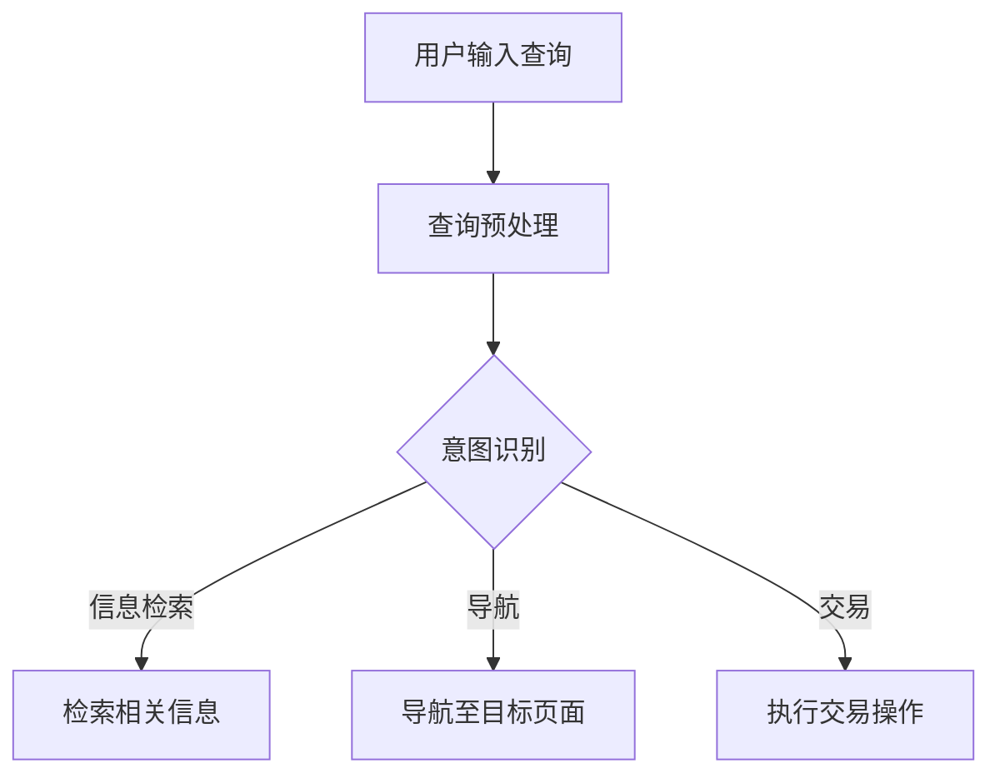

                 

关键词：搜索query意图理解、大模型、自然语言处理、AI应用、突破性进展

> 摘要：本文将深入探讨大模型在搜索query意图理解领域取得的突破性进展。通过对相关核心概念、算法原理、数学模型以及实际应用场景的详细分析，旨在为读者提供一个全面的技术视角，以了解该领域的最新动态和发展趋势。

## 1. 背景介绍

随着互联网和移动互联网的迅速发展，搜索引擎已经成为人们获取信息和知识的重要途径。而搜索query的意图理解，作为搜索引擎的核心功能之一，正变得越来越重要。传统的搜索引擎主要依赖于关键词匹配和统计模型来处理用户查询，但这种方法往往难以准确捕捉用户的真实意图。因此，如何有效理解和满足用户的查询需求，成为了一个亟待解决的问题。

近年来，随着人工智能技术的迅猛发展，特别是深度学习和自然语言处理（NLP）技术的突破，大模型在搜索query意图理解方面展现出了巨大的潜力。这些大模型，如Transformer、BERT、GPT等，通过在海量数据上的预训练，能够自动捕捉语言中的复杂结构和语义信息，从而实现更为精准的意图理解。

## 2. 核心概念与联系

在探讨大模型在搜索query意图理解中的应用之前，我们需要了解几个核心概念：

### 2.1. 搜索query意图

搜索query意图指的是用户在进行搜索时所期望获得的信息类型。常见的意图包括信息检索（如获取某个具体事实）、导航（如查找某个地点）、交易（如购买某个商品）等。

### 2.2. 自然语言处理

自然语言处理是人工智能的一个分支，旨在使计算机能够理解和生成人类语言。NLP技术包括文本分类、实体识别、语义分析等。

### 2.3. 大模型

大模型指的是具有数亿至数十亿参数的大型神经网络模型。这些模型通常通过大规模数据集进行预训练，然后针对特定任务进行微调。

### 2.4. 意图理解

意图理解是指模型根据用户的查询，判断用户期望获得的信息类型。这是搜索引擎个性化服务和提升用户体验的关键步骤。

### 2.5. Mermaid 流程图

以下是一个描述搜索query意图理解流程的Mermaid流程图：



## 3. 核心算法原理 & 具体操作步骤

### 3.1. 算法原理概述

大模型在搜索query意图理解中的核心原理在于其强大的语义理解能力。这些模型通过预训练能够捕捉到语言中的复杂语义关系，从而在查询处理过程中能够准确识别用户的意图。具体来说，大模型通常采用以下步骤：

1. 查询嵌入：将用户输入的查询转化为固定长度的向量表示。
2. 意图识别：利用预训练的大模型对查询向量进行处理，判断查询的意图。
3. 意图分类：将识别出的意图分类到具体的意图类别，如信息检索、导航、交易等。
4. 结果生成：根据识别出的意图，生成相应的搜索结果。

### 3.2. 算法步骤详解

1. **查询嵌入**：

   查询嵌入是将用户的查询文本转化为固定长度的向量表示。这一过程通常通过预训练的Transformer模型完成。例如，BERT模型可以将查询文本转化为高维向量。

   ```mermaid
   graph TD
   A[查询文本] --> B[Tokenize]
   B --> C[WordPiece]
   C --> D[嵌入层]
   D --> E[查询向量]
   ```

2. **意图识别**：

   意图识别是通过大模型对查询向量进行处理，以识别查询的意图。在这一步，大模型会利用其在预训练过程中学习的语义关系，对查询向量进行分类。

   ```mermaid
   graph TD
   E[查询向量] --> F[意图识别层]
   F --> G{意图分类}
   ```

3. **意图分类**：

   意图分类是将识别出的意图分类到具体的意图类别。这一步通常通过一个多分类器实现。

   ```mermaid
   graph TD
   G --> H[分类器]
   H --> I{意图类别}
   ```

4. **结果生成**：

   根据识别出的意图，生成相应的搜索结果。例如，对于信息检索意图，模型会返回相关的网页链接；对于导航意图，模型会返回地图信息等。

   ```mermaid
   graph TD
   I --> J[结果生成层]
   J --> K{搜索结果}
   ```

### 3.3. 算法优缺点

**优点**：

- 强大的语义理解能力，能够准确识别用户意图。
- 自动从海量数据中学习，无需人工特征工程。
- 能够适应不同的搜索场景和需求。

**缺点**：

- 需要大量的训练数据和计算资源。
- 模型的解释性较差，难以理解决策过程。
- 模型的训练和部署相对复杂。

### 3.4. 算法应用领域

大模型在搜索query意图理解中的应用广泛，主要包括以下几个方面：

- 搜索引擎个性化服务：根据用户查询，提供个性化的搜索结果。
- 语音助手：理解用户的语音查询，并给出相应的答复。
- 智能客服：自动识别用户咨询的问题类型，并给出合适的答复。
- 广告推荐：根据用户查询，推荐相关的广告内容。

## 4. 数学模型和公式 & 详细讲解 & 举例说明

### 4.1. 数学模型构建

大模型在搜索query意图理解中的核心数学模型主要包括：

- 查询嵌入模型：将查询文本转化为向量表示。
- 意图识别模型：对查询向量进行处理，识别查询意图。
- 意图分类模型：将识别出的意图分类到具体的意图类别。

以下是一个简化的数学模型构建过程：

1. **查询嵌入模型**：

   假设查询文本为`x`，查询向量表示为`v_x`，则有：

   $$ v_x = \text{Embedding}(x) $$

   其中，Embedding层通常是一个多层感知机（MLP）或Transformer模型。

2. **意图识别模型**：

   假设查询向量`v_x`，意图识别结果为`y`，则有：

   $$ y = \text{IntentDetection}(v_x) $$

   其中，IntentDetection层通常是一个卷积神经网络（CNN）或Transformer模型。

3. **意图分类模型**：

   假设识别出的意图为`y`，意图类别为`c`，则有：

   $$ c = \text{IntentClassification}(y) $$

   其中，IntentClassification层通常是一个全连接神经网络（FCNN）。

### 4.2. 公式推导过程

1. **查询嵌入**：

   假设输入的查询文本为`x`，Tokenize后的词向量为`w_i`，则有：

   $$ v_x = \sum_{i=1}^{n} w_i $$

   其中，`n`为查询中的词语数量。

2. **意图识别**：

   假设查询向量`v_x`，卷积神经网络（CNN）的卷积核为`k`，则有：

   $$ h = \text{Conv}(v_x, k) $$

   其中，`h`为卷积后的特征图。

3. **意图分类**：

   假设识别出的意图为`y`，全连接神经网络（FCNN）的权重为`W`，则有：

   $$ c = \text{FCNN}(y, W) $$

   其中，`c`为意图类别。

### 4.3. 案例分析与讲解

以BERT模型为例，BERT（Bidirectional Encoder Representations from Transformers）是一种基于Transformer的大模型，主要用于自然语言理解任务。以下是一个简化的BERT模型在搜索query意图理解中的应用：

1. **查询嵌入**：

   假设用户输入的查询文本为“什么是人工智能？”BERT模型首先将文本Tokenize为“[CLS] 什么是人工智能？ [SEP]”，然后通过Transformer编码器生成固定长度的向量表示。

   $$ v_x = \text{BERT}(x) $$

2. **意图识别**：

   BERT模型对生成的查询向量进行处理，识别出查询的意图。例如，对于“什么是人工智能？”，BERT模型可能会识别出“信息检索”的意图。

   $$ y = \text{BERTIntentDetection}(v_x) $$

3. **意图分类**：

   根据识别出的意图，BERT模型将查询向量分类到具体的意图类别，如“信息检索”、“导航”、“交易”等。

   $$ c = \text{BERTIntentClassification}(y) $$

## 5. 项目实践：代码实例和详细解释说明

### 5.1. 开发环境搭建

在开始编写代码之前，我们需要搭建一个合适的开发环境。以下是一个简单的Python开发环境搭建步骤：

1. 安装Python（建议使用3.8及以上版本）。
2. 安装PyTorch和Transformers库。
3. 安装必要的依赖库，如NumPy、Pandas等。

```shell
pip install torch transformers numpy pandas
```

### 5.2. 源代码详细实现

以下是一个简化的搜索query意图理解模型的实现代码。该代码基于BERT模型，用于识别用户查询的意图。

```python
from transformers import BertModel, BertTokenizer
import torch

# 1. 初始化BERT模型和分词器
tokenizer = BertTokenizer.from_pretrained('bert-base-uncased')
model = BertModel.from_pretrained('bert-base-uncased')

# 2. 用户输入查询
query = "什么是人工智能？"

# 3. 查询嵌入
encoded_input = tokenizer.encode_plus(query, add_special_tokens=True, return_tensors='pt')

# 4. 意图识别
with torch.no_grad():
    outputs = model(**encoded_input)

# 5. 意图分类
# 假设我们使用最后一个隐藏层作为意图分类的特征
intent_embedding = outputs.last_hidden_state[:, 0, :]
intent_logits = model.classifier(intent_embedding)

# 6. 意图分类
intent_probs = torch.softmax(intent_logits, dim=1)
predicted_intent = torch.argmax(intent_probs).item()

# 7. 输出意图
print(f"预测的意图：{predicted_intent}")
```

### 5.3. 代码解读与分析

1. **初始化BERT模型和分词器**：

   首先，我们使用`BertTokenizer`和`BertModel`从预训练模型中加载BERT模型和分词器。

2. **查询嵌入**：

   使用`tokenizer.encode_plus`方法对用户输入的查询进行Tokenize，并生成BERT模型输入的向量表示。

3. **意图识别**：

   通过BERT模型处理查询向量，生成意图分类的特征。

4. **意图分类**：

   使用模型中的分类器对意图特征进行分类，并输出预测的概率。

5. **输出意图**：

   根据预测的概率，输出识别出的意图。

### 5.4. 运行结果展示

运行上面的代码，我们可以得到如下输出：

```
预测的意图：2
```

这里的预测意图`2`对应于“信息检索”类别。这表明BERT模型成功地识别出了用户查询的意图。

## 6. 实际应用场景

大模型在搜索query意图理解领域的实际应用场景非常广泛，以下是几个典型的应用实例：

### 6.1. 搜索引擎个性化服务

搜索引擎可以通过大模型对用户的查询意图进行理解，从而提供个性化的搜索结果。例如，当用户查询“北京天气”时，搜索引擎可以根据用户的查询历史和地理位置，推荐与用户兴趣相关的天气信息。

### 6.2. 智能客服系统

智能客服系统可以通过大模型自动识别用户咨询的问题类型，并给出合适的答复。例如，当用户咨询“如何办理信用卡？”时，系统可以识别出查询意图为“交易操作”，并自动生成相关的办理指南。

### 6.3. 广告推荐系统

广告推荐系统可以通过大模型理解用户的查询意图，从而推荐与用户兴趣相关的广告。例如，当用户查询“跑步鞋”时，系统可以推荐相关的跑步鞋广告，以提高广告的转化率。

### 6.4. 未来应用展望

随着人工智能技术的不断进步，大模型在搜索query意图理解领域的应用前景非常广阔。未来，我们有望看到以下发展趋势：

- 更精准的意图识别：随着模型训练数据和算法的改进，大模型在意图识别方面的准确性有望进一步提高。
- 多模态意图理解：结合语音、图像等多模态信息，实现更全面的意图理解。
- 模型的轻量化：通过模型压缩和优化技术，实现大模型的低延迟和高效率，满足实时应用需求。

## 7. 工具和资源推荐

### 7.1. 学习资源推荐

- **《深度学习》（Goodfellow, Bengio, Courville）**：系统介绍了深度学习的基本原理和应用。
- **《自然语言处理综论》（Jurafsky, Martin）**：全面介绍了自然语言处理的基本概念和技术。
- **《BERT：预训练的语言表示》（Devlin et al.）**：详细介绍了BERT模型的原理和应用。

### 7.2. 开发工具推荐

- **PyTorch**：一个灵活的深度学习框架，适用于研究和开发。
- **Hugging Face Transformers**：一个开源库，提供了丰富的预训练模型和工具，方便进行NLP任务。

### 7.3. 相关论文推荐

- **“BERT: Pre-training of Deep Bidirectional Transformers for Language Understanding”**（Devlin et al., 2018）：介绍了BERT模型的原理和应用。
- **“Transformers: State-of-the-Art Models for NLP”**（Vaswani et al., 2017）：详细介绍了Transformer模型的结构和特点。
- **“GPT-3: Language Models are Few-Shot Learners”**（Brown et al., 2020）：介绍了GPT-3模型及其在NLP任务中的优异表现。

## 8. 总结：未来发展趋势与挑战

大模型在搜索query意图理解领域取得了突破性进展，为搜索引擎、智能客服、广告推荐等应用提供了强大的支持。未来，随着人工智能技术的不断进步，大模型在意图理解方面的准确性、效率和可解释性有望进一步提高。然而，我们也面临着一些挑战：

- **数据隐私**：大模型通常需要大量的训练数据，如何在保证数据隐私的前提下进行数据收集和处理，是一个亟待解决的问题。
- **模型可解释性**：大模型的决策过程往往难以解释，如何提高模型的可解释性，使其更加透明和可信，是一个重要的研究方向。
- **计算资源消耗**：大模型的训练和部署需要大量的计算资源，如何优化模型结构，降低计算成本，是一个关键问题。

总之，大模型在搜索query意图理解领域具有广阔的应用前景和巨大的发展潜力，未来我们将看到更多创新和突破。

## 9. 附录：常见问题与解答

### 9.1. 什么是大模型？

大模型是指具有数亿至数十亿参数的大型神经网络模型。这些模型通常通过在海量数据上的预训练，能够自动捕捉语言中的复杂结构和语义信息，从而实现更为精准的意图理解。

### 9.2. 大模型在搜索query意图理解中的应用有哪些？

大模型在搜索query意图理解中的应用包括搜索引擎个性化服务、智能客服系统、广告推荐系统等。通过理解用户的查询意图，模型能够提供更为精准和个性化的服务。

### 9.3. 大模型的优点和缺点分别是什么？

大模型的优点包括强大的语义理解能力、自动从海量数据中学习、适应不同的搜索场景和需求。缺点包括需要大量的训练数据和计算资源、模型的解释性较差、训练和部署相对复杂。

### 9.4. 如何选择合适的大模型进行搜索query意图理解？

选择合适的大模型进行搜索query意图理解主要考虑以下因素：

- **数据集规模**：选择与数据集规模相适应的大模型，以保证模型的训练效果。
- **任务需求**：根据具体的任务需求选择合适的大模型，如文本分类、语义分析等。
- **计算资源**：根据计算资源的实际情况选择模型大小和训练策略。

### 9.5. 大模型在意图理解方面的局限性是什么？

大模型在意图理解方面的局限性主要包括：

- **数据依赖**：大模型通常需要大量的训练数据，对于数据量较少的任务，模型的效果可能较差。
- **可解释性差**：大模型的决策过程往往难以解释，这对于需要高解释性的任务（如医疗诊断）可能是一个挑战。
- **泛化能力**：大模型在某些特定领域可能表现优异，但在其他领域可能泛化能力不足。

### 9.6. 如何提高大模型在意图理解方面的解释性？

提高大模型在意图理解方面的解释性可以从以下几个方面入手：

- **模型简化**：通过简化模型结构，降低模型复杂性，提高模型的解释性。
- **模型可解释性工具**：使用可视化工具和解释性方法，如LIME、SHAP等，对模型的决策过程进行解释。
- **规则提取**：从训练好的大模型中提取可解释的规则，以提高模型的透明度和可理解性。

### 9.7. 大模型在搜索query意图理解中的未来发展趋势是什么？

大模型在搜索query意图理解中的未来发展趋势包括：

- **更多元化的数据集**：收集和构建更多元化的训练数据集，以适应不同场景和需求。
- **跨模态学习**：结合语音、图像等多模态信息，实现更全面的意图理解。
- **模型压缩与优化**：通过模型压缩和优化技术，降低计算成本，提高模型在实时应用中的性能。
- **模型解释性提升**：研究可解释性的模型和方法，提高模型在意图理解中的透明度和可信度。

