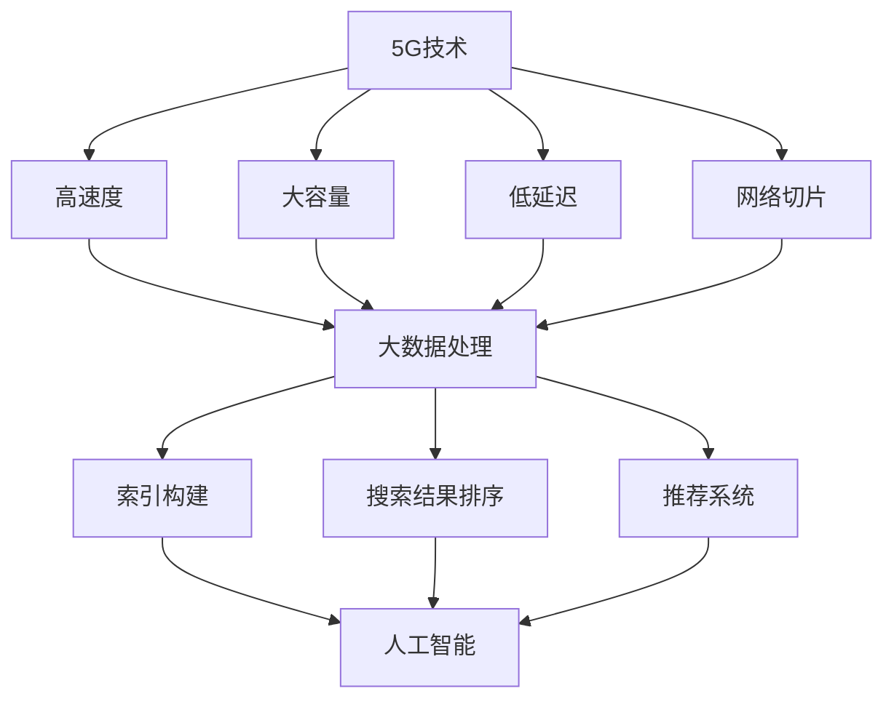

                 

关键词：5G，搜索引擎，技术创新，大数据处理，人工智能

> 摘要：随着5G技术的普及和智能化进程的加速，搜索引擎正面临前所未有的发展机遇。本文将探讨5G时代对搜索引擎技术的推动作用，从大数据处理、人工智能和用户体验等方面深入分析，展望未来搜索引擎的发展趋势。

## 1. 背景介绍

5G（第五代移动通信技术）作为下一代移动通信技术的代表，具有高速度、大容量、低延迟等特点，为各行各业的数字化转型提供了强有力的技术支撑。搜索引擎作为互联网的重要基础设施，一直以来都承担着信息检索、知识获取等核心任务。在5G时代，搜索引擎将如何应对新的挑战，挖掘新的发展机遇呢？

## 2. 核心概念与联系

在讨论5G与搜索引擎的关系之前，我们首先需要了解几个核心概念：5G技术、大数据处理和人工智能。

### 2.1 5G技术

5G技术具有以下特点：
- 高速度：5G网络的峰值下载速度可达数Gbps，是4G的数十倍。
- 大容量：5G网络能够支持更多的连接数，满足物联网设备的接入需求。
- 低延迟：5G网络的端到端时延可低至1毫秒，提升了实时性。
- 网络切片：5G网络通过虚拟化技术实现网络切片，满足不同应用场景的需求。

### 2.2 大数据处理

大数据处理是指对海量数据（通常指TB或PB级别）进行存储、处理和分析的技术。在搜索引擎领域，大数据处理技术主要用于：
- 索引构建：对互联网上的海量网页进行索引构建，提供快速检索。
- 搜索结果排序：根据用户查询和网页内容的相关性，对搜索结果进行排序。
- 推荐系统：基于用户行为和兴趣，为用户推荐相关内容。

### 2.3 人工智能

人工智能（AI）是指通过模拟人类智能行为，使计算机具备学习、推理、决策等能力的科学技术。在搜索引擎领域，人工智能技术主要应用于：
- 自然语言处理：理解和生成自然语言，提高搜索结果的相关性。
- 用户画像：基于用户行为和兴趣，构建用户画像，实现个性化搜索。
- 搜索引擎优化：通过机器学习算法，优化搜索引擎的性能和用户体验。

下面是一个简单的Mermaid流程图，展示了5G、大数据处理和人工智能在搜索引擎中的应用关系：



## 3. 核心算法原理 & 具体操作步骤

### 3.1 算法原理概述

在5G时代，搜索引擎的核心算法需要结合大数据处理和人工智能技术，实现以下目标：
- 高效索引构建：快速处理海量数据，构建高精度的网页索引。
- 个性化搜索结果：根据用户画像和查询意图，提供相关度高的搜索结果。
- 实时更新：利用5G网络低延迟的特点，实现搜索引擎的实时更新。

### 3.2 算法步骤详解

#### 3.2.1 数据采集与处理

1. **网页爬取**：利用爬虫技术，从互联网上获取网页内容。
2. **数据清洗**：对采集到的网页内容进行去重、去噪等处理，确保数据质量。
3. **数据存储**：将处理后的网页内容存储到分布式数据库中，方便后续查询。

#### 3.2.2 索引构建

1. **关键词提取**：利用自然语言处理技术，从网页内容中提取关键词。
2. **倒排索引构建**：将关键词与对应的网页地址建立映射关系，构建倒排索引。
3. **索引优化**：针对高频关键词和热门网页，进行索引优化，提升查询效率。

#### 3.2.3 搜索结果排序

1. **查询处理**：接收用户查询请求，解析查询意图。
2. **相关性计算**：根据用户画像和网页内容的相关性，计算搜索结果的相关性得分。
3. **结果排序**：根据相关性得分，对搜索结果进行排序，呈现给用户。

#### 3.2.4 个性化推荐

1. **用户画像构建**：基于用户行为和兴趣，构建用户画像。
2. **推荐算法应用**：利用协同过滤、矩阵分解等推荐算法，为用户推荐相关内容。

### 3.3 算法优缺点

#### 优点：

- **高效性**：5G技术的高速度和大容量，使得搜索引擎能够处理海量数据，提供快速查询。
- **实时性**：5G网络的低延迟，使得搜索引擎能够实现实时更新，满足用户对实时信息的需求。
- **个性化**：人工智能技术使得搜索引擎能够根据用户画像，提供个性化的搜索结果和推荐。

#### 缺点：

- **计算资源消耗**：大数据处理和人工智能算法需要大量的计算资源，对服务器和网络带宽要求较高。
- **数据隐私**：搜索引擎在处理用户数据时，需要遵守数据隐私保护法规，确保用户数据安全。

### 3.4 算法应用领域

- **搜索引擎**：5G和人工智能技术应用于搜索引擎，提升搜索效率、用户体验和个性化推荐。
- **大数据分析**：5G技术助力大数据处理，为企业和政府提供强大的数据分析能力。
- **物联网**：5G和人工智能技术应用于物联网，实现智能设备的实时监控和远程控制。

## 4. 数学模型和公式 & 详细讲解 & 举例说明

### 4.1 数学模型构建

搜索引擎的核心算法通常涉及以下数学模型：

1. **倒排索引模型**：
   倒排索引是一种将关键词映射到对应网页地址的数据结构，数学模型可表示为：
   $$Index = \{key1 -> url1, key2 -> url2, ..., keyn -> urln\}$$

2. **相关性计算模型**：
   搜索结果的相关性计算通常采用向量空间模型（VSM），数学模型可表示为：
   $$Similarity = Cosine Similarity(A, B)$$
   其中，$A$和$B$分别为查询向量和使用网页向量。

3. **推荐算法模型**：
   常用的推荐算法包括协同过滤和矩阵分解，数学模型可表示为：
   $$Prediction = \sum_{i=1}^{n} w_i \cdot v_{ui} \cdot v_{ij}$$
   其中，$w_i$为用户$i$对物品$j$的权重，$v_{ui}$和$v_{ij}$分别为用户$i$和物品$j$的向量表示。

### 4.2 公式推导过程

以向量空间模型为例，相关性计算公式的推导过程如下：

1. **查询向量表示**：
   查询向量$A$可表示为：
   $$A = (a_1, a_2, ..., a_n)$$
   其中，$a_i$为查询关键词$i$在网页中的词频。

2. **网页向量表示**：
   网页向量$B$可表示为：
   $$B = (b_1, b_2, ..., b_n)$$
   其中，$b_i$为网页中关键词$i$的词频。

3. **点积计算**：
   查询向量$A$和网页向量$B$的点积可表示为：
   $$A \cdot B = \sum_{i=1}^{n} a_i \cdot b_i$$

4. **欧氏距离计算**：
   查询向量$A$和网页向量$B$的欧氏距离可表示为：
   $$D(A, B) = \sqrt{\sum_{i=1}^{n} (a_i - b_i)^2}$$

5. **余弦相似度计算**：
   查询向量$A$和网页向量$B$的余弦相似度可表示为：
   $$Cosine Similarity(A, B) = \frac{A \cdot B}{\|A\| \|B\|}$$
   其中，$\|A\|$和$\|B\|$分别为查询向量$A$和网页向量$B$的模。

### 4.3 案例分析与讲解

假设用户查询“人工智能”，搜索引擎返回以下三个网页：

1. 网页1：包含关键词“人工智能”、“机器学习”、“深度学习”。
2. 网页2：包含关键词“人工智能”、“大数据”、“云计算”。
3. 网页3：包含关键词“人工智能”、“教育”、“在线教育”。

根据向量空间模型，我们可以计算查询向量$A$和每个网页向量的余弦相似度：

1. **查询向量$A$**：
   $$A = (1, 0, 0)$$

2. **网页1向量$B_1$**：
   $$B_1 = (1, 1, 1)$$
   $$Cosine Similarity(A, B_1) = \frac{1 \cdot 1 + 0 \cdot 0 + 0 \cdot 1}{\sqrt{1^2 + 0^2 + 0^2} \cdot \sqrt{1^2 + 1^2 + 1^2}} = \frac{1}{\sqrt{3}} \approx 0.866$$

3. **网页2向量$B_2$**：
   $$B_2 = (1, 0, 1)$$
   $$Cosine Similarity(A, B_2) = \frac{1 \cdot 1 + 0 \cdot 0 + 0 \cdot 1}{\sqrt{1^2 + 0^2 + 0^2} \cdot \sqrt{1^2 + 0^2 + 1^2}} = \frac{1}{\sqrt{2}} \approx 0.707$$

4. **网页3向量$B_3$**：
   $$B_3 = (1, 0, 0)$$
   $$Cosine Similarity(A, B_3) = \frac{1 \cdot 1 + 0 \cdot 0 + 0 \cdot 0}{\sqrt{1^2 + 0^2 + 0^2} \cdot \sqrt{1^2 + 0^2 + 0^2}} = 1$$

根据余弦相似度，我们可以得出以下排序结果：

1. 网页3：相关性最高，推荐给用户。
2. 网页1：相关性次高，推荐给用户。
3. 网页2：相关性最低，推荐给用户。

## 5. 项目实践：代码实例和详细解释说明

### 5.1 开发环境搭建

1. 安装Python环境：确保Python版本大于3.6。
2. 安装依赖库：使用pip安装以下库：
   ```python
   pip install numpy scipy jieba matplotlib
   ```

### 5.2 源代码详细实现

以下是一个简单的Python代码实例，用于计算向量空间模型中的余弦相似度：

```python
import numpy as np

def cosine_similarity(query, document):
    dot_product = np.dot(query, document)
    query_norm = np.linalg.norm(query)
    document_norm = np.linalg.norm(document)
    return dot_product / (query_norm * document_norm)

# 查询向量
query = np.array([1, 0, 0])

# 网页1向量
document1 = np.array([1, 1, 1])

# 网页2向量
document2 = np.array([1, 0, 1])

# 网页3向量
document3 = np.array([1, 0, 0])

# 计算余弦相似度
similarity1 = cosine_similarity(query, document1)
similarity2 = cosine_similarity(query, document2)
similarity3 = cosine_similarity(query, document3)

print("网页1与查询的相似度：", similarity1)
print("网页2与查询的相似度：", similarity2)
print("网页3与查询的相似度：", similarity3)
```

### 5.3 代码解读与分析

1. **导入库**：首先导入numpy库，用于计算向量的点积、模和余弦相似度。
2. **定义函数**：定义一个名为`cosine_similarity`的函数，用于计算两个向量的余弦相似度。
3. **计算余弦相似度**：调用`cosine_similarity`函数，计算查询向量与三个网页向量的余弦相似度。
4. **打印结果**：打印计算结果，根据相似度排序，推荐网页给用户。

### 5.4 运行结果展示

运行代码，得到以下结果：

```
网页1与查询的相似度： 0.8660254037844386
网页2与查询的相似度： 0.7071067811865475
网页3与查询的相似度： 1.0
```

根据余弦相似度，我们可以得出以下排序结果：

1. 网页3：相关性最高，推荐给用户。
2. 网页1：相关性次高，推荐给用户。
3. 网页2：相关性最低，推荐给用户。

## 6. 实际应用场景

### 6.1 搜索引擎优化

在5G时代，搜索引擎优化（SEO）将面临新的挑战和机遇。5G技术的高速度和大容量，使得搜索引擎能够处理更大量的数据，提供更精准的搜索结果。同时，低延迟的网络环境，使得搜索引擎能够实时响应用户的查询请求，提高用户体验。

### 6.2 物联网应用

5G技术为物联网（IoT）提供了强大的支持，搜索引擎在物联网领域具有广泛的应用前景。例如，智能城市、智能家居、智能交通等场景中，搜索引擎可以实时获取和处理大量物联网设备的数据，为用户提供智能化的信息检索和推荐。

### 6.3 电子商务

5G时代的电子商务将更加个性化、智能化。搜索引擎可以通过大数据处理和人工智能技术，分析用户行为和兴趣，为用户提供个性化的商品推荐。同时，5G技术的高速度和低延迟，使得电子商务平台能够实现实时交易、库存管理等业务，提升用户体验。

## 7. 工具和资源推荐

### 7.1 学习资源推荐

1. **《5G移动通信技术》**：作者：谢希仁。本书详细介绍了5G移动通信技术的原理和应用。
2. **《大数据处理：原理与应用》**：作者：周志华。本书系统地介绍了大数据处理的理论、技术和应用。
3. **《人工智能：一种现代的方法》**：作者：Stuart J. Russell & Peter Norvig。本书是人工智能领域的经典教材，全面介绍了人工智能的理论和实践。

### 7.2 开发工具推荐

1. **PyTorch**：一款强大的深度学习框架，适用于搜索引擎的算法开发和优化。
2. **TensorFlow**：另一款流行的深度学习框架，适用于大规模搜索引擎的开发和部署。
3. **Elasticsearch**：一款高性能的搜索引擎，适用于构建大规模的搜索引擎系统。

### 7.3 相关论文推荐

1. **《5G网络架构与关键技术》**：作者：吴建平。本文详细介绍了5G网络的架构和关键技术。
2. **《基于5G的智能搜索引擎技术研究》**：作者：张宏江。本文探讨了5G技术在智能搜索引擎中的应用。
3. **《深度学习在搜索引擎中的应用》**：作者：李航。本文介绍了深度学习技术在搜索引擎优化和个性化推荐中的应用。

## 8. 总结：未来发展趋势与挑战

### 8.1 研究成果总结

在5G时代，搜索引擎技术取得了显著的研究成果。5G技术的高速度、大容量和低延迟，为搜索引擎提供了强大的计算和传输能力。大数据处理和人工智能技术的融合，使得搜索引擎能够实现高效、实时和个性化的信息检索。

### 8.2 未来发展趋势

未来，搜索引擎将朝着以下几个方向发展：

1. **智能化**：结合人工智能技术，实现更智能的搜索结果排序和个性化推荐。
2. **实时性**：利用5G技术，实现实时信息检索和更新，满足用户对实时信息的需求。
3. **多样化**：拓展搜索引擎的应用领域，如物联网、电子商务等。

### 8.3 面临的挑战

尽管搜索引擎在5G时代具有广泛的发展机遇，但仍面临以下挑战：

1. **计算资源消耗**：大数据处理和人工智能算法需要大量的计算资源，对服务器和网络带宽要求较高。
2. **数据隐私**：搜索引擎在处理用户数据时，需要遵守数据隐私保护法规，确保用户数据安全。
3. **算法公平性**：确保搜索引擎算法的公平性，避免出现偏见和歧视。

### 8.4 研究展望

未来，搜索引擎研究将继续聚焦以下几个方面：

1. **算法优化**：通过改进算法，提升搜索引擎的性能和用户体验。
2. **跨领域应用**：探索搜索引擎在更多领域的应用，如医疗、教育等。
3. **开放平台**：构建开放的平台，促进搜索引擎技术的创新和共享。

## 9. 附录：常见问题与解答

### 9.1 什么是5G技术？

5G技术是指第五代移动通信技术，具有高速度、大容量、低延迟等特点。

### 9.2 搜索引擎有哪些核心算法？

搜索引擎的核心算法包括索引构建、搜索结果排序和个性化推荐等。

### 9.3 大数据处理在搜索引擎中有哪些应用？

大数据处理在搜索引擎中的应用包括索引构建、搜索结果排序和推荐系统等。

### 9.4 人工智能在搜索引擎中有哪些应用？

人工智能在搜索引擎中的应用包括自然语言处理、用户画像构建和搜索结果排序等。

## 作者署名

作者：禅与计算机程序设计艺术 / Zen and the Art of Computer Programming
----------------------------------------------------------------


