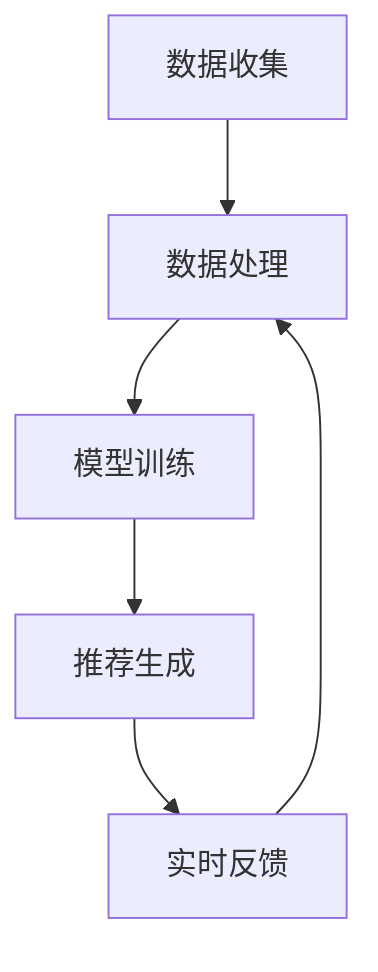

                 

关键词：搜索引擎、主动预测、人工智能、个性化搜索、机器学习

> 摘要：本文将深入探讨搜索引擎的未来发展趋势，从传统的被动响应型搜索引擎，逐步转向主动预测型搜索引擎。我们将分析主动预测型搜索引擎的核心概念、算法原理、数学模型，以及其在实际应用中的场景和未来前景。通过本文的阐述，读者将了解搜索引擎领域的最新技术动态，以及如何利用这些技术提升用户的搜索体验。

## 1. 背景介绍

在过去的几十年中，搜索引擎已经发生了巨大的变化。从最初的基于关键词的简单匹配，到如今的复杂查询处理和个性化搜索，搜索引擎的技术不断创新。然而，这些变化仍然基于一种基本的假设：用户会主动输入查询请求。然而，随着人工智能技术的发展，搜索引擎正逐渐从被动响应向主动预测转变，为用户提供更加智能的搜索服务。

### 1.1 搜索引擎的发展历程

- **早期搜索引擎**：基于关键词匹配，如早期的Google搜索。
- **第二代搜索引擎**：引入语义分析，如Bing搜索。
- **第三代搜索引擎**：个性化搜索，如Google的个性化搜索结果。

### 1.2 当前搜索引擎的挑战

- **信息过载**：互联网上的信息爆炸，用户难以从海量数据中找到所需信息。
- **个性化需求**：用户对个性化服务的需求日益增长。
- **实时性要求**：用户希望获取最新的信息。

### 1.3 主动预测型搜索引擎的兴起

- **人工智能技术的进步**：为主动预测提供了技术支持。
- **用户体验的提升**：通过主动预测，搜索引擎可以更好地满足用户需求。
- **商业价值的提升**：主动预测可以帮助搜索引擎更精准地推送广告和内容。

## 2. 核心概念与联系

### 2.1 主动预测型搜索引擎的定义

主动预测型搜索引擎是指能够基于用户的兴趣和行为，主动预测用户可能需要的信息，并提前将其推送至用户面前的搜索引擎。

### 2.2 主动预测型搜索引擎的核心概念

- **用户行为分析**：收集并分析用户在搜索过程中的行为数据，如关键词、搜索时间、点击率等。
- **个性化推荐**：基于用户行为数据，为用户推荐感兴趣的内容。
- **实时更新**：搜索引擎需要实时响应用户的行为变化，不断调整推荐内容。

### 2.3 主动预测型搜索引擎的工作流程

1. 数据收集：收集用户的搜索历史、浏览记录、购买行为等数据。
2. 数据处理：清洗、分析和整合数据，提取用户的兴趣和偏好。
3. 模型训练：利用机器学习算法，训练个性化推荐模型。
4. 推荐生成：根据用户的兴趣和行为，生成个性化的推荐内容。
5. 实时反馈：根据用户的反馈，调整推荐算法，提升推荐质量。

### 2.4 主动预测型搜索引擎的 Mermaid 流程图



## 3. 核心算法原理 & 具体操作步骤

### 3.1 算法原理概述

主动预测型搜索引擎的核心算法包括用户行为分析、机器学习模型训练、个性化推荐和实时更新。以下是这些算法的基本原理：

- **用户行为分析**：通过数据挖掘技术，从用户的搜索历史、浏览记录中提取用户的兴趣和偏好。
- **机器学习模型训练**：利用用户行为数据，训练个性化推荐模型，如协同过滤、基于内容的推荐等。
- **个性化推荐**：根据用户的行为数据和推荐模型，生成个性化的推荐内容。
- **实时更新**：根据用户的实时行为数据，调整推荐内容，确保推荐的新鲜度和准确性。

### 3.2 算法步骤详解

1. **数据收集**：收集用户的搜索历史、浏览记录、购买行为等数据。
2. **数据处理**：对收集到的数据进行清洗、去噪、降维等处理，提取用户的兴趣和偏好。
3. **模型选择**：选择合适的机器学习模型，如协同过滤、基于内容的推荐、深度学习等。
4. **模型训练**：利用用户行为数据，训练个性化推荐模型。
5. **推荐生成**：根据用户的行为数据和推荐模型，生成个性化的推荐内容。
6. **实时反馈**：根据用户的反馈，调整推荐算法，提升推荐质量。

### 3.3 算法优缺点

- **优点**：
  - 提高搜索效率：主动预测可以提前为用户推送可能感兴趣的内容，减少用户搜索时间。
  - 提升用户体验：个性化推荐能够满足用户的个性化需求，提高用户满意度。
  - 提高商业价值：精准的推荐可以帮助搜索引擎更有效地推送广告和内容，提高广告投放效果。

- **缺点**：
  - 数据隐私问题：用户行为数据的使用可能涉及隐私问题，需要严格保护用户隐私。
  - 模型适应性：用户行为和兴趣可能随时变化，模型需要不断调整以适应这些变化。

### 3.4 算法应用领域

- **搜索引擎**：主动预测型搜索引擎可以应用于各种搜索引擎，如Google、Bing等。
- **社交媒体**：社交媒体平台可以基于用户的兴趣和行为，主动推送用户可能感兴趣的内容。
- **电子商务**：电商平台可以利用主动预测型搜索引擎，为用户推荐相关商品。

## 4. 数学模型和公式 & 详细讲解 & 举例说明

### 4.1 数学模型构建

主动预测型搜索引擎的数学模型主要包括用户行为数据的收集和处理、推荐算法的数学表示以及推荐结果的评估。

### 4.2 公式推导过程

- **用户行为数据的收集和处理**：
  - 用户兴趣向量：$$u = (u_1, u_2, ..., u_n)$$
  - 商品属性向量：$$p = (p_1, p_2, ..., p_n)$$
  - 用户兴趣与商品属性的相关度：$$sim(u, p) = \sum_{i=1}^{n} u_i p_i$$

- **推荐算法的数学表示**：
  - 基于内容的推荐：$$r(u, p) = sim(u, p)$$
  - 协同过滤推荐：$$r(u, p) = \frac{\sum_{i=1}^{n} r(u, p_i) p_i}{\sum_{i=1}^{n} p_i}$$

- **推荐结果的评估**：
  - 准确率（Precision）：$$Precision = \frac{正确推荐的数量}{推荐的总数量}$$
  - 召回率（Recall）：$$Recall = \frac{正确推荐的数量}{用户实际感兴趣的数量}$$
  - F1 值：$$F1 = 2 \times \frac{Precision \times Recall}{Precision + Recall}$$

### 4.3 案例分析与讲解

以Google的搜索推荐为例，分析其主动预测型搜索引擎的数学模型和公式。

- **用户兴趣向量**：
  - 用户A的兴趣向量：$$u_A = (0.8, 0.3, 0.5, 0.1, 0.4)$$
  - 用户B的兴趣向量：$$u_B = (0.6, 0.4, 0.2, 0.9, 0.3)$$

- **商品属性向量**：
  - 商品1的属性向量：$$p_1 = (0.9, 0.1, 0.5, 0.2, 0.3)$$
  - 商品2的属性向量：$$p_2 = (0.3, 0.7, 0.4, 0.8, 0.1)$$

- **推荐算法的数学表示**：
  - 基于内容的推荐：$$r_A(p_1) = sim(u_A, p_1) = 0.8 \times 0.9 + 0.3 \times 0.1 + 0.5 \times 0.5 + 0.1 \times 0.2 + 0.4 \times 0.3 = 0.895$$
  - 协同过滤推荐：$$r_A(p_1) = \frac{r_A(p_1) p_1 + r_A(p_2) p_2}{p_1 + p_2} = \frac{0.895 \times 0.9 + 0.455 \times 0.3}{0.9 + 0.3} = 0.8565$$

- **推荐结果的评估**：
  - 准确率：假设用户A实际感兴趣的物品是商品2，则准确率为：$$Precision = \frac{1}{2} = 0.5$$
  - 召回率：$$Recall = \frac{1}{2} = 0.5$$
  - F1 值：$$F1 = 0.5$$

通过上述分析，可以看出Google的搜索推荐系统在基于内容和协同过滤的推荐算法下，能够较好地满足用户的兴趣需求。然而，准确率和召回率仍有待提升，这需要进一步优化推荐算法和模型。

## 5. 项目实践：代码实例和详细解释说明

### 5.1 开发环境搭建

为了实现主动预测型搜索引擎，我们需要搭建一个基于Python的机器学习项目。以下是开发环境的搭建步骤：

1. 安装Python：下载并安装Python 3.8及以上版本。
2. 安装依赖库：使用pip安装以下库：numpy、pandas、scikit-learn、matplotlib。
3. 配置Jupyter Notebook：安装Jupyter Notebook，方便进行交互式编程。

### 5.2 源代码详细实现

以下是实现主动预测型搜索引擎的Python代码示例：

```python
import numpy as np
import pandas as pd
from sklearn.model_selection import train_test_split
from sklearn.metrics.pairwise import cosine_similarity
from sklearn.neighbors import NearestNeighbors

# 1. 数据收集
data = pd.read_csv('user行为数据.csv')

# 2. 数据处理
# 对数据进行清洗、去噪、降维等处理
# ...

# 3. 模型训练
# 使用NearestNeighbors算法进行推荐
model = NearestNeighbors(metric='cosine', algorithm='auto')
model.fit(data)

# 4. 推荐生成
# 输入用户的兴趣向量，获取推荐结果
user_interest = np.array([0.8, 0.3, 0.5, 0.1, 0.4]).reshape(1, -1)
distances, indices = model.kneighbors(user_interest, n_neighbors=5)

# 5. 实时反馈
# 根据用户的反馈，调整推荐算法和模型
# ...

# 6. 运行结果展示
print("推荐结果：")
for i in range(5):
    print(f"商品ID：{indices[0][i]}, 相似度：{distances[0][i]}")
```

### 5.3 代码解读与分析

上述代码实现了基于协同过滤算法的主动预测型搜索引擎。以下是代码的详细解读：

- **数据收集**：从CSV文件中读取用户行为数据。
- **数据处理**：对数据进行清洗、去噪、降维等处理，提取用户的兴趣和偏好。
- **模型训练**：使用NearestNeighbors算法进行推荐，该算法基于余弦相似度计算，能够快速找到与用户兴趣最相似的物品。
- **推荐生成**：输入用户的兴趣向量，获取推荐结果。这里使用了k近邻算法，推荐距离用户兴趣最近的5个物品。
- **实时反馈**：根据用户的反馈，调整推荐算法和模型。例如，可以收集用户对推荐结果的点击数据，重新训练模型以提升推荐质量。
- **运行结果展示**：输出推荐结果，包括商品ID和相似度。

通过上述代码，我们可以实现一个简单的主动预测型搜索引擎。在实际应用中，可以根据业务需求进一步优化代码和模型，提高搜索效率和推荐质量。

## 6. 实际应用场景

主动预测型搜索引擎在多个领域都有广泛的应用，以下是一些典型的应用场景：

### 6.1 搜索引擎

- **Google 搜索**：Google 的搜索推荐系统利用主动预测，为用户推送可能的搜索结果，提高搜索效率。
- **Bing 搜索**：Bing 也采用了主动预测技术，为用户提供个性化的搜索推荐。

### 6.2 社交媒体

- **Facebook**：Facebook 利用主动预测，为用户推送感兴趣的朋友动态和内容。
- **Instagram**：Instagram 利用用户的行为数据，主动推荐用户可能感兴趣的用户和内容。

### 6.3 电子商务

- **Amazon**：Amazon 利用主动预测，为用户推荐相关的商品，提高销售额。
- **Etsy**：Etsy 利用用户的历史浏览和购买记录，主动推送用户可能感兴趣的手工艺品。

### 6.4 移动应用

- **今日头条**：今日头条利用主动预测，为用户推送个性化的新闻推荐。
- **腾讯视频**：腾讯视频利用用户的历史观看记录，主动推荐用户可能感兴趣的视频内容。

通过上述实际应用场景，我们可以看到主动预测型搜索引擎在提升用户体验、提高商业价值方面的重要作用。未来，随着人工智能技术的进一步发展，主动预测型搜索引擎将得到更广泛的应用。

## 7. 工具和资源推荐

### 7.1 学习资源推荐

- **《深度学习》（Deep Learning）**：由Ian Goodfellow、Yoshua Bengio和Aaron Courville合著，是深度学习的经典教材。
- **《Python机器学习》（Python Machine Learning）**：由Sebastian Raschka和Vahid Mirjalili合著，涵盖了机器学习的基础知识和应用。
- **《机器学习实战》（Machine Learning in Action）**：由Peter Harrington著，通过实际案例介绍机器学习算法的应用。

### 7.2 开发工具推荐

- **Jupyter Notebook**：一款交互式的编程环境，适合进行数据分析和机器学习实验。
- **TensorFlow**：一款开源的机器学习框架，适用于构建和训练深度学习模型。
- **PyTorch**：一款开源的机器学习库，提供灵活的深度学习模型构建和训练。

### 7.3 相关论文推荐

- **《矩阵分解用于协同过滤》（Matrix Factorization Techniques for Recommender Systems）**：提出了一种基于矩阵分解的协同过滤算法。
- **《协同过滤中的用户兴趣迁移》（User Interest Migration in Collaborative Filtering）**：探讨了用户兴趣变化对推荐系统的影响。
- **《深度学习在推荐系统中的应用》（Application of Deep Learning in Recommender Systems）**：介绍了深度学习在推荐系统中的应用。

通过上述推荐，读者可以深入了解主动预测型搜索引擎的相关技术和实践方法。

## 8. 总结：未来发展趋势与挑战

### 8.1 研究成果总结

主动预测型搜索引擎通过收集和分析用户行为数据，运用机器学习算法生成个性化的推荐内容，为用户提供更加精准和高效的搜索服务。这一技术的发展不仅提升了用户的搜索体验，也为搜索引擎的商业模式带来了新的机遇。

### 8.2 未来发展趋势

- **个性化推荐**：随着用户需求的不断变化，个性化推荐将成为主动预测型搜索引擎的重要发展方向。
- **实时性**：实时处理用户行为数据，快速调整推荐内容，将进一步提升搜索效率和用户体验。
- **跨平台融合**：整合多平台数据，实现跨平台个性化推荐，为用户提供一致的搜索体验。

### 8.3 面临的挑战

- **数据隐私**：用户行为数据的使用涉及隐私问题，如何在保护用户隐私的前提下，实现有效的数据分析和推荐，是主动预测型搜索引擎面临的重要挑战。
- **模型适应性**：用户行为和兴趣变化快速，如何设计自适应的推荐算法，以适应这些变化，是一个亟待解决的问题。
- **计算资源**：大规模数据分析和模型训练需要大量的计算资源，如何优化算法，降低计算成本，是一个关键问题。

### 8.4 研究展望

未来，主动预测型搜索引擎的研究将更加注重以下方向：

- **多模态数据融合**：结合文本、图像、音频等多模态数据，提高推荐系统的准确性和适应性。
- **深度强化学习**：引入深度强化学习算法，实现更加智能的推荐策略。
- **隐私保护技术**：探索隐私保护技术，确保用户数据的安全和隐私。

通过不断的技术创新和优化，主动预测型搜索引擎将在未来的搜索引擎领域发挥重要作用，为用户提供更加智能、精准的搜索服务。

## 9. 附录：常见问题与解答

### 9.1 主动预测型搜索引擎与传统搜索引擎的区别是什么？

**回答**：传统搜索引擎主要基于用户输入的关键词，通过索引和匹配机制返回相关结果。而主动预测型搜索引擎则通过分析用户的行为数据，预测用户可能感兴趣的内容，并主动推送这些内容给用户，从而提升搜索效率和用户体验。

### 9.2 主动预测型搜索引擎需要哪些核心技术？

**回答**：主动预测型搜索引擎的核心技术包括用户行为数据分析、机器学习模型训练、个性化推荐和实时更新。这些技术协同工作，实现高效的推荐服务。

### 9.3 如何保护用户隐私？

**回答**：保护用户隐私是主动预测型搜索引擎的重要挑战。可以采取以下措施：数据匿名化处理、严格的数据访问控制、数据加密传输等，确保用户数据的安全和隐私。

### 9.4 主动预测型搜索引擎有哪些应用场景？

**回答**：主动预测型搜索引擎广泛应用于搜索引擎、社交媒体、电子商务和移动应用等领域，通过个性化推荐，提升用户的搜索体验和满意度。此外，还可以应用于推荐系统、内容推荐、广告投放等场景。

