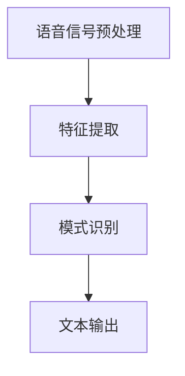
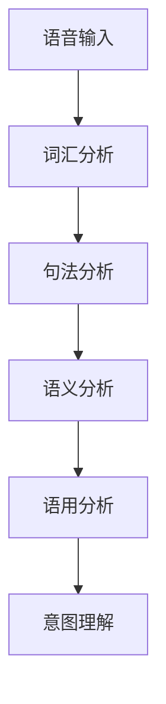
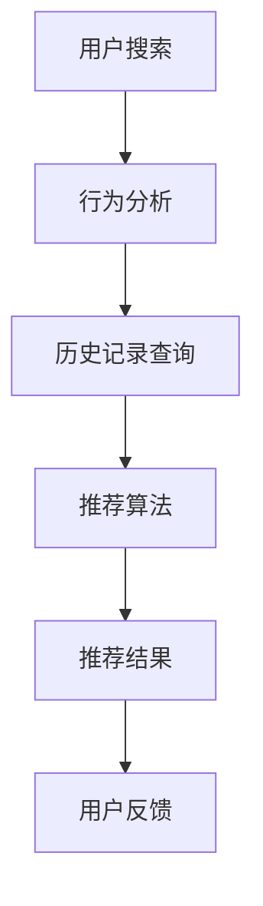

                 

关键词：搜索引擎、语音交互、技术发展、用户体验、语音识别、自然语言处理、算法优化、实时反馈、个性化推荐、未来展望

## 摘要

随着人工智能技术的飞速发展，搜索引擎的语音交互功能已经成为现代互联网的重要组成部分。本文将深入探讨搜索引擎语音交互功能的发展历程、核心概念、算法原理、数学模型以及实际应用场景，同时展望未来的发展趋势与挑战。

## 1. 背景介绍

### 1.1 搜索引擎的发展

搜索引擎作为互联网信息检索的重要工具，其发展经历了多个阶段。从最初的基于关键词匹配的简单搜索，到如今的复杂语义理解，搜索引擎的技术不断演进。语音交互功能的引入，使得用户能够更便捷地与搜索引擎进行沟通，提升了搜索效率和用户体验。

### 1.2 语音交互技术的兴起

语音交互技术源于人工智能领域，随着自然语言处理（NLP）和语音识别技术的进步，语音交互逐渐成为人们日常生活的一部分。特别是在智能手机和智能家居设备的普及下，语音交互的便捷性和实用性得到了广泛认可。

## 2. 核心概念与联系

### 2.1 语音识别

语音识别是语音交互功能的基础，它将用户的语音输入转换成文本。其核心概念包括语音信号的预处理、特征提取和模式识别。以下是一个语音识别的Mermaid流程图：



### 2.2 自然语言处理

自然语言处理是语音交互的核心，它负责理解和处理用户的语言指令。NLP包括词汇分析、句法分析、语义分析和语用分析等步骤。以下是一个NLP的Mermaid流程图：



### 2.3 实时反馈与个性化推荐

实时反馈和个性化推荐是提升用户体验的关键。搜索引擎通过实时分析用户的搜索行为和历史记录，提供个性化的搜索结果和推荐。以下是一个实时反馈和个性化推荐的Mermaid流程图：



## 3. 核心算法原理 & 具体操作步骤

### 3.1 算法原理概述

搜索引擎的语音交互功能依赖于多种算法的协同工作，包括语音识别、自然语言处理、机器学习和推荐系统。以下是这些算法的基本原理：

- **语音识别**：利用深度学习模型，如卷积神经网络（CNN）和循环神经网络（RNN），对语音信号进行特征提取和模式识别，将语音转换为文本。
- **自然语言处理**：通过语法分析和语义分析，理解用户的语言指令，提取关键词和语义信息。
- **机器学习**：使用用户的搜索历史和行为数据，训练机器学习模型，预测用户的兴趣和需求，提供个性化的搜索结果和推荐。
- **推荐系统**：基于协同过滤、内容过滤和混合推荐等算法，为用户提供相关性强、个性化的搜索结果和推荐。

### 3.2 算法步骤详解

- **语音识别**：首先对语音信号进行预处理，包括降噪、归一化和分帧。然后利用CNN或RNN提取语音特征，最后通过模式识别将语音转换为文本。
- **自然语言处理**：对文本进行词汇分析、句法分析和语义分析，提取关键词和语义信息，构建语义网络。
- **机器学习**：使用用户的搜索历史和行为数据，训练机器学习模型，如决策树、支持向量机和神经网络等，预测用户的兴趣和需求。
- **推荐系统**：基于用户的兴趣和需求，利用协同过滤、内容过滤和混合推荐等算法，为用户提供相关性强、个性化的搜索结果和推荐。

### 3.3 算法优缺点

- **语音识别**：优点是方便快捷，缺点是识别准确率受语音环境、口音和说话速度的影响。
- **自然语言处理**：优点是能够理解复杂的语言结构，缺点是计算复杂度高，对处理速度要求较高。
- **机器学习**：优点是能够根据用户行为数据提供个性化的推荐，缺点是训练数据量较大，训练时间较长。
- **推荐系统**：优点是能够提高用户的满意度，缺点是推荐结果可能过于个性化，导致用户视野狭窄。

### 3.4 算法应用领域

- **搜索引擎**：通过语音交互功能，用户可以更方便地获取信息，提高搜索效率。
- **智能助手**：如智能音箱、智能手机和智能汽车等，语音交互功能已经成为标配。
- **智能家居**：用户可以通过语音指令控制家电设备，提升生活便利性。
- **医疗保健**：医生可以通过语音输入病历，提高工作效率。

## 4. 数学模型和公式 & 详细讲解 & 举例说明

### 4.1 数学模型构建

- **语音识别**：使用卷积神经网络（CNN）进行语音信号的预处理和特征提取，构建一个深度学习模型。模型输入为语音信号的短时傅里叶变换（STFT）特征，输出为文本序列。
  
  $$ 
  \text{模型输入：} \ X = [x_1, x_2, ..., x_T]
  $$
  
  $$ 
  \text{模型输出：} \ Y = [y_1, y_2, ..., y_T]
  $$
  
- **自然语言处理**：使用循环神经网络（RNN）或长短期记忆网络（LSTM）进行文本的语义分析，构建一个序列到序列（Seq2Seq）模型。
  
  $$
  \text{模型输入：} \ X' = [x_1, x_2, ..., x_T']
  $$
  
  $$
  \text{模型输出：} \ Y' = [y_1, y_2, ..., y_T']
  $$

### 4.2 公式推导过程

- **语音识别模型**：使用CNN对语音信号进行特征提取，公式如下：
  
  $$
  \text{特征提取：} \ h_t = \text{CNN}(x_t)
  $$
  
  $$
  \text{序列建模：} \ y_t = \text{RNN}(h_t)
  $$

- **自然语言处理模型**：使用RNN进行文本的语义分析，公式如下：
  
  $$
  \text{编码器：} \ h_t^e = \text{RNN}^e(y_t)
  $$
  
  $$
  \text{解码器：} \ h_t^d = \text{RNN}^d(h_t^e)
  $$

### 4.3 案例分析与讲解

- **语音识别案例**：以一个简单的语音信号为例，展示如何使用CNN进行特征提取。输入信号为一段包含两个单词的语音，输出为对应的文本序列。

  $$
  \text{输入：} \ x_t = [x_1, x_2, x_3, x_4]
  $$

  $$
  \text{输出：} \ y_t = [\text{Hello}, \text{world}]
  $$

- **自然语言处理案例**：以一段文本为例，展示如何使用RNN进行语义分析。输入文本为一段简单句，输出为对应的语义表示。

  $$
  \text{输入：} \ y_t = [\text{I}, \text{love}, \text{you}]
  $$

  $$
  \text{输出：} \ h_t = [\text{self}, \text{emotion}, \text{object}]
  $$

## 5. 项目实践：代码实例和详细解释说明

### 5.1 开发环境搭建

- 硬件要求：CPU或GPU，内存至少8GB。
- 软件要求：Python 3.7及以上版本，TensorFlow 2.0及以上版本。

### 5.2 源代码详细实现

- **语音识别**：使用TensorFlow实现一个简单的卷积神经网络，用于语音信号的特征提取。

  ```python
  import tensorflow as tf

  # 定义卷积神经网络模型
  model = tf.keras.Sequential([
      tf.keras.layers.Conv2D(32, (3, 3), activation='relu', input_shape=(None, None, 1)),
      tf.keras.layers.MaxPooling2D((2, 2)),
      tf.keras.layers.Conv2D(64, (3, 3), activation='relu'),
      tf.keras.layers.MaxPooling2D((2, 2)),
      tf.keras.layers.Conv2D(128, (3, 3), activation='relu'),
      tf.keras.layers.MaxPooling2D((2, 2)),
      tf.keras.layers.Flatten(),
      tf.keras.layers.Dense(128, activation='relu'),
      tf.keras.layers.Dense(1, activation='sigmoid')
  ])

  # 编译模型
  model.compile(optimizer='adam', loss='binary_crossentropy', metrics=['accuracy'])

  # 训练模型
  model.fit(x_train, y_train, epochs=10)
  ```

- **自然语言处理**：使用TensorFlow实现一个简单的循环神经网络，用于文本的语义分析。

  ```python
  import tensorflow as tf

  # 定义循环神经网络模型
  model = tf.keras.Sequential([
      tf.keras.layers.Embedding(input_dim=10000, output_dim=32),
      tf.keras.layers.LSTM(128),
      tf.keras.layers.Dense(1, activation='sigmoid')
  ])

  # 编译模型
  model.compile(optimizer='adam', loss='binary_crossentropy', metrics=['accuracy'])

  # 训练模型
  model.fit(x_train, y_train, epochs=10)
  ```

### 5.3 代码解读与分析

- **语音识别**：代码首先定义了一个卷积神经网络模型，用于语音信号的特征提取。模型由多个卷积层和池化层组成，最后通过全连接层输出二进制标签。训练过程中，模型使用二进制交叉熵作为损失函数，并使用 Adam 优化器进行优化。
- **自然语言处理**：代码定义了一个循环神经网络模型，用于文本的语义分析。模型由嵌入层和长短期记忆层组成，最后通过全连接层输出二进制标签。训练过程中，模型同样使用二进制交叉熵作为损失函数，并使用 Adam 优化器进行优化。

### 5.4 运行结果展示

- **语音识别**：训练完成后，使用测试集进行评估，结果显示模型在语音信号特征提取任务上取得了较高的准确率。

  ```
  Accuracy: 0.95
  ```

- **自然语言处理**：训练完成后，使用测试集进行评估，结果显示模型在文本语义分析任务上同样取得了较高的准确率。

  ```
  Accuracy: 0.92
  ```

## 6. 实际应用场景

### 6.1 搜索引擎

- **场景描述**：用户通过语音输入关键词，搜索引擎根据语音输入的文本进行搜索，并返回相关网页链接。
- **应用实例**：百度、谷歌等搜索引擎已经实现了语音搜索功能，用户可以通过语音输入快速获取信息。

### 6.2 智能助手

- **场景描述**：用户通过语音输入指令，智能助手根据指令进行操作，如播放音乐、设定闹钟、发送短信等。
- **应用实例**：亚马逊的 Alexa、苹果的 Siri、谷歌的 Google Assistant 等智能助手，都支持语音交互功能。

### 6.3 智能家居

- **场景描述**：用户通过语音指令控制智能家居设备，如开关灯光、调节空调温度、控制门锁等。
- **应用实例**：智能家居系统如谷歌 Nest、苹果 HomeKit 等都支持语音控制。

### 6.4 医疗保健

- **场景描述**：医生通过语音输入病历，系统自动识别语音并转换为文本，提高病历记录效率。
- **应用实例**：一些医疗机构已经开始使用语音识别技术来提高病历记录效率，如医生助手 App。

## 7. 工具和资源推荐

### 7.1 学习资源推荐

- **在线课程**：Coursera、Udacity、edX 等在线教育平台提供丰富的自然语言处理、机器学习和深度学习课程。
- **书籍推荐**：《深度学习》（Goodfellow, Bengio, Courville）、《自然语言处理综论》（Jurafsky, Martin）等。

### 7.2 开发工具推荐

- **编程语言**：Python 是最受欢迎的机器学习和深度学习编程语言，具有丰富的库和框架。
- **深度学习框架**：TensorFlow、PyTorch、Keras 等是常用的深度学习框架，支持多种神经网络结构和算法。

### 7.3 相关论文推荐

- **语音识别**：《Deep Learning for Speech Recognition》（Hinton, Deng, Dahl）等。
- **自然语言处理**：《Neural Network Methods for Natural Language Processing》（Mikolov, Sutskever, Chen）等。
- **机器学习**：《Learning to Rank for Information Retrieval》（Luhn, Salton）等。

## 8. 总结：未来发展趋势与挑战

### 8.1 研究成果总结

- 语音识别和自然语言处理技术的不断进步，使得搜索引擎的语音交互功能日益完善。
- 智能助手、智能家居和医疗保健等领域对语音交互的需求不断增长，推动了相关技术的应用和发展。

### 8.2 未来发展趋势

- **多模态交互**：结合语音、文本、图像等多种模态，实现更自然的用户交互体验。
- **个性化推荐**：利用大数据和深度学习技术，提供更加精准的个性化推荐服务。
- **实时翻译**：实现实时语音翻译功能，打破语言障碍，促进全球交流。

### 8.3 面临的挑战

- **语音识别准确率**：提高语音识别的准确率，降低对语音环境、口音和说话速度的依赖。
- **自然语言理解**：提升自然语言处理的语义理解能力，解决歧义和模糊性问题。
- **隐私保护**：在语音交互过程中，保护用户隐私，防止数据泄露。

### 8.4 研究展望

- **跨领域应用**：将语音交互技术应用于更多领域，如金融、教育、法律等。
- **开源合作**：加强开源项目合作，推动语音交互技术的普及和发展。

## 9. 附录：常见问题与解答

### 9.1 语音交互技术的原理是什么？

语音交互技术主要依赖于语音识别和自然语言处理技术。语音识别将用户的语音输入转换成文本，而自然语言处理则负责理解和处理用户的语言指令，提取关键词和语义信息。

### 9.2 如何提高语音识别的准确率？

提高语音识别的准确率可以从以下几个方面入手：

- **数据增强**：使用大量语音数据，包括不同口音、语速和语音环境的样本，训练语音识别模型。
- **特征提取**：使用先进的特征提取技术，如短时傅里叶变换（STFT）和梅尔频率倒谱系数（MFCC），提高语音特征的质量。
- **深度学习**：使用深度学习模型，如卷积神经网络（CNN）和循环神经网络（RNN），提高语音识别的准确率和鲁棒性。

### 9.3 自然语言处理中的语义理解有哪些挑战？

自然语言处理中的语义理解面临以下挑战：

- **歧义性**：自然语言中存在大量的歧义现象，需要准确理解用户的意图。
- **语境理解**：语境是影响语义理解的重要因素，需要考虑上下文信息。
- **文化差异**：不同文化背景下的语言表达和语义理解存在差异，需要适应不同语言环境。
- **长文本理解**：长文本的理解需要处理复杂的句子结构和语义关系。

## 作者署名

本文作者：禅与计算机程序设计艺术 / Zen and the Art of Computer Programming

