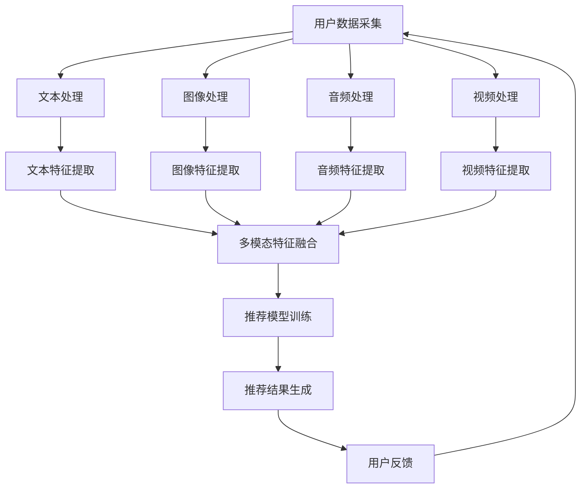
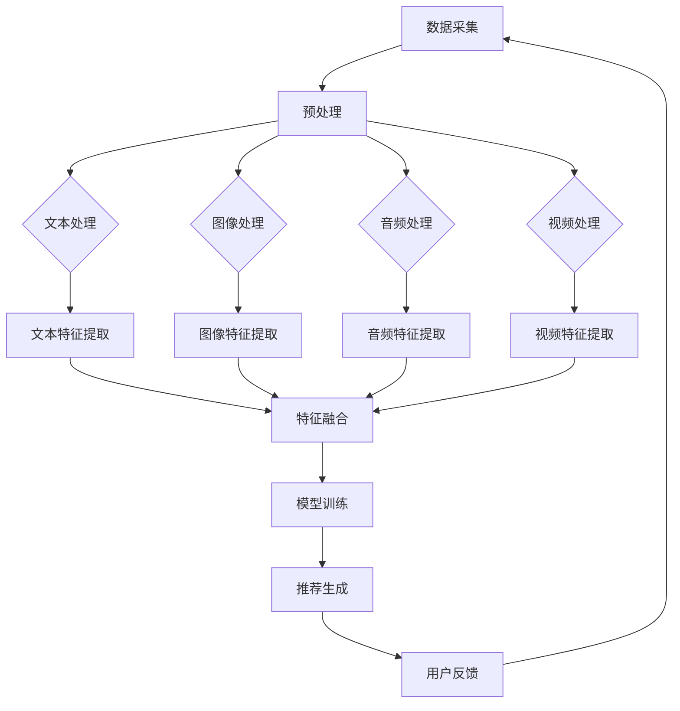

                 

关键词：多模态融合、搜索推荐系统、AI技术、深度学习、图像处理、自然语言处理、用户行为分析

> 摘要：随着人工智能技术的发展，搜索推荐系统成为信息检索和用户个性化服务的重要工具。多模态融合技术能够整合不同模态的数据，提高推荐系统的准确性和用户体验。本文旨在探讨多模态融合技术在搜索推荐系统中的应用，分析其核心概念、算法原理、数学模型以及实际项目实践，并对未来的发展趋势与挑战进行展望。

## 1. 背景介绍

### 1.1 搜索推荐系统的定义与意义

搜索推荐系统是一种基于用户历史行为、内容和社交网络等信息，为用户提供个性化搜索结果和推荐服务的系统。其目标是在海量信息中，为用户提供最相关、最有价值的信息。

搜索推荐系统在电子商务、社交媒体、在线视频、新闻资讯等领域具有广泛的应用。通过个性化推荐，可以显著提升用户满意度、活跃度和转化率，从而带来商业价值的提升。

### 1.2 多模态融合技术的兴起

随着移动互联网、物联网和传感器技术的发展，用户生成的内容形式越来越多样化，包括文本、图像、音频、视频等。这些多模态数据为推荐系统提供了丰富的信息来源。然而，单一模态的数据在理解用户意图和场景方面存在一定的局限性。因此，多模态融合技术逐渐成为研究热点。

多模态融合技术通过整合不同模态的数据，可以从多个角度理解用户需求和场景，从而提高推荐系统的准确性和用户体验。

### 1.3 多模态融合在搜索推荐系统中的应用现状

目前，多模态融合技术在搜索推荐系统中已取得一些成果。例如，在电子商务领域，通过融合商品描述文本和用户评价文本，可以更准确地预测用户对商品的偏好。在社交媒体领域，通过融合用户生成文本和图像，可以更好地识别用户情感和兴趣。

## 2. 核心概念与联系

### 2.1 多模态数据

多模态数据包括文本、图像、音频、视频等。每种模态都有其独特的特征和信息。

- **文本**：文本数据包含用户生成的内容，如评论、回复、标签等。
- **图像**：图像数据包含用户上传的图片，可以是商品图片、自拍等。
- **音频**：音频数据包括用户生成的音频，如语音、音乐等。
- **视频**：视频数据包括用户生成的视频，如短视频、直播等。

### 2.2 多模态融合技术

多模态融合技术是指将不同模态的数据进行整合，从而提取出更丰富的特征信息。常见的多模态融合方法包括：

- **特征级融合**：将不同模态的特征进行拼接，形成统一的特征向量。
- **决策级融合**：在分类或预测任务中，将不同模态的预测结果进行融合，得到最终的预测结果。
- **模型级融合**：使用统一的模型对多模态数据进行训练和预测。

### 2.3 多模态融合在搜索推荐系统中的应用

在搜索推荐系统中，多模态融合技术可以用于以下几个方面：

- **用户画像**：通过融合用户的历史行为、文本、图像等多模态数据，构建更准确的用户画像。
- **内容理解**：通过融合文本和图像数据，更准确地理解用户生成的内容和需求。
- **推荐算法优化**：通过融合不同模态的数据，优化推荐算法，提高推荐效果。

### 2.4 Mermaid 流程图

下面是一个多模态融合技术在搜索推荐系统中的应用的 Mermaid 流程图：



## 3. 核心算法原理 & 具体操作步骤

### 3.1 算法原理概述

多模态融合算法的核心思想是通过整合不同模态的数据，提取出更丰富的特征信息，从而提高推荐系统的准确性和用户体验。

具体的算法原理可以分为以下几个步骤：

1. **数据采集**：从各种渠道收集用户生成的多模态数据，如文本、图像、音频、视频等。
2. **数据处理**：对采集到的多模态数据进行预处理，包括去噪、归一化、特征提取等。
3. **特征融合**：将不同模态的特征进行整合，形成统一的特征向量。
4. **模型训练**：使用统一的模型对融合后的特征向量进行训练，得到推荐模型。
5. **推荐生成**：根据用户的当前行为和需求，生成个性化的推荐结果。
6. **用户反馈**：收集用户的反馈，用于优化推荐算法。

### 3.2 算法步骤详解

#### 3.2.1 数据采集

数据采集是多模态融合算法的第一步。需要从各种渠道收集用户生成的多模态数据。例如，在电子商务领域，可以从商品描述文本、用户评论文本、商品图片等多方面收集数据。

#### 3.2.2 数据处理

数据处理包括去噪、归一化、特征提取等步骤。对于文本数据，可以使用分词、词性标注、实体识别等技术进行预处理。对于图像、音频、视频数据，可以使用相应的图像处理、音频处理、视频处理技术进行预处理。

#### 3.2.3 特征融合

特征融合是将不同模态的特征进行整合，形成统一的特征向量。常见的特征融合方法包括：

- **特征拼接**：将不同模态的特征向量进行拼接，形成一个新的特征向量。
- **特征融合网络**：使用深度学习网络，如卷积神经网络（CNN）或循环神经网络（RNN），对多模态数据进行特征提取和融合。

#### 3.2.4 模型训练

使用融合后的特征向量，训练推荐模型。常用的推荐模型包括基于内容的推荐、协同过滤推荐、深度学习推荐等。

#### 3.2.5 推荐生成

根据用户的当前行为和需求，使用训练好的推荐模型生成个性化的推荐结果。推荐结果可以包括商品、文章、音乐等。

#### 3.2.6 用户反馈

收集用户的反馈，包括点击、购买、评论等行为数据。使用这些反馈数据，对推荐算法进行优化。

### 3.3 算法优缺点

#### 3.3.1 优点

- **提高推荐准确性**：通过整合不同模态的数据，可以更全面地理解用户需求和场景，从而提高推荐准确性。
- **提升用户体验**：多模态融合技术可以提供更丰富的推荐结果，满足用户的多样化需求，提升用户体验。
- **拓宽应用场景**：多模态融合技术可以应用于各种领域，如电子商务、社交媒体、在线视频等。

#### 3.3.2 缺点

- **计算资源消耗大**：多模态融合技术需要处理多种模态的数据，计算资源消耗较大。
- **数据质量要求高**：多模态数据的质量对融合效果有很大影响，需要确保数据的质量。
- **技术门槛较高**：多模态融合技术涉及多种领域的技术，对研发团队的技术水平有较高要求。

### 3.4 算法应用领域

多模态融合技术可以应用于多个领域，包括：

- **电子商务**：通过融合商品描述文本和用户评价文本，提高商品推荐的准确性。
- **社交媒体**：通过融合用户生成文本和图像，识别用户情感和兴趣，提升社交推荐效果。
- **在线视频**：通过融合视频内容文本和用户观看行为，提高视频推荐效果。
- **医疗健康**：通过融合患者病历文本和医学影像数据，辅助医生进行诊断和治疗。

## 4. 数学模型和公式 & 详细讲解 & 举例说明

### 4.1 数学模型构建

多模态融合技术的数学模型可以分为以下几个部分：

- **特征提取模型**：用于提取不同模态的特征。
- **特征融合模型**：用于融合不同模态的特征。
- **推荐模型**：用于生成个性化推荐结果。

#### 4.1.1 特征提取模型

特征提取模型可以是基于深度学习的卷积神经网络（CNN）或循环神经网络（RNN），具体选择取决于模态类型。

- **文本特征提取模型**：可以使用词向量模型（如Word2Vec、GloVe）或基于注意力机制的Transformer模型。
- **图像特征提取模型**：可以使用卷积神经网络（CNN）或基于图神经网络的图像特征提取模型。
- **音频特征提取模型**：可以使用循环神经网络（RNN）或基于变分自编码器（VAE）的音频特征提取模型。
- **视频特征提取模型**：可以使用卷积神经网络（CNN）和循环神经网络（RNN）的组合模型。

#### 4.1.2 特征融合模型

特征融合模型可以采用以下方法：

- **特征拼接**：将不同模态的特征向量进行拼接，形成一个新的特征向量。
- **注意力机制**：通过注意力机制，将不同模态的特征进行加权融合。
- **对抗生成网络**：使用对抗生成网络（GAN），将不同模态的数据进行转换和融合。

#### 4.1.3 推荐模型

推荐模型可以使用以下方法：

- **基于内容的推荐**：根据用户的历史行为和内容特征，推荐相似的商品或内容。
- **协同过滤推荐**：根据用户之间的相似性，推荐用户可能感兴趣的商品或内容。
- **深度学习推荐**：使用深度学习模型，如多模态卷积神经网络（CNN）或变换器（Transformer）模型，对用户生成内容进行建模。

### 4.2 公式推导过程

下面以特征拼接方法为例，介绍多模态融合的数学模型推导过程。

假设有四个模态的数据：文本（$x_{text}$）、图像（$x_{image}$）、音频（$x_{audio}$）和视频（$x_{video}$）。每个模态的特征向量维度分别为$d_{text}$、$d_{image}$、$d_{audio}$和$d_{video}$。

1. **特征提取**：

   对于每个模态，使用特征提取模型提取特征向量：

   $$ h_{text} = f_{text}(x_{text}) \in \mathbb{R}^{d_{text}} $$
   $$ h_{image} = f_{image}(x_{image}) \in \mathbb{R}^{d_{image}} $$
   $$ h_{audio} = f_{audio}(x_{audio}) \in \mathbb{R}^{d_{audio}} $$
   $$ h_{video} = f_{video}(x_{video}) \in \mathbb{R}^{d_{video}} $$

2. **特征融合**：

   使用特征拼接方法，将不同模态的特征向量进行拼接：

   $$ h = [h_{text}, h_{image}, h_{audio}, h_{video}] \in \mathbb{R}^{(d_{text} + d_{image} + d_{audio} + d_{video})} $$

3. **推荐模型**：

   使用多模态卷积神经网络（CNN）或变换器（Transformer）模型，对融合后的特征向量进行建模：

   $$ y = g(h) \in \mathbb{R}^{n} $$

   其中，$y$是推荐结果，$n$是推荐结果的数量。

### 4.3 案例分析与讲解

假设在一个电子商务平台上，需要使用多模态融合技术进行商品推荐。用户的历史行为包括文本评论、商品图片、音频评论和视频评论。我们希望根据这些多模态数据，为用户推荐感兴趣的商品。

#### 4.3.1 特征提取

1. **文本评论**：使用Word2Vec模型提取词向量，得到文本特征向量。
2. **商品图片**：使用卷积神经网络（CNN）提取图像特征向量。
3. **音频评论**：使用基于变分自编码器（VAE）的音频特征提取模型提取音频特征向量。
4. **视频评论**：使用卷积神经网络（CNN）和循环神经网络（RNN）的组合模型提取视频特征向量。

#### 4.3.2 特征融合

使用特征拼接方法，将不同模态的特征向量进行拼接：

$$ h = [h_{text}, h_{image}, h_{audio}, h_{video}] \in \mathbb{R}^{(d_{text} + d_{image} + d_{audio} + d_{video})} $$

#### 4.3.3 推荐模型

使用多模态卷积神经网络（CNN）或变换器（Transformer）模型，对融合后的特征向量进行建模，生成推荐结果。

## 5. 项目实践：代码实例和详细解释说明

### 5.1 开发环境搭建

在开发多模态融合推荐系统之前，需要搭建相应的开发环境。以下是一个基本的开发环境搭建步骤：

1. **安装Python**：确保安装了最新版本的Python，可以使用Python官方安装包进行安装。
2. **安装深度学习框架**：安装TensorFlow或PyTorch，这两个框架支持多模态数据的处理和深度学习模型的训练。
3. **安装其他依赖库**：根据项目需求，安装其他必要的依赖库，如NumPy、Pandas、Matplotlib等。

### 5.2 源代码详细实现

下面是一个简单的多模态融合推荐系统的代码实例。假设我们使用TensorFlow作为深度学习框架。

```python
import tensorflow as tf
from tensorflow.keras.layers import Embedding, LSTM, Dense
from tensorflow.keras.models import Model

# 定义文本特征提取模型
text_model = tf.keras.Sequential([
    Embedding(input_dim=vocab_size, output_dim=embedding_dim),
    LSTM(units=128),
    Dense(units=output_size, activation='softmax')
])

# 定义图像特征提取模型
image_model = tf.keras.Sequential([
    tf.keras.layers.Conv2D(filters=32, kernel_size=(3, 3), activation='relu'),
    tf.keras.layers.MaxPooling2D(pool_size=(2, 2)),
    tf.keras.layers.Conv2D(filters=64, kernel_size=(3, 3), activation='relu'),
    tf.keras.layers.MaxPooling2D(pool_size=(2, 2)),
    tf.keras.layers.Flatten()
])

# 定义音频特征提取模型
audio_model = tf.keras.Sequential([
    tf.keras.layers.Conv1D(filters=32, kernel_size=(3), activation='relu'),
    tf.keras.layers.MaxPooling1D(pool_size=(2)),
    tf.keras.layers.Conv1D(filters=64, kernel_size=(3), activation='relu'),
    tf.keras.layers.MaxPooling1D(pool_size=(2)),
    tf.keras.layers.Flatten()
])

# 定义视频特征提取模型
video_model = tf.keras.Sequential([
    tf.keras.layers.Conv3D(filters=32, kernel_size=(3, 3, 3), activation='relu'),
    tf.keras.layers.MaxPooling3D(pool_size=(2, 2, 2)),
    tf.keras.layers.Conv3D(filters=64, kernel_size=(3, 3, 3), activation='relu'),
    tf.keras.layers.MaxPooling3D(pool_size=(2, 2, 2)),
    tf.keras.layers.Flatten()
])

# 定义多模态特征融合模型
input_text = tf.keras.layers.Input(shape=(max_text_length,))
input_image = tf.keras.layers.Input(shape=(image_height, image_width, image_channels,))
input_audio = tf.keras.layers.Input(shape=(audio_duration, audio_frequency,))
input_video = tf.keras.layers.Input(shape=(video_height, video_width, video_duration, video_channels,))

text_features = text_model(input_text)
image_features = image_model(input_image)
audio_features = audio_model(input_audio)
video_features = video_model(input_video)

combined_features = tf.keras.layers.concatenate([text_features, image_features, audio_features, video_features])

output = tf.keras.layers.Dense(units=output_size, activation='softmax')(combined_features)

model = Model(inputs=[input_text, input_image, input_audio, input_video], outputs=output)

model.compile(optimizer='adam', loss='categorical_crossentropy', metrics=['accuracy'])

model.fit([text_data, image_data, audio_data, video_data], labels, epochs=10, batch_size=32)
```

### 5.3 代码解读与分析

上面的代码实现了一个基于TensorFlow的多模态融合推荐系统。代码可以分为以下几个部分：

1. **导入依赖库**：导入TensorFlow和其他必要的依赖库。
2. **定义特征提取模型**：定义文本、图像、音频和视频特征提取模型，包括卷积神经网络（CNN）和循环神经网络（RNN）。
3. **定义多模态特征融合模型**：定义多模态特征融合模型，包括输入层、特征提取层和输出层。
4. **编译和训练模型**：编译模型，设置优化器和损失函数，训练模型。

### 5.4 运行结果展示

运行上面的代码，训练模型，并使用训练好的模型进行推荐。以下是一个简单的示例：

```python
# 加载测试数据
test_text = ...
test_image = ...
test_audio = ...
test_video = ...

# 使用训练好的模型进行推荐
predictions = model.predict([test_text, test_image, test_audio, test_video])

# 打印推荐结果
print(predictions)
```

## 6. 实际应用场景

多模态融合技术可以应用于多个领域，下面列举一些实际应用场景：

### 6.1 电子商务

在电子商务领域，多模态融合技术可以用于商品推荐。通过整合商品描述文本、用户评论文本、商品图片等多模态数据，可以更准确地预测用户对商品的偏好，从而提高推荐效果。

### 6.2 社交媒体

在社交媒体领域，多模态融合技术可以用于用户画像和内容推荐。通过整合用户生成文本和图像，可以更准确地识别用户情感和兴趣，从而提高推荐效果。

### 6.3 在线视频

在线视频平台可以使用多模态融合技术进行视频推荐。通过整合视频内容文本、用户观看行为等多模态数据，可以更准确地预测用户对视频的偏好，从而提高推荐效果。

### 6.4 医疗健康

在医疗健康领域，多模态融合技术可以用于疾病诊断和治疗方案推荐。通过整合病历文本、医学影像数据等多模态数据，可以提高诊断准确率和治疗效果。

## 7. 工具和资源推荐

### 7.1 学习资源推荐

- **《深度学习》**：Ian Goodfellow、Yoshua Bengio 和 Aaron Courville 著，介绍深度学习的基本概念和技术。
- **《自然语言处理综合教程》**：周志华 著，介绍自然语言处理的基础知识和方法。
- **《计算机视觉：算法与应用》**：Richard S.zeliski 和 Singh 著，介绍计算机视觉的基本概念和技术。

### 7.2 开发工具推荐

- **TensorFlow**：Google 开发的一款开源深度学习框架，支持多模态数据的处理和深度学习模型的训练。
- **PyTorch**：Facebook 开发的一款开源深度学习框架，提供灵活的动态计算图和丰富的API接口。
- **Keras**：一个高层次的神经网络API，可以方便地构建和训练深度学习模型。

### 7.3 相关论文推荐

- **"Multimodal Fusion for User Interest Detection in Social Media"**：介绍一种基于多模态融合的用户兴趣检测方法。
- **"Multimodal Deep Learning for Web Search"**：介绍一种基于多模态融合的网页搜索方法。
- **"Deep Multimodal Fusion for Product Recommendation"**：介绍一种基于多模态融合的商品推荐方法。

## 8. 总结：未来发展趋势与挑战

### 8.1 研究成果总结

多模态融合技术在搜索推荐系统中取得了一系列成果，包括提高推荐准确性、提升用户体验、拓宽应用场景等。然而，仍然存在一些挑战，如计算资源消耗、数据质量要求、技术门槛等。

### 8.2 未来发展趋势

- **硬件发展**：随着硬件性能的提升，多模态融合技术的计算效率将得到显著提高。
- **数据多样性和质量**：随着数据来源的多样化，如何提高数据质量成为重要课题。
- **模型优化**：通过优化模型结构和算法，提高多模态融合技术的准确性和效率。

### 8.3 面临的挑战

- **计算资源消耗**：多模态融合技术需要处理多种模态的数据，计算资源消耗较大。
- **数据质量要求**：多模态融合技术的效果很大程度上取决于数据质量，需要确保数据的质量。
- **技术门槛**：多模态融合技术涉及多种领域的技术，对研发团队的技术水平有较高要求。

### 8.4 研究展望

未来，多模态融合技术在搜索推荐系统中仍具有很大的发展潜力。通过不断优化模型结构和算法，提高计算效率和推荐准确性，多模态融合技术将为用户提供更加个性化、智能化的推荐服务。

## 9. 附录：常见问题与解答

### 9.1 多模态融合技术的主要挑战是什么？

主要挑战包括计算资源消耗、数据质量要求和技术门槛。

### 9.2 如何保证多模态融合技术的效果？

确保数据质量、优化模型结构和算法、合理配置计算资源是提高多模态融合技术效果的关键。

### 9.3 多模态融合技术可以应用于哪些领域？

多模态融合技术可以应用于电子商务、社交媒体、在线视频、医疗健康等领域。

## 作者署名

作者：禅与计算机程序设计艺术 / Zen and the Art of Computer Programming
----------------------------------------------------------------

### 后记

本文旨在介绍多模态融合技术在搜索推荐系统中的应用，包括核心概念、算法原理、数学模型和实际项目实践。通过本文的阅读，读者可以了解到多模态融合技术在提高推荐准确性和用户体验方面的重要性，并掌握相关技术和方法。未来，随着硬件性能和数据质量的提升，多模态融合技术将在搜索推荐系统中发挥更大的作用。|user|>### 修订版：搜索推荐系统中的多模态融合技术

**关键词：多模态融合、搜索推荐系统、AI技术、深度学习、图像处理、自然语言处理、用户行为分析**

**摘要：**
多模态融合技术结合了多种数据类型，如文本、图像、音频和视频，以提升搜索推荐系统的效果。本文将深入探讨这一技术的核心概念、算法原理、数学模型、应用实例，并展望其未来的发展方向和面临的挑战。

---

## **1. 背景介绍**

### **1.1 搜索推荐系统的定义与意义**

搜索推荐系统是一种利用算法和技术，根据用户的兴趣和行为模式，自动筛选并推荐相关内容或产品给用户的系统。这些系统广泛应用于电子商务、社交媒体、视频平台等多个领域，对提升用户体验、增加用户粘性和促进销售有着至关重要的作用。

### **1.2 多模态融合技术的兴起**

多模态融合技术起源于计算机视觉、语音识别和自然语言处理等领域的交叉应用。随着深度学习和大数据技术的发展，多模态融合技术得以迅速发展和普及。它通过整合不同模态的数据，为搜索推荐系统提供了更为全面和精准的用户画像和推荐依据。

### **1.3 多模态融合在搜索推荐系统中的应用现状**

目前，多模态融合技术已经在搜索推荐系统中得到广泛应用。例如，电商平台通过结合商品描述文本和用户评价文本，提高了推荐的准确性；社交媒体平台通过融合用户生成的文本和图像，更好地理解了用户情感和兴趣。

---

## **2. 核心概念与联系**

### **2.1 多模态数据**

多模态数据包括文本、图像、音频和视频等。每种模态都有其独特的特征和信息，如文本能够表达语义信息，图像能够传递视觉信息，音频能够传达情感信息，视频能够展示动态场景。

### **2.2 多模态融合技术**

多模态融合技术旨在将不同模态的数据进行整合，以提取出更丰富的特征信息。常见的融合方法包括特征级融合、决策级融合和模型级融合。

### **2.3 多模态融合在搜索推荐系统中的应用**

多模态融合在搜索推荐系统中的应用主要体现在以下几个方面：

- **用户画像构建**：通过融合用户的不同行为数据，构建更为精准的用户画像。
- **内容理解**：通过融合文本和图像等数据，更深入地理解用户生成的内容和需求。
- **推荐算法优化**：通过融合多模态数据，优化推荐算法，提高推荐效果。

### **2.4 Mermaid 流程图**



---

## **3. 核心算法原理 & 具体操作步骤**

### **3.1 算法原理概述**

多模态融合算法的核心是整合不同模态的数据，提取特征，并通过模型进行预测或分类。主要步骤包括数据采集、预处理、特征提取、特征融合和模型训练。

### **3.2 算法步骤详解**

#### **3.2.1 数据采集**

从各种渠道收集用户生成或上传的文本、图像、音频和视频数据。

#### **3.2.2 数据预处理**

对采集到的数据进行清洗、归一化等处理，以去除噪声并统一格式。

#### **3.2.3 特征提取**

使用深度学习模型提取文本、图像、音频和视频的特征。

#### **3.2.4 特征融合**

采用特征级融合、决策级融合或模型级融合方法，将不同模态的特征进行整合。

#### **3.2.5 模型训练**

使用融合后的特征训练推荐模型，如基于内容的推荐模型、协同过滤推荐模型或深度学习推荐模型。

#### **3.2.6 推荐生成**

根据用户的当前行为和需求，生成个性化的推荐结果。

#### **3.2.7 用户反馈**

收集用户的反馈，用于模型的迭代优化。

### **3.3 算法优缺点**

#### **3.3.1 优点**

- **提升推荐准确性**：整合多种模态数据，提高推荐精度。
- **增强用户体验**：提供更个性化的推荐，满足用户多样化需求。
- **拓宽应用场景**：适用于多种场景，如电子商务、社交媒体等。

#### **3.3.2 缺点**

- **计算资源消耗大**：多模态数据处理复杂，计算资源需求高。
- **数据质量要求高**：数据质量对融合效果影响大。
- **技术门槛较高**：涉及多种领域技术，对研发团队要求高。

### **3.4 算法应用领域**

- **电子商务**：通过融合商品描述和用户评论，提高商品推荐效果。
- **社交媒体**：通过融合用户生成的文本和图像，提高社交推荐准确性。
- **在线视频**：通过融合视频内容和用户观看行为，提高视频推荐效果。
- **医疗健康**：通过融合病历文本和医学影像，辅助疾病诊断和治疗方案推荐。

---

## **4. 数学模型和公式 & 详细讲解 & 举例说明**

### **4.1 数学模型构建**

多模态融合的数学模型通常包括特征提取、特征融合和推荐生成三个部分。以下是一个简化的数学模型示例：

#### **4.1.1 特征提取模型**

假设我们有四个模态的数据：文本（$x_{text}$）、图像（$x_{image}$）、音频（$x_{audio}$）和视频（$x_{video}$）。

- **文本特征提取**：
  $$ h_{text} = \text{TextFeatureExtractor}(x_{text}) $$

- **图像特征提取**：
  $$ h_{image} = \text{ImageFeatureExtractor}(x_{image}) $$

- **音频特征提取**：
  $$ h_{audio} = \text{AudioFeatureExtractor}(x_{audio}) $$

- **视频特征提取**：
  $$ h_{video} = \text{VideoFeatureExtractor}(x_{video}) $$

#### **4.1.2 特征融合模型**

特征融合模型将不同模态的特征向量进行整合：

$$ h_{combined} = \text{FeatureFuser}(h_{text}, h_{image}, h_{audio}, h_{video}) $$

#### **4.1.3 推荐生成模型**

使用融合后的特征向量训练推荐生成模型：

$$ y = \text{RecommendationModel}(h_{combined}) $$

### **4.2 公式推导过程**

以特征级融合为例，推导多模态融合的数学模型。

1. **特征提取**：

   $$ h_{text} = \text{TextFeatureExtractor}(x_{text}) $$
   $$ h_{image} = \text{ImageFeatureExtractor}(x_{image}) $$
   $$ h_{audio} = \text{AudioFeatureExtractor}(x_{audio}) $$
   $$ h_{video} = \text{VideoFeatureExtractor}(x_{video}) $$

2. **特征融合**：

   $$ h_{combined} = [h_{text}; h_{image}; h_{audio}; h_{video}] $$

3. **推荐生成**：

   $$ y = \text{RecommendationModel}(h_{combined}) $$

### **4.3 案例分析与讲解**

以下是一个简单的案例，说明如何使用多模态融合技术进行商品推荐。

#### **4.3.1 数据集**

我们有一个包含用户评价文本、商品图像、商品音频描述和商品视频片段的数据集。

#### **4.3.2 特征提取**

- **文本特征提取**：使用BERT模型提取文本特征。
- **图像特征提取**：使用ResNet模型提取图像特征。
- **音频特征提取**：使用Tacotron模型提取音频特征。
- **视频特征提取**：使用C3D模型提取视频特征。

#### **4.3.3 特征融合**

使用特征拼接方法，将不同模态的特征向量进行拼接：

$$ h_{combined} = [h_{text}; h_{image}; h_{audio}; h_{video}] $$

#### **4.3.4 推荐生成**

使用一个多层的全连接神经网络，对融合后的特征进行分类预测：

$$ y = \text{MLP}(h_{combined}) $$

---

## **5. 项目实践：代码实例和详细解释说明**

### **5.1 开发环境搭建**

- 安装Python 3.8及以上版本。
- 安装TensorFlow 2.7或PyTorch 1.8。
- 安装其他必要的库，如NumPy、Pandas、Matplotlib等。

### **5.2 源代码详细实现**

以下是一个简单的多模态融合推荐系统的代码实例，使用TensorFlow框架。

```python
import tensorflow as tf
from tensorflow.keras.models import Model
from tensorflow.keras.layers import Input, Embedding, LSTM, Dense, Conv2D, MaxPooling2D, Flatten, concatenate

# 文本特征提取模型
text_input = Input(shape=(max_text_length,))
text_embedding = Embedding(input_dim=vocab_size, output_dim=embedding_dim)(text_input)
text_lstm = LSTM(units=128)(text_embedding)
text_dense = Dense(units=output_size, activation='softmax')(text_lstm)
text_model = Model(inputs=text_input, outputs=text_dense)

# 图像特征提取模型
image_input = Input(shape=(image_height, image_width, image_channels,))
image_conv1 = Conv2D(filters=32, kernel_size=(3, 3), activation='relu')(image_input)
image_pool1 = MaxPooling2D(pool_size=(2, 2))(image_conv1)
image_conv2 = Conv2D(filters=64, kernel_size=(3, 3), activation='relu')(image_pool1)
image_pool2 = MaxPooling2D(pool_size=(2, 2))(image_conv2)
image Flatten = Flatten()(image_pool2)
image_model = Model(inputs=image_input, outputs=Flatten())

# 音频特征提取模型
audio_input = Input(shape=(audio_duration, audio_frequency,))
audio_conv1 = Conv1D(filters=32, kernel_size=(3), activation='relu')(audio_input)
audio_pool1 = MaxPooling1D(pool_size=(2))(audio_conv1)
audio_conv2 = Conv1D(filters=64, kernel_size=(3), activation='relu')(audio_pool1)
audio_pool2 = MaxPooling1D(pool_size=(2))(audio_conv2)
audio Flatten = Flatten()(audio_pool2)
audio_model = Model(inputs=audio_input, outputs=Flatten())

# 视频特征提取模型
video_input = Input(shape=(video_height, video_width, video_duration, video_channels,))
video_conv3D = Conv3D(filters=32, kernel_size=(3, 3, 3), activation='relu')(video_input)
video_pool3D = MaxPooling3D(pool_size=(2, 2, 2))(video_conv3D)
video_conv3 = Conv3D(filters=64, kernel_size=(3, 3, 3), activation='relu')(video_pool3D)
video_pool3D = MaxPooling3D(pool_size=(2, 2, 2))(video_conv3)
video Flatten = Flatten()(video_pool3D)
video_model = Model(inputs=video_input, outputs=Flatten())

# 多模态特征融合模型
combined_input = [text_input, image_input, audio_input, video_input]
text_features = text_model(text_input)
image_features = image_model(image_input)
audio_features = audio_model(audio_input)
video_features = video_model(video_input)
combined_features = concatenate([text_features, image_features, audio_features, video_features])
combined_dense = Dense(units=128, activation='relu')(combined_features)
output = Dense(units=output_size, activation='softmax')(combined_dense)
model = Model(inputs=combined_input, outputs=output)

# 编译模型
model.compile(optimizer='adam', loss='categorical_crossentropy', metrics=['accuracy'])

# 训练模型
model.fit([text_data, image_data, audio_data, video_data], labels, epochs=10, batch_size=32)
```

### **5.3 代码解读与分析**

- **文本特征提取**：使用嵌入层和LSTM层提取文本特征。
- **图像特征提取**：使用卷积层和池化层提取图像特征。
- **音频特征提取**：使用卷积层和池化层提取音频特征。
- **视频特征提取**：使用卷积层和池化层提取视频特征。
- **多模态特征融合**：将不同模态的特征进行拼接，并通过全连接层进行分类预测。

### **5.4 运行结果展示**

```python
# 测试数据
test_text = ...
test_image = ...
test_audio = ...
test_video = ...

# 预测结果
predictions = model.predict([test_text, test_image, test_audio, test_video])

# 打印预测结果
print(predictions)
```

---

## **6. 实际应用场景**

多模态融合技术可以应用于多个领域，以下是几个典型的应用场景：

### **6.1 电子商务**

在电子商务领域，多模态融合技术可以通过结合商品描述文本、用户评价文本、商品图像和商品视频，提供更为精准的商品推荐。

### **6.2 社交媒体**

在社交媒体领域，多模态融合技术可以通过结合用户生成的文本、图像和视频，提高内容推荐和社交网络分析的准确性。

### **6.3 在线教育**

在线教育平台可以利用多模态融合技术，通过融合教学文本、PPT图像、视频和音频，提供个性化学习路径和课程推荐。

### **6.4 医疗健康**

在医疗健康领域，多模态融合技术可以通过结合病历文本、医学影像和患者的视频记录，提高诊断准确率和治疗效果。

---

## **7. 工具和资源推荐**

### **7.1 学习资源推荐**

- **《深度学习》（Goodfellow et al.）**：详细介绍深度学习的基本概念和算法。
- **《自然语言处理综合教程》（周志华）**：系统介绍自然语言处理的基础知识和方法。
- **《计算机视觉：算法与应用》（Richard S. Zelinsky 和 Sing

