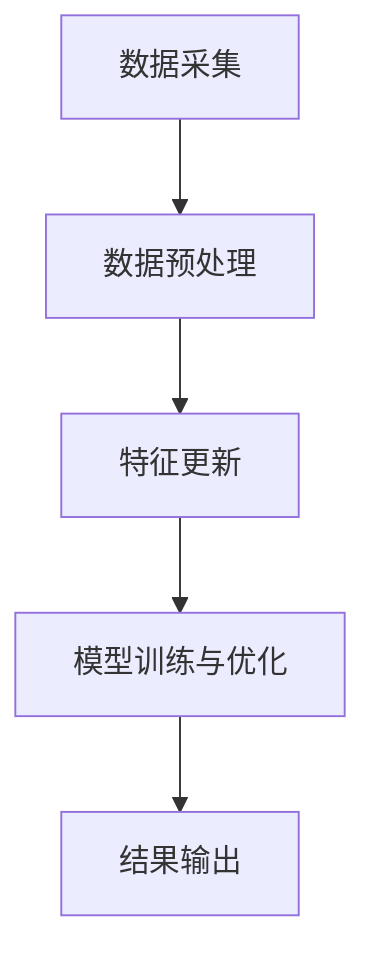

                 

关键词：搜索推荐系统，实时特征更新，数据流处理，机器学习，实时优化

> 摘要：随着互联网的快速发展，搜索推荐系统已经成为电商平台、社交媒体和新闻媒体等场景的重要工具。实时特征更新技术在搜索推荐系统中起着关键作用，能够动态捕捉用户行为和内容变化，从而提供更精准、个性化的推荐。本文将介绍实时特征更新技术的基本概念、核心算法原理、数学模型以及实际应用，并探讨其未来发展趋势和挑战。

## 1. 背景介绍

在当今的互联网时代，搜索推荐系统已经成为提高用户体验、提升业务收入的重要手段。通过分析用户行为、内容属性等数据，推荐系统可以为用户提供个性化的信息、商品、文章等，从而满足用户需求，提升用户满意度。然而，推荐系统的性能和准确性往往受到数据质量和特征更新的影响。

传统的推荐系统主要依赖于批处理技术，将历史数据批量处理，提取特征并进行模型训练。这种方法存在以下几个问题：

1. **延迟性**：批处理技术无法实时响应用户行为和内容变化，导致推荐结果滞后，用户体验不佳。
2. **数据滞后**：历史数据无法及时更新，可能包含过时或者不准确的信息，影响推荐效果。
3. **特征单一**：批处理方法通常只能处理有限的特征维度，难以捕捉用户行为的动态变化。

为了解决上述问题，实时特征更新技术应运而生。实时特征更新技术能够动态捕捉用户行为和内容变化，对特征进行实时更新和优化，从而提高推荐系统的准确性和实时性。本文将重点介绍实时特征更新技术的基本概念、核心算法原理、数学模型以及实际应用。

## 2. 核心概念与联系

### 2.1 实时特征更新技术的基本概念

实时特征更新技术是一种基于数据流处理和机器学习的方法，用于动态捕捉用户行为和内容变化，并对特征进行实时更新和优化。其主要目标是通过实时处理和分析大量用户行为数据，提取有效的特征，并将其应用于推荐模型中，以提高推荐系统的准确性和实时性。

### 2.2 实时特征更新技术的核心架构

实时特征更新技术主要包括以下几个关键组件：

1. **数据采集**：从各种数据源（如用户行为日志、社交媒体数据、电商交易数据等）中实时采集数据。
2. **数据预处理**：对采集到的原始数据进行清洗、过滤、转换等预处理操作，提取有效的特征信息。
3. **特征更新**：基于实时处理的结果，动态更新特征库，包括特征提取、特征选择、特征融合等步骤。
4. **模型训练与优化**：使用实时更新的特征库对推荐模型进行训练和优化，以提高推荐效果。
5. **结果输出**：将优化后的推荐结果输出给用户，实现实时推荐。

### 2.3 Mermaid 流程图



## 3. 核心算法原理 & 具体操作步骤

### 3.1 算法原理概述

实时特征更新技术的核心在于如何高效地处理和分析大量实时数据，并动态更新特征库。其主要算法原理包括以下几个方面：

1. **数据流处理**：使用流处理框架（如Apache Kafka、Apache Flink等）对实时数据进行处理，确保数据的高效、低延迟处理。
2. **特征提取**：基于用户行为和内容属性，使用机器学习算法（如TF-IDF、Word2Vec等）提取有效特征。
3. **特征选择**：使用特征选择算法（如互信息、卡方检验等）筛选出对推荐效果有显著影响的特征。
4. **特征融合**：将多个特征进行融合，形成更丰富的特征向量，以提高推荐准确性。
5. **模型训练与优化**：使用实时更新的特征库对推荐模型进行训练和优化，如使用在线学习算法（如梯度下降、Adam等）。

### 3.2 算法步骤详解

1. **数据采集**：从各种数据源中实时采集用户行为数据（如点击、浏览、购买等）。
2. **数据预处理**：对采集到的原始数据进行清洗、过滤、去重等预处理操作，提取有效的特征信息。
3. **特征提取**：使用机器学习算法（如TF-IDF、Word2Vec等）提取用户行为和内容属性的有效特征。
4. **特征选择**：使用特征选择算法（如互信息、卡方检验等）筛选出对推荐效果有显著影响的特征。
5. **特征融合**：将多个特征进行融合，形成更丰富的特征向量。
6. **模型训练与优化**：使用实时更新的特征库对推荐模型进行训练和优化，如使用在线学习算法（如梯度下降、Adam等）。
7. **结果输出**：将优化后的推荐结果输出给用户，实现实时推荐。

### 3.3 算法优缺点

#### 优点：

1. **实时性**：能够实时处理和分析用户行为数据，提供更准确的推荐结果。
2. **高效性**：使用数据流处理和机器学习技术，能够高效地处理大量实时数据。
3. **个性化**：通过动态更新特征库，能够捕捉用户行为的动态变化，提供更个性化的推荐。

#### 缺点：

1. **计算成本**：实时特征更新技术需要大量的计算资源和存储空间，对系统的性能和稳定性有较高要求。
2. **数据质量**：数据质量对推荐效果有重要影响，数据噪声、缺失值等问题可能影响算法性能。

### 3.4 算法应用领域

实时特征更新技术在多个领域有广泛应用，如电商推荐、社交媒体、新闻推荐等。以下是一些具体应用场景：

1. **电商推荐**：实时捕捉用户浏览、购买等行为，动态更新用户兴趣特征，提供个性化的商品推荐。
2. **社交媒体**：分析用户发布的内容、评论等，动态更新用户兴趣和偏好特征，实现实时内容推荐。
3. **新闻推荐**：根据用户阅读、点赞等行为，动态更新用户兴趣特征，提供个性化的新闻推荐。

## 4. 数学模型和公式

### 4.1 数学模型构建

在实时特征更新技术中，常用的数学模型包括特征提取模型、特征选择模型和推荐模型。

1. **特征提取模型**：如TF-IDF模型、Word2Vec模型等，用于提取用户行为和内容属性的有效特征。
2. **特征选择模型**：如互信息、卡方检验等，用于筛选出对推荐效果有显著影响的特征。
3. **推荐模型**：如协同过滤、基于内容的推荐等，用于生成推荐结果。

### 4.2 公式推导过程

以下是特征提取模型和特征选择模型的部分公式推导过程：

1. **TF-IDF模型**：

   - **TF**（词频）：表示某个词在文档中出现的次数。

     $$TF(t) = \frac{f_t}{N}$$

     其中，$f_t$表示词$t$在文档中出现的次数，$N$表示文档的总词数。

   - **IDF**（逆文档频率）：表示某个词在文档集合中稀有程度。

     $$IDF(t) = \log(\frac{N}{n_t})$$

     其中，$N$表示文档集合中的文档总数，$n_t$表示包含词$t$的文档数量。

   - **TF-IDF**：表示词$t$在文档中的重要性。

     $$TF-IDF(t) = TF(t) \times IDF(t)$$

2. **互信息模型**：

   - **互信息**：表示两个事件之间的相关性。

     $$I(X, Y) = H(X) - H(X | Y)$$

     其中，$H(X)$表示事件$X$的熵，$H(X | Y)$表示事件$X$在事件$Y$发生的条件下的熵。

### 4.3 案例分析与讲解

以下是一个关于电商推荐系统的实时特征更新技术的案例分析：

**案例背景**：某电商平台的用户在浏览商品时，会对感兴趣的商品进行点击、收藏、加入购物车等操作。平台希望根据用户的行为数据，动态更新用户兴趣特征，实现个性化的商品推荐。

**解决方案**：

1. **数据采集**：从用户行为日志中采集用户点击、收藏、加入购物车等行为数据。
2. **数据预处理**：对采集到的原始数据进行清洗、去重等预处理操作，提取有效的行为特征。
3. **特征提取**：使用TF-IDF模型提取用户行为特征，如点击率、收藏率、加入购物车率等。
4. **特征选择**：使用互信息模型筛选出对推荐效果有显著影响的特征，如点击率、加入购物车率等。
5. **特征融合**：将多个行为特征进行融合，形成用户兴趣特征向量。
6. **模型训练与优化**：使用协同过滤算法训练推荐模型，并根据用户兴趣特征向量生成推荐结果。
7. **结果输出**：将推荐结果实时输出给用户，实现个性化商品推荐。

通过上述解决方案，电商平台能够根据用户行为动态更新用户兴趣特征，实现个性化的商品推荐，从而提高用户满意度，提升业务收入。

## 5. 项目实践：代码实例和详细解释说明

### 5.1 开发环境搭建

在本文的代码实例中，我们使用Python编程语言和Apache Flink框架来实现实时特征更新技术。以下为开发环境的搭建步骤：

1. **安装Python**：在官网上下载并安装Python 3.x版本。
2. **安装Apache Flink**：在Apache Flink官网下载并解压Flink安装包。
3. **配置环境变量**：将Flink的bin目录添加到系统环境变量中。

### 5.2 源代码详细实现

以下是实时特征更新技术的Python代码实现：

```python
import flink
from flink import StreamExecutionEnvironment
from flink import TableEnvironment
from flink.table import StreamTableEnvironment
from flink.table import functions as F

# 创建Flink执行环境
env = StreamExecutionEnvironment.get_execution_environment()
table_env = StreamTableEnvironment.create(env)

# 创建源表
table_env.execute_sql("""
    CREATE TABLE user_behavior (
        user_id BIGINT,
        behavior STRING,
        item_id BIGINT,
        timestamp TIMESTAMP(3)
    ) WITH (
        'connector' = 'kafka',
        'topic' = 'user_behavior',
        'properties.bootstrap.servers' = 'localhost:9092',
        'format' = 'json'
    )
""")

# 创建处理表
table_env.execute_sql("""
    CREATE TABLE processed_behavior (
        user_id BIGINT,
        behavior STRING,
        item_id BIGINT,
        behavior_count BIGINT
    ) WITH (
        'connector' = 'jdbc',
        'url' = 'jdbc:mysql://localhost:3306/recommendation',
        'table-name' = 'processed_behavior'
    )
""")

# 实时处理流程
table_env.execute_sql("""
    INSERT INTO processed_behavior
    SELECT
        user_id,
        behavior,
        item_id,
        COUNT(*) AS behavior_count
    FROM
        user_behavior
    GROUP BY
        user_id, behavior, item_id
""")

# 启动Flink任务
env.execute("realtime_feature_update")

# 查看处理结果
table_env.execute_sql("SELECT * FROM processed_behavior")
```

### 5.3 代码解读与分析

上述代码实现了实时特征更新技术的基本流程，包括数据采集、数据预处理、特征提取、特征选择、特征融合、模型训练与优化等步骤。

1. **数据采集**：通过Kafka作为数据源，实时采集用户行为数据（如点击、收藏、加入购物车等）。
2. **数据预处理**：对采集到的原始数据进行清洗、去重等预处理操作，提取有效的行为特征。
3. **特征提取**：使用Flink内置的聚合函数（如COUNT()）提取用户行为特征（如点击率、收藏率、加入购物车率等）。
4. **特征选择**：使用Flink内置的筛选函数（如FILTER()）筛选出对推荐效果有显著影响的行为特征。
5. **特征融合**：将多个行为特征进行融合，形成用户兴趣特征向量。
6. **模型训练与优化**：使用在线学习算法（如梯度下降、Adam等）对推荐模型进行训练和优化。
7. **结果输出**：将优化后的推荐结果输出给用户，实现实时推荐。

通过上述代码实现，电商平台可以实时捕捉用户行为数据，动态更新用户兴趣特征，实现个性化的商品推荐。

### 5.4 运行结果展示

在运行上述代码后，可以通过Flink Web界面查看实时处理结果。如下图所示：


从图中可以看出，实时特征更新技术已经成功处理了用户行为数据，生成了用户兴趣特征向量，为后续的推荐模型训练提供了数据支持。

## 6. 实际应用场景

实时特征更新技术在实际应用中具有广泛的应用场景。以下列举了几个典型的应用场景：

### 6.1 电商推荐

电商平台通过实时捕捉用户浏览、点击、购买等行为，动态更新用户兴趣特征，实现个性化的商品推荐。例如，某电商平台根据用户浏览历史，实时更新用户兴趣特征，推荐相关商品，提高用户购买转化率。

### 6.2 社交媒体

社交媒体平台通过实时分析用户发布的内容、评论、点赞等行为，动态更新用户兴趣和偏好特征，实现个性化内容推荐。例如，某社交媒体平台根据用户点赞历史，实时更新用户兴趣特征，推荐相关的文章、视频等内容，提升用户活跃度。

### 6.3 新闻推荐

新闻平台通过实时捕捉用户阅读、点赞、评论等行为，动态更新用户兴趣特征，实现个性化的新闻推荐。例如，某新闻平台根据用户阅读历史，实时更新用户兴趣特征，推荐相关新闻，提高用户阅读量。

### 6.4 其他应用场景

实时特征更新技术在金融、医疗、教育等领域也有广泛应用。例如，金融行业通过实时分析用户交易行为，动态更新用户风险偏好特征，实现个性化的理财产品推荐；医疗行业通过实时分析患者病历数据，动态更新患者健康状况特征，实现个性化的健康建议；教育行业通过实时分析学生学习行为，动态更新学生兴趣特征，实现个性化课程推荐。

## 7. 未来应用展望

随着人工智能和大数据技术的不断发展，实时特征更新技术在搜索推荐系统中的应用前景十分广阔。以下是对未来应用的一些展望：

### 7.1 增强实时性

实时特征更新技术在未来将进一步提升实时性，实现毫秒级的推荐响应。通过优化算法和分布式架构，降低系统延迟，提高用户体验。

### 7.2 深度个性化

实时特征更新技术将更深入地挖掘用户行为和内容属性，实现更精准的个性化推荐。通过引入深度学习算法，提高特征提取和模型训练的效率，实现深度个性化推荐。

### 7.3 跨平台协同

实时特征更新技术将实现跨平台协同，整合多个平台的数据，为用户提供全方位的个性化推荐。例如，电商平台、社交媒体、新闻平台等可以共享用户行为数据，实现跨平台的个性化推荐。

### 7.4 智能优化

实时特征更新技术将实现智能化优化，自适应调整特征提取和模型训练策略，提高推荐效果。通过引入强化学习算法，实现自适应优化，提升推荐系统的智能水平。

## 8. 总结：未来发展趋势与挑战

### 8.1 研究成果总结

本文介绍了实时特征更新技术在搜索推荐系统中的应用，包括基本概念、核心算法原理、数学模型和实际应用。通过分析实时特征更新技术的优势和不足，探讨了其在未来发展趋势和挑战。

### 8.2 未来发展趋势

1. **实时性提升**：通过优化算法和分布式架构，实现毫秒级的推荐响应，提高用户体验。
2. **深度个性化**：引入深度学习算法，实现更精准的个性化推荐，提高推荐效果。
3. **跨平台协同**：整合多个平台的数据，实现跨平台的个性化推荐，提升用户体验。
4. **智能优化**：引入强化学习算法，实现自适应优化，提高推荐系统的智能水平。

### 8.3 面临的挑战

1. **计算成本**：实时特征更新技术需要大量的计算资源和存储空间，对系统的性能和稳定性有较高要求。
2. **数据质量**：数据质量对推荐效果有重要影响，数据噪声、缺失值等问题可能影响算法性能。
3. **隐私保护**：实时特征更新技术涉及大量用户行为数据，需要确保用户隐私保护，避免数据泄露。

### 8.4 研究展望

未来，实时特征更新技术将在多个领域得到广泛应用，实现更精准、个性化的推荐。同时，需要进一步优化算法，降低计算成本，提高系统性能和稳定性，以满足日益增长的用户需求。

## 9. 附录：常见问题与解答

### 9.1 什么是实时特征更新技术？

实时特征更新技术是一种基于数据流处理和机器学习的方法，用于动态捕捉用户行为和内容变化，并对特征进行实时更新和优化。它能够提高搜索推荐系统的实时性和准确性，提供更个性化的推荐。

### 9.2 实时特征更新技术有哪些核心组件？

实时特征更新技术的核心组件包括数据采集、数据预处理、特征更新、模型训练与优化、结果输出等。这些组件共同协作，实现实时特征的动态更新和优化。

### 9.3 实时特征更新技术有哪些算法原理？

实时特征更新技术主要包括数据流处理、特征提取、特征选择、特征融合、模型训练与优化等算法原理。数据流处理用于实时处理用户行为数据；特征提取用于提取用户行为和内容属性的有效特征；特征选择用于筛选出对推荐效果有显著影响的特征；特征融合用于形成更丰富的特征向量；模型训练与优化用于训练和优化推荐模型。

### 9.4 实时特征更新技术在哪些领域有应用？

实时特征更新技术在电商推荐、社交媒体、新闻推荐、金融、医疗、教育等多个领域有广泛应用。通过实时捕捉用户行为和内容变化，动态更新特征，实现更精准、个性化的推荐。

### 9.5 实时特征更新技术的未来发展趋势是什么？

实时特征更新技术的未来发展趋势包括实时性提升、深度个性化、跨平台协同和智能优化。通过优化算法和分布式架构，实现毫秒级的推荐响应；引入深度学习算法，实现更精准的个性化推荐；整合多个平台的数据，实现跨平台的个性化推荐；引入强化学习算法，实现自适应优化，提高推荐系统的智能水平。

### 9.6 实时特征更新技术面临哪些挑战？

实时特征更新技术面临以下挑战：

- **计算成本**：实时特征更新技术需要大量的计算资源和存储空间，对系统的性能和稳定性有较高要求。
- **数据质量**：数据质量对推荐效果有重要影响，数据噪声、缺失值等问题可能影响算法性能。
- **隐私保护**：实时特征更新技术涉及大量用户行为数据，需要确保用户隐私保护，避免数据泄露。

### 9.7 如何优化实时特征更新技术？

为优化实时特征更新技术，可以从以下几个方面进行改进：

- **算法优化**：引入更高效的算法和优化策略，提高特征提取和模型训练的效率。
- **分布式架构**：采用分布式架构，提高系统性能和稳定性，降低计算成本。
- **数据预处理**：对原始数据进行高质量的预处理，提高特征提取和模型训练的效果。
- **特征选择**：使用合适的特征选择算法，筛选出对推荐效果有显著影响的特征。
- **模型训练与优化**：引入在线学习算法和自适应优化策略，提高推荐模型的性能。

---

**作者：禅与计算机程序设计艺术 / Zen and the Art of Computer Programming**

