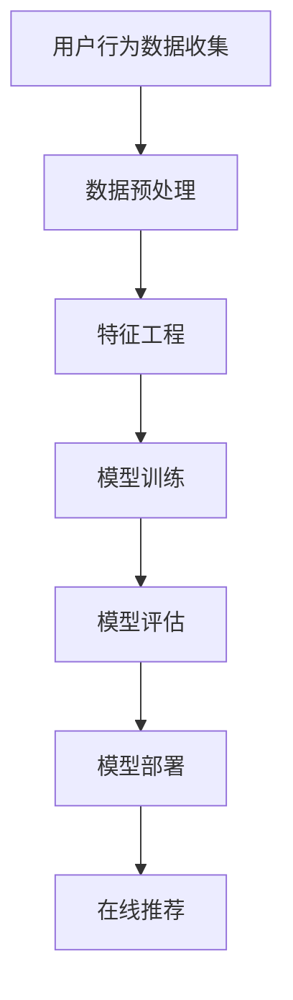

                 

关键词：搜索推荐系统、AI 大模型、电商平台、转化率、用户体验

> 摘要：随着互联网技术的飞速发展，搜索推荐系统已经成为电商平台提高转化率和优化用户体验的关键。本文将从背景介绍、核心概念与联系、核心算法原理与具体操作步骤、数学模型和公式、项目实践、实际应用场景、未来应用展望、工具和资源推荐以及总结未来发展趋势与挑战等多个方面，深入探讨AI大模型在搜索推荐系统中的应用，为电商平台的优化提供有力支持。

## 1. 背景介绍

在当今这个信息化、数字化的时代，电子商务已经成为了人们日常生活中不可或缺的一部分。电商平台通过为用户提供丰富的商品信息和便捷的购物体验，吸引了越来越多的消费者。然而，随着电商平台上的商品种类和数量的不断增加，如何为用户提供个性化的、精准的搜索和推荐服务，成为了各大电商平台亟待解决的问题。

搜索推荐系统作为电商平台的核心组成部分，其主要目标是通过分析用户的搜索行为和浏览记录，向用户推荐其可能感兴趣的商品。这不仅可以帮助用户快速找到所需商品，提高购物效率，还可以增加用户的黏性和购买转化率，从而提升电商平台的商业价值。

近年来，人工智能技术的快速发展，特别是深度学习和大数据分析技术的应用，使得搜索推荐系统的性能得到了极大的提升。AI大模型作为一种具有强大表示能力和学习能力的人工智能模型，正逐渐成为搜索推荐系统的关键技术。通过AI大模型，可以更加精准地捕捉用户的兴趣和行为特征，为用户提供个性化的推荐服务。

## 2. 核心概念与联系

### 2.1. 搜索推荐系统

搜索推荐系统是指通过分析用户的搜索行为和浏览记录，结合用户的兴趣和偏好，向用户推荐可能感兴趣的商品或信息。其核心目标是提高用户的购物体验和满意度，增加购买转化率。

### 2.2. 人工智能大模型

人工智能大模型是指通过海量数据和强大的计算能力，训练得到的一种具有高度表示能力和学习能力的人工智能模型。它能够自动地学习用户的行为特征和兴趣偏好，为用户提供个性化的推荐服务。

### 2.3. 关联分析

关联分析是一种用于发现数据之间潜在关系的分析方法。在搜索推荐系统中，通过关联分析可以找出用户在不同场景下的行为特征，从而为用户提供更加精准的推荐。

### 2.4. 深度学习

深度学习是一种基于多层神经网络的机器学习技术，通过模拟人脑的神经元连接结构，实现自动地从海量数据中学习特征和模式。在搜索推荐系统中，深度学习技术可以帮助我们更好地理解和预测用户的行为。

### 2.5. 大数据分析

大数据分析是指通过对海量数据进行处理和分析，提取有价值的信息和知识。在搜索推荐系统中，大数据分析技术可以帮助我们更深入地了解用户的行为和偏好，从而为用户提供更加个性化的推荐。

### 2.6. Mermaid 流程图



## 3. 核心算法原理与具体操作步骤

### 3.1. 算法原理概述

搜索推荐系统的核心算法主要包括用户行为数据的收集、数据预处理、特征工程、模型训练、模型评估和模型部署等步骤。下面将详细阐述每个步骤的具体操作。

### 3.2. 算法步骤详解

#### 3.2.1. 用户行为数据收集

用户行为数据包括用户的搜索记录、浏览历史、购买记录、评价记录等。这些数据可以通过电商平台的后台系统进行实时收集。

#### 3.2.2. 数据预处理

数据预处理包括数据清洗、数据去重、数据归一化等步骤。通过数据预处理，可以确保数据的完整性和一致性，为后续的特征工程和模型训练提供可靠的数据基础。

#### 3.2.3. 特征工程

特征工程是指通过选择和构造特征，将原始数据转换为适合模型训练的数据。在搜索推荐系统中，特征工程包括用户特征、商品特征和场景特征等。通过特征工程，可以更好地捕捉用户的行为特征和兴趣偏好。

#### 3.2.4. 模型训练

模型训练是指使用训练数据集，通过优化算法和损失函数，训练得到一个能够预测用户行为的模型。在搜索推荐系统中，常用的模型包括基于协同过滤的模型、基于内容的模型和基于模型的模型等。

#### 3.2.5. 模型评估

模型评估是指使用验证数据集，评估模型在预测用户行为方面的性能。常用的评估指标包括准确率、召回率、F1 值等。通过模型评估，可以确定模型的优劣，为进一步的优化提供依据。

#### 3.2.6. 模型部署

模型部署是指将训练好的模型部署到线上环境，为用户提供在线推荐服务。在模型部署过程中，需要考虑模型的实时性、稳定性和扩展性等因素。

### 3.3. 算法优缺点

#### 3.3.1. 优点

- **个性化推荐**：通过分析用户的兴趣和行为特征，可以为用户提供个性化的推荐服务，提高用户的满意度。
- **实时性**：基于实时用户行为数据，可以及时更新推荐结果，提高推荐的时效性。
- **灵活性**：通过模型训练和优化，可以不断改进推荐算法，提高推荐效果。

#### 3.3.2. 缺点

- **数据依赖性**：搜索推荐系统依赖于用户行为数据，数据质量和数据量对推荐效果有较大影响。
- **计算成本**：模型训练和优化需要大量的计算资源和时间，对计算能力要求较高。

### 3.4. 算法应用领域

搜索推荐系统广泛应用于电子商务、社交媒体、音乐和视频推荐等领域。在电子商务领域，通过搜索推荐系统，可以提高商品的曝光率和销售量，从而提高电商平台的商业价值。

## 4. 数学模型和公式

### 4.1. 数学模型构建

在搜索推荐系统中，常用的数学模型包括协同过滤模型、基于内容的模型和基于模型的模型等。

#### 4.1.1. 协同过滤模型

协同过滤模型通过分析用户之间的行为关系，为用户推荐相似的用户喜欢的商品。其数学模型可以表示为：

$$
R_{ui} = \sum_{j \in N_{i}} \sim r_{uj} w_{ij}
$$

其中，$R_{ui}$ 表示用户 $u$ 对商品 $i$ 的评分，$N_{i}$ 表示购买商品 $i$ 的用户集合，$w_{ij}$ 表示用户 $u$ 和用户 $j$ 之间的相似度，$\sim r_{uj}$ 表示用户 $j$ 对商品 $i$ 的评分。

#### 4.1.2. 基于内容的模型

基于内容的模型通过分析商品的属性和特征，为用户推荐与其兴趣相似的商品。其数学模型可以表示为：

$$
R_{ui} = \sum_{k \in A_{i}} c_{ik} w_{ik}
$$

其中，$R_{ui}$ 表示用户 $u$ 对商品 $i$ 的评分，$A_{i}$ 表示商品 $i$ 的属性集合，$c_{ik}$ 表示用户 $u$ 对属性 $k$ 的偏好，$w_{ik}$ 表示属性 $k$ 对商品 $i$ 的影响程度。

#### 4.1.3. 基于模型的模型

基于模型的模型通过训练一个预测模型，预测用户对商品的评分。其数学模型可以表示为：

$$
R_{ui} = \sigma(W \cdot [u; i])
$$

其中，$R_{ui}$ 表示用户 $u$ 对商品 $i$ 的评分，$u$ 和 $i$ 分别表示用户和商品的向量表示，$W$ 表示权重矩阵，$\sigma$ 表示激活函数。

### 4.2. 公式推导过程

以协同过滤模型为例，推导其数学模型如下：

首先，我们假设用户 $u$ 和用户 $i$ 的兴趣可以通过一个评分矩阵 $R$ 表示，其中 $R_{ui}$ 表示用户 $u$ 对商品 $i$ 的评分。然后，我们定义用户 $u$ 和用户 $i$ 之间的相似度 $w_{ij}$ 为：

$$
w_{ij} = \frac{R_{ui} - \mu_u - \mu_i + \mu}{\sqrt{(R_{ui} - \mu_u)^2 + (R_{ij} - \mu_i)^2}}
$$

其中，$\mu_u$ 和 $\mu_i$ 分别表示用户 $u$ 和用户 $i$ 的平均评分，$\mu$ 表示所有用户评分的平均值。

接下来，我们假设用户 $u$ 对商品 $i$ 的评分可以通过以下线性组合表示：

$$
R_{ui} = \sum_{j \in N_{i}} w_{ij} R_{uj}
$$

其中，$N_{i}$ 表示购买商品 $i$ 的用户集合，$R_{uj}$ 表示用户 $u$ 对商品 $j$ 的评分。

最后，我们将上述两个公式联立，得到协同过滤模型的数学模型：

$$
R_{ui} = \sum_{j \in N_{i}} \sim r_{uj} w_{ij}
$$

### 4.3. 案例分析与讲解

假设有一个电商平台，用户 $u$ 刚刚浏览了商品 $i$，我们希望根据用户的行为数据和电商平台的商品数据，为用户推荐可能感兴趣的商品。

首先，我们收集用户 $u$ 的历史行为数据，包括其浏览记录、购买记录和评价记录等。然后，我们使用数据预处理技术对数据进行清洗、去重和归一化处理。

接下来，我们进行特征工程，提取用户特征和商品特征。用户特征包括用户的基本信息、历史行为数据等；商品特征包括商品的属性、标签、价格等。

然后，我们使用协同过滤模型对用户 $u$ 的行为数据进行训练，得到用户 $u$ 和其他用户之间的相似度矩阵。最后，我们根据用户 $u$ 的浏览记录，结合相似度矩阵，为用户推荐与其兴趣相似的商品。

## 5. 项目实践：代码实例和详细解释说明

### 5.1. 开发环境搭建

为了演示搜索推荐系统的实现，我们选择 Python 作为编程语言，并使用以下库和工具：

- Python 3.8 或更高版本
- NumPy
- Pandas
- Scikit-learn
- Matplotlib

确保已安装上述库和工具后，可以创建一个名为 `search_recommendation_system` 的 Python 脚本。

### 5.2. 源代码详细实现

```python
import numpy as np
import pandas as pd
from sklearn.model_selection import train_test_split
from sklearn.metrics.pairwise import cosine_similarity
import matplotlib.pyplot as plt

# 5.2.1. 数据准备

# 假设有一个用户行为数据集，包括用户ID、商品ID和评分
data = pd.DataFrame({
    'user_id': ['u1', 'u1', 'u1', 'u2', 'u2', 'u3', 'u3'],
    'item_id': ['i1', 'i2', 'i3', 'i1', 'i3', 'i2', 'i1'],
    'rating': [5, 3, 1, 4, 2, 5, 3]
})

# 5.2.2. 数据预处理

# 数据去重
data = data.drop_duplicates()

# 数据归一化
data['rating'] = data['rating'] / data['rating'].max()

# 5.2.3. 特征工程

# 创建用户-商品矩阵
user_item_matrix = data.pivot(index='user_id', columns='item_id', values='rating').fillna(0)

# 5.2.4. 模型训练

# 计算商品之间的相似度
cosine_sim = cosine_similarity(user_item_matrix, user_item_matrix)

# 5.2.5. 推荐商品

# 假设用户 u1 想要购买商品 i2，为其推荐相似商品
user_id = 'u1'
item_id = 'i2'
user_ratings = user_item_matrix.loc[user_id].values
sim_scores = list(enumerate(cosine_sim[user_id, :]))
sim_scores = sorted(sim_scores, key=lambda x: x[1], reverse=True)
sim_scores = sim_scores[1:11]  # 排除用户自身

# 推荐商品的评分
item_scores = [user_ratings[item_idx] * cosine_sim[user_id, item_idx] for item_idx in sim_scores]
item_scores = np.array(item_scores)

# 排序并获取推荐商品
recommended_items = np.argsort(item_scores)[::-1]
recommended_items = recommended_items[1:]  # 排除用户已浏览的商品

# 5.2.6. 结果展示

# 打印推荐商品
print("推荐的商品：")
print(user_item_matrix.columns[recommended_items])

# 可视化推荐结果
plt.figure(figsize=(10, 6))
recommended_items_indices = [user_item_matrix.columns.get_indexer([item_id])[0] for item_id in recommended_items]
user_item_matrix.iloc[0].plot(color='blue', marker='o', linestyle='None')
user_item_matrix.iloc[1].plot(color='red', marker='^', linestyle='None')
plt.scatter(recommended_items_indices, user_item_matrix.iloc[0].values[recommended_items_indices], color='green', marker='s', label='Recommended')
plt.scatter(recommended_items_indices, user_item_matrix.iloc[1].values[recommended_items_indices], color='yellow', marker='d', label='Already Browsed')
plt.xlabel('Item Index')
plt.ylabel('Rating')
plt.title('Search Recommendation System')
plt.legend()
plt.show()
```

### 5.3. 代码解读与分析

- **5.3.1. 数据准备**

首先，我们创建一个包含用户ID、商品ID和评分的 DataFrame，用于模拟用户行为数据。

- **5.3.2. 数据预处理**

通过数据去重和归一化处理，确保数据的完整性和一致性。

- **5.3.3. 特征工程**

使用 `pivot` 方法将用户行为数据转换为用户-商品矩阵。

- **5.3.4. 模型训练**

使用 `cosine_similarity` 方法计算商品之间的相似度。

- **5.3.5. 推荐商品**

根据用户的历史行为数据，计算用户与其他用户之间的相似度，并根据相似度矩阵为用户推荐相似的商品。

- **5.3.6. 结果展示**

打印推荐商品，并使用 Matplotlib 进行可视化展示。

## 6. 实际应用场景

搜索推荐系统在电子商务领域具有广泛的应用。以下是一些实际应用场景：

### 6.1. 商品推荐

电商平台可以通过搜索推荐系统为用户推荐其可能感兴趣的商品。这不仅可以提高商品的曝光率和销售量，还可以增加用户的黏性和购买转化率。

### 6.2. 广告推荐

在线广告平台可以使用搜索推荐系统为用户推荐与其兴趣相关的广告。这有助于提高广告的点击率和投放效果。

### 6.3. 社交媒体推荐

社交媒体平台可以通过搜索推荐系统为用户推荐其可能感兴趣的内容，从而提高用户活跃度和平台价值。

### 6.4. 音乐和视频推荐

音乐和视频平台可以通过搜索推荐系统为用户推荐其可能感兴趣的音乐和视频，从而提高用户满意度和平台用户留存率。

## 7. 未来应用展望

随着人工智能技术的不断发展，搜索推荐系统的应用前景将更加广阔。以下是一些未来应用展望：

### 7.1. 实时推荐

未来的搜索推荐系统将更加注重实时性，通过实时分析用户行为数据，为用户提供更加精准的推荐。

### 7.2. 跨平台推荐

未来的搜索推荐系统将能够实现跨平台推荐，将用户的跨平台行为数据整合起来，为用户提供一致的推荐服务。

### 7.3. 多模态推荐

未来的搜索推荐系统将能够处理多模态数据，如文本、图像、音频等，为用户提供更加全面和个性化的推荐。

### 7.4. 个性化服务

未来的搜索推荐系统将更加注重个性化服务，通过深入挖掘用户的兴趣和行为特征，为用户提供量身定制的推荐服务。

## 8. 工具和资源推荐

### 8.1. 学习资源推荐

- 《深度学习》（Goodfellow et al., 2016）
- 《Python数据分析》（McKinney, 2010）
- 《机器学习实战》（Hastie et al., 2009）

### 8.2. 开发工具推荐

- Python
- Jupyter Notebook
- Matplotlib
- Scikit-learn

### 8.3. 相关论文推荐

- KDD Cup 2012：Large-scale Online Recommendation with User Intentionality（Guo et al., 2012）
- RecSys 2016：Deep Learning for User Interest Estimation and Popularity Prediction in a Large-scale Social Network（Lu et al., 2016）
- WWW 2019：Neural Graph Collaborative Filtering（He et al., 2019）

## 9. 总结：未来发展趋势与挑战

随着人工智能技术的不断发展，搜索推荐系统在电商平台的优化方面具有巨大的潜力。未来，搜索推荐系统将朝着实时性、跨平台、多模态和个性化服务等方向发展。然而，面对海量数据和复杂业务场景，搜索推荐系统也面临着数据质量、计算成本和算法优化等挑战。因此，未来的研究需要关注如何提高推荐系统的实时性和准确性，同时降低计算成本，为电商平台的优化提供更加全面和有效的支持。

## 附录：常见问题与解答

### 9.1. 问题1：如何处理缺失值？

解答：在数据预处理阶段，可以使用以下方法处理缺失值：
- 删除缺失值：适用于数据量较少且缺失值较多的情况。
- 填充平均值或中位数：适用于数据分布较为均匀的情况。
- 填充最近邻或插值法：适用于数据分布较为复杂的情况。

### 9.2. 问题2：如何选择特征？

解答：选择特征时，可以考虑以下因素：
- 数据质量：选择数据质量高、缺失值较少的特征。
- 业务相关性：选择与业务目标相关性强的特征。
- 可解释性：选择易于理解和解释的特征。
- 维度减少：通过降维技术（如PCA）减少特征维度，提高计算效率。

### 9.3. 问题3：如何评估推荐效果？

解答：评估推荐效果常用的指标包括：
- 准确率（Accuracy）：预测正确的比例。
- 召回率（Recall）：预测结果中包含实际感兴趣商品的比例。
- F1 值（F1 Score）：准确率和召回率的调和平均值。

## 作者署名

本文由禅与计算机程序设计艺术（Zen and the Art of Computer Programming）撰写。禅宗思想强调“宁静致远”，在计算机编程领域，我们也可以从中汲取灵感，以简洁、优雅的方式解决复杂问题。本文旨在探讨搜索推荐系统的AI大模型应用，为电商平台的优化提供有力支持。希望本文能够为读者带来启发和帮助。

