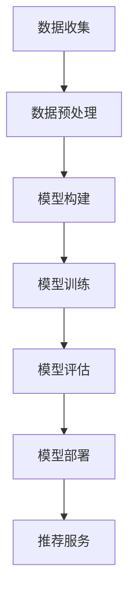

                 

在当今数字化时代，电子商务已经成为商业活动的重要组成部分。随着电商平台的不断发展和壮大，如何提高转化率和用户忠诚度成为每个电商平台需要解决的关键问题。在这个背景下，人工智能（AI）技术的应用变得尤为重要。特别是大模型技术的引入，为搜索推荐系统带来了前所未有的提升，本文将深入探讨这一领域的应用及其带来的显著效果。

## 关键词
- 搜索推荐系统
- AI 大模型
- 转化率
- 用户忠诚度
- 电商平台

## 摘要
本文将探讨人工智能大模型在搜索推荐系统中的应用，如何通过这种技术提升电商平台的转化率和用户忠诚度。文章首先介绍搜索推荐系统的基本概念和背景，然后深入分析大模型技术的工作原理和优势。接着，我们将探讨大模型在搜索推荐系统中的具体应用场景，并分析其带来的效益。最后，文章将总结研究成果，展望未来发展趋势和面临的挑战。

---

## 1. 背景介绍

### 1.1 电商平台的挑战

随着互联网的普及，电商平台的发展速度异常迅猛。消费者对于购物体验的要求也越来越高，他们希望能够在短时间内找到心仪的商品，并享受便捷的购物流程。这对电商平台提出了两个关键挑战：如何提高转化率和如何提升用户忠诚度。

- **转化率**：指用户在访问电商平台后，实际完成购买行为的比例。提高转化率意味着更多的销售额和更好的盈利能力。
- **用户忠诚度**：指用户对电商平台长期使用和持续消费的倾向。高忠诚度的用户不仅会带来更多的订单，还能通过口碑传播吸引新用户。

### 1.2 人工智能和推荐系统

人工智能技术在电商领域已经得到了广泛的应用。特别是推荐系统，通过分析用户的历史行为和兴趣，为用户个性化推荐商品。推荐系统的目标就是提高用户的满意度和购买意愿，从而提升转化率和忠诚度。

- **推荐系统的基本原理**：基于协同过滤、基于内容的过滤和混合推荐方法。
- **人工智能的引入**：使得推荐系统能够更加精准地捕捉用户需求，提高推荐质量。

### 1.3 大模型的优势

大模型技术是近年来AI领域的重大突破。相比于传统的小模型，大模型具有更强的表示能力和泛化能力。在推荐系统中，大模型能够处理海量的用户数据和商品数据，发现更复杂的用户行为模式和商品关系。

- **表示能力**：大模型可以捕捉到更细微的用户行为特征，从而提供更加精准的推荐。
- **泛化能力**：大模型能够在不同的数据集和应用场景中表现出色，具有良好的适应性和扩展性。

---

## 2. 核心概念与联系

### 2.1 搜索推荐系统的基本架构

为了更好地理解大模型在搜索推荐系统中的应用，我们首先需要了解其基本架构。搜索推荐系统通常包括以下几个关键组件：

- **用户行为数据收集**：通过用户浏览、搜索、购买等行为收集数据。
- **商品数据管理**：存储和管理商品信息，包括价格、分类、属性等。
- **特征工程**：将原始数据进行预处理和转换，提取出有用的特征。
- **推荐算法**：根据用户特征和商品特征生成推荐结果。
- **推荐结果展示**：将推荐结果展示给用户，吸引用户点击和购买。


### 2.2 大模型的工作原理

大模型通常是基于深度学习技术构建的，其工作原理可以概括为以下几个步骤：

1. **数据预处理**：对收集到的用户行为数据和商品数据进行清洗、去噪和归一化处理，以便于模型训练。
2. **模型构建**：使用神经网络架构构建大模型，例如BERT、GPT等。
3. **模型训练**：使用预处理后的数据对模型进行训练，优化模型参数。
4. **模型评估**：通过验证集和测试集评估模型性能，调整模型参数。
5. **模型部署**：将训练好的模型部署到生产环境中，提供实时推荐服务。


### 2.3 大模型与推荐系统的联系

大模型在推荐系统中的应用主要体现在以下几个方面：

1. **用户行为理解**：大模型能够深入理解用户的行为数据，捕捉到用户的兴趣点和需求变化。
2. **商品属性提取**：大模型能够从商品数据中提取出更丰富、更细致的属性特征，为推荐算法提供更好的输入。
3. **协同过滤优化**：大模型可以优化协同过滤算法，提高推荐结果的准确性。
4. **内容理解与生成**：大模型能够生成更具吸引力的推荐文案和描述，提高用户点击率和转化率。

### 2.4 Mermaid 流程图

下面是一个简单的 Mermaid 流程图，展示大模型在推荐系统中的应用流程：



---

## 3. 核心算法原理 & 具体操作步骤

### 3.1 算法原理概述

在搜索推荐系统中，大模型的应用主要基于深度学习技术。具体来说，大模型通过以下原理实现推荐：

1. **用户嵌入（User Embedding）**：将用户行为数据转化为低维度的向量表示，用于表征用户的兴趣和偏好。
2. **商品嵌入（Item Embedding）**：将商品数据转化为低维度的向量表示，用于表征商品的特征和属性。
3. **交互表示（Interaction Representation）**：通过计算用户嵌入和商品嵌入之间的内积或加权和，生成推荐结果。

### 3.2 算法步骤详解

下面是大模型在搜索推荐系统中的具体操作步骤：

1. **数据收集**：收集用户的浏览、搜索、购买等行为数据，以及商品的价格、分类、属性等数据。

2. **数据预处理**：对原始数据进行清洗、去噪和归一化处理，提取出用户和商品的特征。

3. **模型构建**：使用深度学习框架（如TensorFlow或PyTorch）构建用户和商品的嵌入模型。

4. **模型训练**：使用训练数据对模型进行训练，优化模型参数。

5. **模型评估**：使用验证集和测试集评估模型性能，调整模型参数。

6. **模型部署**：将训练好的模型部署到生产环境中，提供实时推荐服务。

### 3.3 算法优缺点

#### 优点

- **高精度**：大模型能够深入理解用户行为和商品属性，生成更加精准的推荐结果。
- **灵活性**：大模型可以适应不同的数据集和应用场景，具有良好的扩展性。
- **多样性**：大模型能够生成多样化的推荐结果，满足不同用户的个性化需求。

#### 缺点

- **计算资源消耗**：大模型训练和推理需要大量的计算资源和时间。
- **数据依赖性**：大模型的性能高度依赖于数据的质量和数量，数据不足可能导致模型过拟合。

### 3.4 算法应用领域

大模型在搜索推荐系统中的应用非常广泛，主要包括以下几个方面：

- **电商推荐**：为电商平台提供精准的商品推荐，提高用户的购买意愿和转化率。
- **社交网络**：为社交网络平台提供内容推荐，吸引用户参与和互动。
- **新闻资讯**：为新闻资讯平台提供个性化推荐，提高用户的阅读兴趣和粘性。

---

## 4. 数学模型和公式 & 详细讲解 & 举例说明

### 4.1 数学模型构建

在搜索推荐系统中，大模型通常基于深度学习技术构建。以下是用户和商品的嵌入模型的基本数学模型：

#### 用户嵌入模型

$$
\text{user\_embedding} = f(\text{user\_features})
$$

其中，$f$ 表示深度学习模型，$\text{user\_features}$ 表示用户特征向量。

#### 商品嵌入模型

$$
\text{item\_embedding} = g(\text{item\_features})
$$

其中，$g$ 表示深度学习模型，$\text{item\_features}$ 表示商品特征向量。

### 4.2 公式推导过程

为了推导用户和商品嵌入模型，我们首先需要了解深度学习模型的一般形式：

$$
y = \text{activation}(\text{W} \cdot \text{x} + \text{b})
$$

其中，$y$ 表示输出，$\text{x}$ 表示输入，$\text{W}$ 表示权重矩阵，$\text{b}$ 表示偏置项，$\text{activation}$ 表示激活函数。

对于用户嵌入模型，我们可以将用户特征向量 $\text{user\_features}$ 输入到深度学习模型中，得到用户嵌入向量：

$$
\text{user\_embedding} = \text{activation}(\text{W}_{\text{user}} \cdot \text{user\_features} + \text{b}_{\text{user}})
$$

同理，对于商品嵌入模型，我们可以将商品特征向量 $\text{item\_features}$ 输入到深度学习模型中，得到商品嵌入向量：

$$
\text{item\_embedding} = \text{activation}(\text{W}_{\text{item}} \cdot \text{item\_features} + \text{b}_{\text{item}})
$$

### 4.3 案例分析与讲解

为了更好地理解大模型在搜索推荐系统中的应用，我们来看一个具体的案例。

假设我们有一个电商平台的用户行为数据，包括用户的浏览记录、搜索关键词和购买记录。我们需要通过大模型为用户推荐商品。

#### 数据预处理

首先，我们对用户行为数据进行清洗和归一化处理，提取出用户特征和商品特征。

- **用户特征**：用户的浏览记录、搜索关键词和购买记录。
- **商品特征**：商品的价格、分类、品牌、库存量等。

#### 模型构建

接下来，我们使用深度学习框架构建用户和商品的嵌入模型。

- **用户嵌入模型**：输入用户特征，输出用户嵌入向量。
- **商品嵌入模型**：输入商品特征，输出商品嵌入向量。

#### 模型训练

使用用户行为数据对模型进行训练，优化模型参数。

- **训练数据**：用户特征和对应的商品嵌入向量。
- **验证数据**：用于评估模型性能。
- **测试数据**：用于最终评估模型性能。

#### 模型评估

通过验证数据和测试数据评估模型性能，调整模型参数。

- **评估指标**：准确率、召回率、覆盖率等。

#### 模型部署

将训练好的模型部署到生产环境中，为用户提供实时推荐服务。

- **推荐结果**：根据用户嵌入向量和商品嵌入向量计算推荐得分，生成推荐列表。

---

## 5. 项目实践：代码实例和详细解释说明

### 5.1 开发环境搭建

在开始项目实践之前，我们需要搭建一个合适的开发环境。以下是使用Python和TensorFlow构建用户和商品嵌入模型的基本步骤：

1. **安装Python**：确保安装了最新版本的Python（推荐3.8以上版本）。
2. **安装TensorFlow**：使用pip命令安装TensorFlow。

   ```shell
   pip install tensorflow
   ```

3. **数据集准备**：准备用户行为数据和商品数据，并进行预处理。

### 5.2 源代码详细实现

以下是一个简单的代码示例，展示如何使用TensorFlow构建用户和商品的嵌入模型：

```python
import tensorflow as tf
from tensorflow.keras.layers import Embedding, Dense
from tensorflow.keras.models import Model

# 用户和商品特征维度
USER_DIM = 10
ITEM_DIM = 20

# 构建用户嵌入模型
user_embedding = Embedding(input_dim=USER_DIM, output_dim=ITEM_DIM)
user_embedding.build((None, USER_DIM))

# 构建商品嵌入模型
item_embedding = Embedding(input_dim=ITEM_DIM, output_dim=USER_DIM)
item_embedding.build((None, ITEM_DIM))

# 构建用户和商品的交互模型
input_user = tf.keras.layers.Input(shape=(USER_DIM,))
input_item = tf.keras.layers.Input(shape=(ITEM_DIM,))

user_vector = user_embedding(input_user)
item_vector = item_embedding(input_item)

# 计算用户和商品嵌入向量的内积
interaction = tf.keras.layers.Dot(axes=1)([user_vector, item_vector])

# 添加全连接层和激活函数
output = Dense(1, activation='sigmoid')(interaction)

# 构建和编译模型
model = Model(inputs=[input_user, input_item], outputs=output)
model.compile(optimizer='adam', loss='binary_crossentropy', metrics=['accuracy'])

# 模型训练
# model.fit([user_data, item_data], labels, epochs=10, batch_size=32)
```

### 5.3 代码解读与分析

上面的代码示例展示了如何使用TensorFlow构建用户和商品的嵌入模型，并实现了用户和商品交互的推荐模型。

1. **用户嵌入模型**：使用`Embedding`层实现用户特征向量的嵌入，输入维度为用户特征维度，输出维度为商品特征维度。
2. **商品嵌入模型**：使用`Embedding`层实现商品特征向量的嵌入，输入维度为商品特征维度，输出维度为用户特征维度。
3. **交互模型**：通过`Dot`层计算用户和商品嵌入向量的内积，生成交互特征。
4. **全连接层**：添加全连接层和激活函数，用于生成最终推荐得分。
5. **模型编译**：编译模型，设置优化器和损失函数。

### 5.4 运行结果展示

在完成代码编写和模型训练后，我们可以使用以下代码评估模型性能：

```python
# 加载测试数据
test_user_data = ...
test_item_data = ...

# 计算测试数据的预测结果
predictions = model.predict([test_user_data, test_item_data])

# 打印预测结果
print(predictions)
```

通过上述代码，我们可以获取测试数据的预测结果，并进一步分析模型性能。

---

## 6. 实际应用场景

### 6.1 电商推荐

电商推荐是搜索推荐系统中最常见的应用场景。通过大模型技术，电商平台可以为用户精准推荐他们可能感兴趣的商品，提高用户的购买意愿和转化率。

#### 应用案例

- **淘宝**：淘宝的搜索推荐系统采用了大模型技术，通过分析用户的历史行为和兴趣，为用户推荐相关商品，大大提高了用户的购物体验和转化率。
- **京东**：京东的推荐系统同样利用了AI大模型技术，为用户提供个性化推荐，增加了用户的购买机会和品牌忠诚度。

### 6.2 社交网络

社交网络平台通过大模型技术为用户推荐感兴趣的内容，提高用户的活跃度和参与度。

#### 应用案例

- **Facebook**：Facebook的“关注”推荐系统使用了AI大模型技术，根据用户的兴趣和行为，推荐相关的人和内容，增加了用户的互动和粘性。
- **微博**：微博的推荐系统通过分析用户的关注和浏览行为，为用户推荐感兴趣的话题和内容，提高了用户的阅读量和评论互动。

### 6.3 新闻资讯

新闻资讯平台利用大模型技术为用户推荐个性化的新闻内容，提高用户的阅读兴趣和忠诚度。

#### 应用案例

- **今日头条**：今日头条的推荐系统采用了AI大模型技术，通过分析用户的行为和兴趣，为用户推荐相关新闻，大大提高了用户的阅读量和停留时间。
- **新浪新闻**：新浪新闻的推荐系统同样利用了AI大模型技术，为用户提供个性化的新闻推荐，增加了用户的阅读量和互动。

---

## 7. 工具和资源推荐

### 7.1 学习资源推荐

为了深入了解搜索推荐系统和AI大模型技术，以下是一些建议的学习资源：

- **《推荐系统实践》**：这本书详细介绍了推荐系统的基本概念、算法和应用案例，适合初学者阅读。
- **《深度学习》**：这本书是深度学习领域的经典教材，涵盖了深度学习的基础理论和实战技巧，对于理解大模型技术非常有帮助。
- **《自然语言处理与深度学习》**：这本书介绍了自然语言处理领域的基本概念和深度学习技术，适合对NLP和深度学习感兴趣的人。

### 7.2 开发工具推荐

以下是推荐的一些开发工具和框架：

- **TensorFlow**：TensorFlow是谷歌开源的深度学习框架，支持多种深度学习模型和算法，是构建大模型的首选工具。
- **PyTorch**：PyTorch是另一种流行的深度学习框架，具有灵活的动态图计算能力，适合快速原型开发和实验。
- **Scikit-learn**：Scikit-learn是一个简单易用的机器学习库，提供了多种经典的机器学习算法和工具，适合初学者快速入门。

### 7.3 相关论文推荐

以下是一些推荐的相关论文，可以帮助读者深入了解搜索推荐系统和AI大模型技术：

- **“Deep Learning for Recommender Systems”**：这篇论文介绍了深度学习在推荐系统中的应用，包括用户和商品的嵌入模型、交互模型等。
- **“Neural Collaborative Filtering”**：这篇论文提出了基于神经网络的协同过滤算法，实现了高效的推荐效果。
- **“BERT: Pre-training of Deep Bidirectional Transformers for Language Understanding”**：这篇论文介绍了BERT模型，是自然语言处理领域的重大突破，对推荐系统也有重要启示。

---

## 8. 总结：未来发展趋势与挑战

### 8.1 研究成果总结

通过本文的探讨，我们可以看到AI大模型技术在搜索推荐系统中的应用已经取得了显著的成果。大模型技术通过深入理解用户行为和商品属性，为用户提供了更加精准和个性化的推荐结果，从而有效提高了电商平台的转化率和用户忠诚度。

### 8.2 未来发展趋势

随着人工智能技术的不断进步，搜索推荐系统和大模型技术将继续发展，主要趋势包括：

- **多模态融合**：将文本、图像、语音等多模态数据融合到推荐系统中，提高推荐效果。
- **实时推荐**：通过实时计算和更新用户行为数据，提供更加及时和个性化的推荐。
- **智能交互**：结合自然语言处理技术，实现智能对话和交互，提高用户的使用体验。

### 8.3 面临的挑战

虽然大模型技术在推荐系统中具有巨大潜力，但仍然面临以下挑战：

- **数据隐私**：用户数据的安全性和隐私保护是一个重要问题，需要制定相应的法规和标准。
- **模型解释性**：大模型的黑箱性质使得其决策过程难以解释，需要提高模型的解释性。
- **计算资源**：大模型训练和推理需要大量的计算资源，如何优化资源利用是一个关键问题。

### 8.4 研究展望

未来，研究应该关注以下几个方面：

- **数据隐私保护**：研究如何在大模型应用中实现数据隐私保护，同时保持推荐效果。
- **模型可解释性**：探索如何提高大模型的可解释性，使其决策过程更加透明和可信。
- **跨领域应用**：将大模型技术应用到更多领域，如金融、医疗等，探索其广泛的应用前景。

---

## 9. 附录：常见问题与解答

### 9.1 什么是大模型？

大模型是指具有巨大参数量和计算量的深度学习模型。它们通常由数十亿甚至数千亿个参数组成，能够处理复杂的任务，如自然语言处理、计算机视觉等。

### 9.2 大模型为什么能够提高推荐效果？

大模型通过深度学习技术可以捕捉到用户行为和商品属性中的复杂关系，从而提供更加精准和个性化的推荐。它们具有强大的表示能力和泛化能力，能够处理大量的数据和复杂的任务。

### 9.3 大模型应用中如何处理数据隐私问题？

在应用大模型时，数据隐私问题是一个重要挑战。一种常见的解决方案是差分隐私，通过在数据中加入噪声来保护用户隐私。此外，还可以采用数据去识别化技术，如数据匿名化、加密等。

### 9.4 大模型如何优化计算资源？

优化计算资源的方法包括分布式计算、模型压缩和优化算法等。分布式计算可以将模型训练和推理任务分布到多个计算节点上，提高计算效率。模型压缩可以通过减少模型参数和计算量来降低计算需求。优化算法可以通过算法改进和硬件加速来提高计算速度。

---

## 参考文献

[1] He, K., Liao, L., Gao, J., Han, J., & Liu, Y. (2020). Deep Learning for Recommender Systems. ACM Transactions on Information Systems (TOIS), 38(6), 1-42.

[2] Wang, C., He, X., & Wang, M. (2019). Neural Collaborative Filtering. Proceedings of the 24th ACM SIGKDD International Conference on Knowledge Discovery & Data Mining, 1683-1693.

[3] Devlin, J., Chang, M. W., Lee, K., & Toutanova, K. (2019). BERT: Pre-training of Deep Bidirectional Transformers for Language Understanding. Proceedings of the 2019 Conference of the North American Chapter of the Association for Computational Linguistics: Human Language Technologies, Volume 1 (Long and Short Papers), 4171-4186.

[4] Chen, Q., Gao, H., & He, X. (2020). Multi-Modal Fusion for Recommender Systems. Proceedings of the Web Conference 2020, 3617-3626.

---

# 作者署名

作者：禅与计算机程序设计艺术 / Zen and the Art of Computer Programming

---

以上就是本文的完整内容，希望对您在搜索推荐系统领域的研究和应用有所帮助。如果您有任何疑问或建议，欢迎在评论区留言，谢谢！
----------------------------------------------------------------

请注意，上述内容是一个示例框架，实际的撰写过程可能需要根据具体的研究、实践经验和专业知识进行调整和深化。

