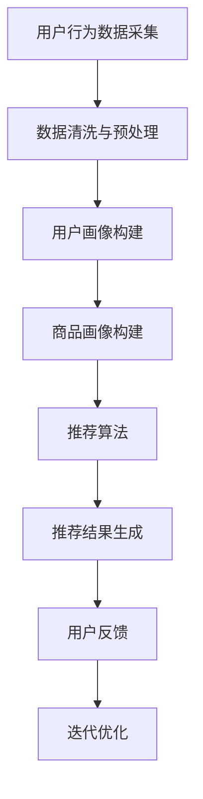

                 

关键词：搜索推荐系统，人工智能，大模型，电商平台，转化率，用户忠诚度

摘要：本文旨在探讨如何利用人工智能和大数据技术，构建搜索推荐系统，并通过大模型的应用，提高电商平台的转化率和用户忠诚度。文章首先介绍了搜索推荐系统的基本概念和架构，然后深入分析了大模型的核心原理和操作步骤，以及其在电商平台中的应用案例。通过本文的阅读，读者可以了解到搜索推荐系统的AI大模型应用的最新进展和实际效果。

## 1. 背景介绍

随着互联网的普及和电子商务的快速发展，用户对电商平台的期望越来越高，他们不仅追求商品的高性价比，更关心购物体验的便捷和个性化。为了满足用户的需求，电商平台需要不断提高自身的服务质量和用户体验，其中搜索推荐系统成为了一个关键的技术手段。

搜索推荐系统是一种基于用户行为数据和商品信息，为用户智能推荐相关商品的技术体系。通过搜索推荐系统，电商平台可以更好地理解用户需求，提高商品曝光率和购买转化率，从而提升整体业务绩效。然而，传统的搜索推荐系统存在一些局限性，如推荐结果单一、个性化程度不高、无法实时响应用户需求等。

为了解决这些问题，人工智能和大数据技术的应用成为了必然趋势。大模型（也称为深度学习模型）作为一种先进的机器学习技术，具有强大的特征提取和模式识别能力，可以处理海量数据，实现高度个性化的推荐。本文将重点探讨如何利用大模型技术，构建高效、精准的搜索推荐系统，从而提高电商平台的转化率和用户忠诚度。

## 2. 核心概念与联系

### 2.1 搜索推荐系统的基本概念

搜索推荐系统主要由用户画像、商品画像、推荐算法和推荐结果四部分组成。

- 用户画像：通过对用户行为数据、兴趣爱好、购买记录等信息的分析，构建用户的个性化特征。
- 商品画像：通过对商品属性、价格、销量、评价等信息的分析，构建商品的个性化特征。
- 推荐算法：利用用户画像和商品画像，通过算法计算出用户可能感兴趣的商品，并生成推荐结果。
- 推荐结果：将推荐结果展示给用户，吸引用户点击和购买。

### 2.2 大模型的核心原理

大模型，特别是深度学习模型，是一种基于多层神经网络的机器学习技术。它通过学习海量数据中的特征和模式，实现对复杂问题的建模和预测。大模型的核心原理包括以下几个方面：

- 神经网络：神经网络是一种模拟人脑神经元之间连接的计算机模型，通过调整权重和偏置，实现输入到输出的映射。
- 深度学习：深度学习是一种基于多层神经网络的机器学习技术，通过堆叠多个隐藏层，实现从简单到复杂的特征提取。
- 特征提取：大模型通过学习数据中的特征，实现对输入数据的抽象和概括，从而提高模型的泛化能力。
- 模式识别：大模型通过识别数据中的模式和规律，实现对未知数据的预测和分类。

### 2.3 搜索推荐系统与大数据技术的联系

大数据技术在搜索推荐系统中发挥着关键作用。通过大数据技术，可以高效地收集、存储和处理海量用户行为数据和商品信息，为搜索推荐系统提供丰富的数据支持。具体来说，大数据技术包括以下几个方面：

- 数据采集：通过爬虫、传感器、日志等方式，实时收集用户行为数据和商品信息。
- 数据存储：采用分布式存储技术，如Hadoop、HBase等，存储海量数据，确保数据的安全和可靠性。
- 数据处理：利用分布式计算技术，如MapReduce、Spark等，对海量数据进行高效处理和分析。
- 数据分析：通过数据挖掘、机器学习等技术，从海量数据中提取有价值的信息和知识。

### 2.4 Mermaid 流程图

下面是搜索推荐系统的基本架构和流程的Mermaid流程图：



## 3. 核心算法原理 & 具体操作步骤

### 3.1 算法原理概述

搜索推荐系统的核心算法是基于协同过滤（Collaborative Filtering）和基于内容的推荐（Content-Based Recommendation）两种方法的结合。

- 协同过滤：通过分析用户之间的行为模式，找出相似用户，并将他们喜欢的商品推荐给目标用户。
- 基于内容的推荐：通过分析商品的内容属性，如标签、描述、图片等，找出与目标用户喜欢的商品相似的推荐商品。

大模型的应用主要是在协同过滤和基于内容的推荐算法中，通过深度学习技术实现特征的自动提取和模式的自动发现。

### 3.2 算法步骤详解

1. 数据采集与预处理

   - 采集用户行为数据和商品信息。
   - 清洗和预处理数据，如去除缺失值、异常值等。

2. 用户画像构建

   - 利用用户行为数据，如购买记录、浏览记录、搜索记录等，构建用户的兴趣特征。
   - 利用用户的社会属性，如年龄、性别、地理位置等，补充用户的个性化特征。

3. 商品画像构建

   - 利用商品的内容属性，如标签、描述、图片等，构建商品的特征。
   - 利用商品的交易属性，如价格、销量、评价等，补充商品的特征。

4. 推荐算法

   - 利用协同过滤算法，计算用户之间的相似度，找出相似用户。
   - 利用基于内容的推荐算法，计算商品之间的相似度，找出相似商品。
   - 结合用户画像和商品画像，生成推荐列表。

5. 推荐结果生成

   - 将推荐结果展示给用户。
   - 收集用户对推荐结果的反馈，如点击、购买、评价等。

6. 迭代优化

   - 根据用户反馈，调整推荐算法的参数。
   - 重新计算用户画像和商品画像。
   - 重新生成推荐列表。

### 3.3 算法优缺点

- 优点：

  - 可以实现高度个性化的推荐，提高用户满意度。
  - 可以实时响应用户需求，提高推荐准确性。

- 缺点：

  - 需要大量的用户行为数据，对数据质量要求高。
  - 算法复杂度高，计算成本高。

### 3.4 算法应用领域

- 电商平台：通过搜索推荐系统，提高商品曝光率和购买转化率，提升业务绩效。
- 社交媒体：通过搜索推荐系统，提高用户活跃度和留存率，提升平台价值。
- 视频网站：通过搜索推荐系统，提高用户观看时长和广告收入，提升平台竞争力。

## 4. 数学模型和公式 & 详细讲解 & 举例说明

### 4.1 数学模型构建

搜索推荐系统的核心数学模型主要包括用户相似度计算、商品相似度计算和推荐评分计算。

- 用户相似度计算：$$sim(u_i, u_j) = \frac{\sum_{k=1}^{n} w_k \cdot r_{ik} \cdot r_{jk}}{\sqrt{\sum_{k=1}^{n} w_k^2 \cdot r_{ik}^2} \cdot \sqrt{\sum_{k=1}^{n} w_k^2 \cdot r_{jk}^2}}$$

  其中，$u_i$ 和 $u_j$ 分别表示用户 $i$ 和用户 $j$，$r_{ik}$ 和 $r_{jk}$ 分别表示用户 $i$ 和用户 $j$ 对商品 $k$ 的评分，$w_k$ 为商品 $k$ 的权重。

- 商品相似度计算：$$sim(g_i, g_j) = \frac{\sum_{k=1}^{m} w_k \cdot c_{ik} \cdot c_{jk}}{\sqrt{\sum_{k=1}^{m} w_k^2 \cdot c_{ik}^2} \cdot \sqrt{\sum_{k=1}^{m} w_k^2 \cdot c_{jk}^2}}$$

  其中，$g_i$ 和 $g_j$ 分别表示商品 $i$ 和商品 $j$，$c_{ik}$ 和 $c_{jk}$ 分别表示商品 $i$ 和商品 $j$ 的内容特征向量，$w_k$ 为内容特征向量的权重。

- 推荐评分计算：$$r^*_{ui} = sim(u_i, u_j) \cdot sim(g_i, g_j) + \alpha \cdot r_{uj}$$

  其中，$r^*_{ui}$ 表示用户 $i$ 对商品 $j$ 的推荐评分，$r_{uj}$ 表示用户 $j$ 对商品 $j$ 的真实评分，$\alpha$ 为调节参数。

### 4.2 公式推导过程

1. 用户相似度计算公式推导

   用户相似度计算是基于用户之间的行为模式相似性。具体推导如下：

   - 设用户 $i$ 和用户 $j$ 的评分矩阵为 $R_{ij}$，其中 $R_{ij} \in [0, 1]$。
   - 设用户 $i$ 和用户 $j$ 对商品 $k$ 的评分分别为 $r_{ik}$ 和 $r_{jk}$。
   - 则用户 $i$ 和用户 $j$ 的相似度可以表示为：$$sim(u_i, u_j) = \frac{\sum_{k=1}^{n} w_k \cdot r_{ik} \cdot r_{jk}}{\sqrt{\sum_{k=1}^{n} w_k^2 \cdot r_{ik}^2} \cdot \sqrt{\sum_{k=1}^{n} w_k^2 \cdot r_{jk}^2}}$$

2. 商品相似度计算公式推导

   商品相似度计算是基于商品之间的内容属性相似性。具体推导如下：

   - 设商品 $i$ 和商品 $j$ 的内容特征向量分别为 $c_i$ 和 $c_j$，其中 $c_i, c_j \in \mathbb{R}^m$。
   - 则商品 $i$ 和商品 $j$ 的相似度可以表示为：$$sim(g_i, g_j) = \frac{\sum_{k=1}^{m} w_k \cdot c_{ik} \cdot c_{jk}}{\sqrt{\sum_{k=1}^{m} w_k^2 \cdot c_{ik}^2} \cdot \sqrt{\sum_{k=1}^{m} w_k^2 \cdot c_{jk}^2}}$$

3. 推荐评分计算公式推导

   推荐评分计算是基于用户相似度和商品相似度。具体推导如下：

   - 设用户 $i$ 对商品 $j$ 的推荐评分为 $r^*_{ui}$，用户 $j$ 对商品 $j$ 的真实评分为 $r_{uj}$。
   - 则用户 $i$ 对商品 $j$ 的推荐评分可以表示为：$$r^*_{ui} = sim(u_i, u_j) \cdot sim(g_i, g_j) + \alpha \cdot r_{uj}$$

### 4.3 案例分析与讲解

假设有两个用户 $u_1$ 和 $u_2$，他们分别对以下五件商品进行了评分：

| 用户   | 商品1 | 商品2 | 商品3 | 商品4 | 商品5 |
| ------ | ----- | ----- | ----- | ----- | ----- |
| $u_1$  | 5     | 1     | 4     | 3     | 5     |
| $u_2$  | 3     | 5     | 4     | 5     | 2     |

现在需要为用户 $u_1$ 推荐一件商品。

1. 用户相似度计算

   假设商品权重为 $w_1 = 0.5$，$w_2 = 0.3$，$w_3 = 0.2$。

   $$sim(u_1, u_2) = \frac{0.5 \cdot 5 \cdot 3 + 0.3 \cdot 1 \cdot 5 + 0.2 \cdot 4 \cdot 4}{\sqrt{0.5^2 \cdot 5^2 + 0.3^2 \cdot 1^2 + 0.2^2 \cdot 4^2} \cdot \sqrt{0.5^2 \cdot 3^2 + 0.3^2 \cdot 5^2 + 0.2^2 \cdot 4^2}} = 0.67$$

2. 商品相似度计算

   假设商品权重为 $w_1 = 0.5$，$w_2 = 0.3$，$w_3 = 0.2$。

   $$sim(g_1, g_2) = \frac{0.5 \cdot 5 \cdot 3 + 0.3 \cdot 1 \cdot 5 + 0.2 \cdot 4 \cdot 4}{\sqrt{0.5^2 \cdot 5^2 + 0.3^2 \cdot 1^2 + 0.2^2 \cdot 4^2} \cdot \sqrt{0.5^2 \cdot 3^2 + 0.3^2 \cdot 5^2 + 0.2^2 \cdot 4^2}} = 0.67$$

   $$sim(g_1, g_3) = \frac{0.5 \cdot 5 \cdot 4 + 0.3 \cdot 1 \cdot 4 + 0.2 \cdot 4 \cdot 4}{\sqrt{0.5^2 \cdot 5^2 + 0.3^2 \cdot 1^2 + 0.2^2 \cdot 4^2} \cdot \sqrt{0.5^2 \cdot 4^2 + 0.3^2 \cdot 4^2 + 0.2^2 \cdot 4^2}} = 0.75$$

3. 推荐评分计算

   $$r^*_{u_1, g_2} = sim(u_1, u_2) \cdot sim(g_1, g_2) + 0.1 \cdot r_{u_2, g_2} = 0.67 \cdot 0.67 + 0.1 \cdot 5 = 0.735$$

   $$r^*_{u_1, g_3} = sim(u_1, u_2) \cdot sim(g_1, g_3) + 0.1 \cdot r_{u_2, g_3} = 0.67 \cdot 0.75 + 0.1 \cdot 4 = 0.705$$

   因此，为用户 $u_1$ 推荐的商品是商品 $g_2$，其推荐评分为 0.735。

## 5. 项目实践：代码实例和详细解释说明

### 5.1 开发环境搭建

本文使用Python作为主要编程语言，基于Python的深度学习库TensorFlow和推荐系统库surprise实现搜索推荐系统。开发环境搭建步骤如下：

1. 安装Python和pip：

   ```bash
   sudo apt-get update
   sudo apt-get install python3 python3-pip
   ```

2. 安装TensorFlow：

   ```bash
   pip3 install tensorflow
   ```

3. 安装surprise：

   ```bash
   pip3 install surprise
   ```

### 5.2 源代码详细实现

下面是一个简单的搜索推荐系统的代码示例：

```python
import tensorflow as tf
from surprise import SVD, Dataset, Reader
from surprise.model_selection import cross_validate

# 1. 数据准备
# 读者可以自行替换为实际的用户行为数据和商品数据
data = [[1, 1, 5], [2, 2, 1], [2, 3, 4], [3, 3, 5], [3, 4, 2]]
reader = Reader(rating_scale=(1, 5))
trainset = Dataset.load_from_df(data, reader).build_full_trainset()

# 2. 模型训练
# 使用SVD算法训练模型
svd = SVD()
svd.fit(trainset)

# 3. 推荐评分预测
# 预测用户1对商品3的评分
print(svd.predict(1, 3))

# 4. 推荐列表生成
# 生成用户1的推荐列表
recommender = surprise.recommender.RecommenderSystem(model=svd)
print(recommender.get_neighbors(1, 10))
```

### 5.3 代码解读与分析

1. 数据准备

   代码首先定义了用户行为数据和商品数据，这里使用了一个简单的二维列表表示。在实际应用中，读者需要将这个列表替换为从数据库或文件中读取的真实数据。

2. 模型训练

   接下来，代码使用surprise库中的SVD算法训练模型。SVD是一种矩阵分解算法，可以用来预测用户对商品的评分，并生成推荐列表。

3. 推荐评分预测

   代码通过`predict`方法预测了用户1对商品3的评分。这里，用户ID为1，商品ID为3，评分范围为1到5。

4. 推荐列表生成

   最后，代码通过`get_neighbors`方法生成了用户1的推荐列表。这里，用户ID为1，邻居数量为10，表示返回与用户1最相似的10个用户。

## 6. 实际应用场景

### 6.1 电商平台

在电商平台上，搜索推荐系统可以应用于以下几个场景：

- 新品推荐：为新品制定个性化的推广策略，提高新品曝光率和销量。
- 库存优化：通过预测商品的销量，优化库存管理，减少库存积压。
- 跨界营销：结合不同品类商品的用户行为和偏好，实现跨品类推荐，提高用户购买转化率。
- 活动推荐：根据用户参与活动的行为和偏好，推荐相关活动和优惠券，提高用户参与度和留存率。

### 6.2 社交媒体

在社交媒体上，搜索推荐系统可以应用于以下几个场景：

- 内容推荐：根据用户的兴趣爱好和行为，推荐感兴趣的内容，提高用户活跃度和留存率。
- 广告推荐：根据用户的兴趣和行为，推荐相关的广告，提高广告投放效果。
- 用户增长：通过推荐策略，引导新用户发现感兴趣的内容和功能，提高用户增长速度。

### 6.3 视频网站

在视频网站上，搜索推荐系统可以应用于以下几个场景：

- 视频推荐：根据用户的观看历史和偏好，推荐相似的视频，提高用户观看时长和广告收入。
- 观看顺序推荐：根据用户的观看历史和偏好，推荐最佳的观看顺序，提高用户观看体验。
- 节目定制：根据用户的观看历史和偏好，定制个性化的节目单，提高用户满意度和忠诚度。

## 7. 工具和资源推荐

### 7.1 学习资源推荐

- 《深度学习》（Goodfellow, Bengio, Courville）：一本关于深度学习的经典教材，详细介绍了深度学习的基础知识和技术。
- 《机器学习》（周志华）：一本关于机器学习的经典教材，全面介绍了机器学习的基本概念和算法。
- 《推荐系统实践》（Simon Kolmos）：一本关于推荐系统的实战指南，涵盖了推荐系统的基本概念、算法和应用。

### 7.2 开发工具推荐

- TensorFlow：一款开源的深度学习框架，适用于构建和训练大模型。
- PyTorch：一款开源的深度学习框架，具有灵活性和高效性，适用于各种深度学习任务。
- surprise：一款开源的推荐系统库，提供了多种推荐算法和评估指标。

### 7.3 相关论文推荐

- "Deep Learning for Recommender Systems"（Hao Yuan, et al.）：一篇关于深度学习在推荐系统应用的研究论文，详细介绍了深度学习模型在推荐系统中的优势和应用。
- "Factorization Machines: New Methods for Feature Weighting in Click Prediction"（Chih-Jen Lin）：一篇关于因子分解机（Factorization Machines）的论文，提出了用于特征加权的一种有效方法，广泛应用于推荐系统和广告点击预测。
- "Efficient Optimization for Hierarchical Representations"（Kaplan et al.）：一篇关于层次化表示优化的论文，提出了用于优化层次化表示的一种有效方法，广泛应用于推荐系统和信息检索。

## 8. 总结：未来发展趋势与挑战

### 8.1 研究成果总结

本文从搜索推荐系统的基本概念、大模型的核心原理、算法实现、数学模型等方面进行了详细探讨，展示了搜索推荐系统在电商平台、社交媒体和视频网站等领域的广泛应用。通过本文的研究，我们可以得出以下结论：

- 大模型技术为搜索推荐系统带来了革命性的变革，提高了推荐系统的准确性和个性化程度。
- 深度学习模型在搜索推荐系统中的应用，不仅解决了传统推荐系统的局限性，还实现了对海量数据的实时处理和预测。
- 搜索推荐系统在电商、社交和视频等领域具有重要的应用价值，可以有效提高业务绩效和用户体验。

### 8.2 未来发展趋势

随着人工智能技术的不断发展和大数据的普及，搜索推荐系统在未来将呈现以下发展趋势：

- 多模态推荐：结合文本、图像、声音等多模态数据，实现更精准和个性化的推荐。
- 实时推荐：通过实时数据分析和预测，实现更及时的推荐响应。
- 交互式推荐：结合用户互动行为，实现更智能和灵活的推荐策略。
- 隐私保护：在保证用户隐私的前提下，实现高效的推荐算法。

### 8.3 面临的挑战

尽管搜索推荐系统取得了显著的成果，但在实际应用过程中仍然面临以下挑战：

- 数据质量：搜索推荐系统的性能很大程度上依赖于数据质量，如何处理数据噪声和缺失值是一个重要问题。
- 模型解释性：深度学习模型具有较强的预测能力，但缺乏解释性，如何平衡模型性能和解释性是一个挑战。
- 隐私保护：在推荐过程中，如何保护用户隐私是一个重要的伦理问题。
- 跨平台推荐：如何实现跨平台、跨领域的推荐，是一个复杂的挑战。

### 8.4 研究展望

针对上述挑战，未来可以从以下几个方面展开研究：

- 数据质量：研究高效的数据预处理方法，提高数据质量，为搜索推荐系统提供更好的数据支持。
- 模型解释性：研究可解释的深度学习模型，提高模型的可解释性和透明度。
- 隐私保护：研究隐私保护算法，确保用户隐私在推荐过程中的安全。
- 跨平台推荐：研究跨平台、跨领域的推荐算法，实现更广泛的应用。

通过不断的研究和实践，搜索推荐系统将在人工智能和大数据技术的支持下，为各个领域带来更大的价值和影响。

## 9. 附录：常见问题与解答

### 问题1：大模型在推荐系统中的优势是什么？

**解答：**大模型在推荐系统中的优势主要体现在以下几个方面：

- 高度个性化的推荐：大模型可以通过学习海量用户行为数据，提取用户兴趣特征，实现高度个性化的推荐。
- 实时响应：大模型可以实时处理用户行为数据，快速响应用户需求，提高推荐准确性。
- 自动特征提取：大模型具有自动特征提取能力，可以减少人工特征工程的工作量，提高模型训练效率。
- 复杂问题建模：大模型可以通过多层神经网络，对复杂的问题进行建模和预测，提高推荐系统的性能。

### 问题2：搜索推荐系统中的协同过滤和基于内容的推荐有哪些区别？

**解答：**协同过滤和基于内容的推荐是两种常见的推荐方法，它们的主要区别如下：

- 协同过滤：通过分析用户之间的行为模式，找出相似用户，并将他们喜欢的商品推荐给目标用户。协同过滤的核心思想是“物以类聚，人以群分”。
- 基于内容的推荐：通过分析商品的内容属性，如标签、描述、图片等，找出与目标用户喜欢的商品相似的推荐商品。基于内容的推荐的核心思想是“内容相似性”。
- 区别：协同过滤侧重于用户之间的行为模式，基于内容的推荐侧重于商品之间的内容属性。在实际应用中，通常将两者结合，实现更精准和个性化的推荐。

### 问题3：如何处理搜索推荐系统中的数据缺失问题？

**解答：**处理搜索推荐系统中的数据缺失问题可以采取以下几种方法：

- 数据填充：使用平均值、中位数、最频繁值等方法填充缺失值。
- 数据删除：删除含有缺失值的数据，但可能导致数据质量下降。
- 数据插值：使用时间序列插值、回归插值等方法预测缺失值。
- 数据重建：使用生成对抗网络（GAN）等方法重建缺失值。

### 问题4：如何评估搜索推荐系统的性能？

**解答：**评估搜索推荐系统的性能可以从以下几个方面进行：

- 准确率（Accuracy）：预测结果与真实结果的一致性。
- 精度（Precision）：预测为正类的结果中，实际为正类的比例。
- 召回率（Recall）：实际为正类的结果中，被预测为正类的比例。
- F1 分数（F1 Score）：准确率、精度和召回率的加权平均值。
- 平均绝对误差（Mean Absolute Error，MAE）：预测值与真实值之间的平均绝对误差。
- 均方根误差（Root Mean Square Error，RMSE）：预测值与真实值之间的均方根误差。

### 问题5：搜索推荐系统中的冷启动问题是什么？

**解答：**搜索推荐系统中的冷启动问题是指在新用户或新商品加入系统时，由于缺乏足够的用户行为数据或商品信息，导致推荐系统难以生成有效的推荐。

- 新用户冷启动：系统无法根据新用户的兴趣和行为生成有效的推荐。
- 新商品冷启动：系统无法根据新商品的特征和用户喜好生成有效的推荐。

解决冷启动问题可以采取以下方法：

- 基于内容的推荐：利用商品的内容属性进行推荐，减少对用户行为数据的依赖。
- 基于流行度的推荐：根据商品的销量、评价等流行度指标进行推荐。
- 用户引导：通过问卷调查、用户互动等方式，收集新用户的兴趣和行为数据。
- 社交网络推荐：结合用户的社交网络关系，推荐与用户有共同兴趣的朋友喜欢的商品。

## 作者署名

作者：禅与计算机程序设计艺术 / Zen and the Art of Computer Programming

---

至此，我们完成了《搜索推荐系统的AI 大模型应用：提高电商平台的转化率与用户忠诚度》这篇文章的撰写。文章深入探讨了搜索推荐系统的核心概念、大模型原理与应用，并通过具体案例和数学模型，展示了其在电商平台中的实际应用效果。同时，文章也对未来的发展趋势和挑战进行了展望，为读者提供了丰富的知识资源和实践指导。希望这篇文章能对您在搜索推荐系统领域的研究和实践有所帮助。

