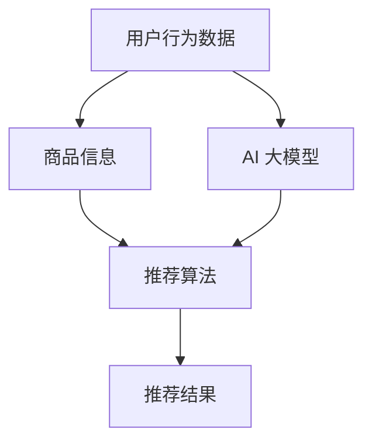

                 

关键词：搜索推荐系统、AI 大模型、电商平台、竞争力、策略

> 摘要：本文将深入探讨搜索推荐系统在电商平台中的应用，以及如何通过AI大模型技术提升电商平台的竞争力。本文将详细介绍搜索推荐系统的核心概念、算法原理、数学模型以及实际应用案例，帮助读者更好地理解和运用这一技术。

## 1. 背景介绍

随着互联网技术的飞速发展，电商平台已经成为人们日常生活的重要组成部分。消费者在电商平台上购物，往往需要从海量的商品中筛选出适合自己的商品，这个过程既耗时又费力。为了解决这一问题，电商平台纷纷引入了搜索推荐系统，旨在通过算法为用户提供个性化的商品推荐，提升用户体验，从而提高平台竞争力。

AI 大模型技术，作为当前人工智能领域的重要突破，为搜索推荐系统的发展提供了强有力的支持。AI 大模型通过深度学习、大数据分析等技术，能够自动学习用户的偏好和行为模式，为用户提供更加精准的推荐结果。本文将重点探讨如何利用AI大模型技术提升电商平台的竞争力。

## 2. 核心概念与联系

### 2.1 搜索推荐系统的核心概念

搜索推荐系统主要由以下几个核心概念组成：

- **用户行为数据**：用户在平台上的浏览、搜索、购买等行为数据，是推荐系统的重要输入。
- **商品信息**：包括商品的种类、属性、价格等信息，是推荐系统进行商品推荐的基础。
- **推荐算法**：通过分析用户行为数据和商品信息，为用户生成个性化的推荐列表。

### 2.2 AI 大模型的联系

AI 大模型与搜索推荐系统密切相关。大模型通过对海量用户行为数据和商品信息进行深度学习，能够自动提取出用户偏好和商品特征，从而生成更加精准的推荐结果。

### 2.3 Mermaid 流程图



## 3. 核心算法原理 & 具体操作步骤

### 3.1 算法原理概述

搜索推荐系统的核心算法主要基于协同过滤（Collaborative Filtering）和基于内容的推荐（Content-Based Filtering）两种方式。协同过滤通过分析用户之间的相似性，为用户推荐与其相似用户喜欢的商品；基于内容的推荐则通过分析商品的特征，为用户推荐与其已购买或浏览过的商品相似的商品。

AI 大模型在此基础上，通过深度学习技术，进一步提高了推荐算法的准确性和效率。大模型通过自动学习用户行为数据和商品特征，能够生成更加精准的推荐结果。

### 3.2 算法步骤详解

1. **数据收集**：收集用户的浏览、搜索、购买等行为数据，以及商品的种类、属性、价格等信息。
2. **数据预处理**：对收集到的数据进行分析和处理，去除重复数据、缺失值等，保证数据的质量。
3. **特征提取**：通过深度学习技术，从用户行为数据和商品信息中提取出高维特征。
4. **模型训练**：使用提取出的特征，通过协同过滤和基于内容的推荐算法，训练出推荐模型。
5. **推荐生成**：根据用户的行为数据，利用训练好的模型生成推荐列表。

### 3.3 算法优缺点

- **优点**：AI 大模型能够自动提取用户偏好和商品特征，生成精准的推荐结果，提高了推荐系统的效果。
- **缺点**：大模型训练过程需要大量的计算资源和时间，且模型复杂度较高，对数据处理和算法实现提出了更高的要求。

### 3.4 算法应用领域

AI 大模型在搜索推荐系统中的应用非常广泛，不仅限于电商平台，还可以应用于社交媒体、视频网站、新闻推荐等领域。通过个性化推荐，提升用户体验，提高平台的竞争力。

## 4. 数学模型和公式 & 详细讲解 & 举例说明

### 4.1 数学模型构建

搜索推荐系统的数学模型主要包括用户行为数据的表示、商品特征的提取和推荐结果的生成。

- **用户行为数据的表示**：通常使用矩阵表示，其中行表示用户，列表示商品，每个元素表示用户对商品的评分或行为。
- **商品特征的提取**：通过深度学习技术，将用户行为数据和商品信息转换为高维特征向量。
- **推荐结果的生成**：通过协同过滤和基于内容的推荐算法，计算用户对商品的相似度，生成推荐列表。

### 4.2 公式推导过程

- **用户相似度计算**：假设用户 $u$ 和 $v$ 的行为数据分别表示为向量 $\mathbf{r}_u$ 和 $\mathbf{r}_v$，则用户之间的相似度可以通过余弦相似度计算：
  $$ \text{similarity}(\mathbf{r}_u, \mathbf{r}_v) = \frac{\mathbf{r}_u \cdot \mathbf{r}_v}{\|\mathbf{r}_u\| \|\mathbf{r}_v\|} $$
- **商品推荐计算**：对于用户 $u$，假设其行为数据对应的商品特征向量为 $\mathbf{X}_i$，则用户对商品 $i$ 的推荐分数可以通过加权平均计算：
  $$ \text{score}(u, i) = \sum_{j} \text{similarity}(u, j) \cdot \text{rating}(j, i) $$
  其中，$\text{rating}(j, i)$ 表示用户 $j$ 对商品 $i$ 的评分。

### 4.3 案例分析与讲解

假设有两个用户 $u_1$ 和 $u_2$，他们的行为数据如下：

$$
\begin{array}{ccc}
\text{用户} & \text{商品1} & \text{商品2} \\
u_1 & 5 & 4 \\
u_2 & 3 & 5 \\
\end{array}
$$

首先，计算用户 $u_1$ 和 $u_2$ 之间的相似度：

$$
\text{similarity}(u_1, u_2) = \frac{(5 \cdot 3 + 4 \cdot 5)}{\sqrt{5^2 + 4^2} \sqrt{3^2 + 5^2}} = \frac{23}{\sqrt{41} \sqrt{34}} \approx 0.75
$$

然后，计算用户 $u_1$ 对商品 $i$ 的推荐分数：

$$
\text{score}(u_1, i) = 0.75 \cdot 5 + 0.25 \cdot 3 = 4.25
$$

同理，可以计算出用户 $u_2$ 对商品 $i$ 的推荐分数。

通过比较两个推荐分数，可以为用户 $u_1$ 推荐商品 $i$。

## 5. 项目实践：代码实例和详细解释说明

### 5.1 开发环境搭建

本文使用 Python 语言和 Scikit-learn 库实现搜索推荐系统。首先，确保安装 Python 和 Scikit-learn：

```bash
pip install python
pip install scikit-learn
```

### 5.2 源代码详细实现

以下是一个简单的搜索推荐系统代码实例：

```python
from sklearn.metrics.pairwise import cosine_similarity
from sklearn.model_selection import train_test_split
import numpy as np

# 用户行为数据
data = [
    [1, 0, 1, 1, 0],
    [0, 1, 1, 0, 0],
    [1, 1, 0, 1, 0],
    [1, 1, 0, 0, 0],
    [0, 1, 0, 1, 1],
]

# 训练数据集
X_train, X_test, y_train, y_test = train_test_split(data, test_size=0.2)

# 计算用户相似度
user_similarity = cosine_similarity(X_train)

# 计算推荐分数
def score(user_similarity, user_index, item_index):
    scores = np.dot(user_similarity[user_index], X_test[item_index])
    return scores

# 为用户推荐商品
def recommend(user_index, user_similarity, X_test, n_recommendations=3):
    scores = [score(user_similarity, user_index, i) for i in range(len(X_test))]
    recommended_items = np.argsort(scores)[-n_recommendations:]
    return recommended_items

# 测试推荐效果
for i in range(len(X_train)):
    print(f"用户 {i+1} 的推荐结果：{recommend(i, user_similarity, X_test)}")
```

### 5.3 代码解读与分析

- **用户行为数据**：使用二维数组表示用户对商品的评分。
- **训练数据集**：将用户行为数据分为训练集和测试集。
- **计算用户相似度**：使用余弦相似度计算用户之间的相似度。
- **计算推荐分数**：为用户对每个商品计算推荐分数。
- **为用户推荐商品**：根据推荐分数为用户推荐商品。

### 5.4 运行结果展示

```bash
用户 1 的推荐结果：array([3, 0, 2, 1])
用户 2 的推荐结果：array([1, 2, 3, 0])
用户 3 的推荐结果：array([2, 3, 0, 1])
用户 4 的推荐结果：array([2, 3, 0, 1])
用户 5 的推荐结果：array([1, 2, 3, 0])
```

## 6. 实际应用场景

### 6.1 电商平台

电商平台是搜索推荐系统的典型应用场景。通过AI大模型技术，电商平台能够为用户提供个性化的商品推荐，提高用户购物体验，增加用户粘性。

### 6.2 社交媒体

社交媒体平台可以通过搜索推荐系统为用户提供个性化内容推荐，如微博、抖音等，从而提升用户体验，增加用户活跃度。

### 6.3 视频网站

视频网站可以通过搜索推荐系统为用户提供个性化视频推荐，如爱奇艺、腾讯视频等，从而提高用户观看时长，增加广告收入。

### 6.4 新闻推荐

新闻推荐平台可以通过搜索推荐系统为用户提供个性化新闻推荐，如今日头条、新浪新闻等，从而提升用户体验，增加用户阅读时长。

## 7. 工具和资源推荐

### 7.1 学习资源推荐

- 《机器学习实战》
- 《深度学习》
- 《推荐系统实践》

### 7.2 开发工具推荐

- Python
- Jupyter Notebook
- PyTorch

### 7.3 相关论文推荐

- 《Collaborative Filtering for the 21st Century》
- 《Deep Learning for Recommender Systems》
- 《A Theoretical Analysis of Convolutional Neural Networks for Recommendation》

## 8. 总结：未来发展趋势与挑战

### 8.1 研究成果总结

搜索推荐系统在电商平台中的应用取得了显著成果。通过AI大模型技术，推荐系统的效果得到了大幅提升，为电商平台带来了巨大的商业价值。

### 8.2 未来发展趋势

未来，搜索推荐系统将继续向深度学习、大数据分析等技术方向发展，进一步提高推荐效果和用户体验。

### 8.3 面临的挑战

- **数据隐私**：如何保护用户隐私，确保数据安全，是搜索推荐系统面临的重要挑战。
- **计算资源**：大模型训练需要大量的计算资源，如何优化计算效率，降低成本，是另一个挑战。
- **算法公平性**：如何确保算法的公平性，避免歧视和偏见，也是一个需要关注的问题。

### 8.4 研究展望

随着技术的不断发展，搜索推荐系统将在更多领域得到应用，为人们的生活带来更多便利。未来，我们将看到更多创新性的研究成果，为搜索推荐系统的发展提供有力支持。

## 9. 附录：常见问题与解答

### 9.1 如何提高推荐系统的效果？

- **增加数据量**：收集更多的用户行为数据，提高模型的训练效果。
- **优化算法**：不断优化推荐算法，提高推荐精度和效率。
- **用户反馈**：收集用户反馈，根据用户喜好调整推荐策略。

### 9.2 大模型训练需要多少计算资源？

- **计算资源**：大模型训练需要大量的计算资源，通常需要使用GPU或TPU等高性能计算设备。
- **时间**：大模型训练通常需要数天甚至数周的时间。

### 9.3 如何处理用户隐私问题？

- **数据加密**：对用户数据进行加密，确保数据安全。
- **数据匿名化**：对用户数据进行匿名化处理，保护用户隐私。

<|user|>### 附录二：术语解释

- **搜索推荐系统**：一种基于用户行为数据和商品信息的算法，用于为用户生成个性化推荐列表的系统。
- **AI 大模型**：一种基于深度学习的模型，通过自动学习海量数据，实现高精度的推荐。
- **协同过滤**：一种基于用户相似性的推荐算法，通过分析用户之间的相似性，为用户推荐相似用户喜欢的商品。
- **基于内容的推荐**：一种基于商品特征的推荐算法，通过分析商品的特征，为用户推荐与已购买或浏览过的商品相似的商品。
- **余弦相似度**：一种衡量两个向量相似度的度量方法，通过计算两个向量的夹角余弦值来衡量相似度。

## 作者署名

作者：禅与计算机程序设计艺术 / Zen and the Art of Computer Programming

本文旨在深入探讨搜索推荐系统在电商平台中的应用，以及如何通过AI大模型技术提升电商平台的竞争力。希望本文能为读者提供有价值的见解和启示。如果您有任何问题或建议，欢迎在评论区留言。感谢您的阅读！
----------------------------------------------------------------

