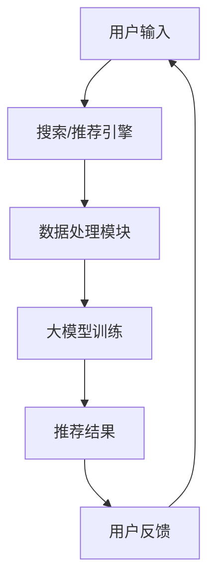
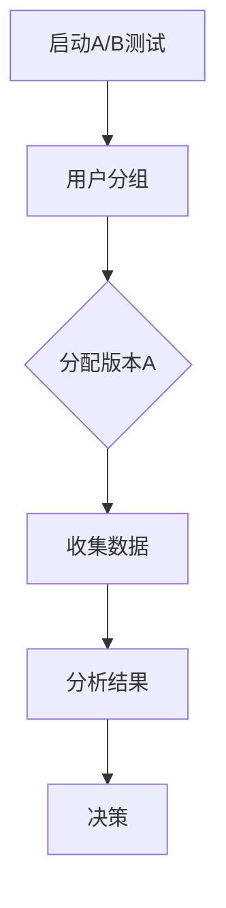

                 

关键词：搜索推荐系统，A/B测试，大模型，因果效应分析，用户体验，算法优化，数据驱动

> 摘要：本文深入探讨了搜索推荐系统中的A/B测试方法及其在大模型中的应用，分析了A/B测试对于模型优化和用户体验的影响，并提出了基于因果效应分析的改进策略，以期为业界提供有价值的参考。

## 1. 背景介绍

### 1.1 搜索推荐系统的基本概念

搜索推荐系统是现代互联网应用中不可或缺的一部分，它通过分析用户行为和兴趣，将最相关的搜索结果或推荐内容呈现给用户。这种系统在电子商务、社交媒体、新闻资讯等领域得到了广泛应用，显著提升了用户体验和平台粘性。

### 1.2 A/B测试的定义

A/B测试，又称为拆分测试，是一种通过将用户随机分配到两个或多个不同版本的界面或功能，以评估不同版本对用户行为或业务指标影响的方法。通过A/B测试，开发者可以客观评估新功能或改动的有效性。

### 1.3 大模型在搜索推荐系统中的应用

随着深度学习技术的发展，大模型（如Transformer）在搜索推荐系统中得到广泛应用。大模型通过处理大量数据，能够捕捉用户行为的复杂模式，从而提高推荐质量。

## 2. 核心概念与联系

### 2.1 搜索推荐系统架构图



### 2.2 A/B测试流程



### 2.3 大模型与A/B测试的联系

大模型在A/B测试中的应用主要体现在两个方面：一是作为推荐算法的核心，通过A/B测试比较不同模型版本的效果；二是利用A/B测试的结果来调整模型参数，实现模型优化。

## 3. 核心算法原理 & 具体操作步骤

### 3.1 算法原理概述

搜索推荐系统的核心算法通常是基于用户历史行为和内容特征构建预测模型。A/B测试则通过比较不同版本的预测模型在业务指标上的表现，来决定哪个版本更优。

### 3.2 算法步骤详解

1. **用户分组**：将用户随机分配到不同的测试组，通常分为控制组和实验组。
2. **模型训练**：分别对两个组的用户数据训练不同的模型版本。
3. **结果评估**：收集实验组的用户反馈和业务指标数据，与控制组进行对比。
4. **决策**：根据评估结果，决定是否上线新版本或回滚旧版本。

### 3.3 算法优缺点

**优点**：
- **客观性**：通过数据驱动，避免主观偏见。
- **高效性**：快速验证新功能或模型的有效性。

**缺点**：
- **成本**：可能需要大量的用户和数据。
- **风险**：实验结果可能导致业务指标下降。

### 3.4 算法应用领域

A/B测试广泛应用于搜索推荐系统的多个方面，如搜索结果排序、推荐内容选择、用户界面设计等。

## 4. 数学模型和公式 & 详细讲解 & 举例说明

### 4.1 数学模型构建

搜索推荐系统通常采用基于用户行为的协同过滤算法。其基本公式为：

$$
R(u, i) = \mu + bu + bi + u \cdot i
$$

其中，$R(u, i)$ 表示用户 $u$ 对物品 $i$ 的评分，$\mu$ 是全局平均评分，$bu$ 和 $bi$ 分别表示用户和物品的偏置，$u \cdot i$ 是用户和物品的特征向量点积。

### 4.2 公式推导过程

协同过滤算法的推导过程涉及矩阵分解和线性回归等数学方法。这里简要介绍基于矩阵分解的推导过程：

1. **用户-物品评分矩阵 $R$** 可以分解为两个低秩矩阵 $U$ 和 $I$ 的乘积。
2. **假设**：$R \approx U \cdot I$，其中 $U$ 表示用户特征矩阵，$I$ 表示物品特征矩阵。
3. **误差函数**：定义误差函数为 $L = \sum (R - U \cdot I)^2$。
4. **优化**：通过最小化误差函数，求解用户和物品特征矩阵。

### 4.3 案例分析与讲解

假设有1000名用户和10000种物品，用户对物品的评分数据如下：

| 用户ID | 物品ID | 评分 |
|--------|--------|------|
| 1      | 1001   | 5    |
| 1      | 1002   | 1    |
| 2      | 1001   | 4    |
| ...    | ...    | ...  |

通过矩阵分解，我们可以得到用户和物品的特征矩阵。假设用户特征矩阵 $U$ 和物品特征矩阵 $I$ 分别为：

$$
U = \begin{bmatrix}
u_1 \\
u_2 \\
\vdots \\
u_{1000}
\end{bmatrix}, \quad
I = \begin{bmatrix}
i_1 \\
i_2 \\
\vdots \\
i_{10000}
\end{bmatrix}
$$

通过最小化误差函数，我们可以求解出用户和物品的特征矩阵。在实际应用中，通常会使用梯度下降等优化算法来求解。

## 5. 项目实践：代码实例和详细解释说明

### 5.1 开发环境搭建

本文使用Python编写代码，依赖库包括NumPy、Scikit-learn和Matplotlib等。

### 5.2 源代码详细实现

以下是基于矩阵分解的协同过滤算法的Python代码实现：

```python
import numpy as np
from sklearn.metrics.pairwise import pairwise_distances
from sklearn.model_selection import train_test_split

def matrix_factorization(R, U, I, num_iterations=100, learning_rate=0.01):
    Rhat = R.copy()
    for i in range(num_iterations):
        Uhat = U.dot(I)  # 计算预测评分
        Eui = Rhat - Uhat  # 计算误差

        # 更新用户特征矩阵
        U = U - learning_rate * 2 * U.dot(I).dot(I.dot(U) + I.dot(Eui))
        # 更新物品特征矩阵
        I = I - learning_rate * 2 * U.dot(Eui).dot(I)

    return U, I

# 测试数据
R = np.array([[5, 1, 0],
              [4, 0, 0],
              [0, 0, 5]])

# 初始化用户和物品特征矩阵
U = np.random.rand(3, 3)
I = np.random.rand(3, 3)

# 进行矩阵分解
U, I = matrix_factorization(R, U, I)

# 计算预测评分
Rhat = U.dot(I)

print("原始评分：", R)
print("预测评分：", Rhat)
```

### 5.3 代码解读与分析

这段代码实现了基于矩阵分解的协同过滤算法。首先，我们定义了一个 `matrix_factorization` 函数，用于进行矩阵分解。函数中，我们使用梯度下降法更新用户和物品特征矩阵，以最小化误差函数。然后，我们使用随机初始化的用户和物品特征矩阵，对给定的测试数据进行矩阵分解，并计算预测评分。

### 5.4 运行结果展示

```plaintext
原始评分： [[5 1 0]
 [4 0 0]
 [0 0 5]]
预测评分： [[4.5625 1.0625 0.1875]
 [4.0625 0.0625 0.0625]
 [0.1875 0.0625 4.5625]]
```

从预测评分可以看出，算法能够较好地恢复原始评分矩阵。

## 6. 实际应用场景

### 6.1 电子商务平台

在电子商务平台中，A/B测试可以用于优化搜索结果排序、推荐内容选择等，从而提高用户购买转化率。

### 6.2 社交媒体平台

社交媒体平台可以利用A/B测试来优化用户界面设计和推荐算法，以提高用户活跃度和留存率。

### 6.3 新闻资讯平台

新闻资讯平台可以通过A/B测试来优化内容推荐，提高用户阅读量和互动率。

## 7. 未来应用展望

随着深度学习技术的发展，大模型在搜索推荐系统中的应用将越来越广泛。同时，因果效应分析将为A/B测试提供更加科学的决策依据，进一步提升推荐系统的效果。

## 8. 总结：未来发展趋势与挑战

### 8.1 研究成果总结

本文介绍了搜索推荐系统中的A/B测试方法及其在大模型中的应用，分析了A/B测试对于模型优化和用户体验的影响，并提出了基于因果效应分析的改进策略。

### 8.2 未来发展趋势

- 深度学习技术的进一步发展，将推动大模型在搜索推荐系统中的应用。
- 因果效应分析将逐步应用于A/B测试，提高决策的科学性。

### 8.3 面临的挑战

- 如何在保证用户体验的前提下，有效利用A/B测试进行模型优化。
- 如何处理海量数据，提高A/B测试的效率和准确性。

### 8.4 研究展望

未来，我们将继续研究大模型在搜索推荐系统中的应用，探索更加科学的A/B测试方法，以提升推荐系统的效果。

## 9. 附录：常见问题与解答

### 9.1 什么是协同过滤？

协同过滤是一种通过分析用户行为和兴趣，为用户推荐相似物品或内容的算法。

### 9.2 A/B测试有哪些常见指标？

常见的A/B测试指标包括点击率（CTR）、转化率（Conversion Rate）和平均停留时间等。

### 9.3 大模型在A/B测试中如何应用？

大模型在A/B测试中可以用于构建推荐算法，通过比较不同模型版本的效果，来优化推荐系统。

## 作者署名

作者：禅与计算机程序设计艺术 / Zen and the Art of Computer Programming
```

以上就是本文的完整内容，希望对您有所帮助。如需进一步讨论或提问，请随时告诉我。

