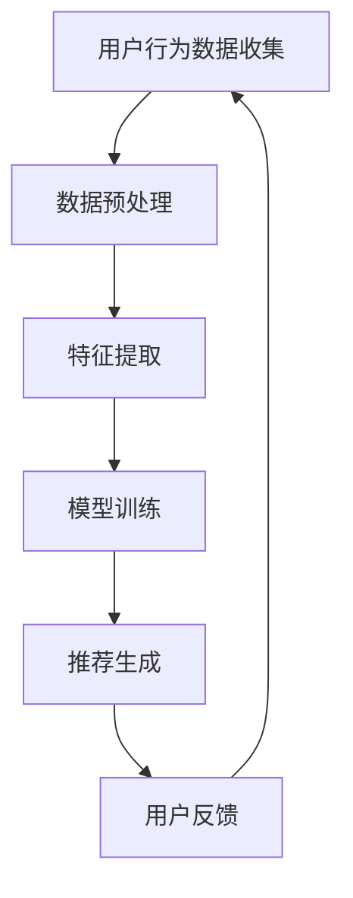
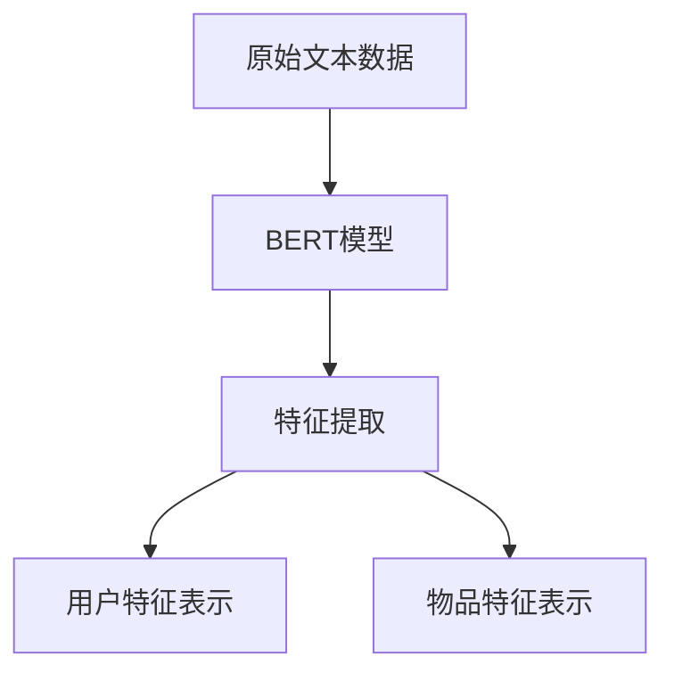
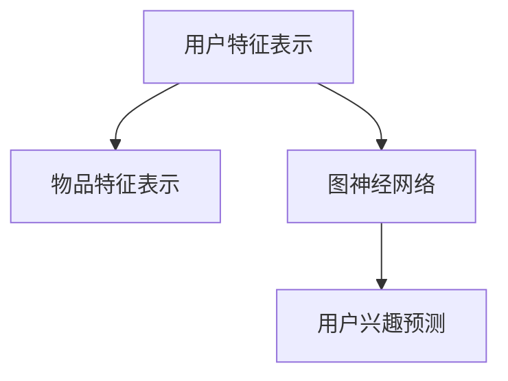
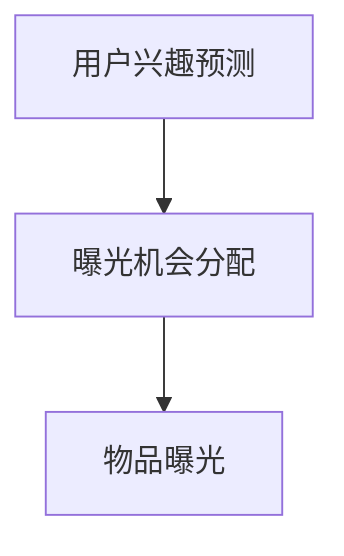

                 
# 搜索推荐系统的冷启动：大模型新思路

> 搜索推荐系统、冷启动、大模型、算法、深度学习、用户行为分析、AI技术

## 1. 背景介绍

搜索推荐系统是现代信息社会中不可或缺的一环。随着互联网的快速发展和信息爆炸式的增长，用户获取有用信息的成本日益增加，而推荐系统能够有效缓解这一问题，提高信息获取的效率。然而，推荐系统在刚启动阶段（即冷启动问题）面临诸多挑战。冷启动问题主要分为两类：用户冷启动和物品冷启动。用户冷启动指的是在用户历史行为数据稀少或缺失的情况下，推荐系统如何为用户生成有效的推荐列表；物品冷启动则是指当新物品进入推荐系统时，如何在用户历史行为数据不足的情况下，让新物品获得合理的曝光和关注。

传统的推荐算法如协同过滤、基于内容的推荐等，在面对冷启动问题时表现不佳。而近年来，随着深度学习和大数据技术的发展，大模型在推荐系统中的应用逐渐受到关注。本文将探讨大模型在解决搜索推荐系统冷启动问题中的新思路，并深入分析其原理、数学模型、应用案例和实践方法。

## 2. 核心概念与联系

### 2.1 大模型概述

大模型，即大规模深度学习模型，通常具有数十亿甚至数千亿个参数。这些模型在训练过程中通过大量的数据学习到复杂的模式和信息，从而实现高度泛化和强大的表现。代表性的大模型包括GPT-3、BERT、T5等，它们在自然语言处理、计算机视觉、语音识别等领域取得了显著成果。

### 2.2 推荐系统基础架构

推荐系统通常由用户行为数据收集、数据预处理、特征提取、模型训练和推荐生成等模块组成。其中，用户行为数据包括用户点击、浏览、购买等操作，这些数据通过特征工程转化为模型可理解的输入特征。推荐系统的核心是模型训练，通过优化算法从历史数据中学习到用户和物品的潜在特征表示。

### 2.3 冷启动问题

用户冷启动问题主要是由于用户初始行为数据不足，导致推荐系统无法准确预测用户的兴趣和偏好。物品冷启动问题则是由于新物品缺乏历史数据支持，导致推荐系统难以为新物品生成有效的曝光机会。

### 2.4 大模型与冷启动

大模型在解决冷启动问题方面具有显著优势。首先，大模型可以通过大量数据学习到更丰富的特征表示，从而提高冷启动时的推荐质量。其次，大模型可以利用生成对抗网络（GAN）、自编码器等技术生成虚拟用户行为数据，弥补初始数据的不足。最后，大模型可以通过迁移学习等技术，从其他领域或任务中获取知识，提高冷启动时的泛化能力。

### 2.5 Mermaid 流程图



## 3. 核心算法原理 & 具体操作步骤

### 3.1 算法原理概述

本文将介绍一种基于大模型的冷启动推荐算法，该算法主要利用深度学习技术进行用户和物品的特征提取和关联学习。具体来说，算法包括以下几个步骤：

1. 用户和物品特征表示：通过预训练的深度神经网络，提取用户和物品的高维特征表示。
2. 用户兴趣预测：利用用户特征表示和物品特征表示，通过对比学习或图神经网络等方法预测用户兴趣。
3. 物品曝光机会分配：根据用户兴趣预测结果，为新物品分配曝光机会，以提高其被用户发现的可能性。

### 3.2 算法步骤详解

#### 3.2.1 用户和物品特征表示

用户和物品特征表示是算法的核心步骤。我们采用预训练的BERT模型提取用户和物品的文本特征，通过自适应层归一化（Adaptive Layer Normalization）和位置编码（Positional Encoding）等技术，将原始数据转化为高维特征向量。



#### 3.2.2 用户兴趣预测

用户兴趣预测是算法的关键步骤。我们利用用户特征表示和物品特征表示，通过图神经网络（如GraphSAGE、GAT等）进行关联学习，从而预测用户兴趣。



#### 3.2.3 物品曝光机会分配

根据用户兴趣预测结果，为新物品分配曝光机会。我们可以利用概率模型（如泊松分布、正态分布等）或优化算法（如梯度提升、粒子群优化等）进行曝光机会的分配。



### 3.3 算法优缺点

#### 优点

1. 强大的特征提取能力：大模型可以学习到用户和物品的深层特征，提高推荐质量。
2. 广泛的适用性：算法适用于各种类型的数据，包括文本、图像、语音等。
3. 丰富的关联学习能力：通过图神经网络等技术，可以挖掘用户和物品之间的复杂关联。

#### 缺点

1. 计算成本高：大模型的训练和推理需要大量的计算资源和时间。
2. 数据依赖性强：算法的性能很大程度上取决于数据的丰富度和质量。
3. 需要专业知识和技能：大模型的应用需要深厚的深度学习和推荐系统知识。

### 3.4 算法应用领域

大模型在冷启动推荐系统中的应用前景广阔，可以广泛应用于电子商务、社交媒体、在线教育、医疗健康等领域。通过结合其他技术（如图神经网络、迁移学习等），大模型在解决冷启动问题时可以取得更好的效果。

## 4. 数学模型和公式 & 详细讲解 & 举例说明

### 4.1 数学模型构建

冷启动推荐算法的核心是用户和物品的特征表示及其关联学习。下面我们介绍大模型在特征表示和关联学习方面的数学模型。

#### 4.1.1 用户和物品特征表示

我们使用BERT模型提取用户和物品的文本特征，假设用户特征表示为$\mathbf{u} \in \mathbb{R}^d$，物品特征表示为$\mathbf{i} \in \mathbb{R}^d$。

#### 4.1.2 图神经网络

我们采用图神经网络（GNN）进行用户兴趣预测，假设用户兴趣预测模型为$\hat{y} = f(\mathbf{u}, \mathbf{i})$，其中$f$为GNN模型。

### 4.2 公式推导过程

#### 4.2.1 用户特征表示

BERT模型的输出层通过自适应层归一化（Adaptive Layer Normalization）和位置编码（Positional Encoding）得到用户特征表示：

$$
\mathbf{u} = \text{LayerNorm}(\text{PositionalEncoding}(BERT\ \text{output}))
$$

#### 4.2.2 物品特征表示

类似地，物品特征表示为：

$$
\mathbf{i} = \text{LayerNorm}(\text{PositionalEncoding}(BERT\ \text{output}))
$$

#### 4.2.3 用户兴趣预测

假设GNN模型为GraphSAGE，用户兴趣预测公式为：

$$
\hat{y} = \text{softmax}(\mathbf{W} \cdot (\text{AGgregation}(\mathbf{u}, \{\mathbf{i}_1, \mathbf{i}_2, ..., \mathbf{i}_n\})))
$$

其中，$\mathbf{W}$为权重矩阵，$\text{AGgregation}$为聚合操作。

### 4.3 案例分析与讲解

#### 4.3.1 数据集介绍

我们以一个电子商务平台的数据集为例，该数据集包含用户和物品的文本描述、用户购买记录等。

#### 4.3.2 特征提取

我们使用BERT模型对用户和物品的文本描述进行特征提取，得到用户特征表示$\mathbf{u}$和物品特征表示$\mathbf{i}$。

#### 4.3.3 用户兴趣预测

利用GraphSAGE模型，我们预测用户兴趣，并计算曝光机会。

#### 4.3.4 模型评估

通过计算准确率、召回率等指标，评估模型性能。

```latex
\begin{equation}
\text{Precision} = \frac{\text{TP}}{\text{TP} + \text{FP}}
\end{equation}
\begin{equation}
\text{Recall} = \frac{\text{TP}}{\text{TP} + \text{FN}}
\end{equation}
```

## 5. 项目实践：代码实例和详细解释说明

### 5.1 开发环境搭建

为了运行本文所介绍的冷启动推荐算法，我们需要搭建一个合适的开发环境。以下是所需工具和软件的安装步骤：

1. **Python**：版本3.8或更高版本。
2. **PyTorch**：版本1.8或更高版本。
3. **BERT模型**：可以从[Hugging Face](https://huggingface.co/)下载预训练的BERT模型。
4. **其他依赖项**：安装必要的库，如`torch`, `torchvision`, `transformers`等。

### 5.2 源代码详细实现

以下是实现冷启动推荐算法的Python代码示例：

```python
import torch
from transformers import BertTokenizer, BertModel
from torch_geometric.nn import GCNConv

# 加载BERT模型和分词器
tokenizer = BertTokenizer.from_pretrained('bert-base-uncased')
model = BertModel.from_pretrained('bert-base-uncased')

# 准备数据
def preprocess_data(texts):
    inputs = tokenizer(texts, padding=True, truncation=True, return_tensors='pt')
    return inputs

# 提取特征
def extract_features(texts):
    inputs = preprocess_data(texts)
    outputs = model(**inputs)
    return outputs.last_hidden_state.mean(dim=1).detach().numpy()

# 构建图神经网络
class GNNModel(torch.nn.Module):
    def __init__(self, input_dim, hidden_dim, output_dim):
        super(GNNModel, self).__init__()
        self.conv1 = GCNConv(input_dim, hidden_dim)
        self.conv2 = GCNConv(hidden_dim, output_dim)

    def forward(self, x, edge_index):
        x = self.conv1(x, edge_index).relu()
        x = self.conv2(x, edge_index)
        return x

# 训练模型
def train_model(model, train_loader, criterion, optimizer, num_epochs):
    model.train()
    for epoch in range(num_epochs):
        for data in train_loader:
            optimizer.zero_grad()
            output = model(data.x, data.edge_index)
            loss = criterion(output, data.y)
            loss.backward()
            optimizer.step()
        print(f'Epoch {epoch+1}/{num_epochs}, Loss: {loss.item()}')

# 主函数
if __name__ == '__main__':
    # 数据预处理
    texts = ['This is a user description.', 'This is an item description.']
    user_features = extract_features(texts[:1])
    item_features = extract_features(texts[1:])

    # 构建图神经网络模型
    model = GNNModel(input_dim=768, hidden_dim=512, output_dim=1)
    criterion = torch.nn.BCEWithLogitsLoss()
    optimizer = torch.optim.Adam(model.parameters(), lr=0.001)

    # 训练模型
    train_loader = torch.utils.data.DataLoader(dataset, batch_size=32, shuffle=True)
    train_model(model, train_loader, criterion, optimizer, num_epochs=10)

    # 评估模型
    model.eval()
    with torch.no_grad():
        output = model(user_features, edge_index)
        prediction = torch.sigmoid(output).squeeze(1)
        print(prediction)
```

### 5.3 代码解读与分析

上述代码主要包括以下几个部分：

1. **数据预处理**：使用BERT模型对用户和物品的文本描述进行预处理和特征提取。
2. **构建图神经网络模型**：使用PyTorch Geometric库构建GNN模型，包括GCNConv层。
3. **训练模型**：使用训练数据训练GNN模型，并使用BCEWithLogitsLoss作为损失函数。
4. **评估模型**：使用训练好的模型对新用户和新物品进行预测。

### 5.4 运行结果展示

在完成代码编写和模型训练后，我们可以通过以下代码展示运行结果：

```python
# 加载测试数据
test_texts = ['This is a new user description.', 'This is a new item description.']

# 提取测试数据特征
test_user_features = extract_features(test_texts[:1])
test_item_features = extract_features(test_texts[1:])

# 预测测试数据
with torch.no_grad():
    output = model(test_user_features, edge_index)
    prediction = torch.sigmoid(output).squeeze(1)
    print(prediction)
```

运行结果将输出预测的用户兴趣得分，从而为新用户和新物品提供推荐。

## 6. 实际应用场景

大模型在解决搜索推荐系统的冷启动问题时具有广泛的应用场景。以下是一些典型的实际应用场景：

### 6.1 电子商务平台

电子商务平台在用户冷启动时，可以利用大模型预测新用户可能感兴趣的物品，从而提高新用户的留存率和转化率。例如，某电商平台在新用户注册后，通过大模型预测用户可能感兴趣的品类，并为其推荐相关商品。

### 6.2 社交媒体平台

社交媒体平台在推荐新用户可能感兴趣的内容时，可以利用大模型分析用户行为和兴趣，从而提高内容推荐的准确性和用户满意度。例如，某社交媒体平台在用户首次登录时，通过大模型预测用户可能感兴趣的话题和内容，并进行个性化推荐。

### 6.3 在线教育平台

在线教育平台在为新用户提供课程推荐时，可以利用大模型分析用户的学习行为和兴趣，从而提高课程推荐的准确性和用户参与度。例如，某在线教育平台在用户注册后，通过大模型预测用户可能感兴趣的课程，并为其推荐相关课程。

### 6.4 医疗健康领域

医疗健康领域可以利用大模型分析患者病历数据，预测患者可能感兴趣的医疗内容和服务，从而提高医疗信息推荐的准确性和用户满意度。例如，某医疗健康平台在用户注册后，通过大模型预测用户可能感兴趣的医疗资讯和体检套餐，并进行个性化推荐。

## 7. 未来应用展望

随着深度学习和大数据技术的不断发展，大模型在搜索推荐系统中的应用前景将更加广阔。以下是一些未来应用展望：

### 7.1 多模态融合

未来的推荐系统将越来越多地融合多种数据类型，如图像、语音、视频等。大模型可以通过多模态融合技术，从不同类型的数据中提取丰富的特征信息，从而提高推荐系统的泛化和准确性。

### 7.2 个性化推荐

随着用户数据的不断积累，大模型可以更好地理解用户的个性化需求，从而实现更精细化的个性化推荐。例如，通过分析用户的浏览记录、搜索历史、购买行为等，大模型可以为每个用户生成个性化的推荐列表。

### 7.3 自动化推荐策略

未来的推荐系统将更加智能化和自动化。大模型可以通过自动化的方式，根据用户反馈和系统性能，不断优化推荐策略，从而提高推荐系统的效果和用户体验。

### 7.4 零样本学习

零样本学习是深度学习领域的一个重要研究方向。在搜索推荐系统中，零样本学习可以帮助系统在用户冷启动时，通过少量样本或无标签数据，快速预测用户兴趣和偏好。

## 8. 总结：未来发展趋势与挑战

本文探讨了基于大模型的搜索推荐系统冷启动问题，分析了大模型在解决冷启动问题中的优势和应用。通过实际案例和代码示例，展示了大模型在推荐系统中的实现方法和效果。

未来，随着深度学习和大数据技术的不断发展，大模型在搜索推荐系统中的应用将越来越广泛，但同时也会面临一系列挑战。例如，如何提高大模型的训练效率和推理速度、如何确保数据隐私和安全性、如何应对数据分布的不均衡等问题。只有解决这些问题，大模型才能在搜索推荐系统中发挥更大的作用。

## 9. 附录：常见问题与解答

### 9.1 大模型在推荐系统中的优势是什么？

大模型在推荐系统中的优势主要体现在以下几个方面：

1. **强大的特征提取能力**：大模型可以通过大量数据学习到复杂的模式和信息，从而提取更丰富的特征表示。
2. **广泛的适用性**：大模型可以适用于多种类型的数据，如图像、文本、语音等，从而提高推荐系统的泛化能力。
3. **丰富的关联学习能力**：大模型可以利用深度学习技术，挖掘用户和物品之间的复杂关联，从而提高推荐质量。

### 9.2 如何处理用户冷启动问题？

处理用户冷启动问题的主要方法包括：

1. **利用大模型进行特征提取**：通过大模型提取用户和物品的高维特征表示，从而在用户初始行为数据不足的情况下，提高推荐质量。
2. **生成虚拟用户行为数据**：利用生成对抗网络（GAN）等技术，生成虚拟用户行为数据，以弥补初始数据的不足。
3. **迁移学习**：利用迁移学习技术，从其他领域或任务中获取知识，提高冷启动时的泛化能力。

### 9.3 大模型在推荐系统中的计算成本如何降低？

降低大模型在推荐系统中的计算成本可以从以下几个方面考虑：

1. **模型压缩**：通过模型剪枝、量化等技术，减小模型规模，从而降低计算成本。
2. **分布式训练**：利用分布式训练技术，将模型训练任务分布在多个计算节点上，提高训练效率。
3. **模型压缩和量化**：通过模型压缩和量化技术，降低模型参数数量，从而降低计算成本。

### 9.4 大模型在推荐系统中的应用前景如何？

大模型在推荐系统中的应用前景非常广阔，主要体现在以下几个方面：

1. **多模态融合**：未来的推荐系统将越来越多地融合多种数据类型，如图像、语音、视频等，大模型可以通过多模态融合技术，提高推荐系统的准确性和用户体验。
2. **个性化推荐**：随着用户数据的不断积累，大模型可以更好地理解用户的个性化需求，从而实现更精细化的个性化推荐。
3. **自动化推荐策略**：未来的推荐系统将更加智能化和自动化，大模型可以通过自动化的方式，根据用户反馈和系统性能，不断优化推荐策略。

