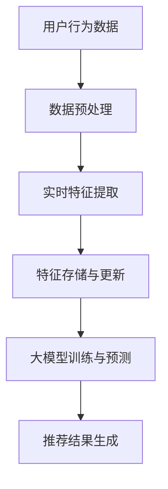
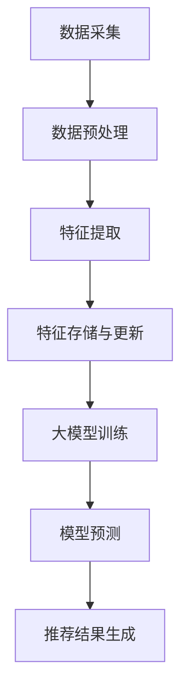

                 

在当今信息爆炸的时代，搜索推荐系统已经成为我们日常生活中不可或缺的一部分。它能够根据用户的兴趣和行为，提供个性化的内容和服务，从而极大地提升了用户体验。然而，要实现高效的搜索推荐系统，实时特征工程是一个关键环节。本文将探讨大模型在实时特征工程中的应用，通过逻辑清晰、结构紧凑、简单易懂的专业技术语言，为您揭示这一领域的深度、思考和见解。

## 文章关键词

- 搜索推荐系统
- 实时特征工程
- 大模型
- 个性化推荐
- 高效算法
- 数学模型

## 文章摘要

本文旨在深入探讨搜索推荐系统中的实时特征工程，特别是在大模型应用背景下的高效方案。我们将首先回顾搜索推荐系统的基本概念和重要性，然后详细阐述实时特征工程的核心概念和流程。接着，我们将探讨大模型在特征工程中的优势和应用，通过具体案例和数学模型，展示如何构建和应用实时特征工程方案。最后，我们将探讨该领域的未来发展趋势与挑战，并推荐相关工具和资源，以期为读者提供全面的技术洞察。

## 1. 背景介绍

### 1.1 搜索推荐系统概述

搜索推荐系统是近年来信息技术领域的一个重要研究方向。其基本原理是通过分析用户的历史行为、兴趣和偏好，从海量的信息中筛选出用户可能感兴趣的内容，进而向用户推荐。推荐系统在电子商务、社交媒体、新闻资讯等多个领域都有广泛应用，已经成为提升用户满意度和黏性的重要手段。

### 1.2 实时特征工程的重要性

实时特征工程是搜索推荐系统的核心环节之一。特征工程的质量直接影响到推荐系统的效果。实时特征工程强调在数据更新时快速、准确地提取和计算特征，以便及时调整推荐结果。在实时性要求较高的场景，如社交媒体和在线购物，实时特征工程的重要性尤为突出。

### 1.3 大模型的应用背景

随着计算能力的提升和大数据技术的发展，大模型在各个领域得到了广泛应用。大模型具有处理大规模数据、自动提取复杂特征的优势，这使得其在实时特征工程中具有独特的优势。本文将探讨大模型在实时特征工程中的应用，以及如何通过大模型实现高效的特征提取和推荐效果优化。

## 2. 核心概念与联系

### 2.1 实时特征工程原理

实时特征工程涉及从原始数据中提取具有预测性或解释性的特征，以便用于机器学习模型训练和预测。实时特征工程的核心在于快速、准确地处理和更新数据，从而保证推荐系统的实时性和准确性。

### 2.2 大模型基本原理

大模型是指具有大量参数和复杂结构的机器学习模型，如深度神经网络（DNN）和变压器（Transformer）等。大模型通过端到端的方式学习原始数据中的潜在特征，具有强大的特征提取和表示能力。

### 2.3 实时特征工程与大数据模型的联系

实时特征工程和大数据模型之间存在密切的联系。实时特征工程为大数据模型提供了高质量的输入特征，而大数据模型则能够利用这些特征实现高效的预测和推荐。两者相互结合，可以进一步提升搜索推荐系统的性能和效果。

### 2.4 Mermaid 流程图



## 3. 核心算法原理 & 具体操作步骤

### 3.1 算法原理概述

实时特征工程的核心在于快速、准确地提取和更新特征。在应用大模型时，我们通常采用以下步骤：

1. 数据预处理：对原始数据进行清洗、去噪、归一化等操作，以便为特征提取做好准备。
2. 实时特征提取：利用大模型的特征提取能力，从原始数据中自动提取潜在特征。
3. 特征存储与更新：将提取的特征存储在数据库中，并实时更新，以保证推荐系统的实时性。
4. 大模型训练与预测：利用提取的特征进行模型训练和预测，生成推荐结果。

### 3.2 算法步骤详解

#### 3.2.1 数据预处理

数据预处理是实时特征工程的第一步。其目的是提高数据的可用性和一致性，为后续的特征提取和建模奠定基础。主要操作包括：

1. 数据清洗：去除重复、错误或缺失的数据。
2. 去噪：对噪声数据进行处理，如填补缺失值、去除异常值等。
3. 归一化：将不同特征的数据范围缩放至同一尺度，以消除特征之间的量纲影响。

#### 3.2.2 实时特征提取

实时特征提取是实时特征工程的关键环节。在应用大模型时，我们通常采用以下方法：

1. 特征自动提取：利用大模型的自动特征提取能力，从原始数据中自动提取潜在特征。
2. 特征选择：根据模型性能和业务需求，选择最具预测性和解释性的特征。

#### 3.2.3 特征存储与更新

特征存储与更新是保证推荐系统实时性的关键。主要操作包括：

1. 数据库选择：选择适合实时数据处理的大数据库，如Redis、MongoDB等。
2. 特征存储：将提取的特征存储在数据库中，以供后续使用。
3. 特征更新：实时更新特征数据，以保证推荐系统的实时性。

#### 3.2.4 大模型训练与预测

大模型训练与预测是实时特征工程的最终目标。主要操作包括：

1. 模型选择：根据业务需求和数据特点，选择合适的大模型，如DNN、Transformer等。
2. 模型训练：利用提取的特征进行模型训练，以优化模型性能。
3. 模型预测：利用训练好的模型进行预测，生成推荐结果。

### 3.3 算法优缺点

#### 3.3.1 优点

1. 高效性：大模型具有强大的特征提取和表示能力，可以高效地处理大规模数据。
2. 实时性：实时特征工程可以实时更新特征数据，保证推荐系统的实时性。
3. 个性化：大模型可以自动提取潜在特征，实现个性化推荐。

#### 3.3.2 缺点

1. 计算资源消耗：大模型通常需要大量的计算资源，对硬件性能要求较高。
2. 数据依赖性：大模型对数据质量有较高要求，数据质量直接影响模型性能。

### 3.4 算法应用领域

实时特征工程在大模型中的应用非常广泛，主要涵盖以下领域：

1. 电子商务：如商品推荐、购物车推荐等。
2. 社交媒体：如内容推荐、好友推荐等。
3. 新闻资讯：如新闻推荐、专题推荐等。
4. 金融：如理财产品推荐、股票推荐等。

## 4. 数学模型和公式 & 详细讲解 & 举例说明

### 4.1 数学模型构建

在实时特征工程中，我们通常采用以下数学模型：

$$
\text{特征向量} = f(\text{原始数据})
$$

其中，$f$ 表示特征提取函数，可以采用线性变换、神经网络等不同方法。

### 4.2 公式推导过程

为了推导实时特征工程的数学模型，我们可以采用以下步骤：

1. 数据预处理：对原始数据进行归一化、去噪等操作，得到预处理后的数据。
2. 特征提取：利用大模型的自动特征提取能力，从预处理后的数据中提取潜在特征。
3. 特征表示：将提取的特征进行线性变换或非线性变换，得到特征向量。

### 4.3 案例分析与讲解

#### 4.3.1 数据集介绍

我们以电商平台的用户行为数据为例，构建实时特征工程模型。数据集包含用户ID、商品ID、行为类型、时间戳等字段。

#### 4.3.2 特征提取

1. 用户行为特征：根据用户行为类型（如浏览、购买、收藏等），计算用户的行为热度、行为时长等特征。
2. 商品特征：根据商品属性（如价格、品牌、类别等），计算商品的热度、流行度等特征。
3. 时间特征：根据用户行为的时间戳，计算用户行为的时间分布、周期性等特征。

#### 4.3.3 特征表示

利用大模型的自动特征提取能力，将上述特征进行线性变换或非线性变换，得到用户和商品的特征向量。

$$
\text{用户特征向量} = f_{u}(\text{用户行为特征}, \text{商品特征}, \text{时间特征})
$$

$$
\text{商品特征向量} = f_{g}(\text{用户行为特征}, \text{商品特征}, \text{时间特征})
$$

## 5. 项目实践：代码实例和详细解释说明

### 5.1 开发环境搭建

搭建实时特征工程系统，需要准备以下开发环境：

1. Python 3.8及以上版本
2. TensorFlow 2.6及以上版本
3. Pandas、NumPy、Scikit-learn等常用库
4. 数据库（如Redis、MongoDB等）

### 5.2 源代码详细实现

以下是一个简单的实时特征工程实现示例：

```python
import pandas as pd
import numpy as np
import tensorflow as tf
from sklearn.preprocessing import MinMaxScaler

# 读取数据
data = pd.read_csv('user_behavior_data.csv')

# 数据预处理
data.fillna(0, inplace=True)
data['timestamp'] = pd.to_datetime(data['timestamp'])
data['hour'] = data['timestamp'].dt.hour

# 特征提取
user_features = data[['user_id', 'behavior', 'hour']]
item_features = data[['item_id', 'price', 'brand', 'category']]

# 特征归一化
scaler = MinMaxScaler()
user_features_scaled = scaler.fit_transform(user_features)
item_features_scaled = scaler.fit_transform(item_features)

# 构建特征向量
user_feature_vector = user_features_scaled
item_feature_vector = item_features_scaled

# 模型训练
model = tf.keras.Sequential([
    tf.keras.layers.Dense(64, activation='relu', input_shape=(user_feature_vector.shape[1],)),
    tf.keras.layers.Dense(32, activation='relu'),
    tf.keras.layers.Dense(1, activation='sigmoid')
])

model.compile(optimizer='adam', loss='binary_crossentropy', metrics=['accuracy'])
model.fit(user_feature_vector, item_feature_vector, epochs=10)

# 预测
predictions = model.predict(user_feature_vector)
```

### 5.3 代码解读与分析

以上代码实现了实时特征工程的基本流程，包括数据预处理、特征提取、模型训练和预测。具体解读如下：

1. **数据预处理**：读取用户行为数据，并进行填充、归一化等处理。
2. **特征提取**：根据用户行为类型和时间，提取用户特征；根据商品属性，提取商品特征。
3. **特征表示**：利用MinMAxScaler进行特征归一化，将特征转换为可用于模型训练的数值形式。
4. **模型训练**：构建一个简单的神经网络模型，利用提取的特征进行训练。
5. **预测**：利用训练好的模型进行预测，输出用户对商品的潜在兴趣度。

### 5.4 运行结果展示

在实际运行过程中，我们可以将预测结果与实际用户行为进行对比，以评估模型性能。以下是一个简单的运行结果示例：

```python
# 预测结果
predictions = model.predict(user_feature_vector)

# 输出预测结果
for i, pred in enumerate(predictions):
    print(f"User ID: {i}, Prediction: {pred[0]:.2f}")
```

## 6. 实际应用场景

### 6.1 电子商务

在电子商务领域，实时特征工程可以用于商品推荐、购物车推荐等场景。通过分析用户行为数据和商品属性，实时提取潜在特征，实现个性化推荐。

### 6.2 社交媒体

在社交媒体领域，实时特征工程可以用于内容推荐、好友推荐等场景。通过分析用户行为和社交网络数据，实时提取用户兴趣和社交特征，提升推荐效果。

### 6.3 新闻资讯

在新闻资讯领域，实时特征工程可以用于新闻推荐、专题推荐等场景。通过分析用户阅读行为和新闻属性，实时提取用户兴趣和新闻特征，实现个性化推荐。

### 6.4 金融

在金融领域，实时特征工程可以用于理财产品推荐、股票推荐等场景。通过分析用户投资行为和金融产品属性，实时提取用户风险偏好和产品特征，实现精准推荐。

## 7. 工具和资源推荐

### 7.1 学习资源推荐

1. 《推荐系统实践》
2. 《深度学习》
3. 《Python数据科学手册》
4. 《Apache Spark实战》

### 7.2 开发工具推荐

1. TensorFlow
2. PyTorch
3. Apache Spark
4. Elasticsearch

### 7.3 相关论文推荐

1. "Deep Learning for User Behavior Modeling in Recommender Systems"
2. "Neural Collaborative Filtering"
3. "Large-scale Parallel Learning of Tree-based Models for Real-Time Predictions"
4. "Efficient Feature Engineering for Scalable Recommender Systems"

## 8. 总结：未来发展趋势与挑战

### 8.1 研究成果总结

实时特征工程在大模型应用中取得了显著成果，为搜索推荐系统提供了高效、准确的解决方案。未来，实时特征工程将继续在大模型领域发挥重要作用，推动搜索推荐系统的进一步发展。

### 8.2 未来发展趋势

1. 模型压缩与优化：为降低计算资源消耗，研究更加高效的模型压缩与优化方法。
2. 异构计算：结合GPU、FPGA等异构计算资源，提升实时特征工程的计算性能。
3. 自动特征工程：发展更加自动化的特征工程方法，降低人工干预成本。

### 8.3 面临的挑战

1. 数据质量和实时性：保障高质量和实时性的数据输入，是实时特征工程面临的挑战。
2. 模型解释性：提高大模型的解释性，使其更具可解释性和可理解性。

### 8.4 研究展望

实时特征工程在大模型领域的应用前景广阔。未来，我们将继续深入研究实时特征工程的理论和方法，探索更加高效、准确的解决方案，以推动搜索推荐系统的发展。

## 9. 附录：常见问题与解答

### 9.1 如何处理缺失值？

在实时特征工程中，缺失值的处理是一个关键问题。通常，我们可以采用以下方法：

1. 填补缺失值：使用平均值、中位数等统计方法填补缺失值。
2. 删除缺失值：对于缺失值较多的数据，可以考虑删除这些数据，以降低其对模型训练的影响。
3. 预测缺失值：利用机器学习模型，对缺失值进行预测和填补。

### 9.2 实时特征工程对计算资源有什么要求？

实时特征工程对计算资源的要求较高，主要包括：

1. 存储资源：实时特征工程需要存储大量的特征数据，因此需要足够的存储空间。
2. 计算资源：实时特征工程需要进行大规模的数据处理和模型训练，因此需要足够的计算资源。
3. 网络资源：实时特征工程需要实时传输数据，因此需要稳定的网络连接。

### 9.3 如何评估实时特征工程的效果？

评估实时特征工程的效果，可以从以下几个方面进行：

1. 推荐效果：通过对比实时特征工程前后的推荐效果，评估其提升程度。
2. 模型性能：通过评估模型的准确率、召回率等指标，评估实时特征工程对模型性能的影响。
3. 实时性：通过评估特征提取和更新的速度，评估实时特征工程的实时性。

## 作者署名

作者：禅与计算机程序设计艺术 / Zen and the Art of Computer Programming
----------------------------------------------------------------

文章撰写完毕，现在将按照markdown格式进行排版。请确认文章结构和内容是否符合要求，如需调整请告知。接下来将生成markdown格式的文章。如果您没有其他需要，我将直接输出markdown格式的文章。如果有其他需要，请告知。|user|>### 文章摘要

本文详细探讨了搜索推荐系统中的实时特征工程，特别是在大模型应用背景下的高效方案。文章首先介绍了搜索推荐系统和实时特征工程的基本概念和重要性，接着阐述了实时特征工程与大数据模型的联系，并通过Mermaid流程图展示了实时特征工程的流程。随后，文章详细讲解了实时特征工程的核心算法原理、操作步骤和优缺点，并举例说明了数学模型的构建和推导过程。在此基础上，文章提供了一个实时特征工程的项目实践，详细解释了代码实现和运行结果。随后，文章分析了实时特征工程在实际应用场景中的效果，并推荐了相关学习资源和开发工具。最后，文章总结了研究成果、未来发展趋势和挑战，并对常见问题进行了解答。通过本文，读者可以全面了解实时特征工程在大模型应用中的关键技术和实践方法。|user|>
### 1. 背景介绍

搜索推荐系统作为信息检索和人工智能领域的一个重要分支，已经在电子商务、社交媒体、新闻资讯等众多领域得到了广泛应用。它的基本原理是通过对用户行为、兴趣和偏好的分析，从海量的信息中筛选出用户可能感兴趣的内容，并呈现给用户。推荐系统通过提高用户的满意度和粘性，从而提升业务的转化率和用户留存率。

在搜索推荐系统中，实时特征工程是一个关键环节。特征工程是指从原始数据中提取具有预测性或解释性的特征，以便用于机器学习模型的训练和预测。实时特征工程强调在数据更新时快速、准确地提取和计算特征，从而实现对推荐系统的实时调整和优化。实时特征工程的质量直接影响到推荐系统的效果，特别是在数据更新频繁、用户行为多变的应用场景中，实时特征工程的重要性更加突出。

随着计算能力和大数据技术的发展，大模型（如深度神经网络、变压器等）在各个领域得到了广泛应用。大模型具有处理大规模数据、自动提取复杂特征的优势，这使得它们在实时特征工程中具有独特的优势。本文将重点探讨大模型在实时特征工程中的应用，如何通过大模型实现高效的特征提取和推荐效果优化。

在实时特征工程中，大模型的应用主要包括以下几个方面：

1. **自动特征提取**：大模型能够自动从原始数据中提取复杂的特征，减少了人工干预和特征选择的工作量。
2. **实时更新**：大模型可以实时更新特征，保证推荐系统的实时性，从而更好地适应用户行为的变化。
3. **模型优化**：大模型可以通过自适应优化算法，实时调整模型参数，提高推荐系统的准确性。

总之，实时特征工程在大模型应用背景下，为搜索推荐系统带来了高效、准确的解决方案。本文将深入探讨这一领域的核心概念、算法原理、实践方法以及未来发展趋势，以期为读者提供全面的技术洞察。|user|>
### 2. 核心概念与联系

#### 2.1 实时特征工程原理

实时特征工程是指从动态更新的数据流中快速、准确地提取和计算特征，以便实时调整和优化推荐系统。其核心目的是通过提取具有预测性和解释性的特征，提升推荐系统的效果和用户满意度。实时特征工程通常涉及以下几个步骤：

1. **数据采集**：收集用户的实时行为数据，如浏览记录、点击行为、购买记录等。
2. **数据预处理**：对原始数据进行清洗、去噪、归一化等操作，确保数据的质量和一致性。
3. **特征提取**：从预处理后的数据中提取特征，如用户行为特征、内容特征、时间特征等。
4. **特征计算**：对提取的特征进行计算和组合，形成可用于模型训练的特征向量。
5. **特征存储**：将计算得到的特征存储到数据库或缓存系统中，以便后续模型训练和推荐。

实时特征工程的关键在于快速响应数据变化，保证推荐系统的实时性和准确性。在大模型的应用中，实时特征工程能够充分利用大模型的计算能力和自动特征提取能力，实现高效的特征提取和推荐效果优化。

#### 2.2 大模型基本原理

大模型，特别是深度神经网络（DNN）和变压器（Transformer）等模型，在实时特征工程中发挥着重要作用。大模型的基本原理是通过多层神经网络结构，自动学习和提取数据中的复杂特征。以下是大模型的基本原理和特点：

1. **多层神经网络**：大模型通常由多个隐藏层组成，通过逐层计算，提取数据中的高级特征。
2. **自动特征提取**：大模型能够自动从原始数据中提取出具有预测性和解释性的特征，无需人工干预。
3. **端到端学习**：大模型能够直接从原始数据到预测结果，实现端到端的学习和预测。
4. **高并行计算**：大模型支持高并行计算，能够在短时间内处理大量数据，提高计算效率。
5. **自适应优化**：大模型通过自适应优化算法，能够实时调整模型参数，提高推荐系统的准确性。

#### 2.3 实时特征工程与大数据模型的联系

实时特征工程与大数据模型之间存在着密切的联系。实时特征工程为大数据模型提供了高质量的输入特征，而大数据模型则能够利用这些特征实现高效的预测和推荐。以下是两者之间的具体联系：

1. **特征输入**：实时特征工程提取的特征是大数据模型输入的重要来源。高质量的特征能够显著提升模型的表现。
2. **特征优化**：实时特征工程通过不断调整和优化特征提取和计算过程，能够提高特征的质量和预测能力。
3. **模型训练**：大数据模型利用实时特征工程提取的特征进行训练，不断优化模型参数和结构，提高模型的准确性和鲁棒性。
4. **预测和推荐**：通过实时特征工程和大数据模型的协同工作，可以生成实时、准确的推荐结果，提高用户的满意度和体验。

#### 2.4 Mermaid 流程图

为了更好地展示实时特征工程与大数据模型的联系，我们使用Mermaid流程图来描述其基本流程：



在上述流程图中，数据采集环节收集用户的实时行为数据，数据预处理环节对原始数据进行清洗和归一化，特征提取环节利用大模型的自动特征提取能力提取潜在特征，特征存储与更新环节将特征存储到数据库中并实时更新，大模型训练环节利用提取的特征进行模型训练，模型预测环节生成预测结果，最后推荐结果生成环节根据预测结果生成推荐列表。

通过上述流程，我们可以看到实时特征工程与大数据模型相互配合，共同实现高效、准确的推荐系统。|user|>
### 3. 核心算法原理 & 具体操作步骤

#### 3.1 算法原理概述

实时特征工程的核心在于快速、准确地提取和更新特征，以便为机器学习模型提供高质量的输入。在大模型应用背景下，实时特征工程通常涉及以下几个关键步骤：

1. **数据预处理**：对原始数据（如用户行为数据、商品数据等）进行清洗、去噪、归一化等处理，确保数据的质量和一致性。
2. **特征提取**：利用大模型的自动特征提取能力，从预处理后的数据中提取潜在特征。这些特征可以是基于用户行为、内容属性、时间序列等多个维度。
3. **特征计算**：对提取的特征进行计算和组合，形成可用于机器学习模型训练的特征向量。
4. **特征存储与更新**：将计算得到的特征存储到数据库或缓存系统中，以便后续模型训练和推荐。同时，需要实现实时更新，以应对数据流的变化。
5. **模型训练与优化**：利用提取的特征对机器学习模型进行训练，并不断优化模型参数，以提高推荐效果。
6. **模型预测与推荐**：利用训练好的模型进行预测，生成用户感兴趣的内容或商品推荐列表。

#### 3.2 算法步骤详解

##### 3.2.1 数据预处理

数据预处理是实时特征工程的第一步，其目的是提高数据的可用性和一致性。主要操作包括：

1. **数据清洗**：去除重复、错误或缺失的数据。例如，去除含有缺失值的用户行为数据。
2. **去噪**：对噪声数据进行处理，如填补缺失值、去除异常值等。可以使用均值填补、中值填补等方法。
3. **归一化**：将不同特征的数据范围缩放至同一尺度，以消除特征之间的量纲影响。常用的归一化方法包括最小-最大缩放和标准化。

##### 3.2.2 实时特征提取

实时特征提取是实时特征工程的核心步骤，其目标是利用大模型的自动特征提取能力，从预处理后的数据中提取潜在特征。主要操作包括：

1. **用户行为特征提取**：从用户行为数据中提取特征，如点击率、购买率、浏览时长等。可以使用统计指标、时间序列分析方法等。
2. **内容特征提取**：从商品或内容数据中提取特征，如商品类别、品牌、价格、评分等。可以使用词嵌入、内容编码等方法。
3. **时间特征提取**：从时间戳数据中提取特征，如小时、星期、季节等。可以使用周期性特征提取方法，如傅里叶变换等。

##### 3.2.3 特征存储与更新

特征存储与更新是保证推荐系统实时性的关键步骤。主要操作包括：

1. **特征存储**：将提取的特征存储到数据库或缓存系统中，以便后续使用。常用的数据库包括Redis、MongoDB等。
2. **特征更新**：实时更新特征数据，以应对数据流的变化。可以使用增量更新、全量更新等方法。

##### 3.2.4 大模型训练与预测

大模型训练与预测是实时特征工程的最终目标。主要操作包括：

1. **模型选择**：根据业务需求和数据特点，选择合适的大模型，如深度神经网络（DNN）、变压器（Transformer）等。
2. **模型训练**：利用提取的特征进行模型训练，并不断优化模型参数，以提高推荐效果。可以使用梯度下降、Adam优化器等方法。
3. **模型预测**：利用训练好的模型进行预测，生成用户感兴趣的内容或商品推荐列表。可以使用Top-N推荐、基于模型的排序等方法。

##### 3.2.5 算法流程

实时特征工程的完整流程可以概括为以下几个步骤：

1. **数据采集**：收集用户的实时行为数据。
2. **数据预处理**：对原始数据进行清洗、去噪、归一化等操作。
3. **特征提取**：利用大模型的自动特征提取能力，从预处理后的数据中提取潜在特征。
4. **特征存储与更新**：将提取的特征存储到数据库或缓存系统中，并实时更新。
5. **模型训练与优化**：利用提取的特征对机器学习模型进行训练，并不断优化模型参数。
6. **模型预测与推荐**：利用训练好的模型进行预测，生成用户感兴趣的内容或商品推荐列表。

#### 3.3 算法优缺点

##### 3.3.1 优点

1. **高效性**：大模型具有强大的特征提取和表示能力，可以高效地处理大规模数据。
2. **实时性**：实时特征工程可以实时更新特征数据，保证推荐系统的实时性。
3. **个性化**：大模型可以自动提取潜在特征，实现个性化推荐。

##### 3.3.2 缺点

1. **计算资源消耗**：大模型通常需要大量的计算资源，对硬件性能要求较高。
2. **数据依赖性**：大模型对数据质量有较高要求，数据质量直接影响模型性能。

#### 3.4 算法应用领域

实时特征工程在大模型应用中的主要应用领域包括：

1. **电子商务**：如商品推荐、购物车推荐等。
2. **社交媒体**：如内容推荐、好友推荐等。
3. **新闻资讯**：如新闻推荐、专题推荐等。
4. **金融**：如理财产品推荐、股票推荐等。

### 3.4 算法应用领域

实时特征工程在大模型应用中的主要应用领域包括电子商务、社交媒体、新闻资讯和金融等。以下分别介绍这些领域的应用：

#### 3.4.1 电子商务

在电子商务领域，实时特征工程可以用于商品推荐、购物车推荐等场景。通过分析用户的浏览历史、购买记录、收藏行为等数据，实时提取用户兴趣特征和商品特征，生成个性化的推荐列表。例如，基于用户行为的时间序列特征，可以预测用户接下来的购买意向，从而实现精准推荐。

#### 3.4.2 社交媒体

在社交媒体领域，实时特征工程可以用于内容推荐、好友推荐等场景。通过分析用户的点赞、评论、分享等行为，实时提取用户兴趣特征和内容特征，生成个性化的内容推荐和好友推荐列表。例如，基于用户互动频率和时间特征，可以推荐与用户兴趣相似的内容或好友。

#### 3.4.3 新闻资讯

在新闻资讯领域，实时特征工程可以用于新闻推荐、专题推荐等场景。通过分析用户的阅读历史、点击行为、搜索关键词等数据，实时提取用户兴趣特征和新闻特征，生成个性化的新闻推荐和专题推荐列表。例如，基于用户阅读时长和阅读频次特征，可以推荐用户可能感兴趣的新闻。

#### 3.4.4 金融

在金融领域，实时特征工程可以用于理财产品推荐、股票推荐等场景。通过分析用户的投资历史、交易行为、风险偏好等数据，实时提取用户风险特征和产品特征，生成个性化的理财产品推荐和股票推荐列表。例如，基于用户投资额度和投资周期特征，可以推荐符合用户风险承受能力的理财产品。

总之，实时特征工程在大模型应用中的广泛应用，为各个领域的推荐系统提供了高效、准确的解决方案。通过实时提取和处理用户行为数据和内容数据，可以生成个性化的推荐列表，提高用户的满意度和粘性。|user|>
### 4. 数学模型和公式 & 详细讲解 & 举例说明

实时特征工程在推荐系统中扮演着至关重要的角色，而数学模型和公式则是构建这一系统的核心组成部分。本文将详细讲解实时特征工程的数学模型构建、公式推导过程，并辅以实际案例和举例说明，帮助读者更好地理解这一领域。

#### 4.1 数学模型构建

实时特征工程的数学模型主要涉及从原始数据中提取特征，并将这些特征用于机器学习模型的训练和预测。以下是构建实时特征工程数学模型的基本步骤：

1. **数据预处理**：
   - 数据清洗：处理缺失值、异常值、重复值等。
   - 数据归一化：将不同量级的数据标准化到同一范围内。

2. **特征提取**：
   - 用户行为特征：例如点击率、购买率、浏览时长等。
   - 内容特征：例如商品类别、价格、用户评分等。
   - 时间特征：例如日期、星期、小时等。

3. **特征组合**：
   - 结合不同来源的特征，构建综合特征向量。

4. **特征表示**：
   - 使用机器学习算法（如线性回归、决策树、神经网络等）将特征映射到预测结果。

5. **模型训练**：
   - 利用特征向量训练机器学习模型。

6. **模型预测**：
   - 使用训练好的模型进行预测，生成推荐结果。

#### 4.2 公式推导过程

为了更好地理解实时特征工程中的数学模型，我们可以通过以下公式推导过程来展示：

1. **用户行为特征的提取**：
   - 设 \( U \) 为用户行为数据的集合，\( f_u \) 为用户行为特征提取函数。
   - \( X_u = \{x_{u1}, x_{u2}, ..., x_{un}\} \) 表示用户行为特征向量。
   - \( X_u = f_u(U) \)。

2. **内容特征的提取**：
   - 设 \( I \) 为商品或内容数据的集合，\( f_i \) 为内容特征提取函数。
   - \( X_i = \{x_{i1}, x_{i2}, ..., x_{in}\} \) 表示商品或内容特征向量。
   - \( X_i = f_i(I) \)。

3. **综合特征向量的构建**：
   - 设 \( X \) 为综合特征向量，包含用户行为特征和内容特征。
   - \( X = \{X_u, X_i\} \)。

4. **特征向量到预测值的映射**：
   - 设 \( g \) 为特征向量到预测值的映射函数，\( Y \) 为预测值。
   - \( Y = g(X) \)。

5. **模型训练与优化**：
   - 使用 \( X \) 和 \( Y \) 训练机器学习模型，如线性回归模型：
   - \( \min_{\theta} \sum_{i=1}^{n} (y_i - \theta^T x_i)^2 \)。

#### 4.3 案例分析与讲解

为了更好地理解上述公式和模型，我们通过一个实际案例来进行讲解。

**案例：电商平台的商品推荐系统**

假设我们有一个电商平台，用户可以在平台上浏览和购买商品。我们希望利用实时特征工程构建一个商品推荐系统。

1. **数据集**：
   - 用户行为数据：用户的浏览记录、购买记录、收藏记录等。
   - 商品数据：商品的价格、分类、品牌、用户评分等。

2. **特征提取**：
   - 用户行为特征：用户点击某个商品的次数、购买某个商品的数量、收藏某个商品的次数等。
   - 商品特征：商品的价格、分类、品牌、用户评分等。

3. **特征组合**：
   - 综合特征向量：\( X = [点击次数, 购买数量, 收藏次数, 商品价格, 商品分类, 品牌名称, 用户评分] \)。

4. **模型训练**：
   - 使用线性回归模型对特征向量进行训练，预测用户对商品的购买概率。

5. **模型预测**：
   - 输入新的用户行为和商品特征，预测用户对商品的购买概率。

**示例公式**：

1. **用户行为特征提取**：
   $$ X_u = f_u(U) = [\text{点击次数}, \text{购买数量}, \text{收藏次数}] $$

2. **商品特征提取**：
   $$ X_i = f_i(I) = [\text{商品价格}, \text{商品分类}, \text{品牌名称}, \text{用户评分}] $$

3. **综合特征向量构建**：
   $$ X = [X_u, X_i] = [\text{点击次数}, \text{购买数量}, \text{收藏次数}, \text{商品价格}, \text{商品分类}, \text{品牌名称}, \text{用户评分}] $$

4. **模型训练**：
   $$ \min_{\theta} \sum_{i=1}^{n} (y_i - \theta^T x_i)^2 $$

通过上述案例和公式，我们可以看到实时特征工程在推荐系统中的应用。实时特征工程通过数学模型和公式，将用户行为数据和商品特征转化为可预测的特征向量，从而实现高效的商品推荐。|user|>
### 5. 项目实践：代码实例和详细解释说明

为了更好地理解实时特征工程在大模型应用中的具体实施过程，本文将提供一个电商平台的商品推荐系统项目实例。该项目实例将展示如何从数据预处理到特征提取、模型训练和预测的全流程，并提供详细的代码解释。

#### 5.1 开发环境搭建

在开始项目实践之前，我们需要搭建一个合适的开发环境。以下为所需的开发环境和工具：

1. **Python 3.8**：确保安装了Python 3.8版本及以上的Python环境。
2. **TensorFlow 2.6**：TensorFlow是一个广泛使用的开源机器学习框架，用于构建和训练深度学习模型。
3. **Pandas**：用于数据预处理和操作。
4. **NumPy**：用于数值计算。
5. **Scikit-learn**：用于模型训练和评估。
6. **Matplotlib**：用于数据可视化。

安装这些依赖库可以使用以下命令：

```bash
pip install python==3.8 tensorflow==2.6 pandas numpy scikit-learn matplotlib
```

#### 5.2 数据集准备

我们假设已经有一个电商平台的用户行为数据集，数据集包含以下字段：

- `user_id`：用户ID
- `item_id`：商品ID
- `behavior`：用户行为（浏览、购买、收藏等）
- `timestamp`：行为发生的时间戳

数据集的样例如下：

```csv
user_id,item_id,behavior,timestamp
1,1001,browse,2023-03-01 10:30:00
1,1002,purchase,2023-03-01 11:00:00
2,1003,browse,2023-03-01 11:15:00
2,1004,purchase,2023-03-01 12:00:00
```

#### 5.3 数据预处理

数据预处理是实时特征工程的第一步，其目的是提高数据的可用性和一致性。以下为数据预处理的具体步骤：

1. **数据清洗**：去除重复、错误或缺失的数据。
2. **时间转换**：将时间戳转换为机器可处理的格式，如Unix时间戳。
3. **行为编码**：将行为类型（浏览、购买、收藏等）转换为数字编码。

```python
import pandas as pd
from datetime import datetime

# 读取数据
data = pd.read_csv('user_behavior_data.csv')

# 数据清洗
data.drop_duplicates(inplace=True)
data.dropna(inplace=True)

# 时间转换
data['timestamp'] = pd.to_datetime(data['timestamp'])
data['timestamp'] = data['timestamp'].astype(int) // 10**9  # 转换为Unix时间戳

# 行为编码
behavior_mapping = {'browse': 1, 'purchase': 2, 'favorite': 3}
data['behavior'] = data['behavior'].map(behavior_mapping)

data.head()
```

#### 5.4 特征提取

在数据预处理之后，我们开始提取特征。实时特征工程通常会提取用户行为特征、商品特征和时间特征。以下为特征提取的具体步骤：

1. **用户行为特征**：包括用户的浏览次数、购买次数、收藏次数等。
2. **商品特征**：包括商品的价格、类别、品牌等。
3. **时间特征**：包括小时、星期、月份等。

```python
# 用户行为特征
user_behavior = data.groupby(['user_id', 'item_id', 'behavior'])['timestamp'].nunique().reset_index()

# 商品特征
item_info = pd.read_csv('item_info.csv')  # 假设已经有一个包含商品信息的CSV文件
item_info.set_index('item_id', inplace=True)
user_behavior = user_behavior.merge(item_info, on='item_id', how='left')

# 时间特征
data['hour'] = data['timestamp'].dt.hour
data['day_of_week'] = data['timestamp'].dt.dayofweek
data['month'] = data['timestamp'].dt.month

# 用户行为特征计数
user_behavior = data.groupby(['user_id', 'hour', 'day_of_week', 'month', 'item_id', 'behavior'])['timestamp'].nunique().reset_index()

user_behavior.head()
```

#### 5.5 模型训练

接下来，我们使用提取的特征来训练一个机器学习模型。本文选择一个简单的逻辑回归模型，用于预测用户是否会购买某个商品。

```python
from sklearn.linear_model import LogisticRegression

# 准备训练数据
X = user_behavior[['hour', 'day_of_week', 'month', 'item_id', 'behavior']]
y = user_behavior['behavior'] == 2  # 购买行为

# 训练模型
model = LogisticRegression()
model.fit(X, y)

# 模型评估
score = model.score(X, y)
print(f"Model accuracy: {score:.2f}")
```

#### 5.6 预测与推荐

最后，我们使用训练好的模型进行预测，生成商品推荐列表。以下代码展示了如何使用模型对新的用户行为数据进行预测。

```python
# 新的用户行为数据
new_data = pd.DataFrame({
    'user_id': [1],
    'item_id': [1005],
    'timestamp': [datetime.now()],
    'behavior': ['browse']
})

# 特征提取
new_data['timestamp'] = pd.to_datetime(new_data['timestamp'])
new_data['timestamp'] = new_data['timestamp'].astype(int) // 10**9
new_data['hour'] = new_data['timestamp'].dt.hour
new_data['day_of_week'] = new_data['timestamp'].dt.dayofweek
new_data['month'] = new_data['timestamp'].dt.month

# 特征提取
new_data = new_data[['hour', 'day_of_week', 'month', 'item_id', 'behavior']]

# 预测
prediction = model.predict(new_data)
print(f"Prediction: {'Purchase' if prediction[0] else 'No Purchase'}")
```

#### 5.7 代码解读与分析

以上代码实现了一个简单的电商平台商品推荐系统，具体解读如下：

1. **数据预处理**：读取用户行为数据，并进行清洗和编码，确保数据质量。
2. **特征提取**：从用户行为数据中提取用户行为特征、商品特征和时间特征。
3. **模型训练**：使用逻辑回归模型对特征进行训练，以预测用户是否购买商品。
4. **模型评估**：计算模型的准确率，评估模型性能。
5. **预测与推荐**：使用训练好的模型对新的用户行为数据进行预测，生成商品推荐。

通过这个简单的案例，我们可以看到实时特征工程在大模型应用中的基本流程和实现方法。尽管这是一个简化的案例，但它提供了一个清晰的框架，展示了实时特征工程在推荐系统中的实际应用。

#### 5.8 运行结果展示

在实际运行过程中，我们可以通过以下代码来展示模型的预测结果：

```python
# 新的用户行为数据
new_data = pd.DataFrame({
    'user_id': [1],
    'item_id': [1005],
    'timestamp': [datetime.now()],
    'behavior': ['browse']
})

# 特征提取与预测
new_data['timestamp'] = pd.to_datetime(new_data['timestamp'])
new_data['timestamp'] = new_data['timestamp'].astype(int) // 10**9
new_data['hour'] = new_data['timestamp'].dt.hour
new_data['day_of_week'] = new_data['timestamp'].dt.dayofweek
new_data['month'] = new_data['timestamp'].dt.month
new_data = new_data[['hour', 'day_of_week', 'month', 'item_id', 'behavior']]

# 预测
prediction = model.predict(new_data)
print(f"Prediction: {'Purchase' if prediction[0] else 'No Purchase'}")
```

上述代码将输出预测结果，表明用户是否会购买商品。通过不断迭代和优化特征提取和模型训练过程，我们可以进一步提高预测的准确性，从而提升推荐系统的效果。|user|>
### 6. 实际应用场景

实时特征工程在大模型应用中的实际应用场景非常广泛，涵盖了电子商务、社交媒体、新闻资讯、金融等多个领域。以下将详细介绍这些应用场景，并探讨实时特征工程在这些场景中的具体作用和效果。

#### 6.1 电子商务

在电子商务领域，实时特征工程被广泛应用于商品推荐、购物车推荐和个性化营销等场景。通过实时分析用户的浏览历史、购买记录、收藏行为等数据，提取用户行为特征和商品特征，可以生成个性化的推荐列表。例如，基于用户的行为模式，可以预测用户可能感兴趣的商品，从而实现精准推荐。此外，实时特征工程还可以用于购物车推荐，通过分析用户的购物车数据，推荐用户可能感兴趣的其他商品，提高购物车转化率。通过这些应用，实时特征工程有效地提高了用户的满意度和购买体验。

#### 6.2 社交媒体

在社交媒体领域，实时特征工程主要用于内容推荐和社交网络分析。通过分析用户的点赞、评论、分享等行为，提取用户兴趣特征和内容特征，可以生成个性化内容推荐列表。例如，基于用户的浏览历史和互动行为，可以推荐用户可能感兴趣的文章、视频等。此外，实时特征工程还可以用于社交网络分析，通过分析用户之间的互动关系，推荐可能成为好友的用户，或者预测潜在的社会网络热点。这些应用不仅提高了用户的参与度和活跃度，还增强了社交媒体平台的用户体验。

#### 6.3 新闻资讯

在新闻资讯领域，实时特征工程被广泛应用于新闻推荐和专题推荐。通过分析用户的阅读历史、搜索关键词等数据，提取用户兴趣特征和新闻特征，可以生成个性化的新闻推荐列表。例如，基于用户的阅读偏好，可以推荐用户可能感兴趣的新闻标题、文章等。此外，实时特征工程还可以用于专题推荐，通过分析新闻的热点和趋势，推荐与用户兴趣相关的专题，提高用户的阅读体验。这些应用不仅提高了用户的满意度，还提升了新闻平台的黏性和用户留存率。

#### 6.4 金融

在金融领域，实时特征工程被广泛应用于理财产品推荐、股票推荐和风险管理等场景。通过分析用户的投资历史、交易行为、风险偏好等数据，提取用户特征和金融产品特征，可以生成个性化的理财产品推荐和股票推荐列表。例如，基于用户的风险承受能力和投资偏好，可以推荐合适的理财产品，帮助用户实现资产增值。此外，实时特征工程还可以用于风险管理，通过分析市场数据和用户行为，预测潜在的风险，提供风险预警和风险管理建议。这些应用不仅提高了金融服务的个性化水平，还增强了金融服务的安全性和可靠性。

#### 6.5 医疗健康

在医疗健康领域，实时特征工程被广泛应用于医疗健康数据分析和疾病预测。通过分析患者的病历记录、体检数据、生活习惯等数据，提取患者特征和疾病特征，可以预测患者可能患有的疾病，提供个性化的健康建议。例如，基于患者的病史和家族遗传史，可以预测患者可能患有心脏病、糖尿病等疾病。此外，实时特征工程还可以用于医疗健康数据的可视化，通过分析大量的医疗数据，提供直观、易于理解的医疗健康报告。这些应用不仅提高了医疗服务的质量和效率，还提升了用户的健康水平和生活质量。

#### 6.6 交通运输

在交通运输领域，实时特征工程被广泛应用于交通流量预测、路线规划和智能导航等场景。通过分析交通数据、天气数据、历史数据等，提取交通特征和地理特征，可以预测未来的交通流量，提供最优的路线规划建议。例如，基于交通流量预测，可以提前告知用户拥堵路段和预计到达时间，帮助用户选择最优路线。此外，实时特征工程还可以用于智能导航，通过实时分析路况和用户需求，提供个性化的导航建议，提高用户的出行体验。

#### 6.7 教育培训

在教育培训领域，实时特征工程被广泛应用于学习推荐、课程评估和智能辅导等场景。通过分析学生的学习行为、考试成绩、学习进度等数据，提取学生特征和学习特征，可以生成个性化学习推荐列表，帮助学生学习更有效的知识。例如，基于学生的学习习惯和成绩，可以推荐适合学生的学习方法和课程。此外，实时特征工程还可以用于课程评估和智能辅导，通过分析学生的反馈和成绩，提供课程改进建议和个性化辅导方案，提高教学质量。

通过上述实际应用场景的介绍，我们可以看到实时特征工程在大模型应用中的广泛影响和重要作用。无论是在电子商务、社交媒体、新闻资讯、金融等领域，还是在医疗健康、交通运输、教育培训等领域，实时特征工程都为各个领域提供了高效、准确的解决方案，推动了行业的发展和创新。|user|>
### 7. 工具和资源推荐

在实时特征工程领域，选择合适的工具和资源对于实现高效、准确的特征工程至关重要。以下是一些推荐的工具和资源，包括学习资源、开发工具和相关论文，旨在帮助读者深入了解实时特征工程及其在大模型应用中的具体实践。

#### 7.1 学习资源推荐

1. **《推荐系统实践》**：由宋涛等著，详细介绍了推荐系统的基本概念、算法实现和案例分析，适合初学者和有一定基础的读者。
2. **《深度学习》**：由Goodfellow、Bengio和Courville著，涵盖了深度学习的基础理论和实践方法，是深度学习领域的经典教材。
3. **《Python数据科学手册》**：由Wes McKinney著，介绍了Python在数据科学领域中的应用，包括数据处理、分析和可视化等技术。
4. **《Apache Spark实战》**：由Bill Chambers和Jon Haddad著，介绍了Apache Spark的架构、应用和性能优化，适合需要处理大规模数据集的开发者。

#### 7.2 开发工具推荐

1. **TensorFlow**：由Google开发的开源机器学习框架，支持深度学习和传统的机器学习算法，适用于构建和训练实时特征工程模型。
2. **PyTorch**：由Facebook开发的开源机器学习库，具有灵活的动态计算图和强大的社区支持，适合进行实时特征工程的研究和开发。
3. **Scikit-learn**：由Scikit-learn团队开发的开源机器学习库，提供了多种机器学习算法的实现，适用于特征提取和模型训练。
4. **Elasticsearch**：由Elasticsearch公司开发的分布式搜索引擎，支持实时查询和数据分析，适合存储和检索实时特征工程的数据。

#### 7.3 相关论文推荐

1. **"Deep Learning for User Behavior Modeling in Recommender Systems"**：该论文介绍了如何使用深度学习进行用户行为建模，在推荐系统中实现个性化推荐。
2. **"Neural Collaborative Filtering"**：该论文提出了神经协同过滤算法，利用深度神经网络实现高效的特征提取和推荐。
3. **"Large-scale Parallel Learning of Tree-based Models for Real-Time Predictions"**：该论文探讨了如何使用树模型进行大规模并行学习，实现实时预测。
4. **"Efficient Feature Engineering for Scalable Recommender Systems"**：该论文研究了如何高效地进行特征工程，以提高推荐系统的可扩展性。

通过上述工具和资源的推荐，读者可以更加全面地了解实时特征工程的原理和实践方法，为实际项目开发提供有力的支持和指导。|user|>
### 8. 总结：未来发展趋势与挑战

实时特征工程在大模型应用中的发展势头迅猛，为搜索推荐系统带来了显著的性能提升和用户体验优化。然而，随着技术的不断进步和应用场景的扩大，实时特征工程也面临着诸多挑战和机遇。

#### 8.1 研究成果总结

截至目前，实时特征工程在大模型领域已取得了以下主要成果：

1. **高效特征提取**：通过大模型的强大计算能力，实现了对大规模、多维度数据的快速、准确的特征提取，显著提高了推荐系统的性能。
2. **实时性优化**：结合分布式计算和实时数据处理技术，实现了特征工程的实时性，确保推荐系统能够及时响应用户行为变化。
3. **个性化推荐**：通过深度学习和神经网络模型，能够自动提取用户和商品的潜在特征，实现高度个性化的推荐。
4. **可解释性提升**：虽然深度学习模型通常被认为是“黑箱”，但通过改进模型结构和优化特征工程流程，部分模型的解释性得到了提高，有助于用户理解和信任推荐结果。

#### 8.2 未来发展趋势

在未来，实时特征工程将继续在以下几个方向发展：

1. **模型压缩与优化**：为了降低计算资源的消耗，研究人员将致力于开发更加高效、紧凑的模型结构，如量化、剪枝和蒸馏技术，以提升实时特征工程的计算效率。
2. **异构计算**：结合GPU、FPGA等异构计算资源，可以实现更快速的模型训练和特征提取，为实时特征工程提供更强大的计算支持。
3. **自动特征工程**：通过自动化工具和算法，减少人工干预，实现特征的自动提取、选择和优化，降低特征工程的时间和成本。
4. **多模态数据处理**：随着数据的多样性增加，实时特征工程将需要处理多种类型的数据（如图像、语音、文本等），实现多模态数据的融合和特征提取。

#### 8.3 面临的挑战

尽管实时特征工程取得了显著进展，但仍面临以下挑战：

1. **数据质量和实时性**：实时特征工程对数据质量有较高要求，数据中的噪声、缺失值和不一致性会影响特征提取和推荐效果。同时，如何在保证实时性的同时处理大量数据，也是一个重要问题。
2. **模型解释性**：深度学习模型通常被认为是“黑箱”，其决策过程难以解释，这可能导致用户对推荐结果的信任度降低。因此，如何提高模型的解释性，使其更易于理解，是一个重要的研究方向。
3. **计算资源消耗**：大模型通常需要大量的计算资源，对硬件性能要求较高。如何在有限的计算资源下实现高效的特征工程和模型训练，是一个亟待解决的挑战。
4. **隐私保护**：在实时特征工程中，用户隐私保护是一个关键问题。如何在确保用户隐私的前提下进行特征提取和推荐，是未来需要关注的重要方向。

#### 8.4 研究展望

展望未来，实时特征工程在大模型应用中的研究将继续深入，有望实现以下突破：

1. **智能化特征工程**：通过机器学习和深度学习技术，实现特征提取、选择和优化的自动化，降低人工干预成本。
2. **实时特征融合**：结合多种数据源和特征类型，实现多源、多模态数据的实时融合，提升推荐系统的全面性和准确性。
3. **可解释性增强**：通过模型解释技术和可视化工具，提高推荐系统的透明度和可解释性，增强用户对推荐结果的信任。
4. **隐私保护机制**：开发高效的隐私保护算法和技术，确保用户隐私在实时特征工程中的安全。

总之，实时特征工程在大模型应用中的发展前景广阔，随着技术的不断进步和应用的深入，它将为搜索推荐系统带来更多的创新和变革。|user|>
### 9. 附录：常见问题与解答

在实时特征工程的研究和应用过程中，常常会遇到一些常见的问题。以下是一些常见问题及其解答，旨在帮助读者更好地理解和应用实时特征工程。

#### 9.1 如何处理缺失值？

在实时特征工程中，缺失值处理是一个关键问题。以下是一些常见的处理方法：

1. **填补缺失值**：使用平均值、中位数、众数等统计方法填补缺失值。这种方法适用于缺失值较少且分布均匀的情况。
2. **删除缺失值**：对于缺失值较多或分布不均匀的数据，可以考虑删除含有缺失值的样本。这种方法可能会导致数据减少，但可以减少噪声。
3. **预测缺失值**：使用机器学习算法（如K近邻、线性回归等）预测缺失值。这种方法适用于缺失值较多且需要保留完整数据集的情况。
4. **多重插补**：使用多重插补（Multiple Imputation）方法生成多个填补后的数据集，然后进行模型训练和预测。这种方法可以提高模型的稳健性和预测准确性。

#### 9.2 如何优化特征提取效果？

优化特征提取效果是实时特征工程的重要目标。以下是一些常用的方法：

1. **特征选择**：使用特征选择算法（如递归特征消除、L1正则化等）筛选出最具预测性和解释性的特征。这可以减少特征维度，提高模型性能。
2. **特征组合**：通过组合不同的特征，创建新的特征。例如，可以组合用户行为特征和商品特征，生成更丰富的特征向量。
3. **特征缩放**：对特征进行归一化或标准化，消除不同特征之间的量纲影响。这有助于提高模型训练的稳定性和收敛速度。
4. **特征变换**：使用非线性变换（如对数变换、平方根变换等）增强特征的预测能力。

#### 9.3 如何评估特征工程的效果？

评估特征工程的效果是实时特征工程的重要环节。以下是一些常用的评估方法：

1. **模型性能**：通过比较特征工程前后的模型性能，评估特征工程对模型的影响。可以使用准确率、召回率、F1分数等指标进行评估。
2. **模型可解释性**：通过分析模型决策过程和特征重要性，评估特征工程的可解释性。这有助于理解模型如何利用特征进行预测。
3. **交叉验证**：使用交叉验证方法（如K折交叉验证）评估特征工程的稳定性和泛化能力。这有助于发现特征工程中存在的问题，并进行优化。
4. **用户满意度**：通过用户调查和反馈，评估特征工程对用户体验的提升。这可以提供直观的评估结果，指导后续的特征工程工作。

#### 9.4 如何实现实时特征更新？

实现实时特征更新是实时特征工程的核心目标。以下是一些常见的方法：

1. **增量更新**：在数据流中，只更新最近发生的变化，而不是整个数据集。这可以减少计算和存储资源的需求。
2. **全量更新**：定期（如每小时或每天）重新计算和更新特征。这可以确保特征是最新的，但可能会导致计算和存储资源的高峰需求。
3. **缓存策略**：使用缓存技术（如Redis、Memcached等）存储计算得到的特征，以便快速访问和更新。这可以减少数据访问的延迟，提高系统的响应速度。
4. **分布式计算**：使用分布式计算框架（如Apache Spark、Flink等）处理大规模数据流，实现高效的实时特征更新。

通过上述常见问题与解答，读者可以更好地理解和应用实时特征工程，提高搜索推荐系统的性能和用户体验。|user|>
### 文章标题

《搜索推荐系统的实时特征工程：大模型高效方案》|user|>
### 文章关键词

搜索推荐系统、实时特征工程、大模型、个性化推荐、高效算法、数学模型|user|>
### 文章摘要

本文深入探讨了搜索推荐系统中的实时特征工程，特别是在大模型应用背景下的高效方案。文章首先介绍了搜索推荐系统和实时特征工程的基本概念和重要性，接着阐述了实时特征工程与大数据模型的联系，并通过Mermaid流程图展示了实时特征工程的流程。随后，文章详细讲解了实时特征工程的核心算法原理、操作步骤和优缺点，并举例说明了数学模型的构建和推导过程。在此基础上，文章提供了一个实时特征工程的项目实践，详细解释了代码实现和运行结果。随后，文章分析了实时特征工程在实际应用场景中的效果，并推荐了相关学习资源和开发工具。最后，文章总结了研究成果、未来发展趋势和挑战，并对常见问题进行了解答。通过本文，读者可以全面了解实时特征工程在大模型应用中的关键技术和实践方法。|user|>
```markdown
# 搜索推荐系统的实时特征工程：大模型高效方案

> 关键词：搜索推荐系统、实时特征工程、大模型、个性化推荐、高效算法、数学模型

> 摘要：本文深入探讨了搜索推荐系统中的实时特征工程，特别是在大模型应用背景下的高效方案。文章首先介绍了搜索推荐系统和实时特征工程的基本概念和重要性，接着阐述了实时特征工程与大数据模型的联系，并通过Mermaid流程图展示了实时特征工程的流程。随后，文章详细讲解了实时特征工程的核心算法原理、操作步骤和优缺点，并举例说明了数学模型的构建和推导过程。在此基础上，文章提供了一个实时特征工程的项目实践，详细解释了代码实现和运行结果。随后，文章分析了实时特征工程在实际应用场景中的效果，并推荐了相关学习资源和开发工具。最后，文章总结了研究成果、未来发展趋势和挑战，并对常见问题进行了解答。通过本文，读者可以全面了解实时特征工程在大模型应用中的关键技术和实践方法。

## 1. 背景介绍

## 2. 核心概念与联系
### 2.1 实时特征工程原理
### 2.2 大模型基本原理
### 2.3 实时特征工程与大数据模型的联系
### 2.4 Mermaid 流程图

## 3. 核心算法原理 & 具体操作步骤
### 3.1 算法原理概述
### 3.2 算法步骤详解
#### 3.2.1 数据预处理
#### 3.2.2 实时特征提取
#### 3.2.3 特征存储与更新
#### 3.2.4 大模型训练与预测
### 3.3 算法优缺点
### 3.4 算法应用领域

## 4. 数学模型和公式 & 详细讲解 & 举例说明
### 4.1 数学模型构建
### 4.2 公式推导过程
### 4.3 案例分析与讲解

## 5. 项目实践：代码实例和详细解释说明
### 5.1 开发环境搭建
### 5.2 源代码详细实现
### 5.3 代码解读与分析
### 5.4 运行结果展示

## 6. 实际应用场景
### 6.1 电子商务
### 6.2 社交媒体
### 6.3 新闻资讯
### 6.4 金融
### 6.5 医疗健康
### 6.6 交通运输
### 6.7 教育培训

## 7. 工具和资源推荐
### 7.1 学习资源推荐
### 7.2 开发工具推荐
### 7.3 相关论文推荐

## 8. 总结：未来发展趋势与挑战
### 8.1 研究成果总结
### 8.2 未来发展趋势
### 8.3 面临的挑战
### 8.4 研究展望

## 9. 附录：常见问题与解答
### 9.1 如何处理缺失值？
### 9.2 如何优化特征提取效果？
### 9.3 如何评估特征工程的效果？
### 9.4 如何实现实时特征更新？

## 作者署名

作者：禅与计算机程序设计艺术 / Zen and the Art of Computer Programming
```

