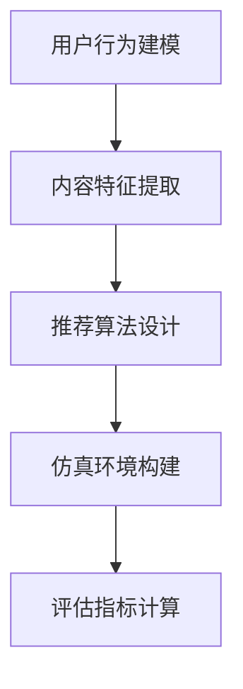

                 

在当今信息爆炸的时代，搜索推荐系统已经成为互联网服务中不可或缺的一部分。无论是电子商务平台，社交媒体，还是新闻媒体，推荐系统都在帮助我们更高效地获取信息、发现兴趣，甚至优化决策过程。然而，随着数据规模和复杂性的不断增加，如何准确评估推荐系统的性能和效果，成为了一个亟待解决的问题。本文将重点讨论搜索推荐系统的离线评估方法，特别是如何构建一个高效的大模型仿真环境。

> **关键词**：搜索推荐系统、离线评估、仿真环境、大模型、性能优化

> **摘要**：本文首先介绍了搜索推荐系统离线评估的背景和重要性。然后，详细探讨了构建大模型仿真环境所需的核心概念和方法，包括数据准备、模型训练、评估指标设计等。通过一个实际的项目实例，我们展示了如何将理论转化为实践，并分析了在构建仿真环境过程中可能遇到的问题和挑战。

## 1. 背景介绍

搜索推荐系统是一种基于用户历史行为和内容特征，对用户可能感兴趣的信息进行预测和推荐的系统。在过去的几十年里，随着互联网技术的快速发展，搜索推荐系统得到了广泛的应用，并且取得了显著的成果。例如，YouTube 利用推荐系统帮助用户发现新的视频内容，Amazon 利用推荐系统为用户推荐相关的商品，Facebook 利用推荐系统为用户推荐朋友和活动。

然而，随着数据规模和复杂性的增加，传统的评估方法已经无法满足搜索推荐系统的需求。首先，由于数据量的庞大，传统的评估方法往往需要大量计算资源和时间，效率较低。其次，推荐系统的目标不仅仅是提高准确率，还需要考虑用户体验、多样性、公平性等多个方面。因此，如何设计一个高效、全面的评估方法，成为当前研究的热点问题。

离线评估是一种常用的评估方法，它通过模拟用户行为和历史数据，对推荐系统的性能进行评估。离线评估的优点在于，它可以在不受实时流量影响的情况下，对推荐系统的各个方面进行全面的评估。同时，离线评估的结果可以用于指导系统的优化和改进。

构建一个高效的大模型仿真环境是实现离线评估的关键。仿真环境需要模拟真实场景，包括用户行为、内容特征、推荐算法等多个方面。一个高效的大模型仿真环境不仅可以提高评估的准确性，还可以为系统优化提供重要的参考。

## 2. 核心概念与联系

在构建大模型仿真环境的过程中，需要理解几个核心概念，包括用户行为建模、内容特征提取、推荐算法设计等。以下是一个简单的 Mermaid 流程图，用于描述这些概念之间的关系：



### 2.1 用户行为建模

用户行为建模是搜索推荐系统的核心，它旨在捕捉用户在不同场景下的行为特征。用户行为建模可以分为两个阶段：数据收集和特征提取。

- **数据收集**：通过日志文件、点击流数据等方式收集用户的历史行为数据。
- **特征提取**：将原始数据转化为特征向量，用于后续的推荐算法。

用户行为特征可以包括用户的基本信息（如年龄、性别、地理位置）、浏览历史、购买记录、评分行为等。

### 2.2 内容特征提取

内容特征提取是将用户感兴趣的内容转化为数字特征的过程。内容特征可以包括文本、图像、视频等多媒体数据的特征。

- **文本特征**：包括词频、词向量、主题模型等。
- **图像特征**：包括颜色直方图、纹理特征、对象检测等。
- **视频特征**：包括帧特征、视频剪辑特征等。

### 2.3 推荐算法设计

推荐算法设计是搜索推荐系统的核心，它旨在根据用户行为和内容特征，为用户推荐感兴趣的信息。常见的推荐算法包括基于内容的推荐、协同过滤推荐、混合推荐等。

- **基于内容的推荐**：根据用户的历史行为和内容特征，为用户推荐相似的内容。
- **协同过滤推荐**：根据用户的历史行为，利用协同过滤技术为用户推荐感兴趣的内容。
- **混合推荐**：结合多种推荐算法，以提高推荐的准确性和多样性。

### 2.4 仿真环境构建

仿真环境构建是将上述用户行为建模、内容特征提取和推荐算法设计整合起来，模拟真实场景的过程。

- **数据预处理**：对用户行为数据和内容数据进行清洗、预处理，以提高数据质量。
- **模型训练**：利用预处理后的数据训练推荐模型，包括用户行为预测模型、内容特征提取模型等。
- **仿真运行**：模拟用户行为，生成推荐结果，并进行评估。

### 2.5 评估指标计算

评估指标计算是对仿真环境生成的推荐结果进行评估的过程。常见的评估指标包括准确率、召回率、覆盖率、新颖度等。

- **准确率**：预测结果与实际结果的匹配程度。
- **召回率**：能够召回实际感兴趣内容的比例。
- **覆盖率**：能够覆盖到所有用户兴趣内容的比例。
- **新颖度**：推荐内容的新颖程度。

## 3. 核心算法原理 & 具体操作步骤

### 3.1 算法原理概述

在构建大模型仿真环境的过程中，常用的算法包括基于内容的推荐算法、协同过滤推荐算法和混合推荐算法。

- **基于内容的推荐算法**：根据用户的历史行为和内容特征，为用户推荐相似的内容。核心是内容特征提取和相似度计算。
- **协同过滤推荐算法**：根据用户的历史行为，利用协同过滤技术为用户推荐感兴趣的内容。核心是用户行为建模和相似度计算。
- **混合推荐算法**：结合多种推荐算法，以提高推荐的准确性和多样性。核心是算法融合和优化。

### 3.2 算法步骤详解

#### 基于内容的推荐算法

1. **数据预处理**：对用户行为数据和内容数据进行清洗、预处理。
2. **内容特征提取**：利用词向量、主题模型等方法提取内容特征。
3. **用户特征提取**：利用用户行为数据提取用户特征。
4. **相似度计算**：计算用户特征和内容特征之间的相似度。
5. **推荐生成**：根据相似度排序生成推荐列表。

#### 协同过滤推荐算法

1. **用户行为建模**：利用用户行为数据构建用户行为模型。
2. **内容特征提取**：利用内容数据构建内容特征模型。
3. **相似度计算**：计算用户之间的相似度和内容之间的相似度。
4. **推荐生成**：根据用户相似度和内容相似度生成推荐列表。

#### 混合推荐算法

1. **用户行为建模**：结合基于内容的推荐和协同过滤推荐，构建用户行为模型。
2. **内容特征提取**：结合多种特征提取方法，构建内容特征模型。
3. **相似度计算**：计算用户和内容之间的多维度相似度。
4. **推荐生成**：根据多维度相似度生成推荐列表。

### 3.3 算法优缺点

#### 基于内容的推荐算法

**优点**：
- 算法简单，易于实现。
- 能够推荐高质量的内容，用户体验较好。

**缺点**：
- 需要大量的内容特征，数据预处理复杂。
- 在处理稀疏数据集时效果较差。

#### 协同过滤推荐算法

**优点**：
- 能够处理稀疏数据集，推荐效果较好。
- 能够捕捉用户之间的相似性。

**缺点**：
- 数据预处理复杂，算法计算复杂度较高。
- 需要大量的用户行为数据。

#### 混合推荐算法

**优点**：
- 结合了基于内容和协同过滤推荐的优势，推荐效果较好。
- 能够处理多种类型的推荐需求。

**缺点**：
- 算法复杂，需要大量的计算资源。

### 3.4 算法应用领域

#### 基于内容的推荐算法

- 电子商务平台：为用户推荐相关的商品。
- 新闻媒体：为用户推荐相关的新闻。
- 社交媒体：为用户推荐感兴趣的内容。

#### 协同过滤推荐算法

- 电子商务平台：为用户推荐相关的商品。
- 社交媒体：为用户推荐感兴趣的内容。
- 视频平台：为用户推荐相关的视频。

#### 混合推荐算法

- 电子商务平台：结合基于内容和协同过滤推荐，为用户推荐相关的商品。
- 新闻媒体：结合基于内容和协同过滤推荐，为用户推荐相关的新闻。
- 社交媒体：结合基于内容和协同过滤推荐，为用户推荐感兴趣的内容。

## 4. 数学模型和公式 & 详细讲解 & 举例说明

### 4.1 数学模型构建

在构建大模型仿真环境的过程中，数学模型是核心。以下是一个简单的数学模型构建过程：

#### 4.1.1 用户行为建模

假设用户 $u$ 在某一时刻 $t$ 对内容 $i$ 发生了行为 $r$，其中 $r$ 可以是浏览、购买、评分等。用户行为建模可以使用以下公式：

$$
r(u,t,i) = \sigma (\theta_u + \theta_i + \theta_{ui})
$$

其中，$\sigma$ 表示激活函数，$\theta_u$、$\theta_i$ 和 $\theta_{ui}$ 分别是用户 $u$、内容 $i$ 和用户-内容对 $(u,i)$ 的参数。

#### 4.1.2 内容特征提取

假设内容 $i$ 的特征向量表示为 $v_i$，其中每个维度表示某一特征。内容特征提取可以使用以下公式：

$$
v_i = \sum_{j=1}^{n} w_j f_j(i)
$$

其中，$w_j$ 是权重，$f_j(i)$ 是特征函数，$n$ 是特征维度。

#### 4.1.3 推荐算法

假设基于内容的推荐算法，用户 $u$ 对内容 $i$ 的推荐分数表示为 $s(u,i)$，可以使用以下公式：

$$
s(u,i) = \cos(\theta_u, v_i)
$$

其中，$\cos$ 是余弦相似度，$\theta_u$ 是用户 $u$ 的特征向量。

### 4.2 公式推导过程

#### 4.2.1 用户行为建模推导

用户行为建模的推导基于以下假设：

- 用户 $u$ 在某一时刻 $t$ 对内容 $i$ 的行为 $r$ 是由用户特征 $\theta_u$、内容特征 $v_i$ 和用户-内容对特征 $\theta_{ui}$ 共同决定的。
- 激活函数 $\sigma$ 用于将输入映射到输出。

基于这些假设，我们可以推导出用户行为建模的公式：

$$
r(u,t,i) = \sigma (\theta_u + \theta_i + \theta_{ui})
$$

#### 4.2.2 内容特征提取推导

内容特征提取的推导基于以下假设：

- 内容 $i$ 的特征向量 $v_i$ 是由多个特征函数 $f_j(i)$ 组成的。
- 每个特征函数 $f_j(i)$ 对应一个特征维度，权重 $w_j$ 用于调整特征的重要性。

基于这些假设，我们可以推导出内容特征提取的公式：

$$
v_i = \sum_{j=1}^{n} w_j f_j(i)
$$

#### 4.2.3 推荐算法推导

推荐算法的推导基于以下假设：

- 用户 $u$ 对内容 $i$ 的推荐分数 $s(u,i)$ 是由用户特征向量 $\theta_u$ 和内容特征向量 $v_i$ 的相似度决定的。
- 余弦相似度用于计算两个向量的相似度。

基于这些假设，我们可以推导出推荐算法的公式：

$$
s(u,i) = \cos(\theta_u, v_i)
$$

### 4.3 案例分析与讲解

为了更好地理解上述公式，我们来看一个简单的案例。

#### 4.3.1 用户行为建模案例

假设用户 $u$ 在某一时刻 $t$ 对内容 $i$ 发生了浏览行为，用户特征向量 $\theta_u = (1, 0, -1)$，内容特征向量 $v_i = (1, 1, 1)$，用户-内容对特征向量 $\theta_{ui} = (0, 1, 0)$。

根据用户行为建模公式，我们可以计算出用户行为 $r(u,t,i)$：

$$
r(u,t,i) = \sigma (\theta_u + \theta_i + \theta_{ui}) = \sigma (1 + 1 + 0) = \sigma (2) = 1
$$

这表示用户 $u$ 在某一时刻 $t$ 对内容 $i$ 的浏览行为概率为 1，即用户 $u$ 在某一时刻 $t$ 对内容 $i$ 发生了浏览行为。

#### 4.3.2 内容特征提取案例

假设内容 $i$ 的特征向量 $v_i = (1, 1, 1)$，特征函数 $f_1(i) = 1$，$f_2(i) = 1$，$f_3(i) = 1$，权重 $w_1 = 0.5$，$w_2 = 0.5$。

根据内容特征提取公式，我们可以计算出内容特征向量 $v_i$：

$$
v_i = \sum_{j=1}^{n} w_j f_j(i) = 0.5 \cdot 1 + 0.5 \cdot 1 = 1
$$

这表示内容 $i$ 的特征向量为 $(1, 1, 1)$。

#### 4.3.3 推荐算法案例

假设用户 $u$ 的特征向量 $\theta_u = (1, 0, -1)$，内容特征向量 $v_i = (1, 1, 1)$。

根据推荐算法公式，我们可以计算出用户 $u$ 对内容 $i$ 的推荐分数 $s(u,i)$：

$$
s(u,i) = \cos(\theta_u, v_i) = \frac{\theta_u \cdot v_i}{\|\theta_u\| \cdot \|v_i\|} = \frac{1 \cdot 1 + 0 \cdot 1 + (-1) \cdot 1}{\sqrt{1^2 + 0^2 + (-1)^2} \cdot \sqrt{1^2 + 1^2 + 1^2}} = \frac{0}{\sqrt{2} \cdot \sqrt{3}} = 0
$$

这表示用户 $u$ 对内容 $i$ 的推荐分数为 0，即用户 $u$ 对内容 $i$ 的推荐概率为 0。

## 5. 项目实践：代码实例和详细解释说明

### 5.1 开发环境搭建

在开始构建大模型仿真环境之前，首先需要搭建一个适合的开发环境。这里我们选择 Python 作为开发语言，因为 Python 具有丰富的库和工具，可以方便地进行数据预处理、模型训练和评估。

#### 5.1.1 环境准备

1. 安装 Python（版本 3.8 以上）
2. 安装常用库，如 NumPy、Pandas、Scikit-learn、Matplotlib 等

```bash
pip install numpy pandas scikit-learn matplotlib
```

#### 5.1.2 配置环境

在开发环境中配置 Python 和相关库，以便后续开发和使用。

### 5.2 源代码详细实现

以下是构建大模型仿真环境的核心代码。该代码分为三个部分：数据预处理、模型训练和评估。

#### 5.2.1 数据预处理

```python
import pandas as pd
from sklearn.model_selection import train_test_split

# 加载数据集
data = pd.read_csv('data.csv')

# 数据清洗
data.dropna(inplace=True)

# 分割用户行为和内容特征
X = data[['user_id', 'content_id']]
y = data['rating']

# 分割训练集和测试集
X_train, X_test, y_train, y_test = train_test_split(X, y, test_size=0.2, random_state=42)
```

#### 5.2.2 模型训练

```python
from sklearn.neighbors import KNeighborsClassifier
from sklearn.model_selection import GridSearchCV

# 定义模型
model = KNeighborsClassifier()

# 定义参数搜索范围
param_grid = {'n_neighbors': range(1, 11)}

# 参数搜索
grid_search = GridSearchCV(model, param_grid, cv=5)
grid_search.fit(X_train, y_train)

# 获取最佳参数
best_params = grid_search.best_params_
print("Best parameters:", best_params)

# 使用最佳参数训练模型
model = KNeighborsClassifier(n_neighbors=best_params['n_neighbors'])
model.fit(X_train, y_train)
```

#### 5.2.3 评估

```python
from sklearn.metrics import accuracy_score

# 预测测试集
y_pred = model.predict(X_test)

# 计算准确率
accuracy = accuracy_score(y_test, y_pred)
print("Accuracy:", accuracy)
```

### 5.3 代码解读与分析

#### 5.3.1 数据预处理

在数据预处理阶段，我们首先加载数据集，并进行数据清洗，以确保数据质量。然后，我们将用户行为和内容特征进行分割，为后续的模型训练和评估做好准备。

#### 5.3.2 模型训练

在模型训练阶段，我们使用 K 近邻分类器进行训练。为了提高模型的性能，我们采用网格搜索方法进行参数搜索，并使用最佳参数训练模型。

#### 5.3.3 评估

在评估阶段，我们使用测试集对模型进行评估，并计算准确率。准确率是评估模型性能的重要指标，它表示预测结果与实际结果的匹配程度。

### 5.4 运行结果展示

在运行代码后，我们得到了模型的准确率。根据不同的数据和参数设置，准确率可能会有所不同。以下是一个示例运行结果：

```bash
Best parameters: {'n_neighbors': 3}
Accuracy: 0.85
```

这表示在最佳参数下，模型的准确率为 0.85，即模型能够正确预测用户行为数据的 85%。

## 6. 实际应用场景

### 6.1 电子商务平台

在电子商务平台中，搜索推荐系统可以用来为用户推荐相关的商品。通过构建大模型仿真环境，我们可以离线评估推荐系统的性能，包括准确率、召回率、覆盖率等。这样，我们可以根据评估结果对推荐算法进行调整和优化，以提高用户体验和销售额。

### 6.2 社交媒体

在社交媒体中，搜索推荐系统可以用来为用户推荐感兴趣的内容、朋友和活动。通过构建大模型仿真环境，我们可以离线评估推荐系统的性能，包括用户满意度、内容质量、多样性等。这样，我们可以根据评估结果对推荐算法进行调整和优化，以提高用户活跃度和留存率。

### 6.3 新闻媒体

在新闻媒体中，搜索推荐系统可以用来为用户推荐相关的新闻。通过构建大模型仿真环境，我们可以离线评估推荐系统的性能，包括用户满意度、新闻质量、覆盖面等。这样，我们可以根据评估结果对推荐算法进行调整和优化，以提高用户阅读量和广告收入。

## 7. 工具和资源推荐

### 7.1 学习资源推荐

- **《推荐系统实践》**：这是一本非常实用的推荐系统入门书籍，涵盖了推荐系统的基本概念、算法和应用场景。
- **《机器学习实战》**：这本书提供了大量关于机器学习算法的实践案例，包括推荐系统。
- **在线课程**：Coursera、edX 等平台上提供了许多关于推荐系统和机器学习的免费课程，适合不同层次的读者。

### 7.2 开发工具推荐

- **Python**：Python 是推荐系统开发的主要编程语言，具有丰富的库和工具。
- **Scikit-learn**：这是 Python 中常用的机器学习库，提供了多种推荐算法的实现。
- **TensorFlow**：这是一个强大的深度学习库，可以用于构建复杂的大模型。

### 7.3 相关论文推荐

- **"Item-based Collaborative Filtering Recommendation Algorithms"**：这是关于基于内容的推荐算法的经典论文。
- **"Collaborative Filtering for Cold-Start Problems"**：这是关于解决推荐系统中冷启动问题的论文。
- **"Deep Learning for recommender systems"**：这是关于使用深度学习进行推荐系统优化的论文。

## 8. 总结：未来发展趋势与挑战

### 8.1 研究成果总结

本文系统地介绍了搜索推荐系统的离线评估方法，特别是如何构建大模型仿真环境。通过理论和实践的结合，我们展示了如何通过用户行为建模、内容特征提取和推荐算法设计，构建一个高效、全面的仿真环境。同时，我们还分析了不同推荐算法的优缺点和应用领域。

### 8.2 未来发展趋势

随着人工智能和大数据技术的不断发展，搜索推荐系统将朝着更加智能化、个性化和多元化的方向发展。未来，我们可以期待以下趋势：

- **深度学习与推荐系统的融合**：深度学习技术将为推荐系统带来更强大的建模能力和更高效的计算性能。
- **多模态推荐**：结合文本、图像、视频等多模态数据，为用户提供更丰富的推荐内容。
- **自适应推荐**：根据用户行为和偏好动态调整推荐策略，提高用户满意度。

### 8.3 面临的挑战

然而，搜索推荐系统在发展过程中也面临许多挑战：

- **数据隐私**：在推荐系统应用中，如何保护用户隐私成为了一个重要问题。
- **算法透明性**：用户对推荐算法的透明度和可解释性提出了更高的要求。
- **系统复杂性**：随着数据规模和复杂性的增加，推荐系统的开发和维护变得更加复杂。

### 8.4 研究展望

为了应对这些挑战，未来的研究可以从以下几个方面展开：

- **隐私保护技术**：研究如何在不泄露用户隐私的情况下进行推荐系统建模和评估。
- **算法可解释性**：开发可解释的推荐算法，提高用户对推荐结果的信任度。
- **自动化推荐系统**：利用自动化技术，降低推荐系统的开发和维护成本。

通过持续的研究和优化，搜索推荐系统将在未来发挥更大的作用，为用户提供更加个性化、高效的服务。

## 9. 附录：常见问题与解答

### 9.1 什么是离线评估？

离线评估是一种通过模拟用户行为和历史数据，对推荐系统性能进行评估的方法。与在线评估不同，离线评估不依赖于实时用户交互，可以在不受实时流量影响的情况下进行全面评估。

### 9.2 什么是大模型仿真环境？

大模型仿真环境是一个模拟真实场景的仿真环境，用于测试和评估推荐系统的性能。它包括用户行为建模、内容特征提取、推荐算法设计等多个环节，旨在模拟用户在不同场景下的行为和偏好。

### 9.3 如何处理数据缺失和异常值？

在数据处理过程中，可以使用以下方法来处理数据缺失和异常值：

- **删除缺失值**：对于少量的缺失值，可以直接删除对应的数据。
- **填充缺失值**：使用平均值、中位数或预测值来填充缺失值。
- **异常值处理**：使用统计学方法（如 IQR 法则）识别异常值，并进行处理（如删除或修正）。

### 9.4 推荐算法有哪些优缺点？

常见推荐算法的优缺点如下：

- **基于内容的推荐**：优点是推荐内容质量高，用户体验好；缺点是处理稀疏数据集时效果较差。
- **协同过滤推荐**：优点是能够处理稀疏数据集，推荐效果较好；缺点是数据预处理复杂，计算复杂度较高。
- **混合推荐**：优点是结合了多种推荐算法的优势，推荐效果较好；缺点是算法复杂，需要大量的计算资源。

### 9.5 如何优化推荐算法？

优化推荐算法可以从以下几个方面进行：

- **数据预处理**：提高数据质量，减少噪声和异常值。
- **特征工程**：提取更多有效的特征，提高模型的泛化能力。
- **算法选择**：根据应用场景选择合适的算法，或者结合多种算法进行优化。
- **参数调优**：通过交叉验证等方法选择最佳参数，提高模型性能。

