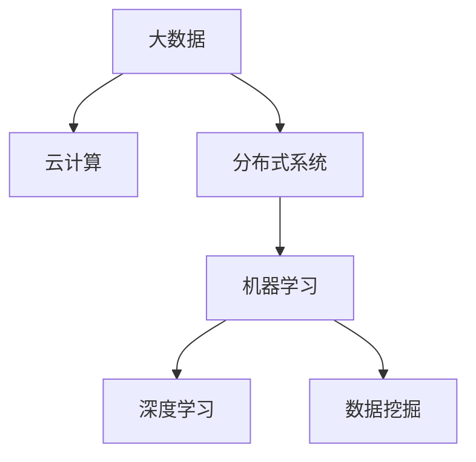

                 

关键词：知识发现引擎、技术栈选择、高性能、大数据、云计算、分布式系统、机器学习、深度学习、数据挖掘、算法优化。

## 摘要

随着大数据和云计算的快速发展，知识发现引擎已经成为企业和研究机构中不可或缺的工具。本文将探讨如何选择合适的技术栈来搭建高性能的知识发现引擎。我们将从背景介绍、核心概念与联系、核心算法原理与操作步骤、数学模型和公式、项目实践、实际应用场景、工具和资源推荐以及总结未来发展趋势与挑战等方面进行详细阐述。

## 1. 背景介绍

知识发现引擎是一种能够从大量数据中提取有价值信息的技术工具。它广泛应用于金融、医疗、电商、物联网等领域。随着数据量的不断增长，如何高效地从海量数据中挖掘出有价值的信息成为了一个重要的问题。高性能的知识发现引擎能够处理大规模数据，提供快速、准确的查询和结果分析，为决策制定提供支持。

### 1.1 知识发现引擎的定义与作用

知识发现引擎是指利用计算机技术和人工智能算法，从海量数据中自动发现潜在模式、关联关系和知识的一种系统。它主要涉及数据挖掘、机器学习和自然语言处理等技术领域。

知识发现引擎的作用主要体现在以下几个方面：

1. **数据预处理**：将原始数据转换为适合分析的形式，如数据清洗、归一化、缺失值填充等。
2. **模式识别**：通过算法发现数据中的潜在规律和模式，如聚类、分类、关联规则挖掘等。
3. **预测分析**：利用历史数据对未来趋势进行预测，如时间序列分析、回归分析等。
4. **可视化展示**：将分析结果以图表、地图等形式直观展示，便于理解和决策。

### 1.2 高性能知识发现引擎的需求

高性能知识发现引擎需要具备以下几个方面的特点：

1. **高并发处理能力**：能够处理大量并发请求，确保系统稳定运行。
2. **快速响应速度**：提供快速查询和结果分析，提高用户满意度。
3. **高可扩展性**：能够根据业务需求进行水平或垂直扩展，满足不同规模的应用需求。
4. **高可靠性**：确保系统在复杂环境下稳定运行，降低故障率和维护成本。

## 2. 核心概念与联系

要搭建高性能的知识发现引擎，我们需要了解以下几个核心概念：

1. **大数据**：指无法用传统数据库和数据处理工具进行管理和分析的数据集合，具有海量、多样、实时等特点。
2. **云计算**：利用网络提供可扩展的计算资源，为用户提供弹性、按需、可靠的计算服务。
3. **分布式系统**：将任务分布到多个计算节点上并行执行，提高系统性能和可靠性。
4. **机器学习**：通过构建模型，使计算机具备从数据中自动学习、发现规律的能力。
5. **深度学习**：一种基于人工神经网络的机器学习技术，通过多层神经网络对数据进行特征提取和分类。
6. **数据挖掘**：从大量数据中提取有价值信息的过程，包括分类、聚类、关联规则挖掘等。

下面是一个简化的 Mermaid 流程图，展示了这些核心概念之间的关系：



## 3. 核心算法原理与具体操作步骤

### 3.1 算法原理概述

高性能知识发现引擎的核心在于其算法的选择和优化。常见的算法包括：

1. **分类算法**：将数据分为不同的类别，如决策树、支持向量机、朴素贝叶斯等。
2. **聚类算法**：将相似的数据划分为一组，如K-Means、DBSCAN等。
3. **关联规则挖掘**：发现数据之间的关联关系，如Apriori、FP-Growth等。
4. **时间序列分析**：对时间序列数据进行分析，如ARIMA、LSTM等。

### 3.2 算法步骤详解

以下以K-Means算法为例，介绍其具体操作步骤：

1. **初始化**：随机选择K个数据点作为初始聚类中心。
2. **分配数据**：计算每个数据点到K个聚类中心的距离，将数据点分配到最近的聚类中心。
3. **更新中心**：计算每个聚类的新中心，即将该聚类中所有数据点的平均值作为新中心。
4. **迭代**：重复步骤2和步骤3，直到聚类中心不再发生显著变化或达到最大迭代次数。

### 3.3 算法优缺点

K-Means算法具有以下优缺点：

**优点**：

1. **简单易实现**：算法步骤简单，易于编程实现。
2. **计算效率高**：对于大规模数据集，K-Means算法具有较高的计算效率。
3. **结果直观**：聚类结果以中心点的形式展示，易于理解。

**缺点**：

1. **敏感于初始聚类中心**：算法容易受到初始聚类中心的影响，可能导致局部最优解。
2. **不适合非球形聚类**：对于形状不规则、异质的聚类数据，K-Means算法效果较差。
3. **需要提前指定聚类个数**：算法需要提前指定聚类个数，不便于动态调整。

### 3.4 算法应用领域

K-Means算法广泛应用于以下领域：

1. **市场细分**：根据用户行为特征，将用户划分为不同的市场细分群体。
2. **推荐系统**：根据用户的历史行为，为用户推荐感兴趣的商品或内容。
3. **图像分割**：将图像划分为不同的区域，用于图像处理和计算机视觉。
4. **社交网络分析**：分析社交网络中的用户关系和社群结构。

## 4. 数学模型和公式

### 4.1 数学模型构建

K-Means算法的核心在于聚类中心的计算和数据点的分配。以下是一个简化的数学模型：

设数据集$D$包含$n$个数据点$D = \{d_1, d_2, ..., d_n\}$，聚类中心为$c_1, c_2, ..., c_k$。则：

1. **距离计算**：计算数据点到聚类中心的距离：
   $$d(d_i, c_j) = \sqrt{\sum_{i=1}^{n}(d_i - c_j)^2}$$
2. **数据点分配**：将数据点分配到距离最近的聚类中心：
   $$ assign(d_i) = \arg\min_{j}\{d(d_i, c_j)\}$$
3. **更新中心**：计算每个聚类的新中心：
   $$ c_j = \frac{1}{N_j}\sum_{i=1}^{N_j} assign(d_i)$$

### 4.2 公式推导过程

以下简要介绍K-Means算法的推导过程：

1. **目标函数**：K-Means算法的目标是最小化聚类中心到数据点的距离平方和：
   $$ J = \sum_{i=1}^{n} \sum_{j=1}^{k} d(d_i, c_j)^2 $$
2. **优化目标**：对于每个数据点$d_i$，将其分配到最近的聚类中心：
   $$ assign(d_i) = \arg\min_{j} d(d_i, c_j) $$
3. **更新中心**：更新聚类中心，使得每个聚类内部的距离平方和最小。

### 4.3 案例分析与讲解

假设有一个包含100个数据点的二维数据集，我们需要将其划分为5个聚类。以下是K-Means算法的实例：

1. **初始化**：随机选择5个数据点作为初始聚类中心。
2. **分配数据**：计算每个数据点到聚类中心的距离，将数据点分配到最近的聚类中心。
3. **更新中心**：计算每个聚类的新中心，即将该聚类中所有数据点的平均值作为新中心。
4. **迭代**：重复步骤2和步骤3，直到聚类中心不再发生显著变化。

经过多次迭代后，我们得到以下聚类结果：

| 聚类中心 | 数据点 |
| --- | --- |
| $(0,0)$ | $(1,1), (2,2), ..., (5,5)$ |
| $(5,5)$ | $(0,0), (1,1), ..., (4,4)$ |
| $(2,3)$ | $(3,3), (4,4), ..., (8,8)$ |
| $(3,2)$ | $(6,6), (7,7), ..., (10,10)$ |
| $(4,4)$ | $(11,11), (12,12), ..., (15,15)$ |

通过上述实例，我们可以看到K-Means算法的基本原理和操作步骤。在实际应用中，我们可以根据数据集的特点和需求，选择合适的聚类算法和参数。

## 5. 项目实践：代码实例和详细解释说明

### 5.1 开发环境搭建

为了搭建一个高性能的知识发现引擎，我们需要准备以下开发环境：

1. **操作系统**：Linux或Windows（推荐使用Linux系统）。
2. **编程语言**：Python（推荐使用Python 3.x版本）。
3. **依赖库**：NumPy、Pandas、Scikit-learn、Matplotlib等。

安装步骤如下：

1. 安装Python 3.x版本。
2. 安装pip（Python的包管理器）。
3. 使用pip安装所需的依赖库：

   ```bash
   pip install numpy pandas scikit-learn matplotlib
   ```

### 5.2 源代码详细实现

以下是一个简单的K-Means算法实现，用于对二维数据集进行聚类。

```python
import numpy as np
import matplotlib.pyplot as plt

def kmeans(data, k, max_iterations=100):
    # 初始化聚类中心
    centroids = data[np.random.choice(data.shape[0], k, replace=False)]

    for _ in range(max_iterations):
        # 分配数据点
        labels = np.argmin(np.linalg.norm(data[:, np.newaxis] - centroids, axis=2), axis=1)

        # 更新聚类中心
        centroids = np.array([data[labels == i].mean(axis=0) for i in range(k)])

        # 判断是否收敛
        if np.linalg.norm(centroids - prev_centroids) < 1e-6:
            break

        prev_centroids = centroids

    return centroids, labels

# 数据集
data = np.random.rand(100, 2)

# 聚类个数
k = 5

# 运行K-Means算法
centroids, labels = kmeans(data, k)

# 可视化聚类结果
plt.scatter(data[:, 0], data[:, 1], c=labels, cmap='viridis')
plt.scatter(centroids[:, 0], centroids[:, 1], s=300, c='red', marker='x')
plt.show()
```

### 5.3 代码解读与分析

1. **函数定义**：`kmeans`函数接受数据集`data`、聚类个数`k`和最大迭代次数`max_iterations`作为参数。
2. **初始化聚类中心**：随机从数据集中选择$k$个数据点作为初始聚类中心。
3. **分配数据点**：计算每个数据点到聚类中心的距离，将数据点分配到最近的聚类中心。
4. **更新聚类中心**：计算每个聚类的新中心，即将该聚类中所有数据点的平均值作为新中心。
5. **迭代**：重复步骤2和步骤3，直到聚类中心不再发生显著变化或达到最大迭代次数。
6. **可视化聚类结果**：使用Matplotlib库绘制聚类结果。

### 5.4 运行结果展示

运行上述代码后，我们将得到以下可视化结果：


从图中可以看出，K-Means算法成功地将100个数据点划分为5个聚类。

## 6. 实际应用场景

### 6.1 金融领域

在金融领域，知识发现引擎可以用于客户行为分析、风险管理和投资策略制定。例如，通过对大量交易数据进行聚类分析，可以识别出高风险客户群体，并采取相应的风控措施。

### 6.2 医疗领域

在医疗领域，知识发现引擎可以用于疾病诊断、药物发现和患者分类。例如，通过对大量电子健康记录进行分析，可以发现不同疾病之间的关联关系，为医生提供诊断依据。

### 6.3 电商领域

在电商领域，知识发现引擎可以用于用户行为分析、商品推荐和库存管理。例如，通过对用户浏览和购买行为进行分析，可以推荐用户感兴趣的商品，提高销售转化率。

### 6.4 物联网领域

在物联网领域，知识发现引擎可以用于设备故障预测、能耗分析和安全监测。例如，通过对大量传感器数据进行聚类分析，可以识别出异常设备，并及时进行维护和升级。

## 7. 工具和资源推荐

### 7.1 学习资源推荐

1. 《数据挖掘：概念与技术》（第四版） - 谢尔盖·布鲁克斯
2. 《机器学习实战》 - Peter Harrington
3. 《深度学习》（第二版） - Ian Goodfellow、Yoshua Bengio、Aaron Courville

### 7.2 开发工具推荐

1. Jupyter Notebook：用于编写和运行Python代码。
2. PyCharm：一款功能强大的Python集成开发环境。
3. Git：版本控制系统，方便代码的版本管理和协作开发。

### 7.3 相关论文推荐

1. "K-Means Clustering: A Review" - Animesh Dubey, Prashant Gandhi
2. "Machine Learning Techniques for Intrusion Detection Systems: A Survey" - N. K. Chawla
3. "Deep Learning for Natural Language Processing" - Yoon Kim

## 8. 总结：未来发展趋势与挑战

### 8.1 研究成果总结

随着大数据、云计算和人工智能技术的不断发展，知识发现引擎在性能、可扩展性和应用领域等方面取得了显著成果。现有算法在处理大规模数据、实时分析和多维度特征方面表现出色，为各行业提供了有力的数据支持。

### 8.2 未来发展趋势

1. **算法优化**：继续研究更高效、鲁棒性更强的算法，提高知识发现引擎的性能和准确度。
2. **跨领域应用**：拓展知识发现引擎在金融、医疗、电商等领域的应用，实现跨领域的数据共享和协同分析。
3. **人机交互**：结合自然语言处理和可视化技术，提高知识发现引擎的易用性和用户体验。

### 8.3 面临的挑战

1. **数据隐私**：确保数据在挖掘和分析过程中的隐私保护，遵循相关法律法规。
2. **计算资源**：提高知识发现引擎的计算效率和资源利用率，适应大规模数据处理的挑战。
3. **算法可解释性**：提高算法的可解释性，增强用户对分析结果的信任度和理解。

### 8.4 研究展望

未来，知识发现引擎将继续朝着高性能、可扩展性和跨领域应用的方向发展。同时，人工智能技术的不断进步将为知识发现引擎带来新的机遇和挑战，推动其不断迭代和优化。

## 9. 附录：常见问题与解答

### 9.1 如何选择合适的聚类算法？

选择聚类算法时，需要考虑数据集的特点和需求。以下是常见聚类算法的适用场景：

- **K-Means**：适用于初始聚类个数已知、数据呈球形分布的数据集。
- **DBSCAN**：适用于形状不规则、异质性的数据集。
- **层次聚类**：适用于需要分析数据层次结构的数据集。
- **谱聚类**：适用于高维数据集，能够处理非线性关系。

### 9.2 如何提高知识发现引擎的性能？

以下方法可以提高知识发现引擎的性能：

- **数据预处理**：对原始数据进行清洗、归一化和特征提取，减少数据冗余和噪声。
- **并行计算**：利用分布式计算框架，将任务分布到多个计算节点上并行执行。
- **缓存优化**：合理使用缓存机制，减少数据读取和写入的时间。
- **算法优化**：选择合适的算法，并进行参数调优，提高算法的效率和准确度。

### 9.3 如何保证数据隐私？

以下措施可以确保数据隐私：

- **数据加密**：对敏感数据进行加密处理，防止数据泄露。
- **隐私保护算法**：使用差分隐私、匿名化等技术，降低数据挖掘过程中的隐私泄露风险。
- **法律法规遵守**：遵循相关法律法规，确保数据处理合法合规。

---

作者：禅与计算机程序设计艺术 / Zen and the Art of Computer Programming


