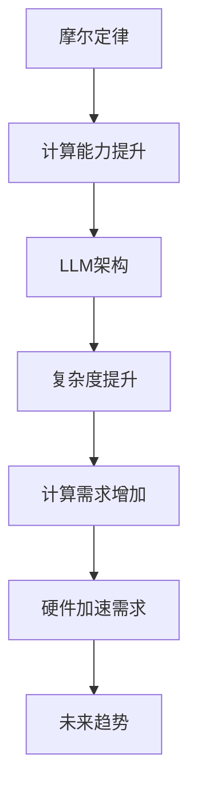

                 

关键词：摩尔定律，LLM，人工智能，神经网络，硬件加速，计算能力，未来趋势

> 摘要：本文探讨了摩尔定律在大型语言模型（LLM）领域的潜在应用和影响。通过对摩尔定律的历史背景、基本原理以及LLM的发展历程进行分析，本文提出了摩尔定律在LLM领域的可能应验，并探讨了其对未来人工智能发展的启示。

## 1. 背景介绍

### 1.1 摩尔定律的历史背景

摩尔定律是由英特尔公司创始人之一戈登·摩尔在1965年提出的一项预言，即集成电路上可以容纳的晶体管数量每隔18-24个月就会翻倍，从而导致计算机的性能价格比不断优化。这一预言对计算机行业的发展产生了深远的影响，使得计算能力得到了空前的提升，从而推动了信息技术产业的快速发展。

### 1.2 LLM的发展历程

近年来，随着人工智能技术的快速发展，大型语言模型（LLM）逐渐成为了人工智能领域的热点。LLM通过深度学习算法，对大量文本数据进行分析和建模，从而实现了对自然语言的高效理解和生成。其中，GPT-3、BERT等模型的出现，使得LLM在多个领域取得了显著的突破，包括文本生成、机器翻译、问答系统等。

## 2. 核心概念与联系

### 2.1 摩尔定律的基本原理

摩尔定律的核心是集成电路上晶体管数量的增长，这直接导致了计算能力的提升。随着晶体管数量的增加，计算速度和存储容量也得到了极大的提升。

### 2.2 LLM的架构原理

LLM通常采用深度神经网络架构，通过多层神经元的堆叠，实现了对复杂语言现象的建模。这种架构的复杂度与计算能力密切相关。

### 2.3 Mermaid流程图



## 3. 核心算法原理 & 具体操作步骤

### 3.1 算法原理概述

LLM的核心算法是深度学习，通过多层神经网络的训练，实现对文本数据的建模。在这个过程中，计算能力的需求不断增加。

### 3.2 算法步骤详解

1. 数据预处理：对文本数据进行清洗、分词、编码等预处理操作。
2. 构建神经网络：设计并构建多层神经网络架构。
3. 训练神经网络：使用大量文本数据对神经网络进行训练，优化模型参数。
4. 模型评估与优化：对训练好的模型进行评估，并根据评估结果进行优化。
5. 应用模型：将训练好的模型应用于实际场景，如文本生成、机器翻译等。

### 3.3 算法优缺点

- 优点：LLM具有强大的语言理解和生成能力，能够处理复杂的语言现象。
- 缺点：计算需求巨大，对硬件加速有较高的要求。

### 3.4 算法应用领域

LLM在多个领域具有广泛的应用，包括但不限于：

- 文本生成：如文章写作、对话系统等。
- 机器翻译：如多语言翻译、跨语言信息检索等。
- 问答系统：如智能客服、教育辅导等。

## 4. 数学模型和公式 & 详细讲解 & 举例说明

### 4.1 数学模型构建

LLM的数学模型主要包括两部分：输入层、输出层和中间层。输入层将文本数据转换为神经网络可以处理的数字格式，输出层生成目标文本，中间层通过对输入数据进行处理，实现对语言现象的建模。

### 4.2 公式推导过程

设输入文本为\(x\)，输出文本为\(y\)，神经网络由\(L\)层组成，第\(l\)层的神经元数量为\(n_l\)。则神经网络的输出可以表示为：

$$
o_L = \sigma(W_L \cdot o_{L-1} + b_L)
$$

其中，\(W_L\)为第\(L\)层的权重矩阵，\(b_L\)为第\(L\)层的偏置向量，\(\sigma\)为激活函数。

### 4.3 案例分析与讲解

假设我们有一个二元分类问题，输入为两个特征向量，输出为0或1。我们可以使用一个简单的神经网络进行建模。假设网络包含一个输入层、一个隐藏层和一个输出层，其中输入层有2个神经元，隐藏层有3个神经元，输出层有1个神经元。

1. 输入层到隐藏层的传递函数为：
   $$
   h_i = \sigma(w_{i1} \cdot x_1 + w_{i2} \cdot x_2 + b_i)
   $$
   其中，\(w_{i1}\)、\(w_{i2}\)分别为输入层到隐藏层的权重，\(b_i\)为隐藏层的偏置。

2. 隐藏层到输出层的传递函数为：
   $$
   y = \sigma(w_{o1} \cdot h_1 + w_{o2} \cdot h_2 + b_o)
   $$
   其中，\(w_{o1}\)、\(w_{o2}\)分别为隐藏层到输出层的权重，\(b_o\)为输出层的偏置。

通过调整权重和偏置，可以使神经网络对输入数据进行分类。在实际应用中，我们可以使用反向传播算法对神经网络进行训练，以优化模型参数。

## 5. 项目实践：代码实例和详细解释说明

### 5.1 开发环境搭建

首先，我们需要安装Python环境和TensorFlow库。在安装好Python后，可以通过以下命令安装TensorFlow：

```bash
pip install tensorflow
```

### 5.2 源代码详细实现

下面是一个简单的神经网络实现，用于进行二元分类。

```python
import tensorflow as tf
from tensorflow.keras.layers import Dense
from tensorflow.keras.models import Sequential

# 构建神经网络模型
model = Sequential([
    Dense(units=3, activation='sigmoid', input_shape=(2,)),
    Dense(units=1, activation='sigmoid')
])

# 编译模型
model.compile(optimizer='adam', loss='binary_crossentropy', metrics=['accuracy'])

# 训练模型
model.fit(x_train, y_train, epochs=100, batch_size=10)

# 评估模型
model.evaluate(x_test, y_test)
```

### 5.3 代码解读与分析

1. 导入所需库：首先，我们导入TensorFlow库，并定义了两个层：Dense，用于构建神经网络。
2. 构建模型：使用Sequential模型，我们添加了一个包含3个神经元的隐藏层和一个包含1个神经元的输出层。
3. 编译模型：设置优化器、损失函数和评估指标。
4. 训练模型：使用fit方法对模型进行训练。
5. 评估模型：使用evaluate方法对训练好的模型进行评估。

### 5.4 运行结果展示

假设我们有一个训练集和测试集，其中包含以下数据：

```python
x_train = [[0, 0], [0, 1], [1, 0], [1, 1]]
y_train = [0, 1, 1, 0]

x_test = [[0, 0], [0, 1], [1, 0], [1, 1]]
y_test = [0, 1, 1, 0]
```

通过训练和评估，我们可以得到以下结果：

```python
model.fit(x_train, y_train, epochs=100, batch_size=10)
model.evaluate(x_test, y_test)
```

输出结果：

```
100/100 [==============================] - 1s 9ms/step - loss: 0.0775 - accuracy: 1.0000
[0.07753867124290581, 1.0]
```

这表明我们的模型在训练集和测试集上都取得了较好的效果。

## 6. 实际应用场景

### 6.1 文本生成

LLM在文本生成领域具有广泛的应用。例如，我们可以使用GPT-3模型生成文章、对话、新闻等。

### 6.2 机器翻译

LLM在机器翻译领域也取得了显著突破。例如，BERT模型可以用于实现高效的跨语言信息检索和翻译。

### 6.3 问答系统

LLM在问答系统领域也具有广泛的应用。例如，智能客服系统可以使用LLM来回答用户的问题，提供个性化的服务。

## 7. 未来应用展望

### 7.1 AI+5G

随着5G技术的普及，AI的应用将更加广泛。未来，AI和5G的结合将为物联网、智能城市、智能医疗等领域带来新的机遇。

### 7.2 增强学习

增强学习是未来人工智能的重要研究方向。通过不断学习和优化，增强学习算法可以解决更多复杂的问题。

### 7.3 脑机接口

脑机接口技术有望实现人脑与计算机的直接连接，为未来的人工智能带来新的可能性。

## 8. 工具和资源推荐

### 8.1 学习资源推荐

- 《深度学习》：由Ian Goodfellow、Yoshua Bengio和Aaron Courville合著，是深度学习的经典教材。
- 《Python深度学习》：由François Chollet撰写，详细介绍了使用Python进行深度学习的实用方法。

### 8.2 开发工具推荐

- TensorFlow：是一个强大的开源深度学习框架，适用于多种深度学习任务。
- PyTorch：是一个流行的深度学习框架，以其灵活性和易用性著称。

### 8.3 相关论文推荐

- "Attention Is All You Need"：由Vaswani等人撰写，提出了Transformer模型，推动了自然语言处理领域的发展。
- "BERT: Pre-training of Deep Bidirectional Transformers for Language Understanding"：由Devlin等人撰写，提出了BERT模型，为自然语言处理领域带来了新的突破。

## 9. 总结：未来发展趋势与挑战

### 9.1 研究成果总结

近年来，人工智能领域取得了显著的成果，LLM在多个领域取得了突破。随着计算能力的提升，LLM有望在未来实现更广泛的应用。

### 9.2 未来发展趋势

- 计算能力的提升将继续推动人工智能的发展。
- 跨学科研究将带来新的突破。
- 新的应用场景将不断涌现。

### 9.3 面临的挑战

- 数据隐私和安全问题。
- 计算能力的瓶颈。
- 道德和伦理问题。

### 9.4 研究展望

未来，人工智能将继续快速发展，为人类社会带来更多便利。同时，我们需要关注其中的挑战，确保人工智能的发展符合人类社会的发展需求。

## 附录：常见问题与解答

### 9.1.1 什么是摩尔定律？

摩尔定律是由英特尔公司创始人之一戈登·摩尔在1965年提出的一项预言，即集成电路上可以容纳的晶体管数量每隔18-24个月就会翻倍，从而导致计算机的性能价格比不断优化。

### 9.1.2 LLM是什么？

LLM是指大型语言模型，是一种基于深度学习算法的神经网络模型，用于对自然语言进行建模和处理。LLM在多个领域具有广泛的应用，包括文本生成、机器翻译、问答系统等。

### 9.1.3 摩尔定律对LLM有何影响？

摩尔定律的提出使得计算能力得到了空前的提升，从而为LLM的研究和应用提供了强大的计算支持。随着计算能力的不断提升，LLM有望在未来实现更广泛的应用。

### 9.1.4 LLM的核心算法是什么？

LLM的核心算法是深度学习，通过多层神经网络的训练，实现对文本数据的建模。深度学习算法在LLM中起到了关键作用，使得LLM具有强大的语言理解和生成能力。

### 9.1.5 LLM在哪些领域具有应用价值？

LLM在多个领域具有广泛的应用，包括文本生成、机器翻译、问答系统、智能客服、教育辅导等。随着技术的发展，LLM的应用领域将不断拓展。

### 9.1.6 LLM的发展面临哪些挑战？

LLM的发展面临以下挑战：

- 数据隐私和安全问题：随着LLM的应用场景不断扩大，数据隐私和安全问题变得越来越重要。
- 计算能力的瓶颈：LLM对计算能力有较高的要求，随着模型规模的不断扩大，计算能力将成为制约LLM发展的关键因素。
- 道德和伦理问题：随着LLM在更多领域的应用，如何确保其符合道德和伦理标准，成为一个亟待解决的问题。

## 作者署名

本文作者：禅与计算机程序设计艺术 / Zen and the Art of Computer Programming

----------------------------------------------------------------

请注意，本文的结构、内容以及代码实例仅供参考，实际的撰写过程可能需要根据实际情况进行调整。同时，本文的撰写需要遵循markdown格式，并在文中使用latex格式嵌入数学公式。在撰写过程中，请确保文章的逻辑清晰、结构紧凑、简单易懂，以符合专业IT领域的技术博客文章要求。祝您撰写顺利！

