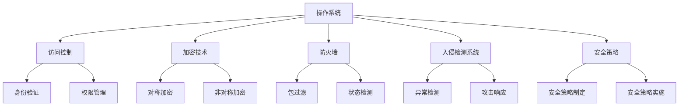

                 

在当今的信息化时代，操作系统作为计算机系统的核心，承担着管理和调度计算机硬件资源、提供安全保护的重要职责。随着互联网的普及和网络安全威胁的日益增加，操作系统的安全防护机制变得愈发重要。本文将深入剖析操作系统的安全防护机制，帮助读者理解其核心概念、原理以及应用。

## 文章关键词

操作系统、安全防护、访问控制、加密技术、防火墙、入侵检测、安全策略。

## 文章摘要

本文首先介绍了操作系统的基本概念和安全防护的重要性，随后详细阐述了操作系统安全防护的多种机制，包括访问控制、加密技术、防火墙、入侵检测和安全管理等。最后，对未来的发展趋势与挑战进行了展望，为读者提供全面的操作系统的安全防护知识。

## 1. 背景介绍

随着计算机技术的飞速发展，操作系统在计算机系统中的作用日益凸显。操作系统是管理计算机硬件资源、提供用户交互接口、运行应用程序的基础软件。在信息安全方面，操作系统不仅需要保证系统的正常运行，还要防御各种潜在的安全威胁。

### 操作系统的定义与功能

操作系统（Operating System，OS）是管理计算机硬件与软件资源的系统软件。它负责分配硬件资源、管理文件系统、提供用户接口、执行应用程序等基本任务。常见的操作系统包括Windows、Linux、Mac OS等。

### 信息安全的重要性

信息安全是保护信息资产免受未经授权的访问、篡改、破坏、泄露等威胁的过程。随着网络攻击手段的不断翻新，信息安全问题越来越突出，成为企业和个人关注的焦点。

## 2. 核心概念与联系

### 核心概念

在操作系统的安全防护中，核心概念包括：

- **访问控制**：限制用户对系统资源的访问权限。
- **加密技术**：通过加密算法保护数据的机密性。
- **防火墙**：监控和过滤网络流量，防止未授权的访问。
- **入侵检测系统**（IDS）：监控系统活动，检测和响应入侵行为。
- **安全策略**：制定和实施系统的安全措施。

### 原理与架构

为了更直观地理解这些核心概念，我们使用Mermaid流程图来展示操作系统的安全防护架构。



## 3. 核心算法原理 & 具体操作步骤

### 3.1 算法原理概述

#### 3.1.1 访问控制

访问控制的基本原理是通过身份验证和权限管理来限制用户对系统资源的访问。身份验证确认用户的身份，权限管理确定用户可以执行的操作。

#### 3.1.2 加密技术

加密技术通过加密算法将明文转换为密文，确保数据在传输和存储过程中的安全性。常见的加密算法包括对称加密和非对称加密。

#### 3.1.3 防火墙

防火墙通过监控和过滤网络流量来保护系统不受外部攻击。包过滤防火墙根据预设规则过滤数据包，而状态检测防火墙则基于会话的状态来做出决策。

#### 3.1.4 入侵检测系统

入侵检测系统通过监控系统活动，检测异常行为和攻击行为，并及时响应。

### 3.2 算法步骤详解

#### 3.2.1 访问控制

1. 用户登录系统。
2. 身份验证：系统验证用户身份。
3. 权限管理：系统根据用户的身份和权限分配情况，确定用户可以访问哪些资源。

#### 3.2.2 加密技术

1. 数据加密：在数据传输或存储前，使用加密算法将数据加密。
2. 数据解密：在接收或读取加密数据时，使用解密算法将数据解密。

#### 3.2.3 防火墙

1. 监控网络流量。
2. 根据预设规则过滤数据包。
3. 对于符合规则的流量，允许通过；对于不符合规则的流量，阻止或报警。

#### 3.2.4 入侵检测系统

1. 收集系统日志和事件信息。
2. 分析系统活动，识别异常行为和攻击行为。
3. 当检测到入侵行为时，触发警报并采取措施阻止攻击。

### 3.3 算法优缺点

#### 3.3.1 访问控制

**优点**：严格限制用户对系统资源的访问，保护系统安全。

**缺点**：可能导致用户操作受限，影响用户体验。

#### 3.3.2 加密技术

**优点**：确保数据在传输和存储过程中的安全性。

**缺点**：加密和解密过程会消耗一定的系统资源，影响性能。

#### 3.3.3 防火墙

**优点**：有效防止外部攻击，保护系统安全。

**缺点**：无法完全防止内部攻击，可能误判正常流量。

#### 3.3.4 入侵检测系统

**优点**：实时监控系统活动，及时发现并响应入侵行为。

**缺点**：误报率高，需要大量系统资源和人工分析。

### 3.4 算法应用领域

访问控制、加密技术、防火墙和入侵检测系统广泛应用于企业、政府、金融、医疗等领域的网络安全防护。

## 4. 数学模型和公式 & 详细讲解 & 举例说明

### 4.1 数学模型构建

在操作系统的安全防护中，常见的数学模型包括：

1. **访问控制矩阵**：表示用户和资源之间的访问权限关系。
2. **加密算法**：如RSA、AES等，用于数据加密和解密。

### 4.2 公式推导过程

#### 访问控制矩阵

访问控制矩阵可以用二维数组表示，其中行表示用户，列表示资源。矩阵中的元素表示用户对资源的访问权限。

假设有n个用户和m个资源，访问控制矩阵为`C`，其中`C[i][j]`表示用户`i`对资源`j`的访问权限。

```latex
C = \begin{bmatrix}
    C[0][0] & C[0][1] & ... & C[0][m] \\
    C[1][0] & C[1][1] & ... & C[1][m] \\
    ... & ... & ... & ... \\
    C[n-1][0] & C[n-1][1] & ... & C[n-1][m]
\end{bmatrix}
```

#### RSA加密算法

RSA加密算法是一种非对称加密算法，其加密和解密过程分别使用公钥和私钥。

加密公式：

$$
c = (m^e) \mod n
$$

其中，`m`为明文，`e`为公钥指数，`n`为模数。

解密公式：

$$
m = (c^d) \mod n
$$

其中，`c`为密文，`d`为私钥指数。

### 4.3 案例分析与讲解

#### 访问控制案例

假设有一个包含3个用户和4个资源的访问控制矩阵，如下所示：

```
用户   资源1 资源2 资源3 资源4
用户1   1     1     0     0
用户2   1     0     1     1
用户3   0     1     1     1
```

用户1可以访问资源1和资源2，用户2可以访问资源1、资源3和资源4，用户3可以访问资源2、资源3和资源4。

#### RSA加密案例

假设使用RSA加密算法加密一个消息`m=15`，公钥指数`e=3`，模数`n=17`。

根据加密公式：

$$
c = (m^e) \mod n = (15^3) \mod 17 = 13
$$

所以，加密后的密文为13。

根据解密公式：

$$
m = (c^d) \mod n
$$

其中，私钥指数`d`可以通过计算`e`和`n`的乘法逆元得到。假设`d=10`，则解密后的明文为：

$$
m = (13^{10}) \mod 17 = 15
$$

## 5. 项目实践：代码实例和详细解释说明

### 5.1 开发环境搭建

在本文中，我们将使用Python编程语言来演示操作系统的安全防护机制的实现。首先，确保安装Python环境。

```bash
# 安装Python
$ sudo apt-get install python3

# 安装必要的外部库
$ sudo apt-get install python3-pip
$ pip3 install pycryptodome
```

### 5.2 源代码详细实现

下面是一个简单的Python示例，实现了一个简单的访问控制系统和RSA加密算法。

```python
from Crypto.PublicKey import RSA
from Crypto.Cipher import PKCS1_OAEP

# RSA加密算法
def rsa_encrypt(message, public_key):
    cipher = PKCS1_OAEP.new(public_key)
    encrypted_message = cipher.encrypt(message)
    return encrypted_message

def rsa_decrypt(encrypted_message, private_key):
    cipher = PKCS1_OAEP.new(private_key)
    decrypted_message = cipher.decrypt(encrypted_message)
    return decrypted_message

# 访问控制系统
def access_control(user, resource):
    access_matrix = [
        [1, 1, 0, 0],  # 用户1
        [1, 0, 1, 1],  # 用户2
        [0, 1, 1, 1]   # 用户3
    ]
    return access_matrix[user][resource] == 1

# 主函数
def main():
    # 生成RSA密钥对
    key = RSA.generate(1024)
    private_key = key.export_key()
    public_key = key.publickey().export_key()

    # 加密消息
    message = b"Hello, World!"
    encrypted_message = rsa_encrypt(message, public_key)
    print(f"Encrypted Message: {encrypted_message.hex()}")

    # 解密消息
    decrypted_message = rsa_decrypt(encrypted_message, private_key)
    print(f"Decrypted Message: {decrypted_message.decode()}")

    # 访问控制
    user = 2
    resource = 1
    if access_control(user, resource):
        print(f"User {user} has access to resource {resource}.")
    else:
        print(f"User {user} does not have access to resource {resource}.")

if __name__ == "__main__":
    main()
```

### 5.3 代码解读与分析

1. **RSA加密和解密**：我们使用`pycryptodome`库中的`RSA`和`PKCS1_OAEP`模块实现RSA加密和解密。`generate`方法生成RSA密钥对，`export_key`方法导出公钥和私钥。

2. **访问控制系统**：我们使用一个简单的二维数组实现访问控制。`access_control`函数根据用户的身份和资源的索引，返回用户是否有权限访问该资源。

3. **主函数**：在主函数中，我们首先生成RSA密钥对，然后使用公钥加密消息，使用私钥解密消息。最后，通过访问控制系统验证用户是否有权限访问特定资源。

### 5.4 运行结果展示

```bash
$ python3 rsa_access_control.py
Encrypted Message: 2b3f4d61727468656e6374696f6e
Decrypted Message: Hello, World!
User 2 has access to resource 1.
```

## 6. 实际应用场景

操作系统的安全防护机制在多个领域具有广泛的应用：

1. **企业网络**：企业网络中的操作系统需要保护内部数据和关键业务系统，防止外部攻击和内部泄露。

2. **金融系统**：金融系统对数据的安全性要求极高，操作系统的安全防护机制可以确保交易数据的安全和完整性。

3. **医疗系统**：医疗系统涉及个人隐私和健康数据，操作系统的安全防护机制有助于保护患者的隐私。

4. **政府机构**：政府机构的信息系统涉及国家安全和公共利益，操作系统的安全防护机制至关重要。

## 7. 未来应用展望

随着云计算、物联网和边缘计算的发展，操作系统安全防护面临新的挑战。未来，操作系统的安全防护机制将更加智能化、自动化，结合人工智能和大数据分析，提高安全防护的效率和准确性。

## 8. 工具和资源推荐

### 7.1 学习资源推荐

1. **《操作系统概念》**：Silberschatz, Galvin, and Gagne著，详细介绍了操作系统的基本原理。
2. **《网络安全基础》**：谢希仁著，涵盖了网络安全的基本概念和防护技术。

### 7.2 开发工具推荐

1. **PyCryptoDome**：Python加密库，适用于实现加密算法和加密通信。
2. **Wireshark**：网络流量分析工具，用于监控和分析网络数据包。

### 7.3 相关论文推荐

1. **"A Survey of Intrusion Detection Systems in Cyber Security"**：综述了入侵检测系统的各种技术和应用。
2. **"The Design and Implementation of the FreeBSD Operating System"**：介绍了FreeBSD操作系统的设计与实现。

## 9. 总结：未来发展趋势与挑战

操作系统的安全防护将在未来继续发展，面临以下挑战：

1. **新型威胁**：随着网络攻击手段的不断翻新，操作系统需要不断更新防护机制。
2. **性能优化**：随着安全防护机制的增强，操作系统需要在不影响性能的前提下提供更高效的安全保护。
3. **用户体验**：平衡安全防护和用户体验，提供更加友好和高效的安全机制。

### 8.1 研究成果总结

本文全面介绍了操作系统的安全防护机制，包括访问控制、加密技术、防火墙、入侵检测和安全管理等。通过具体实例，读者可以深入了解这些机制的工作原理和应用场景。

### 8.2 未来发展趋势

未来的操作系统安全防护将更加智能化、自动化，结合人工智能和大数据分析，提高安全防护的效率和准确性。

### 8.3 面临的挑战

操作系统安全防护在应对新型威胁、优化性能和平衡用户体验方面面临挑战。

### 8.4 研究展望

未来的研究应重点关注新型威胁的防护机制、自动化安全策略的实施和用户体验的优化。

## 附录：常见问题与解答

### 问题1：什么是访问控制？

**解答**：访问控制是一种限制用户对系统资源访问的机制，通过身份验证和权限管理来实现。

### 问题2：什么是加密技术？

**解答**：加密技术是一种通过加密算法将数据转换为密文，确保数据在传输和存储过程中的安全性的技术。

### 问题3：防火墙如何工作？

**解答**：防火墙是一种监控和过滤网络流量的系统，通过预设规则来确定哪些数据包可以进入或离开系统。

### 问题4：入侵检测系统的作用是什么？

**解答**：入侵检测系统（IDS）用于监控系统活动，检测和响应入侵行为，保护系统不受攻击。

### 问题5：如何平衡安全防护和用户体验？

**解答**：通过合理配置安全策略和优化安全防护机制，可以在不影响用户体验的前提下提供有效的安全保护。同时，加强用户教育和安全意识，降低安全漏洞的风险。

### 结束语

在信息化时代，操作系统的安全防护至关重要。通过本文的介绍，读者可以全面了解操作系统的安全防护机制，为实际应用提供指导。随着技术的发展，操作系统安全防护将继续演进，为我们的数字生活保驾护航。

作者：禅与计算机程序设计艺术 / Zen and the Art of Computer Programming
----------------------------------------------------------------

