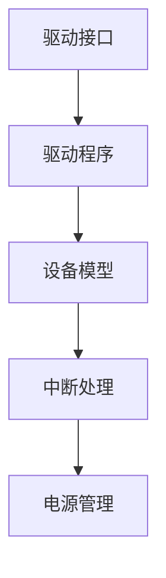

                 

关键词：操作系统、设备驱动、框架、架构、核心概念、算法原理、数学模型、项目实践、应用场景、未来展望。

> 摘要：本文将深入探讨操作系统的设备驱动框架，从核心概念、架构设计、算法原理、数学模型到项目实践，全面介绍设备驱动的各个方面。旨在为读者提供一个清晰、系统的设备驱动框架概述，以应对现代计算机系统中日益复杂的设备管理需求。

## 1. 背景介绍

设备驱动（Device Driver）是操作系统与硬件设备之间的一层接口。它负责将操作系统的抽象指令转化为具体硬件操作，使操作系统能够与硬件设备进行通信和交互。随着计算机硬件的多样化和复杂化，设备驱动已经成为操作系统的重要组成部分。

### 1.1 设备驱动的定义

设备驱动是一种特殊的软件程序，它为操作系统提供了一种与硬件设备进行通信的标准化接口。设备驱动的职责包括但不限于：

- **硬件初始化和配置**：设备驱动在设备连接到系统时，负责初始化硬件并配置必要的参数。
- **数据传输和管理**：设备驱动管理数据在操作系统与硬件设备之间的传输。
- **错误处理和报告**：设备驱动负责检测和处理硬件设备上的错误，并向操作系统报告。

### 1.2 设备驱动的类型

根据硬件设备的类型和功能，设备驱动可以分为以下几类：

- **字符设备驱动**：处理字符设备，如键盘、鼠标等。
- **块设备驱动**：处理块设备，如硬盘、光盘等。
- **网络设备驱动**：处理网络接口卡等网络设备。
- **显示设备驱动**：处理显示器、显卡等显示设备。
- **存储设备驱动**：处理存储设备，如固态硬盘、RAID卡等。

### 1.3 设备驱动的发展历程

设备驱动的历史可以追溯到计算机的早期发展阶段。随着计算机硬件技术的进步，设备驱动也经历了从简单的单任务驱动到复杂的多任务驱动的演变。

- **早期单任务驱动**：在早期操作系统中，设备驱动通常是单任务的，每个设备驱动只负责一个硬件设备。
- **多任务驱动**：随着计算机系统复杂性的增加，现代操作系统引入了多任务驱动，允许一个设备驱动同时处理多个硬件设备。

## 2. 核心概念与联系

### 2.1 设备驱动框架的基本组成部分

设备驱动框架通常包括以下几个基本组成部分：

- **驱动接口**：驱动接口是操作系统与设备驱动之间的接口，定义了操作系统调用驱动程序的方法。
- **驱动程序**：驱动程序是设备驱动的核心部分，负责具体的硬件操作。
- **设备模型**：设备模型是设备驱动框架的重要组成部分，用于组织和管理系统中的设备。
- **中断处理**：中断处理是设备驱动中处理硬件中断的核心机制。
- **电源管理**：电源管理负责管理设备在休眠和唤醒状态下的电源消耗。

### 2.2 Mermaid 流程图

下面是一个简单的 Mermaid 流程图，展示了设备驱动框架的基本组成部分及其相互关系：



## 3. 核心算法原理 & 具体操作步骤

### 3.1 算法原理概述

设备驱动中的核心算法主要涉及数据传输、中断处理和电源管理等几个方面。以下是这些算法的简要概述：

- **数据传输算法**：数据传输算法负责在操作系统与硬件设备之间高效、可靠地传输数据。常见的传输算法包括轮询传输、中断传输和直接内存访问（DMA）等。
- **中断处理算法**：中断处理算法用于响应硬件设备的中断请求，并执行相应的处理任务。中断处理算法的关键是确保中断处理的及时性和正确性。
- **电源管理算法**：电源管理算法负责在系统休眠和唤醒状态下管理设备的电源消耗，以延长电池寿命或减少功耗。

### 3.2 算法步骤详解

#### 数据传输算法

数据传输算法的基本步骤如下：

1. 操作系统向设备驱动发出数据传输请求。
2. 设备驱动将数据从操作系统的内存缓冲区复制到硬件设备的内存缓冲区。
3. 设备驱动通过硬件接口发送数据传输命令。
4. 设备驱动等待数据传输完成，并根据传输结果返回操作系统的结果。

#### 中断处理算法

中断处理算法的基本步骤如下：

1. 硬件设备产生中断请求。
2. 操作系统响应中断请求，并将控制权交给中断处理程序。
3. 中断处理程序执行相应的处理任务，如更新设备状态、处理数据等。
4. 中断处理程序返回，操作系统继续执行原来的任务。

#### 电源管理算法

电源管理算法的基本步骤如下：

1. 操作系统根据设备的使用情况决定是否进入休眠状态。
2. 设备驱动调整硬件设备的电源消耗，进入低功耗模式。
3. 当操作系统需要唤醒设备时，设备驱动将设备恢复到正常工作状态。

### 3.3 算法优缺点

- **数据传输算法**：
  - 优点：数据传输算法可以高效地完成数据传输任务。
  - 缺点：轮询传输算法可能占用大量的CPU资源，中断传输算法可能存在延迟。

- **中断处理算法**：
  - 优点：中断处理算法可以及时响应硬件设备的中断请求，保证系统的高效运行。
  - 缺点：中断处理算法可能存在延迟，特别是在中断处理程序执行时间较长时。

- **电源管理算法**：
  - 优点：电源管理算法可以延长电池寿命，降低系统功耗。
  - 缺点：电源管理算法可能影响系统的响应速度。

### 3.4 算法应用领域

设备驱动算法广泛应用于各种硬件设备，如字符设备、块设备、网络设备、显示设备等。在嵌入式系统、服务器和网络设备中，设备驱动算法尤为关键。

## 4. 数学模型和公式

### 4.1 数学模型构建

设备驱动中的数学模型通常涉及数据传输速率、中断响应时间等参数。以下是几个常用的数学模型：

- **数据传输速率模型**：

  $$ R = \frac{B \times L}{T} $$

  其中，$R$ 表示数据传输速率，$B$ 表示数据传输的比特率，$L$ 表示数据传输的长度，$T$ 表示数据传输的时间。

- **中断响应时间模型**：

  $$ T_r = \frac{D \times C}{B} $$

  其中，$T_r$ 表示中断响应时间，$D$ 表示中断处理的耗时，$C$ 表示中断的频率，$B$ 表示系统的处理能力。

### 4.2 公式推导过程

- **数据传输速率模型**推导：

  假设数据传输速率为 $R$，比特率为 $B$，数据传输长度为 $L$，数据传输时间为 $T$。则有：

  $$ R = \frac{L}{T} $$

  将 $T$ 表示为数据传输长度 $L$ 和比特率 $B$ 的比值：

  $$ T = \frac{L}{B} $$

  代入上式得：

  $$ R = \frac{L}{\frac{L}{B}} = B $$

  由于 $B$ 通常为固定值，因此 $R$ 也为常数。为了更精确地描述数据传输速率，我们引入传输时间 $T$，得到：

  $$ R = \frac{B \times L}{T} $$

- **中断响应时间模型**推导：

  假设中断响应时间为 $T_r$，中断处理的耗时为 $D$，中断的频率为 $C$，系统的处理能力为 $B$。则有：

  $$ T_r = \frac{D}{C} $$

  将 $C$ 表示为系统的处理能力 $B$ 和中断处理的耗时 $D$ 的比值：

  $$ C = \frac{B}{D} $$

  代入上式得：

  $$ T_r = \frac{D}{\frac{B}{D}} = D $$

  由于 $D$ 通常为固定值，因此 $T_r$ 也为常数。为了更精确地描述中断响应时间，我们引入中断的频率 $C$，得到：

  $$ T_r = \frac{D \times C}{B} $$

### 4.3 案例分析与讲解

下面我们以一个具体的案例来讲解设备驱动中的数学模型应用。

#### 案例背景

假设我们有一个网络设备，其数据传输速率 $R$ 为 100 Mbps，数据传输长度 $L$ 为 1 MB，中断处理的耗时 $D$ 为 10 ms，中断的频率 $C$ 为 1000 次/s。

#### 数据传输速率计算

根据数据传输速率模型：

$$ R = \frac{B \times L}{T} $$

代入数值：

$$ R = \frac{100 \times 10^6 \times 1 \times 10^6}{10 \times 10^3} = 10 \times 10^9 \text{ bits/s} $$

因此，数据传输速率 $R$ 为 10 Gbps。

#### 中断响应时间计算

根据中断响应时间模型：

$$ T_r = \frac{D \times C}{B} $$

代入数值：

$$ T_r = \frac{10 \times 10^3 \times 1000}{100 \times 10^6} = 10 \text{ ms} $$

因此，中断响应时间 $T_r$ 为 10 ms。

## 5. 项目实践：代码实例和详细解释说明

### 5.1 开发环境搭建

为了演示设备驱动的开发，我们选择使用 Linux 操作系统作为开发环境，并使用 C 语言编写设备驱动程序。以下是在 Linux 系统中搭建设备驱动开发环境的基本步骤：

1. 安装 Linux 操作系统。
2. 安装开发工具，如 GCC 编译器、Makefile 工具等。
3. 配置内核源码，编译和安装内核。
4. 安装设备驱动开发相关的库和工具，如 `udev`、`libusb` 等。

### 5.2 源代码详细实现

以下是一个简单的字符设备驱动的源代码示例：

```c
#include <linux/module.h>
#include <linux/fs.h>
#include <linux/uaccess.h>

#define DEVICE_NAME "char_dev"

MODULE_LICENSE("GPL");

static int device_open(struct inode *inode, struct file *file) {
    printk(KERN_INFO "Device opened\n");
    return 0;
}

static int device_release(struct inode *inode, struct file *file) {
    printk(KERN_INFO "Device released\n");
    return 0;
}

static long device_ioctl(struct file *file, unsigned int cmd, unsigned long arg) {
    printk(KERN_INFO "Device IOCTL called with cmd = %d\n", cmd);
    return 0;
}

static struct file_operations fops = {
    .open = device_open,
    .release = device_release,
    .unlocked_ioctl = device_ioctl,
};

static int __init char_dev_init(void) {
    printk(KERN_INFO "Registering device char_dev\n");
    register_chrdev(0, DEVICE_NAME, &fops);
    return 0;
}

static void __exit char_dev_exit(void) {
    unregister_chrdev(0, DEVICE_NAME);
    printk(KERN_INFO "Unregistering device char_dev\n");
}

module_init(char_dev_init);
module_exit(char_dev_exit);
```

### 5.3 代码解读与分析

- **头部文件**：`<linux/module.h>`、`<linux/fs.h>` 和 `<linux/uaccess.h>` 分别用于定义模块的基本属性、文件操作函数和用户空间与内核空间的内存访问相关操作。
- **设备名定义**：`DEVICE_NAME` 是设备驱动的名字，它需要在内核中注册，以便操作系统识别和访问。
- **模块许可**：`MODULE_LICENSE("GPL")` 定义了设备驱动模块的许可证，这里是 GNU 通用公共许可证（GPL）。
- **文件操作函数**：`device_open` 和 `device_release` 分别用于处理设备的打开和关闭操作。`device_ioctl` 用于处理设备的控制操作，如 IOCTL 函数。
- **文件操作结构体**：`fops` 是文件操作结构体，它包含了设备驱动所需的文件操作函数指针。
- **模块初始化和退出函数**：`char_dev_init` 和 `char_dev_exit` 分别用于设备驱动的初始化和清理工作。在初始化函数中，使用 `register_chrdev` 函数注册设备驱动，在退出函数中，使用 `unregister_chrdev` 函数注销设备驱动。

### 5.4 运行结果展示

在设备驱动模块加载后，可以通过以下命令查看设备：

```bash
ls /dev
```

可以看到，`char_dev` 设备已经出现在设备列表中。接下来，可以使用内核提供的文件操作函数（如 `open`、`read`、`write` 等）来与设备驱动进行交互。

```bash
echo "Hello, world!" > /dev/char_dev
```

此时，设备驱动的 `device_open` 函数会被调用，并在内核日志中打印出 "Device opened"。

## 6. 实际应用场景

设备驱动框架在计算机系统中扮演着至关重要的角色。以下是设备驱动在实际应用场景中的几个典型案例：

### 6.1 嵌入式系统

嵌入式系统通常具有有限的资源，因此对设备驱动的性能和可靠性有较高要求。设备驱动框架在嵌入式系统中的应用主要包括：

- **硬件初始化和配置**：嵌入式系统中的硬件设备种类繁多，设备驱动框架能够自动初始化和配置硬件设备，确保系统能够正常运行。
- **低功耗管理**：设备驱动框架可以实现低功耗管理，延长嵌入式系统的电池寿命。
- **实时性要求**：嵌入式系统通常需要实时响应外部事件，设备驱动框架能够确保系统实时性和稳定性。

### 6.2 服务器和网络设备

服务器和网络设备中的设备驱动框架主要用于：

- **高性能数据传输**：服务器和网络设备通常需要处理大量数据，设备驱动框架能够实现高效的数据传输和管理。
- **网络设备配置和管理**：设备驱动框架能够自动配置和管理网络设备，如网络接口卡、路由器等。
- **网络安全**：设备驱动框架可以集成网络安全功能，如防火墙、入侵检测等。

### 6.3 智能家居和物联网

智能家居和物联网设备中，设备驱动框架的应用主要包括：

- **跨平台兼容性**：智能家居和物联网设备通常需要支持多种操作系统和协议，设备驱动框架能够提供跨平台的兼容性支持。
- **远程控制和监控**：设备驱动框架可以实现设备的远程控制和监控，提高系统的智能化程度。
- **设备状态监测**：设备驱动框架能够监测设备状态，如温度、湿度、电压等，为智能家居和物联网设备提供实时数据支持。

## 7. 未来应用展望

随着计算机硬件技术的不断进步和人工智能的广泛应用，设备驱动框架在未来将面临以下几大趋势和挑战：

### 7.1 智能化和自主化

未来的设备驱动框架将更加智能化和自主化，能够根据硬件设备的运行状态和系统需求自动调整驱动参数和策略。例如，通过机器学习算法，设备驱动可以自动优化数据传输速率、中断处理频率等关键参数。

### 7.2 硬件虚拟化

随着硬件虚拟化技术的发展，设备驱动框架需要支持在虚拟化环境中运行。这意味着设备驱动需要能够处理虚拟硬件设备，并在多个虚拟机之间共享硬件资源。

### 7.3 低延迟和高可靠性

在实时系统和关键任务系统中，设备驱动的低延迟和高可靠性至关重要。未来的设备驱动框架需要能够在严格的时间约束下运行，并确保系统稳定性和可靠性。

### 7.4 硬件自适应

未来的设备驱动框架需要具备硬件自适应能力，能够根据硬件设备的具体特性自动调整驱动行为。例如，针对不同的 CPU、GPU、存储设备等硬件，设备驱动可以自动选择最优的驱动策略。

### 7.5 安全性增强

随着网络安全威胁的增加，设备驱动框架的安全性越来越重要。未来的设备驱动框架需要具备更强的安全防护能力，如加密通信、权限控制、异常检测等。

## 8. 总结：未来发展趋势与挑战

设备驱动框架在计算机系统中具有不可替代的重要地位。在未来，设备驱动框架将朝着智能化、自主化、硬件虚拟化、低延迟和高可靠性、硬件自适应以及安全性增强等方向发展。然而，这些发展趋势也带来了新的挑战，如如何提高驱动框架的灵活性和适应性，如何确保系统的稳定性和可靠性，如何增强系统的安全防护能力等。面对这些挑战，我们需要不断创新和优化设备驱动框架，以适应不断变化的技术需求。

## 9. 附录：常见问题与解答

### 9.1 设备驱动框架的组成部分有哪些？

设备驱动框架通常包括驱动接口、驱动程序、设备模型、中断处理和电源管理等多个组成部分。

### 9.2 设备驱动框架的核心算法有哪些？

设备驱动框架的核心算法主要包括数据传输算法、中断处理算法和电源管理算法。

### 9.3 如何在 Linux 系统中开发设备驱动？

在 Linux 系统中开发设备驱动，通常需要使用 C 语言，并遵循 Linux 内核的开发规范。开发步骤包括编写驱动源代码、编译和安装内核模块等。

### 9.4 设备驱动框架在嵌入式系统中的应用有哪些？

设备驱动框架在嵌入式系统中的应用主要包括硬件初始化和配置、低功耗管理、实时性要求等。

### 9.5 未来设备驱动框架的发展趋势是什么？

未来设备驱动框架的发展趋势包括智能化、自主化、硬件虚拟化、低延迟和高可靠性、硬件自适应以及安全性增强等。

## 作者署名

作者：禅与计算机程序设计艺术 / Zen and the Art of Computer Programming
------------------------------------------------------------------

