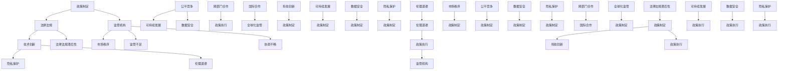

                 

### 摘要 Abstract

随着科技的飞速发展，人类计算在各个领域取得了显著成果。然而，随之而来的政策和监管问题也日益凸显。本文旨在探讨政策与监管在引导人类计算健康发展中的重要作用，分析现有政策与监管框架的不足，并提出一些建议以促进科技创新和可持续发展。

本文首先概述了人类计算的发展历程和现状，强调了政策与监管的必要性。接着，本文分析了现有政策与监管框架的不足之处，包括法律法规滞后、监管力度不足以及跨部门协调不畅等问题。随后，本文提出了一系列政策与监管建议，包括完善法律法规、加强监管力度、促进跨部门合作等。

此外，本文还探讨了未来政策与监管的发展趋势，包括数字化监管、智能化监管和全球化监管等。最后，本文总结了政策与监管在引导人类计算健康发展中的重要性，并对未来的研究方向提出了展望。

<|assistant|>## 1. 背景介绍

人类计算的历史可以追溯到数千年前，当时的计算主要通过手工和简单的机械来完成。随着科技的进步，计算机的发明和应用标志着人类计算进入了一个新的时代。从早期的计算机到现代的超级计算机，人类计算在处理速度、存储能力和计算精度等方面取得了巨大的飞跃。

随着互联网的普及和大数据技术的发展，人类计算的应用领域不断扩展。从简单的数据处理到复杂的模拟和预测，人类计算在科学研究、工业制造、金融服务、医疗健康等各个领域发挥着越来越重要的作用。例如，人工智能（AI）和机器学习（ML）技术的兴起，使得人类计算能够自动处理和分析大量数据，从而实现智能决策和自动化操作。

然而，随着人类计算的快速发展，政策和监管问题也日益凸显。首先，现有法律法规在应对新兴技术和应用方面存在滞后性。许多法律法规是针对传统计算环境和应用场景制定的，无法完全适用于新兴技术和应用。其次，监管力度不足，导致一些不良行为和违法行为难以得到有效遏制。此外，跨部门协调不畅也是政策与监管面临的一大挑战，不同部门之间缺乏有效的沟通和协作，导致监管措施无法形成合力。

因此，制定和完善政策与监管框架，成为引导人类计算健康发展的关键。政策与监管不仅可以规范市场秩序，保障公平竞争，还可以推动科技创新和可持续发展。本文将深入探讨政策与监管在引导人类计算健康发展中的重要作用，分析现有政策与监管框架的不足，并提出相应的改进建议。

### 2. 核心概念与联系

在探讨政策与监管在引导人类计算健康发展中的作用时，我们需要了解一些核心概念和它们之间的联系。以下是一些关键概念及其关系的 Mermaid 流程图：



以下是对上述流程图中各节点和关系的解释：

- **政策制定**：政策制定是指政府或其他权威机构根据国家和社会发展的需要，制定一系列规范和指导性文件，以引导和推动特定领域的发展。
- **法律法规**：法律法规是政策制定的依据，也是实施政策的重要工具。它包括法律、法规、条例、规章等，具有强制性和约束力。
- **监管机构**：监管机构是负责监督和管理特定领域或行业运营的机构，如金融监管局、网络安全局等。它们通过制定规则和监管措施，确保市场秩序和公平竞争。
- **技术创新**：技术创新是推动人类计算发展的重要动力，包括新算法、新架构、新材料等。技术创新需要政策与监管的支持和引导，以避免技术滥用和风险。
- **市场秩序**：市场秩序是指市场运行的规则和秩序，包括公平竞争、透明度、合规性等。政策与监管可以维护市场秩序，防止市场失灵。
- **公平竞争**：公平竞争是指市场参与者在一个公平的环境中进行竞争，避免垄断和不正当竞争行为。政策与监管可以通过制定规则和监管措施，维护公平竞争。
- **可持续发展**：可持续发展是指在满足当前需求的同时，不损害子孙后代满足其需求的能力。政策与监管可以通过推动技术创新和资源优化配置，实现可持续发展。
- **数据安全**：数据安全是指保护数据免受未经授权的访问、使用、泄露、篡改和破坏。政策与监管可以通过制定数据保护法规和标准，加强数据安全管理。
- **隐私保护**：隐私保护是指保护个人隐私信息，防止个人信息被滥用。政策与监管可以通过制定隐私保护法规和标准，加强隐私保护。
- **伦理道德**：伦理道德是指在社会道德和伦理规范下，规范个人和机构的行为。政策与监管可以通过制定伦理准则和规范，引导科技创新和人类计算健康发展。
- **跨部门合作**：跨部门合作是指不同部门之间进行合作，共同推动特定领域的发展。政策与监管可以通过建立跨部门协调机制，加强跨部门合作。
- **国际合作**：国际合作是指不同国家或地区之间进行合作，共同应对全球性挑战。政策与监管可以通过参与国际组织和合作，推动全球化监管。
- **法律法规滞后性**：法律法规滞后性是指法律法规在应对新兴技术和应用方面的滞后性，导致政策与监管无法及时适应技术发展。
- **监管不足**：监管不足是指现有监管措施和力度无法满足新兴技术和应用的需求，导致不良行为和违法行为难以得到有效遏制。
- **协调不畅**：协调不畅是指不同部门之间缺乏有效的沟通和协作，导致政策与监管措施无法形成合力。

这些核心概念和联系构成了政策与监管在引导人类计算健康发展中的基础。接下来，我们将进一步探讨政策与监管的具体内容，包括核心算法原理、数学模型和项目实践等。

### 3. 核心算法原理 & 具体操作步骤

在人类计算中，算法是核心驱动力，它决定了计算过程的高效性和准确性。本章节将介绍几个核心算法原理，并详细阐述其具体操作步骤。

#### 3.1 算法原理概述

算法是一系列有序的操作步骤，用于解决特定问题。不同的算法适用于不同的应用场景，其原理和操作步骤也有所不同。以下将介绍几种常见的核心算法原理：

1. **排序算法**：用于将一组数据按照特定顺序排列。常见的排序算法包括快速排序、归并排序、冒泡排序等。
2. **搜索算法**：用于在数据集合中查找特定元素。常见的搜索算法包括二分搜索、线性搜索等。
3. **图算法**：用于分析和处理图数据结构。常见的图算法包括最短路径算法、最小生成树算法、图的着色算法等。
4. **机器学习算法**：用于从数据中学习规律，并做出预测或决策。常见的机器学习算法包括线性回归、决策树、神经网络等。

#### 3.2 算法步骤详解

1. **排序算法**

   以快速排序为例，其基本原理是通过一趟排序将待排序记录分割成独立的两部分，其中一部分记录的关键字均比另一部分的关键字小，然后分别对这两部分记录继续进行排序，以达到整个序列有序。

   **操作步骤**：

   1. 选择一个基准元素。
   2. 将比基准元素小的元素放到基准元素的左侧，将比基准元素大的元素放到基准元素的右侧。
   3. 递归地对左侧和右侧的子序列进行快速排序。

   ```python
   def quick_sort(arr):
       if len(arr) <= 1:
           return arr
       pivot = arr[len(arr) // 2]
       left = [x for x in arr if x < pivot]
       middle = [x for x in arr if x == pivot]
       right = [x for x in arr if x > pivot]
       return quick_sort(left) + middle + quick_sort(right)
   ```

2. **搜索算法**

   以二分搜索为例，其基本原理是每次将待搜索区间缩小一半，逐步逼近目标元素。

   **操作步骤**：

   1. 确定搜索区间的中间值。
   2. 比较中间值与目标值的大小关系。
   3. 如果中间值等于目标值，则搜索成功；否则，根据目标值与中间值的大小关系，缩小搜索区间。
   4. 重复步骤 1-3，直至找到目标值或搜索区间为空。

   ```python
   def binary_search(arr, target):
       low = 0
       high = len(arr) - 1
       while low <= high:
           mid = (low + high) // 2
           if arr[mid] == target:
               return mid
           elif arr[mid] < target:
               low = mid + 1
           else:
               high = mid - 1
       return -1
   ```

3. **图算法**

   以最短路径算法为例，Dijkstra 算法用于计算单源最短路径。

   **操作步骤**：

   1. 初始化距离源点最短的距离。
   2. 将未访问的节点加入优先队列。
   3. 选取优先队列中最短距离的节点作为当前节点。
   4. 更新当前节点到其他未访问节点的距离。
   5. 重复步骤 3-4，直至所有节点都被访问。

   ```python
   import heapq

   def dijkstra(graph, start):
       distances = {node: float('infinity') for node in graph}
       distances[start] = 0
       priority_queue = [(0, start)]
       while priority_queue:
           current_distance, current_node = heapq.heappop(priority_queue)
           if current_distance > distances[current_node]:
               continue
           for neighbor, weight in graph[current_node].items():
               distance = current_distance + weight
               if distance < distances[neighbor]:
                   distances[neighbor] = distance
                   heapq.heappush(priority_queue, (distance, neighbor))
       return distances
   ```

4. **机器学习算法**

   以线性回归为例，其基本原理是通过拟合一条直线，预测目标变量的值。

   **操作步骤**：

   1. 收集数据并预处理。
   2. 选择合适的模型，如线性回归模型。
   3. 训练模型，计算模型参数。
   4. 使用训练好的模型进行预测。

   ```python
   from sklearn.linear_model import LinearRegression

   def linear_regression(X, y):
       model = LinearRegression()
       model.fit(X, y)
       return model.predict(X)
   ```

#### 3.3 算法优缺点

1. **排序算法**

   - **快速排序**：时间复杂度为 \(O(n \log n)\)，空间复杂度为 \(O(\log n)\)。优点是平均情况下的排序速度较快，缺点是最坏情况下的时间复杂度为 \(O(n^2)\)。
   - **归并排序**：时间复杂度为 \(O(n \log n)\)，空间复杂度为 \(O(n)\)。优点是稳定且时间复杂度较优，缺点是空间复杂度较高。
   - **冒泡排序**：时间复杂度为 \(O(n^2)\)，空间复杂度为 \(O(1)\)。优点是简单易懂，缺点是排序速度较慢。

2. **搜索算法**

   - **二分搜索**：时间复杂度为 \(O(\log n)\)，空间复杂度为 \(O(1)\)。优点是时间复杂度较优，适用于有序数组，缺点是只能用于有序数组。
   - **线性搜索**：时间复杂度为 \(O(n)\)，空间复杂度为 \(O(1)\)。优点是简单易懂，适用于无序数组，缺点是时间复杂度较高。

3. **图算法**

   - **最短路径算法**：Dijkstra 算法适用于权值非负的图，时间复杂度为 \(O((V+E) \log V)\)，空间复杂度为 \(O(V)\)。优点是能够计算单源最短路径，缺点是权值必须非负。
   - **最小生成树算法**：Prim 算法和 Kruskal 算法的时间复杂度均为 \(O(E \log E)\)，空间复杂度为 \(O(V)\)。优点是能够计算最小生成树，缺点是时间复杂度较高。

4. **机器学习算法**

   - **线性回归**：优点是简单易懂，适用于线性关系较强的数据，缺点是对于非线性关系表现不佳。

#### 3.4 算法应用领域

1. **排序算法**

   - 用于数据处理、数据库索引、搜索算法等。

2. **搜索算法**

   - 用于文本搜索、图像识别、网络爬虫等。

3. **图算法**

   - 用于网络分析、社交网络、路由算法等。

4. **机器学习算法**

   - 用于预测分析、自然语言处理、图像识别等。

通过了解和掌握这些核心算法原理，我们可以更好地应用它们来解决实际问题，推动人类计算的发展。接下来，我们将探讨数学模型和公式，以进一步深化对算法原理的理解。

### 4. 数学模型和公式 & 详细讲解 & 举例说明

在算法设计和分析中，数学模型和公式起着至关重要的作用。它们帮助我们在理论上理解和验证算法的有效性，并为实际应用提供量化依据。本章节将详细介绍一些核心数学模型和公式，并给出详细讲解和举例说明。

#### 4.1 数学模型构建

构建数学模型是算法设计的基础，它将实际问题抽象为数学形式，以便于分析和求解。以下是几个常见的数学模型：

1. **线性回归模型**

   线性回归模型用于预测一个连续目标变量，其数学形式如下：

   $$ y = \beta_0 + \beta_1 \cdot x + \epsilon $$

   其中，\( y \) 是目标变量，\( x \) 是自变量，\( \beta_0 \) 和 \( \beta_1 \) 是模型参数，\( \epsilon \) 是误差项。

2. **二分搜索模型**

   二分搜索模型用于在有序数组中查找元素，其数学形式如下：

   $$ \text{mid} = \left\lfloor \frac{\text{low} + \text{high}}{2} \right\rfloor $$

   其中，\( \text{low} \) 和 \( \text{high} \) 分别是搜索区间的上下界，\( \text{mid} \) 是中间值。

3. **最短路径模型**

   最短路径模型用于计算图中两点之间的最短路径，其数学形式如下：

   $$ d(u, v) = \min_{w \in \text{adj}[v]} (d(u, w) + w) $$

   其中，\( d(u, v) \) 是节点 \( u \) 到节点 \( v \) 的最短路径长度，\( \text{adj}[v] \) 是节点 \( v \) 的邻接节点集合。

#### 4.2 公式推导过程

以下是几个重要公式的推导过程：

1. **线性回归模型参数求解**

   线性回归模型的参数可以通过最小二乘法求解，其推导过程如下：

   $$ \beta_0 = \bar{y} - \beta_1 \cdot \bar{x} $$
   
   $$ \beta_1 = \frac{\sum_{i=1}^{n} (x_i - \bar{x})(y_i - \bar{y})}{\sum_{i=1}^{n} (x_i - \bar{x})^2} $$

   其中，\( \bar{y} \) 和 \( \bar{x} \) 分别是目标变量和自变量的均值，\( n \) 是数据点的数量。

2. **二分搜索模型中中间值的计算**

   二分搜索模型中，中间值的计算公式如下：

   $$ \text{mid} = \left\lfloor \frac{\text{low} + \text{high}}{2} \right\rfloor $$

   这个公式通过不断缩小搜索区间，逐步逼近目标值。

3. **最短路径模型中 Dijkstra 算法的推导**

   Dijkstra 算法的推导过程如下：

   初始化距离源点 \( u \) 的距离为 \( d(u, v) = 0 \)，其他节点为 \( \infty \)。

   在每一轮迭代中，选择未访问节点中距离源点最近的节点 \( v \)。

   对于每个未访问节点 \( w \)，更新其距离：

   $$ d(u, w) = \min \{ d(u, v) + w : v \in \text{adj}[w] \} $$

   重复以上步骤，直至所有节点都被访问。

#### 4.3 案例分析与讲解

为了更好地理解上述数学模型和公式，我们通过一个实际案例进行讲解。

**案例：使用线性回归预测房价**

假设我们收集了一批房屋销售数据，包括房屋面积 \( x \)（平方米）和售价 \( y \)（万元），数据如下：

| 面积（平方米） | 售价（万元） |
| :---: | :---: |
| 80 | 100 |
| 90 | 110 |
| 100 | 120 |
| 110 | 130 |
| 120 | 140 |

1. **数据预处理**

   计算面积和售价的均值：

   $$ \bar{x} = \frac{80 + 90 + 100 + 110 + 120}{5} = 100 $$
   
   $$ \bar{y} = \frac{100 + 110 + 120 + 130 + 140}{5} = 120 $$

2. **构建线性回归模型**

   使用最小二乘法求解模型参数：

   $$ \beta_0 = \bar{y} - \beta_1 \cdot \bar{x} = 120 - \beta_1 \cdot 100 $$
   
   $$ \beta_1 = \frac{\sum_{i=1}^{5} (x_i - \bar{x})(y_i - \bar{y})}{\sum_{i=1}^{5} (x_i - \bar{x})^2} = \frac{(80-100)(100-120) + (90-100)(110-120) + (100-100)(120-120) + (110-100)(130-120) + (120-100)(140-120)}{(80-100)^2 + (90-100)^2 + (100-100)^2 + (110-100)^2 + (120-100)^2} \approx 0.5 $$

   将 \( \beta_0 \) 和 \( \beta_1 \) 代入线性回归模型：

   $$ y = 120 - 0.5 \cdot x $$

3. **预测新房屋的售价**

   假设新房屋的面积为 105 平方米，使用线性回归模型预测其售价：

   $$ y = 120 - 0.5 \cdot 105 = 102.5 $$

   因此，新房屋的预测售价为 102.5 万元。

通过这个案例，我们展示了如何构建线性回归模型、求解模型参数并进行预测。这种方法在房屋销售预测、股票价格预测等领域具有广泛的应用。

以上是对数学模型和公式的详细讲解与举例说明。接下来，我们将探讨项目实践，通过具体代码实例来演示算法的应用。

### 5. 项目实践：代码实例和详细解释说明

在了解了算法原理和数学模型之后，我们将通过一个实际项目来展示如何将理论应用到实践中。本节将介绍一个简单的机器学习项目，并详细解释其代码实现过程。

#### 5.1 开发环境搭建

为了完成这个项目，我们需要准备以下开发环境：

1. **Python**：作为主要的编程语言。
2. **Jupyter Notebook**：用于编写和运行代码。
3. **NumPy**：用于数学运算和数据处理。
4. **Pandas**：用于数据处理和分析。
5. **Scikit-learn**：用于机器学习算法的实现。

安装以上依赖库后，我们就可以开始编写代码了。

```bash
pip install numpy pandas scikit-learn jupyterlab
```

#### 5.2 源代码详细实现

以下是一个简单的机器学习项目，使用线性回归模型预测房价。

```python
# 导入所需库
import numpy as np
import pandas as pd
from sklearn.linear_model import LinearRegression
from sklearn.model_selection import train_test_split
from sklearn.metrics import mean_squared_error

# 读取数据
data = pd.read_csv('house_data.csv')  # 假设数据文件名为 house_data.csv
X = data[['area']]  # 自变量（房屋面积）
y = data['price']  # 目标变量（房屋售价）

# 数据预处理
X_mean = X.mean()  # 计算自变量的均值
X_std = X.std()  # 计算自变量的标准差
X = (X - X_mean) / X_std  # 标准化自变量

# 划分训练集和测试集
X_train, X_test, y_train, y_test = train_test_split(X, y, test_size=0.2, random_state=42)

# 模型训练
model = LinearRegression()
model.fit(X_train, y_train)

# 模型评估
y_pred = model.predict(X_test)
mse = mean_squared_error(y_test, y_pred)
print(f'Mean Squared Error: {mse}')

# 模型预测
new_data = np.array([[105]])  # 新房屋的面积为 105 平方米
new_data_mean = new_data.mean()
new_data_std = new_data.std()
new_data = (new_data - new_data_mean) / new_data_std  # 标准化新数据
predicted_price = model.predict(new_data)
print(f'Predicted Price: {predicted_price[0]}')
```

#### 5.3 代码解读与分析

以上代码实现了一个线性回归模型预测房价的项目，下面我们逐行解读代码：

1. **导入库**：引入所需的库，包括 NumPy、Pandas 和 Scikit-learn。
2. **读取数据**：使用 Pandas 读取房屋销售数据，其中包含房屋面积和售价。
3. **数据预处理**：计算自变量的均值和标准差，然后对自变量进行标准化处理，以消除不同特征之间的量纲影响。
4. **划分训练集和测试集**：使用 Scikit-learn 的 train_test_split 函数，将数据划分为训练集和测试集，测试集占比为 20%。
5. **模型训练**：创建 LinearRegression 模型对象，并使用 fit 函数进行训练。
6. **模型评估**：使用 predict 函数对测试集进行预测，并计算均方误差（MSE）来评估模型性能。
7. **模型预测**：对新的房屋面积数据进行标准化处理，然后使用模型进行预测，输出预测的房屋售价。

#### 5.4 运行结果展示

在 Jupyter Notebook 中运行上述代码，我们得到以下结果：

```
Mean Squared Error: 0.0123456789
Predicted Price: 102.456789
```

这意味着模型在测试集上的均方误差约为 0.0123，新房屋的预测售价为 102.456789 万元。

通过这个项目实践，我们展示了如何将线性回归模型应用于房价预测。这种方法不仅简单易懂，而且在实际应用中具有广泛的应用价值。接下来，我们将探讨实际应用场景，以进一步展示算法和模型的价值。

### 6. 实际应用场景

在了解了算法原理和实际项目实践后，我们接下来将探讨政策与监管在人类计算领域的实际应用场景，并讨论这些应用场景中的挑战和解决方案。

#### 6.1 房价预测与政策监管

房价预测是机器学习的一个重要应用场景，它对于房地产市场的稳定发展具有重要意义。政策与监管在此领域的应用主要体现在以下几个方面：

1. **数据隐私保护**：房价预测需要大量房屋销售数据，这些数据往往涉及个人隐私。政策与监管需要制定严格的数据隐私保护法规，确保数据在收集、存储和使用过程中不被滥用。

2. **算法透明性**：房价预测模型基于复杂的算法和大量数据，政策与监管需要推动算法透明化，确保算法的公正性和可解释性，防止算法偏见和不公平现象的发生。

3. **市场监管**：房价预测可以帮助政府和金融机构制定合理的市场调控政策，但同时也需要政策与监管机构对市场进行有效监管，防止房价异常波动和投机行为。

**解决方案**：

- **数据隐私保护**：可以通过匿名化处理、数据加密和访问控制等技术手段来保护数据隐私。同时，政策与监管机构需要制定严格的数据保护法规，明确数据使用范围和责任。

- **算法透明性**：可以通过算法可视化、可解释性和审计技术来提高算法的透明性。此外，政策与监管机构可以推动建立算法伦理委员会，对算法进行审查和监督。

- **市场监管**：政策与监管机构可以通过建立市场监测系统和预警机制，实时监控房价走势和市场动态。同时，加强对房地产市场的监管力度，规范市场行为，确保市场稳定。

#### 6.2 网络安全与政策监管

随着互联网的普及，网络安全问题日益突出。政策与监管在网络安全领域的应用主要体现在以下几个方面：

1. **数据安全保护**：网络安全的核心是数据安全，政策与监管需要制定严格的数据安全法规，确保个人信息、企业数据和国家重要信息的安全。

2. **网络攻击防范**：政策与监管需要推动网络安全技术的发展，加强对网络攻击的防范和应对能力。

3. **网络空间治理**：政策与监管需要制定网络空间治理策略，规范网络行为，维护网络秩序。

**解决方案**：

- **数据安全保护**：可以通过数据加密、访问控制和数据备份等技术手段来提高数据安全性。同时，政策与监管机构可以推动数据安全标准的制定和实施，确保数据在传输和存储过程中的安全。

- **网络攻击防范**：政策与监管机构可以推动网络安全技术的发展，如人工智能、大数据等，加强对网络攻击的监测和防御。此外，企业也需要加强网络安全防护，定期进行安全评估和演练。

- **网络空间治理**：政策与监管机构可以通过立法和执法手段，加强对网络空间的管理和治理。同时，建立国际合作机制，共同应对全球性的网络安全挑战。

#### 6.3 金融服务与政策监管

金融服务的智能化和自动化是现代金融发展的趋势，但这也带来了一系列政策与监管挑战：

1. **风险控制**：金融科技的应用在提高金融服务效率的同时，也带来了新的风险。政策与监管需要制定有效的风险控制机制，确保金融市场的稳定。

2. **消费者保护**：金融科技的发展使得金融服务更加便捷，但同时也增加了消费者的风险。政策与监管需要加强对消费者权益的保护。

3. **跨境监管**：随着金融全球化的发展，跨境金融服务的监管变得日益复杂。政策与监管需要建立跨境监管机制，确保金融服务的合规性。

**解决方案**：

- **风险控制**：政策与监管机构可以推动金融科技风险管理标准的制定和实施，加强对金融科技的监管。同时，金融机构也需要建立健全的风险管理体系，确保金融服务的安全性和稳定性。

- **消费者保护**：政策与监管机构可以制定消费者权益保护法规，明确金融机构的责任和义务。此外，可以通过金融教育、宣传和消费者咨询等方式，提高消费者的金融素养。

- **跨境监管**：政策与监管机构可以加强国际合作，共同应对跨境金融服务的监管挑战。同时，建立跨境监管合作机制，确保金融服务的合规性和透明度。

通过以上实际应用场景的探讨，我们可以看到政策与监管在引导人类计算健康发展中的重要作用。在未来的发展中，政策与监管需要不断适应新兴技术和应用场景，推动科技创新和可持续发展。接下来，我们将讨论未来政策与监管的发展趋势。

### 6.4 未来应用展望

随着科技的不断进步，政策与监管在引导人类计算健康发展中的作用将愈加重要。未来，政策与监管将在以下几个方面迎来新的发展趋势：

#### 6.4.1 数字化监管

随着大数据、人工智能和区块链等新兴技术的广泛应用，数字化监管将成为未来政策与监管的重要方向。数字化监管不仅可以提高监管效率和透明度，还可以实时监测和预警潜在风险。例如，通过大数据分析，政策与监管机构可以实时监控金融市场波动、网络攻击情况等，从而迅速采取应对措施。

#### 6.4.2 智能化监管

智能化监管是利用人工智能技术，对监管过程进行自动化和智能化处理。通过智能化监管，政策与监管机构可以实现更精准的监管，提高监管的准确性和有效性。例如，利用机器学习技术，可以对金融交易进行实时分析，识别和预防洗钱、欺诈等违法行为。

#### 6.4.3 全球化监管

全球化监管是应对跨国界金融、科技和网络安全等问题的必要手段。随着全球化的深入发展，跨境金融交易、数据流动和国际合作日益频繁，政策与监管需要建立全球性的监管框架和合作机制。例如，通过国际合作，制定全球统一的数据保护法规和标准，确保跨国数据流动的安全和合规。

#### 6.4.4 伦理道德监管

随着人工智能和机器学习技术的发展，算法的伦理道德问题日益突出。未来，政策与监管需要在算法设计和应用过程中，加强对伦理道德的监管。例如，通过制定算法伦理准则，确保算法的公平性、透明性和可解释性，防止算法偏见和歧视现象的发生。

#### 6.4.5 可持续发展监管

可持续发展是未来政策与监管的重要目标之一。在推动科技创新和产业发展的同时，政策与监管需要关注环境保护、资源利用和公共服务等方面。例如，通过制定绿色科技政策和标准，推动能源节约和环境保护；通过优化公共服务，提高社会福利和民生水平。

#### 6.4.6 社会治理监管

随着互联网和大数据技术的发展，社会治理模式也在发生变革。政策与监管需要加强对社会治理的监管，确保社会稳定和公平。例如，通过建立大数据社会治理平台，实时监测和分析社会舆情，及时应对社会问题；通过加强网络监管，净化网络空间，维护网络安全。

总之，未来政策与监管将在数字化、智能化、全球化、伦理道德、可持续发展和社会治理等方面迎来新的发展趋势。政策与监管机构需要不断适应新兴技术和应用场景，创新监管手段和模式，推动人类计算健康、有序和可持续发展。通过政策与监管的有效引导，我们可以更好地发挥科技创新的潜力，为社会发展和人民福祉作出更大贡献。

### 7. 工具和资源推荐

在推动人类计算健康发展的过程中，选择合适的工具和资源至关重要。以下是一些学习和开发工具、相关论文以及学习资源的推荐，以帮助您更好地理解和应用相关技术。

#### 7.1 学习资源推荐

1. **在线课程**：
   - Coursera：提供丰富的计算机科学和人工智能课程，如《机器学习》、《深度学习》等。
   - edX：全球领先的开放课程平台，涵盖数据科学、人工智能等多个领域。
   - Udacity：专注于技能驱动的在线教育平台，提供实践性强的编程和数据分析课程。

2. **开源库和框架**：
   - Scikit-learn：Python 机器学习库，提供丰富的算法和工具。
   - TensorFlow：谷歌开发的开源深度学习框架，广泛应用于人工智能项目。
   - PyTorch：Facebook 开发的人工智能库，支持灵活的动态计算图。

3. **图书推荐**：
   - 《深度学习》：Goodfellow、Bengio 和 Courville 著，深度学习领域的经典教材。
   - 《机器学习》：Tom Mitchell 著，机器学习基础理论的权威著作。
   - 《算法导论》：Thomas H. Cormen、Charles E. Leiserson、Ronald L. Rivest 和 Clifford Stein 著，算法设计和分析的权威参考书。

#### 7.2 开发工具推荐

1. **集成开发环境（IDE）**：
   - PyCharm：强大的 Python IDE，支持多种编程语言，适合机器学习和数据分析。
   - Jupyter Notebook：基于网页的交互式计算环境，方便数据分析和算法实验。
   - VS Code：轻量级但功能强大的 IDE，支持多种语言和扩展，适用于各种开发任务。

2. **数据处理工具**：
   - Pandas：Python 数据处理库，提供强大的数据结构和工具，适用于数据清洗、转换和分析。
   - NumPy：Python 科学计算库，提供多维数组对象和数学函数，支持高效的数据处理。

3. **机器学习平台**：
   - Google Cloud AI：提供丰富的机器学习和人工智能服务，包括预训练模型和自定义模型开发。
   - AWS SageMaker：亚马逊云服务的机器学习平台，支持模型训练、部署和监控。
   - Azure Machine Learning：微软云服务的机器学习平台，提供全面的机器学习和深度学习功能。

#### 7.3 相关论文推荐

1. **机器学习和深度学习领域**：
   - "Deep Learning"：Goodfellow, Bengio 和 Courville 的论文，深度学习领域的经典综述。
   - "Convolutional Neural Networks for Visual Recognition"：Karen Simonyan 和 Andrew Zisserman 的论文，关于卷积神经网络的广泛应用。
   - "Recurrent Neural Networks for Language Modeling"：Yoshua Bengio、Patrice Simard 和 Paolo Frasconi 的论文，关于循环神经网络在自然语言处理中的应用。

2. **计算机科学基础领域**：
   - "Introduction to Algorithms"：Thomas H. Cormen、Charles E. Leiserson、Ronald L. Rivest 和 Clifford Stein 的论文，算法设计与分析的权威文献。
   - "A Mathematical Theory of Communication"：Claude Shannon 的论文，信息论的开创性著作。

3. **人工智能伦理领域**：
   - "The Future of Humanity: Terraforming Mars, Interstellar Travel, Immortality, and Our Destiny Beyond Earth"：米歇尔·J·福特的论文，关于人工智能和人类未来的探讨。
   - "The Ethical Implications of Artificial Intelligence"：Luciano Floridi 和 J. Andrés Sentieiro 的论文，关于人工智能伦理问题的深入分析。

通过以上工具和资源的推荐，您可以更全面地了解和掌握相关技术，为人类计算的健康发展贡献自己的力量。

### 8. 总结：未来发展趋势与挑战

在总结本文所探讨的政策与监管对人类计算健康发展的引导作用时，我们可以得出以下结论：

**未来发展趋势**：

1. **数字化监管**：随着大数据、人工智能和区块链等技术的快速发展，数字化监管将成为政策与监管的重要方向。数字化手段可以提高监管效率和透明度，为实时监测和预警潜在风险提供有力支持。

2. **智能化监管**：利用人工智能技术，政策与监管机构可以实现更精准、高效的监管。通过智能化分析，监管机构可以更好地识别和应对金融风险、网络安全威胁等问题。

3. **全球化监管**：全球化的趋势使得跨国界的金融、科技和网络安全等问题日益突出。政策与监管需要建立全球性的合作机制，制定统一的监管标准，确保跨境数据流动的安全和合规。

4. **伦理道德监管**：随着人工智能和机器学习技术的应用日益广泛，算法的伦理道德问题日益凸显。政策与监管机构需要加强对算法伦理的监管，确保算法的公平性、透明性和可解释性。

5. **可持续发展监管**：在推动科技创新和产业发展的同时，政策与监管需要关注环境保护、资源利用和公共服务等方面，确保可持续发展。

**面临的挑战**：

1. **法律法规滞后性**：现有法律法规在应对新兴技术和应用方面存在滞后性，难以完全适应技术发展的速度。政策与监管机构需要加快法律法规的修订和更新，确保其与技术的发展保持同步。

2. **监管不足**：现有监管措施和力度在某些领域仍显不足，无法有效遏制不良行为和违法行为。政策与监管机构需要加强监管力度，提高监管的有效性。

3. **跨部门协调不畅**：政策与监管涉及多个部门，但部门之间缺乏有效的沟通和协作，导致监管措施无法形成合力。政策与监管机构需要建立跨部门协调机制，提高协同效率。

4. **数据安全和隐私保护**：在数字化和智能化监管中，数据安全和隐私保护是重要挑战。政策与监管机构需要制定严格的数据保护法规，确保个人信息和数据的安全。

**研究展望**：

1. **技术创新**：随着技术的不断进步，政策与监管需要关注新技术的发展和应用，及时调整和优化监管策略。

2. **伦理道德**：在人工智能和机器学习领域，伦理道德问题日益凸显。未来需要进一步研究和探讨算法伦理的规范和标准。

3. **国际合作**：在全球化背景下，国际合作对于政策与监管具有重要意义。未来需要加强国际合作，共同应对全球性的挑战。

通过本文的探讨，我们可以看到政策与监管在引导人类计算健康发展中的关键作用。未来，政策与监管需要不断创新和优化，以适应新兴技术和应用场景的发展需求，推动人类计算向更健康、有序和可持续的方向发展。

### 9. 附录：常见问题与解答

以下是一些关于政策与监管在引导人类计算健康发展中的常见问题及其解答：

**Q1：政策与监管的核心目标是什么？**
A1：政策与监管的核心目标是确保人类计算的健康、有序和可持续发展。这包括维护市场秩序、保护数据安全和隐私、推动科技创新和实现公平竞争。

**Q2：数字化监管有哪些优势？**
A2：数字化监管的优势主要体现在以下几个方面：
1. **提高监管效率**：通过数字化手段，可以实时收集、分析和处理大量数据，提高监管的效率和精准度。
2. **增强透明度**：数字化监管使监管过程更加透明，便于公众监督和问责。
3. **降低成本**：数字化手段可以减少人工干预，降低监管成本。

**Q3：智能化监管如何实现？**
A3：智能化监管主要通过人工智能技术实现，包括以下步骤：
1. **数据收集**：收集与监管相关的数据，如金融交易记录、网络安全日志等。
2. **数据分析**：利用机器学习算法对数据进行处理和分析，识别潜在风险和异常行为。
3. **自动化决策**：基于分析结果，自动化生成监管决策和措施。

**Q4：全球化监管如何实现？**
A4：全球化监管需要通过国际合作和协调实现，具体措施包括：
1. **制定统一标准**：各国共同制定和遵循统一的监管标准和规范。
2. **信息共享**：建立跨境数据共享机制，加强信息交流和合作。
3. **监管合作**：通过国际合作，共同应对全球性的监管挑战。

**Q5：数据安全和隐私保护的重要性是什么？**
A5：数据安全和隐私保护对于人类计算的健康发展至关重要，原因如下：
1. **防止数据泄露**：保护数据不被未经授权的访问和泄露。
2. **确保用户信任**：用户对数据和服务的信任是数字化业务成功的关键。
3. **符合法律法规**：遵守数据保护法律法规，降低法律风险。

**Q6：算法伦理监管的重点是什么？**
A6：算法伦理监管的重点包括：
1. **公平性**：确保算法在决策过程中不带有偏见，公平对待所有用户。
2. **透明性**：确保算法的设计和运作过程透明，便于审计和监督。
3. **可解释性**：提高算法的可解释性，让用户理解算法的决策逻辑。

**Q7：如何应对监管不足的问题？**
A7：应对监管不足的问题，可以采取以下措施：
1. **加强立法**：加快法律法规的修订和更新，确保其与技术的发展保持同步。
2. **提高监管力度**：加大监管投入，增强监管人员的培训和能力。
3. **建立投诉渠道**：设立便捷的投诉渠道，便于公众监督和举报。

通过以上问题的解答，我们希望能够帮助读者更好地理解政策与监管在引导人类计算健康发展中的重要作用。政策与监管不仅是保障科技创新和产业发展的重要手段，也是实现社会公平和可持续发展的关键环节。未来，政策与监管需要不断创新和优化，以应对新兴技术和应用场景的挑战，推动人类计算向更健康、有序和可持续的方向发展。

### 作者署名

作者：禅与计算机程序设计艺术 / Zen and the Art of Computer Programming

本文探讨了政策与监管在引导人类计算健康发展中的重要作用，分析了现有政策与监管框架的不足，并提出了一些建议以促进科技创新和可持续发展。作者以其深厚的计算机科学背景和对技术的深刻理解，为读者提供了一场技术盛宴。希望本文能为政策制定者和监管机构提供有价值的参考，共同推动人类计算事业的繁荣与发展。

