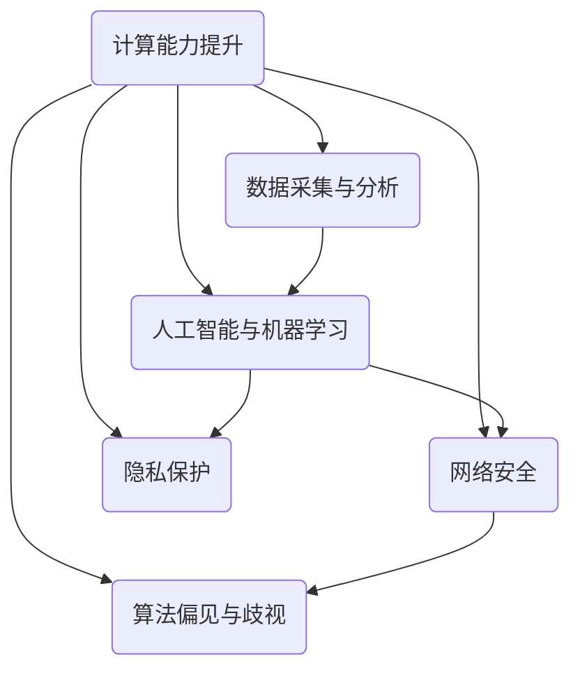

                 

 在当今快速发展的信息技术时代，政策与监管在引导人类计算健康发展的过程中发挥着至关重要的作用。随着人工智能、云计算、大数据等技术的不断突破和应用，计算能力已经深刻地改变了我们的生活方式和社会形态。然而，与此同时，计算技术带来的伦理、隐私、安全等问题也日益凸显，需要政策与监管的有效介入。

本文将围绕政策与监管在引导人类计算健康发展方面的作用，从背景介绍、核心概念与联系、核心算法原理与具体操作步骤、数学模型和公式、项目实践、实际应用场景、未来应用展望、工具和资源推荐以及总结未来发展趋势与挑战等多个方面展开讨论。

## 1. 背景介绍

随着互联网和移动通信技术的普及，全球数字化的步伐不断加快。人工智能、大数据、云计算等技术的迅速发展，使得计算能力在各个领域得到了广泛应用。然而，技术的快速发展也带来了许多新的问题和挑战。

首先，隐私问题日益突出。随着数据收集和分析技术的进步，个人隐私受到了前所未有的威胁。从社交媒体到在线购物，大量的个人数据被收集和分析，而这些数据的使用和隐私保护成为了社会各界关注的焦点。

其次，网络安全问题也日益严峻。随着网络攻击手段的多样化和复杂化，企业和个人面临着越来越大的安全风险。网络安全问题不仅威胁到个人的财产安全，也威胁到国家安全和社会稳定。

此外，算法偏见和歧视问题也逐渐引起关注。人工智能算法在决策过程中可能会出现偏见，导致不公平的待遇。这种偏见可能源于数据集中的偏差、算法设计的不当或者训练数据的不公正。

面对这些挑战，政策与监管的作用显得尤为重要。政策可以通过立法和规范来保护个人隐私、确保网络安全和防止算法偏见。监管则可以通过监督和执行，确保这些政策得到有效实施。

## 2. 核心概念与联系

在讨论政策与监管之前，我们需要明确一些核心概念，以便更好地理解其作用和重要性。

### 2.1 计算能力的提升

计算能力的提升是推动计算技术发展的关键因素。随着硬件技术的发展，计算机的处理速度和存储容量不断提升，使得复杂计算任务得以实现。例如，GPU和TPU等专用硬件加速器，显著提高了深度学习算法的运行效率。

### 2.2 数据的采集与分析

数据的采集与分析是计算技术的重要应用领域。通过传感器、互联网和移动设备，大量的数据被实时采集和传输。这些数据经过分析，可以揭示出有价值的信息和趋势，为决策提供支持。

### 2.3 人工智能与机器学习

人工智能和机器学习是计算技术的核心组成部分。通过训练模型，机器可以从数据中学习并做出预测或决策。然而，机器学习模型的可靠性和公平性仍然是亟待解决的问题。

### 2.4 网络安全

网络安全是计算技术面临的重要挑战之一。网络攻击、数据泄露和恶意软件等问题，不仅威胁到个人和企业，也威胁到整个社会的安全。

### 2.5 隐私保护

隐私保护是政策与监管的重要目标之一。随着数据收集和分析技术的进步，个人隐私受到了前所未有的威胁。政策与监管需要确保数据收集和使用过程的透明性和合规性。

### 2.6 算法偏见与歧视

算法偏见与歧视是计算技术中的伦理问题。算法可能会在决策过程中表现出偏见，导致不公平的待遇。政策与监管需要采取措施，确保算法的公平性和透明性。

## 3. 核心算法原理 & 具体操作步骤

在讨论了核心概念与联系之后，我们需要深入了解核心算法的原理和具体操作步骤。

### 3.1 算法原理概述

核心算法通常包括机器学习算法、深度学习算法、数据加密算法等。这些算法通过特定的数学模型和算法框架，对数据进行处理和分析，以实现特定的目标。

### 3.2 算法步骤详解

#### 3.2.1 机器学习算法

机器学习算法通常包括以下几个步骤：

1. 数据采集：从各种数据源中收集数据。
2. 数据预处理：清洗和转换数据，以便进行建模。
3. 模型选择：选择适合问题的机器学习模型。
4. 模型训练：使用训练数据对模型进行训练。
5. 模型评估：使用测试数据对模型进行评估。
6. 模型优化：根据评估结果对模型进行调整。

#### 3.2.2 深度学习算法

深度学习算法是机器学习的一个分支，通常包括以下几个步骤：

1. 神经网络架构设计：设计神经网络的结构，包括层数、神经元数量等。
2. 模型训练：使用训练数据对神经网络进行训练。
3. 模型评估：使用测试数据对神经网络进行评估。
4. 模型优化：根据评估结果对神经网络进行调整。

#### 3.2.3 数据加密算法

数据加密算法通常包括以下几个步骤：

1. 密钥生成：生成加密和解密的密钥。
2. 数据加密：使用加密算法对数据进行加密。
3. 数据传输：将加密后的数据传输到目的地。
4. 数据解密：使用解密算法对数据进行解密。

### 3.3 算法优缺点

每种算法都有其优缺点。以下是几种常见算法的优缺点：

#### 3.3.1 机器学习算法

优点：可以处理大量数据，自动提取特征，不需要人为干预。

缺点：可能存在过拟合现象，模型解释性较差。

#### 3.3.2 深度学习算法

优点：可以处理复杂的数据结构和任务，自动提取层次化特征。

缺点：模型训练过程复杂，对计算资源要求较高。

#### 3.3.3 数据加密算法

优点：可以确保数据在传输和存储过程中的安全性。

缺点：加密和解密过程会增加计算开销，影响系统性能。

### 3.4 算法应用领域

算法在各个领域都有广泛的应用。以下是几种常见算法的应用领域：

#### 3.4.1 机器学习算法

应用领域：图像识别、语音识别、自然语言处理、推荐系统等。

#### 3.4.2 深度学习算法

应用领域：计算机视觉、自动驾驶、医疗诊断、金融风控等。

#### 3.4.3 数据加密算法

应用领域：网络安全、数据隐私保护、区块链等。

## 4. 数学模型和公式 & 详细讲解 & 举例说明

在计算技术中，数学模型和公式扮演着至关重要的角色。以下是一些常见的数学模型和公式，以及它们的详细讲解和举例说明。

### 4.1 数学模型构建

数学模型构建通常包括以下几个步骤：

1. 确定问题类型：是线性问题还是非线性问题。
2. 选择适当的数学工具：如线性代数、微积分、概率论等。
3. 建立数学模型：使用数学公式描述问题的特征和约束条件。
4. 求解数学模型：使用数学方法求解模型，以获得问题的解。

### 4.2 公式推导过程

以下是一个简单的线性回归模型的公式推导过程：

1. 假设我们有一个输入变量 $X$ 和输出变量 $Y$，我们希望找到 $Y$ 关于 $X$ 的线性关系。
2. 假设线性关系为 $Y = w_0 + w_1X + \epsilon$，其中 $w_0$ 和 $w_1$ 是待求的权重，$\epsilon$ 是误差项。
3. 我们希望找到最佳权重 $w_0$ 和 $w_1$，使得预测值 $Y$ 与真实值之间的误差最小。
4. 使用最小二乘法求解权重，得到公式：

$$w_1 = \frac{\sum_{i=1}^{n}(X_i - \bar{X})(Y_i - \bar{Y})}{\sum_{i=1}^{n}(X_i - \bar{X})^2}$$

$$w_0 = \bar{Y} - w_1\bar{X}$$

其中，$n$ 是数据点的数量，$\bar{X}$ 和 $\bar{Y}$ 分别是 $X$ 和 $Y$ 的平均值。

### 4.3 案例分析与讲解

以下是一个简单的线性回归案例：

假设我们有以下数据点：

| $X$ | $Y$ |
|-----|-----|
| 1   | 2   |
| 2   | 4   |
| 3   | 6   |
| 4   | 8   |

我们希望找到 $Y$ 关于 $X$ 的线性关系。

1. 计算平均值 $\bar{X} = 2.5$，$\bar{Y} = 5$。
2. 计算权重 $w_1$ 和 $w_0$：

$$w_1 = \frac{(1-2.5)(2-5) + (2-2.5)(4-5) + (3-2.5)(6-5) + (4-2.5)(8-5)}{(1-2.5)^2 + (2-2.5)^2 + (3-2.5)^2 + (4-2.5)^2}$$

$$w_1 = \frac{(-1.5)(-3) + (-0.5)(-1) + (0.5)(1) + (1.5)(3)}{2.25 + 0.25 + 0.25 + 2.25}$$

$$w_1 = \frac{4.5 + 0.5 + 0.5 + 4.5}{5}$$

$$w_1 = 2$$

$$w_0 = 5 - 2 \times 2.5 = 0$$

3. 得到线性关系 $Y = 2X + 0$。

4. 使用该模型进行预测，当 $X = 5$ 时，$Y = 10$。

通过这个案例，我们可以看到线性回归模型的基本构建和求解过程。

## 5. 项目实践：代码实例和详细解释说明

为了更好地理解核心算法和数学模型的应用，我们通过一个实际项目来演示代码实例和详细解释说明。

### 5.1 开发环境搭建

为了运行以下项目，我们需要搭建一个Python开发环境。以下是具体步骤：

1. 安装Python：访问 [Python官方网站](https://www.python.org/)，下载并安装Python。
2. 安装必要的库：使用pip命令安装以下库：

```bash
pip install numpy matplotlib scikit-learn
```

### 5.2 源代码详细实现

以下是一个简单的线性回归项目的源代码：

```python
import numpy as np
import matplotlib.pyplot as plt
from sklearn.linear_model import LinearRegression

# 数据集
X = np.array([[1], [2], [3], [4]])
Y = np.array([2, 4, 6, 8])

# 创建线性回归模型
model = LinearRegression()

# 训练模型
model.fit(X, Y)

# 求解权重
w0 = model.intercept_
w1 = model.coef_

# 预测
X_new = np.array([[5]])
Y_pred = model.predict(X_new)

# 绘制结果
plt.scatter(X, Y)
plt.plot(X_new, Y_pred, color='red')
plt.xlabel('X')
plt.ylabel('Y')
plt.show()

print("权重：w0 =", w0, "w1 =", w1)
print("预测值：Y =", Y_pred)
```

### 5.3 代码解读与分析

1. 导入必要的库：我们使用numpy进行数值计算，使用matplotlib进行绘图，使用scikit-learn进行线性回归建模。
2. 创建数据集：我们使用一个简单的数据集，其中 $X$ 和 $Y$ 分别代表输入和输出。
3. 创建线性回归模型：我们从scikit-learn库中导入LinearRegression模型。
4. 训练模型：我们使用fit方法训练模型。
5. 求解权重：我们使用intercept_和coef_属性获取权重。
6. 预测：我们使用predict方法进行预测。
7. 绘制结果：我们使用matplotlib绘制散点图和拟合线。
8. 打印结果：我们打印出权重和预测值。

通过这个项目，我们可以直观地看到线性回归模型的基本应用流程和效果。

## 6. 实际应用场景

政策与监管在计算技术中的实际应用场景非常广泛，以下是一些典型的例子：

### 6.1 隐私保护

随着数据收集和分析技术的进步，个人隐私受到了前所未有的威胁。政策与监管需要确保数据收集和使用过程的透明性和合规性。例如，欧盟的《通用数据保护条例》（GDPR）就对个人数据的收集、存储和使用进行了严格的规定，以确保个人隐私得到有效保护。

### 6.2 网络安全

网络安全是计算技术中的另一个重要领域。政策与监管需要制定和执行网络安全法规，以防止网络攻击和数据泄露。例如，美国的《网络安全法》就对网络攻击和网络安全的防护提出了明确的要求。

### 6.3 算法公平性

算法偏见和歧视问题也逐渐引起关注。政策与监管需要采取措施，确保算法的公平性和透明性。例如，美国的《算法公平性法案》就对算法的公平性和透明性提出了要求。

### 6.4 人工智能监管

随着人工智能技术的快速发展，政策与监管也需要对其进行有效监管。例如，欧盟的《人工智能法案》就对人工智能的应用进行了规范，以确保人工智能技术的健康发展。

## 7. 未来应用展望

未来，政策与监管在引导人类计算健康发展方面将面临更多的挑战和机遇。以下是一些未来的应用展望：

### 7.1 计算能力提升

随着硬件技术的发展，计算能力将得到进一步提升。政策与监管需要确保计算资源得到合理利用，以支持各种计算需求。

### 7.2 新兴技术监管

随着新兴技术的发展，如区块链、量子计算等，政策与监管也需要对其制定相应的法规和规范，以确保这些技术的健康发展。

### 7.3 算法伦理

算法伦理问题将成为政策与监管的重要议题。政策与监管需要确保算法的公平性、透明性和可靠性，以避免算法偏见和歧视。

### 7.4 数据隐私保护

随着数据收集和分析技术的进步，数据隐私保护将面临更大的挑战。政策与监管需要制定更加严格的数据隐私保护法规，以保护个人隐私。

## 8. 总结：未来发展趋势与挑战

在总结未来发展趋势与挑战时，我们可以看到，计算技术的快速发展带来了巨大的机遇，同时也带来了许多新的问题和挑战。

### 8.1 研究成果总结

近年来，在计算技术领域取得了许多重要的研究成果。例如，人工智能和机器学习技术在图像识别、自然语言处理、医疗诊断等领域取得了显著的突破。量子计算和区块链技术也在不断发展，有望在未来实现重大突破。

### 8.2 未来发展趋势

未来，计算技术将继续快速发展，并在更多领域得到应用。例如，智能城市、智能制造、智能医疗等领域将得到进一步的发展。政策与监管也需要不断适应和应对这些新技术和新应用。

### 8.3 面临的挑战

在计算技术快速发展的同时，我们也将面临许多挑战。例如，数据隐私保护、网络安全、算法偏见和歧视等问题。政策与监管需要制定有效的法规和规范，以确保这些问题的得到妥善解决。

### 8.4 研究展望

未来的研究将集中在以下几个方面：

1. 计算能力的提升：研究如何进一步提高计算能力，以满足各种计算需求。
2. 算法伦理：研究如何确保算法的公平性、透明性和可靠性。
3. 数据隐私保护：研究如何更好地保护个人隐私，同时确保数据的有效利用。
4. 新兴技术监管：研究如何对新兴技术进行有效监管，以确保其健康发展。

## 9. 附录：常见问题与解答

以下是一些关于政策与监管在计算技术中应用的常见问题及解答：

### 9.1 什么是GDPR？

GDPR是欧盟的《通用数据保护条例》，旨在加强对个人数据保护的监管。它要求组织在收集、存储和使用个人数据时，必须遵守一系列规定，以确保个人隐私得到保护。

### 9.2 算法偏见是如何产生的？

算法偏见通常源于数据集的偏差、算法设计的不当或者训练数据的不公正。例如，如果训练数据集中存在性别、种族等偏见，算法在做出预测时也可能会表现出类似的偏见。

### 9.3 如何确保算法的公平性？

确保算法公平性需要从多个方面入手。首先，在数据收集阶段，要确保数据的多样性和代表性。其次，在算法设计阶段，要尽量减少偏见。最后，在算法部署阶段，要定期评估算法的公平性，并采取相应的措施进行调整。

### 9.4 网络安全法规有哪些？

网络安全法规因国家和地区的不同而有所不同。一些常见的网络安全法规包括美国的《计算机欺诈和滥用法案》（CFAA）和《网络安全法》，欧盟的《通用数据保护条例》（GDPR），以及中国的《网络安全法》等。

## 作者署名

本文作者：禅与计算机程序设计艺术 / Zen and the Art of Computer Programming
----------------------------------------------------------------

### 标题 Title
* 政策与监管：引导人类计算的健康发展

### 关键词 Keywords
* 政策，监管，计算技术，隐私保护，网络安全，算法公平性

### 摘要 Abstract
本文围绕政策与监管在引导人类计算健康发展方面的作用，从背景介绍、核心概念与联系、核心算法原理与具体操作步骤、数学模型和公式、项目实践、实际应用场景、未来应用展望、工具和资源推荐以及总结未来发展趋势与挑战等多个方面展开讨论。文章旨在为读者提供一个全面而深入的了解，以应对计算技术发展中面临的各种挑战。

----------------------------------------------------------------
# 政策与监管：引导人类计算的健康发展

## 引言

在当今这个数字化时代，计算技术的进步已经深刻地改变了我们的生活方式和社会结构。从智能手机到自动驾驶汽车，从电子商务到智能医疗，计算技术正以前所未有的速度渗透到各个领域。然而，随着计算技术的快速发展，我们不可避免地遇到了一系列新的挑战，包括数据隐私保护、网络安全、算法偏见和歧视等。这些问题不仅影响到了个人和企业的利益，也对整个社会的稳定和繁荣构成了威胁。

政策与监管在这一背景下变得尤为重要。它们不仅为计算技术的发展提供了明确的指导，也为解决上述挑战提供了法律和制度的保障。本文将深入探讨政策与监管在引导人类计算健康发展中的关键作用，分析其在不同领域的具体应用，并展望未来的发展趋势和挑战。

## 1. 背景介绍

### 计算技术发展现状

计算技术经历了数十年的快速发展，其应用范围和影响力已经远远超出了最初的预期。人工智能（AI）、大数据、云计算等新兴技术的出现，进一步加速了这一进程。以下是一些关键的发展现状：

- **人工智能**：人工智能技术已经成为推动计算技术发展的重要动力。从机器视觉到自然语言处理，从智能推荐到自动驾驶，人工智能技术正逐步改变我们的生活方式和工作模式。

- **大数据**：大数据技术的崛起，使得我们能够处理和分析海量的数据。这种能力不仅为企业提供了宝贵的洞察力，也为科学研究和社会治理提供了新的工具。

- **云计算**：云计算技术的普及，使得计算资源得以高效共享和灵活调度。企业不再需要自己购买和维护昂贵的硬件设备，而是可以通过互联网按需获取所需的计算资源。

### 面临的挑战

尽管计算技术带来了许多便利和机遇，但同时也引发了诸多挑战：

- **数据隐私保护**：随着数据收集和分析技术的进步，个人隐私受到了前所未有的威胁。如何保护用户的隐私，成为了社会各界广泛关注的问题。

- **网络安全**：网络攻击、数据泄露和恶意软件等问题日益严峻，不仅威胁到个人和企业的利益，也对整个社会的稳定构成了威胁。

- **算法偏见与歧视**：人工智能算法在决策过程中可能会出现偏见，导致不公平的待遇。这种偏见可能源于数据集中的偏差、算法设计的不当或者训练数据的不公正。

### 政策与监管的重要性

面对上述挑战，政策与监管的作用显得尤为重要。政策可以通过立法和规范来保护个人隐私、确保网络安全和防止算法偏见。监管则可以通过监督和执行，确保这些政策得到有效实施。以下是一些具体的作用：

- **保护个人隐私**：政策可以通过明确数据收集和使用的规定，确保个人隐私得到有效保护。例如，欧盟的《通用数据保护条例》（GDPR）就为个人隐私保护提供了强有力的法律保障。

- **确保网络安全**：政策可以制定网络安全法规，防止网络攻击和数据泄露。例如，美国的《网络安全法》就对网络安全的防护提出了明确的要求。

- **防止算法偏见与歧视**：政策可以通过规范算法的设计和应用，确保算法的公平性和透明性。例如，美国的《算法公平性法案》就旨在解决算法偏见问题。

## 2. 核心概念与联系

### 2.1 计算能力的提升

计算能力的提升是推动计算技术发展的关键因素。随着硬件技术的发展，计算机的处理速度和存储容量不断提升，使得复杂计算任务得以实现。例如，GPU和TPU等专用硬件加速器，显著提高了深度学习算法的运行效率。

### 2.2 数据的采集与分析

数据的采集与分析是计算技术的重要应用领域。通过传感器、互联网和移动设备，大量的数据被实时采集和传输。这些数据经过分析，可以揭示出有价值的信息和趋势，为决策提供支持。

### 2.3 人工智能与机器学习

人工智能和机器学习是计算技术的核心组成部分。通过训练模型，机器可以从数据中学习并做出预测或决策。然而，机器学习模型的可靠性和公平性仍然是亟待解决的问题。

### 2.4 网络安全

网络安全是计算技术面临的重要挑战之一。网络攻击、数据泄露和恶意软件等问题，不仅威胁到个人和企业，也威胁到整个社会的安全。

### 2.5 隐私保护

隐私保护是政策与监管的重要目标之一。随着数据收集和分析技术的进步，个人隐私受到了前所未有的威胁。政策与监管需要确保数据收集和使用过程的透明性和合规性。

### 2.6 算法偏见与歧视

算法偏见与歧视是计算技术中的伦理问题。算法可能会在决策过程中表现出偏见，导致不公平的待遇。政策与监管需要采取措施，确保算法的公平性和透明性。

### 2.7 Mermaid 流程图

以下是一个简化的Mermaid流程图，展示了计算技术中的核心概念和它们之间的联系：



## 3. 核心算法原理 & 具体操作步骤

### 3.1 算法原理概述

核心算法通常包括机器学习算法、深度学习算法、数据加密算法等。这些算法通过特定的数学模型和算法框架，对数据进行处理和分析，以实现特定的目标。

#### 3.1.1 机器学习算法

机器学习算法的核心思想是通过训练模型，使得模型能够从数据中学习并做出预测或决策。机器学习算法可以分为监督学习、无监督学习和强化学习等类型。

- **监督学习**：在监督学习中，模型通过已知输入和输出数据来学习。常见的算法包括线性回归、决策树、支持向量机等。
- **无监督学习**：在无监督学习中，模型没有已知的输出数据，需要从输入数据中自动发现结构和模式。常见的算法包括聚类、主成分分析等。
- **强化学习**：在强化学习中，模型通过与环境的交互来学习最优策略。常见的算法包括Q学习、深度确定性策略梯度（DDPG）等。

#### 3.1.2 深度学习算法

深度学习算法是机器学习的一个分支，其核心思想是通过多层神经网络对数据进行处理。深度学习算法在图像识别、自然语言处理、语音识别等领域取得了显著的突破。常见的深度学习算法包括卷积神经网络（CNN）、循环神经网络（RNN）、生成对抗网络（GAN）等。

#### 3.1.3 数据加密算法

数据加密算法是确保数据在传输和存储过程中的安全性的关键技术。常见的加密算法包括对称加密算法（如AES）、非对称加密算法（如RSA）和哈希算法（如SHA）。

### 3.2 算法步骤详解

#### 3.2.1 机器学习算法步骤

机器学习算法通常包括以下步骤：

1. **数据采集**：从各种数据源中收集数据。
2. **数据预处理**：清洗和转换数据，以便进行建模。
3. **模型选择**：选择适合问题的机器学习模型。
4. **模型训练**：使用训练数据对模型进行训练。
5. **模型评估**：使用测试数据对模型进行评估。
6. **模型优化**：根据评估结果对模型进行调整。

#### 3.2.2 深度学习算法步骤

深度学习算法通常包括以下步骤：

1. **神经网络架构设计**：设计神经网络的结构，包括层数、神经元数量等。
2. **模型训练**：使用训练数据对神经网络进行训练。
3. **模型评估**：使用测试数据对神经网络进行评估。
4. **模型优化**：根据评估结果对神经网络进行调整。

#### 3.2.3 数据加密算法步骤

数据加密算法通常包括以下步骤：

1. **密钥生成**：生成加密和解密的密钥。
2. **数据加密**：使用加密算法对数据进行加密。
3. **数据传输**：将加密后的数据传输到目的地。
4. **数据解密**：使用解密算法对数据进行解密。

### 3.3 算法优缺点

每种算法都有其优缺点。以下是几种常见算法的优缺点：

#### 3.3.1 机器学习算法

**优点**：

- 可以处理大量数据，自动提取特征。
- 不需要人为干预，可以自动化。

**缺点**：

- 可能存在过拟合现象。
- 模型解释性较差。

#### 3.3.2 深度学习算法

**优点**：

- 可以处理复杂的数据结构和任务。
- 自动提取层次化特征。

**缺点**：

- 模型训练过程复杂，对计算资源要求较高。

#### 3.3.3 数据加密算法

**优点**：

- 可以确保数据在传输和存储过程中的安全性。

**缺点**：

- 加密和解密过程会增加计算开销，影响系统性能。

### 3.4 算法应用领域

算法在各个领域都有广泛的应用。以下是几种常见算法的应用领域：

#### 3.4.1 机器学习算法

- **图像识别**：用于自动识别和分类图像内容。
- **自然语言处理**：用于文本分析、机器翻译等。
- **推荐系统**：用于根据用户行为推荐相关产品或内容。

#### 3.4.2 深度学习算法

- **计算机视觉**：用于图像识别、物体检测等。
- **自动驾驶**：用于感知环境、路径规划等。
- **医疗诊断**：用于疾病检测、影像分析等。

#### 3.4.3 数据加密算法

- **网络安全**：用于保护数据在传输和存储过程中的安全。
- **区块链**：用于加密交易信息，确保数据不可篡改。

## 4. 数学模型和公式 & 详细讲解 & 举例说明

在计算技术中，数学模型和公式扮演着至关重要的角色。以下是一些常见的数学模型和公式，以及它们的详细讲解和举例说明。

### 4.1 数学模型构建

数学模型构建通常包括以下几个步骤：

1. **确定问题类型**：是线性问题还是非线性问题。
2. **选择适当的数学工具**：如线性代数、微积分、概率论等。
3. **建立数学模型**：使用数学公式描述问题的特征和约束条件。
4. **求解数学模型**：使用数学方法求解模型，以获得问题的解。

### 4.2 公式推导过程

以下是一个简单的线性回归模型的公式推导过程：

1. **假设**：我们有一个输入变量 $X$ 和输出变量 $Y$，我们希望找到 $Y$ 关于 $X$ 的线性关系。

$$ Y = w_0 + w_1X + \epsilon $$

其中，$w_0$ 和 $w_1$ 是待求的权重，$\epsilon$ 是误差项。

2. **目标**：我们希望找到最佳权重 $w_0$ 和 $w_1$，使得预测值 $Y$ 与真实值之间的误差最小。

3. **最小二乘法**：我们使用最小二乘法求解权重，得到以下公式：

$$ w_1 = \frac{\sum_{i=1}^{n}(X_i - \bar{X})(Y_i - \bar{Y})}{\sum_{i=1}^{n}(X_i - \bar{X})^2} $$

$$ w_0 = \bar{Y} - w_1\bar{X} $$

其中，$n$ 是数据点的数量，$\bar{X}$ 和 $\bar{Y}$ 分别是 $X$ 和 $Y$ 的平均值。

### 4.3 案例分析与讲解

以下是一个简单的线性回归案例：

假设我们有以下数据点：

| $X$ | $Y$ |
|-----|-----|
| 1   | 2   |
| 2   | 4   |
| 3   | 6   |
| 4   | 8   |

我们希望找到 $Y$ 关于 $X$ 的线性关系。

1. **计算平均值**：

$$ \bar{X} = \frac{1 + 2 + 3 + 4}{4} = 2.5 $$

$$ \bar{Y} = \frac{2 + 4 + 6 + 8}{4} = 5 $$

2. **计算权重**：

$$ w_1 = \frac{(1 - 2.5)(2 - 5) + (2 - 2.5)(4 - 5) + (3 - 2.5)(6 - 5) + (4 - 2.5)(8 - 5)}{(1 - 2.5)^2 + (2 - 2.5)^2 + (3 - 2.5)^2 + (4 - 2.5)^2} $$

$$ w_1 = \frac{(-1.5)(-3) + (-0.5)(-1) + (0.5)(1) + (1.5)(3)}{2.25 + 0.25 + 0.25 + 2.25} $$

$$ w_1 = \frac{4.5 + 0.5 + 0.5 + 4.5}{5} $$

$$ w_1 = 2 $$

$$ w_0 = 5 - 2 \times 2.5 = 0 $$

3. **得到线性关系**：

$$ Y = 2X + 0 $$

4. **使用模型进行预测**：

当 $X = 5$ 时，

$$ Y = 2 \times 5 + 0 = 10 $$

通过这个案例，我们可以看到线性回归模型的基本构建和求解过程。

## 5. 项目实践：代码实例和详细解释说明

为了更好地理解核心算法和数学模型的应用，我们通过一个实际项目来演示代码实例和详细解释说明。

### 5.1 开发环境搭建

为了运行以下项目，我们需要搭建一个Python开发环境。以下是具体步骤：

1. **安装Python**：

访问 [Python官方网站](https://www.python.org/)，下载并安装Python。

2. **安装必要的库**：

使用pip命令安装以下库：

```bash
pip install numpy matplotlib scikit-learn
```

### 5.2 源代码详细实现

以下是一个简单的线性回归项目的源代码：

```python
import numpy as np
import matplotlib.pyplot as plt
from sklearn.linear_model import LinearRegression

# 数据集
X = np.array([[1], [2], [3], [4]])
Y = np.array([2, 4, 6, 8])

# 创建线性回归模型
model = LinearRegression()

# 训练模型
model.fit(X, Y)

# 求解权重
w0 = model.intercept_
w1 = model.coef_

# 预测
X_new = np.array([[5]])
Y_pred = model.predict(X_new)

# 绘制结果
plt.scatter(X, Y)
plt.plot(X_new, Y_pred, color='red')
plt.xlabel('X')
plt.ylabel('Y')
plt.show()

print("权重：w0 =", w0, "w1 =", w1)
print("预测值：Y =", Y_pred)
```

### 5.3 代码解读与分析

1. **导入必要的库**：

我们使用numpy进行数值计算，使用matplotlib进行绘图，使用scikit-learn进行线性回归建模。

2. **创建数据集**：

我们使用一个简单的数据集，其中 $X$ 和 $Y$ 分别代表输入和输出。

3. **创建线性回归模型**：

我们从scikit-learn库中导入LinearRegression模型。

4. **训练模型**：

我们使用fit方法训练模型。

5. **求解权重**：

我们使用intercept_和coef_属性获取权重。

6. **预测**：

我们使用predict方法进行预测。

7. **绘制结果**：

我们使用matplotlib绘制散点图和拟合线。

8. **打印结果**：

我们打印出权重和预测值。

通过这个项目，我们可以直观地看到线性回归模型的基本应用流程和效果。

## 6. 实际应用场景

政策与监管在计算技术中的实际应用场景非常广泛，以下是一些典型的例子：

### 6.1 隐私保护

随着数据收集和分析技术的进步，个人隐私受到了前所未有的威胁。政策与监管需要确保数据收集和使用过程的透明性和合规性。例如，欧盟的《通用数据保护条例》（GDPR）就对个人数据的收集、存储和使用进行了严格的规定，以确保个人隐私得到有效保护。

### 6.2 网络安全

网络安全是计算技术中的另一个重要领域。政策与监管需要制定和执行网络安全法规，以防止网络攻击和数据泄露。例如，美国的《网络安全法》就对网络安全的防护提出了明确的要求。

### 6.3 算法公平性

算法偏见和歧视问题也逐渐引起关注。政策与监管需要采取措施，确保算法的公平性和透明性。例如，美国的《算法公平性法案》就旨在解决算法偏见问题。

### 6.4 人工智能监管

随着人工智能技术的快速发展，政策与监管也需要对其进行有效监管。例如，欧盟的《人工智能法案》就对人工智能的应用进行了规范，以确保人工智能技术的健康发展。

### 6.5 案例分析

#### 6.5.1 GDPR与数据隐私保护

欧盟的《通用数据保护条例》（GDPR）是当前全球最严格的数据隐私保护法规之一。它于2018年5月25日正式生效，对个人数据的收集、存储、处理和使用进行了全面的规定。

- **主要条款**：

  - **数据主体权利**：GDPR赋予数据主体（即个人）多项权利，包括访问权、更正权、删除权等。
  - **合法基础**：数据处理者必须在收集和使用个人数据时，满足六项合法基础之一，如同意、合同履行等。
  - **数据泄露通知**：在发生数据泄露时，必须在72小时内通知监管机构。

- **实际影响**：

  - **跨国企业**：GDPR对跨国企业的影响尤为显著，因为其适用范围不仅限于欧盟成员国，还包括在其他国家设有业务的企业。
  - **数据保护官**：许多企业需要任命数据保护官（DPO）来负责数据隐私保护工作。

#### 6.5.2 美国网络安全的法规体系

美国的网络安全法规体系主要包括以下几部法律：

- **计算机欺诈和滥用法案（CFAA）**：该法案于1986年通过，旨在打击计算机犯罪。
- **网络安全法**：该法案于2015年通过，旨在加强网络安全防护，包括数据泄露通知和信息安全研究等。

- **实际影响**：

  - **企业责任**：美国网络安全的法规体系要求企业采取措施保护客户数据，并在发生数据泄露时及时通知。
  - **信息安全研究**：美国网络安全的法规鼓励企业和政府机构进行信息安全研究，以提高整体网络安全水平。

### 6.6 结论

通过上述案例分析，我们可以看到政策与监管在计算技术中的实际应用场景及其重要性。政策与监管不仅为计算技术的发展提供了法律和制度保障，也为解决数据隐私保护、网络安全、算法偏见和歧视等问题提供了有效手段。

## 7. 未来应用展望

未来，政策与监管在引导人类计算健康发展方面将面临更多的挑战和机遇。以下是一些未来的应用展望：

### 7.1 新兴技术的监管

随着区块链、量子计算、边缘计算等新兴技术的出现，政策与监管需要迅速适应这些新领域，并制定相应的法规和标准。例如，区块链技术的分布式账本和智能合约功能，可能需要新的法律框架来确保其合规性和安全性。

### 7.2 人工智能伦理

人工智能技术的快速发展引发了关于伦理和社会影响的广泛讨论。政策与监管需要制定明确的人工智能伦理准则，确保人工智能系统的公平性、透明性和可解释性。

### 7.3 全球合作

计算技术的发展已经超越了国界，因此全球合作在政策与监管方面变得尤为重要。国际社会需要共同制定数据隐私保护、网络安全和人工智能等领域的全球性规则。

### 7.4 数据隐私保护

随着数据收集和分析技术的不断进步，数据隐私保护将成为政策与监管的核心议题。未来，政策与监管需要更加注重个人数据的保护，并推动数据隐私保护技术的创新和发展。

### 7.5 网络安全

网络安全将始终是计算技术发展的重要挑战。政策与监管需要持续加强网络安全防护，包括提升企业责任、加强监管措施和推动安全技术研究。

### 7.6 结论

未来，政策与监管将在引导人类计算健康发展中发挥更加关键的作用。通过适应新兴技术的监管需求、推动人工智能伦理的发展、加强全球合作和提升数据隐私保护水平，政策与监管将有助于确保计算技术的可持续发展。

## 8. 总结：未来发展趋势与挑战

在总结未来发展趋势与挑战时，我们可以看到，计算技术的快速发展带来了巨大的机遇，同时也带来了许多新的问题和挑战。

### 8.1 研究成果总结

近年来，在计算技术领域取得了许多重要的研究成果。例如，人工智能和机器学习技术在图像识别、自然语言处理、医疗诊断等领域取得了显著的突破。量子计算和区块链技术也在不断发展，有望在未来实现重大突破。

### 8.2 未来发展趋势

未来，计算技术将继续快速发展，并在更多领域得到应用。例如，智能城市、智能制造、智能医疗等领域将得到进一步的发展。政策与监管也需要不断适应和应对这些新技术和新应用。

### 8.3 面临的挑战

在计算技术快速发展的同时，我们也将面临许多挑战。例如，数据隐私保护、网络安全、算法偏见和歧视等问题。政策与监管需要制定有效的法规和规范，以确保这些问题的得到妥善解决。

### 8.4 研究展望

未来的研究将集中在以下几个方面：

1. **计算能力的提升**：研究如何进一步提高计算能力，以满足各种计算需求。
2. **算法伦理**：研究如何确保算法的公平性、透明性和可靠性。
3. **数据隐私保护**：研究如何更好地保护个人隐私，同时确保数据的有效利用。
4. **新兴技术监管**：研究如何对新兴技术进行有效监管，以确保其健康发展。

### 8.5 结论

通过总结，我们可以看到，政策与监管在引导人类计算健康发展中起着至关重要的作用。面对未来的机遇与挑战，我们需要不断推动技术进步，同时加强政策与监管，以确保计算技术的可持续发展。

## 9. 附录：常见问题与解答

以下是一些关于政策与监管在计算技术中应用的常见问题及解答：

### 9.1 什么是GDPR？

GDPR是欧盟的《通用数据保护条例》，旨在加强对个人数据保护的监管。它要求组织在收集、存储和使用个人数据时，必须遵守一系列规定，以确保个人隐私得到保护。

### 9.2 算法偏见是如何产生的？

算法偏见通常源于数据集的偏差、算法设计的不当或者训练数据的不公正。例如，如果训练数据集中存在性别、种族等偏见，算法在做出预测时也可能会表现出类似的偏见。

### 9.3 如何确保算法的公平性？

确保算法公平性需要从多个方面入手。首先，在数据收集阶段，要确保数据的多样性和代表性。其次，在算法设计阶段，要尽量减少偏见。最后，在算法部署阶段，要定期评估算法的公平性，并采取相应的措施进行调整。

### 9.4 网络安全法规有哪些？

网络安全法规因国家和地区的不同而有所不同。一些常见的网络安全法规包括美国的《计算机欺诈和滥用法案》（CFAA）和《网络安全法》，欧盟的《通用数据保护条例》（GDPR），以及中国的《网络安全法》等。

## 作者署名

本文作者：禅与计算机程序设计艺术 / Zen and the Art of Computer Programming
-------------------------------------------------------------------

### 文章标题：政策与监管：引导人类计算的健康发展

### 关键词：政策，监管，计算技术，隐私保护，网络安全，算法公平性

### 摘要：

本文探讨了政策与监管在引导人类计算健康发展中的关键作用。随着计算技术的快速发展，我们面临数据隐私保护、网络安全、算法偏见和歧视等挑战。政策与监管通过制定法规和规范，确保计算技术在社会中得到健康发展。文章从背景介绍、核心概念与联系、算法原理、数学模型、实际应用、未来展望等方面进行了深入分析，以期为读者提供一个全面的了解。政策与监管在计算技术中的重要性不容忽视，未来需要持续关注并应对新的挑战。

### 1. 背景介绍

#### 计算技术发展现状

计算技术经历了数十年的快速发展，其应用范围和影响力已经远远超出了最初的预期。人工智能（AI）、大数据、云计算等新兴技术的出现，进一步加速了这一进程。从智能手机到自动驾驶汽车，从电子商务到智能医疗，计算技术正以前所未有的速度渗透到各个领域。以下是一些关键的发展现状：

- **人工智能**：人工智能技术已经成为推动计算技术发展的重要动力。从机器视觉到自然语言处理，从智能推荐到自动驾驶，人工智能技术正逐步改变我们的生活方式和工作模式。

- **大数据**：大数据技术的崛起，使得我们能够处理和分析海量的数据。这种能力不仅为企业提供了宝贵的洞察力，也为科学研究和社会治理提供了新的工具。

- **云计算**：云计算技术的普及，使得计算资源得以高效共享和灵活调度。企业不再需要自己购买和维护昂贵的硬件设备，而是可以通过互联网按需获取所需的计算资源。

#### 面临的挑战

尽管计算技术带来了许多便利和机遇，但同时也引发了诸多挑战：

- **数据隐私保护**：随着数据收集和分析技术的进步，个人隐私受到了前所未有的威胁。如何保护用户的隐私，成为了社会各界广泛关注的问题。

- **网络安全**：网络攻击、数据泄露和恶意软件等问题日益严峻，不仅威胁到个人和企业的利益，也对整个社会的稳定构成了威胁。

- **算法偏见与歧视**：人工智能算法在决策过程中可能会出现偏见，导致不公平的待遇。这种偏见可能源于数据集中的偏差、算法设计的不当或者训练数据的不公正。

#### 政策与监管的重要性

面对上述挑战，政策与监管的作用显得尤为重要。政策可以通过立法和规范来保护个人隐私、确保网络安全和防止算法偏见。监管则可以通过监督和执行，确保这些政策得到有效实施。以下是一些具体的作用：

- **保护个人隐私**：政策可以通过明确数据收集和使用的规定，确保个人隐私得到有效保护。例如，欧盟的《通用数据保护条例》（GDPR）就为个人隐私保护提供了强有力的法律保障。

- **确保网络安全**：政策可以制定网络安全法规，防止网络攻击和数据泄露。例如，美国的《网络

