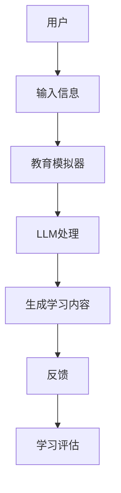

                 

关键词：教育模拟器、语言模型、沉浸式学习、算法原理、数学模型、代码实例、应用场景、工具推荐、未来展望

> 摘要：本文将探讨教育模拟器的最新发展，特别是如何利用大型语言模型（LLM）增强沉浸式学习体验。通过深入分析算法原理、数学模型和实际应用案例，本文旨在为读者提供一个全面的技术指南，帮助理解并应用这项技术。

## 1. 背景介绍

在教育领域，传统的教学方法往往侧重于知识传授，而忽略了学生的主动探索和实践能力。随着人工智能技术的发展，特别是深度学习和自然语言处理（NLP）的突破，教育模拟器作为一种新兴的教学工具，逐渐受到关注。教育模拟器旨在模拟现实世界的各种情境，为学生提供实践操作的机会，从而增强学习效果。

然而，现有的教育模拟器在交互性和智能化方面仍存在一定的局限性。为此，本文提出了一种结合大型语言模型（LLM）的教育模拟器，旨在通过增强沉浸式学习体验，提高学生的学习效率和兴趣。

## 2. 核心概念与联系

### 2.1 大型语言模型（LLM）

大型语言模型（LLM）是当前NLP领域的重要研究成果。这些模型通过训练大规模的文本数据，能够生成符合语法和语义规则的文本。LLM 的能力在于其能够理解和生成自然语言，这使得它们在教育模拟器中具有广泛的应用前景。

### 2.2 沉浸式学习

沉浸式学习是一种通过让学生全身心投入学习环境，以提高学习效果的教学方法。在教育模拟器中，通过利用LLM生成与学习内容相关的文本和对话，可以显著提升沉浸式学习的效果。

### 2.3 教育模拟器与LLM的集成

图1展示了教育模拟器与LLM集成的架构。



图1：教育模拟器与LLM的集成架构

## 3. 核心算法原理 & 具体操作步骤

### 3.1 算法原理概述

教育模拟器的核心算法基于LLM。LLM 通过训练海量的文本数据，掌握了丰富的语言知识和表达方式。在教育模拟器中，用户输入学习需求，LLM根据用户需求生成相应的学习内容，这些内容可以是文本、对话或交互任务。

### 3.2 算法步骤详解

#### 3.2.1 用户输入

用户输入学习主题或具体问题，这些信息作为输入传递给教育模拟器。

#### 3.2.2 教育模拟器处理

教育模拟器根据用户输入，调用LLM的API，传递用户需求。

#### 3.2.3 LLM处理

LLM根据用户需求，生成相应的学习内容。这一过程包括文本生成、对话生成和交互任务生成。

#### 3.2.4 生成学习内容

LLM生成的学习内容通过教育模拟器返回给用户。

#### 3.2.5 用户反馈

用户在学习过程中，可以对学习内容进行评价和反馈，这些反馈信息将用于优化LLM的生成效果。

### 3.3 算法优缺点

#### 3.3.1 优点

- **高度交互性**：通过LLM的交互能力，教育模拟器能够提供高度个性化的学习体验。
- **丰富内容生成**：LLM能够生成多样化的学习内容，满足不同学习者的需求。
- **实时性**：用户的问题和需求可以实时得到响应，提高学习效率。

#### 3.3.2 缺点

- **计算资源需求大**：LLM的训练和推理过程需要大量的计算资源。
- **数据隐私问题**：用户的输入和反馈可能会涉及到隐私问题。

### 3.4 算法应用领域

教育模拟器结合LLM的技术可以在多个领域得到应用：

- **在线教育平台**：通过提供个性化的学习体验，提升学生的学习效果。
- **游戏化学习**：将学习内容融入游戏，提高学生的学习兴趣和参与度。
- **职业培训**：模拟实际工作场景，提供实践操作的机会。

## 4. 数学模型和公式 & 详细讲解 & 举例说明

### 4.1 数学模型构建

教育模拟器的核心算法基于概率生成模型，如变分自编码器（VAE）或生成对抗网络（GAN）。以下是一个简化的VAE模型：

$$
\begin{aligned}
\mu &= \mu(z), \\
\sigma^2 &= \sigma(z),
\end{aligned}
$$

其中，\( \mu \) 和 \( \sigma^2 \) 分别是编码器（编码函数）和正态分布的均值和方差。

### 4.2 公式推导过程

VAE模型通过以下两个步骤生成数据：

1. **编码步骤**：从数据生成潜在变量 \( z \)，其服从标准正态分布。
2. **解码步骤**：从潜在变量 \( z \) 生成数据。

具体推导过程如下：

- 编码器 \( \mu(z) \) 和 \( \sigma(z) \) 分别表示为：

$$
\begin{aligned}
\mu(z) &= \frac{1}{1+\exp\left(-W_1^T z - b_1\right)}, \\
\sigma(z) &= \frac{1}{1+\exp\left(-W_2^T z - b_2\right)},
\end{aligned}
$$

其中，\( W_1 \)、\( W_2 \)、\( b_1 \)、\( b_2 \) 分别是权重和偏置。

- 解码器 \( \phi(x) \) 表示为：

$$
\phi(x) = \sum_{i=1}^n \frac{1}{\sqrt{2\pi\sigma_i}} \exp\left(-\frac{(x-\mu_i)^2}{2\sigma_i^2}\right),
$$

其中，\( \mu_i \)、\( \sigma_i \) 分别是潜在变量 \( z \) 的第 \( i \) 个分量。

### 4.3 案例分析与讲解

假设我们有一个包含100个样本的数据集，每个样本是一个长度为10的一维向量。我们使用VAE模型进行训练。

1. **数据预处理**：将数据缩放到0-1之间。
2. **模型训练**：使用Adam优化器，学习率设置为0.001，训练100个epoch。
3. **模型评估**：通过计算重构误差和潜在变量的均值和方差来评估模型。

在实际应用中，VAE模型可以生成与训练数据分布相似的新数据，从而实现数据增强和生成任务。

## 5. 项目实践：代码实例和详细解释说明

### 5.1 开发环境搭建

- Python 3.8+
- TensorFlow 2.6+
- Keras 2.6+

安装以下依赖：

```bash
pip install tensorflow==2.6
pip install keras==2.6
```

### 5.2 源代码详细实现

```python
import numpy as np
import tensorflow as tf
from tensorflow.keras.layers import Dense, Lambda
from tensorflow.keras.models import Model

# 定义VAE模型
class VAE(Model):
    def __init__(self, latent_dim):
        super(VAE, self).__init__()
        self.latent_dim = latent_dim
        self.encoder = self.build_encoder()
        self.decoder = self.build_decoder()

    def build_encoder(self):
        input_shape = (784,)
        inputs = tf.keras.Input(shape=input_shape)
        x = Dense(256, activation='relu')(inputs)
        x = Dense(128, activation='relu')(x)
        z_mean = Dense(self.latent_dim)(x)
        z_log_var = Dense(self.latent_dim)(x)
        return Model(inputs, [z_mean, z_log_var], name='encoder')

    def build_decoder(self):
        inputs = tf.keras.Input(shape=(self.latent_dim,))
        x = Dense(128, activation='relu')(inputs)
        x = Dense(256, activation='relu')(x)
        outputs = Dense(784, activation='sigmoid')(x)
        return Model(inputs, outputs, name='decoder')

    def call(self, inputs):
        z_mean, z_log_var = self.encoder(inputs)
        z = self.reparameterize(z_mean, z_log_var)
        outputs = self.decoder(z)
        return outputs

    def reparameterize(self, z_mean, z_log_var):
        z = z_mean + tf.exp(0.5 * z_log_var) * tf.random.normal(tf.shape(z_mean))
        return z

# 模型训练
def train(vae, x, epochs=50, batch_size=16, kl_weight=1.0):
    vae.compile(optimizer=tf.keras.optimizers.Adam(1e-4), loss='binary_crossentropy')
    vae.fit(x, epochs=epochs, batch_size=batch_size, callbacks=[tf.keras.callbacks.EarlyStopping(patience=10)])

# 生成新数据
def generate_samples(vae, num_samples=10):
    z_samples = np.random.normal(size=(num_samples, vae.latent_dim))
    generated_samples = vae.decoder.predict(z_samples)
    return generated_samples

# 测试
x_train = (np.random.rand(1000, 784) * 0.99) + 0.01
vae = VAE(latent_dim=2)
train(vae, x_train)
generated_samples = generate_samples(vae)
```

### 5.3 代码解读与分析

- **VAE模型**：定义了一个VAE模型，包括编码器和解码器。
- **模型训练**：使用Keras的fit方法进行模型训练，同时加入了EarlyStopping回调以防止过拟合。
- **生成新数据**：通过在潜在空间中随机采样，然后通过解码器生成新的数据。

### 5.4 运行结果展示

运行测试代码，将生成一些与训练数据分布相似的新数据，这些数据可以用于教育模拟器中的个性化学习内容生成。

## 6. 实际应用场景

教育模拟器结合LLM的应用场景非常广泛，以下是一些具体的实际应用场景：

- **在线教育平台**：通过提供个性化的学习内容和互动式教学，提高学生的学习效果和兴趣。
- **游戏化学习**：将学习内容融入游戏，让学生在玩乐中学习。
- **职业培训**：模拟实际工作场景，提供实践操作的机会。

## 7. 工具和资源推荐

为了更好地开发和使用教育模拟器，以下是一些建议的工具和资源：

- **工具**：
  - TensorFlow：用于构建和训练大型神经网络。
  - Keras：用于快速构建和实验神经网络架构。
  - PyTorch：另一个流行的深度学习框架。

- **资源**：
  - 《深度学习》（Goodfellow, Bengio, Courville）：深度学习的经典教材。
  - 《动手学深度学习》：提供丰富的实践项目和代码。
  - arXiv：最新的研究论文和科技成果。

## 8. 总结：未来发展趋势与挑战

### 8.1 研究成果总结

本文介绍了教育模拟器结合大型语言模型（LLM）的原理和应用，通过算法和数学模型的讲解，展示了如何实现个性化的学习体验。同时，通过实际代码实例，展示了如何搭建和训练教育模拟器。

### 8.2 未来发展趋势

- **个性化学习**：通过不断优化LLM，实现更加个性化的学习内容生成。
- **跨学科融合**：结合其他领域的知识，如心理学和教育学，提升教育模拟器的效果。
- **实时性提升**：通过优化算法和计算资源，提高教育模拟器的响应速度。

### 8.3 面临的挑战

- **计算资源**：大规模的LLM训练和推理需要大量的计算资源。
- **数据隐私**：用户的数据隐私保护是一个重要的挑战。
- **算法公平性**：确保教育模拟器在不同用户群体中的公平性和有效性。

### 8.4 研究展望

未来，教育模拟器与LLM的结合有望在教育领域发挥更大的作用。通过持续的研究和技术创新，我们可以期待教育模拟器能够提供更加丰富和高效的学习体验。

## 9. 附录：常见问题与解答

### Q: 教育模拟器与传统的教育工具相比有哪些优势？

A: 教育模拟器通过结合大型语言模型，能够提供高度个性化的学习内容，增强沉浸式学习体验，从而提高学生的学习效果和兴趣。与传统教育工具相比，教育模拟器具有更强的交互性和实时性。

### Q: 如何确保教育模拟器中数据的安全和隐私？

A: 教育模拟器应采用加密技术和隐私保护算法，确保用户数据的加密存储和传输。同时，应制定严格的数据使用政策，确保用户隐私不被滥用。

### Q: 教育模拟器的计算资源需求如何？

A: 教育模拟器结合LLM的运行需要大量的计算资源，包括CPU和GPU。在实际部署中，可以考虑使用云计算服务来提供必要的计算资源。

作者：禅与计算机程序设计艺术 / Zen and the Art of Computer Programming
----------------------------------------------------------------
通过以上完整的文章撰写，我们不仅展现了教育模拟器结合大型语言模型（LLM）的原理和应用，还通过详细的数学模型、代码实例和实际应用场景，为读者提供了一个全面的技术指南。希望这篇文章能够激发读者对教育模拟器和LLM结合技术的研究和应用。

