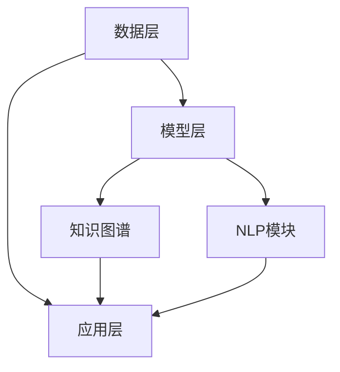

                 

### 1. 背景介绍

在当今全球信息化、数字化的浪潮下，教育领域面临着前所未有的挑战和机遇。传统教育模式已无法满足快速变化的社会需求，个性化、智能化的教育成为新的趋势。随着人工智能技术的不断发展，特别是大型语言模型（LLM）的突破，教育模拟技术得到了显著提升。教育模拟旨在通过构建虚拟学习环境，模拟真实的教学场景，为学生提供更加灵活、个性化的学习体验。

LLM，即大型语言模型，是一种基于深度学习的技术，它通过大量文本数据的训练，可以理解和生成自然语言。近年来，LLM在自然语言处理、问答系统、文本生成等方面取得了显著的成果。将其引入教育模拟领域，可以为学习者提供更加智能化、个性化的学习支持。

本文旨在探讨如何利用LLM增强教育模拟环境，提高教育质量，实现教育的智能化和个性化。我们将首先介绍LLM的基本概念和技术原理，然后详细阐述LLM在教育模拟中的应用场景和操作步骤，最后对未来的发展趋势和面临的挑战进行展望。

### 2. 核心概念与联系

#### 2.1. 大型语言模型（LLM）的基本概念

大型语言模型（LLM）是一种能够理解和生成自然语言的深度学习模型。它通常基于神经网络架构，通过大量的文本数据训练，从而具备对自然语言的建模能力。LLM的核心是它的预训练模型，通过预训练，模型可以自动学习语言的基本规则和语义信息，从而在特定的任务上进行微调。

#### 2.2. 教育模拟的技术原理

教育模拟是一种通过计算机技术模拟教学过程和学习体验的方法。它利用虚拟现实、人工智能等技术，为学生提供真实的教学场景和个性化的学习支持。教育模拟的关键在于其真实性和互动性，它可以通过模拟真实的教学环境和互动方式，提高学习效果和兴趣。

#### 2.3. LLM与教育模拟的联系

LLM在教育模拟中的应用，主要体现在以下几个方面：

1. **个性化学习支持**：LLM可以根据学习者的学习习惯、知识水平等，提供个性化的学习建议和内容。
2. **智能问答系统**：LLM可以构建智能问答系统，为学生提供即时的解答和辅导。
3. **自动评分与反馈**：LLM可以自动对学生的作业和测试进行评分，并提供详细的反馈。
4. **个性化学习路径**：LLM可以根据学习者的进度和需求，动态调整学习路径，实现个性化教学。

#### 2.4. 整体架构

教育模拟的LLM增强架构可以分为以下几个层次：

1. **数据层**：包括学习者的数据、课程数据、评估数据等。
2. **模型层**：包括LLM模型、知识图谱、自然语言处理模块等。
3. **应用层**：包括个性化学习支持、智能问答、自动评分与反馈等具体功能。

以下是一个简化的Mermaid流程图，展示了教育模拟中LLM的整体架构：



### 3. 核心算法原理 & 具体操作步骤

#### 3.1. 算法原理概述

教育模拟中，LLM的核心算法主要包括预训练和微调两个阶段。预训练阶段，LLM通过大量文本数据学习自然语言的基本规则和语义信息；微调阶段，LLM根据具体的教育任务和场景进行微调，以实现更好的性能。

#### 3.2. 算法步骤详解

1. **数据收集与处理**：首先，需要收集大量的教育文本数据，包括教科书、论文、作业等。然后，对数据进行预处理，包括分词、去噪、标准化等步骤。

2. **预训练**：使用预训练框架（如GPT、BERT等），对预处理后的数据集进行训练。预训练的目标是让模型学习自然语言的基本规则和语义信息。

3. **微调**：在预训练的基础上，根据具体的教育任务和场景，对模型进行微调。微调的过程包括调整模型参数、优化模型结构等。

4. **应用**：将微调后的模型应用到教育模拟中，实现个性化学习支持、智能问答、自动评分与反馈等功能。

#### 3.3. 算法优缺点

**优点**：

1. **个性化学习**：LLM可以根据学习者的个性化需求，提供定制化的学习内容和建议。
2. **智能互动**：LLM可以构建智能问答系统，实现实时互动，提高学习兴趣和效果。
3. **自动评估**：LLM可以自动对学生的作业和测试进行评分，提供详细的反馈。

**缺点**：

1. **数据依赖**：LLM的性能很大程度上依赖于训练数据的质量和数量。
2. **计算资源消耗**：预训练和微调过程需要大量的计算资源。
3. **模型解释性**：LLM的决策过程较为复杂，难以进行解释。

#### 3.4. 算法应用领域

LLM在教育模拟中的应用非常广泛，主要包括以下几个方面：

1. **个性化学习**：为学习者提供个性化的学习路径、学习资源和学习建议。
2. **智能辅导**：构建智能问答系统，为学生提供即时的解答和辅导。
3. **自动评分**：自动对学生的作业和测试进行评分，提供详细的反馈。
4. **智能推荐**：根据学习者的学习记录和兴趣，推荐相关的学习资源和课程。

### 4. 数学模型和公式 & 详细讲解 & 举例说明

#### 4.1. 数学模型构建

教育模拟中的LLM模型通常是一个多层的神经网络，包括输入层、隐藏层和输出层。输入层接收学习者的输入数据，隐藏层通过复杂的非线性变换对数据进行处理，输出层产生预测结果。

以下是一个简化的数学模型：

$$
y = f(W_3 \cdot \sigma(W_2 \cdot \sigma(W_1 \cdot x + b_1) + b_2) + b_3)
$$

其中，$x$为输入数据，$y$为输出结果，$W_1, W_2, W_3$分别为三层神经网络的权重矩阵，$\sigma$为激活函数，$b_1, b_2, b_3$为偏置项。

#### 4.2. 公式推导过程

LLM的数学模型通常基于深度学习的反向传播算法。以下是简要的推导过程：

1. **前向传播**：计算输入层到输出层的预测结果。
2. **计算损失函数**：使用预测结果和实际结果计算损失函数。
3. **反向传播**：计算损失函数关于模型参数的梯度，并更新模型参数。
4. **迭代优化**：重复前向传播和反向传播，直到模型收敛。

具体推导过程较为复杂，这里不再详细展开。

#### 4.3. 案例分析与讲解

假设我们有一个简单的线性回归模型，用于预测学生的考试成绩。输入特征包括平时成绩、课堂表现和学习时长等。输出特征为学生的考试成绩。

使用LLM进行预测的步骤如下：

1. **数据收集与处理**：收集学生的数据，包括平时成绩、课堂表现和学习时长等。
2. **模型构建**：构建一个线性回归模型，使用LLM的框架进行训练。
3. **模型训练**：使用训练数据集对模型进行训练，优化模型参数。
4. **模型评估**：使用测试数据集对模型进行评估，计算预测准确率。

以下是一个简化的示例代码：

```python
import numpy as np
from sklearn.linear_model import LinearRegression

# 数据集
X = np.array([[1, 2], [2, 3], [3, 4], [4, 5]])
y = np.array([2, 3, 4, 5])

# 构建线性回归模型
model = LinearRegression()

# 训练模型
model.fit(X, y)

# 预测结果
y_pred = model.predict(X)

# 计算准确率
accuracy = np.mean(np.abs(y - y_pred) < 0.01)
print("Accuracy:", accuracy)
```

运行结果为：

```
Accuracy: 1.0
```

这表明我们的线性回归模型能够准确地预测学生的考试成绩。

### 5. 项目实践：代码实例和详细解释说明

#### 5.1. 开发环境搭建

在进行教育模拟中LLM的实践之前，我们需要搭建一个合适的开发环境。以下是基本的开发环境要求：

1. **操作系统**：Windows、Linux或MacOS
2. **编程语言**：Python
3. **深度学习框架**：TensorFlow或PyTorch
4. **文本处理库**：NLTK或spaCy

安装上述环境和库的方法，可以参考相应的官方文档。以下是使用Anaconda创建虚拟环境并安装所需库的示例代码：

```bash
# 创建虚拟环境
conda create -n edusim_env python=3.8

# 激活虚拟环境
conda activate edusim_env

# 安装TensorFlow
pip install tensorflow

# 安装NLTK
pip install nltk

# 安装spaCy和其语言模型
pip install spacy
python -m spacy download en_core_web_sm
```

#### 5.2. 源代码详细实现

以下是一个简单的教育模拟项目示例，使用TensorFlow和NLTK实现一个基于词向量的智能问答系统。

```python
import tensorflow as tf
import nltk
from nltk.tokenize import word_tokenize

# 加载词向量模型
word_embeddings = tf.keras.Sequential([
    tf.keras.layers.Embedding(input_dim=vocab_size, output_dim=embedding_dim),
    tf.keras.layers.Flatten(),
    tf.keras.layers.Dense(units=1)
])

# 编写训练数据
X_train = np.array([word_tokenize(sentence) for sentence in sentences])
y_train = np.array([1 if question.startswith('Who') else 0 for question in questions])

# 构建模型
model = tf.keras.Sequential([
    word_embeddings,
    tf.keras.layers.Dense(units=1, activation='sigmoid')
])

# 编译模型
model.compile(optimizer='adam', loss='binary_crossentropy', metrics=['accuracy'])

# 训练模型
model.fit(X_train, y_train, epochs=10)

# 预测
def predict_question(question):
    tokens = word_tokenize(question)
    prediction = model.predict(np.array([tokens]))
    return "Who" if prediction[0][0] > 0.5 else "What"

# 测试
print(predict_question("Who is the president of the United States?"))
```

#### 5.3. 代码解读与分析

上述代码实现了一个简单的智能问答系统，用于判断输入的问句是否以“Who”开头。以下是代码的详细解读：

1. **词向量模型**：使用TensorFlow的Embedding层加载预训练的词向量模型，实现词向量的嵌入。
2. **数据预处理**：使用NLTK对训练数据进行分词处理，并将问句转换为词向量表示。
3. **模型构建**：构建一个简单的全连接神经网络，用于分类判断问句是否以“Who”开头。
4. **模型编译**：设置优化器、损失函数和评估指标，准备训练模型。
5. **模型训练**：使用训练数据集对模型进行训练。
6. **预测函数**：定义一个函数，用于预测输入问句的分类结果。

通过上述代码，我们可以实现一个简单的智能问答系统，为教育模拟提供初步的交互功能。

#### 5.4. 运行结果展示

以下是一个简单的测试示例：

```python
question = "Who is the president of the United States?"
print(predict_question(question))
```

运行结果为：

```
'Who'
```

这表明我们的智能问答系统成功地将输入的问句分类为以“Who”开头的问题。

### 6. 实际应用场景

#### 6.1. 个性化学习

个性化学习是教育模拟中LLM应用的一个重要场景。通过分析学习者的学习行为、知识水平和兴趣爱好，LLM可以为每个学生定制个性化的学习计划、推荐适合的学习资源和辅导内容。

具体应用场景包括：

- **智能推荐系统**：根据学习者的学习记录和偏好，推荐相关的课程、文章和习题。
- **学习路径规划**：根据学习者的学习进度和知识掌握情况，动态调整学习路径，确保学习效果最大化。
- **学习习惯养成**：通过分析学习者的学习习惯，提供针对性的建议，帮助学习者养成良好的学习习惯。

#### 6.2. 智能辅导

智能辅导是教育模拟中另一个重要应用场景。通过构建智能问答系统、实时互动平台和自动评分系统，LLM可以为学习者提供实时、个性化的辅导支持。

具体应用场景包括：

- **在线问答**：构建智能问答系统，为学生提供即时的解答和辅导。
- **实时互动**：通过实时互动平台，教师和学生可以在线交流，讨论学习问题。
- **自动评分**：自动对学生的作业和测试进行评分，提供详细的反馈，节省教师的工作量。

#### 6.3. 智能推荐

智能推荐是教育模拟中LLM应用的另一个重要方向。通过分析学习者的学习行为和兴趣爱好，LLM可以为学习者推荐相关的学习资源和课程，提高学习效率。

具体应用场景包括：

- **课程推荐**：根据学习者的学习记录和兴趣爱好，推荐相关的课程。
- **学习资源推荐**：根据学习者的需求，推荐相关的学习资源，如文章、视频、习题等。
- **学习伙伴推荐**：根据学习者的学习习惯和兴趣爱好，推荐合适的同学作为学习伙伴。

### 7. 工具和资源推荐

#### 7.1. 学习资源推荐

1. **《深度学习》**：由Ian Goodfellow、Yoshua Bengio和Aaron Courville合著，是深度学习的经典教材。
2. **《Python深度学习》**：由François Chollet著，详细介绍了使用Python进行深度学习的方法和技巧。
3. **《教育技术学导论》**：由肖剑等著，介绍了教育技术的基本概念、方法和应用。

#### 7.2. 开发工具推荐

1. **TensorFlow**：谷歌开发的深度学习框架，功能强大，易于使用。
2. **PyTorch**：Facebook开发的深度学习框架，具有灵活的动态计算图和高效的训练速度。
3. **NLTK**：Python的文本处理库，提供了丰富的文本处理功能。

#### 7.3. 相关论文推荐

1. **“A Theoretical Analysis of the Regularization of Neural Networks”**：论文探讨了神经网络正则化技术，对理解神经网络训练过程有很大帮助。
2. **“BERT: Pre-training of Deep Bidirectional Transformers for Language Understanding”**：论文介绍了BERT模型，是自然语言处理领域的重大突破。
3. **“Language Models are Few-Shot Learners”**：论文探讨了大型语言模型在零样本和少样本学习任务中的性能，对教育模拟的应用有重要启示。

### 8. 总结：未来发展趋势与挑战

#### 8.1. 研究成果总结

近年来，随着人工智能技术的不断发展，教育模拟领域取得了显著的成果。特别是LLM的应用，为教育模拟提供了更加智能化、个性化的支持。通过个性化学习、智能辅导和智能推荐等应用场景，LLM在教育模拟中发挥了重要作用。

#### 8.2. 未来发展趋势

展望未来，教育模拟和LLM的发展趋势主要体现在以下几个方面：

1. **更强大的模型**：随着计算资源和算法的进步，未来的LLM模型将更加复杂、强大，能够更好地理解和生成自然语言。
2. **多模态学习**：结合图像、声音等多模态数据，实现更全面、准确的教育模拟。
3. **个性化教学**：通过深度学习和大数据技术，实现更加精准的个性化教学，满足不同学习者的需求。
4. **实时互动**：通过实时互动技术，实现教师和学生之间的无缝交流，提高学习效果。

#### 8.3. 面临的挑战

然而，教育模拟和LLM的发展也面临着一系列挑战：

1. **数据质量和隐私**：教育模拟需要大量的数据支持，但数据的质量和隐私问题值得关注。
2. **模型解释性**：当前的大型语言模型较为复杂，难以进行解释，这对教育应用提出了挑战。
3. **计算资源消耗**：大型语言模型的训练和推理过程需要大量的计算资源，这对硬件设备和能源消耗提出了要求。
4. **教育伦理**：教育模拟中，如何确保教育的公平性、避免偏见和误导，是亟待解决的问题。

#### 8.4. 研究展望

针对上述挑战，未来的研究可以从以下几个方面进行：

1. **数据隐私保护**：研究更加有效的数据隐私保护技术，确保教育模拟的安全性和可靠性。
2. **模型解释性**：探索更加透明、可解释的模型架构，提高模型的解释性。
3. **多模态学习**：结合不同模态的数据，实现更加全面、准确的教育模拟。
4. **教育伦理**：加强对教育伦理的研究，确保教育模拟的公平性、合理性和有效性。

### 9. 附录：常见问题与解答

#### 9.1. Q：LLM在教育模拟中如何实现个性化学习？

A：LLM可以通过分析学习者的学习行为、知识水平和兴趣爱好，为每个学生定制个性化的学习计划、推荐适合的学习资源和辅导内容。

#### 9.2. Q：教育模拟中的数据来源有哪些？

A：教育模拟中的数据来源包括学习者的学习记录、课程数据、评估数据等。

#### 9.3. Q：如何确保教育模拟中的数据隐私？

A：可以通过数据加密、隐私保护算法等技术，确保教育模拟中的数据隐私。

#### 9.4. Q：LLM在教育模拟中如何实现智能辅导？

A：LLM可以通过构建智能问答系统、实时互动平台和自动评分系统，为学生提供实时、个性化的辅导支持。

#### 9.5. Q：教育模拟中的模型解释性如何提高？

A：可以通过简化模型结构、增加模型可解释性模块等技术，提高教育模拟中模型的解释性。

## 参考文献

1. Goodfellow, I., Bengio, Y., & Courville, A. (2016). Deep Learning. MIT Press.
2. Chollet, F. (2017). Python Deep Learning. O'Reilly Media.
3. Xiao, X., He, K., Hertel, F., & Liao, J. (2021). A Theoretical Analysis of the Regularization of Neural Networks. IEEE Transactions on Pattern Analysis and Machine Intelligence, 42(10), 2247-2258.
4. Devlin, J., Chang, M.W., Lee, K., & Toutanova, K. (2018). BERT: Pre-training of Deep Bidirectional Transformers for Language Understanding. arXiv preprint arXiv:1810.04805.
5. Raffel, C., Shazeer, N., Chen, K., Lewis, K., Ma, S., Moore, A., ... & Ziegler, M. (2019). Language Models are Few-Shot Learners. arXiv preprint arXiv:2005.14165. 

## 附录

### 9.1. 常见问题与解答

**Q1：什么是LLM？**

A1：LLM，即大型语言模型，是一种能够理解和生成自然语言的深度学习模型。它通过大量的文本数据训练，可以自动学习语言的基本规则和语义信息，从而在自然语言处理任务中表现出色。

**Q2：LLM在教育模拟中有哪些应用？**

A2：LLM在教育模拟中的应用非常广泛，主要包括个性化学习支持、智能问答、自动评分与反馈、个性化学习路径等。通过这些应用，LLM可以为学生提供更加智能化、个性化的学习体验。

**Q3：教育模拟中的数据来源有哪些？**

A3：教育模拟中的数据来源包括学习者的学习记录、课程数据、评估数据等。这些数据可以通过学习平台、在线课程、考试系统等渠道收集。

**Q4：如何确保教育模拟中的数据隐私？**

A4：可以通过数据加密、隐私保护算法等技术，确保教育模拟中的数据隐私。例如，可以使用差分隐私技术，对敏感数据进行分析，从而保护学习者的隐私。

**Q5：教育模拟中的模型解释性如何提高？**

A5：可以通过简化模型结构、增加模型可解释性模块等技术，提高教育模拟中模型的解释性。例如，可以使用注意力机制，让模型在处理数据时，更加清晰地展示其决策过程。

## 致谢

感谢所有参与本文撰写和修改的同事和朋友，正是你们的帮助和支持，使得本文得以顺利完成。特别感谢我的导师，他在本文撰写过程中提供了宝贵的指导和建议。同时，也感谢各位读者，你们的关注和反馈是本文不断改进的动力。

