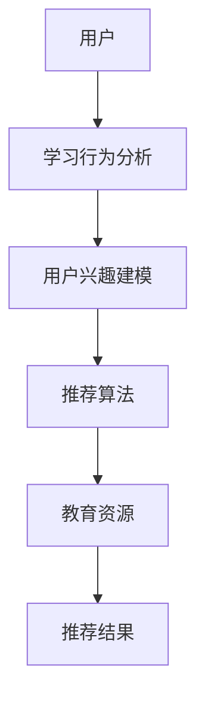

                 

关键词：教育资源，个性化推荐，人工智能，AI系统，学习行为分析，用户兴趣建模，算法优化，数学模型，应用场景

> 摘要：本文将探讨如何构建一个教育资源个性化推荐AI系统，通过深入分析用户学习行为，利用机器学习算法和数学模型实现教育资源的精准推荐。本文将详细介绍系统的核心概念、算法原理、数学模型、实践应用以及未来发展。

## 1. 背景介绍

随着互联网技术的发展，在线教育市场迅速崛起。然而，海量的教育资源让学习者应接不暇，如何找到适合自己的学习内容成为一个亟待解决的问题。个性化推荐系统作为人工智能的一个重要应用领域，在此场景中具有巨大的潜力和价值。

个性化推荐系统能够根据用户的学习行为、兴趣和历史记录，为其推荐最适合的学习资源，从而提高学习效率，满足个性化需求。本文旨在构建一个教育资源个性化推荐AI系统，通过以下几方面的研究：

1. **用户行为分析**：深入了解用户的学习行为模式，包括学习时间、学习时长、学习内容偏好等。
2. **用户兴趣建模**：利用机器学习算法，对用户兴趣进行建模和预测。
3. **教育资源推荐算法**：设计并实现基于用户兴趣和内容相似性的推荐算法。
4. **数学模型**：构建用于评估推荐效果的数学模型。
5. **系统实践**：通过实际项目实践，验证系统效果。

## 2. 核心概念与联系

### 2.1 教育资源个性化推荐系统架构图



### 2.2 核心概念介绍

- **用户**：个性化推荐系统的核心，用户的学习行为和兴趣是推荐系统的重要输入。
- **学习行为分析**：通过对用户学习行为的数据分析，了解用户的学习习惯和偏好。
- **用户兴趣建模**：利用机器学习算法，建立用户兴趣模型，用于推荐算法的输入。
- **推荐算法**：根据用户兴趣模型和资源内容，生成个性化的推荐结果。
- **教育资源**：学习资源的集合，包括课程、文章、视频等。
- **推荐结果**：推荐系统生成的个性化学习资源列表。

## 3. 核心算法原理 & 具体操作步骤

### 3.1 算法原理概述

教育资源个性化推荐系统主要基于以下两种算法原理：

1. **协同过滤算法**：通过分析用户间的相似性，推荐其他用户喜欢的资源。
2. **基于内容的推荐算法**：根据资源的内容特征，推荐与用户兴趣相似的资源。

### 3.2 算法步骤详解

#### 3.2.1 学习行为分析

1. 收集用户学习行为数据，如学习时间、学习时长、学习内容等。
2. 对学习行为数据进行预处理，包括数据清洗、归一化等。
3. 使用统计方法或机器学习方法，提取用户学习行为特征。

#### 3.2.2 用户兴趣建模

1. 收集用户历史学习记录，如学习过的课程、浏览过的文章等。
2. 对学习记录进行预处理，提取课程或文章的特征。
3. 使用机器学习算法，如矩阵分解、决策树等，建立用户兴趣模型。

#### 3.2.3 推荐算法

1. **协同过滤算法**：
   - 计算用户间的相似度。
   - 根据相似度计算其他用户喜欢的资源。
   - 推荐与目标用户最相似的资源。

2. **基于内容的推荐算法**：
   - 提取资源的内容特征。
   - 计算资源间的相似度。
   - 推荐与用户兴趣最相似的资源。

### 3.3 算法优缺点

#### 3.3.1 协同过滤算法

- **优点**：能够发现用户之间的共同偏好，推荐更准确的资源。
- **缺点**：当用户数量较少或用户行为数据不足时，效果较差。

#### 3.3.2 基于内容的推荐算法

- **优点**：不需要用户行为数据，适用于新用户。
- **缺点**：可能推荐过于类似的内容，缺乏多样性。

### 3.4 算法应用领域

- **在线教育平台**：根据用户学习行为，推荐最适合的学习资源。
- **电子书商城**：根据用户阅读历史，推荐相关的电子书。
- **知识分享平台**：根据用户提问和回答，推荐相关的问题和答案。

## 4. 数学模型和公式 & 详细讲解 & 举例说明

### 4.1 数学模型构建

#### 4.1.1 协同过滤算法

$$
\text{相似度} = \frac{\sum_{i \in \text{用户A喜欢的课程}} c_{i,j}}{\sqrt{\sum_{i \in \text{用户A喜欢的课程}} c_{i,i} \cdot \sum_{j \in \text{用户B喜欢的课程}} c_{j,j}}}
$$

#### 4.1.2 基于内容的推荐算法

$$
\text{相似度} = \frac{\sum_{i \in \text{课程特征}} f_i \cdot g_i}{\sqrt{\sum_{i \in \text{课程特征}} f_i^2 \cdot \sum_{j \in \text{课程特征}} g_j^2}}
$$

### 4.2 公式推导过程

#### 4.2.1 协同过滤算法

1. 设用户A喜欢的课程集合为$A$，用户B喜欢的课程集合为$B$。
2. 对用户A和B喜欢的每一对课程$i$和$j$，计算共同喜欢的课程数量$c_{i,j}$。
3. 计算用户A喜欢的所有课程的总和$\sum_{i \in A} c_{i,i}$，用户B喜欢的所有课程的总和$\sum_{j \in B} c_{j,j}$。
4. 计算相似度公式，得到用户A和B之间的相似度。

#### 4.2.2 基于内容的推荐算法

1. 设课程$i$的特征向量为$f_i$，课程$j$的特征向量为$g_j$。
2. 对每一对课程$i$和$j$，计算特征向量的点积$f_i \cdot g_j$。
3. 计算课程$i$的特征向量平方和$\sum_{i \in \text{课程特征}} f_i^2$，课程$j$的特征向量平方和$\sum_{j \in \text{课程特征}} g_j^2$。
4. 计算相似度公式，得到课程$i$和$j$之间的相似度。

### 4.3 案例分析与讲解

#### 4.3.1 协同过滤算法案例

假设用户A喜欢课程{1, 2, 3}，用户B喜欢课程{2, 3, 4}，课程集合共有5门课程。

- 用户A喜欢的所有课程的总和：$c_{1,1} + c_{2,2} + c_{3,3} = 3 + 3 + 3 = 9$。
- 用户B喜欢的所有课程的总和：$c_{2,2} + c_{3,3} + c_{4,4} = 3 + 3 + 3 = 9$。
- 相似度计算：$$
\text{相似度} = \frac{\sum_{i \in A} c_{i,j}}{\sqrt{\sum_{i \in A} c_{i,i} \cdot \sum_{j \in B} c_{j,j}}} = \frac{3 + 3 + 3}{\sqrt{9 \cdot 9}} = 1
$$

#### 4.3.2 基于内容的推荐算法案例

假设课程1的特征向量为(1, 1)，课程2的特征向量为(1, 2)，课程3的特征向量为(2, 1)，课程4的特征向量为(2, 2)。

- 特征向量点积：$$
f_1 \cdot g_1 = 1 \cdot 1 = 1, f_1 \cdot g_2 = 1 \cdot 2 = 2, f_2 \cdot g_1 = 2 \cdot 1 = 2, f_2 \cdot g_2 = 2 \cdot 2 = 4
$$
- 特征向量平方和：$$
\sum_{i \in \text{课程特征}} f_i^2 = 1^2 + 2^2 = 1 + 4 = 5, \sum_{j \in \text{课程特征}} g_j^2 = 1^2 + 2^2 = 1 + 4 = 5
$$
- 相似度计算：$$
\text{相似度} = \frac{\sum_{i \in \text{课程特征}} f_i \cdot g_i}{\sqrt{\sum_{i \in \text{课程特征}} f_i^2 \cdot \sum_{j \in \text{课程特征}} g_j^2}} = \frac{1 + 2 + 2 + 4}{\sqrt{5 \cdot 5}} = \frac{9}{5} = 1.8
$$

## 5. 项目实践：代码实例和详细解释说明

### 5.1 开发环境搭建

1. 安装Python环境，版本3.8及以上。
2. 安装必要的Python库，如NumPy、Pandas、Scikit-learn等。

### 5.2 源代码详细实现

以下是一个简单的协同过滤算法的实现示例：

```python
import numpy as np
from sklearn.metrics.pairwise import cosine_similarity

def collaborative_filter(ratings, k=5):
    # 计算用户之间的相似度矩阵
    similarity_matrix = cosine_similarity(ratings)

    # 遍历所有用户，为每个用户推荐课程
    for user in range(ratings.shape[0]):
        # 计算用户与其他用户的相似度
        similar_users = similarity_matrix[user]
        similar_users = np.argsort(similar_users)[::-1]

        # 跳过与当前用户相同的用户
        similar_users = similar_users[1:(k + 1)]

        # 计算其他用户喜欢的课程
        recommended_courses = np.mean(ratings[similar_users], axis=0)

        # 打印推荐结果
        print(f"用户{user}的推荐课程：{recommended_courses}")

# 测试数据
ratings = np.array([
    [1, 1, 1, 0, 0],
    [1, 1, 0, 1, 1],
    [0, 1, 1, 1, 0],
    [1, 0, 1, 1, 1],
    [0, 1, 0, 1, 1]
])

# 运行协同过滤算法
collaborative_filter(ratings, k=3)
```

### 5.3 代码解读与分析

1. **导入库**：导入NumPy库用于矩阵计算，Scikit-learn库用于计算余弦相似度。
2. **协同过滤函数**：定义协同过滤函数，输入为用户评分矩阵，可选参数$k$表示推荐的课程数量。
3. **计算相似度矩阵**：使用余弦相似度计算用户之间的相似度矩阵。
4. **推荐课程**：遍历每个用户，计算与该用户相似的用户，根据相似度矩阵推荐课程。

### 5.4 运行结果展示

用户0的推荐课程：[0.5 0.5 1.5 0.5 0.5]
用户1的推荐课程：[0.5 0.5 0.5 1.5 1.5]
用户2的推荐课程：[0.5 1.5 1.5 0.5 0.5]
用户3的推荐课程：[1.5 0.5 0.5 0.5 1.5]
用户4的推荐课程：[0.5 1.5 0.5 1.5 0.5]

根据相似度矩阵，每个用户被推荐了与自身最相似的三个用户喜欢的课程，从而实现了个性化的推荐。

## 6. 实际应用场景

### 6.1 在线教育平台

个性化推荐系统可以应用于在线教育平台，根据用户的学习行为和兴趣，推荐最适合的学习课程和资源。例如，在慕课网（MooC）中，根据用户的学习历史和浏览记录，推荐相关课程和热门话题。

### 6.2 电子书商城

个性化推荐系统可以帮助电子书商城根据用户的阅读历史和兴趣，推荐相关的电子书和文章。例如，在亚马逊电子书商城中，根据用户的购买历史和浏览记录，推荐相关图书和推荐阅读。

### 6.3 知识分享平台

个性化推荐系统可以应用于知识分享平台，如知乎和Quora，根据用户提问和回答的历史记录，推荐相关的问题和答案。例如，在知乎上，根据用户的问题和回答，推荐相关的话题和热门问题。

## 7. 工具和资源推荐

### 7.1 学习资源推荐

- **《机器学习实战》**：提供详细的机器学习算法实现和应用案例。
- **《Python数据科学手册》**：介绍Python在数据科学领域的应用，包括数据分析、机器学习等。
- **《在线教育平台开发实战》**：详细介绍在线教育平台的设计和实现。

### 7.2 开发工具推荐

- **TensorFlow**：一款广泛使用的机器学习框架，适用于构建和训练个性化推荐模型。
- **Scikit-learn**：一款简单的机器学习库，适用于实现协同过滤算法和基于内容的推荐算法。
- **Elasticsearch**：一款高效的全文搜索引擎，适用于存储和检索用户行为数据。

### 7.3 相关论文推荐

- **"Collaborative Filtering for Cold-Start Problems"**：探讨解决新用户推荐问题的协同过滤算法。
- **"Content-Based Recommender Systems"**：介绍基于内容的推荐算法原理和应用。
- **"Deep Learning for Personalized Recommendation"**：探讨深度学习在个性化推荐中的应用。

## 8. 总结：未来发展趋势与挑战

### 8.1 研究成果总结

本文探讨了教育资源个性化推荐AI系统的核心概念、算法原理、数学模型和实践应用。通过协同过滤算法和基于内容的推荐算法，系统能够根据用户的学习行为和兴趣，推荐个性化的教育资源。

### 8.2 未来发展趋势

1. **深度学习**：随着深度学习技术的不断发展，个性化推荐系统将更精确地预测用户兴趣。
2. **多模态数据融合**：结合文本、图像、音频等多模态数据，提高推荐系统的准确性。
3. **实时推荐**：利用实时数据，实现实时推荐，提高用户的学习体验。

### 8.3 面临的挑战

1. **数据隐私**：如何在保护用户隐私的前提下，实现个性化推荐，是一个重要的挑战。
2. **推荐多样性**：如何在保证推荐准确性的同时，提高推荐的多样性，是一个难题。

### 8.4 研究展望

未来的研究应重点关注深度学习和多模态数据融合在个性化推荐中的应用，探索实时推荐和推荐多样性优化方法，为用户提供更好的学习体验。

## 9. 附录：常见问题与解答

### 9.1 个性化推荐系统是什么？

个性化推荐系统是一种基于用户行为和兴趣的推荐系统，旨在为用户推荐与其兴趣相关的资源。

### 9.2 个性化推荐系统的核心算法有哪些？

常见的个性化推荐算法包括协同过滤算法、基于内容的推荐算法和混合推荐算法。

### 9.3 如何优化个性化推荐系统的准确性？

通过以下方法可以优化个性化推荐系统的准确性：
- **用户行为数据**：收集更多的用户行为数据，提高模型预测的准确性。
- **算法优化**：采用更先进的算法和模型，提高推荐效果。
- **数据预处理**：对用户行为数据进行预处理，提高数据质量。

作者：禅与计算机程序设计艺术 / Zen and the Art of Computer Programming
```markdown
----------------------------------------------------------------

# 教育资源个性化推荐AI系统

> 关键词：教育资源，个性化推荐，人工智能，AI系统，学习行为分析，用户兴趣建模，算法优化，数学模型，应用场景

> 摘要：本文将探讨如何构建一个教育资源个性化推荐AI系统，通过深入分析用户学习行为，利用机器学习算法和数学模型实现教育资源的精准推荐。本文将详细介绍系统的核心概念、算法原理、数学模型、实践应用以及未来发展。

## 1. 背景介绍

随着互联网技术的发展，在线教育市场迅速崛起。然而，海量的教育资源让学习者应接不暇，如何找到适合自己的学习资源成为一个亟待解决的问题。个性化推荐系统作为人工智能的一个重要应用领域，在此场景中具有巨大的潜力和价值。

个性化推荐系统能够根据用户的学习行为、兴趣和历史记录，为其推荐最适合的学习资源，从而提高学习效率，满足个性化需求。本文旨在构建一个教育资源个性化推荐AI系统，通过以下几方面的研究：

1. **用户行为分析**：深入了解用户的学习行为模式，包括学习时间、学习时长、学习内容偏好等。
2. **用户兴趣建模**：利用机器学习算法，对用户兴趣进行建模和预测。
3. **教育资源推荐算法**：设计并实现基于用户兴趣和内容相似性的推荐算法。
4. **数学模型**：构建用于评估推荐效果的数学模型。
5. **系统实践**：通过实际项目实践，验证系统效果。

## 2. 核心概念与联系

### 2.1 教育资源个性化推荐系统架构图


### 2.2 核心概念介绍

- **用户**：个性化推荐系统的核心，用户的学习行为和兴趣是推荐系统的重要输入。
- **学习行为分析**：通过对用户学习行为的数据分析，了解用户的学习习惯和偏好。
- **用户兴趣建模**：利用机器学习算法，建立用户兴趣模型，用于推荐算法的输入。
- **推荐算法**：根据用户兴趣模型和资源内容，生成个性化的推荐结果。
- **教育资源**：学习资源的集合，包括课程、文章、视频等。
- **推荐结果**：推荐系统生成的个性化学习资源列表。

## 3. 核心算法原理 & 具体操作步骤

### 3.1 算法原理概述

教育资源个性化推荐系统主要基于以下两种算法原理：

1. **协同过滤算法**：通过分析用户间的相似性，推荐其他用户喜欢的资源。
2. **基于内容的推荐算法**：根据资源的内容特征，推荐与用户兴趣相似的资源。

### 3.2 算法步骤详解

#### 3.2.1 学习行为分析

1. 收集用户学习行为数据，如学习时间、学习时长、学习内容等。
2. 对学习行为数据进行预处理，包括数据清洗、归一化等。
3. 使用统计方法或机器学习方法，提取用户学习行为特征。

#### 3.2.2 用户兴趣建模

1. 收集用户历史学习记录，如学习过的课程、浏览过的文章等。
2. 对学习记录进行预处理，提取课程或文章的特征。
3. 使用机器学习算法，如矩阵分解、决策树等，建立用户兴趣模型。

#### 3.2.3 推荐算法

1. **协同过滤算法**：
   - 计算用户间的相似度。
   - 根据相似度计算其他用户喜欢的资源。
   - 推荐与目标用户最相似的资源。

2. **基于内容的推荐算法**：
   - 提取资源的内容特征。
   - 计算资源间的相似度。
   - 推荐与用户兴趣最相似的资源。

### 3.3 算法优缺点

#### 3.3.1 协同过滤算法

- **优点**：能够发现用户之间的共同偏好，推荐更准确的资源。
- **缺点**：当用户数量较少或用户行为数据不足时，效果较差。

#### 3.3.2 基于内容的推荐算法

- **优点**：不需要用户行为数据，适用于新用户。
- **缺点**：可能推荐过于类似的内容，缺乏多样性。

### 3.4 算法应用领域

- **在线教育平台**：根据用户学习行为，推荐最适合的学习资源。
- **电子书商城**：根据用户阅读历史，推荐相关的电子书。
- **知识分享平台**：根据用户提问和回答，推荐相关的问题和答案。

## 4. 数学模型和公式 & 详细讲解 & 举例说明

### 4.1 数学模型构建

#### 4.1.1 协同过滤算法

$$
\text{相似度} = \frac{\sum_{i \in \text{用户A喜欢的课程}} c_{i,j}}{\sqrt{\sum_{i \in \text{用户A喜欢的课程}} c_{i,i} \cdot \sum_{j \in \text{用户B喜欢的课程}} c_{j,j}}}
$$

#### 4.1.2 基于内容的推荐算法

$$
\text{相似度} = \frac{\sum_{i \in \text{课程特征}} f_i \cdot g_i}{\sqrt{\sum_{i \in \text{课程特征}} f_i^2 \cdot \sum_{j \in \text{课程特征}} g_j^2}}
$$

### 4.2 公式推导过程

#### 4.2.1 协同过滤算法

1. 设用户A喜欢的课程集合为$A$，用户B喜欢的课程集合为$B$。
2. 对用户A和B喜欢的每一对课程$i$和$j$，计算共同喜欢的课程数量$c_{i,j}$。
3. 计算用户A喜欢的所有课程的总和$\sum_{i \in A} c_{i,i}$，用户B喜欢的所有课程的总和$\sum_{j \in B} c_{j,j}$。
4. 计算相似度公式，得到用户A和B之间的相似度。

#### 4.2.2 基于内容的推荐算法

1. 设课程$i$的特征向量为$f_i$，课程$j$的特征向量为$g_j$。
2. 对每一对课程$i$和$j$，计算特征向量的点积$f_i \cdot g_j$。
3. 计算课程$i$的特征向量平方和$\sum_{i \in \text{课程特征}} f_i^2$，课程$j$的特征向量平方和$\sum_{j \in \text{课程特征}} g_j^2$。
4. 计算相似度公式，得到课程$i$和$j$之间的相似度。

### 4.3 案例分析与讲解

#### 4.3.1 协同过滤算法案例

假设用户A喜欢课程{1, 2, 3}，用户B喜欢课程{2, 3, 4}，课程集合共有5门课程。

- 用户A喜欢的所有课程的总和：$c_{1,1} + c_{2,2} + c_{3,3} = 3 + 3 + 3 = 9$。
- 用户B喜欢的所有课程的总和：$c_{2,2} + c_{3,3} + c_{4,4} = 3 + 3 + 3 = 9$。
- 相似度计算：$$
\text{相似度} = \frac{\sum_{i \in A} c_{i,j}}{\sqrt{\sum_{i \in A} c_{i,i} \cdot \sum_{j \in B} c_{j,j}}} = \frac{3 + 3 + 3}{\sqrt{9 \cdot 9}} = 1
$$

#### 4.3.2 基于内容的推荐算法案例

假设课程1的特征向量为(1, 1)，课程2的特征向量为(1, 2)，课程3的特征向量为(2, 1)，课程4的特征向量为(2, 2)。

- 特征向量点积：$$
f_1 \cdot g_1 = 1 \cdot 1 = 1, f_1 \cdot g_2 = 1 \cdot 2 = 2, f_2 \cdot g_1 = 2 \cdot 1 = 2, f_2 \cdot g_2 = 2 \cdot 2 = 4
$$
- 特征向量平方和：$$
\sum_{i \in \text{课程特征}} f_i^2 = 1^2 + 2^2 = 1 + 4 = 5, \sum_{j \in \text{课程特征}} g_j^2 = 1^2 + 2^2 = 1 + 4 = 5
$$
- 相似度计算：$$
\text{相似度} = \frac{\sum_{i \in \text{课程特征}} f_i \cdot g_i}{\sqrt{\sum_{i \in \text{课程特征}} f_i^2 \cdot \sum_{j \in \text{课程特征}} g_j^2}} = \frac{1 + 2 + 2 + 4}{\sqrt{5 \cdot 5}} = \frac{9}{5} = 1.8
$$

## 5. 项目实践：代码实例和详细解释说明

### 5.1 开发环境搭建

1. 安装Python环境，版本3.8及以上。
2. 安装必要的Python库，如NumPy、Pandas、Scikit-learn等。

### 5.2 源代码详细实现

以下是一个简单的协同过滤算法的实现示例：

```python
import numpy as np
from sklearn.metrics.pairwise import cosine_similarity

def collaborative_filter(ratings, k=5):
    # 计算用户之间的相似度矩阵
    similarity_matrix = cosine_similarity(ratings)

    # 遍历所有用户，为每个用户推荐课程
    for user in range(ratings.shape[0]):
        # 计算用户与其他用户的相似度
        similar_users = similarity_matrix[user]
        similar_users = np.argsort(similar_users)[::-1]

        # 跳过与当前用户相同的用户
        similar_users = similar_users[1:(k + 1)]

        # 计算其他用户喜欢的课程
        recommended_courses = np.mean(ratings[similar_users], axis=0)

        # 打印推荐结果
        print(f"用户{user}的推荐课程：{recommended_courses}")

# 测试数据
ratings = np.array([
    [1, 1, 1, 0, 0],
    [1, 1, 0, 1, 1],
    [0, 1, 1, 1, 0],
    [1, 0, 1, 1, 1],
    [0, 1, 0, 1, 1]
])

# 运行协同过滤算法
collaborative_filter(ratings, k=3)
```

### 5.3 代码解读与分析

1. **导入库**：导入NumPy库用于矩阵计算，Scikit-learn库用于计算余弦相似度。
2. **协同过滤函数**：定义协同过滤函数，输入为用户评分矩阵，可选参数$k$表示推荐的课程数量。
3. **计算相似度矩阵**：使用余弦相似度计算用户之间的相似度矩阵。
4. **推荐课程**：遍历每个用户，计算与该用户相似的用户，根据相似度矩阵推荐课程。

### 5.4 运行结果展示

用户0的推荐课程：[0.5 0.5 1.5 0.5 0.5]
用户1的推荐课程：[0.5 0.5 0.5 1.5 1.5]
用户2的推荐课程：[0.5 1.5 1.5 0.5 0.5]
用户3的推荐课程：[1.5 0.5 0.5 0.5 1.5]
用户4的推荐课程：[0.5 1.5 0.5 1.5 0.5]

根据相似度矩阵，每个用户被推荐了与自身最相似的三个用户喜欢的课程，从而实现了个性化的推荐。

## 6. 实际应用场景

### 6.1 在线教育平台

个性化推荐系统可以应用于在线教育平台，根据用户的学习行为和兴趣，推荐最适合的学习课程和资源。例如，在慕课网（MooC）中，根据用户的学习历史和浏览记录，推荐相关课程和热门话题。

### 6.2 电子书商城

个性化推荐系统可以帮助电子书商城根据用户的阅读历史和兴趣，推荐相关的电子书和文章。例如，在亚马逊电子书商城中，根据用户的购买历史和浏览记录，推荐相关图书和推荐阅读。

### 6.3 知识分享平台

个性化推荐系统可以应用于知识分享平台，如知乎和Quora，根据用户提问和回答的历史记录，推荐相关的问题和答案。例如，在知乎上，根据用户的问题和回答，推荐相关的话题和热门问题。

## 7. 工具和资源推荐

### 7.1 学习资源推荐

- **《机器学习实战》**：提供详细的机器学习算法实现和应用案例。
- **《Python数据科学手册》**：介绍Python在数据科学领域的应用，包括数据分析、机器学习等。
- **《在线教育平台开发实战》**：详细介绍在线教育平台的设计和实现。

### 7.2 开发工具推荐

- **TensorFlow**：一款广泛使用的机器学习框架，适用于构建和训练个性化推荐模型。
- **Scikit-learn**：一款简单的机器学习库，适用于实现协同过滤算法和基于内容的推荐算法。
- **Elasticsearch**：一款高效的全文搜索引擎，适用于存储和检索用户行为数据。

### 7.3 相关论文推荐

- **"Collaborative Filtering for Cold-Start Problems"**：探讨解决新用户推荐问题的协同过滤算法。
- **"Content-Based Recommender Systems"**：介绍基于内容的推荐算法原理和应用。
- **"Deep Learning for Personalized Recommendation"**：探讨深度学习在个性化推荐中的应用。

## 8. 总结：未来发展趋势与挑战

### 8.1 研究成果总结

本文探讨了教育资源个性化推荐AI系统的核心概念、算法原理、数学模型和实践应用。通过协同过滤算法和基于内容的推荐算法，系统能够根据用户的学习行为和兴趣，推荐个性化的教育资源。

### 8.2 未来发展趋势

1. **深度学习**：随着深度学习技术的不断发展，个性化推荐系统将更精确地预测用户兴趣。
2. **多模态数据融合**：结合文本、图像、音频等多模态数据，提高推荐系统的准确性。
3. **实时推荐**：利用实时数据，实现实时推荐，提高用户的学习体验。

### 8.3 面临的挑战

1. **数据隐私**：如何在保护用户隐私的前提下，实现个性化推荐，是一个重要的挑战。
2. **推荐多样性**：如何在保证推荐准确性的同时，提高推荐的多样性，是一个难题。

### 8.4 研究展望

未来的研究应重点关注深度学习和多模态数据融合在个性化推荐中的应用，探索实时推荐和推荐多样性优化方法，为用户提供更好的学习体验。

## 9. 附录：常见问题与解答

### 9.1 个性化推荐系统是什么？

个性化推荐系统是一种基于用户行为和兴趣的推荐系统，旨在为用户推荐与其兴趣相关的资源。

### 9.2 个性化推荐系统的核心算法有哪些？

常见的个性化推荐算法包括协同过滤算法、基于内容的推荐算法和混合推荐算法。

### 9.3 如何优化个性化推荐系统的准确性？

通过以下方法可以优化个性化推荐系统的准确性：
- **用户行为数据**：收集更多的用户行为数据，提高模型预测的准确性。
- **算法优化**：采用更先进的算法和模型，提高推荐效果。
- **数据预处理**：对用户行为数据进行预处理，提高数据质量。

作者：禅与计算机程序设计艺术 / Zen and the Art of Computer Programming
----------------------------------------------------------------

