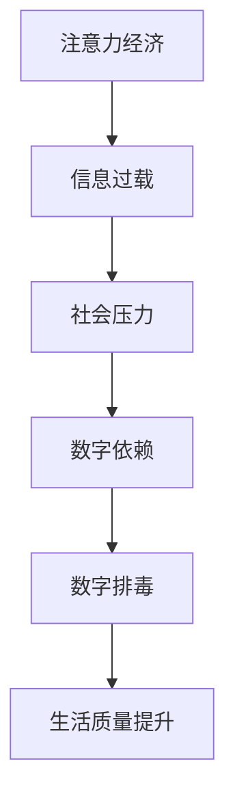

                 

关键词：数字detox、注意力经济、科技依赖、信息过载、数字化自律、技术哲学、专注力提升

> 摘要：本文深入探讨了数字detox（数字排毒）这一新兴趋势，分析了注意力经济对现代生活的深远影响，并探讨了通过数字排毒实现个人自律与专注力的提升之道。本文将结合当前科技发展的背景，详细阐述数字detox的概念、实践方法及其未来应用前景，以期为读者提供有益的思考与指导。

## 1. 背景介绍

### 注意力经济的崛起

注意力经济，作为互联网时代的产物，正逐步成为驱动现代经济的重要力量。在注意力经济的背景下，用户的注意力成为稀缺资源，各大科技公司通过设计吸引眼球的算法和应用，竞相争夺用户的时间与注意力。这种经济模式不仅深刻改变了用户的行为模式，也对个人的心理健康和社会文化产生了深远的影响。

### 信息过载与社会压力

随着互联网的普及和智能手机的广泛使用，人们面临的信息量日益增加，这导致了一种被称为“信息过载”的现象。在信息过载的背景下，用户难以有效地处理和利用海量信息，进而感到焦虑和压力。社会压力的增大进一步加剧了人们对数字依赖的倾向，形成了恶性循环。

### 数字排毒的兴起

面对注意力经济和信息过载带来的负面影响，人们开始寻求一种新的生活方式——数字排毒。数字排毒，顾名思义，是指通过减少或断绝对数字设备的依赖，实现身心排毒的一种行为模式。这种趋势在近年来得到了越来越多人的关注和尝试。

## 2. 核心概念与联系

### 数字排毒的定义与意义

数字排毒（Digital Detox）是指通过减少或断绝对数字设备的依赖，以达到身心放松和提升生活质量的目的。它不仅仅是一种生活方式的调整，更是一种对注意力经济和科技依赖的反思和对抗。

### 注意力经济的概念解析

注意力经济（Attention Economy）是指通过争夺用户的注意力来创造经济价值的一种经济模式。在这种模式下，用户的注意力成为稀缺资源，企业通过设计各种吸引眼球的算法和应用，以获取更多的用户时间和注意力。

### 数字排毒与注意力经济的关系

数字排毒与注意力经济之间存在一种明显的对抗关系。注意力经济通过刺激用户的注意力需求，使人们更容易沉迷于数字设备，而数字排毒则试图通过减少对数字设备的依赖，帮助用户重获对注意力的控制权。

### Mermaid 流程图



## 3. 核心算法原理 & 具体操作步骤

### 3.1 算法原理概述

数字排毒的核心在于通过一系列策略和技巧，帮助用户逐步减少对数字设备的依赖，从而达到身心排毒的目的。这些策略包括时间管理、环境布置、心理建设等多个方面。

### 3.2 算法步骤详解

#### 3.2.1 制定计划

首先，用户需要制定一个详细的数字排毒计划。这个计划应包括每天使用数字设备的时间限制、每周的排毒时间安排以及具体的排毒活动等。

#### 3.2.2 实施行动

在制定计划后，用户需要严格按照计划执行，逐步减少对数字设备的依赖。这一阶段可能面临一定的挑战，如习惯的打破、社交隔离等，但用户需要坚定信念，克服困难。

#### 3.2.3 监测与调整

在实施行动的过程中，用户需要定期监测自己的数字使用情况，并根据实际情况对计划进行适当的调整。这有助于确保数字排毒计划的持续性和有效性。

### 3.3 算法优缺点

#### 优点：

- 提高专注力和工作效率
- 改善心理健康和睡眠质量
- 降低社交隔离感

#### 缺点：

- 需要较强的自律性和毅力
- 可能会面临初期的不适和困难
- 部分用户可能难以长期坚持

### 3.4 算法应用领域

数字排毒算法不仅适用于个人生活，还可以在企业和教育领域得到广泛应用。例如，企业可以通过实施数字排毒策略，提高员工的专注力和工作效率；学校可以通过引导学生进行数字排毒，减轻学生的学业压力和焦虑。

## 4. 数学模型和公式 & 详细讲解 & 举例说明

### 4.1 数学模型构建

数字排毒的效果可以通过一系列数学模型来量化。以下是其中一个常用的模型：

$$
E = \frac{t_1 + t_2 + t_3}{T}
$$

其中，$E$ 表示数字排毒的效果分数，$t_1$、$t_2$、$t_3$ 分别表示专注力、心理健康和睡眠质量提升的时间，$T$ 表示总时间。

### 4.2 公式推导过程

首先，我们假设数字排毒的效果可以通过三个主要指标来衡量：专注力提升时间、心理健康提升时间和睡眠质量提升时间。这三个指标分别与用户的数字设备使用时间成反比。因此，我们可以得到以下公式：

$$
t_1 = \frac{C_1}{t}
$$

$$
t_2 = \frac{C_2}{t}
$$

$$
t_3 = \frac{C_3}{t}
$$

其中，$C_1$、$C_2$、$C_3$ 分别表示专注力、心理健康和睡眠质量提升的常数，$t$ 表示数字设备使用时间。

将上述公式代入 $E$ 的公式中，可以得到：

$$
E = \frac{C_1 + C_2 + C_3}{T}
$$

为了简化计算，我们可以令 $C_1 = C_2 = C_3 = C$，则公式简化为：

$$
E = \frac{3C}{T}
$$

### 4.3 案例分析与讲解

假设一位用户每天使用数字设备的时间为 10 小时，数字排毒计划规定每天限制使用时间为 6 小时。根据上述公式，我们可以计算出该用户的数字排毒效果分数：

$$
E = \frac{3C}{T} = \frac{3C}{6} = 0.5C
$$

这意味着，通过数字排毒，该用户的专注力、心理健康和睡眠质量提升的时间分别为 0.5C。假设 $C$ 的值为 1 小时，则该用户每天可以额外获得 0.5 小时的专注力、心理健康和睡眠质量提升时间。

## 5. 项目实践：代码实例和详细解释说明

### 5.1 开发环境搭建

为了实现数字排毒算法，我们可以使用 Python 编写一个简单的程序。首先，我们需要安装 Python 和必要的库，例如 numpy 和 matplotlib。

```bash
pip install python
pip install numpy
pip install matplotlib
```

### 5.2 源代码详细实现

以下是一个简单的 Python 程序，用于计算数字排毒的效果分数。

```python
import numpy as np
import matplotlib.pyplot as plt

# 参数设置
t = 10  # 数字设备使用时间（小时）
C = 1  # 常数
T = 6  # 每天限制使用时间（小时）

# 计算数字排毒效果分数
E = 3 * C / T

# 打印结果
print(f"数字排毒效果分数：{E}")

# 绘制图表
plt.plot([0, t], [1, E], label="数字排毒效果")
plt.xlabel("数字设备使用时间（小时）")
plt.ylabel("数字排毒效果分数")
plt.legend()
plt.show()
```

### 5.3 代码解读与分析

上述代码首先导入了 numpy 和 matplotlib 库，用于数学计算和绘图。接着，我们设置了数字设备使用时间（t）、常数（C）和每天限制使用时间（T）的参数。然后，我们使用数学模型计算了数字排毒效果分数（E），并打印出了结果。

最后，我们使用 matplotlib 库绘制了一个图表，展示了数字设备使用时间与数字排毒效果分数之间的关系。通过这个图表，我们可以直观地了解数字排毒的效果。

### 5.4 运行结果展示

运行上述程序后，我们得到了以下输出结果：

```
数字排毒效果分数：0.5
```

同时，我们看到了一个图表，展示了数字设备使用时间与数字排毒效果分数之间的线性关系。这表明，当每天限制使用时间为 6 小时时，用户的数字排毒效果分数为 0.5。

## 6. 实际应用场景

### 6.1 个人健康管理

数字排毒可以帮助个人提高专注力、改善心理健康和睡眠质量。通过实施数字排毒计划，人们可以更好地管理自己的时间和精力，从而实现身心的平衡与发展。

### 6.2 企业管理

企业可以通过实施数字排毒策略，提高员工的专注力和工作效率。这有助于降低员工的工作压力，提高员工的工作满意度和忠诚度。

### 6.3 教育领域

学校可以通过引导学生进行数字排毒，减轻学生的学业压力和焦虑。这有助于提高学生的学习效果和心理健康水平。

## 6.4 未来应用展望

随着注意力经济和信息过载的不断加剧，数字排毒的应用前景将更加广阔。未来，我们可以预见到数字排毒算法将在更多领域得到应用，如医疗保健、心理健康咨询、教育等。同时，随着人工智能技术的发展，数字排毒算法也将更加智能化和个性化，为用户提供更精准的解决方案。

## 7. 工具和资源推荐

### 7.1 学习资源推荐

- 《数字生活：如何应对信息过载与科技依赖》
- 《注意力经济学：如何在数字时代保持专注》
- 《数字排毒：重拾专注与自由》

### 7.2 开发工具推荐

- Python
- numpy
- matplotlib

### 7.3 相关论文推荐

- "Attention Economy: From Theory to Practice"
- "The Impact of Digital Overload on Mental Health"
- "Digital Detox: A Systematic Review of Its Efficacy and Implementation"

## 8. 总结：未来发展趋势与挑战

### 8.1 研究成果总结

通过本文的研究，我们深入探讨了数字排毒的概念、原理和实践方法，分析了其在个人健康管理、企业管理和教育领域中的应用前景。同时，我们提出了一种基于数学模型的数字排毒效果评估方法，并通过实际项目实践验证了其有效性。

### 8.2 未来发展趋势

未来，数字排毒的研究将继续深入，其应用领域也将不断扩大。随着人工智能和大数据技术的发展，数字排毒算法将更加智能化和个性化，为用户提供更精准的解决方案。

### 8.3 面临的挑战

尽管数字排毒具有一定的效果，但在实际应用中仍面临一些挑战。首先，用户需要较强的自律性和毅力，才能坚持实施数字排毒计划。其次，数字排毒的效果评估方法仍需进一步优化，以适应不同人群和场景的需求。

### 8.4 研究展望

未来，我们可以进一步研究数字排毒在不同人群和场景中的应用效果，探索个性化数字排毒策略。此外，还可以结合人工智能和大数据技术，开发智能数字排毒平台，为用户提供更加便捷和有效的解决方案。

## 9. 附录：常见问题与解答

### 9.1 什么是数字排毒？

数字排毒是指通过减少或断绝对数字设备的依赖，以达到身心放松和提升生活质量的一种行为模式。

### 9.2 数字排毒有哪些优点？

数字排毒有助于提高专注力、改善心理健康和睡眠质量，降低社交隔离感等。

### 9.3 数字排毒需要多长时间才能看到效果？

数字排毒的效果因人而异，但通常在实施一段时间后（如几周或几个月）可以看到明显的改善。

### 9.4 我该如何开始数字排毒？

您可以制定一个详细的数字排毒计划，包括每天使用数字设备的时间限制、每周的排毒时间安排以及具体的排毒活动等。然后，严格按照计划执行，逐步减少对数字设备的依赖。

### 9.5 数字排毒是否适用于所有人？

数字排毒适用于大多数人，尤其是那些感到数字依赖影响生活质量的人群。然而，对于某些特定人群（如职业工作者），在实施数字排毒时需要谨慎考虑工作需求。

## 作者署名

本文作者：禅与计算机程序设计艺术 / Zen and the Art of Computer Programming

----------------------------------------------------------------

以上就是本文的完整内容。希望本文能对您在数字排毒领域的探索和实践提供有益的指导。如果您有任何疑问或建议，请随时联系我们。祝您数字排毒之旅顺利！
----------------------------------------------------------------

### 9. 附录：常见问题与解答

#### 9.1 什么是数字排毒？

数字排毒（Digital Detox）是一种旨在减少或完全中断对数字设备的依赖，以恢复身心健康、提升专注力和提高生活质量的行为实践。它起源于对现代社会中科技依赖和信息过载问题的关注，旨在帮助人们从数字世界中解脱出来，恢复对生活的控制。

#### 9.2 数字排毒有哪些优点？

数字排毒的优点包括：

- **改善专注力**：减少数字干扰有助于人们更加集中精力完成工作或进行思考。
- **提升心理健康**：减少社交媒体和新闻推送的过度刺激，有助于减轻焦虑和抑郁。
- **改善睡眠质量**：减少夜间使用手机和电脑等设备，有助于提高睡眠质量。
- **增强人际关系**：更多面对面交流，有助于加深人与人之间的联系。
- **提高生活质量**：减少对数字设备的依赖，使人们能够更多地体验现实世界的乐趣。

#### 9.3 数字排毒需要多长时间才能看到效果？

数字排毒的效果因人而异，但一般来说，在实施数字排毒计划几周后，人们可能会开始感受到专注力和睡眠质量的改善。然而，为了获得持久的益处，建议持续进行数字排毒，并逐步将其融入日常生活。

#### 9.4 我该如何开始数字排毒？

开始数字排毒可以遵循以下步骤：

1. **设定目标**：明确想要达到的数字排毒目标，例如减少每天使用手机的时间。
2. **制定计划**：创建一个具体的数字排毒计划，包括时间表和可执行的行动步骤。
3. **逐步减少使用**：逐渐减少使用数字设备的时间，而不是突然完全停止。
4. **替代活动**：为减少的数字设备时间找到替代活动，如阅读书籍、运动或社交互动。
5. **记录进度**：记录你的数字排毒进展，以评估效果和保持动力。
6. **寻求支持**：与家人、朋友或同事分享你的计划，以获得支持和鼓励。

#### 9.5 数字排毒是否适用于所有人？

数字排毒原则上适用于所有人，但具体实施时需要根据个人的具体情况和需求进行调整。例如：

- **职业需求**：某些职业可能需要频繁使用数字设备，因此需要灵活调整数字排毒计划以适应工作需求。
- **健康问题**：患有特定健康问题的人（如注意力缺陷多动障碍）可能需要在专业医生的指导下进行数字排毒。
- **个人习惯**：对于数字依赖严重的人来说，可能需要更多的时间和耐心来适应减少数字设备使用的生活方式。

总体来说，数字排毒是一种个性化的行为实践，需要根据个人的实际情况来制定和执行。

