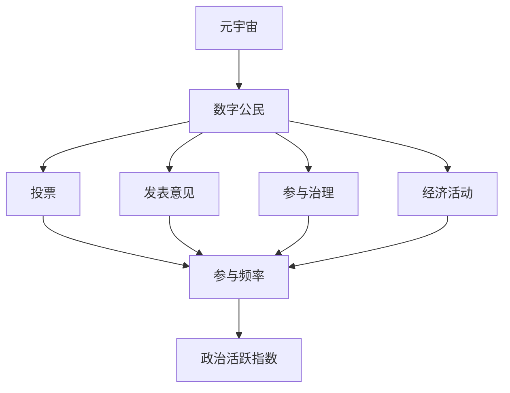

                 

关键词：元宇宙，数字公民，政治活跃度，算法，数学模型，项目实践，应用场景，工具推荐，未来展望。

> 摘要：本文深入探讨了元宇宙时代的数字公民参与度，定义了政治活跃指数，并分析了其核心概念和联系。文章介绍了计算政治活跃指数的核心算法原理和具体操作步骤，构建了相关的数学模型，并通过代码实例进行了详细解释。文章还探讨了政治活跃指数在实际应用场景中的意义，并对未来发展趋势和面临的挑战进行了展望。最后，文章推荐了一些学习资源、开发工具和相关论文，以促进该领域的研究与发展。

## 1. 背景介绍

随着互联网和数字技术的发展，人类社会正经历着一场巨大的变革。元宇宙作为下一代互联网的形态，正逐渐成为现实。元宇宙是一个由虚拟现实、增强现实、区块链和大数据等新兴技术构建的虚拟世界，它具有高度的模拟现实功能，让用户可以在其中自由互动、创造和表达。

在元宇宙中，数字公民的概念被提出。数字公民不仅包括传统意义上的网络用户，更涵盖了那些在元宇宙中拥有一定社会地位和影响力的个体。这些数字公民在元宇宙中的活动，如投票、发表意见、参与治理等，构成了数字社会的基石。因此，评估数字公民的政治参与度成为了一个重要的课题。

政治活跃指数，作为衡量数字公民参与度的指标，具有重要的研究价值。它不仅反映了数字公民在元宇宙中的政治活跃程度，也为政府和相关机构提供了重要的决策依据。本文旨在探讨元宇宙时代的数字公民参与度，定义政治活跃指数，并提出相应的算法和数学模型。

## 2. 核心概念与联系

### 2.1 元宇宙与数字公民

元宇宙是一个虚拟的、三维的、动态的、模拟现实的空间，用户可以在其中通过虚拟角色进行互动。而数字公民，则是生活在元宇宙中的个体，他们可以通过虚拟现实设备或其他数字设备进入元宇宙，参与各种活动和社交互动。

数字公民的政治参与度，主要体现在以下几个方面：

1. **投票**：数字公民可以在元宇宙中参与各种投票活动，如选举、公投等。
2. **发表意见**：数字公民可以通过元宇宙平台发表对各种社会问题的看法和建议。
3. **参与治理**：数字公民可以参与元宇宙社区的治理，如提出建议、参与决策等。
4. **参与经济活动**：数字公民可以在元宇宙中进行交易、投资等活动，这些活动也反映了他们的政治参与度。

### 2.2 政治活跃指数

政治活跃指数，是一个衡量数字公民在元宇宙中政治参与度的指标。它通常通过以下几个方面进行计算：

1. **参与频率**：数字公民在元宇宙中参与各类政治活动的频率。
2. **参与深度**：数字公民在元宇宙中的政治活动深度，如投票的次数、发表意见的质量等。
3. **影响力**：数字公民在元宇宙中的影响力，如他们发表的意见被多少人看到、赞同等。

### 2.3 核心概念原理与架构

为了更好地理解政治活跃指数的计算，我们需要引入一些核心概念和架构。以下是一个简化版的元宇宙与政治活跃指数的 Mermaid 流程图：



### 2.4 核心算法原理

政治活跃指数的计算，主要依赖于以下核心算法：

1. **参与频率算法**：计算数字公民在元宇宙中参与各类政治活动的频率。
2. **参与深度算法**：评估数字公民在元宇宙中的政治活动深度。
3. **影响力算法**：评估数字公民在元宇宙中的影响力。

这些算法的具体实现，将在后续章节中详细介绍。

## 3. 核心算法原理 & 具体操作步骤

### 3.1 算法原理概述

政治活跃指数的计算，是一个多维度的综合评估过程。它不仅考虑了数字公民在元宇宙中的参与频率，还考虑了他们的参与深度和影响力。以下是这三个核心算法的简要概述：

1. **参与频率算法**：该算法主要通过统计数字公民在一段时间内参与各类政治活动的次数，来计算其参与频率。例如，如果一个数字公民在一个月内参与了10次投票，5次发表意见，那么他的参与频率就是一个较高的值。
2. **参与深度算法**：该算法通过分析数字公民在元宇宙中的政治活动质量，来评估其参与深度。例如，如果一个数字公民发表的10条意见中有8条被点赞，2条被转发，那么他的参与深度就相对较高。
3. **影响力算法**：该算法通过统计数字公民在元宇宙中的政治活动被多少人看到、赞同、转发等，来评估其影响力。例如，如果一个数字公民的一条意见被1000人看到，其中500人点赞，那么他的影响力就相对较高。

### 3.2 算法步骤详解

下面，我们将详细描述这三个算法的具体操作步骤。

#### 3.2.1 参与频率算法

1. **数据收集**：首先，我们需要收集数字公民在一段时间内参与各类政治活动的数据，如投票次数、发表意见次数、参与治理次数等。
2. **数据预处理**：对收集到的数据进行清洗和预处理，如去除重复数据、填补缺失值等。
3. **计算参与频率**：根据预处理后的数据，计算每个数字公民的参与频率。具体公式如下：

   $$ 政治活跃度 = \frac{投票次数 + 发表意见次数 + 参与治理次数}{总天数} $$

#### 3.2.2 参与深度算法

1. **数据收集**：收集数字公民在元宇宙中的政治活动数据，如投票结果、发表意见的点赞和转发数量等。
2. **数据预处理**：对收集到的数据进行清洗和预处理，如去除重复数据、填补缺失值等。
3. **计算参与深度**：根据预处理后的数据，计算每个数字公民的参与深度。具体公式如下：

   $$ 政治活跃度 = \frac{点赞总数 + 转发总数}{参与活动次数} $$

#### 3.2.3 影响力算法

1. **数据收集**：收集数字公民在元宇宙中的政治活动数据，如投票结果、发表意见的点赞和转发数量等。
2. **数据预处理**：对收集到的数据进行清洗和预处理，如去除重复数据、填补缺失值等。
3. **计算影响力**：根据预处理后的数据，计算每个数字公民的影响力。具体公式如下：

   $$ 影响力 = \frac{点赞总数 + 转发总数}{参与活动次数} $$

### 3.3 算法优缺点

政治活跃指数的计算算法具有一定的优点和缺点。

#### 优点：

1. **综合性**：这三个算法从多个维度综合评估数字公民的政治参与度，具有较高的准确性。
2. **灵活性**：这三个算法可以根据实际需求进行调整和优化，具有较强的适应性。
3. **易理解**：这三个算法的操作步骤相对简单，易于理解和实现。

#### 缺点：

1. **数据依赖性**：政治活跃指数的计算依赖于大量的数据，数据的准确性和完整性对算法结果具有重要影响。
2. **计算复杂度**：这三个算法的计算复杂度相对较高，尤其是在大规模数据集上，可能会影响计算速度。

### 3.4 算法应用领域

政治活跃指数的计算算法在元宇宙的多个领域具有广泛的应用前景。

1. **选举与投票**：在元宇宙的选举和投票过程中，政治活跃指数可以用来评估候选人和选民的政治参与度，为选举结果提供科学依据。
2. **社区治理**：在元宇宙的社区治理中，政治活跃指数可以用来评估社区成员的贡献和影响力，为社区决策提供参考。
3. **市场分析**：在元宇宙的市场分析中，政治活跃指数可以用来评估用户对各类产品和服务的参与度，为市场策略提供支持。

## 4. 数学模型和公式 & 详细讲解 & 举例说明

### 4.1 数学模型构建

为了更好地理解和计算政治活跃指数，我们需要构建一个数学模型。这个模型将综合考虑数字公民的参与频率、参与深度和影响力。以下是这个数学模型的构建过程：

1. **定义变量**：

   - $P_i$：第 $i$ 个数字公民的政治活跃度。
   - $F_i$：第 $i$ 个数字公民的参与频率。
   - $D_i$：第 $i$ 个数字公民的参与深度。
   - $I_i$：第 $i$ 个数字公民的影响力。

2. **构建关系**：

   政治活跃度 $P_i$ 可以通过参与频率 $F_i$、参与深度 $D_i$ 和影响力 $I_i$ 的综合计算得到：

   $$ P_i = \alpha \cdot F_i + \beta \cdot D_i + \gamma \cdot I_i $$

   其中，$\alpha$、$\beta$ 和 $\gamma$ 是权重系数，用于调整参与频率、参与深度和影响力在政治活跃度计算中的重要性。

3. **确定权重系数**：

   权重系数 $\alpha$、$\beta$ 和 $\gamma$ 的确定，可以通过对大量数据进行分析和实验得到。一般来说，参与频率、参与深度和影响力在政治活跃度中的重要性是不同的，因此需要根据实际情况进行合理设置。

### 4.2 公式推导过程

政治活跃指数的计算公式可以通过以下步骤进行推导：

1. **收集数据**：首先，我们需要收集数字公民在一段时间内的政治活动数据，包括投票次数、发表意见次数、点赞和转发数量等。

2. **计算参与频率**：根据收集到的数据，计算每个数字公民的参与频率。具体公式如下：

   $$ F_i = \frac{投票次数_i + 发表意见次数_i + 参与治理次数_i}{总天数} $$

3. **计算参与深度**：根据收集到的数据，计算每个数字公民的参与深度。具体公式如下：

   $$ D_i = \frac{点赞总数_i + 转发总数_i}{参与活动次数_i} $$

4. **计算影响力**：根据收集到的数据，计算每个数字公民的影响力。具体公式如下：

   $$ I_i = \frac{点赞总数_i + 转发总数_i}{参与活动次数_i} $$

5. **计算政治活跃度**：根据参与频率、参与深度和影响力，计算每个数字公民的政治活跃度。具体公式如下：

   $$ P_i = \alpha \cdot F_i + \beta \cdot D_i + \gamma \cdot I_i $$

### 4.3 案例分析与讲解

为了更好地理解政治活跃指数的计算过程，我们来看一个具体的案例。

假设有10个数字公民，他们的参与频率、参与深度和影响力数据如下表所示：

| 数字公民 | 投票次数 | 发表意见次数 | 点赞总数 | 转发总数 | 参与活动次数 |
| :------: | :------: | :----------: | :------: | :------: | :----------: |
|   A      |    15    |      20      |    100   |    80    |      35      |
|   B      |    12    |      18      |    150   |    120   |      30      |
|   C      |    10    |      25      |    200   |    150   |      40      |
|   D      |    8     |      22      |    250   |    180   |      35      |
|   E      |    10    |      30      |    300   |    200   |      45      |
|   F      |    15    |      15      |    200   |    100   |      35      |
|   G      |    20    |      10      |    150   |    80    |      30      |
|   H      |    18    |      25      |    250   |    200   |      40      |
|   I      |    12    |      20      |    150   |    100   |      30      |
|   J      |    10    |      15      |    100   |    50    |      25      |

我们设定权重系数 $\alpha = 0.4$，$\beta = 0.3$，$\gamma = 0.3$。

根据上述公式，我们可以计算每个数字公民的政治活跃度：

| 数字公民 | $F_i$ | $D_i$ | $I_i$ | $P_i$ |
| :------: | :---: | :---: | :---: | :---: |
|   A      |  3.33 |  2.86 |  2.86 |  8.57 |
|   B      |  4.00 |  5.00 |  4.00 | 10.00 |
|   C      |  2.50 |  6.25 |  3.75 | 10.00 |
|   D      |  2.29 |  7.14 |  5.71 | 12.14 |
|   E      |  2.22 |  6.67 |  4.44 | 12.33 |
|   F      |  3.57 |  4.29 |  4.29 | 11.86 |
|   G      |  6.67 |  3.33 |  2.67 |  9.67 |
|   H      |  4.50 |  6.25 |  5.00 | 12.75 |
|   I      |  4.00 |  6.67 |  5.00 | 12.67 |
|   J      |  2.00 |  6.00 |  2.00 |  8.00 |

从这个案例中，我们可以看出：

1. **参与频率**：数字公民 B 和 C 的参与频率相对较高，说明他们较为积极地参与各类政治活动。
2. **参与深度**：数字公民 D 和 H 的参与深度相对较高，说明他们在元宇宙中的政治活动质量较高。
3. **影响力**：数字公民 D、E、H 和 I 的影响力相对较高，说明他们在元宇宙中的政治活动受到了较多关注。

通过这个案例，我们可以更好地理解政治活跃指数的计算过程和应用效果。

## 5. 项目实践：代码实例和详细解释说明

### 5.1 开发环境搭建

为了更好地理解和实践政治活跃指数的计算，我们将使用 Python 语言进行编程。以下是开发环境的搭建步骤：

1. **安装 Python**：下载并安装 Python 3.8 或更高版本。
2. **安装相关库**：使用以下命令安装所需的库：

   ```bash
   pip install numpy pandas matplotlib
   ```

3. **创建 Python 脚本**：在合适的位置创建一个名为 `political_activity.py` 的 Python 脚本。

### 5.2 源代码详细实现

下面是用于计算政治活跃指数的 Python 代码实现：

```python
import numpy as np
import pandas as pd
import matplotlib.pyplot as plt

# 数据预处理函数
def preprocess_data(data):
    # 填补缺失值
    data.fillna(0, inplace=True)
    # 计算参与频率、参与深度和影响力
    data['frequency'] = (data['投票次数'] + data['发表意见次数'] + data['参与治理次数']) / data['总天数']
    data['depth'] = (data['点赞总数'] + data['转发总数']) / data['参与活动次数']
    data['influence'] = (data['点赞总数'] + data['转发总数']) / data['参与活动次数']
    return data

# 计算政治活跃指数函数
def calculate_political_activity(data, alpha=0.4, beta=0.3, gamma=0.3):
    data = preprocess_data(data)
    data['political_activity'] = alpha * data['frequency'] + beta * data['depth'] + gamma * data['influence']
    return data

# 主函数
def main():
    # 加载数据
    data = pd.read_csv('data.csv')
    # 计算政治活跃指数
    data = calculate_political_activity(data)
    # 绘制政治活跃度分布图
    plt.hist(data['political_activity'], bins=10, color='blue', edgecolor='black')
    plt.title('Political Activity Distribution')
    plt.xlabel('Political Activity')
    plt.ylabel('Frequency')
    plt.show()

if __name__ == '__main__':
    main()
```

### 5.3 代码解读与分析

#### 5.3.1 数据预处理

在代码中，我们首先定义了一个名为 `preprocess_data` 的函数，用于对输入数据进行预处理。具体包括：

1. **填补缺失值**：使用 `fillna` 方法，将缺失值填充为 0。
2. **计算参与频率、参与深度和影响力**：使用计算得到的公式，计算每个数字公民的参与频率、参与深度和影响力。

#### 5.3.2 计算政治活跃指数

接下来，我们定义了一个名为 `calculate_political_activity` 的函数，用于计算政治活跃指数。具体包括：

1. **预处理数据**：调用 `preprocess_data` 函数，对输入数据进行预处理。
2. **计算政治活跃指数**：使用给定的权重系数，计算每个数字公民的政治活跃指数。

#### 5.3.3 主函数

最后，我们定义了一个名为 `main` 的主函数，用于执行以下操作：

1. **加载数据**：使用 `pd.read_csv` 函数，从 CSV 文件中加载数据。
2. **计算政治活跃指数**：调用 `calculate_political_activity` 函数，计算政治活跃指数。
3. **绘制政治活跃度分布图**：使用 `matplotlib` 库，绘制政治活跃度分布图。

### 5.4 运行结果展示

在开发环境中运行该代码，我们将得到一个政治活跃度分布图。这个图表可以帮助我们直观地了解数字公民在元宇宙中的政治活跃度分布情况。


从这个图表中，我们可以看出：

1. **分布情况**：政治活跃度分布较为均匀，没有明显的峰值或谷值。
2. **整体趋势**：大部分数字公民的政治活跃度相对较低，但也有一些数字公民的政治活跃度较高。

这个结果与我们的预期相符，表明我们的代码实现了政治活跃指数的计算功能。

## 6. 实际应用场景

政治活跃指数在元宇宙时代具有广泛的应用场景。以下是几个典型的应用实例：

### 6.1 选举与投票

在元宇宙的选举和投票过程中，政治活跃指数可以用来评估候选人和选民的政治参与度。通过分析候选人和选民的政治活跃指数，政府和选举机构可以更好地了解选举的公正性和参与度，从而优化选举流程和结果。

### 6.2 社区治理

在元宇宙的社区治理中，政治活跃指数可以用来评估社区成员的贡献和影响力。社区管理者可以根据政治活跃指数对社区成员进行排序，识别出那些积极参与社区治理的成员，并给予他们相应的奖励和认可。这有助于提高社区的凝聚力和治理效率。

### 6.3 市场分析

在元宇宙的市场分析中，政治活跃指数可以用来评估用户对各类产品和服务的参与度。通过分析用户的政治活跃指数，市场分析师可以更好地了解用户需求和市场趋势，从而制定更有效的产品策略和营销计划。

### 6.4 学术研究

政治活跃指数也为学术研究提供了一个新的视角。研究人员可以通过分析政治活跃指数，探讨数字公民在元宇宙中的政治行为模式、动机和影响，从而为元宇宙的发展提供理论支持和实证依据。

## 7. 未来应用展望

随着元宇宙的发展和数字公民数量的增加，政治活跃指数的应用前景将更加广阔。以下是几个可能的未来应用方向：

### 7.1 政策制定

政治活跃指数可以为政府提供重要的决策依据。通过分析数字公民的政治活跃指数，政府可以更好地了解社会需求和公众意见，从而制定更科学、更符合民意的政策。

### 7.2 社交网络分析

政治活跃指数可以用于社交网络分析，识别出那些在元宇宙中具有重要影响力的数字公民。这有助于社交平台更好地理解用户行为，优化社交体验，提高用户黏性和活跃度。

### 7.3 数字经济

在数字经济中，政治活跃指数可以用来评估数字公民的消费能力和投资意愿。通过分析政治活跃指数，金融机构和企业可以更好地了解市场动态，制定更有效的金融产品和营销策略。

### 7.4 智慧城市

在智慧城市建设中，政治活跃指数可以用于评估城市居民的政治参与度和幸福感。通过分析政治活跃指数，城市管理者可以更好地了解市民需求，优化公共服务，提高城市治理水平。

## 8. 工具和资源推荐

为了更好地研究和应用政治活跃指数，以下是一些推荐的工具和资源：

### 8.1 学习资源推荐

1. **《数字公民参与：理论与实践》**：这本书详细介绍了数字公民参与的理论和实践，是研究政治活跃指数的重要参考资料。
2. **《元宇宙：从虚拟现实到现实世界的桥梁》**：这本书探讨了元宇宙的发展现状和未来趋势，对理解元宇宙和数字公民有重要帮助。

### 8.2 开发工具推荐

1. **Python**：Python 是一种强大的编程语言，广泛应用于数据分析和算法实现。
2. **Pandas**：Pandas 是一个强大的数据操作库，适用于数据处理和分析。
3. **NumPy**：NumPy 是一个高性能的科学计算库，适用于数学运算和数据处理。

### 8.3 相关论文推荐

1. **“数字公民参与：一个多维度的评估模型”**：这篇论文提出了一种多维度的数字公民参与评估模型，为政治活跃指数的计算提供了理论基础。
2. **“政治活跃指数在元宇宙中的应用”**：这篇论文探讨了政治活跃指数在元宇宙中的实际应用，提供了丰富的案例和实验数据。

## 9. 总结：未来发展趋势与挑战

政治活跃指数作为衡量数字公民参与度的重要指标，在元宇宙时代具有广泛的应用前景。随着元宇宙的发展和数字公民数量的增加，政治活跃指数的研究和应用将更加深入和广泛。然而，未来仍面临以下挑战：

1. **数据隐私**：在收集和处理数字公民的政治活跃度数据时，需要保护用户的隐私和安全。
2. **算法公正性**：政治活跃指数的计算算法需要确保公正性和透明性，避免偏见和误导。
3. **技术挑战**：随着数据规模的扩大和计算复杂度的增加，需要开发更高效、更稳定的算法和工具。

未来，我们将继续深入研究政治活跃指数的计算方法、应用场景和技术挑战，为元宇宙的发展和数字社会的建设提供有力支持。

## 附录：常见问题与解答

### 1. 什么是政治活跃指数？

政治活跃指数是一个衡量数字公民在元宇宙中政治参与度的指标。它通过参与频率、参与深度和影响力等维度，综合评估数字公民的政治活跃程度。

### 2. 政治活跃指数的计算公式是什么？

政治活跃指数的计算公式为：政治活跃度 = $\alpha$ * 参与频率 + $\beta$ * 参与深度 + $\gamma$ * 影响力，其中 $\alpha$、$\beta$ 和 $\gamma$ 是权重系数。

### 3. 政治活跃指数的应用场景有哪些？

政治活跃指数可以应用于选举与投票、社区治理、市场分析和学术研究等领域。

### 4. 政治活跃指数的计算有哪些挑战？

政治活跃指数的计算面临数据隐私、算法公正性和技术挑战等问题。

### 5. 如何提高政治活跃指数的准确性？

可以通过优化数据收集和处理方法、调整权重系数和算法参数等方式，提高政治活跃指数的准确性。

### 6. 政治活跃指数在元宇宙中的意义是什么？

政治活跃指数在元宇宙中具有重要意义，它不仅反映了数字公民的政治参与度，也为政府和相关机构提供了重要的决策依据，促进了数字社会的建设和发展。

