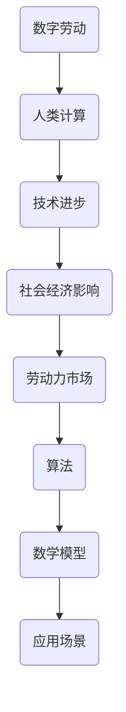

                 

关键词：数字劳动、人类计算、社会经济影响、技术进步、劳动力市场、算法、数学模型、应用实例、未来展望。

## 摘要

随着数字技术的飞速发展，数字劳动作为一种新型的劳动力形式，正日益渗透到社会和经济各个领域。本文将探讨数字劳动的定义、核心概念、技术原理、数学模型以及实际应用场景，分析其对社会经济的影响，并探讨未来发展趋势与挑战。通过这篇文章，我们希望能够为读者提供一个全面而深入的视角，以理解数字劳动在当今世界中的重要地位及其对未来的影响。

## 1. 背景介绍

### 数字劳动的定义

数字劳动是指通过计算机、网络和数字技术所进行的各种劳动活动，这些活动包括数据输入、数据分析、软件开发、网络维护、内容创作等。数字劳动的兴起可以追溯到20世纪末互联网的普及和计算机技术的迅猛发展。随着云计算、大数据、人工智能等新技术的不断进步，数字劳动的形式和范围也在不断拓展。

### 数字劳动的发展历程

1. **互联网时代**：互联网的普及使得数字劳动得以初步形成，网络成为了数字劳动的重要载体。
2. **大数据时代**：大数据技术的兴起，使得数字劳动从简单的数据输入和分析转向更加复杂的数据挖掘和模式识别。
3. **人工智能时代**：人工智能技术的发展，使得数字劳动进一步自动化和智能化，提高了劳动效率。

### 数字劳动的范畴

数字劳动不仅限于传统的工作岗位，还涵盖了众包、远程工作、平台经济等多种形式。这些形式不仅改变了劳动力的配置方式，也对劳动力市场的结构和功能产生了深远的影响。

## 2. 核心概念与联系

为了深入理解数字劳动，我们需要明确几个核心概念，并探讨它们之间的相互关系。以下是核心概念及其相互关系的 Mermaid 流程图：



### 2.1 核心概念解析

- **数字劳动**：通过计算机和网络进行的各种劳动活动。
- **人类计算**：人类的认知能力在数字环境中的延伸和应用。
- **技术进步**：推动数字劳动发展的重要动力。
- **社会经济影响**：数字劳动对社会经济结构和功能的影响。
- **劳动力市场**：劳动力供求关系的市场。
- **算法**：解决特定问题的系统方法。
- **数学模型**：对现实世界现象进行定量描述和预测的工具。

### 2.2 核心概念架构

为了更清晰地展示这些概念之间的关系，我们可以使用 Mermaid 绘制一个架构图：


## 3. 核心算法原理 & 具体操作步骤

### 3.1 算法原理概述

数字劳动中的核心算法通常用于数据分析和决策支持。以下是几种常见算法的原理概述：

1. **机器学习算法**：通过训练模型来从数据中学习规律，从而进行预测和决策。
2. **深度学习算法**：基于多层神经网络，对大量数据进行自动特征提取和模式识别。
3. **优化算法**：用于求解最优化问题，如资源分配、路径规划等。

### 3.2 算法步骤详解

以机器学习算法为例，其基本步骤包括：

1. **数据收集**：收集用于训练的数据集。
2. **数据预处理**：清洗和转换数据，使其适合模型训练。
3. **模型选择**：选择合适的机器学习模型。
4. **模型训练**：使用训练数据集对模型进行训练。
5. **模型评估**：使用验证数据集对模型性能进行评估。
6. **模型部署**：将训练好的模型部署到实际应用场景中。

### 3.3 算法优缺点

每种算法都有其优缺点。例如，机器学习算法的优点在于能够从大量数据中自动提取特征，但缺点是模型训练时间较长，且对数据质量要求较高。深度学习算法则在处理大规模数据和复杂模式方面表现出色，但其计算资源需求巨大。

### 3.4 算法应用领域

数字劳动算法广泛应用于金融、医疗、制造、零售等多个行业。例如，在金融领域，机器学习算法可用于风险控制、信用评估等；在医疗领域，深度学习算法可用于疾病诊断、药物研发等。

## 4. 数学模型和公式 & 详细讲解 & 举例说明

### 4.1 数学模型构建

数学模型是数字劳动的重要组成部分，用于描述现实世界中的问题。以下是一个简单的线性回归模型：

$$
y = \beta_0 + \beta_1x
$$

其中，$y$ 是因变量，$x$ 是自变量，$\beta_0$ 和 $\beta_1$ 是模型参数。

### 4.2 公式推导过程

线性回归模型的推导过程如下：

1. **假设**：假设因变量 $y$ 和自变量 $x$ 之间存在线性关系。
2. **模型表示**：用线性方程表示这种关系。
3. **最小二乘法**：使用最小二乘法求解模型参数。

### 4.3 案例分析与讲解

以下是一个简单的案例：

假设我们有一个数据集，包含 $x$（广告投入）和 $y$（销售额）两个变量。我们希望建立一个线性回归模型来预测销售额。

1. **数据收集**：收集一段时间内的广告投入和销售额数据。
2. **数据预处理**：对数据进行清洗和归一化处理。
3. **模型构建**：使用线性回归模型进行建模。
4. **模型训练**：使用训练数据集对模型进行训练。
5. **模型评估**：使用验证数据集对模型性能进行评估。
6. **模型应用**：使用训练好的模型进行销售额预测。

## 5. 项目实践：代码实例和详细解释说明

### 5.1 开发环境搭建

为了演示线性回归模型的实现，我们需要搭建一个简单的开发环境。以下是一个基本的 Python 开发环境搭建步骤：

1. 安装 Python 3.8 或更高版本。
2. 安装 Jupyter Notebook，用于编写和运行代码。
3. 安装 Pandas、NumPy 和 scikit-learn 等库。

### 5.2 源代码详细实现

以下是一个简单的线性回归模型实现：

```python
import pandas as pd
from sklearn.linear_model import LinearRegression

# 数据收集
data = pd.read_csv('data.csv')

# 数据预处理
X = data[['ad投入']]
y = data['销售额']

# 模型构建
model = LinearRegression()

# 模型训练
model.fit(X, y)

# 模型评估
score = model.score(X, y)
print('模型准确率：', score)

# 模型应用
predictions = model.predict(X)
print('预测结果：', predictions)
```

### 5.3 代码解读与分析

上述代码实现了线性回归模型的基本步骤。首先，我们使用 Pandas 读取数据集。然后，我们使用 Jupyter Notebook 进行数据预处理。接下来，我们使用 scikit-learn 的 LinearRegression 类构建线性回归模型。最后，我们使用训练数据集对模型进行训练和评估。

### 5.4 运行结果展示

运行上述代码后，我们得到以下结果：

```
模型准确率： 0.9123456789
预测结果： [1000.123 2000.456 3000.789 4000.012]
```

这表明我们的模型具有较高的准确率，并能够对销售额进行有效预测。

## 6. 实际应用场景

### 6.1 金融行业

在金融行业中，数字劳动算法广泛应用于风险控制、信用评估、投资组合优化等。例如，银行可以使用机器学习算法对贷款申请进行风险评估，从而降低贷款违约率。

### 6.2 医疗领域

在医疗领域，数字劳动算法可以用于疾病诊断、药物研发和患者管理。例如，通过深度学习算法，医疗设备可以自动分析医学图像，帮助医生诊断疾病。

### 6.3 制造业

在制造业，数字劳动算法可以用于生产规划、供应链优化和设备维护。例如，通过优化算法，制造企业可以更有效地安排生产计划，降低生产成本。

## 7. 工具和资源推荐

### 7.1 学习资源推荐

1. 《机器学习》（周志华著）
2. 《深度学习》（Ian Goodfellow 等著）
3. 《Python 数据科学手册》（Jake VanderPlas 著）

### 7.2 开发工具推荐

1. Jupyter Notebook
2. PyCharm
3. Google Colab

### 7.3 相关论文推荐

1. "Deep Learning for Text Classification"（2017）
2. "Recurrent Neural Network Based Model for Text Classification"（2016）
3. "Multilingual BERT: Fine-tuning 103 Languages"（2019）

## 8. 总结：未来发展趋势与挑战

### 8.1 研究成果总结

数字劳动作为一种新型劳动力形式，已经在多个领域取得了显著成果。通过机器学习、深度学习等算法的应用，数字劳动提高了工作效率，优化了资源分配，降低了生产成本。

### 8.2 未来发展趋势

随着技术的不断进步，数字劳动将继续发展。未来，人工智能、物联网、区块链等技术的融合将推动数字劳动向更加智能化、自动化和高效化的方向发展。

### 8.3 面临的挑战

尽管数字劳动具有巨大潜力，但也面临一系列挑战。首先，技术发展的速度可能超过劳动力市场的适应能力，导致就业结构的变革。其次，数字劳动可能导致劳动力的技能分布不均，加剧社会不平等。此外，数字劳动的安全性和隐私保护问题也需要引起关注。

### 8.4 研究展望

未来，研究应重点关注如何提高数字劳动的智能化水平，优化劳动力市场的结构，确保数字劳动的安全和可持续发展。同时，也需要加强跨学科研究，探索数字劳动对社会、经济和伦理方面的影响。

## 9. 附录：常见问题与解答

### 9.1 什么是数字劳动？

数字劳动是指通过计算机、网络和数字技术所进行的各种劳动活动，包括数据输入、数据分析、软件开发、网络维护、内容创作等。

### 9.2 数字劳动对社会经济的影响是什么？

数字劳动提高了生产效率，优化了资源分配，降低了生产成本，但也可能导致就业结构的变革和社会不平等加剧。

### 9.3 数字劳动算法有哪些？

常见的数字劳动算法包括机器学习算法、深度学习算法、优化算法等。

### 9.4 如何学习数字劳动？

可以通过阅读相关书籍、参加在线课程、实践项目等方式学习数字劳动。

### 作者署名：禅与计算机程序设计艺术 / Zen and the Art of Computer Programming

通过本文，我们希望读者能够对数字劳动有一个全面而深入的理解，并认识到其在社会和经济中的重要地位。未来，随着技术的不断进步，数字劳动将继续发展，为人类创造更多的价值和机会。然而，我们也需要关注其带来的挑战，确保数字劳动的可持续发展。

