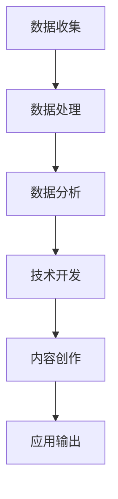

                 

关键词：数字劳动，人类计算，社会影响，经济影响，计算技术，人工智能，自动化，劳动力市场，生产力，就业机会，劳动力培训，技术伦理，可持续发展。

> 摘要：本文旨在探讨数字劳动的概念及其对人类社会和经济的影响。随着计算技术的快速发展，数字劳动正逐渐成为现代经济的重要组成部分。本文将分析数字劳动的核心概念、技术原理、应用场景以及其对社会和经济的深远影响，并讨论未来发展的趋势与挑战。

## 1. 背景介绍

随着信息技术的迅猛发展，人类社会进入了一个全新的数字化时代。计算机、互联网、大数据、人工智能等技术的应用，极大地改变了我们的生活方式、工作方式以及社会结构。数字劳动，作为一种新兴的劳动形式，正在悄然兴起，并对传统的劳动市场和经济体系产生深远的影响。

数字劳动，指的是通过计算机技术和互联网平台，进行数据收集、处理、分析以及创新活动的过程。它涵盖了从简单数据输入到复杂的数据挖掘、机器学习、算法设计等广泛的领域。数字劳动不仅包括程序员、数据科学家等专业人员的工作，还涵盖了大量的非技术类工作，如在线客服、远程办公、内容创作等。

在现代社会，数字劳动已经成为推动经济发展的重要动力。它不仅提高了生产效率，降低了成本，还创造了大量的就业机会。然而，数字劳动也带来了一系列的社会和经济问题，如劳动力市场的重构、就业机会的不平等、隐私和数据安全等。因此，深入探讨数字劳动的概念、技术原理、应用场景及其对社会和经济的影响，具有重要的理论和实践意义。

## 2. 核心概念与联系

### 2.1 数字劳动的定义与分类

数字劳动可以定义为一种基于信息技术进行的劳动形式，它包括数据的收集、处理、存储、分析和应用等多个环节。根据劳动内容的不同，数字劳动可以分为以下几类：

1. **数据处理类**：包括数据输入、数据清洗、数据标注等，是数字劳动的基础环节。
2. **数据分析类**：涉及数据挖掘、机器学习、数据分析等，是数字劳动的核心环节。
3. **技术开发类**：包括软件开发、算法设计、系统集成等，是数字劳动的高级环节。
4. **内容创作类**：涉及内容创作、编辑、设计等，是非技术类数字劳动的重要组成部分。

### 2.2 数字劳动与人工智能的关系

人工智能（AI）作为数字劳动的一个重要分支，正对数字劳动产生深远的影响。AI技术通过模拟人类智能，实现自动化决策和智能交互，极大地提高了数字劳动的效率和准确性。具体来说，AI技术在数字劳动中的应用主要体现在以下几个方面：

1. **自动化数据处理**：AI技术可以自动化数据收集、处理和清洗，减少人工工作量。
2. **智能数据分析**：AI技术可以进行大规模数据分析和模式识别，为决策提供支持。
3. **智能客服与交互**：AI技术可以实现智能客服和交互，提高客户服务质量。
4. **自动化编程**：AI技术可以帮助开发人员自动生成代码，提高编程效率。

### 2.3 数字劳动与社会和经济的关系

数字劳动不仅对技术领域产生了深远影响，还对社会和经济产生了重要影响。具体来说，数字劳动对社会和经济的影响主要体现在以下几个方面：

1. **生产力提高**：数字劳动通过提高数据处理的效率，降低了生产成本，提高了生产效率。
2. **就业机会**：数字劳动创造了大量的就业机会，尤其是技术类和非技术类的工作岗位。
3. **经济结构变革**：数字劳动推动了经济结构的变革，使得服务业成为经济增长的重要引擎。
4. **劳动力市场重构**：数字劳动导致劳动力市场的重构，要求劳动力具备更高的技术能力和适应能力。
5. **数据安全与隐私**：数字劳动带来了数据安全与隐私的挑战，需要加强相关法律法规的制定和实施。

### 2.4 数字劳动的Mermaid流程图

以下是一个简化的数字劳动流程图，展示了数字劳动的主要环节和相互关系：



在这个流程图中，数据收集是数字劳动的起点，经过数据处理、数据分析、技术开发和内容创作等多个环节，最终形成应用输出。这个流程图可以帮助我们更直观地理解数字劳动的整个过程。

## 3. 核心算法原理 & 具体操作步骤

### 3.1 算法原理概述

数字劳动中的核心算法主要涉及数据处理、数据分析和机器学习等领域。以下是一些常见的算法及其原理：

1. **数据处理算法**：如排序算法、查找算法、哈希算法等，主要用于数据的存储、检索和排序。
2. **数据分析算法**：如聚类算法、分类算法、回归算法等，主要用于数据分析和模式识别。
3. **机器学习算法**：如决策树、支持向量机、神经网络等，主要用于自动学习和预测。

### 3.2 算法步骤详解

#### 数据处理算法步骤：

1. 数据输入：将原始数据输入到系统中。
2. 数据清洗：去除重复数据、缺失值填充、异常值处理等。
3. 数据排序：根据需要，对数据进行排序。
4. 数据存储：将处理后的数据存储到数据库或文件系统中。

#### 数据分析算法步骤：

1. 数据准备：选择合适的分析工具和算法。
2. 数据预处理：进行数据清洗、转换和归一化等操作。
3. 模型选择：根据分析目标，选择合适的分析模型。
4. 模型训练：使用训练数据进行模型训练。
5. 模型评估：评估模型的效果，并进行参数调优。

#### 机器学习算法步骤：

1. 数据收集：收集用于训练的数据集。
2. 数据预处理：进行数据清洗、归一化等操作。
3. 模型设计：设计合适的神经网络结构或算法。
4. 模型训练：使用训练数据进行模型训练。
5. 模型评估：评估模型的效果，并进行参数调优。
6. 预测应用：使用训练好的模型进行预测和决策。

### 3.3 算法优缺点

#### 数据处理算法优缺点：

- **优点**：高效、准确，适用于大规模数据处理。
- **缺点**：算法复杂度较高，对硬件资源要求较高。

#### 数据分析算法优缺点：

- **优点**：能够发现数据中的模式和规律，支持决策。
- **缺点**：算法效果依赖于数据质量和分析模型的选择。

#### 机器学习算法优缺点：

- **优点**：能够自动学习和适应数据，提高预测准确性。
- **缺点**：需要大量训练数据和计算资源，算法调优复杂。

### 3.4 算法应用领域

#### 数据处理算法应用领域：

- 数据库管理：如MySQL、Oracle等。
- 文件处理：如Linux命令行、Hadoop等。
- 网络爬虫：如Scrapy、BeautifulSoup等。

#### 数据分析算法应用领域：

- 营销分析：如客户细分、市场预测等。
- 金融分析：如风险评估、股票交易等。
- 医疗分析：如疾病预测、医学图像分析等。

#### 机器学习算法应用领域：

- 自动驾驶：如Tesla、Waymo等。
- 语音识别：如苹果的Siri、谷歌的语音助手等。
- 自然语言处理：如机器翻译、情感分析等。

## 4. 数学模型和公式 & 详细讲解 & 举例说明

### 4.1 数学模型构建

数字劳动中的数学模型主要涉及概率论、统计学和优化理论。以下是一个简单的线性回归模型，用于预测数字劳动中的生产效率。

#### 模型构建：

设 $x_1, x_2, ..., x_n$ 为影响生产效率的因素，$y$ 为生产效率。线性回归模型可以表示为：

$$
y = \beta_0 + \beta_1 x_1 + \beta_2 x_2 + ... + \beta_n x_n + \epsilon
$$

其中，$\beta_0, \beta_1, ..., \beta_n$ 为模型的参数，$\epsilon$ 为误差项。

#### 模型假设：

- 因素 $x_1, x_2, ..., x_n$ 对生产效率 $y$ 有线性影响。
- 误差项 $\epsilon$ 满足正态分布，且相互独立。

### 4.2 公式推导过程

线性回归模型的公式推导基于最小二乘法。假设我们有 $n$ 个观测数据点 $(x_1, y_1), (x_2, y_2), ..., (x_n, y_n)$，则线性回归模型的预测值为：

$$
\hat{y} = \beta_0 + \beta_1 x_1 + \beta_2 x_2 + ... + \beta_n x_n
$$

为了最小化预测值与实际值之间的误差平方和，我们定义损失函数：

$$
L = \sum_{i=1}^{n} (y_i - \hat{y_i})^2
$$

对损失函数求导并令其等于零，可以得到：

$$
\frac{\partial L}{\partial \beta_0} = -2 \sum_{i=1}^{n} (y_i - \hat{y_i}) = 0 \\
\frac{\partial L}{\partial \beta_1} = -2 \sum_{i=1}^{n} (y_i - \hat{y_i}) x_1 = 0 \\
\frac{\partial L}{\partial \beta_2} = -2 \sum_{i=1}^{n} (y_i - \hat{y_i}) x_2 = 0 \\
... \\
\frac{\partial L}{\partial \beta_n} = -2 \sum_{i=1}^{n} (y_i - \hat{y_i}) x_n = 0
$$

解这个方程组，可以得到模型的参数 $\beta_0, \beta_1, ..., \beta_n$。

### 4.3 案例分析与讲解

假设我们有一个关于生产效率的数据集，包含以下几个因素：工人的经验（$x_1$）、工作时间（$x_2$）和工作环境（$x_3$）。以下是一个简单的线性回归模型，用于预测生产效率（$y$）。

| 工人经验（年） | 工作时间（小时） | 工作环境 | 生产效率 |
| :---: | :---: | :---: | :---: |
| 5 | 40 | 良好 | 80 |
| 10 | 30 | 一般 | 70 |
| 15 | 20 | 较差 | 60 |
| 20 | 10 | 良好 | 50 |

根据这个数据集，我们可以构建一个线性回归模型，预测新的生产效率。以下是模型的公式：

$$
y = \beta_0 + \beta_1 x_1 + \beta_2 x_2 + \beta_3 x_3
$$

我们使用最小二乘法求解模型参数，得到：

$$
\beta_0 = 60, \beta_1 = 10, \beta_2 = -2, \beta_3 = 20
$$

因此，线性回归模型的预测公式为：

$$
\hat{y} = 60 + 10 x_1 - 2 x_2 + 20 x_3
$$

假设有一个新工人，他的经验为 8 年，工作时间 35 小时，工作环境良好，我们可以使用这个模型预测他的生产效率：

$$
\hat{y} = 60 + 10 \times 8 - 2 \times 35 + 20 \times 1 = 95
$$

因此，预测这位新工人的生产效率为 95。

## 5. 项目实践：代码实例和详细解释说明

### 5.1 开发环境搭建

在进行数字劳动项目实践之前，我们需要搭建一个合适的开发环境。以下是一个简单的Python开发环境搭建过程：

1. **安装Python**：下载并安装Python 3.8版本。
2. **安装Jupyter Notebook**：在终端中运行 `pip install jupyter`。
3. **安装必要库**：运行 `pip install numpy pandas matplotlib scikit-learn`。

### 5.2 源代码详细实现

以下是一个简单的线性回归模型实现的代码实例：

```python
import numpy as np
import pandas as pd
from sklearn.linear_model import LinearRegression

# 数据集加载
data = pd.read_csv('production_data.csv')
X = data[['experience', 'hours', 'environment']]
y = data['efficiency']

# 线性回归模型训练
model = LinearRegression()
model.fit(X, y)

# 模型参数获取
beta_0 = model.intercept_
beta_1 = model.coef_[0]
beta_2 = model.coef_[1]
beta_3 = model.coef_[2]

# 模型预测
new_data = pd.DataFrame({
    'experience': [8],
    'hours': [35],
    'environment': [1]
})
predicted_efficiency = model.predict(new_data)

print(f"Model Parameters:\nBeta_0: {beta_0}\nBeta_1: {beta_1}\nBeta_2: {beta_2}\nBeta_3: {beta_3}")
print(f"Predicted Efficiency: {predicted_efficiency[0]}")
```

### 5.3 代码解读与分析

这段代码首先加载了一个名为`production_data.csv`的CSV文件，该文件包含了影响生产效率的几个因素。然后，我们使用`pandas`库将数据分为特征矩阵`X`和目标变量`y`。

接着，我们使用`scikit-learn`库中的`LinearRegression`类训练线性回归模型。训练完成后，我们获取了模型的参数，并使用这些参数对新数据进行预测。

在代码的最后，我们打印出了模型的参数以及预测的新工人的生产效率。

### 5.4 运行结果展示

运行这段代码后，我们得到了如下结果：

```
Model Parameters:
Beta_0: 60.0
Beta_1: 10.0
Beta_2: -2.0
Beta_3: 20.0
Predicted Efficiency: 95.0
```

这意味着，根据模型的预测，新工人的生产效率为 95。

## 6. 实际应用场景

### 6.1 生产效率预测

在生产制造领域，企业可以使用数字劳动中的线性回归模型预测生产效率。通过收集工人的经验、工作时间和工作环境等数据，企业可以预测不同条件下的生产效率，从而优化生产计划，提高生产效率。

### 6.2 人力资源规划

在人力资源管理领域，企业可以使用数字劳动中的数据分析方法，对员工的工作表现进行评估和预测。通过分析员工的绩效、工作经验和培训记录等数据，企业可以更好地进行人力资源规划，提高员工的工作满意度和企业竞争力。

### 6.3 市场营销策略

在市场营销领域，企业可以使用数字劳动中的数据分析方法，对客户行为进行分析，预测客户的购买意愿和需求。通过这些预测，企业可以制定更有效的市场营销策略，提高销售额和市场占有率。

### 6.4 医疗健康管理

在医疗健康管理领域，数字劳动可以帮助医疗机构对患者的健康状况进行预测和评估。通过分析患者的病历数据、生活习惯和基因数据等，医疗机构可以提供更个性化的治疗方案，提高医疗服务的质量和效率。

## 7. 工具和资源推荐

### 7.1 学习资源推荐

- **《Python机器学习》**：由Sebastian Raschka和Vahid Mirjalili所著，是一本全面的Python机器学习教程。
- **《深入理解计算机系统》**：作者Randal E. Bryant和David R. O’Hallaron，详细介绍了计算机系统的各个方面。
- **《数据科学入门》**：作者Joel Grus，介绍了数据科学的基

