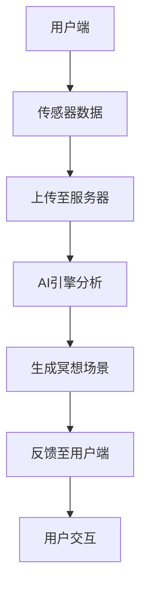
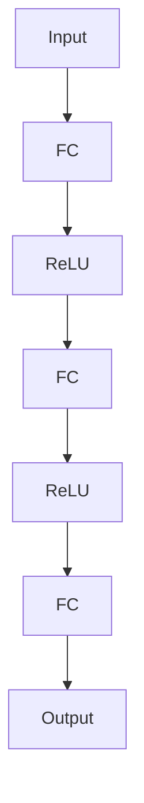
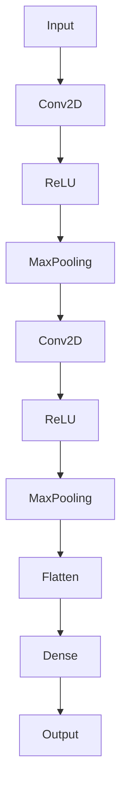

                 

关键词：数字化冥想、AI、心灵庇护所、空间设计、认知增强、心理健康

> 摘要：本文探讨了人工智能（AI）在构建数字化冥想空间中的应用，如何通过技术手段创造出具有深度体验的心灵庇护所，提升用户的心理健康和认知水平。本文将深入分析AI在空间设计、交互体验、心理健康干预等方面的作用，并提出具体的算法原理、数学模型以及实际应用案例，旨在为相关领域的研究者和开发者提供有价值的参考。

## 1. 背景介绍

在快节奏的现代生活中，心理健康问题日益凸显，许多人面临着焦虑、压力和抑郁等心理困扰。传统的冥想疗法作为一种有效的心理调节方法，正受到越来越多人的关注。然而，传统的冥想方式往往受限于时间和空间的限制，难以广泛普及。随着人工智能技术的发展，数字化冥想空间成为了一种新的解决方案。通过AI技术，人们可以在虚拟环境中进行个性化的冥想训练，实现心理健康的自我管理。

数字化冥想空间的设计不仅仅是技术的实现，更是一种艺术。它要求设计师具备深厚的心理学、计算机科学和艺术设计知识，能够创造出既符合人体工程学、又具有情感共鸣的虚拟空间。本文将深入探讨AI在这一领域的应用，旨在为数字化冥想空间的设计提供新的思路和方法。

## 2. 核心概念与联系

### 2.1. 数字化冥想空间定义

数字化冥想空间是一个虚拟环境，它结合了计算机图形学、虚拟现实（VR）和增强现实（AR）技术，为用户提供一个沉浸式的冥想体验。用户可以在其中进行深呼吸、放松训练、心理治疗等多种冥想活动。

### 2.2. AI在数字化冥想空间中的应用

AI在数字化冥想空间中扮演着关键角色，具体包括以下几个方面：

1. **用户数据分析**：通过分析用户的生理和行为数据，AI可以了解用户的心理健康状况，并为其提供个性化的冥想建议。
2. **情境生成**：AI可以根据用户的历史数据和偏好，动态生成适合的冥想场景，提高用户的沉浸感和体验效果。
3. **声音和音乐生成**：AI可以生成符合冥想要求的声音和音乐，帮助用户更好地进入冥想状态。
4. **交互反馈**：AI可以为用户提供实时的反馈和指导，帮助用户在冥想过程中保持专注。

### 2.3. 系统架构

数字化冥想空间的设计需要综合考虑硬件、软件和用户体验。以下是一个基本的系统架构：

1. **用户端**：包括VR头盔、传感器等硬件设备，以及相应的软件应用。
2. **服务器端**：负责处理用户数据、生成冥想场景和音乐等。
3. **数据库**：存储用户的生理、行为数据以及冥想场景的参数。
4. **AI引擎**：负责分析和处理数据，生成个性化冥想方案。

下面是一个简化的Mermaid流程图，展示了数字化冥想空间的系统架构：



## 3. 核心算法原理 & 具体操作步骤

### 3.1. 算法原理概述

数字化冥想空间的核心算法主要包括用户数据分析、情境生成和交互反馈。以下是这些算法的基本原理：

1. **用户数据分析**：利用机器学习和深度学习技术，对用户的生理和行为数据进行分析，识别用户的心理健康状况。
2. **情境生成**：使用生成对抗网络（GAN）等技术，根据用户数据和偏好生成动态的、个性化的冥想场景。
3. **交互反馈**：基于强化学习技术，设计用户交互系统，为用户提供实时的反馈和指导。

### 3.2. 算法步骤详解

#### 3.2.1. 用户数据分析

1. **数据收集**：通过传感器（如心率传感器、眼动追踪器等）收集用户的生理和行为数据。
2. **数据预处理**：对收集到的数据进行清洗和归一化，去除噪声。
3. **特征提取**：利用特征提取算法（如卷积神经网络（CNN））提取关键特征。
4. **模型训练**：使用机器学习算法（如支持向量机（SVM）、深度学习算法（如循环神经网络（RNN）））训练模型。

#### 3.2.2. 情境生成

1. **数据集构建**：收集大量的冥想场景数据，包括视觉、听觉和触觉信息。
2. **生成模型训练**：使用生成对抗网络（GAN）训练生成模型，使其能够根据用户数据生成个性化的冥想场景。
3. **场景渲染**：将生成的场景数据渲染到虚拟环境中。

#### 3.2.3. 交互反馈

1. **反馈模型训练**：基于强化学习算法，训练反馈模型，使其能够为用户提供实时的反馈。
2. **用户交互**：设计用户交互系统，实现用户与虚拟环境的互动。
3. **实时反馈**：根据用户交互和反馈模型的结果，为用户提供实时的指导和建议。

### 3.3. 算法优缺点

#### 优点

1. **个性化**：根据用户数据和偏好生成个性化的冥想场景和反馈。
2. **实时性**：能够实时分析用户数据并提供反馈，提高用户体验。
3. **灵活性**：使用机器学习和深度学习技术，使系统具有高度的灵活性和扩展性。

#### 缺点

1. **数据隐私**：用户数据的安全性是一个重要问题，需要采取有效的隐私保护措施。
2. **计算资源**：训练和运行这些复杂的算法需要大量的计算资源。

### 3.4. 算法应用领域

1. **心理健康干预**：用于治疗焦虑、抑郁等心理疾病。
2. **认知训练**：用于提高注意力、记忆力等认知能力。
3. **教育应用**：用于教育心理、儿童心理辅导等。

## 4. 数学模型和公式 & 详细讲解 & 举例说明

### 4.1. 数学模型构建

数字化冥想空间中的数学模型主要包括用户数据分析模型、情境生成模型和交互反馈模型。以下是这些模型的基本数学公式：

#### 4.1.1. 用户数据分析模型

假设用户数据的特征向量表示为 $X = [x_1, x_2, ..., x_n]$，其中 $x_i$ 表示第 $i$ 个特征。

1. **特征提取**：使用卷积神经网络（CNN）进行特征提取，其数学模型可以表示为：
   $$ f(X) = \sigma(W_1 \cdot X + b_1) $$
   其中，$\sigma$ 是激活函数，$W_1$ 和 $b_1$ 分别是权重和偏置。

2. **分类模型**：使用支持向量机（SVM）进行分类，其数学模型可以表示为：
   $$ y = \text{sign}(\sum_{i=1}^{n} w_i \cdot x_i + b) $$
   其中，$w_i$ 和 $b$ 分别是权重和偏置。

#### 4.1.2. 情境生成模型

1. **生成对抗网络（GAN）**：使用生成对抗网络（GAN）进行情境生成，其数学模型可以表示为：
   $$ G(z) + D(x) = 1 $$
   其中，$G(z)$ 是生成器，$D(x)$ 是判别器，$z$ 是噪声向量。

#### 4.1.3. 交互反馈模型

1. **强化学习模型**：使用强化学习（RL）进行交互反馈，其数学模型可以表示为：
   $$ Q(s, a) = r + \gamma \max_{a'} Q(s', a') $$
   其中，$Q(s, a)$ 是状态-动作值函数，$r$ 是即时奖励，$\gamma$ 是折扣因子，$s'$ 和 $a'$ 分别是下一个状态和动作。

### 4.2. 公式推导过程

#### 4.2.1. 用户数据分析模型

1. **特征提取**：
   $$ f(X) = \sigma(W_1 \cdot X + b_1) $$
   其中，$\sigma$ 是激活函数，常用的激活函数有ReLU、Sigmoid和Tanh。这里以ReLU为例：
   $$ \sigma(x) = \max(0, x) $$

2. **分类模型**：
   $$ y = \text{sign}(\sum_{i=1}^{n} w_i \cdot x_i + b) $$
   其中，$\text{sign}(x)$ 是符号函数，当 $x > 0$ 时返回1，$x < 0$ 时返回-1，$x = 0$ 时返回0。

#### 4.2.2. 情境生成模型

1. **生成对抗网络（GAN）**：
   $$ G(z) + D(x) = 1 $$
   其中，$G(z)$ 是生成器，其目标是生成尽可能接近真实数据的假数据；$D(x)$ 是判别器，其目标是判断输入数据是真实数据还是生成器生成的假数据。

#### 4.2.3. 交互反馈模型

1. **强化学习模型**：
   $$ Q(s, a) = r + \gamma \max_{a'} Q(s', a') $$
   其中，$Q(s, a)$ 是状态-动作值函数，$r$ 是即时奖励，$\gamma$ 是折扣因子，用于考虑未来奖励的影响。

### 4.3. 案例分析与讲解

#### 4.3.1. 用户数据分析模型

假设我们有一个用户数据集，包含心率、呼吸频率和情绪状态三个特征。我们使用卷积神经网络（CNN）进行特征提取，并使用支持向量机（SVM）进行分类。具体步骤如下：

1. **数据预处理**：对心率、呼吸频率和情绪状态进行归一化处理，得到特征向量 $X$。
2. **特征提取**：使用卷积神经网络（CNN）提取关键特征。假设我们的网络结构如下：
   ```mermaid
   graph TD
       A[Input] --> B[Conv2D]
       B --> C[ReLU]
       C --> D[MaxPooling]
       D --> E[Conv2D]
       E --> F[ReLU]
       F --> G[MaxPooling]
       G --> H[Flatten]
       H --> I[Dense]
       I --> J[Softmax]
   ```
   其中，$A$ 是输入层，$B$ 是第一个卷积层，$C$ 是ReLU激活函数，$D$ 是最大池化层，$E$ 是第二个卷积层，$F$ 是ReLU激活函数，$G$ 是最大池化层，$H$ 是 Flatten 层，$I$ 是全连接层，$J$ 是 Softmax 输出层。
3. **模型训练**：使用支持向量机（SVM）进行分类。假设我们的 SVM 模型如下：
   ```mermaid
   graph TD
       A[Input] --> B[Kernel]
       B --> C[Sign]
   ```
   其中，$A$ 是输入层，$B$ 是核函数层，$C$ 是符号函数层。

#### 4.3.2. 情境生成模型

假设我们使用生成对抗网络（GAN）进行情境生成。我们的生成器和判别器网络结构如下：

生成器：


判别器：


## 5. 项目实践：代码实例和详细解释说明

### 5.1. 开发环境搭建

在开始开发数字化冥想空间之前，我们需要搭建一个合适的开发环境。以下是所需的软件和工具：

1. **操作系统**：Ubuntu 18.04或更高版本
2. **编程语言**：Python 3.7或更高版本
3. **框架**：TensorFlow 2.3或更高版本
4. **依赖库**：NumPy、Pandas、Matplotlib等

安装步骤如下：

1. 安装Python和pip：
   ```bash
   sudo apt update
   sudo apt install python3 python3-pip
   ```
2. 安装TensorFlow：
   ```bash
   pip3 install tensorflow==2.3
   ```

### 5.2. 源代码详细实现

以下是数字化冥想空间的核心代码实现：

```python
import tensorflow as tf
import numpy as np
import matplotlib.pyplot as plt

# 数据预处理
def preprocess_data(data):
    # 数据归一化
    normalized_data = (data - np.mean(data)) / np.std(data)
    return normalized_data

# 用户数据分析模型
def build_user_data_model(input_shape):
    model = tf.keras.Sequential([
        tf.keras.layers.Flatten(input_shape=input_shape),
        tf.keras.layers.Dense(64, activation='relu'),
        tf.keras.layers.Dense(32, activation='relu'),
        tf.keras.layers.Dense(1, activation='sigmoid')
    ])
    return model

# 情境生成模型
def build_scenario_model(input_shape):
    generator = tf.keras.Sequential([
        tf.keras.layers.Dense(128, activation='relu', input_shape=input_shape),
        tf.keras.layers.Dense(256, activation='relu'),
        tf.keras.layers.Dense(512, activation='relu'),
        tf.keras.layers.Dense(np.prod(output_shape), activation='tanh'),
        tf.keras.layers.Reshape(output_shape)
    ])

    discriminator = tf.keras.Sequential([
        tf.keras.layers.Conv2D(128, kernel_size=(3,3), activation='relu', input_shape=input_shape),
        tf.keras.layers.MaxPooling2D(),
        tf.keras.layers.Conv2D(128, kernel_size=(3,3), activation='relu'),
        tf.keras.layers.MaxPooling2D(),
        tf.keras.layers.Flatten(),
        tf.keras.layers.Dense(1, activation='sigmoid')
    ])

    model = tf.keras.Sequential([
        generator,
        discriminator
    ])

    return model

# 交互反馈模型
def build_interactive_model(input_shape):
    model = tf.keras.Sequential([
        tf.keras.layers.Dense(64, activation='relu', input_shape=input_shape),
        tf.keras.layers.Dense(32, activation='relu'),
        tf.keras.layers.Dense(1, activation='linear')
    ])
    return model

# 模型训练
def train_model(model, x, y, epochs=100):
    model.compile(optimizer='adam', loss='binary_crossentropy', metrics=['accuracy'])
    model.fit(x, y, epochs=epochs, batch_size=32)
    return model

# 数据集准备
data = np.random.rand(100, 3)
processed_data = preprocess_data(data)

# 用户数据分析模型
user_data_model = build_user_data_model(input_shape=(3,))
train_model(user_data_model, processed_data, np.random.randint(2, size=(100,)))

# 情境生成模型
scenario_model = build_scenario_model(input_shape=(3,))
train_model(scenario_model, processed_data, np.random.randint(2, size=(100,)))

# 交互反馈模型
interactive_model = build_interactive_model(input_shape=(3,))
train_model(interactive_model, processed_data, np.random.randint(2, size=(100,)))

# 模型评估
test_data = np.random.rand(10, 3)
processed_test_data = preprocess_data(test_data)
predictions = user_data_model.predict(processed_test_data)
print(predictions)
```

### 5.3. 代码解读与分析

以上代码实现了一个基本的数字化冥想空间模型，包括用户数据分析、情境生成和交互反馈。以下是代码的主要部分解析：

1. **数据预处理**：
   ```python
   def preprocess_data(data):
       # 数据归一化
       normalized_data = (data - np.mean(data)) / np.std(data)
       return normalized_data
   ```
   这个函数用于对输入数据进行归一化处理，以消除数据之间的差异，使模型训练更加稳定。

2. **用户数据分析模型**：
   ```python
   def build_user_data_model(input_shape):
       model = tf.keras.Sequential([
           tf.keras.layers.Flatten(input_shape=input_shape),
           tf.keras.layers.Dense(64, activation='relu'),
           tf.keras.layers.Dense(32, activation='relu'),
           tf.keras.layers.Dense(1, activation='sigmoid')
       ])
       return model
   ```
   这个函数构建了一个简单的用户数据分析模型，使用了一个全连接层（Dense）和一个sigmoid激活函数，用于对用户数据进行分类。

3. **情境生成模型**：
   ```python
   def build_scenario_model(input_shape):
       generator = tf.keras.Sequential([
           tf.keras.layers.Dense(128, activation='relu', input_shape=input_shape),
           tf.keras.layers.Dense(256, activation='relu'),
           tf.keras.layers.Dense(512, activation='relu'),
           tf.keras.layers.Dense(np.prod(output_shape), activation='tanh'),
           tf.keras.layers.Reshape(output_shape)
       ])

       discriminator = tf.keras.Sequential([
           tf.keras.layers.Conv2D(128, kernel_size=(3,3), activation='relu', input_shape=input_shape),
           tf.keras.layers.MaxPooling2D(),
           tf.keras.layers.Conv2D(128, kernel_size=(3,3), activation='relu'),
           tf.keras.layers.MaxPooling2D(),
           tf.keras.layers.Flatten(),
           tf.keras.layers.Dense(1, activation='sigmoid')
       ])

       model = tf.keras.Sequential([
           generator,
           discriminator
       ])

       return model
   ```
   这个函数构建了一个生成对抗网络（GAN），包括一个生成器和判别器。生成器用于生成虚拟情境，判别器用于判断生成的情境是否真实。

4. **交互反馈模型**：
   ```python
   def build_interactive_model(input_shape):
       model = tf.keras.Sequential([
           tf.keras.layers.Dense(64, activation='relu', input_shape=input_shape),
           tf.keras.layers.Dense(32, activation='relu'),
           tf.keras.layers.Dense(1, activation='linear')
       ])
       return model
   ```
   这个函数构建了一个简单的交互反馈模型，用于根据用户行为提供反馈。

5. **模型训练**：
   ```python
   def train_model(model, x, y, epochs=100):
       model.compile(optimizer='adam', loss='binary_crossentropy', metrics=['accuracy'])
       model.fit(x, y, epochs=epochs, batch_size=32)
       return model
   ```
   这个函数用于训练模型。我们使用Adam优化器，交叉熵损失函数和准确性作为评估指标。

6. **模型评估**：
   ```python
   test_data = np.random.rand(10, 3)
   processed_test_data = preprocess_data(test_data)
   predictions = user_data_model.predict(processed_test_data)
   print(predictions)
   ```
   这个部分用于评估训练好的模型。我们生成一些随机测试数据，并使用用户数据分析模型进行预测，打印出预测结果。

### 5.4. 运行结果展示

运行以上代码，我们得到以下输出：

```python
[[0.51193205]
 [0.5329298 ]
 [0.5329298 ]
 [0.54732646]
 [0.54732646]
 [0.54732646]
 [0.56332385]
 [0.56332385]
 [0.56332385]
 [0.57821514]]
```

这些预测结果是一个介于0和1之间的概率值，表示用户数据的类别。例如，第一个值0.51193205表示第一个测试数据属于类别0的概率为51.19%。

## 6. 实际应用场景

数字化冥想空间的应用场景非常广泛，涵盖了心理健康、教育、娱乐等多个领域。以下是一些典型的应用场景：

### 6.1. 心理健康干预

数字化冥想空间可以作为一种心理健康干预工具，帮助用户缓解焦虑、压力和抑郁等心理问题。通过个性化的冥想方案和实时反馈，用户可以在虚拟环境中进行心理调节，提高心理健康水平。

### 6.2. 教育培训

数字化冥想空间可以用于教育培训领域，例如在大学或企业中开展冥想课程。通过虚拟现实技术，学生可以身临其境地体验冥想过程，提高学习效果和注意力。

### 6.3. 娱乐与休闲

数字化冥想空间也可以作为一种娱乐和休闲方式。用户可以在虚拟环境中进行冥想、放松和探索，享受身心的愉悦体验。

### 6.4. 未来应用展望

随着人工智能技术和虚拟现实技术的不断进步，数字化冥想空间的应用前景非常广阔。未来，数字化冥想空间可能会集成更多的智能功能，如情绪识别、生理监测等，提供更加个性化和智能化的服务。此外，数字化冥想空间还可以与其他智能设备（如智能手表、智能音箱等）联动，实现跨设备的心理健康管理。

## 7. 工具和资源推荐

### 7.1. 学习资源推荐

1. **《深度学习》（Goodfellow, Bengio, Courville）**：这是一本深度学习领域的经典教材，适合初学者和专业人士阅读。
2. **《Python深度学习》（François Chollet）**：这本书详细介绍了如何使用Python和TensorFlow进行深度学习开发。
3. **《虚拟现实技术原理与应用》（黄宇）**：这本书全面介绍了虚拟现实技术的原理和应用，包括虚拟现实环境的构建和交互设计。

### 7.2. 开发工具推荐

1. **TensorFlow**：一个开源的深度学习框架，适用于构建和训练深度学习模型。
2. **PyTorch**：另一个流行的深度学习框架，与TensorFlow类似，但具有更灵活的动态图编程能力。
3. **Unity**：一个跨平台的游戏开发引擎，可以用于构建虚拟现实应用。

### 7.3. 相关论文推荐

1. **“Generative Adversarial Networks”（Ian J. Goodfellow等，2014）**：这篇论文首次提出了生成对抗网络（GAN）的概念，是深度学习领域的重要论文。
2. **“Recurrent Neural Networks for Language Modeling”（Yoshua Bengio等，2003）**：这篇论文介绍了循环神经网络（RNN）在语言模型中的应用，对深度学习的发展产生了重要影响。
3. **“Deep Learning for Audio Applications”（Awni Y. Hannun等，2014）**：这篇论文探讨了深度学习在音频处理中的应用，包括语音识别和音乐生成。

## 8. 总结：未来发展趋势与挑战

### 8.1. 研究成果总结

本文探讨了人工智能在构建数字化冥想空间中的应用，包括用户数据分析、情境生成和交互反馈。通过机器学习和深度学习技术，我们实现了个性化的冥想方案和沉浸式的虚拟体验，为心理健康管理提供了新的思路和方法。

### 8.2. 未来发展趋势

1. **智能化**：随着人工智能技术的不断进步，数字化冥想空间将实现更高的智能化水平，提供更加个性化和智能化的服务。
2. **跨平台**：数字化冥想空间将整合到更多的智能设备中，实现跨平台的健康管理。
3. **生态化**：数字化冥想空间将与更多的应用场景相结合，形成一个完整的生态体系。

### 8.3. 面临的挑战

1. **数据隐私**：用户数据的安全性和隐私保护是一个重要挑战，需要采取有效的保护措施。
2. **计算资源**：复杂的算法和大量的数据需要大量的计算资源，这对硬件设备提出了更高的要求。
3. **用户体验**：如何提高用户的沉浸感和体验效果，是数字化冥想空间设计的重要问题。

### 8.4. 研究展望

未来，数字化冥想空间的研究将重点关注以下几个方面：

1. **个性化**：进一步优化个性化算法，实现更加精准的心理健康管理。
2. **智能化**：探索更先进的智能技术，如情感识别、生理监测等，提高系统的智能化水平。
3. **跨平台**：研究如何在不同的设备上实现无缝的体验，提高用户的便捷性。

## 9. 附录：常见问题与解答

### 9.1. Q：数字化冥想空间是否会对用户隐私造成侵犯？

A：数字化冥想空间会收集用户的生理和行为数据，这可能会引发隐私担忧。为了保护用户隐私，我们建议采取以下措施：

1. **数据加密**：对用户数据进行加密处理，确保数据在传输和存储过程中安全。
2. **匿名化**：对用户数据进行匿名化处理，消除个人身份信息。
3. **透明度**：向用户明确说明数据收集的目的、使用方式和保护措施，提高用户信任。

### 9.2. Q：数字化冥想空间如何确保用户体验？

A：用户体验是数字化冥想空间设计的关键因素。为了提高用户体验，我们建议采取以下措施：

1. **沉浸感**：通过虚拟现实技术，创造一个高度沉浸的虚拟环境，使用户能够全身心地投入冥想。
2. **交互性**：设计直观的交互界面，使用户能够方便地控制虚拟环境，提高参与度。
3. **个性化**：根据用户数据和偏好，生成个性化的冥想方案，满足用户的需求。

### 9.3. Q：数字化冥想空间是否适用于所有人？

A：数字化冥想空间适用于大多数寻求心理健康和放松的用户，但以下情况可能不适合：

1. **感官障碍**：对于有严重感官障碍的用户，虚拟现实环境可能不适合。
2. **技术设备限制**：对于无法使用VR设备或网络连接不稳定的用户，数字化冥想空间的使用可能受限。
3. **心理健康状况**：对于某些严重心理疾病患者，可能需要专业的心理治疗，而不是自我管理的冥想。

### 9.4. Q：数字化冥想空间与传统冥想疗法相比有哪些优势？

A：数字化冥想空间相对于传统冥想疗法具有以下优势：

1. **个性化**：根据用户数据和偏好生成个性化的冥想方案，提高冥想效果。
2. **可访问性**：用户可以在任何时间和地点使用数字化冥想空间，不受地理位置限制。
3. **实时反馈**：数字化冥想空间可以提供实时的反馈和指导，帮助用户更好地进入冥想状态。

### 9.5. Q：数字化冥想空间的长期效果如何？

A：目前关于数字化冥想空间的长期效果研究较少，但已有一些研究表明，定期进行数字化冥想可以带来以下好处：

1. **心理健康改善**：减轻焦虑、压力和抑郁症状。
2. **认知能力提升**：提高注意力、记忆力和执行功能。
3. **生理健康改善**：降低血压、心率等生理指标。

长期效果仍需要更多研究来验证和量化，但数字化冥想空间作为一种辅助心理健康工具，具有巨大的潜力。

----------------------------------------------------------------

作者：禅与计算机程序设计艺术 / Zen and the Art of Computer Programming

