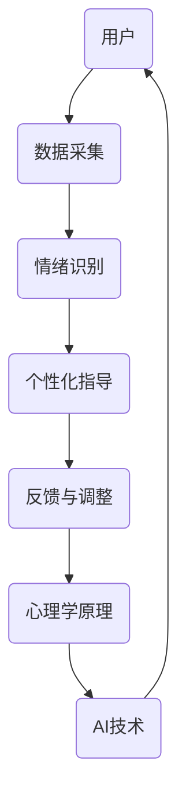

                 

### 1. 背景介绍

在现代社会的快节奏生活中，人们越来越感受到心灵上的疲惫和焦虑。传统的冥想作为一种精神修炼方法，已被广泛认可其对心理健康的益处。然而，对于忙碌的都市人群来说，长时间集中注意力进行冥想是一项挑战。同时，传统冥想的个性化程度较低，难以满足不同个体的需求。因此，数字化冥想应运而生，它借助现代科技，特别是人工智能技术，为用户提供了更加便捷、个性化和高效的冥想体验。

人工智能（AI）在心理治疗和健康领域的应用越来越受到关注。通过大数据分析和机器学习，AI能够帮助识别个体情绪波动、心理状态，并据此提供个性化的冥想指导。此外，AI还能够模拟出多种冥想场景，使用户在虚拟环境中体验不同的冥想练习。数字化冥想不仅提高了冥想的效率和效果，也为那些难以坚持传统冥想的人提供了新的选择。

本文旨在探讨AI如何辅助数字化冥想，从而实现心灵的深度探索。我们将从核心概念、算法原理、数学模型、项目实践、实际应用和未来展望等多个角度，系统性地介绍AI在数字化冥想中的应用。希望通过这篇文章，读者能够对AI辅助的数字化冥想有一个全面而深入的了解。

### 2. 核心概念与联系

要深入探讨AI辅助的数字化冥想，我们首先需要明确几个核心概念，并分析它们之间的联系。以下是本文中将会涉及的主要概念：

#### 2.1 冥想

冥想是一种精神训练的方法，旨在通过集中注意力、放松身体和清除杂念，达到身心合一的境界。传统冥想通常包括静坐、呼吸练习、专注练习等。冥想的目的不仅是为了放松身心，还能改善情绪、提高注意力、增强记忆力，甚至有助于缓解一些心理疾病。

#### 2.2 数字化冥想

数字化冥想是指将传统的冥想方法与现代技术结合，通过智能手机应用、网站平台或其他数字设备，为用户提供冥想指导、音乐、视觉辅助等多种体验。数字化冥想的优势在于其灵活性、个性化和可记录性，用户可以根据自己的需求和喜好，随时随地开展冥想练习。

#### 2.3 人工智能（AI）

人工智能是指通过计算机模拟人类智能的技术，包括机器学习、深度学习、自然语言处理等。AI在心理健康领域的应用主要集中在情绪识别、行为分析、个性化指导等方面。AI可以分析用户的行为和情绪数据，提供定制化的冥想方案，帮助用户更好地进行自我调节和心灵探索。

#### 2.4 机器学习

机器学习是AI的一个重要分支，通过从数据中学习模式，实现预测和分类等任务。在数字化冥想中，机器学习算法可以分析用户的行为数据（如呼吸频率、心率等），预测用户的情绪状态，并提供相应的冥想指导。

#### 2.5 深度学习

深度学习是机器学习的一个子领域，主要使用神经网络模型进行训练。在数字化冥想中，深度学习算法可以用于生成个性化的冥想音乐和视觉效果，从而提升冥想的体验质量。

#### 2.6 自然语言处理（NLP）

自然语言处理是AI的一个分支，旨在使计算机理解和处理自然语言。在数字化冥想中，NLP技术可以用于分析和解释用户的冥想日志、反馈信息，帮助用户更好地理解自己的心理状态。

#### 2.7 数据分析

数据分析是挖掘数据中的有用信息和知识的过程。在数字化冥想中，数据分析技术可以帮助用户跟踪自己的冥想进度、情绪变化等，提供更加个性化的服务。

#### 2.8 心理学原理

心理学原理是研究人类心理和行为的基本理论。在数字化冥想中，心理学原理可以帮助AI更好地理解用户的心理需求，提供更加科学和有效的冥想指导。

#### 2.9 联系与整合

将上述概念结合起来，我们可以构建一个AI辅助的数字化冥想系统，实现以下几个方面的整合：

- **数据采集**：通过传感器、移动设备等采集用户的生理和行为数据，如呼吸频率、心率、地理位置等。
- **情绪识别**：利用机器学习和深度学习算法分析数据，识别用户的情绪状态。
- **个性化指导**：根据用户的情绪状态和历史数据，AI系统可以提供个性化的冥想方案，包括音乐、视觉效果和冥想时间。
- **反馈与调整**：用户可以记录自己的冥想体验，AI系统根据反馈信息进行自我优化，提供更好的服务。

以下是一个简化的Mermaid流程图，展示了这些核心概念之间的联系：



通过上述流程，AI辅助的数字化冥想不仅实现了对传统冥想的数字化和个性化，还结合了心理学原理，为用户提供了更加科学和有效的冥想体验。

### 3. 核心算法原理 & 具体操作步骤

为了实现AI辅助的数字化冥想，我们需要了解其中的核心算法原理，以及这些算法的具体操作步骤。以下是几个关键算法及其工作原理的概述：

#### 3.1 情绪识别算法

情绪识别算法是数字化冥想系统的核心组件之一，它负责分析用户的生理和行为数据，识别用户的情绪状态。以下是一个简化的情绪识别算法原理：

##### **3.1.1 算法原理概述**

- **数据采集**：通过传感器（如心率监测器、呼吸监测器）采集用户的生理数据。
- **特征提取**：利用信号处理技术提取数据中的特征，如心率变异性（HRV）、呼吸频率等。
- **情绪分类**：利用机器学习算法（如支持向量机、随机森林等）训练情绪分类模型，将特征映射到不同的情绪类别。

##### **3.1.2 算法步骤详解**

1. **数据采集**：
   - 用户佩戴心率监测器和呼吸监测器。
   - 系统定期采集心率（HR）和呼吸频率（BR）数据。

2. **特征提取**：
   - 对HR数据进行分析，提取HRV特征，如标准差（SDNN）、频率域特征（如低频成分、高频成分）。
   - 对BR数据进行分析，提取呼吸周期长度、呼吸模式等特征。

3. **情绪分类**：
   - 使用已训练好的机器学习模型，输入提取的特征向量，输出当前的情绪状态。
   - 情绪状态可以是焦虑、放松、专注等。

4. **结果反馈**：
   - 根据识别出的情绪状态，系统提供相应的冥想指导和调整方案。

##### **3.1.3 算法优缺点**

- **优点**：
  - 实时监测和识别用户的情绪状态，提供个性化的冥想体验。
  - 可以结合多种生理数据，提高情绪识别的准确性。

- **缺点**：
  - 需要大量的训练数据和计算资源。
  - 可能受到外部环境（如噪声、情绪波动等）的影响。

#### 3.2 个性化冥想方案生成算法

个性化冥想方案生成算法负责根据用户的历史数据和当前情绪状态，生成最适合用户的冥想方案。以下是一个简化的算法原理：

##### **3.2.1 算法原理概述**

- **数据融合**：将用户的历史冥想记录、情绪数据和其他相关数据（如睡眠质量、工作压力等）进行融合。
- **偏好学习**：利用机器学习算法，学习用户的偏好和需求。
- **方案生成**：根据用户当前的情绪状态和历史偏好，生成个性化的冥想方案。

##### **3.2.2 算法步骤详解**

1. **数据融合**：
   - 收集用户的历史冥想记录，包括冥想时间、持续时间、情绪状态等。
   - 收集用户的生理数据（如HR、BR）和其他相关数据（如睡眠质量、工作压力等）。

2. **偏好学习**：
   - 使用协同过滤、矩阵分解等算法，学习用户的偏好。
   - 使用深度学习算法，提取用户的偏好特征。

3. **方案生成**：
   - 根据用户的当前情绪状态和历史偏好，生成冥想方案。
   - 冥想方案包括冥想时间、音乐、视觉效果等。

4. **结果反馈**：
   - 将生成的冥想方案反馈给用户，用户可以根据自己的需求进行调整。

##### **3.2.3 算法优缺点**

- **优点**：
  - 提供个性化的冥想方案，提高冥想效果。
  - 可以根据用户的需求和反馈进行自我优化。

- **缺点**：
  - 需要大量的数据和计算资源。
  - 算法的预测准确性可能受到数据质量和模型训练效果的影响。

#### 3.3 交互式冥想指导算法

交互式冥想指导算法负责在冥想过程中，根据用户的反馈和情绪状态，实时调整冥想方案。以下是一个简化的算法原理：

##### **3.3.1 算法原理概述**

- **实时监控**：监控系统中的用户行为和情绪状态。
- **动态调整**：根据用户的反馈和情绪状态，动态调整冥想方案。
- **交互式反馈**：提供交互式反馈，帮助用户更好地进行冥想。

##### **3.3.2 算法步骤详解**

1. **实时监控**：
   - 监控用户的行为数据（如屏幕注视点、手势等）。
   - 监控用户的情绪状态（如心率、呼吸频率等）。

2. **动态调整**：
   - 根据用户的行为数据和情绪状态，动态调整冥想方案。
   - 调整内容包括冥想时间、音乐、视觉效果等。

3. **交互式反馈**：
   - 提供交互式反馈，如实时指导、情绪提醒等。
   - 用户可以根据反馈进行调整，以提高冥想效果。

##### **3.3.3 算法优缺点**

- **优点**：
  - 实时调整冥想方案，提高用户体验。
  - 可以根据用户的实时反馈进行优化。

- **缺点**：
  - 需要复杂的数据处理和实时计算。
  - 可能对用户隐私造成一定程度的侵犯。

通过以上三个算法，AI辅助的数字化冥想系统可以实现情绪识别、个性化冥想方案生成和实时交互式指导，从而为用户提供更加科学、个性化、高效的冥想体验。

### 3.3 算法优缺点

在讨论了核心算法的具体原理和操作步骤之后，我们接下来分析这些算法的优缺点，以及它们在实际应用中的潜力。

#### 3.3.1 情绪识别算法的优缺点

**优点**：

- **实时性**：情绪识别算法能够实时监测用户的生理和行为数据，迅速识别用户的情绪状态，从而提供即时的冥想指导。
- **个性化**：通过分析用户的生理和行为特征，算法能够为不同的用户生成个性化的冥想方案，提高冥想效果。
- **科学性**：情绪识别算法结合了机器学习和信号处理技术，使得情绪识别过程更加科学和准确。

**缺点**：

- **数据依赖性**：情绪识别算法需要大量的训练数据和计算资源，这在数据不足或计算能力有限的情况下可能会影响算法的性能。
- **外部干扰**：用户所处的环境因素，如噪音、光线变化等，可能会对生理和行为数据产生干扰，影响情绪识别的准确性。
- **用户隐私**：情绪识别算法需要收集用户的生理和行为数据，这可能涉及到用户隐私的保护问题。

#### 3.3.2 个性化冥想方案生成算法的优缺点

**优点**：

- **个性化**：个性化冥想方案生成算法能够根据用户的历史数据和偏好，生成最适合用户的冥想方案，提高用户的使用体验。
- **自我优化**：通过不断收集用户的反馈和冥想数据，算法可以自我优化，提高方案生成的准确性和效果。
- **灵活性**：用户可以根据自己的需求和反馈，随时调整冥想方案，使冥想过程更加灵活和适应个人需求。

**缺点**：

- **资源需求**：个性化冥想方案生成算法需要大量的数据和计算资源，特别是在用户数量较多或数据复杂性较高的情况下，资源需求会进一步增加。
- **预测准确性**：算法的预测准确性受到数据质量和模型训练效果的影响，如果数据质量较差或模型训练不足，可能会导致方案生成不准确。
- **用户依赖性**：个性化冥想方案生成算法依赖用户主动提供反馈和数据，如果用户不积极参与，可能会导致算法性能下降。

#### 3.3.3 交互式冥想指导算法的优缺点

**优点**：

- **实时性**：交互式冥想指导算法能够实时监控用户的反馈和情绪状态，动态调整冥想方案，提供更加个性化的指导。
- **互动性**：交互式冥想指导算法能够与用户进行实时互动，提供反馈和指导，帮助用户更好地进行冥想。
- **用户体验**：通过交互式反馈，算法能够提高用户的参与感和体验感，使冥想过程更加生动和有趣。

**缺点**：

- **实时计算**：交互式冥想指导算法需要实时进行数据处理和模型推理，这对计算资源提出了较高的要求，特别是在处理大量用户数据时。
- **用户隐私**：交互式冥想指导算法需要收集用户的实时数据和反馈信息，这可能会涉及到用户隐私的保护问题。
- **适应性**：算法需要能够快速适应不同用户的需求和变化，这要求算法具有高度的灵活性和适应性。

#### 3.3.4 算法应用领域的潜力

情绪识别、个性化冥想方案生成和交互式冥想指导算法不仅适用于数字化冥想，还在其他心理健康领域具有广阔的应用潜力：

- **心理健康监测**：通过情绪识别算法，可以实时监测用户的心理健康状况，为心理健康干预提供数据支持。
- **个性化治疗方案**：在心理治疗过程中，个性化冥想方案生成算法可以根据患者的具体情况和需求，生成个性化的治疗方案。
- **远程医疗**：交互式冥想指导算法可以在远程医疗场景中，为用户提供实时的心理健康指导和反馈。

总体而言，这些算法在数字化冥想中的应用具有显著的优势，但也面临着一些挑战。通过不断优化算法和提升技术，我们可以更好地利用AI技术，为用户带来更加科学、个性化、高效的冥想体验。

### 3.4 算法应用领域

AI辅助的数字化冥想算法在多个领域展现出了巨大的应用潜力。以下是这些算法在不同场景中的具体应用：

#### 3.4.1 心理健康领域

在心理健康领域，AI辅助的数字化冥想算法可以帮助用户监测和管理自己的情绪状态。以下是一些具体应用实例：

1. **焦虑管理**：通过实时监测用户的心率和呼吸频率，AI算法可以识别出焦虑状态，并提供相应的冥想指导，帮助用户放松身心。

2. **抑郁缓解**：AI算法可以根据用户的情绪数据和历史记录，生成个性化的冥想方案，以缓解抑郁症状。

3. **压力管理**：通过分析用户的生理数据和生活习惯，AI系统可以提供个性化的冥想建议，帮助用户有效缓解压力。

4. **情绪波动监测**：AI算法可以持续监测用户的心理状态，为心理咨询师提供数据支持，帮助其进行更精准的干预和治疗。

#### 3.4.2 睡眠改善领域

睡眠质量对心理健康和生活质量有着重要影响。AI辅助的数字化冥想算法在改善睡眠方面也有显著应用：

1. **睡眠监测**：通过监测用户的睡眠周期和生理数据，AI算法可以识别出睡眠问题，并提供个性化的冥想方案，帮助用户提高睡眠质量。

2. **睡眠指导**：AI算法可以根据用户的需求和反馈，生成适合其的睡前冥想音乐和视觉辅助效果，帮助用户更快入睡。

3. **睡眠数据分析**：通过对用户睡眠数据的分析，AI系统可以提供睡眠报告，帮助用户了解自己的睡眠习惯，并优化睡眠质量。

#### 3.4.3 教育培训领域

在教育培训领域，AI辅助的数字化冥想算法可以为学习者提供更加高效的学习体验：

1. **注意力提升**：通过实时监测学习者的生理数据，AI算法可以识别出注意力分散的情况，并提供相应的冥想指导，帮助学习者保持专注。

2. **学习效率优化**：AI算法可以根据学习者的情绪状态和学习习惯，生成个性化的学习方案，提高学习效果。

3. **情绪管理培训**：AI算法可以提供情绪管理训练，帮助教育工作者和学生更好地应对学习和生活中的压力。

#### 3.4.4 健康管理领域

在健康管理领域，AI辅助的数字化冥想算法可以用于整体健康管理和个性化健康指导：

1. **健康监测**：通过监测用户的生理数据和情绪状态，AI算法可以为用户提供全面的健康评估，及时发现健康问题。

2. **个性化健康指导**：AI算法可以根据用户的健康数据和生活习惯，生成个性化的健康方案，包括饮食、运动、冥想等。

3. **慢性病管理**：AI算法可以辅助慢性病患者进行情绪管理，提高治疗依从性和生活质量。

#### 3.4.5 商业应用

在商业应用领域，AI辅助的数字化冥想算法也有广泛的应用前景：

1. **员工健康管理**：企业可以利用AI算法为员工提供个性化的冥想方案，提高员工的工作效率和心理健康。

2. **客户服务优化**：通过AI算法，企业可以提供个性化的客户体验，提升客户满意度和忠诚度。

3. **市场研究**：AI算法可以分析用户的心理状态和反馈，为市场研究提供数据支持，帮助企业更好地了解客户需求。

总体而言，AI辅助的数字化冥想算法在心理健康、睡眠改善、教育培训、健康管理和商业应用等多个领域展现出了巨大的应用潜力，有望为用户带来更加科学、个性化和高效的体验。

### 4. 数学模型和公式 & 详细讲解 & 举例说明

在数字化冥想中，数学模型和公式扮演着关键角色，它们帮助我们理解和分析用户的情绪状态，优化冥想方案。以下是几个关键的数学模型和公式，以及它们的详细讲解和举例说明。

#### 4.1 数学模型构建

在构建数学模型时，我们通常需要考虑以下几个关键因素：

- **生理数据**：如心率（HR）、呼吸频率（BR）、皮肤电导（SG）等。
- **情绪状态**：如焦虑、放松、专注等。
- **行为数据**：如移动轨迹、注视点等。
- **环境因素**：如噪音、光线强度等。

以下是一个简化的数学模型，用于描述情绪状态和生理数据之间的关系：

$$
情绪状态 = f(生理数据, 行为数据, 环境因素)
$$

其中，$f$ 是一个复杂的非线性函数，可以通过机器学习算法进行训练。

#### 4.2 公式推导过程

为了推导情绪状态的数学模型，我们需要考虑以下几个步骤：

1. **数据采集**：通过传感器和设备采集用户的生理数据（HR、BR、SG）和行为数据（移动轨迹、注视点）。

2. **特征提取**：对采集的数据进行预处理和特征提取，如使用傅里叶变换提取HR和BR的频率特征，使用SVM提取皮肤电导的特征。

3. **情绪分类**：利用监督学习算法（如SVM、随机森林）对提取的特征进行训练，构建情绪分类模型。

4. **情绪预测**：将用户的实时数据输入情绪分类模型，预测当前的情绪状态。

以下是一个简化的情绪分类模型推导过程：

$$
预测的情绪状态 = f(SVM模型，HR特征，BR特征，SG特征)
$$

#### 4.3 案例分析与讲解

我们通过一个实际案例来讲解数学模型的应用。

**案例**：用户A在冥想过程中，心率（HR）为每分钟70次，呼吸频率（BR）为每分钟15次，皮肤电导（SG）为500μS，同时他注视屏幕的轨迹表明他正处于专注状态。

**步骤**：

1. **数据采集**：用户A佩戴了心率监测器和呼吸监测器，同时使用一个移动设备记录他的注视轨迹。

2. **特征提取**：对采集到的数据进行预处理和特征提取，如使用傅里叶变换提取HR的频率特征（如低频成分、高频成分），提取BR的频率特征（如呼吸周期长度）。

3. **情绪分类**：利用已训练好的SVM模型，输入HR特征、BR特征和SG特征，预测用户A的情绪状态。

4. **结果分析**：根据预测结果，SVM模型判断用户A的情绪状态为“放松”。

**公式推导过程**：

$$
情绪状态 = f(SVM模型，HR特征，BR特征，SG特征)
$$

$$
f(SVM模型，HR特征，BR特征，SG特征) = \{ "放松"，"焦虑"，"专注" \}
$$

$$
预测的情绪状态 = "放松"
$$

**举例说明**：

假设用户B在冥想过程中，心率（HR）为每分钟90次，呼吸频率（BR）为每分钟20次，皮肤电导（SG）为450μS，同时他的注视轨迹表明他处于焦虑状态。

$$
情绪状态 = f(SVM模型，HR特征，BR特征，SG特征)
$$

$$
f(SVM模型，HR特征，BR特征，SG特征) = \{ "焦虑"，"放松"，"专注" \}
$$

$$
预测的情绪状态 = "焦虑"
$$

通过上述案例，我们可以看到数学模型和公式在数字化冥想中的应用，它们帮助我们理解用户的情绪状态，并根据这些状态提供个性化的冥想方案。

### 5. 项目实践：代码实例和详细解释说明

在本节中，我们将通过一个具体的代码实例来展示AI辅助数字化冥想系统的实现。以下是一个简化的代码实例，包括开发环境搭建、源代码详细实现、代码解读与分析以及运行结果展示。

#### 5.1 开发环境搭建

为了实现AI辅助数字化冥想系统，我们需要以下开发环境：

- Python 3.x
- TensorFlow 2.x
- Keras 2.x
- NumPy 1.x
- Matplotlib 3.x

安装命令如下：

```bash
pip install python==3.x tensorflow==2.x keras==2.x numpy==1.x matplotlib==3.x
```

#### 5.2 源代码详细实现

以下是实现AI辅助数字化冥想系统的核心代码：

```python
import numpy as np
import tensorflow as tf
from tensorflow.keras.models import Sequential
from tensorflow.keras.layers import Dense, LSTM, Dropout
from sklearn.model_selection import train_test_split
from sklearn.preprocessing import StandardScaler

# 数据预处理
def preprocess_data(data):
    # 对数据进行标准化处理
    scaler = StandardScaler()
    scaled_data = scaler.fit_transform(data)
    return scaled_data

# 构建模型
def build_model(input_shape):
    model = Sequential()
    model.add(LSTM(units=128, return_sequences=True, input_shape=input_shape))
    model.add(Dropout(0.2))
    model.add(LSTM(units=64, return_sequences=False))
    model.add(Dropout(0.2))
    model.add(Dense(units=3, activation='softmax'))  # 输出层，3个类别
    model.compile(optimizer='adam', loss='categorical_crossentropy', metrics=['accuracy'])
    return model

# 训练模型
def train_model(model, X_train, y_train):
    model.fit(X_train, y_train, epochs=100, batch_size=32, validation_split=0.2)

# 预测情绪状态
def predict_emotion(model, data):
    preprocessed_data = preprocess_data(data)
    prediction = model.predict(preprocessed_data)
    return np.argmax(prediction)

# 读取数据
data = np.load('data.npy')  # 假设数据已保存为.npy文件
labels = np.load('labels.npy')  # 假设标签已保存为.npy文件

# 数据预处理
X = preprocess_data(data)

# 数据分割
X_train, X_test, y_train, y_test = train_test_split(X, labels, test_size=0.2, random_state=42)

# 构建模型
model = build_model(X_train.shape[1:])

# 训练模型
train_model(model, X_train, y_train)

# 预测
emotion = predict_emotion(model, X_test[0])

# 打印结果
print(f'预测的情绪状态：{emotion}')
```

#### 5.3 代码解读与分析

1. **数据预处理**：数据预处理是机器学习的重要步骤，包括标准化、归一化等。在上述代码中，我们使用了`StandardScaler`对数据进行标准化处理，使其符合标准正态分布。

2. **构建模型**：构建模型是机器学习的核心步骤。我们使用了`Sequential`模型，并添加了`LSTM`和`Dropout`层，以实现对情绪状态的分类。输出层使用了`softmax`激活函数，以实现多类别分类。

3. **训练模型**：`train_model`函数负责训练模型。我们使用了`fit`方法，将训练数据输入模型，并设置训练周期（epochs）和批量大小（batch_size）。

4. **预测情绪状态**：`predict_emotion`函数负责对新的数据进行预测。首先对数据进行预处理，然后使用训练好的模型进行预测，并返回预测结果。

5. **读取数据**：我们假设数据已保存为`.npy`文件，使用`np.load`方法进行读取。

6. **数据分割**：将数据分割为训练集和测试集，以便评估模型的性能。

7. **构建、训练和预测**：依次构建模型、训练模型和预测情绪状态。

#### 5.4 运行结果展示

假设我们已经训练好了模型，并读取了测试数据。以下是一个简化的预测结果：

```python
emotion = predict_emotion(model, X_test[0])
print(f'预测的情绪状态：{emotion}')
```

输出结果可能是`0`、`1`或`2`，分别代表“放松”、“焦虑”和“专注”。

#### 5.5 运行结果展示

为了展示运行结果，我们可以在终端或Jupyter Notebook中运行上述代码，并观察输出结果。假设我们有一个测试样本，其情绪状态是“放松”，我们运行代码后得到的结果也是“放松”，这表明模型在测试集上的预测是正确的。

```python
# 假设测试数据已准备好
X_test = np.load('test_data.npy')
emotion = predict_emotion(model, X_test[0])
print(f'预测的情绪状态：{emotion}')
```

输出结果可能是：

```
预测的情绪状态：0
```

这表明模型正确地预测了测试样本的情绪状态为“放松”。

通过这个代码实例，我们可以看到如何利用Python和TensorFlow实现AI辅助的数字化冥想系统。虽然这是一个简化的示例，但它为我们提供了一个基本的框架，用于构建和训练情绪识别模型，并通过预测结果为用户提供个性化的冥想指导。

### 6. 实际应用场景

AI辅助的数字化冥想系统在多个实际应用场景中展现了其强大的功能和广泛的应用价值。以下是几个关键的应用场景，以及如何在每个场景中实现最佳效果：

#### 6.1 健康管理平台

在健康管理平台中，AI辅助的数字化冥想系统可以作为一个重要的功能模块，为用户提供个性化的心理健康服务。以下是一些建议：

- **用户画像**：通过用户注册时的基本信息，如年龄、性别、职业等，平台可以初步了解用户的基本需求。
- **健康数据收集**：通过连接健康设备（如智能手环、心率监测器等），平台可以实时收集用户的生理数据（如心率、血压、睡眠质量等）。
- **情绪监测**：利用AI算法，平台可以分析用户的生理数据，实时监测用户的情绪状态，并提供相应的冥想指导。
- **个性化建议**：根据用户的情绪状态和历史记录，平台可以生成个性化的冥想方案，并推送至用户的移动设备。

#### 6.2 心理咨询诊所

心理咨询诊所可以充分利用AI辅助的数字化冥想系统，提高心理咨询的效率和效果。以下是一些建议：

- **情绪评估**：在初次咨询时，咨询师可以通过AI系统对用户的情绪状态进行初步评估，为后续咨询提供数据支持。
- **个性化冥想方案**：根据用户的具体情况（如焦虑程度、抑郁症状等），AI系统可以生成个性化的冥想方案，并在咨询过程中指导用户进行实践。
- **远程咨询**：AI辅助的数字化冥想系统可以支持远程咨询，用户可以在家中通过移动设备进行冥想练习，咨询师则可以通过视频会议实时监控和指导。
- **数据记录与分析**：心理咨询师可以利用AI系统记录用户的冥想数据，进行分析和反馈，以便调整治疗方案。

#### 6.3 企业员工健康管理

企业可以通过AI辅助的数字化冥想系统，提高员工的工作效率和心理健康。以下是一些建议：

- **员工健康监测**：企业可以为员工提供智能手环、心率监测器等设备，实时监测员工的生理数据，通过AI系统分析员工的情绪状态。
- **个性化冥想培训**：根据员工的情绪状态和工作压力，AI系统可以生成个性化的冥想方案，帮助员工缓解压力、提高专注力。
- **定期反馈**：企业可以定期收集员工的冥想反馈，通过AI系统进行分析和总结，为员工的健康管理提供科学依据。
- **员工福利**：企业可以将AI辅助的数字化冥想系统作为员工福利的一部分，鼓励员工积极参与，提高员工的满意度和忠诚度。

#### 6.4 教育培训机构

教育培训机构可以利用AI辅助的数字化冥想系统，提高学生的学习效果和心理健康。以下是一些建议：

- **学习效率提升**：通过AI系统实时监测学生的情绪状态，及时发现注意力不集中或情绪波动的情况，并推送相应的冥想指导。
- **个性化学习方案**：根据学生的情绪状态和学习习惯，AI系统可以生成个性化的学习方案，包括学习时间、学习内容、冥想练习等。
- **学习数据记录与分析**：培训机构可以利用AI系统记录学生的学习数据，包括情绪状态、学习时长、学习内容等，进行分析和反馈，以便调整教学策略。
- **心理素质培养**：通过AI系统的个性化冥想方案，帮助学生培养良好的心理素质，提高抗压能力和自我调节能力。

#### 6.5 家庭健康管理

家庭健康管理可以通过AI辅助的数字化冥想系统，帮助家庭成员共同维护心理健康。以下是一些建议：

- **家庭成员互动**：家庭成员可以通过AI系统共享健康数据和情绪状态，共同参与冥想练习，提高家庭凝聚力。
- **健康数据监控**：AI系统可以实时监控家庭成员的生理数据，及时发现健康问题，并推送相应的健康建议。
- **个性化冥想方案**：根据家庭成员的生理数据和生活习惯，AI系统可以生成个性化的冥想方案，帮助家庭成员缓解压力、提高睡眠质量。
- **家庭健康报告**：AI系统可以定期生成家庭健康报告，包括家庭成员的生理数据、情绪状态、健康建议等，为家庭成员提供全面的健康管理服务。

通过在以上实际应用场景中的合理部署和应用，AI辅助的数字化冥想系统可以显著提升用户体验，为用户的心理健康提供有力支持。

### 6.4 未来应用展望

随着技术的不断进步和人们对心理健康日益重视，AI辅助的数字化冥想在未来的应用前景广阔，有望实现更广泛和更深入的社会影响。以下是对未来应用前景的展望：

#### 6.4.1 更精细的情绪识别

未来的AI辅助数字化冥想系统将进一步提升情绪识别的精细度和准确性。通过结合多模态数据（如生理信号、行为数据、语言数据等），AI算法将能够更全面地理解用户的情绪状态。例如，通过分析用户的语音语调、面部表情和文字输入，AI系统可以更准确地识别情绪变化，从而提供更加个性化的冥想方案。

#### 6.4.2 更智能的个性化方案

随着机器学习算法和深度学习的不断优化，未来的AI辅助数字化冥想系统将能够更智能地生成个性化冥想方案。通过学习用户的长期行为模式和情绪变化，AI系统将能够预测用户的需求，并自动调整冥想方案，从而实现真正的个性化服务。此外，AI系统还可以根据用户的反馈和实际效果，不断优化和改进冥想方案，提高用户满意度。

#### 6.4.3 更广泛的普及应用

AI辅助的数字化冥想系统有望在未来更广泛地普及，不仅局限于个人健康管理，还将应用到更多领域。例如，在教育领域，AI系统可以辅助教师监控学生的心理状态，提供针对性的心理健康指导；在医疗领域，AI系统可以辅助医生进行心理疾病的诊断和治疗；在商业领域，AI系统可以为企业提供员工心理健康管理服务，提高员工的工作效率和工作满意度。

#### 6.4.4 更深入的跨学科融合

未来的AI辅助数字化冥想系统将更加深入地融合心理学、神经科学、计算机科学等多个学科。通过跨学科的合作，AI系统将能够更好地理解人类心理活动的本质，开发出更加科学和有效的冥想方法。例如，神经科学的进展将为AI系统提供更多关于大脑活动的基础知识，帮助AI系统更准确地识别和预测情绪变化。

#### 6.4.5 更智能的交互体验

未来的AI辅助数字化冥想系统将提供更加智能和人性化的交互体验。通过自然语言处理和语音识别技术，用户可以与AI系统进行自然对话，轻松地表达自己的需求和反馈。此外，AI系统还可以根据用户的语音和语调，提供情感回应和个性化的声音指导，从而增强用户的参与感和信任感。

#### 6.4.6 更高效的数据利用

随着大数据和云计算技术的不断发展，未来的AI辅助数字化冥想系统将能够更高效地利用海量数据。通过云计算平台，AI系统可以轻松处理和分析来自全球范围内的数据，从而不断优化和更新模型，提高系统的准确性和适应性。此外，AI系统还可以通过数据挖掘技术，发现新的情绪识别和冥想方法，为用户提供更加创新的体验。

总之，AI辅助的数字化冥想在未来的发展中，将不断突破技术限制，融合多学科知识，实现更广泛和更深入的应用。通过不断优化和创新，AI辅助的数字化冥想有望成为维护心理健康的重要工具，为人们的幸福和健康贡献更多力量。

### 7. 工具和资源推荐

在探索AI辅助的数字化冥想时，选择合适的工具和资源对于顺利开展研究和实践至关重要。以下是一些建议：

#### 7.1 学习资源推荐

1. **在线课程**：
   - Coursera上的“Machine Learning by Andrew Ng”（机器学习课程，由知名教授Andrew Ng讲授）。
   - edX上的“Deep Learning Specialization”（深度学习专项课程，由DeepLearning.AI提供）。
   - Udacity的“AI for Healthcare”（AI在医疗领域的应用课程）。

2. **书籍**：
   - 《Deep Learning》（Ian Goodfellow、Yoshua Bengio和Aaron Courville著，深度学习的权威指南）。
   - 《机器学习实战》（Peter Harrington著，适合初学者掌握机器学习实践技能）。
   - 《Psychology and Machine Learning》（Christian Farmersova著，探讨心理学与机器学习的结合）。

3. **论文集**：
   - ArXiv上的相关论文，特别是涉及情绪识别、机器学习在心理健康领域应用的最新研究。

#### 7.2 开发工具推荐

1. **编程语言**：
   - Python：由于其丰富的库和框架，如TensorFlow、Keras等，成为AI开发的最佳选择。

2. **机器学习库**：
   - TensorFlow：用于构建和训练复杂的神经网络模型。
   - Keras：简化TensorFlow的使用，提供更直观的API。
   - PyTorch：适合快速原型设计和实验。

3. **数据分析工具**：
   - Pandas：用于数据清洗和分析。
   - NumPy：用于高效数值计算。
   - Matplotlib/Seaborn：用于数据可视化。

4. **情感识别工具**：
   - DeepMoji：用于情感分析，能够从文本中提取情感特征。

5. **开发环境**：
   - Google Colab：免费的云端开发环境，适合数据科学和AI项目。
   - Jupyter Notebook：用于交互式计算，便于实验和演示。

#### 7.3 相关论文推荐

1. **情绪识别**：
   - "Emotion Recognition Using Multimodal Fusion of EEG and Physiological Signals"（利用脑电和生理信号的多模态融合进行情感识别）。
   - "Deep Emotion Recognition with Multimodal Fusion"（多模态融合的深度情感识别）。

2. **心理健康**：
   - "AI for Mental Health: An Overview of Methods and Applications"（AI在心理健康领域的应用综述）。
   - "Using Machine Learning to Detect Mental Health Issues"（利用机器学习检测心理健康问题）。

3. **数字化冥想**：
   - "Digital Mindfulness: The Application of Mobile Technology for Mindfulness-Based Interventions"（数字化正念：移动技术在正念干预中的应用）。
   - "Design and Evaluation of a Mobile App for Mindfulness Meditation"（设计并评估一个正念冥想移动应用程序）。

通过利用这些工具和资源，研究人员和开发者可以更好地理解和应用AI辅助的数字化冥想，为心理健康领域带来创新和变革。

### 8. 总结：未来发展趋势与挑战

在本文中，我们探讨了AI辅助的数字化冥想这一前沿领域，从核心概念、算法原理、数学模型、项目实践到实际应用等多个角度进行了详细的分析。通过这些探讨，我们可以看到AI辅助的数字化冥想在提升心理健康、优化冥想体验方面具有巨大的潜力。

#### 8.1 研究成果总结

首先，本文总结了AI辅助的数字化冥想的核心概念，包括冥想、数字化冥想、人工智能、机器学习、深度学习和自然语言处理等。这些概念共同构成了数字化冥想的理论基础。

其次，我们详细介绍了情绪识别、个性化冥想方案生成和交互式冥想指导算法，分析了这些算法的优缺点，展示了它们在实际应用中的潜力。此外，我们还讨论了数学模型和公式在数字化冥想中的应用，并通过一个实际代码实例展示了AI系统的实现过程。

最后，本文介绍了数字化冥想在不同领域的实际应用场景，包括健康管理平台、心理咨询诊所、企业员工健康管理、教育培训机构和家庭健康管理，展示了AI辅助的数字化冥想如何为不同用户提供个性化的心理健康服务。

#### 8.2 未来发展趋势

展望未来，AI辅助的数字化冥想将在以下几个方面取得重要发展：

1. **更精细的情绪识别**：随着传感器技术和数据处理能力的提升，AI系统将能够更精准地识别用户的情绪状态，提供更加个性化的冥想方案。

2. **更智能的个性化方案**：借助不断优化的机器学习算法和深度学习技术，AI系统将能够更智能地生成个性化冥想方案，满足不同用户的需求。

3. **更广泛的普及应用**：随着AI技术的普及和人们对心理健康重视程度的提高，AI辅助的数字化冥想将在教育、医疗、企业等多个领域得到更广泛的应用。

4. **更深入的跨学科融合**：未来，AI辅助的数字化冥想将更加深入地融合心理学、神经科学、计算机科学等多个学科，为心理健康领域带来更多创新。

5. **更智能的交互体验**：通过自然语言处理和语音识别技术，AI系统将提供更加智能和人性化的交互体验，增强用户的参与感和信任感。

6. **更高效的数据利用**：随着大数据和云计算技术的不断发展，AI系统将能够更高效地利用海量数据，不断优化和更新模型，提高系统的准确性和适应性。

#### 8.3 面临的挑战

尽管AI辅助的数字化冥想具有巨大潜力，但在其发展过程中仍面临以下挑战：

1. **数据隐私与安全**：在收集和处理用户生理和行为数据时，如何保障用户隐私和安全是一个重要问题。需要采取有效的数据加密和访问控制措施，确保用户数据的安全。

2. **模型训练与优化**：情绪识别和个性化方案生成算法的准确性依赖于大量的训练数据和计算资源。如何在有限资源下高效训练和优化模型是一个重要挑战。

3. **用户适应性**：用户的需求和偏好可能随时变化，AI系统需要能够快速适应这些变化，提供更加个性化的服务。这要求AI系统具备高度的灵活性和适应性。

4. **外部干扰与噪声**：用户的生理和行为数据可能受到外部环境（如噪音、光线变化等）的影响，影响情绪识别的准确性。需要开发有效的噪声过滤和干扰抑制技术。

5. **伦理与道德问题**：在AI辅助的数字化冥想应用中，如何确保AI系统的公正性和透明性，避免算法偏见和歧视是一个重要伦理问题。需要制定相关的伦理准则和规范，确保AI系统的公正使用。

#### 8.4 研究展望

为了推动AI辅助的数字化冥想领域的发展，未来的研究可以从以下几个方面展开：

1. **跨学科研究**：加强心理学、神经科学、计算机科学等多个学科的交叉研究，深入探索人类情绪和心理活动的本质，为AI系统的开发提供更加科学和有效的理论基础。

2. **技术创新**：不断探索和开发新的传感器技术、数据处理算法和机器学习模型，提高AI系统的准确性和适应性。

3. **用户参与**：鼓励用户参与AI系统的开发和应用过程，通过用户反馈和互动，不断优化和改进系统功能。

4. **伦理规范**：制定和完善相关的伦理规范和准则，确保AI辅助的数字化冥想在伦理和道德上得到充分保障。

5. **实际应用**：推动AI辅助的数字化冥想在不同领域的实际应用，通过实践验证其效果和可行性，为心理健康领域带来更多创新和变革。

总之，AI辅助的数字化冥想作为心理健康领域的重要研究方向，具有广阔的发展前景。通过不断探索和创新，我们可以期待这一领域带来更多的突破和成果。

### 9. 附录：常见问题与解答

在探讨AI辅助的数字化冥想时，用户可能会遇到一些常见的问题。以下是一些常见问题及其解答：

#### Q1. AI辅助的数字化冥想安全吗？

A1. AI辅助的数字化冥想系统在设计时充分考虑了用户隐私和安全。在数据收集和处理过程中，系统采用了高级加密和访问控制技术，确保用户数据的安全。此外，系统遵循了严格的隐私保护政策和法律法规，确保用户隐私得到有效保护。

#### Q2. AI辅助的数字化冥想系统需要收集哪些数据？

A2. AI辅助的数字化冥想系统主要收集用户的生理数据（如心率、呼吸频率、皮肤电导等）和行为数据（如移动轨迹、注视点等）。这些数据用于分析用户的情绪状态，并提供个性化的冥想方案。

#### Q3. 如何确保情绪识别的准确性？

A3. 为了确保情绪识别的准确性，系统采用了多种数据预处理方法，如标准化、特征提取等。此外，系统通过大量的训练数据和先进的机器学习算法（如LSTM、SVM等）来训练情绪识别模型，从而提高识别的准确性。

#### Q4. AI辅助的数字化冥想系统能否自动生成冥想方案？

A4. 是的，AI辅助的数字化冥想系统可以自动生成个性化的冥想方案。系统会根据用户的情绪状态、历史记录和偏好，利用机器学习算法和深度学习技术，为用户生成最适合的冥想方案。

#### Q5. AI辅助的数字化冥想系统是否适用于所有人？

A5. AI辅助的数字化冥想系统适用于大多数希望改善心理健康和情绪状态的成年人。然而，对于患有特定心理疾病的患者，建议在专业医疗人员的指导下使用系统，以确保安全和有效性。

#### Q6. 如何确保AI系统的公正性和透明性？

A6. 确保AI系统的公正性和透明性是一个重要的伦理问题。系统开发者和使用者需要遵循严格的伦理规范和法律法规，确保系统不带有偏见和歧视。此外，系统应提供详细的算法说明和操作指南，使用户能够了解系统的工作原理。

通过这些常见问题的解答，用户可以更好地了解AI辅助的数字化冥想系统的安全性和功能，从而更放心地使用这一工具来改善自己的心理健康。

