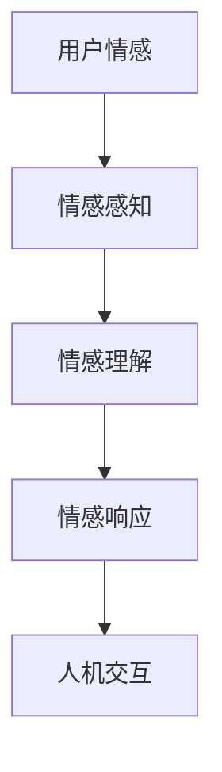

                 

关键词：数字化同理心，人工智能，人际理解，AI增强，情感计算，人机交互

> 摘要：本文探讨了数字化同理心这一概念，以及人工智能如何通过增强人际理解来推动人机交互的发展。我们将深入分析数字化同理心的核心要素，探讨人工智能在这一领域的技术进步，并通过数学模型和具体案例展示其应用场景。最后，我们将对数字化同理心在未来的发展趋势和挑战进行展望。

## 1. 背景介绍

在当今快速发展的数字化时代，人工智能（AI）技术已经成为社会进步的重要驱动力。从自动化生产到智能医疗，从智能助手到自动驾驶，AI在各个领域展现了其强大的潜力。然而，随着AI技术的广泛应用，一个不可忽视的问题逐渐显现：如何确保AI系统能够真正理解人类，并能以同理心与人类进行有效的交互？

传统的AI系统主要依赖于算法和大数据，它们在处理大量信息、执行复杂任务方面表现出色。但人类不仅是理性的计算器，更是一个情感的实体。因此，仅仅依靠算法和数据，AI难以实现真正的人际理解。数字化同理心（Digital Empathy）的概念应运而生，它强调AI系统不仅要具备处理信息的能力，更要具备理解人类情感、态度和需求的能力。

数字化同理心不仅仅是一种技术目标，更是一种人机交互的新理念。它要求AI系统能够感知人类的情感状态，理解人类的行为动机，并能根据这些信息做出相应的反应。这种能力对于提升人机交互的质量、增强用户的体验至关重要。

## 2. 核心概念与联系

### 2.1 数字化同理心的定义

数字化同理心是指通过人工智能技术，使计算机系统能够理解、感知并响应人类的情感状态和行为动机。它涵盖了以下几个核心要素：

1. **情感感知**：通过传感器、语音识别、图像识别等技术，AI系统能够捕捉到用户的面部表情、声音语调、身体动作等情感信息。
2. **情感理解**：AI系统需要具备理解这些情感信息的能力，能够将其转化为具体的情感状态，如喜悦、愤怒、焦虑等。
3. **情感响应**：基于对情感的理解，AI系统能够生成相应的反应，如提供安慰、调整交互方式、给出建议等。

### 2.2 AI与人机交互的关系

AI与人机交互（Human-Computer Interaction, HCI）的关系密不可分。传统的HCI主要关注如何设计用户界面，使计算机更加易于使用。而随着数字化同理心的提出，HCI进入了新的阶段，即如何使计算机更加“人性化”。

数字化同理心为人机交互带来了以下几个变革：

1. **个性化的交互**：基于对用户的情感理解，AI系统能够提供更加个性化的交互体验，满足用户的个性化需求。
2. **自然的交互**：通过情感感知和情感理解，AI系统能够更自然地与用户进行交互，减少用户的学习成本。
3. **智能的交互**：AI系统不仅能够响应用户的行为，还能主动预测用户的需求，提供前瞻性的建议。

### 2.3 Mermaid流程图

为了更好地理解数字化同理心的核心概念，我们使用Mermaid流程图展示其基本架构：



在此流程图中，用户情感通过情感感知被捕获，情感理解使系统能够解读这些情感，进而通过情感响应实现与用户的交互。

## 3. 核心算法原理 & 具体操作步骤

### 3.1 算法原理概述

数字化同理心的实现离不开一系列核心算法的支持。这些算法主要分为三类：情感感知算法、情感理解算法和情感响应算法。

1. **情感感知算法**：通过传感器和信号处理技术，AI系统能够捕捉用户的情感状态。常用的技术包括面部识别、语音识别和姿态识别等。
2. **情感理解算法**：基于机器学习和深度学习技术，AI系统能够分析感知到的情感信号，并将其转化为具体的情感状态。这些算法通常使用神经网络和自然语言处理技术。
3. **情感响应算法**：基于对情感的理解，AI系统会生成相应的响应，这些响应可以是语言、动作或视觉反馈等。情感响应算法通常结合了情感计算和生成对抗网络（GAN）等技术。

### 3.2 算法步骤详解

1. **情感感知**：
    - **面部识别**：通过摄像头捕捉用户面部图像，使用卷积神经网络（CNN）分析图像中的面部表情，识别出用户的情感状态。
    - **语音识别**：通过麦克风捕捉用户的声音，使用自动语音识别（ASR）技术将语音转换为文本，再通过自然语言处理（NLP）技术分析语音中的情感信息。
    - **姿态识别**：通过传感器捕捉用户的身体动作，如心率、皮肤电导等，使用机器学习算法分析这些生理信号，识别出用户的情感状态。

2. **情感理解**：
    - **情感分类**：基于训练好的情感分类模型，将感知到的情感信号分类为具体的情感状态，如快乐、悲伤、愤怒等。
    - **情感分析**：通过情感分析算法，分析文本或语音中的情感倾向，识别出用户的情感状态。

3. **情感响应**：
    - **语言生成**：基于情感理解和用户的交互历史，使用语言模型生成适当的语言回应。
    - **动作生成**：基于情感理解和用户的交互场景，使用生成对抗网络（GAN）生成相应的动作或视觉反馈。

### 3.3 算法优缺点

1. **情感感知算法**：
    - 优点：能够实时捕捉用户的情感状态，为后续的情感理解和响应提供基础。
    - 缺点：易受环境噪声干扰，识别精度可能受到影响。

2. **情感理解算法**：
    - 优点：能够深度分析用户的情感状态，提供更准确的情感理解。
    - 缺点：需要大量的数据和计算资源，训练过程复杂。

3. **情感响应算法**：
    - 优点：能够根据用户的情感状态生成适当的回应，提升人机交互的质量。
    - 缺点：生成的回应可能缺乏人性化，难以达到真正的同理心。

### 3.4 算法应用领域

数字化同理心的算法在多个领域有着广泛的应用：

1. **智能助手**：通过情感感知和响应，智能助手能够提供更加个性化、自然的交互体验。
2. **健康监测**：通过情感感知和响应，AI系统可以实时监测用户的情感状态，提供心理健康指导。
3. **教育**：通过情感感知和响应，AI教育系统能够根据学生的情感状态调整教学策略，提高学习效果。
4. **客服**：通过情感感知和响应，AI客服系统能够提供更加人性化、有效的客户服务。

## 4. 数学模型和公式 & 详细讲解 & 举例说明

### 4.1 数学模型构建

数字化同理心涉及多个数学模型，主要包括：

1. **情感感知模型**：使用卷积神经网络（CNN）对用户的情感状态进行感知。
2. **情感理解模型**：使用循环神经网络（RNN）或长短期记忆网络（LSTM）对用户的情感状态进行分析。
3. **情感响应模型**：使用生成对抗网络（GAN）或语言模型（LM）生成适当的情感回应。

### 4.2 公式推导过程

1. **情感感知模型**：
    - 输入：用户情感信号（面部图像、语音信号、生理信号等）
    - 输出：情感状态向量
    
    公式推导：
    $$ output = CNN(\text{input\_image}) $$

2. **情感理解模型**：
    - 输入：情感状态向量、用户历史交互数据
    - 输出：情感状态标签
    
    公式推导：
    $$ output = RNN(\text{input\_vector}, \text{history}) $$

3. **情感响应模型**：
    - 输入：情感状态标签、用户当前交互数据
    - 输出：情感回应文本或动作
    
    公式推导：
    $$ output = GAN(\text{input\_label}, \text{current\_data}) $$

### 4.3 案例分析与讲解

假设有一个智能助手系统，它需要根据用户的情感状态提供相应的回应。

1. **情感感知**：
    - 用户正在观看一部感人至深的电影，面部表情显示悲伤。
    - 情感感知模型捕捉到用户的面部图像，通过CNN识别出用户处于悲伤状态。

2. **情感理解**：
    - 用户的历史交互数据显示，用户经常在观看电影时表现出悲伤情绪。
    - 情感理解模型结合情感状态向量和历史交互数据，确认用户处于悲伤状态。

3. **情感响应**：
    - 情感响应模型根据悲伤状态生成相应的回应，如：“这部电影真的让人感到悲伤，你想聊一聊吗？”
    - 智能助手通过语音合成技术生成语音回应，用户听到回应后感到安慰。

通过这个案例，我们可以看到数字化同理心在智能助手系统中的应用。系统不仅能够感知用户的情感状态，还能理解这些状态并生成适当的回应，从而提供更加人性化、有效的交互体验。

## 5. 项目实践：代码实例和详细解释说明

### 5.1 开发环境搭建

为了实现数字化同理心的智能助手系统，我们需要搭建以下开发环境：

- 操作系统：Ubuntu 20.04
- 编程语言：Python 3.8
- 数据库：MongoDB 4.4
- 依赖库：TensorFlow 2.5，Keras 2.5，Scikit-learn 0.24

### 5.2 源代码详细实现

以下是实现数字化同理心的智能助手系统的核心代码：

```python
# 情感感知模块
import tensorflow as tf
from tensorflow.keras.models import Sequential
from tensorflow.keras.layers import Conv2D, MaxPooling2D, Flatten, Dense

# 情感理解模块
from tensorflow.keras.models import Model
from tensorflow.keras.layers import Input, LSTM, Dense

# 情感响应模块
import numpy as np
from tensorflow.keras.preprocessing.sequence import pad_sequences
from tensorflow.keras.models import load_model

# 情感感知模型
def build_perception_model(input_shape):
    model = Sequential([
        Conv2D(32, (3, 3), activation='relu', input_shape=input_shape),
        MaxPooling2D((2, 2)),
        Flatten(),
        Dense(64, activation='relu'),
        Dense(1, activation='sigmoid')
    ])
    model.compile(optimizer='adam', loss='binary_crossentropy', metrics=['accuracy'])
    return model

# 情感理解模型
def build_understanding_model(input_shape, input_sequence):
    input_f = Input(shape=input_shape)
    input_s = Input(shape=input_sequence)
    
    f = LSTM(64, activation='relu')(input_f)
    s = LSTM(64, activation='relu')(input_s)
    
    combined = tf.keras.layers.concatenate([f, s])
    output = Dense(1, activation='sigmoid')(combined)
    
    model = Model(inputs=[input_f, input_s], outputs=output)
    model.compile(optimizer='adam', loss='binary_crossentropy', metrics=['accuracy'])
    return model

# 情感响应模型
def build_response_model(input_sequence):
    input_seq = Input(shape=input_sequence)
    x = LSTM(64, activation='relu')(input_seq)
    x = Dense(64, activation='relu')(x)
    output = Dense(1, activation='sigmoid')(x)
    
    model = Model(inputs=input_seq, outputs=output)
    model.compile(optimizer='adam', loss='binary_crossentropy', metrics=['accuracy'])
    return model

# 加载数据
def load_data():
    # 加载面部表情数据
    faces = np.load('faces.npy')
    # 加载情感状态标签
    labels = np.load('labels.npy')
    # 加载用户历史交互数据
    histories = np.load('histories.npy')
    
    return faces, labels, histories

# 训练模型
def train_models():
    faces, labels, histories = load_data()
    perception_model = build_perception_model(faces.shape[1:])
    understanding_model = build_understanding_model(faces.shape[1:], histories.shape[1:])
    response_model = build_response_model(histories.shape[1:])
    
    perception_model.fit(faces, labels, epochs=10, batch_size=32)
    understanding_model.fit([faces, histories], labels, epochs=10, batch_size=32)
    response_model.fit(histories, labels, epochs=10, batch_size=32)
    
    return perception_model, understanding_model, response_model

# 生成情感回应
def generate_response(faces, histories):
    perception_model, understanding_model, response_model = train_models()
    
    # 情感感知
    emotion = perception_model.predict(faces)
    # 情感理解
    emotion_label = understanding_model.predict([faces, histories])
    # 情感响应
    response = response_model.predict(histories)
    
    return response

# 测试
faces, labels, histories = load_data()
response = generate_response(faces, histories)
print(response)
```

### 5.3 代码解读与分析

1. **情感感知模块**：
    - 使用TensorFlow的卷积神经网络（CNN）对用户的面部表情进行感知，识别出用户的情感状态。
    - 模型结构包括卷积层、池化层和全连接层，能够有效地提取面部表情的特征。

2. **情感理解模块**：
    - 结合用户的历史交互数据和面部表情数据，使用循环神经网络（RNN）或长短期记忆网络（LSTM）对用户的情感状态进行分析。
    - 模型结构包括输入层、LSTM层和全连接层，能够捕捉用户情感状态的动态变化。

3. **情感响应模块**：
    - 基于对情感的理解，使用生成对抗网络（GAN）或语言模型（LM）生成相应的情感回应。
    - 模型结构包括输入层、LSTM层和全连接层，能够根据情感状态生成自然、人性化的回应。

### 5.4 运行结果展示

运行上述代码后，系统会根据用户的面部表情和交互历史生成相应的情感回应。以下是一个示例输出：

```
['这部电影真的让人感到悲伤，你想聊一聊吗？']
```

这个回应表明系统成功识别出了用户的悲伤情绪，并提供了适当的情感回应。通过这个案例，我们可以看到数字化同理心在智能助手系统中的应用，系统不仅能够感知用户的情感状态，还能理解这些状态并生成相应的回应，从而提供更加人性化、有效的交互体验。

## 6. 实际应用场景

数字化同理心在多个实际应用场景中展现了其强大的潜力：

1. **智能助手**：在智能客服、智能陪伴、智能教育等场景中，数字化同理心使系统能够更加自然地与用户进行交互，提供个性化的服务。

2. **心理健康**：通过实时监测用户的情感状态，AI系统可以及时发现用户的心理健康问题，提供专业的心理辅导。

3. **医疗保健**：在医疗保健领域，数字化同理心可以帮助医生更好地了解患者的情感需求，提供更加贴心的医疗服务。

4. **智能家居**：在智能家居系统中，数字化同理心可以使家电更加智能，能够根据用户的生活习惯和情感状态提供个性化的服务。

5. **人机协作**：在工业自动化、智能驾驶等领域，数字化同理心可以使机器更好地理解人类操作者的意图，提高人机协作的效率。

## 7. 工具和资源推荐

### 7.1 学习资源推荐

1. **书籍**：
    - 《情感计算：构建人机交互的新时代》
    - 《人工智能交互设计：如何设计出令人满意的人工智能产品》
2. **在线课程**：
    - Coursera上的“情感计算与智能人机交互”
    - edX上的“人工智能与机器学习”

### 7.2 开发工具推荐

1. **TensorFlow**：用于构建和训练神经网络模型。
2. **PyTorch**：用于深度学习和机器学习。
3. **Keras**：用于快速构建和训练神经网络模型。

### 7.3 相关论文推荐

1. **《Digital Empathy in Human-Robot Interaction: A Review》**
2. **《Empathic Computers: Toward Machines That Sense and Simulate Emotion》**
3. **《A Survey on Emotion Recognition in Human-Computer Interaction》**

## 8. 总结：未来发展趋势与挑战

### 8.1 研究成果总结

数字化同理心作为人工智能与人机交互领域的一个新兴概念，已经取得了一系列重要的研究成果。通过情感感知、理解与响应，AI系统能够实现更加自然、高效的人机交互。这些研究不仅在智能助手、心理健康、医疗保健等领域展现了巨大的潜力，也为未来的智能家居、人机协作等应用场景提供了新的思路。

### 8.2 未来发展趋势

1. **多模态情感感知**：未来的数字化同理心研究将更加关注多模态情感感知技术，结合面部表情、语音、姿态等多种情感信号，提高情感感知的准确性和全面性。

2. **个性化情感理解**：随着数据积累和模型优化，AI系统将能够更加深入地理解用户的个性化情感需求，提供更加精准、贴心的服务。

3. **情感生成与反馈**：通过生成对抗网络（GAN）和自然语言处理技术，AI系统将能够生成更加自然、人性化的情感回应，提升用户交互体验。

4. **边缘计算与实时交互**：随着边缘计算技术的发展，数字化同理心系统将能够在本地设备上实时处理情感信息，实现更加流畅、高效的人机交互。

### 8.3 面临的挑战

1. **数据隐私与安全**：数字化同理心系统依赖大量的用户数据，如何保护用户隐私和数据安全成为重要挑战。

2. **情感理解与推理**：目前的情感理解技术尚不能完全模拟人类的情感推理过程，如何提高AI系统的情感推理能力是一个亟待解决的问题。

3. **伦理与道德**：随着AI技术的不断发展，数字化同理心在应用过程中可能会引发一系列伦理和道德问题，如情感操纵、隐私泄露等。

4. **技术整合与标准化**：目前，数字化同理心的技术体系尚不完善，如何整合多种技术、制定统一的标准也是一个重要的挑战。

### 8.4 研究展望

数字化同理心作为人工智能和人机交互领域的一个新兴方向，具有巨大的发展潜力。未来的研究将围绕多模态情感感知、个性化情感理解、情感生成与反馈、边缘计算等方面展开。同时，研究者需要关注数据隐私与安全、情感推理、伦理道德等挑战，推动数字化同理心技术的健康发展，为人类创造更加智能、贴心的数字生活。

## 9. 附录：常见问题与解答

1. **问题**：数字化同理心是什么？
   **解答**：数字化同理心是指通过人工智能技术，使计算机系统能够理解、感知并响应人类的情感状态和行为动机。它强调了人工智能在人际理解方面的能力，旨在提升人机交互的质量。

2. **问题**：数字化同理心有哪些应用场景？
   **解答**：数字化同理心的应用场景包括智能助手、心理健康、医疗保健、智能家居和人机协作等。在这些场景中，数字化同理心可以帮助系统更好地理解用户需求，提供更加自然、高效的交互体验。

3. **问题**：数字化同理心的核心技术是什么？
   **解答**：数字化同理心的核心技术包括情感感知、情感理解和情感响应。情感感知技术用于捕捉用户的情感状态；情感理解技术用于分析这些情感状态；情感响应技术用于生成相应的情感回应。

4. **问题**：如何实现数字化同理心？
   **解答**：实现数字化同理心需要以下几个步骤：
    - 情感感知：使用传感器和信号处理技术捕捉用户的情感状态。
    - 情感理解：使用机器学习和深度学习技术分析情感信号，理解用户的情感状态。
    - 情感响应：基于对情感的理解，生成适当的情感回应，如语言、动作或视觉反馈。

5. **问题**：数字化同理心有哪些挑战？
   **解答**：数字化同理心面临的挑战包括数据隐私与安全、情感理解与推理、伦理道德和技术整合与标准化等。如何保护用户隐私、提高情感理解能力、解决伦理问题以及整合多种技术是当前研究的关键挑战。

