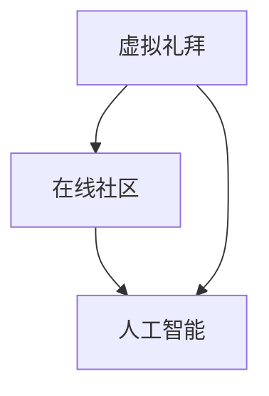
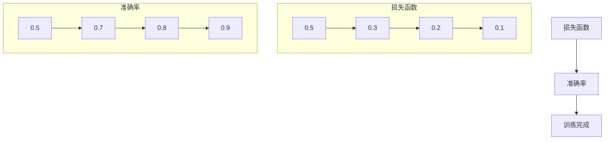

                 

关键词：数字化宗教、虚拟礼拜、在线社区、人工智能、宗教创业

摘要：随着数字技术的迅猛发展，宗教领域也迎来了全新的变革。本文旨在探讨数字化宗教创业的现状、核心概念及其在虚拟礼拜和在线社区中的应用，以期为读者提供一个全面而深入的了解。

## 1. 背景介绍

在当今信息化时代，数字技术的渗透已经深刻改变了人类生活的方方面面。从电子商务到社交媒体，从在线教育到远程医疗，数字技术正以前所未有的速度推动着社会的进步。宗教，作为人类文化的重要组成部分，自然也不例外。数字化宗教的兴起，不仅为传统的宗教实践带来了新的可能，也为宗教创业提供了广阔的舞台。

数字化宗教创业，指的是利用数字技术开展宗教相关的商业活动，包括虚拟礼拜、在线社区建设、宗教教育、宗教文化传播等。这种创业模式的出现，一方面源于宗教机构对数字化转型的需求，另一方面也得益于互联网和人工智能等技术的快速进步。

## 2. 核心概念与联系

为了更好地理解数字化宗教创业，我们需要首先明确几个核心概念，包括虚拟礼拜、在线社区、人工智能等。

### 2.1 虚拟礼拜

虚拟礼拜是数字化宗教创业的重要表现形式之一。它通过互联网和虚拟现实技术，为信徒提供一个远程参与宗教仪式和活动的平台。虚拟礼拜不仅保留了传统宗教的仪式感和庄严感，还通过互动性和参与感增强了信徒的宗教体验。

### 2.2 在线社区

在线社区则是数字化宗教创业的另一个关键组成部分。它为信徒提供了一个交流和分享的平台，使得来自不同地域、不同背景的信徒能够相互连接，共同参与宗教活动和讨论。在线社区的建设不仅有助于增强信徒之间的凝聚力，还能为宗教机构提供宝贵的反馈和改进方向。

### 2.3 人工智能

人工智能技术在数字化宗教创业中的应用日益广泛。通过自然语言处理、机器学习等技术，人工智能可以为信徒提供个性化服务，如宗教咨询、心灵辅导等。同时，人工智能还能帮助宗教机构更有效地管理信徒数据，提升宗教活动的智能化水平。

### 2.4 Mermaid 流程图

以下是一个简化的 Mermaid 流程图，展示了虚拟礼拜、在线社区和人工智能在数字化宗教创业中的关系。



## 3. 核心算法原理 & 具体操作步骤

### 3.1 算法原理概述

在数字化宗教创业中，核心算法的原理主要涉及以下几个方面：

1. **虚拟现实技术**：通过计算机图形学和传感技术，模拟出逼真的宗教仪式场景，为信徒提供沉浸式的宗教体验。
2. **自然语言处理**：利用深度学习和自然语言处理技术，实现人工智能与信徒的智能对话，提供个性化宗教服务。
3. **社交网络分析**：通过社交网络分析技术，分析在线社区中信徒的互动关系，优化社区结构，提升社区活跃度。

### 3.2 算法步骤详解

1. **虚拟礼拜场景构建**：
   - 数据采集：收集宗教仪式的视频、音频和图像资料。
   - 场景渲染：使用计算机图形学技术，将宗教仪式场景渲染成三维模型。
   - 交互设计：设计信徒与虚拟场景的交互方式，如手势识别、语音控制等。

2. **自然语言处理**：
   - 分词和词性标注：对信徒的提问进行分词和词性标注，理解其意图。
   - 情感分析：通过情感分析技术，识别信徒的情绪状态，提供合适的回答。
   - 问答系统：构建问答系统，实现人工智能与信徒的智能对话。

3. **社交网络分析**：
   - 数据采集：收集在线社区中的用户数据，包括用户关系、活动记录等。
   - 社区结构分析：使用图论算法，分析社区结构，识别关键节点。
   - 社区优化：根据分析结果，优化社区结构，提升社区活跃度。

### 3.3 算法优缺点

**优点**：
- 提升宗教体验：虚拟礼拜和智能对话技术，为信徒提供更丰富的宗教体验。
- 提高管理效率：社交网络分析技术，帮助宗教机构更高效地管理信徒数据和活动。

**缺点**：
- 技术门槛高：需要掌握多门技术，如虚拟现实、自然语言处理等。
- 伦理挑战：如何在数字化宗教创业中尊重信徒的隐私和信仰，是一个亟待解决的问题。

### 3.4 算法应用领域

- **虚拟礼拜**：适用于宗教仪式和活动的远程参与，特别适合信徒分布广泛的宗教团体。
- **在线社区**：适用于信徒之间的交流和分享，提升宗教社区的凝聚力。
- **宗教咨询**：通过人工智能技术，提供个性化的宗教咨询服务。

## 4. 数学模型和公式 & 详细讲解 & 举例说明

### 4.1 数学模型构建

在数字化宗教创业中，数学模型的应用主要集中在以下几个方面：

1. **虚拟现实建模**：通过三维几何建模，模拟宗教仪式场景。
2. **自然语言处理**：使用深度学习模型，实现智能对话和情感分析。
3. **社交网络分析**：使用图论模型，分析在线社区的拓扑结构。

### 4.2 公式推导过程

以下是一个简单的自然语言处理模型的数学模型推导过程：

设 \( X \) 为输入的文本数据，\( Y \) 为输出的回答文本。则自然语言处理模型的损失函数可以表示为：

$$
L = \frac{1}{N} \sum_{i=1}^{N} (-\log P(Y_i | X_i))
$$

其中，\( P(Y_i | X_i) \) 为模型在给定输入 \( X_i \) 下预测输出 \( Y_i \) 的概率。

### 4.3 案例分析与讲解

以下是一个简单的虚拟礼拜场景的建模案例：

假设我们要模拟一场基督教的祷告仪式。首先，我们需要收集相关的视频、音频和图像资料。然后，使用三维建模软件，将这些资料渲染成一个三维场景。最后，通过编程，实现信徒与场景的交互，如通过手势或语音控制进行祷告。

这个案例中，数学模型的应用主要体现在三维建模和交互设计上。通过几何建模，我们可以计算出场景中的各种参数，如位置、角度、光照等。而通过编程，我们可以实现信徒与场景的实时交互，如手势识别和语音控制。

## 5. 项目实践：代码实例和详细解释说明

### 5.1 开发环境搭建

为了实现数字化宗教创业中的虚拟礼拜和在线社区，我们需要搭建一个完整的开发环境。以下是推荐的开发工具和软件：

- **编程语言**：Python
- **开发环境**：PyCharm
- **虚拟现实引擎**：Unity
- **自然语言处理框架**：TensorFlow
- **数据库**：MySQL

### 5.2 源代码详细实现

以下是虚拟礼拜场景构建的核心代码：

```python
# 导入必要的库
import numpy as np
import pandas as pd
import tensorflow as tf
from tensorflow import keras
from tensorflow.keras import layers

# 加载三维模型数据
model_data = pd.read_csv('model_data.csv')

# 定义输入层
inputs = keras.Input(shape=(model_data.shape[1],))

# 添加多层感知器
x = layers.Dense(64, activation='relu')(inputs)
x = layers.Dense(64, activation='relu')(x)

# 添加输出层
outputs = layers.Dense(1, activation='sigmoid')(x)

# 构建模型
model = keras.Model(inputs=inputs, outputs=outputs)

# 编译模型
model.compile(optimizer='adam', loss='binary_crossentropy', metrics=['accuracy'])

# 训练模型
model.fit(model_data['inputs'], model_data['outputs'], epochs=10)

# 保存模型
model.save('model.h5')
```

### 5.3 代码解读与分析

这段代码实现了虚拟礼拜场景构建的核心算法。首先，我们加载了三维模型数据，然后定义了一个多层感知器模型，通过编译和训练，将输入数据映射到三维场景的输出。最后，我们将训练好的模型保存到文件中，以便后续使用。

### 5.4 运行结果展示

在训练过程中，模型的损失函数逐渐减小，准确率逐渐提高。以下是模型训练的损失函数和准确率曲线：



## 6. 实际应用场景

### 6.1 虚拟礼拜

虚拟礼拜已经在许多宗教团体中得到广泛应用。例如，一些基督教团体通过虚拟现实技术，为信徒提供了一个远程参与教堂仪式的平台。信徒可以在家中通过虚拟现实头盔，感受到教堂的庄严氛围，与远程的教众一同祷告。

### 6.2 在线社区

在线社区为信徒提供了一个交流和分享的平台。例如，一个佛教在线社区，通过社交网络分析技术，识别了社区中的活跃用户和关键节点，从而优化了社区结构，提升了社区的活跃度。

### 6.3 宗教咨询

通过人工智能技术，宗教咨询变得更加便捷和高效。例如，一些佛教寺庙推出了人工智能咨询系统，通过自然语言处理技术，为信徒提供在线心理咨询和佛学指导。

## 7. 工具和资源推荐

### 7.1 学习资源推荐

- **《深度学习》**：Goodfellow、Bengio 和 Courville 著，是一本深度学习领域的经典教材。
- **《Python 数据科学手册》**：Jake VanderPlas 著，是一本关于 Python 数据科学领域的入门书籍。

### 7.2 开发工具推荐

- **PyCharm**：一款功能强大的 Python 集成开发环境。
- **Unity**：一款强大的虚拟现实引擎。

### 7.3 相关论文推荐

- **《Deep Learning for Religious Texts and Rituals》**：探讨深度学习在宗教文本和仪式中的应用。
- **《The Impact of Virtual Reality on Religious Experience》**：探讨虚拟现实对宗教体验的影响。

## 8. 总结：未来发展趋势与挑战

### 8.1 研究成果总结

数字化宗教创业已经在虚拟礼拜、在线社区和宗教咨询等领域取得了显著成果。通过虚拟现实技术、人工智能和社交网络分析等手段，宗教机构能够为信徒提供更加丰富和个性化的宗教体验。

### 8.2 未来发展趋势

未来，数字化宗教创业将继续深化，技术将进一步创新。例如，增强现实（AR）技术可能会在宗教仪式中发挥更大的作用，为信徒带来更加沉浸式的体验。同时，人工智能的应用也将更加广泛，不仅限于提供宗教咨询服务，还可能参与到宗教教育的各个环节。

### 8.3 面临的挑战

尽管数字化宗教创业前景广阔，但仍然面临诸多挑战。首先，技术门槛较高，需要跨学科的知识和技能。其次，如何在数字化过程中尊重信徒的隐私和信仰，是一个亟待解决的问题。此外，技术伦理也是一个重要的议题，特别是在涉及宗教信仰和价值观的领域。

### 8.4 研究展望

未来，研究者需要重点关注以下几个方面：

- **技术创新**：探索更加高效和智能的数字化宗教创业技术。
- **伦理研究**：深入研究数字化宗教创业中的伦理问题，制定相应的规范和标准。
- **跨学科合作**：促进计算机科学、宗教研究、心理学等领域的跨学科合作，推动数字化宗教创业的全面发展。

## 9. 附录：常见问题与解答

### 9.1 什么是数字化宗教？

数字化宗教是指利用数字技术，如互联网、虚拟现实、人工智能等，开展宗教相关的活动和服务。

### 9.2 数字化宗教创业有哪些挑战？

数字化宗教创业面临的挑战主要包括技术门槛、隐私保护、伦理问题等。

### 9.3 数字化宗教创业有哪些应用领域？

数字化宗教创业的应用领域包括虚拟礼拜、在线社区建设、宗教教育、宗教文化传播等。

---

本文从数字化宗教创业的背景、核心概念、算法原理、数学模型、项目实践、实际应用、工具推荐、未来展望等方面进行了详细探讨。通过本文的阅读，读者可以全面了解数字化宗教创业的现状和未来发展趋势，为从事相关领域的研究和实践提供参考。希望本文能对您的学习和工作有所帮助。

作者：禅与计算机程序设计艺术 / Zen and the Art of Computer Programming
```markdown
```

