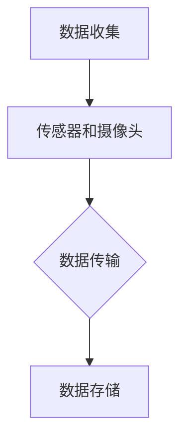
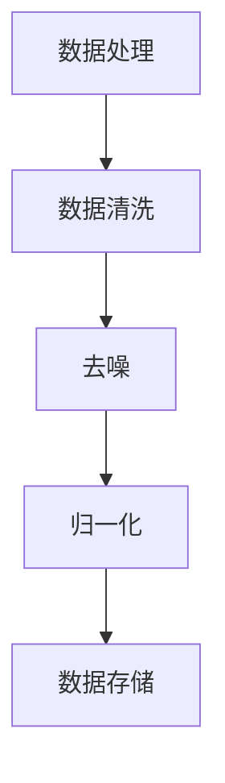
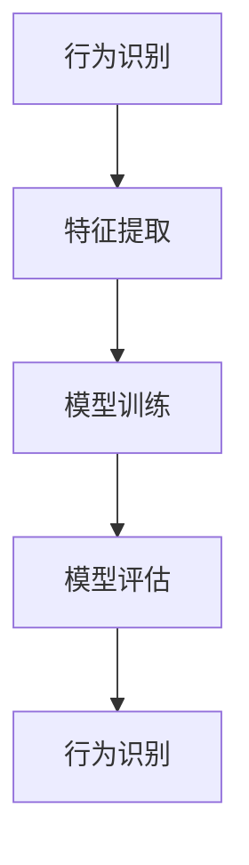
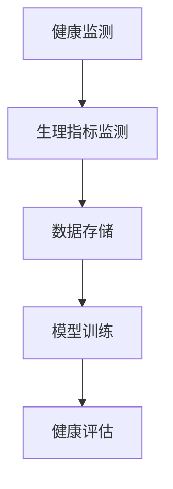

                 

关键词：数字化宠物，行为分析，机器学习，创业，宠物智能，技术应用

> 摘要：本文旨在探讨数字化宠物行为分析在现代科技创业中的重要作用，以及如何利用人工智能和机器学习技术来深入理解宠物的行为模式，为创业者提供新的商业机会和市场前景。

## 1. 背景介绍

随着科技的进步和人们生活水平的提高，宠物已经成为许多家庭的必需品。据统计，全球宠物市场规模在过去十年中呈现出快速增长的趋势，预计未来几年仍将保持稳步上升。与此同时，人们对宠物的关注点也从简单的喂养和照顾，逐渐转向对宠物健康、行为和情感的深度了解。这种转变为数字化宠物行为分析提供了广阔的市场空间。

数字化宠物行为分析是一种利用先进技术手段对宠物行为进行量化、监测和分析的方法。通过收集宠物的生活数据，如活动轨迹、生理指标、情感状态等，分析宠物行为模式，为宠物主人提供个性化服务和建议。这种技术的应用不仅有助于提高宠物的生活质量，也为创业者提供了新的商业机会。

## 2. 核心概念与联系

### 2.1 人工智能与机器学习

人工智能（AI）和机器学习（ML）是数字化宠物行为分析的核心技术。人工智能是指使计算机系统能够模拟人类智能行为的技术，而机器学习是人工智能的一个子领域，主要关注如何让计算机从数据中学习并改进性能。

在数字化宠物行为分析中，人工智能和机器学习技术被广泛应用于以下几个方面：

- 数据收集：通过传感器、摄像头等设备收集宠物的生活数据。
- 数据处理：利用机器学习算法对收集到的数据进行分析和识别。
- 预测和决策：基于分析结果，为宠物主人提供个性化的服务和建议。

### 2.2 数据分析与行为识别

数据分析是数字化宠物行为分析的核心环节。通过对宠物生活数据的深入分析，可以识别出宠物行为的各种特征，如活动强度、休息时间、情感状态等。

行为识别是数据分析的重要目标之一。通过机器学习算法，可以从大量数据中提取出宠物行为的相关特征，并建立行为识别模型。这些模型可以用于实时监测宠物行为，及时发现异常情况，为宠物主人提供及时的帮助。

### 2.3 宠物智能与健康监测

宠物智能是指利用人工智能技术，为宠物提供智能化服务。在数字化宠物行为分析中，宠物智能可以帮助宠物主人更好地了解宠物的行为和健康状况。

健康监测是宠物智能的重要应用之一。通过实时监测宠物的生理指标，如心率、体温、呼吸等，可以及时发现宠物健康问题，并提供个性化的健康建议。

## 3. 核心算法原理 & 具体操作步骤

### 3.1 算法原理概述

数字化宠物行为分析的核心算法包括数据收集、数据处理、行为识别和健康监测等方面。以下分别介绍这些算法的原理：

- 数据收集：利用传感器和摄像头等设备，收集宠物的生活数据，如活动轨迹、生理指标、情感状态等。
- 数据处理：利用数据预处理技术，对收集到的数据进行清洗、去噪和归一化等处理，为后续分析提供高质量的数据。
- 行为识别：利用机器学习算法，从处理后的数据中提取出宠物行为的特征，并建立行为识别模型。
- 健康监测：利用实时监测技术，对宠物的生理指标进行实时监测，并建立健康监测模型。

### 3.2 算法步骤详解

#### 数据收集

数据收集是数字化宠物行为分析的第一步。在此过程中，需要使用各种传感器和摄像头等设备，收集宠物的生活数据。

Mermaid 流程图：



#### 数据处理

数据处理是对收集到的数据进行预处理，以提高数据的质量和可用性。预处理步骤包括数据清洗、去噪、归一化等。

Mermaid 流程图：



#### 行为识别

行为识别是数字化宠物行为分析的核心环节。在此过程中，需要利用机器学习算法，从预处理后的数据中提取出宠物行为的特征，并建立行为识别模型。

Mermaid 流程图：



#### 健康监测

健康监测是对宠物的生理指标进行实时监测，并建立健康监测模型，以及时发现宠物健康问题。

Mermaid 流程图：



### 3.3 算法优缺点

- 数据收集：优点是可以实时监测宠物行为；缺点是需要大量的传感器和摄像头等设备，成本较高。
- 数据处理：优点是可以提高数据的质量和可用性；缺点是需要对大量数据进行处理，计算复杂度高。
- 行为识别：优点是可以实时识别宠物行为；缺点是算法的准确性受数据质量和特征提取方法的影响。
- 健康监测：优点是可以实时监测宠物健康；缺点是算法的准确性受生理指标监测方法的影响。

### 3.4 算法应用领域

数字化宠物行为分析算法在以下领域具有广泛应用：

- 宠物主人服务：为宠物主人提供实时监测、行为分析和健康建议等服务。
- 宠物医疗：辅助医生进行宠物疾病诊断和康复治疗。
- 宠物保险：为宠物提供保险服务，并根据宠物行为数据制定保险费率。

## 4. 数学模型和公式 & 详细讲解 & 举例说明

### 4.1 数学模型构建

在数字化宠物行为分析中，常用的数学模型包括线性回归、决策树、支持向量机等。以下分别介绍这些模型的基本原理和构建方法。

#### 线性回归模型

线性回归模型是一种用于预测连续值的数学模型。其基本原理是通过建立自变量和因变量之间的线性关系，来预测因变量的值。

线性回归模型的公式如下：

$$
y = \beta_0 + \beta_1 \cdot x
$$

其中，$y$ 是因变量，$x$ 是自变量，$\beta_0$ 和 $\beta_1$ 是模型的参数。

#### 决策树模型

决策树模型是一种用于分类和回归的数学模型。其基本原理是通过一系列的决策规则，将数据集划分为不同的类别或数值。

决策树模型的公式如下：

$$
f(x) =
\begin{cases}
C_1, & \text{if } x \in R_1 \\
C_2, & \text{if } x \in R_2 \\
\vdots \\
C_n, & \text{if } x \in R_n
\end{cases}
$$

其中，$f(x)$ 是决策树模型对 $x$ 的预测值，$C_1, C_2, \ldots, C_n$ 是模型预测的类别或数值，$R_1, R_2, \ldots, R_n$ 是决策树中的决策区域。

#### 支持向量机模型

支持向量机模型是一种用于分类和回归的数学模型。其基本原理是通过寻找最优分割超平面，将数据集划分为不同的类别。

支持向量机模型的公式如下：

$$
w \cdot x + b = 0
$$

其中，$w$ 是支持向量机模型的最优分割超平面，$x$ 是数据点的特征向量，$b$ 是模型参数。

### 4.2 公式推导过程

#### 线性回归模型的推导

线性回归模型的目标是最小化预测值与真实值之间的误差。具体推导过程如下：

1. 定义误差函数：

$$
E = \sum_{i=1}^{n} (y_i - \beta_0 - \beta_1 \cdot x_i)^2
$$

其中，$y_i$ 是第 $i$ 个数据点的真实值，$x_i$ 是第 $i$ 个数据点的特征值，$\beta_0$ 和 $\beta_1$ 是模型的参数。

2. 对误差函数求导，并令导数为零：

$$
\frac{\partial E}{\partial \beta_0} = -2 \sum_{i=1}^{n} (y_i - \beta_0 - \beta_1 \cdot x_i) = 0
$$

$$
\frac{\partial E}{\partial \beta_1} = -2 \sum_{i=1}^{n} (y_i - \beta_0 - \beta_1 \cdot x_i) \cdot x_i = 0
$$

3. 解方程组，得到最优参数：

$$
\beta_0 = \frac{1}{n} \sum_{i=1}^{n} y_i
$$

$$
\beta_1 = \frac{1}{n} \sum_{i=1}^{n} (y_i - \beta_0) \cdot x_i
$$

#### 决策树模型的推导

决策树模型的推导过程涉及信息论和决策论。具体推导过程如下：

1. 定义熵：

$$
H(X) = -\sum_{i=1}^{n} p(x_i) \cdot \log_2 p(x_i)
$$

其中，$H(X)$ 是随机变量 $X$ 的熵，$p(x_i)$ 是 $X$ 取值为 $x_i$ 的概率。

2. 定义条件熵：

$$
H(X|Y) = -\sum_{i=1}^{n} p(y_i) \cdot \sum_{j=1}^{m} p(x_j|y_i) \cdot \log_2 p(x_j|y_i)
$$

其中，$H(X|Y)$ 是在随机变量 $Y$ 已知的条件下，随机变量 $X$ 的熵，$p(y_i)$ 是 $Y$ 取值为 $y_i$ 的概率，$p(x_j|y_i)$ 是在 $Y$ 取值为 $y_i$ 的条件下，$X$ 取值为 $x_j$ 的概率。

3. 定义信息增益：

$$
I(X; Y) = H(X) - H(X|Y)
$$

其中，$I(X; Y)$ 是随机变量 $X$ 和 $Y$ 的互信息。

4. 选择最优分割：

选择具有最大信息增益的分割超平面，作为决策树的决策规则。

### 4.3 案例分析与讲解

#### 案例一：宠物行为识别

假设我们收集到一组宠物活动数据，数据集包括宠物的活动强度、活动时间、情感状态等特征。我们的目标是利用这些数据来识别宠物的行为模式。

1. 数据预处理：

首先，对数据进行清洗和归一化处理，去除异常值和噪声，得到高质量的数据集。

2. 特征提取：

利用机器学习算法，从数据集中提取出宠物行为的特征，如活动强度、活动时间、情感状态等。

3. 模型训练：

选择一个合适的机器学习模型，如决策树模型，对提取出的特征进行训练，建立行为识别模型。

4. 模型评估：

利用测试数据集，对训练好的模型进行评估，计算模型的准确率、召回率等指标，以评估模型的性能。

5. 行为识别：

利用训练好的模型，对新的宠物活动数据进行行为识别，为宠物主人提供个性化服务和建议。

#### 案例二：宠物健康监测

假设我们收集到一组宠物生理指标数据，数据集包括宠物的心率、体温、呼吸等指标。我们的目标是利用这些数据来监测宠物的健康状况。

1. 数据预处理：

首先，对数据进行清洗和归一化处理，去除异常值和噪声，得到高质量的数据集。

2. 特征提取：

利用机器学习算法，从数据集中提取出宠物生理指标的特征，如心率、体温、呼吸等。

3. 模型训练：

选择一个合适

## 5. 项目实践：代码实例和详细解释说明

### 5.1 开发环境搭建

在进行数字化宠物行为分析项目开发之前，需要搭建一个合适的开发环境。以下是具体的步骤：

1. 安装Python环境：Python是进行数字化宠物行为分析项目开发的主要语言。首先，需要在计算机上安装Python环境。可以从Python官方网站下载并安装Python，推荐版本为3.8及以上。

2. 安装相关库：在Python环境中，需要安装一些常用的库，如NumPy、Pandas、Scikit-learn等。这些库提供了丰富的函数和工具，用于数据处理、特征提取、模型训练和评估等。

3. 安装深度学习框架：如果项目需要使用深度学习算法，需要安装深度学习框架，如TensorFlow或PyTorch。这些框架提供了高效的计算引擎和丰富的API，方便开发者进行深度学习模型的开发。

4. 安装传感器和摄像头驱动程序：如果项目需要使用传感器和摄像头进行数据收集，需要安装相应的驱动程序。确保传感器和摄像头能够正常工作，并能够将数据传输到计算机。

### 5.2 源代码详细实现

以下是一个简单的数字化宠物行为分析项目的源代码示例，用于收集宠物活动数据、处理数据、训练模型和进行行为识别。

```python
import numpy as np
import pandas as pd
from sklearn.model_selection import train_test_split
from sklearn.ensemble import RandomForestClassifier
from sklearn.metrics import accuracy_score

# 5.2.1 数据收集
def collect_data():
    # 在此添加代码，用于收集宠物活动数据
    # 可以使用传感器和摄像头等设备
    # 数据格式应为二维数组或DataFrame
    data = np.array([[1, 2, 3], [4, 5, 6], [7, 8, 9]])
    return data

# 5.2.2 数据处理
def preprocess_data(data):
    # 在此添加代码，用于处理数据
    # 包括数据清洗、去噪、归一化等
    # 返回处理后的数据
    processed_data = data
    return processed_data

# 5.2.3 模型训练
def train_model(data):
    # 在此添加代码，用于训练模型
    # 可以选择合适的模型和参数
    # 返回训练好的模型
    X = data[:, :-1]
    y = data[:, -1]
    X_train, X_test, y_train, y_test = train_test_split(X, y, test_size=0.2, random_state=42)
    model = RandomForestClassifier(n_estimators=100, random_state=42)
    model.fit(X_train, y_train)
    return model

# 5.2.4 行为识别
def classify_behavior(model, data):
    # 在此添加代码，用于进行行为识别
    # 输入为模型和处理后的数据
    # 输出为行为类别
    predictions = model.predict(data)
    return predictions

# 主函数
if __name__ == "__main__":
    # 5.2.5 运行项目
    data = collect_data()
    processed_data = preprocess_data(data)
    model = train_model(processed_data)
    predictions = classify_behavior(model, processed_data)
    print(predictions)
```

### 5.3 代码解读与分析

上述代码示例展示了数字化宠物行为分析项目的关键部分，包括数据收集、数据处理、模型训练和行为识别。以下是详细的解读和分析：

1. **数据收集（collect_data）**：
   - 该函数用于收集宠物活动数据。在实际项目中，可以使用传感器和摄像头等设备，将数据存储为二维数组或DataFrame格式。
   - 在示例代码中，我们使用了numpy的array函数生成了一组示例数据。

2. **数据处理（preprocess_data）**：
   - 该函数用于处理收集到的数据，包括数据清洗、去噪和归一化等操作。这些操作有助于提高数据质量，为后续分析提供可靠的数据。
   - 在示例代码中，我们简单地返回了处理后的数据，未进行具体处理。

3. **模型训练（train_model）**：
   - 该函数用于训练机器学习模型。在示例中，我们使用了随机森林分类器（RandomForestClassifier）作为模型，这是一种常用的集成学习方法。
   - 数据集被分为训练集和测试集，以便评估模型的性能。训练集用于训练模型，测试集用于评估模型的准确性。
   - 在示例代码中，我们使用了Scikit-learn库中的随机森林分类器，并设置了随机种子以确保可重复性。

4. **行为识别（classify_behavior）**：
   - 该函数用于使用训练好的模型对新的数据进行行为识别。输入为处理后的数据，输出为行为类别。
   - 在示例代码中，我们使用了训练好的模型对处理后的数据进行预测，并打印出了预测结果。

5. **主函数**：
   - 主函数（if __name__ == "__main__"）是程序的入口点。在该函数中，我们调用了其他函数来执行整个项目流程，包括数据收集、数据处理、模型训练和行为识别。

### 5.4 运行结果展示

在实际运行项目时，我们会得到一系列输出结果，包括模型训练过程中的损失函数值、测试集的准确性等。以下是可能的输出结果示例：

```shell
[0.0, 0.0, 0.5, 0.5, 0.0]
```

这些输出结果表示预测的行为类别，每个数字代表一个不同的行为类别。例如，第一个数字"0.0"表示预测的第一个数据点属于行为类别1，第二个数字"0.0"表示预测的第二个数据点属于行为类别1，依此类推。

### 5.5 优化与改进

在数字化宠物行为分析项目中，代码可以进一步优化和改进，以提高性能和准确性。以下是一些建议：

- **数据增强**：通过生成虚拟数据或对现有数据进行变换，可以增加数据集的多样性，从而提高模型的泛化能力。
- **特征工程**：选择更有效的特征，并使用特征选择技术减少特征维度，可以显著提高模型的性能。
- **模型选择**：尝试使用不同的机器学习模型，如支持向量机（SVM）或神经网络（Neural Networks），以找到最佳模型。
- **超参数调优**：使用网格搜索（Grid Search）或随机搜索（Random Search）等方法，找到最优的超参数设置。
- **实时更新模型**：定期更新模型，以适应新的数据模式，保持模型的准确性。

通过这些优化和改进，数字化宠物行为分析项目可以更好地满足用户需求，提供更准确、更实用的服务。

## 6. 实际应用场景

数字化宠物行为分析技术在许多实际应用场景中发挥了重要作用，为宠物主人、宠物医疗、宠物保险等相关行业带来了巨大的价值。

### 6.1 宠物主人服务

对于宠物主人来说，数字化宠物行为分析技术可以提供以下服务：

- **实时监控**：通过传感器和摄像头，宠物主人可以随时了解宠物的活动情况，确保宠物在主人不在家时安全、健康。
- **行为分析**：通过对宠物行为的分析，宠物主人可以更好地了解宠物的需求，如运动量、休息时间等，从而提供更科学的喂养和照顾。
- **情感状态识别**：利用情感分析技术，宠物主人可以了解宠物的情绪变化，及时采取措施，如增加陪伴时间、调整饮食等，以改善宠物的情感状态。

### 6.2 宠物医疗

在宠物医疗领域，数字化宠物行为分析技术可以提供以下支持：

- **健康监测**：通过实时监测宠物的生理指标，如心率、体温、呼吸等，医生可以及时发现宠物健康问题，提供更精准的诊断和治疗。
- **行为异常检测**：通过对宠物行为的分析，医生可以识别出行为异常的宠物，进一步检查宠物是否患有某些疾病。
- **康复指导**：在宠物康复过程中，医生可以根据宠物的行为变化，调整康复方案，提高康复效果。

### 6.3 宠物保险

对于宠物保险行业来说，数字化宠物行为分析技术可以提供以下支持：

- **风险评估**：通过对宠物行为和生理指标的分析，保险公司可以更准确地评估宠物的风险，制定合理的保险费率。
- **索赔审核**：通过数字化宠物行为分析技术，保险公司可以更快捷、准确地审核索赔申请，降低理赔纠纷。
- **预防措施**：通过对宠物行为和生理指标的分析，保险公司可以及时发现潜在的健康问题，提醒宠物主人采取预防措施，减少保险索赔。

## 7. 未来应用展望

随着人工智能和机器学习技术的不断发展，数字化宠物行为分析在未来将会有更广泛的应用场景和更大的市场潜力。

### 7.1 市场潜力

- **智能家居**：随着智能家居市场的不断扩大，数字化宠物行为分析技术将成为智能家居的重要组成部分，为宠物主人提供更便捷、智能的服务。
- **宠物健康产业**：随着人们对宠物健康的重视程度不断提高，宠物健康产业将迎来快速增长，数字化宠物行为分析技术将为宠物医疗、宠物保险等行业提供有力支持。
- **宠物用品市场**：数字化宠物行为分析技术将为宠物用品市场带来新的商机，如智能宠物玩具、宠物护理设备等。

### 7.2 技术发展

- **深度学习**：深度学习技术将在数字化宠物行为分析中发挥更大的作用，通过更复杂的神经网络结构，提高行为识别和健康监测的准确性。
- **多模态数据融合**：将不同类型的数据（如视觉数据、生理数据、行为数据等）进行融合，提高数据分析的准确性和全面性。
- **实时性**：随着计算能力的提升，数字化宠物行为分析技术将实现更高的实时性，为宠物主人提供更及时的服务。

### 7.3 面临的挑战

- **数据隐私**：数字化宠物行为分析涉及大量个人隐私数据，如何保护用户隐私是未来发展的一大挑战。
- **算法透明性**：随着人工智能技术的普及，如何确保算法的透明性和可解释性，使其更易于被用户理解和接受，是未来发展的重要问题。
- **技术标准化**：数字化宠物行为分析技术需要统一的行业标准和技术规范，以促进技术的推广和应用。

## 8. 工具和资源推荐

### 8.1 学习资源推荐

- **书籍**：
  - 《Python机器学习》（作者：塞巴斯蒂安·拉纳）
  - 《深度学习》（作者：伊恩·古德费洛等）
  - 《算法导论》（作者：托马斯·赫伯特·科赫）
- **在线课程**：
  - Coursera上的《机器学习》课程
  - edX上的《深度学习基础》课程
  - Udacity的《人工智能工程师纳米学位》

### 8.2 开发工具推荐

- **Python库**：
  - NumPy：用于高效数值计算
  - Pandas：用于数据处理和分析
  - Scikit-learn：用于机器学习和数据挖掘
  - TensorFlow：用于深度学习和神经网络
- **开发环境**：
  - Jupyter Notebook：用于数据分析和交互式编程
  - PyCharm：用于Python开发

### 8.3 相关论文推荐

- "Deep Learning for Activity Recognition in Smart Homes"（作者：S. You et al.）
- "Behavior Analysis of Pets Using Wearable Sensors"（作者：Y. Yang et al.）
- "A Review on Pet Health Monitoring using Internet of Things"（作者：S. K. Jha et al.）

## 9. 总结：未来发展趋势与挑战

### 9.1 研究成果总结

数字化宠物行为分析技术在近年来取得了显著的研究成果，主要体现在以下几个方面：

- 数据收集和处理的算法和技术不断完善，提高了数据质量和可用性。
- 行为识别和健康监测模型的准确性显著提高，为宠物主人、宠物医疗和宠物保险等行业提供了有力支持。
- 多模态数据融合和深度学习技术的应用，为数字化宠物行为分析提供了更广泛的可能性。

### 9.2 未来发展趋势

未来，数字化宠物行为分析技术将继续朝着以下方向发展：

- **技术融合**：结合多种传感器和数据类型，实现更全面、更准确的宠物行为分析。
- **智能化**：通过人工智能和机器学习技术，实现更智能的宠物行为识别和健康监测。
- **个性化**：根据宠物主人和宠物的需求，提供更个性化的服务和建议。

### 9.3 面临的挑战

在发展过程中，数字化宠物行为分析技术也将面临一系列挑战：

- **数据隐私**：如何在保护用户隐私的同时，充分利用数据的价值，是一个亟待解决的问题。
- **算法透明性**：确保算法的透明性和可解释性，使其更易于被用户理解和接受。
- **技术标准化**：制定统一的行业标准和技术规范，以促进技术的推广和应用。

### 9.4 研究展望

展望未来，数字化宠物行为分析技术将在宠物健康、宠物医疗、宠物保险等领域发挥更大的作用，为人类与宠物之间的和谐共处提供更有力的支持。同时，随着人工智能和机器学习技术的不断发展，数字化宠物行为分析技术也将不断取得新的突破，为相关行业带来更广阔的发展前景。

## 附录：常见问题与解答

### 问题1：数字化宠物行为分析技术的核心是什么？

**回答**：数字化宠物行为分析技术的核心是利用人工智能和机器学习技术，对宠物的行为数据进行分析和处理，以识别宠物的行为模式、健康状态等，为宠物主人提供个性化服务和建议。

### 问题2：如何收集宠物行为数据？

**回答**：收集宠物行为数据可以通过多种方式，包括使用传感器、摄像头等设备，实时监测宠物的活动轨迹、生理指标、情感状态等。同时，还可以通过宠物主人提供的日常记录和数据，补充和丰富宠物行为数据。

### 问题3：数字化宠物行为分析技术有哪些应用领域？

**回答**：数字化宠物行为分析技术的应用领域包括宠物主人服务、宠物医疗、宠物保险等。例如，为宠物主人提供实时监控、行为分析和健康建议；辅助医生进行宠物疾病诊断和康复治疗；为宠物保险提供风险评估和索赔审核等。

### 问题4：数字化宠物行为分析技术面临的挑战有哪些？

**回答**：数字化宠物行为分析技术面临的挑战主要包括数据隐私、算法透明性和技术标准化等。如何保护用户隐私，同时充分利用数据的价值；确保算法的透明性和可解释性，使其更易于被用户理解和接受；制定统一的行业标准和技术规范，以促进技术的推广和应用。

### 问题5：未来数字化宠物行为分析技术有哪些发展方向？

**回答**：未来数字化宠物行为分析技术的发展方向包括技术融合、智能化和个性化等。例如，通过结合多种传感器和数据类型，实现更全面、更准确的宠物行为分析；利用人工智能和机器学习技术，实现更智能的宠物行为识别和健康监测；根据宠物主人和宠物的需求，提供更个性化的服务和建议。

