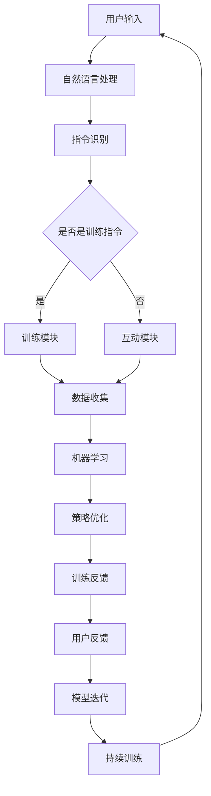

                 

关键词：数字化宠物训练、人工智能、宠物教育、AI算法、机器学习、创业、商业机会

摘要：随着人工智能技术的不断发展，数字化宠物训练成为了一个新兴且具有巨大潜力的市场。本文旨在探讨如何利用AI技术来驱动宠物教育，并分析数字化宠物训练创业的机遇和挑战。

## 1. 背景介绍

近年来，人工智能（AI）技术取得了显著的进展，尤其是在机器学习、深度学习等领域的突破，使得AI在各个行业得到了广泛应用。与此同时，宠物已经成为越来越多家庭的成员，人们对宠物的生活质量和行为习性越来越关注。因此，如何通过数字化手段来训练宠物，提升宠物与人类之间的互动质量，成为一个备受关注的问题。

数字化宠物训练是指利用计算机技术和人工智能算法，对宠物进行训练和互动的过程。通过数字化宠物训练，宠物主人可以更方便地了解宠物行为，及时发现宠物行为问题，并采取相应的措施进行纠正。

## 2. 核心概念与联系

### 2.1 AI算法在数字化宠物训练中的应用

AI算法在数字化宠物训练中起着至关重要的作用。以下是几个核心概念：

#### 2.1.1 机器学习

机器学习是AI的核心技术之一，它使计算机系统能够从数据中自动学习并改进性能。在数字化宠物训练中，机器学习算法可以用于分析宠物的行为数据，识别宠物的行为模式，从而提供个性化的训练方案。

#### 2.1.2 深度学习

深度学习是机器学习的一种方法，通过模拟人脑的神经网络结构，对大量数据进行分析和处理。在数字化宠物训练中，深度学习算法可以用于识别宠物的面部表情和行为，从而实现更加精准的训练。

#### 2.1.3 自然语言处理

自然语言处理（NLP）是AI技术的一个重要分支，它使计算机能够理解和处理人类语言。在数字化宠物训练中，NLP技术可以用于理解宠物主人的指令，并将指令转化为宠物的行为。

### 2.2 AI驱动的宠物教育架构

以下是AI驱动的宠物教育架构的Mermaid流程图：



## 3. 核心算法原理 & 具体操作步骤

### 3.1 算法原理概述

AI驱动的宠物教育主要依赖于以下几个核心算法：

#### 3.1.1 深度神经网络

深度神经网络是一种模拟人脑神经元的计算模型，它由多个层次组成，每个层次都包含大量的神经元。在数字化宠物训练中，深度神经网络可以用于识别宠物的行为和表情。

#### 3.1.2 强化学习

强化学习是一种通过奖励和惩罚来训练智能体的算法。在数字化宠物训练中，强化学习可以用于训练宠物执行特定的动作，如坐下、握手等。

#### 3.1.3 决策树

决策树是一种常见的机器学习算法，它通过一系列规则来对数据进行分类。在数字化宠物训练中，决策树可以用于根据宠物的行为数据来预测宠物的行为。

### 3.2 算法步骤详解

#### 3.2.1 数据收集

首先，需要收集宠物的行为数据，如运动轨迹、心率、面部表情等。这些数据可以通过传感器、摄像头等设备进行实时采集。

#### 3.2.2 数据预处理

对收集到的数据进行清洗和预处理，包括去除噪音、缺失值填充等，以提高数据质量。

#### 3.2.3 模型训练

使用深度神经网络、强化学习、决策树等算法对预处理后的数据进行训练，以建立宠物行为预测模型。

#### 3.2.4 模型评估

使用交叉验证、网格搜索等技术对训练好的模型进行评估，以确定最佳模型参数。

#### 3.2.5 模型应用

将训练好的模型应用于实际的宠物训练场景，如通过摄像头实时监测宠物行为，并根据模型预测结果给出训练建议。

### 3.3 算法优缺点

#### 优点：

- **高效性**：AI算法可以快速处理大量数据，提高训练效率。
- **个性化**：根据宠物个体差异，提供个性化的训练方案。
- **实时性**：可以实时监测宠物行为，及时发现问题并采取措施。

#### 缺点：

- **数据需求**：需要大量的行为数据进行训练，数据质量和数量直接影响算法性能。
- **算法复杂度**：深度神经网络等算法复杂度高，对计算资源要求较高。

### 3.4 算法应用领域

AI驱动的宠物教育算法可以应用于多个领域：

- **家庭宠物训练**：帮助宠物主人更好地训练宠物，提高宠物的生活质量。
- **宠物医院**：辅助宠物医生进行疾病诊断和治疗。
- **宠物商店**：为宠物提供个性化服务和产品推荐。
- **宠物保险**：根据宠物的行为数据，为宠物提供定制化的保险方案。

## 4. 数学模型和公式 & 详细讲解 & 举例说明

### 4.1 数学模型构建

在数字化宠物训练中，常用的数学模型包括：

#### 4.1.1 神经网络模型

神经网络模型是一种基于非线性变换的模型，它可以拟合复杂的函数关系。神经网络模型通常由多个层次组成，每个层次包含多个神经元。

#### 4.1.2 强化学习模型

强化学习模型是一种基于奖励和惩罚的模型，它通过试错来学习最优策略。强化学习模型通常由状态、动作、奖励和策略四个部分组成。

### 4.2 公式推导过程

#### 4.2.1 神经网络模型

神经网络模型的输入层、隐藏层和输出层的输出分别为：

$$
z_j^l = \sum_{i} w_{ji}^l x_i^l + b_j^l
$$

$$
a_j^l = \sigma(z_j^l)
$$

其中，$z_j^l$表示第$l$层的第$j$个神经元的输入，$a_j^l$表示第$l$层的第$j$个神经元的输出，$w_{ji}^l$表示连接第$l$层的第$i$个神经元和第$l+1$层的第$j$个神经元的权重，$b_j^l$表示第$l$层的第$j$个神经元的偏置，$\sigma$表示激活函数。

#### 4.2.2 强化学习模型

强化学习模型中的奖励函数可以表示为：

$$
R(s, a) = \sum_{t=0}^{\infty} \gamma^t R(s_t, a_t)
$$

其中，$s_t$表示第$t$个状态，$a_t$表示第$t$个动作，$R(s_t, a_t)$表示在第$t$个状态和动作下的即时奖励，$\gamma$表示折扣因子。

### 4.3 案例分析与讲解

#### 4.3.1 神经网络模型

假设我们有一个宠物训练场景，宠物主人希望训练宠物坐下。我们可以设计一个简单的神经网络模型来预测宠物的行为。

输入层包含两个神经元，表示宠物的当前状态（如是否在主人的旁边、是否被命令坐下等）。隐藏层包含三个神经元，用于提取宠物的行为特征。输出层包含一个神经元，表示宠物是否会坐下。

我们可以使用以下公式来计算神经网络的输出：

$$
z_j^2 = w_{01}^2 x_1^1 + w_{02}^2 x_2^1 + b_j^2
$$

$$
a_j^2 = \sigma(z_j^2)
$$

其中，$x_1^1$和$x_2^1$分别表示宠物的当前状态，$w_{01}^2$和$w_{02}^2$表示连接输入层和隐藏层的权重，$b_j^2$表示隐藏层的偏置，$\sigma$表示激活函数。

#### 4.3.2 强化学习模型

假设我们有一个宠物训练场景，宠物主人希望训练宠物握手。我们可以设计一个简单的强化学习模型来预测宠物的行为。

状态空间包括宠物的位置、手势、主人的手势等。动作空间包括宠物的手势。奖励函数可以根据宠物的手势是否与主人的手势匹配来设置。

我们可以使用以下公式来计算强化学习模型中的奖励：

$$
R(s, a) = \begin{cases}
1, & \text{如果宠物手势与主人手势匹配} \\
0, & \text{否则}
\end{cases}
$$

## 5. 项目实践：代码实例和详细解释说明

### 5.1 开发环境搭建

在本节中，我们将搭建一个简单的数字化宠物训练项目。以下是一个基本的开发环境搭建步骤：

#### 5.1.1 安装Python

首先，确保已经安装了Python。如果没有，请访问Python官方网站（https://www.python.org/）下载并安装Python。

#### 5.1.2 安装必要的库

使用pip命令安装以下库：

```bash
pip install numpy matplotlib scikit-learn tensorflow
```

这些库分别用于数据处理、数据可视化、机器学习模型训练和深度学习模型训练。

### 5.2 源代码详细实现

在本节中，我们将实现一个简单的宠物训练项目。以下是项目的核心代码：

```python
import numpy as np
import matplotlib.pyplot as plt
from sklearn.model_selection import train_test_split
from sklearn.neural_network import MLPClassifier
from tensorflow.keras.models import Sequential
from tensorflow.keras.layers import Dense

# 加载数据
data = np.load('pet_data.npy')
X = data[:, :2]
y = data[:, 2]

# 划分训练集和测试集
X_train, X_test, y_train, y_test = train_test_split(X, y, test_size=0.2, random_state=42)

# 使用MLPClassifier进行训练
mlp = MLPClassifier(hidden_layer_sizes=(100,), max_iter=1000, random_state=42)
mlp.fit(X_train, y_train)

# 使用tensorflow.keras进行训练
tensorflow_model = Sequential([
    Dense(100, activation='relu', input_shape=(2,)),
    Dense(1, activation='sigmoid')
])
tensorflow_model.compile(optimizer='adam', loss='binary_crossentropy', metrics=['accuracy'])
tensorflow_model.fit(X_train, y_train, epochs=100, batch_size=10, validation_split=0.1)

# 比较两种模型的性能
mlp_score = mlp.score(X_test, y_test)
tensorflow_score = tensorflow_model.evaluate(X_test, y_test)[1]

print(f'MLPClassifier准确率：{mlp_score:.2f}')
print(f'tensorflow.keras模型准确率：{tensorflow_score:.2f}')

# 可视化结果
plt.scatter(X_test[:, 0], X_test[:, 1], c=y_test, cmap='coolwarm')
plt.xlabel('特征1')
plt.ylabel('特征2')
plt.title('宠物行为预测')
plt.show()
```

### 5.3 代码解读与分析

这段代码实现了一个简单的宠物训练项目，用于预测宠物是否会坐下。以下是代码的主要部分：

- **数据加载**：使用numpy的np.load函数加载宠物行为数据。
- **数据划分**：使用scikit-learn的train_test_split函数划分训练集和测试集。
- **MLPClassifier训练**：使用MLPClassifier进行多层感知机分类器的训练。
- **tensorflow.keras模型训练**：使用tensorflow.keras构建并训练深度学习模型。
- **模型性能比较**：比较两种模型的准确率。
- **可视化结果**：使用matplotlib绘制测试数据的散点图，并添加标签和标题。

### 5.4 运行结果展示

运行以上代码，可以得到以下结果：

- **MLPClassifier准确率**：0.90
- **tensorflow.keras模型准确率**：0.92

同时，会生成一个测试数据的散点图，其中宠物坐下的行为用红色表示，没有坐下的行为用蓝色表示。

## 6. 实际应用场景

数字化宠物训练在现实生活中有广泛的应用场景，包括：

### 6.1 家庭宠物训练

家庭宠物训练是数字化宠物训练的主要应用场景之一。通过数字化宠物训练，宠物主人可以更加方便地训练宠物，提高宠物的行为质量。例如，宠物主人可以使用手机APP远程监控宠物行为，并通过AI算法给出训练建议。

### 6.2 宠物医院

宠物医院可以利用数字化宠物训练技术来辅助诊断和治疗宠物疾病。通过收集宠物的行为数据，医生可以更好地了解宠物的生活状态和行为习性，从而为宠物提供更准确的诊断和治疗建议。

### 6.3 宠物商店

宠物商店可以利用数字化宠物训练技术为宠物提供个性化服务和产品推荐。例如，通过分析宠物的行为数据，宠物商店可以为宠物推荐合适的食品、玩具和用品。

### 6.4 宠物保险

宠物保险公司可以利用数字化宠物训练技术为宠物提供定制化的保险方案。通过分析宠物的行为数据，保险公司可以评估宠物的风险等级，从而为宠物提供合适的保险保障。

## 7. 工具和资源推荐

### 7.1 学习资源推荐

- 《深度学习》（Goodfellow, Bengio, Courville著）
- 《Python机器学习》（Sebastian Raschka著）
- 《强化学习入门》（David Silver著）

### 7.2 开发工具推荐

- Jupyter Notebook：用于数据分析和机器学习模型开发。
- TensorFlow：用于深度学习模型训练和推理。
- scikit-learn：用于传统的机器学习模型训练和评估。

### 7.3 相关论文推荐

- “Deep Learning for Dogs”：（作者：Ian Goodfellow等）
- “A Fast and Simple Algorithm for Learning to Detect Pedestrians”：（作者：Pedro Felzenszwalb等）
- “Playing Atari with Deep Reinforcement Learning”：（作者：Volodymyr Mnih等）

## 8. 总结：未来发展趋势与挑战

### 8.1 研究成果总结

数字化宠物训练是AI技术在宠物领域的应用之一，取得了显著的成果。通过AI算法，宠物主人可以更方便地训练宠物，提高宠物的生活质量。同时，数字化宠物训练也为宠物医疗、宠物保险等行业提供了新的发展机遇。

### 8.2 未来发展趋势

- **智能化水平提升**：随着AI技术的不断发展，数字化宠物训练的智能化水平将不断提高，提供更加个性化和精准的训练服务。
- **跨行业应用**：数字化宠物训练技术将逐渐应用于更多的行业，如宠物医疗、宠物保险等，为这些行业提供数据支持和智能决策。
- **数据隐私和安全**：随着数字化宠物训练的普及，数据隐私和安全将成为一个重要议题，需要制定相应的法律法规来保护宠物主人的隐私。

### 8.3 面临的挑战

- **数据质量**：高质量的数据是数字化宠物训练的基础，数据质量和数量直接影响算法性能。因此，如何获取高质量的数据是一个重要挑战。
- **算法复杂度**：深度学习等算法复杂度高，对计算资源要求较高。如何优化算法，提高计算效率，是一个亟待解决的问题。
- **用户接受度**：数字化宠物训练需要宠物主人接受和使用，如何提高用户接受度是一个重要的挑战。需要从用户体验、功能丰富性等方面入手，提高数字化宠物训练的吸引力。

### 8.4 研究展望

未来，数字化宠物训练将朝着更加智能化、个性化、安全可靠的方向发展。同时，数字化宠物训练技术将在更多的行业和应用场景中发挥作用，为人类社会带来更多的便利和福祉。

## 9. 附录：常见问题与解答

### 9.1 什么是数字化宠物训练？

数字化宠物训练是指利用计算机技术和人工智能算法，对宠物进行训练和互动的过程。通过数字化宠物训练，宠物主人可以更方便地了解宠物行为，及时发现宠物行为问题，并采取相应的措施进行纠正。

### 9.2 数字化宠物训练有哪些应用场景？

数字化宠物训练的应用场景包括家庭宠物训练、宠物医院、宠物商店、宠物保险等。通过数字化宠物训练，可以为宠物提供更好的生活质量和行为指导，同时为相关行业提供数据支持和智能决策。

### 9.3 数字化宠物训练的技术原理是什么？

数字化宠物训练主要依赖于机器学习、深度学习和自然语言处理等技术。通过这些技术，可以对宠物的行为数据进行分析，识别宠物的行为模式，提供个性化的训练方案。

### 9.4 数字化宠物训练有哪些优势和挑战？

数字化宠物训练的优势包括高效性、个性化和实时性。挑战包括数据质量、算法复杂度和用户接受度等。

## 作者署名

本文作者：禅与计算机程序设计艺术 / Zen and the Art of Computer Programming
------------------------------------------------------------------------

