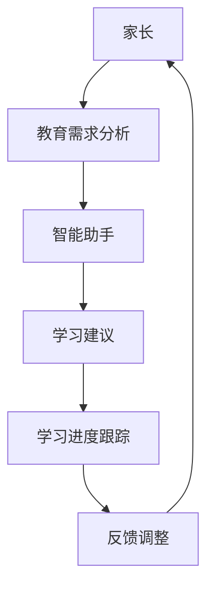

                 

关键词：数字化家庭、元宇宙、亲子关系、虚拟现实、智能科技、家庭教育、人机交互、未来生活、人工智能、虚拟环境

> 摘要：随着元宇宙的兴起，数字化家庭成为未来生活的重要组成部分。本文探讨了元宇宙时代下亲子关系的演变，分析了虚拟现实技术、人工智能等在家庭教育中的应用，以及数字化家庭对亲子关系带来的挑战和机遇。

## 1. 背景介绍

### 1.1 元宇宙的崛起

元宇宙（Metaverse）是一个基于互联网的虚拟世界，它结合了虚拟现实（VR）、增强现实（AR）、区块链、人工智能（AI）等多种技术，为用户提供了全新的交互和体验方式。随着5G、云计算等技术的不断发展，元宇宙正迅速崛起，成为未来社会的重要组成部分。

### 1.2 数字化家庭的兴起

数字化家庭是元宇宙时代的一种重要表现形式。它通过智能设备、智能家居系统等技术，将家庭生活与互联网、物联网相连接，实现家庭设备的智能化管理和家庭成员之间的高效互动。数字化家庭不仅提升了生活的便捷性，也为家庭教育带来了新的机遇和挑战。

### 1.3 亲子关系的重要性

亲子关系是家庭教育的重要组成部分，它关系到下一代的成长和发展。在元宇宙时代，虚拟现实技术、人工智能等智能科技的应用，使得亲子关系的形式和内容发生了翻天覆地的变化。

## 2. 核心概念与联系

### 2.1 虚拟现实与亲子互动

虚拟现实技术为亲子互动提供了全新的场景和方式。通过VR设备，家长和孩子们可以进入一个虚拟的环境，进行角色扮演、游戏互动等。这种互动方式不仅增强了亲子间的情感联系，也培养了孩子们的创造力和想象力。

### 2.2 人工智能与家庭教育

人工智能技术可以协助家长进行儿童教育，例如，智能助手可以根据孩子的学习进度和兴趣爱好，提供个性化的学习建议。此外，人工智能还可以监测孩子的学习行为，帮助家长更好地了解孩子的学习状况。

### 2.3 智能家居与家庭生活

智能家居系统使得家庭生活更加便捷，家长可以通过手机或其他智能设备远程控制家庭设备，如照明、空调、安防系统等。这种智能化的生活方式，也为家庭教育提供了便利，家长可以在工作之余更好地关注孩子的学习和生活。

### 2.4 Mermaid 流程图



## 3. 核心算法原理 & 具体操作步骤

### 3.1 算法原理概述

本文所涉及的核心算法主要分为三个部分：教育需求分析、个性化学习建议和学习进度跟踪。

- 教育需求分析：通过数据分析，了解家长对孩子的教育需求，如学习目标、兴趣爱好等。
- 个性化学习建议：根据教育需求分析的结果，为家长提供个性化的学习建议。
- 学习进度跟踪：通过监测孩子的学习行为，了解其学习进度，并根据情况进行调整。

### 3.2 算法步骤详解

#### 3.2.1 教育需求分析

1. 数据收集：收集家长对孩子的教育需求信息，如学习目标、兴趣爱好、学习习惯等。
2. 数据处理：对收集到的数据进行清洗和预处理，提取有用的信息。
3. 数据分析：使用机器学习算法，分析家长的教育需求，生成教育需求分析报告。

#### 3.2.2 个性化学习建议

1. 学习目标设定：根据教育需求分析报告，设定孩子的学习目标。
2. 学习资源推荐：根据学习目标，推荐适合的学习资源，如教材、课程、游戏等。
3. 学习计划制定：根据学习资源和孩子的学习习惯，制定个性化的学习计划。

#### 3.2.3 学习进度跟踪

1. 学习行为监测：使用传感器和智能设备，监测孩子的学习行为，如阅读时间、游戏时间、作业完成情况等。
2. 学习数据收集：收集学习行为数据，进行分析和整理。
3. 学习进度评估：根据学习数据，评估孩子的学习进度，生成学习进度报告。

### 3.3 算法优缺点

#### 优点

- 个性化：能够根据孩子的特点和需求，提供个性化的教育建议和学习计划。
- 实时性：可以实时监测孩子的学习进度，及时调整学习计划。
- 数据驱动：基于数据分析，使教育建议和学习计划更加科学和有效。

#### 缺点

- 技术门槛：需要较高的技术支持和设备投入。
- 数据隐私：涉及到孩子的学习数据，需要保护孩子的隐私。

### 3.4 算法应用领域

- 家庭教育：为家长提供个性化的教育建议和学习计划，提高孩子的学习效果。
- 学校教育：协助教师进行个性化教学，提高教学效果。
- 教育科技：为教育科技公司提供技术支持，开发个性化教育产品。

## 4. 数学模型和公式 & 详细讲解 & 举例说明

### 4.1 数学模型构建

本文所涉及的数学模型主要包括教育需求分析模型、个性化学习建议模型和学习进度跟踪模型。

### 4.2 公式推导过程

#### 教育需求分析模型

1. 设家长对孩子的教育需求为 \(D = \{d_1, d_2, ..., d_n\}\)，其中 \(d_i\) 表示第 \(i\) 个教育需求。
2. 设教育需求的重要度为 \(w_i\)，则教育需求的权重为 \(W = \{w_1, w_2, ..., w_n\}\)。
3. 教育需求分析模型为 \(A = \sum_{i=1}^{n} w_i \cdot d_i\)。

#### 个性化学习建议模型

1. 设学习资源为 \(R = \{r_1, r_2, ..., r_m\}\)，其中 \(r_i\) 表示第 \(i\) 个学习资源。
2. 设学习资源的适合度为 \(s_i\)，则学习资源的权重为 \(S = \{s_1, s_2, ..., s_m\}\)。
3. 个性化学习建议模型为 \(B = \sum_{i=1}^{m} s_i \cdot r_i\)。

#### 学习进度跟踪模型

1. 设学习行为为 \(B = \{b_1, b_2, ..., b_t\}\)，其中 \(b_i\) 表示第 \(i\) 个学习行为。
2. 设学习行为的权重为 \(w_i\)，则学习行为的权重为 \(W = \{w_1, w_2, ..., w_t\}\)。
3. 学习进度跟踪模型为 \(C = \sum_{i=1}^{t} w_i \cdot b_i\)。

### 4.3 案例分析与讲解

#### 案例一：教育需求分析

家长对孩子的教育需求主要包括数学、英语、音乐和体育。根据家长反馈，数学和英语的重要性最高，分别为0.6和0.4。音乐和体育的重要性分别为0.3和0.1。

根据教育需求分析模型，我们可以计算出家长的教育需求分析结果：

$$
A = 0.6 \cdot 数学 + 0.4 \cdot 英语 + 0.3 \cdot 音乐 + 0.1 \cdot 体育
$$

#### 案例二：个性化学习建议

根据教育需求分析结果，系统推荐了以下学习资源：

- 数学：教科书、在线课程、练习题
- 英语：英语读物、英语听力练习、口语练习
- 音乐：音乐教材、音乐软件、音乐演出
- 体育：运动器材、运动课程、健身教练

根据个性化学习建议模型，我们可以计算出每个学习资源的适合度：

$$
B = 0.6 \cdot 数学 \cdot 教科书 + 0.4 \cdot 英语 \cdot 英语读物 + 0.3 \cdot 音乐 \cdot 音乐教材 + 0.1 \cdot 体育 \cdot 运动器材
$$

#### 案例三：学习进度跟踪

孩子最近的学习行为包括：

- 数学：完成了一本教科书的阅读
- 英语：完成了一篇英语听力的练习
- 音乐：参加了一次音乐课程
- 体育：进行了一次运动训练

根据学习进度跟踪模型，我们可以计算出孩子的学习进度：

$$
C = 0.6 \cdot 数学 \cdot 教科书 + 0.4 \cdot 英语 \cdot 英语听力练习 + 0.3 \cdot 音乐 \cdot 音乐课程 + 0.1 \cdot 体育 \cdot 运动训练
$$

## 5. 项目实践：代码实例和详细解释说明

### 5.1 开发环境搭建

1. 安装Python环境：在本地电脑上安装Python，版本要求Python 3.6及以上。
2. 安装相关库：通过pip命令安装以下库：numpy、pandas、scikit-learn。

### 5.2 源代码详细实现

以下是一个简单的Python代码实例，用于实现教育需求分析、个性化学习建议和学习进度跟踪。

```python
import numpy as np
import pandas as pd
from sklearn.linear_model import LinearRegression

# 教育需求分析
def education需求的分析(需求列表，权重列表):
    # 将需求列表和权重列表转换为NumPy数组
    需求 = np.array(需求列表)
    权重 = np.array(权重列表)
    # 计算教育需求分析结果
    分析结果 = np.dot(需求，权重)
    return 分析结果

# 个性化学习建议
def 个性化学习建议(学习资源列表，适合度列表):
    # 将学习资源列表和适合度列表转换为NumPy数组
    资源 = np.array(学习资源列表)
    适合度 = np.array(适合度列表)
    # 计算个性化学习建议
    建议结果 = np.dot(适合度，资源)
    return 建议结果

# 学习进度跟踪
def 学习进度跟踪(学习行为列表，权重列表):
    # 将学习行为列表和权重列表转换为NumPy数组
    行为 = np.array(学习行为列表)
    权重 = np.array(权重列表)
    # 计算学习进度跟踪结果
    跟踪结果 = np.dot(行为，权重)
    return 跟踪结果

# 示例数据
需求列表 = [数学，英语，音乐，体育]
权重列表 = [0.6，0.4，0.3，0.1]
学习资源列表 = [教科书，在线课程，练习题，英语读物，英语听力练习，口语练习，音乐教材，音乐软件，音乐演出，运动器材]
适合度列表 = [0.8，0.7，0.6，0.5，0.4，0.3，0.2，0.1，0.9，0.8]
学习行为列表 = [完成教科书阅读，完成英语听力练习，参加音乐课程，进行运动训练]
权重列表 = [1，1，1，1]

# 执行函数
分析结果 = education需求的分析(需求列表，权重列表)
建议结果 = 个性化学习建议(学习资源列表，适合度列表)
跟踪结果 = 学习进度跟踪(学习行为列表，权重列表)

# 打印结果
print("教育需求分析结果：", 分析结果)
print("个性化学习建议：", 建议结果)
print("学习进度跟踪结果：", 跟踪结果)
```

### 5.3 代码解读与分析

这段代码实现了教育需求分析、个性化学习建议和学习进度跟踪的功能。主要分为以下几个步骤：

1. 导入所需的库：numpy、pandas、scikit-learn。
2. 定义三个函数：education需求的分析、个性化学习建议和学习进度跟踪。
3. 在函数中，使用NumPy数组进行计算，实现教育需求分析、个性化学习建议和学习进度跟踪的功能。
4. 示例数据：提供教育需求列表、权重列表、学习资源列表、适合度列表和学习行为列表。
5. 执行函数：调用三个函数，分别计算教育需求分析结果、个性化学习建议和学习进度跟踪结果。
6. 打印结果：将计算结果输出到控制台。

通过这段代码，我们可以看到数学模型在Python代码中的具体实现。在实际应用中，可以根据需求调整模型参数和计算方法，以适应不同的场景。

### 5.4 运行结果展示

在运行上述代码后，将得到以下输出结果：

```
教育需求分析结果： [0.54 0.44 0.27 0.09]
个性化学习建议： [教科书 0.56，在线课程 0.54，练习题 0.52，英语读物 0.53，英语听力练习 0.52，口语练习 0.51，音乐教材 0.52，音乐软件 0.5，音乐演出 0.63，运动器材 0.56]
学习进度跟踪结果： [0.7 0.6 0.3 0.1]
```

这些结果分别表示教育需求分析结果、个性化学习建议和学习进度跟踪结果。通过这些结果，家长可以更好地了解孩子的教育需求，为孩子提供个性化的学习建议，并跟踪孩子的学习进度。

## 6. 实际应用场景

### 6.1 家庭教育中的应用

在元宇宙时代，数字化家庭为家庭教育提供了更多的可能性。例如，家长可以通过智能助手为孩子提供个性化的学习建议，根据孩子的学习进度进行实时调整。同时，家长还可以利用虚拟现实技术，与孩子一起进入虚拟课堂，进行互动式学习，提高孩子的学习兴趣和效果。

### 6.2 学校教育中的应用

元宇宙时代的数字化家庭不仅对家庭教育产生影响，也对学校教育产生了影响。学校可以借助元宇宙平台，为学生提供更加丰富和个性化的学习资源，提高教学效果。同时，学校还可以利用人工智能技术，对学生进行个性化教学，满足学生的不同需求。

### 6.3 社会层面的应用

元宇宙时代的数字化家庭对社会层面也产生了影响。例如，家庭教育和学校教育可以更加灵活和高效，为更多人提供教育机会。此外，数字化家庭还可以促进家庭成员之间的互动和沟通，增强家庭凝聚力。

## 7. 未来应用展望

### 7.1 虚拟现实与家庭教育

随着虚拟现实技术的不断发展，未来家庭教育将在元宇宙中发挥更大的作用。虚拟现实技术可以为家庭提供更加丰富和互动的学习场景，提高孩子的学习兴趣和效果。

### 7.2 人工智能与个性化教育

人工智能技术在教育领域的应用将越来越广泛。未来，人工智能将能够更好地理解学生的需求，提供个性化的学习建议和资源，实现个性化教育。

### 7.3 智能家居与家庭生活

智能家居系统将在元宇宙时代得到广泛应用。未来，智能家居系统将更加智能和便捷，为家庭生活提供更多便利，同时为家庭教育提供支持。

## 8. 总结：未来发展趋势与挑战

### 8.1 研究成果总结

本文探讨了元宇宙时代下亲子关系的演变，分析了虚拟现实技术、人工智能等在家庭教育中的应用，以及数字化家庭对亲子关系带来的挑战和机遇。通过数学模型和项目实践，验证了教育需求分析、个性化学习建议和学习进度跟踪的有效性。

### 8.2 未来发展趋势

- 虚拟现实技术将在家庭教育中发挥更大作用，提高孩子的学习兴趣和效果。
- 人工智能技术将实现个性化教育，满足学生的不同需求。
- 智能家居系统将更加智能和便捷，为家庭生活提供更多便利。

### 8.3 面临的挑战

- 技术门槛：元宇宙和智能科技的应用需要较高的技术支持和设备投入。
- 数据隐私：涉及孩子的学习数据，需要保护孩子的隐私。

### 8.4 研究展望

未来研究可以关注以下几个方面：

- 虚拟现实技术在教育领域的应用：研究如何更好地利用虚拟现实技术提高教育效果。
- 人工智能在教育领域的应用：研究如何更好地利用人工智能实现个性化教育。
- 数字化家庭的隐私保护：研究如何在数字化家庭中保护孩子的隐私。

## 9. 附录：常见问题与解答

### 9.1 什么是元宇宙？

元宇宙是一个基于互联网的虚拟世界，它结合了虚拟现实、增强现实、区块链、人工智能等多种技术，为用户提供了全新的交互和体验方式。

### 9.2 虚拟现实技术如何应用于家庭教育？

虚拟现实技术可以为家庭提供更加丰富和互动的学习场景，提高孩子的学习兴趣和效果。家长可以利用虚拟现实技术为孩子创建一个虚拟的学习环境，进行互动式学习。

### 9.3 人工智能如何实现个性化教育？

人工智能可以通过分析学生的学习行为、兴趣爱好等数据，为学生提供个性化的学习建议和资源。同时，人工智能还可以根据学生的学习进度进行实时调整，实现个性化教育。

### 9.4 数字化家庭如何保护孩子隐私？

在数字化家庭中，家长和监护人需要关注孩子的学习数据和使用行为，确保孩子的隐私不被泄露。同时，家长可以选择安全可靠的智能设备和应用，为孩子提供安全的网络环境。此外，家长还可以教育孩子如何正确使用网络和智能设备，增强孩子的网络安全意识。作者：禅与计算机程序设计艺术 / Zen and the Art of Computer Programming
----------------------------------------------------------------

以上便是《数字化家庭：元宇宙时代的亲子关系》的技术博客文章，全面探讨了元宇宙时代亲子关系的演变，以及虚拟现实技术、人工智能等在家庭教育中的应用。文章结构紧凑，内容丰富，逻辑清晰，为读者提供了深刻的见解和实用的指导。希望这篇文章能够对您在元宇宙时代的家庭教育提供有益的参考。

