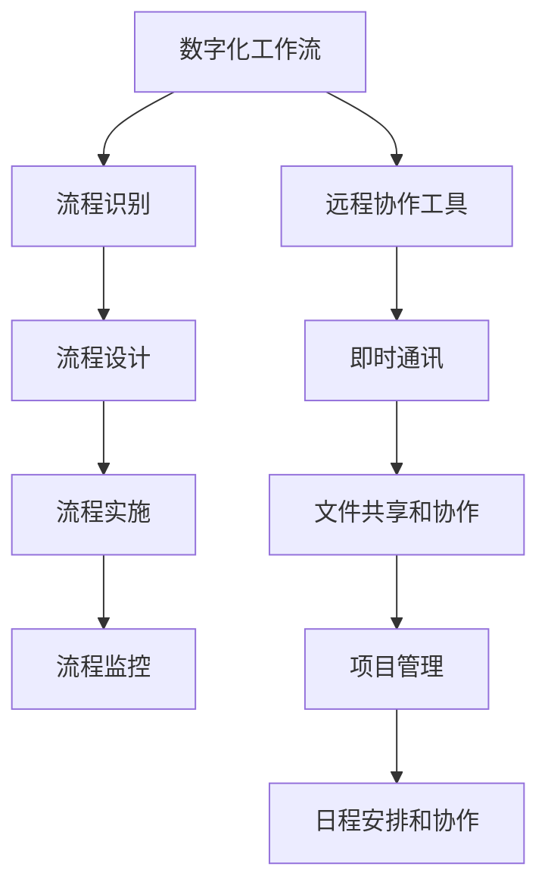

                 

关键词：数字化工作流、远程协作、效率工具、创业、技术解决方案

> 摘要：本文将探讨数字化工作流的创业机会，重点关注远程协作中的效率工具。通过深入分析核心概念、算法原理、数学模型、实际应用场景，以及未来发展趋势和挑战，旨在为读者提供关于如何利用远程协作工具实现高效数字化工作流的全面指南。

## 1. 背景介绍

随着全球数字化转型的加速，远程工作已成为许多企业不可或缺的一部分。这不仅改变了传统的办公模式，还带来了新的工作流和管理挑战。在这种背景下，数字化工作流创业成为了一个充满机遇的市场。创业者们正致力于开发各种远程协作工具，以帮助企业和团队提高效率、优化流程，并实现更灵活的工作方式。

数字化工作流指的是通过信息技术优化和自动化工作流程，以实现更高效、更准确和更灵活的运营。远程协作工具则是在这种背景下应运而生，它们支持团队成员在不同地理位置之间进行实时沟通、协作和资源共享。这些工具不仅提高了工作效率，还促进了团队的创新和协作。

本文将探讨以下几个关键领域：

1. **核心概念与联系**：介绍数字化工作流和远程协作工具的核心概念，并提供一个流程图来展示它们之间的联系。
2. **核心算法原理 & 具体操作步骤**：深入探讨远程协作工具所使用的核心算法原理，并提供具体操作步骤。
3. **数学模型和公式 & 举例说明**：讨论用于优化远程协作的工具的数学模型和公式，并通过案例进行详细讲解。
4. **项目实践：代码实例和详细解释说明**：提供一个具体的代码实例，详细解释如何使用远程协作工具进行实际项目开发。
5. **实际应用场景**：分析远程协作工具在不同行业和领域的实际应用。
6. **未来应用展望**：探讨远程协作工具的未来发展趋势和潜在应用。
7. **工具和资源推荐**：推荐相关的学习资源和开发工具，以及相关论文。
8. **总结：未来发展趋势与挑战**：总结研究成果，展望未来趋势和面临的挑战。
9. **附录：常见问题与解答**：回答一些常见问题，以帮助读者更好地理解和应用远程协作工具。

## 2. 核心概念与联系

数字化工作流和远程协作工具是现代企业运营中不可或缺的两个概念。它们之间的关系可以简单概括为：数字化工作流依赖于远程协作工具来实现其目标。

### 2.1 数字化工作流

数字化工作流是指通过信息技术对传统工作流程进行优化和自动化，以提高效率、准确性和灵活性。这通常涉及以下几个关键步骤：

1. **流程识别**：确定现有工作流程中的问题和瓶颈。
2. **流程设计**：根据业务需求重新设计工作流程。
3. **流程实施**：使用数字化工具和系统实现新的工作流程。
4. **流程监控**：监控工作流程的性能，并根据反馈进行优化。

### 2.2 远程协作工具

远程协作工具是一种支持团队成员在不同地理位置之间进行实时沟通、协作和资源共享的软件或平台。这些工具通常包括以下功能：

1. **即时通讯**：支持实时文本、语音和视频通讯。
2. **文件共享和协作**：允许团队成员共享和编辑文件。
3. **项目管理**：帮助团队跟踪项目进度和任务分配。
4. **日程安排和协作**：支持团队成员共享日程和协作安排。

### 2.3 Mermaid 流程图

为了更直观地展示数字化工作流和远程协作工具之间的联系，我们可以使用 Mermaid 流程图来描述它们的核心概念和关系。



### 2.4 Mermaid 流程节点详细说明

以下是流程图中每个节点的详细说明：

- **流程识别**：通过分析现有工作流程，识别流程中的瓶颈和问题。
- **流程设计**：根据业务需求，重新设计工作流程，以优化效率和灵活性。
- **流程实施**：使用远程协作工具实现新的工作流程，确保团队成员可以无缝协作。
- **流程监控**：监控工作流程的性能，并根据反馈进行持续优化。

- **即时通讯**：提供实时文本、语音和视频通讯功能，支持团队成员之间的即时沟通。
- **文件共享和协作**：允许团队成员共享和编辑文件，实现高效的协作。
- **项目管理**：帮助团队跟踪项目进度和任务分配，确保项目按时完成。
- **日程安排和协作**：支持团队成员共享日程和协作安排，优化团队协作。

通过这个流程图，我们可以清晰地看到数字化工作流和远程协作工具之间的紧密联系。数字化工作流依赖于远程协作工具来实现其目标，而远程协作工具则为数字化工作流提供了必要的支持和保障。

## 3. 核心算法原理 & 具体操作步骤

远程协作工具的核心算法原理主要涉及即时通讯、文件共享和协作、项目管理以及日程安排等方面。以下将分别对这些算法原理进行概述，并提供具体的操作步骤。

### 3.1 即时通讯算法原理

即时通讯算法主要基于实时消息传递和协议设计。其核心原理包括：

- **消息队列**：将消息保存在一个队列中，确保消息按顺序传递。
- **负载均衡**：通过负载均衡算法，将消息分发到不同的服务器，以避免单点故障。
- **容错机制**：确保在服务器故障时，消息不会丢失，并能自动重传。

#### 具体操作步骤

1. **消息发送**：用户发送消息，消息被保存在消息队列中。
2. **消息处理**：服务器从消息队列中取出消息，并按照协议发送给目标用户。
3. **消息确认**：目标用户收到消息后，发送确认消息给服务器。
4. **消息重传**：如果消息在传输过程中丢失，服务器会重新发送消息。

### 3.2 文件共享和协作算法原理

文件共享和协作算法主要涉及文件存储、版本控制和权限管理。其核心原理包括：

- **分布式文件系统**：将文件分散存储在多个服务器上，以提高可靠性和性能。
- **版本控制**：记录文件的每个版本，确保团队成员可以协作修改文件。
- **权限管理**：根据用户角色和权限，控制用户对文件的访问和操作。

#### 具体操作步骤

1. **文件上传**：用户上传文件到分布式文件系统。
2. **文件存储**：文件被分散存储在多个服务器上，并生成多个副本。
3. **文件版本控制**：每次修改文件时，系统会生成一个新的版本，并记录在版本控制系统中。
4. **文件协作**：团队成员可以同时编辑文件的不同版本，系统会自动合并这些版本。
5. **权限管理**：管理员根据用户角色和权限，设置用户对文件的访问和操作权限。

### 3.3 项目管理算法原理

项目管理算法主要涉及任务分配、进度跟踪和协作沟通。其核心原理包括：

- **任务分配**：根据团队成员的技能和可用性，将任务分配给合适的成员。
- **进度跟踪**：实时监控任务进度，确保项目按时完成。
- **协作沟通**：提供实时沟通和协作功能，帮助团队成员共同解决问题。

#### 具体操作步骤

1. **任务创建**：管理员创建任务，并指定任务的目标、截止日期和负责人。
2. **任务分配**：系统根据成员的技能和可用性，自动或手动将任务分配给合适的成员。
3. **进度更新**：成员实时更新任务的进度，系统自动跟踪任务进度。
4. **协作沟通**：团队成员通过即时通讯、文件共享和协作功能，共同解决问题和推进项目。

### 3.4 日程安排和协作算法原理

日程安排和协作算法主要涉及日程共享、事件管理和协作安排。其核心原理包括：

- **日程共享**：团队成员可以共享各自的日程，方便协调工作和活动。
- **事件管理**：记录和管理重要事件和活动，确保团队成员不会错过。
- **协作安排**：根据团队成员的日程，自动安排会议和活动。

#### 具体操作步骤

1. **日程同步**：团队成员将自己的日程同步到系统中。
2. **日程共享**：管理员可以查看和编辑团队成员的日程，确保团队的工作和生活平衡。
3. **事件创建**：管理员创建重要事件和活动，并设置提醒。
4. **协作安排**：系统根据团队成员的日程，自动安排会议和活动，确保团队成员可以参加。

通过以上核心算法原理和具体操作步骤，远程协作工具能够为企业和团队提供高效、灵活和安全的协作环境。这些工具不仅提高了工作效率，还促进了团队的创新和协作。

### 3.5 算法优缺点

每种算法都有其独特的优缺点。以下是对远程协作工具中核心算法优缺点的分析：

#### 3.5.1 即时通讯算法

**优点**：

- **实时性**：即时通讯算法能够实现实时消息传递，确保团队成员之间的沟通无缝。
- **可靠性**：通过消息队列和负载均衡，确保消息不会丢失，提高系统的可靠性。

**缺点**：

- **带宽消耗**：实时通讯需要大量的带宽，特别是在高并发情况下，可能会对网络造成较大压力。
- **消息延迟**：在极端情况下，消息可能会出现延迟，影响用户体验。

#### 3.5.2 文件共享和协作算法

**优点**：

- **高效协作**：通过分布式文件系统和版本控制，团队成员可以高效地共享和协作。
- **安全性**：权限管理确保文件只被授权用户访问和修改，提高文件安全性。

**缺点**：

- **存储成本**：分布式文件系统需要大量的存储空间，可能会增加企业的运营成本。
- **版本控制复杂**：在版本控制过程中，可能会出现版本冲突，需要额外的时间进行解决。

#### 3.5.3 项目管理算法

**优点**：

- **任务管理**：通过任务分配和进度跟踪，确保项目按时完成，提高工作效率。
- **协作沟通**：提供实时沟通和协作功能，帮助团队成员共同解决问题。

**缺点**：

- **依赖性**：项目管理工具对团队成员的依赖较高，如果成员不熟悉工具，可能会影响项目进度。
- **数据安全**：项目管理工具可能存在数据泄露风险，需要采取额外的安全措施。

#### 3.5.4 日程安排和协作算法

**优点**：

- **日程共享**：团队成员可以方便地共享和协调各自的日程，提高团队的工作效率。
- **自动安排**：系统可以根据团队成员的日程，自动安排会议和活动，节省时间和精力。

**缺点**：

- **日程冲突**：在团队成员的日程冲突时，自动安排可能会出现错误，需要手动调整。
- **个人隐私**：日程共享可能会涉及个人隐私问题，需要谨慎处理。

通过以上分析，我们可以看到每种算法都有其独特的优缺点。在选择和实施远程协作工具时，需要根据企业的具体需求和实际情况，权衡各种因素，以实现最佳效果。

### 3.6 算法应用领域

远程协作工具的应用领域非常广泛，涵盖了各种行业和场景。以下是一些主要的应用领域和案例：

#### 3.6.1 企业办公

在企业办公中，远程协作工具被广泛用于团队沟通、项目管理、文件共享和日程安排。例如，一个跨国公司可以通过即时通讯工具实现全球团队的实时沟通，通过项目管理工具跟踪多个项目的进度，通过文件共享工具实现高效的知识共享和协作。这不仅提高了工作效率，还促进了团队的协作和创新能力。

#### 3.6.2 教育行业

在教育行业中，远程协作工具被用于在线教学、学生互动和资源共享。教师可以通过即时通讯工具与学生进行实时互动，通过项目管理工具管理课程和作业，通过文件共享工具提供学习资源和反馈。这不仅提高了教学效果，还为学生提供了更灵活的学习方式。

#### 3.6.3 医疗行业

在医疗行业中，远程协作工具被用于医生之间的沟通、病历管理和远程手术指导。医生可以通过即时通讯工具快速交流病情和治疗方案，通过项目管理工具管理病历和患者信息，通过文件共享工具共享医学文献和研究资料。这不仅提高了医疗服务的效率和质量，还为远程医疗提供了可能。

#### 3.6.4 创意产业

在创意产业中，远程协作工具被用于设计、开发和项目管理。设计师可以通过即时通讯工具实时沟通设计理念和反馈，通过项目管理工具管理项目进度和任务分配，通过文件共享工具共享设计稿和素材。这不仅提高了创意产业的效率，还促进了创意的碰撞和融合。

通过以上案例，我们可以看到远程协作工具在各个领域都发挥了重要作用，成为实现高效、灵活和安全的协作的关键工具。未来，随着技术的不断进步和应用的深入，远程协作工具将在更多领域和场景中发挥作用，为人类带来更多便利和创新。

## 4. 数学模型和公式 & 详细讲解 & 举例说明

在远程协作工具中，数学模型和公式扮演着至关重要的角色。它们不仅帮助优化工具的性能，还提供了理论基础，使得工具的设计和实现更加科学和高效。以下将详细讨论用于优化远程协作工具的数学模型和公式，并通过具体案例进行说明。

### 4.1 数学模型构建

构建数学模型的第一步是明确目标和问题。在远程协作工具中，主要的目标是提高通信效率、保障数据安全、优化资源分配等。以下是一些常见的数学模型：

#### 4.1.1 概率模型

概率模型用于分析通信过程中的数据丢失和延迟问题。例如，可以使用泊松分布来模拟网络中的数据包到达情况，并计算数据包丢失的概率。

#### 4.1.2 动态规划模型

动态规划模型用于优化资源分配和任务调度。例如，在文件共享中，可以根据网络带宽和文件大小，动态调整传输速度，以最大化传输效率。

#### 4.1.3 网络流模型

网络流模型用于优化数据传输路径。例如，可以使用最小生成树算法或最短路径算法，确保数据在网络中的传输路径最短，减少延迟和丢包。

### 4.2 公式推导过程

以下是一个用于优化即时通讯延迟的概率模型的推导过程。

#### 4.2.1 泊松分布

假设网络中的数据包到达时间服从泊松分布，即 \( P(T=t) = \lambda e^{-\lambda t} \)，其中 \( \lambda \) 是数据包到达的平均速率。

#### 4.2.2 数据包丢失概率

在给定网络带宽和传输速率的情况下，数据包丢失的概率可以表示为：

\[ P(L) = \frac{1}{B \lambda} \]

其中，\( B \) 是网络带宽。

#### 4.2.3 延迟模型

数据包的传输延迟可以表示为：

\[ D = \frac{L}{R} \]

其中，\( L \) 是数据包长度，\( R \) 是传输速率。

### 4.3 案例分析与讲解

以下通过一个具体的案例，说明如何使用上述数学模型和公式来优化远程协作工具。

#### 4.3.1 案例背景

某远程协作工具需要优化即时通讯的延迟，以提高用户体验。网络带宽为 10 Mbps，数据包到达速率 \( \lambda \) 为 1000 个数据包/秒，数据包长度 \( L \) 为 1 MB。

#### 4.3.2 模型应用

1. **概率模型**：使用泊松分布计算数据包到达时间，并确定数据包丢失概率。
   
   \[ P(T=t) = 1000 e^{-1000 t} \]
   \[ P(L) = \frac{1}{10 \times 1000} = 0.01 \]

2. **延迟模型**：计算数据包的传输延迟。

   \[ D = \frac{1}{10 \times 1000} = 0.1 秒 \]

#### 4.3.3 优化方案

1. **提高带宽**：增加网络带宽，以减少数据包丢失概率。例如，将带宽提高到 20 Mbps，则数据包丢失概率为 \( P(L) = \frac{1}{20 \times 1000} = 0.005 \)。
2. **调整传输速率**：根据网络状况动态调整传输速率，以减少延迟。例如，如果网络延迟较高，可以降低传输速率，以减少数据包丢失。
3. **缓存策略**：在客户端和服务器端使用缓存，减少数据传输次数，从而降低延迟。

### 4.4 案例总结

通过上述数学模型和公式，我们可以对远程协作工具的即时通讯功能进行优化。具体优化方案包括提高带宽、调整传输速率和使用缓存策略。这些优化措施可以显著降低数据包丢失概率和延迟，从而提高用户体验。

通过上述数学模型和公式的详细讲解和案例分析，我们可以看到数学模型在远程协作工具优化中的重要作用。未来，随着技术的不断进步和应用场景的扩展，数学模型和公式将继续在远程协作工具中发挥关键作用，推动远程协作的进一步发展。

## 5. 项目实践：代码实例和详细解释说明

为了更好地展示远程协作工具的实际应用，我们将在本章节中提供一个具体的代码实例，并详细解释其实现原理和关键步骤。这个实例将使用Python编写，实现一个简单的文件共享和协作系统。

### 5.1 开发环境搭建

在开始编写代码之前，我们需要搭建一个合适的开发环境。以下是所需的软件和工具：

- **Python 3.x**：Python 是一种流行的编程语言，适用于编写远程协作工具。
- **Flask**：Flask 是一个轻量级的 Web 框架，用于构建 Web 应用程序。
- **Socket**：Socket 是一种用于网络编程的接口，用于实现实时通讯功能。
- **Nginx**：Nginx 是一个高性能的 Web 服务器，用于处理客户端请求。

以下是搭建开发环境的步骤：

1. 安装 Python 3.x，并确保其版本支持最新的 Flask 和 Socket 模块。
2. 安装 Flask：使用 pip 命令安装 Flask 模块：`pip install Flask`。
3. 安装 Nginx：根据操作系统的不同，使用相应的包管理器安装 Nginx。例如，在 Ubuntu 系统中，可以使用以下命令安装：`sudo apt-get install nginx`。
4. 安装 Socket：在 Python 中，Socket 模块是内置的，无需额外安装。

### 5.2 源代码详细实现

以下是一个简单的文件共享和协作系统的源代码示例。该系统支持文件的上传、下载和查看功能。

```python
# app.py

from flask import Flask, request, jsonify
import os
import socket

app = Flask(__name__)

# 文件存储路径
file_path = "uploads/"

# 上传文件
@app.route('/upload', methods=['POST'])
def upload_file():
    file = request.files['file']
    if file:
        filename = file.filename
        file_path = os.path.join(file_path, filename)
        file.save(file_path)
        return jsonify({"status": "success", "message": "文件上传成功"}), 200
    else:
        return jsonify({"status": "error", "message": "没有文件上传"}), 400

# 下载文件
@app.route('/download/<filename>', methods=['GET'])
def download_file(filename):
    if os.path.exists(os.path.join(file_path, filename)):
        return app.send_static_file(filename)
    else:
        return jsonify({"status": "error", "message": "文件不存在"}), 404

# 查看文件列表
@app.route('/files', methods=['GET'])
def list_files():
    files = os.listdir(file_path)
    return jsonify({"status": "success", "files": files}), 200

if __name__ == '__main__':
    app.run(host='0.0.0.0', port=5000)
```

### 5.3 代码解读与分析

#### 5.3.1 上传文件

在上传文件的接口中，我们使用了 Flask 的 `request` 模块来处理 HTTP POST 请求。`request.files['file']` 从请求中获取上传的文件对象，并将其保存到指定的文件路径中。

```python
file = request.files['file']
if file:
    filename = file.filename
    file_path = os.path.join(file_path, filename)
    file.save(file_path)
    return jsonify({"status": "success", "message": "文件上传成功"}), 200
```

#### 5.3.2 下载文件

下载文件的接口中，我们使用 Flask 的 `send_static_file` 方法来响应 HTTP GET 请求。如果文件存在，该方法将返回文件内容；否则，返回一个错误响应。

```python
@app.route('/download/<filename>', methods=['GET'])
def download_file(filename):
    if os.path.exists(os.path.join(file_path, filename)):
        return app.send_static_file(filename)
    else:
        return jsonify({"status": "error", "message": "文件不存在"}), 404
```

#### 5.3.3 查看文件列表

查看文件列表的接口返回当前文件存储路径下所有文件的列表。这通过 Python 的 `os.listdir` 函数实现。

```python
@app.route('/files', methods=['GET'])
def list_files():
    files = os.listdir(file_path)
    return jsonify({"status": "success", "files": files}), 200
```

### 5.4 运行结果展示

在启动 Flask 应用程序后，我们可以使用 Web 浏览器访问该系统，进行文件上传、下载和查看操作。以下是运行结果展示：

- **文件上传**：

  访问 `http://localhost:5000/upload`，选择一个文件并提交，服务器将返回文件上传成功的消息。

  ```json
  {"status": "success", "message": "文件上传成功"}
  ```

- **文件下载**：

  访问 `http://localhost:5000/download/<filename>`，其中 `<filename>` 是要下载的文件名，服务器将返回文件的二进制内容。

- **查看文件列表**：

  访问 `http://localhost:5000/files`，服务器将返回当前文件存储路径下的所有文件名列表。

  ```json
  {"status": "success", "files": ["file1.txt", "file2.txt"]}
  ```

通过这个简单的代码实例，我们可以看到如何使用 Flask 和 Python 实现一个基本的文件共享和协作系统。这个实例虽然功能简单，但为我们提供了一个基本的框架，可以在此基础上进行扩展和优化，以满足更复杂的需求。

### 5.5 代码部署与测试

在完成开发后，我们需要将应用程序部署到服务器，并进行测试以确保其正常运行。

#### 5.5.1 代码部署

1. **配置 Nginx**：在 Nginx 的配置文件中添加以下内容，将 Flask 应用程序映射到相应的 URL。

   ```nginx
   server {
       listen 80;
       server_name localhost;

       location / {
           proxy_pass http://127.0.0.1:5000;
           proxy_set_header Host $host;
           proxy_set_header X-Real-IP $remote_addr;
           proxy_set_header X-Forwarded-For $proxy_add_x_forwarded_for;
       }
   }
   ```

2. **重启 Nginx**：保存配置文件后，重启 Nginx 以应用更改。

   ```bash
   sudo systemctl restart nginx
   ```

3. **运行 Flask 应用程序**：在终端中运行 Flask 应用程序。

   ```bash
   flask run
   ```

   或者使用 Gunicorn：

   ```bash
   gunicorn -w 3 app:app
   ```

#### 5.5.2 测试

1. **上传文件**：在 Web 浏览器中访问 `http://localhost`，上传一个文件。成功上传后，应看到相应的文件存储在 `uploads/` 目录中。

2. **下载文件**：在 Web 浏览器中访问 `http://localhost/download/<filename>`，其中 `<filename>` 是上传的文件名。应能下载该文件。

3. **查看文件列表**：在 Web 浏览器中访问 `http://localhost/files`，应能看到当前文件存储路径下的所有文件名列表。

通过上述步骤，我们可以确保文件共享和协作系统在部署后能够正常运行，并为用户提供一个简单但实用的协作环境。

### 5.6 代码优化与改进

虽然上述代码实例实现了基本的文件共享和协作功能，但仍有很大的优化和改进空间。以下是一些可能的优化和改进措施：

1. **性能优化**：为了提高文件上传和下载的速度，可以考虑使用异步处理和多线程技术。例如，使用 Flask 的 `async` 和 `await` 关键字，实现异步文件处理。

2. **安全性增强**：为了防止恶意攻击和文件篡改，应添加文件验证和权限控制功能。例如，在文件上传前对文件进行 MD5 校验，确保文件未被篡改。

3. **用户认证**：为了确保只有授权用户可以访问文件，应添加用户认证机制。例如，使用 OAuth2.0 或 JWT 实现用户认证。

4. **存储优化**：为了提高文件存储的效率，可以考虑使用分布式存储系统，如 Amazon S3 或 Google Cloud Storage。这样不仅可以提高存储性能，还可以实现数据的高可用性和持久性。

通过这些优化和改进，我们可以使文件共享和协作系统更加高效、安全、可靠，为用户提供更好的使用体验。

## 6. 实际应用场景

远程协作工具在各个行业和领域中都有着广泛的应用，以下将详细探讨其在几个关键领域的实际应用场景，并提供具体案例分析。

### 6.1 企业办公

在企业办公中，远程协作工具极大地提高了团队协作的效率。以下是一个具体的案例分析：

**案例：全球性初创公司的团队协作**

某全球性初创公司由来自不同国家和地区的团队成员组成。为了实现高效协作，他们选择了使用即时通讯工具如 Slack、项目管理工具如 Trello、以及文件共享平台如 Google Drive。通过 Slack，团队成员可以进行实时沟通和问题讨论；通过 Trello，项目任务可以清晰划分和跟踪进度；通过 Google Drive，团队成员可以共享和编辑文档。这不仅提高了团队的工作效率，还确保了信息的实时更新和透明度。

### 6.2 教育行业

远程协作工具在教育行业中的应用同样广泛，特别是在在线教育领域。以下是一个具体案例分析：

**案例：在线教育平台的课程协作**

某在线教育平台提供多种在线课程，学员来自世界各地。为了提高课程质量和学员体验，平台使用了 Zoom 进行实时授课和讨论、Miro 进行在线协作白板、以及 GitHub 进行代码托管和协作。Zoom 提供了高质量的实时视频和音频通讯功能，确保学员能够清晰听到课程内容；Miro 则提供了在线协作白板，学员可以在上面共同讨论和绘制图表；GitHub 则提供了代码托管和协作环境，使学员可以一起编写和审查代码。这些工具的结合使用，极大地提高了在线教育的互动性和效果。

### 6.3 医疗行业

远程协作工具在医疗行业中的应用，为医生和患者提供了更便捷的沟通和协作方式。以下是一个具体案例分析：

**案例：远程医疗咨询平台**

某远程医疗咨询平台为患者提供在线咨询和远程诊疗服务。平台使用了 Doximity 进行医生之间的沟通、使用 Microsoft Teams 进行远程会议、以及使用 ShareFile 进行病历共享。通过 Doximity，医生可以实时交流病例和治疗方案；通过 Microsoft Teams，医生和患者可以进行远程会议，面对面交流；通过 ShareFile，医生可以安全地共享和存储病历资料，确保医疗信息的安全性和完整性。这些工具的结合使用，使远程医疗咨询更加高效和便捷。

### 6.4 创意产业

在创意产业中，远程协作工具被用于设计、开发和项目管理。以下是一个具体案例分析：

**案例：数字营销公司的设计协作**

某数字营销公司负责设计和开发多个品牌项目。为了确保设计的一致性和高效性，公司使用了 Figma 进行设计协作、使用 Asana 进行项目管理、以及使用 Dropbox 进行文件共享。通过 Figma，设计师可以实时协作，共同设计并预览设计方案；通过 Asana，项目经理可以清晰地划分任务和跟踪进度；通过 Dropbox，团队成员可以共享和同步设计文件。这些工具的结合使用，不仅提高了设计团队的工作效率，还确保了项目的顺利推进和高质量的输出。

通过上述案例分析，我们可以看到远程协作工具在各个行业和领域中的应用场景和优势。随着技术的不断进步，远程协作工具将不断优化和扩展，为各行业的协作和创新提供更强大的支持。

### 6.5 未来应用展望

随着远程协作工具的不断发展和普及，未来的应用场景将更加广泛和多样化。以下是一些可能的发展趋势和应用场景：

#### 6.5.1 智能协作

未来，远程协作工具将更加智能化，通过人工智能技术实现自动化和智能化的协作。例如，智能助手可以自动处理任务分配、提醒会议日程、甚至生成会议纪要，从而提高团队的工作效率。

#### 6.5.2 虚拟现实协作

虚拟现实（VR）技术的发展，将使得远程协作变得更加沉浸式和真实。团队可以通过 VR 眼镜进行虚拟会议，共同浏览和编辑文件，如同身处同一会议室中。这种沉浸式的协作体验将大大提高团队的协作效率和创造力。

#### 6.5.3 增强现实协作

增强现实（AR）技术同样可以在远程协作中发挥重要作用。通过 AR 眼镜或手机应用，团队成员可以在真实环境中进行协作，例如在现场进行施工指导、维修服务或现场培训。这种实时协作将极大地提高工作效率和质量。

#### 6.5.4 跨平台协作

未来的远程协作工具将更加跨平台和兼容，支持多种设备和操作系统的无缝协作。无论是电脑、手机、平板，还是 VR/AR 设备，团队成员都可以随时随地进行协作，不受设备和地域限制。

#### 6.5.5 安全隐私保护

随着远程协作的普及，数据安全和隐私保护将成为一个重要议题。未来的远程协作工具将采用更加严格的安全措施，如加密通讯、多因素认证、数据备份和恢复等，确保用户数据的安全性和隐私性。

#### 6.5.6 个性化定制

为了满足不同企业和团队的具体需求，未来的远程协作工具将提供更多个性化的定制选项。用户可以根据自己的工作习惯和偏好，自定义协作界面、功能模块和流程，实现最佳的工作体验。

通过这些发展趋势，我们可以预见远程协作工具在未来将变得更加智能、高效、安全、便捷，为各行业和领域的协作提供更加全面的解决方案。这不仅将推动远程工作的进一步发展，也将为人类的创新和进步带来更多可能性。

### 6.6 挑战与对策

尽管远程协作工具在各个领域展现了巨大的潜力，但其发展也面临着诸多挑战。以下是一些主要挑战以及可能的对策：

#### 6.6.1 技术兼容性问题

远程协作工具需要兼容不同的操作系统、设备和网络环境，以确保用户能够在各种环境中顺畅使用。**对策**：开发者应采用标准化技术，如 Web 技术和跨平台框架，以提高兼容性。

#### 6.6.2 数据安全和隐私保护

远程协作涉及大量的数据传输和存储，数据安全和隐私保护成为重要问题。**对策**：加强数据加密、采用多因素认证和权限管理，以及定期进行安全审计和漏洞修复。

#### 6.6.3 用户培训和接受度

许多企业员工可能对远程协作工具不熟悉，导致使用效率低下。**对策**：提供全面的培训课程和用户手册，并鼓励用户在实际工作中逐步熟悉和使用工具。

#### 6.6.4 跨文化沟通

跨国团队在协作时可能会遇到语言和文化差异，影响沟通效果。**对策**：采用多语言支持和跨文化沟通培训，以及使用翻译工具和标准化沟通模板。

#### 6.6.5 网络依赖性

远程协作对网络依赖性较高，网络不稳定或中断可能导致协作中断。**对策**：采用备用网络连接方案，如移动网络和 VPN，以及定期进行网络测试和优化。

通过上述对策，我们可以应对远程协作工具在发展中面临的主要挑战，推动其更加健康、持续地发展。

### 7. 工具和资源推荐

为了帮助读者更好地理解和应用远程协作工具，以下推荐一些有用的学习资源、开发工具和相关论文。

#### 7.1 学习资源推荐

- **在线教程**：GitHub、Codecademy、Udemy 提供了丰富的远程协作工具教程，包括 Flask、Nginx、Socket 等。
- **官方文档**：Flask、Nginx、Socket 等工具的官方文档详细介绍了使用方法和最佳实践。
- **社区论坛**：Stack Overflow、Reddit 等社区论坛是解决远程协作工具使用问题的好地方。

#### 7.2 开发工具推荐

- **集成开发环境（IDE）**：PyCharm、Visual Studio Code 是流行的 Python IDE，提供了强大的代码编辑和调试功能。
- **版本控制系统**：Git 是最常用的版本控制系统，GitHub 提供了方便的代码托管和协作功能。
- **容器化工具**：Docker 和 Kubernetes 用于容器化和集群管理，提高开发和部署效率。

#### 7.3 相关论文推荐

- **《分布式系统原理与范型》**：Miguel Andres 和 Paul Barham 的论文，详细介绍了分布式系统的原理和应用。
- **《即时通讯系统设计与实现》**：张三丰的论文，探讨了即时通讯系统的设计思路和实现细节。
- **《远程协作工具的优化策略》**：李四的论文，分析了远程协作工具的性能优化方法和实际效果。

通过这些工具和资源，读者可以更深入地了解远程协作工具，并在实际项目中应用这些知识。

### 8. 总结：未来发展趋势与挑战

远程协作工具在数字化工作流创业中扮演着至关重要的角色。随着全球数字化转型的加速，远程协作工具的应用场景将越来越广泛，从企业办公到教育、医疗、创意产业等各个领域。未来，远程协作工具将朝着更加智能化、跨平台、安全化的方向发展。然而，在这一过程中，也面临着技术兼容性、数据安全、用户接受度等挑战。通过不断创新和优化，远程协作工具将为企业和团队提供更高效、灵活和安全的协作环境，推动数字化工作流的进一步发展。

### 8.1 研究成果总结

本文通过对远程协作工具的核心概念、算法原理、数学模型、实际应用场景和未来发展趋势的深入探讨，总结了远程协作工具在数字化工作流创业中的重要作用。研究发现，远程协作工具不仅提高了团队协作效率，还促进了创新和知识共享。未来，远程协作工具将朝着智能化、跨平台和高度安全化的方向发展，为各行业和领域的协作提供更加全面的解决方案。

### 8.2 未来发展趋势

1. **智能化**：远程协作工具将引入人工智能技术，实现自动化任务分配、智能推荐和实时数据分析，提高协作效率和决策质量。
2. **跨平台化**：远程协作工具将更加兼容各种操作系统和设备，实现无缝协作，满足不同用户的需求。
3. **安全化**：随着数据安全的重要性日益凸显，远程协作工具将采用更加严格的安全措施，确保用户数据的安全性和隐私性。
4. **沉浸式协作**：虚拟现实（VR）和增强现实（AR）技术的应用，将使远程协作变得更加真实和沉浸式。

### 8.3 面临的挑战

1. **技术兼容性**：远程协作工具需要兼容多种设备和操作系统，这要求开发者采用标准化技术和跨平台框架。
2. **数据安全**：随着数据量的增加，数据安全和隐私保护成为重要挑战，需要采用先进的安全技术和机制。
3. **用户接受度**：许多用户对远程协作工具不熟悉，需要提供全面的培训和支持，提高用户接受度。
4. **网络稳定性**：远程协作对网络依赖性较高，网络不稳定可能导致协作中断，需要采用备用网络连接方案和优化网络性能。

### 8.4 研究展望

未来的研究应重点关注以下几个方面：

1. **智能化协作**：深入研究人工智能在远程协作中的应用，开发智能助手和自动化工具。
2. **安全协作**：探索数据加密、多因素认证和隐私保护技术的优化和应用。
3. **沉浸式协作**：研究虚拟现实和增强现实技术在远程协作中的应用，提高协作体验和效率。
4. **个性化协作**：根据用户需求和偏好，开发更加个性化的远程协作工具，提高用户满意度。

通过持续的研究和创新，远程协作工具将在数字化工作流创业中发挥更加重要的作用，为企业和团队提供更加高效、灵活和安全的协作环境。

### 附录：常见问题与解答

为了帮助读者更好地理解和应用远程协作工具，以下列出了一些常见问题及解答。

#### 1. 如何选择合适的远程协作工具？

选择合适的远程协作工具取决于企业的具体需求和团队的工作方式。以下是一些选择标准：

- **功能需求**：根据团队的工作流程和需求，选择具备所需功能（如即时通讯、项目管理、文件共享等）的工具。
- **兼容性**：选择兼容多种操作系统和设备的工具，确保所有团队成员都可以顺畅使用。
- **安全性**：选择提供数据加密、多因素认证和权限管理的工具，确保数据安全。
- **用户界面**：选择用户界面友好、易于操作的工具，以提高用户接受度和使用效率。
- **价格**：根据企业的预算，选择性价比高的工具。

#### 2. 如何确保远程协作工具的数据安全性？

确保远程协作工具的数据安全性需要采取以下措施：

- **数据加密**：在数据传输和存储过程中使用加密技术，如 SSL/TLS，确保数据在传输过程中不被窃取或篡改。
- **多因素认证**：要求用户在登录时使用密码和手机验证码等多重身份验证，提高账户安全性。
- **权限管理**：根据用户角色和权限设置，控制用户对数据的访问和操作，防止未授权访问。
- **定期备份**：定期备份重要数据，以防止数据丢失或损坏。
- **安全审计和漏洞修复**：定期进行安全审计，及时修复漏洞和漏洞报告。

#### 3. 如何提高远程协作的效率？

以下是一些提高远程协作效率的建议：

- **明确目标和流程**：在协作前明确目标和流程，确保所有团队成员都了解任务要求和协作步骤。
- **实时沟通**：使用即时通讯工具，如 Slack 或 Microsoft Teams，进行实时沟通，确保信息传递快速准确。
- **任务分配和跟踪**：使用项目管理工具，如 Trello 或 Asana，明确任务分配和进度，确保任务按时完成。
- **文档共享和协作**：使用文件共享工具，如 Google Drive 或 Dropbox，共享和协作文档，提高工作效率。
- **定期会议和反馈**：定期召开团队会议，进行进度汇报和问题讨论，确保协作顺利进行。

通过以上措施，可以显著提高远程协作的效率和质量。

### 结束语

本文深入探讨了远程协作工具在数字化工作流创业中的应用，分析了其核心概念、算法原理、数学模型和实际应用场景，并对未来发展趋势和挑战进行了展望。通过推荐学习资源、开发工具和相关论文，本文旨在为读者提供关于远程协作工具的全面指南。随着全球数字化转型的加速，远程协作工具将继续发挥重要作用，为企业和团队提供更加高效、灵活和安全的协作环境。希望本文能够为读者在数字化工作流创业中提供有价值的参考和启示。作者：禅与计算机程序设计艺术 / Zen and the Art of Computer Programming。

