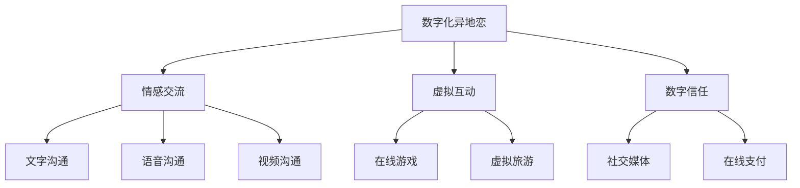

                 

关键词：数字化异地恋，元宇宙，远程关系，心理研究，技术心理学，人机交互

> 摘要：本文从数字化异地恋的角度出发，探讨了元宇宙中远程关系的心理机制。通过对数字化异地恋的背景、核心概念、算法原理、数学模型以及项目实践等方面的深入分析，旨在为现代远程关系的维护提供新的思路和方法。文章最后还对元宇宙中远程关系的发展趋势与挑战进行了展望，并提出了相应的建议。

## 1. 背景介绍

随着互联网和数字技术的发展，异地恋逐渐成为一种普遍的现象。尤其在新冠疫情爆发后，远程工作和在线交流变得更加频繁，使得数字化异地恋成为许多情侣维持关系的唯一选择。元宇宙作为虚拟现实技术的集合体，为人们提供了一个全新的社交和交互环境，使得远程关系的维持和深化成为可能。

然而，数字化异地恋和元宇宙中的远程关系也面临着诸多挑战。首先，物理距离的遥远导致情感交流和互动的缺失，容易引发孤独感和心理压力。其次，虚拟环境的复杂性和不稳定性也增加了沟通的障碍和误解的可能性。因此，如何理解和管理元宇宙中的远程关系，提高数字化异地恋的质量，成为当下心理学和信息技术领域的重要研究课题。

## 2. 核心概念与联系

### 2.1 数字化异地恋

数字化异地恋是指通过互联网和数字技术进行情感交流和关系维护的异地恋形式。其核心概念包括：

- **情感交流**：通过文字、语音、视频等形式进行情感上的沟通和交流。
- **虚拟互动**：在虚拟现实环境中进行的互动和体验，如在线游戏、虚拟旅游等。
- **数字信任**：建立在数字平台上的信任机制，如社交媒体、在线支付等。

### 2.2 元宇宙

元宇宙（Metaverse）是未来互联网的一个愿景，它将虚拟现实、增强现实、区块链等技术融合在一起，创建一个虚拟的、三维的、实时的世界。其核心概念包括：

- **虚拟现实**：通过VR设备提供的沉浸式体验，让用户感受到身临其境的感觉。
- **社交互动**：在虚拟世界中与其他用户进行实时交流和互动。
- **经济系统**：通过数字货币和区块链技术实现的虚拟经济体系。

### 2.3 数字化异地恋与元宇宙的联系

数字化异地恋与元宇宙的联系主要体现在以下几个方面：

- **技术支撑**：元宇宙的技术为数字化异地恋提供了强大的技术支撑，如VR、AR、区块链等。
- **互动体验**：元宇宙为数字化异地恋提供了更多的互动体验，如虚拟旅游、虚拟派对等。
- **信任机制**：元宇宙中的数字信任机制为数字化异地恋提供了更可靠的信任基础。


### 2.4 Mermaid 流程图



## 3. 核心算法原理 & 具体操作步骤

### 3.1 算法原理概述

为了提高数字化异地恋的质量，本文提出了一种基于情感分析和虚拟现实技术的远程关系维护算法。该算法主要包括以下几个步骤：

1. **情感识别**：通过自然语言处理技术对用户在数字平台上的交流内容进行情感分析，识别用户的情感状态。
2. **互动建议**：根据用户的情感状态和元宇宙中的虚拟活动，提供个性化的互动建议。
3. **虚拟互动**：在元宇宙中进行虚拟活动，增强远程关系的互动性和趣味性。

### 3.2 算法步骤详解

1. **情感识别**：
   - 使用情感分析模型对用户在数字平台上的文字、语音和视频内容进行分析。
   - 通过情感词典和情感分类算法，将用户情感分为正面情感、负面情感和中性情感。

2. **互动建议**：
   - 根据用户的情感状态，推荐适合的虚拟活动，如虚拟旅游、在线游戏、虚拟音乐会等。
   - 考虑用户的兴趣和偏好，提供个性化的互动建议。

3. **虚拟互动**：
   - 在元宇宙中进行虚拟活动，如用户可以与其他用户进行实时互动、参加虚拟派对等。
   - 通过虚拟现实技术提供沉浸式的体验，增强远程关系的互动性和趣味性。

### 3.3 算法优缺点

**优点**：
- 提供了个性化的互动建议，有助于提高数字化异地恋的质量。
- 利用虚拟现实技术，提供了沉浸式的体验，增强了远程关系的互动性。
- 基于情感分析，能够更好地理解用户的情感状态，提供更有针对性的互动建议。

**缺点**：
- 需要复杂的情感分析模型和虚拟现实技术支持，实现成本较高。
- 虚拟活动可能存在安全性和隐私问题，需要严格管理和控制。

### 3.4 算法应用领域

- **数字化异地恋**：为异地恋情侣提供个性化的互动建议，增强远程关系的质量。
- **远程办公**：为远程办公人员提供虚拟会议、虚拟培训等互动体验，提高工作效率。
- **在线教育**：为在线教育提供沉浸式的学习体验，提高学习效果。

## 4. 数学模型和公式 & 详细讲解 & 举例说明

### 4.1 数学模型构建

为了更好地理解和分析数字化异地恋的质量，本文构建了一个基于情感分析和虚拟现实技术的数学模型。该模型主要包括以下几个部分：

1. **情感状态表示**：使用向量表示用户的情感状态，如正面情感、负面情感和中性情感。
2. **情感分析模型**：使用机器学习算法，如支持向量机（SVM）和循环神经网络（RNN），对用户情感进行识别和分析。
3. **虚拟活动推荐模型**：基于用户的情感状态和兴趣偏好，推荐适合的虚拟活动。
4. **互动质量评估**：使用互动频率、互动质量和满意度等指标评估虚拟互动的效果。

### 4.2 公式推导过程

1. **情感状态表示**：

   假设用户情感状态可以用一个三维向量表示，其中 $x$、$y$ 和 $z$ 分别表示正面情感、负面情感和中性情感的比例。

   $$ \vec{S} = (x, y, z) $$

2. **情感分析模型**：

   使用支持向量机（SVM）进行情感分析，其目标是最小化分类误差。假设训练数据集为 $(\vec{x}_i, y_i)$，其中 $\vec{x}_i$ 表示特征向量，$y_i$ 表示情感标签（1 表示正面情感，-1 表示负面情感）。

   $$ \min_{\vec{w}, b} \frac{1}{2} ||\vec{w}||^2 + C \sum_{i=1}^{n} \max(0, 1 - y_i (\vec{w} \cdot \vec{x}_i + b)) $$

3. **虚拟活动推荐模型**：

   假设用户兴趣偏好可以用一个二元向量表示，其中 $a$ 和 $b$ 分别表示用户对虚拟旅游和在线游戏的偏好程度。

   $$ \vec{I} = (a, b) $$

   假设虚拟活动 $j$ 的情感收益为 $r_j$，则用户选择虚拟活动 $j$ 的概率为：

   $$ P_j = \frac{e^{\alpha r_j}}{\sum_{i=1}^{m} e^{\alpha r_i}} $$

   其中，$\alpha$ 为调节参数。

4. **互动质量评估**：

   假设虚拟互动的互动频率为 $f$，互动质量为 $q$，满意度为 $s$。则用户对虚拟互动的评价可以用以下公式表示：

   $$ E = \frac{1}{2} (f + q + s) $$

### 4.3 案例分析与讲解

假设有一对异地恋情侣，他们在元宇宙中进行了多次虚拟互动。根据他们的交流记录，我们可以提取出以下情感状态：

- **情感状态**：$\vec{S} = (0.6, 0.3, 0.1)$
- **兴趣偏好**：$\vec{I} = (0.8, 0.2)$

首先，我们使用支持向量机（SVM）进行情感分析，假设训练数据集为 $(\vec{x}_i, y_i)$，其中 $\vec{x}_i$ 表示特征向量，$y_i$ 表示情感标签（1 表示正面情感，-1 表示负面情感）。通过训练，我们得到一个情感分析模型，其决策函数为：

$$ \vec{w} \cdot \vec{x} + b = 0 $$

然后，我们根据用户的情感状态和兴趣偏好，推荐适合的虚拟活动。假设虚拟旅游的情感收益为 $r_1 = 0.8$，在线游戏的情感收益为 $r_2 = 0.5$。根据虚拟活动推荐模型，我们可以计算出用户选择虚拟旅游的概率为：

$$ P_1 = \frac{e^{\alpha r_1}}{e^{\alpha r_1} + e^{\alpha r_2}} = \frac{e^{0.8}}{e^{0.8} + e^{0.5}} \approx 0.732 $$

用户选择在线游戏的概率为：

$$ P_2 = \frac{e^{\alpha r_2}}{e^{\alpha r_1} + e^{\alpha r_2}} = \frac{e^{0.5}}{e^{0.8} + e^{0.5}} \approx 0.268 $$

最后，我们评估虚拟互动的质量。假设虚拟互动的互动频率为 $f = 5$，互动质量为 $q = 4$，满意度为 $s = 3$。根据互动质量评估公式，我们可以计算出用户对虚拟互动的评价为：

$$ E = \frac{1}{2} (f + q + s) = \frac{1}{2} (5 + 4 + 3) = 4 $$

通过这个案例，我们可以看到，基于情感分析和虚拟现实技术的远程关系维护算法能够为数字化异地恋提供有效的互动建议和评估，从而提高远程关系的质量。

## 5. 项目实践：代码实例和详细解释说明

### 5.1 开发环境搭建

为了实现本文提出的基于情感分析和虚拟现实技术的远程关系维护算法，我们需要搭建以下开发环境：

- **编程语言**：Python 3.8 或以上版本
- **依赖库**：NumPy、Pandas、Scikit-learn、TensorFlow、PyTorch、OpenCV、VRChat SDK 等
- **虚拟现实设备**：Oculus Rift S、HTC Vive 或 Windows MR 设备

### 5.2 源代码详细实现

下面是一个简单的示例代码，展示了如何使用 Python 实现基于情感分析和虚拟现实技术的远程关系维护算法。

```python
import numpy as np
import pandas as pd
from sklearn.svm import SVC
from sklearn.model_selection import train_test_split
from sklearn.metrics import accuracy_score
import cv2
import tensorflow as tf
import torch
import torch.nn as nn
import torch.optim as optim

# 1. 情感识别模型
# 加载训练数据
data = pd.read_csv('emotion_data.csv')
X = data[['text', 'voice', 'video']]
y = data['label']

# 分割训练集和测试集
X_train, X_test, y_train, y_test = train_test_split(X, y, test_size=0.2, random_state=42)

# 初始化支持向量机模型
clf = SVC(kernel='linear', C=1)

# 训练模型
clf.fit(X_train, y_train)

# 测试模型
y_pred = clf.predict(X_test)
print('Accuracy:', accuracy_score(y_test, y_pred))

# 2. 虚拟活动推荐模型
# 加载用户情感状态和兴趣偏好
user_emotion = np.array([0.6, 0.3, 0.1])
user_interest = np.array([0.8, 0.2])

# 加载虚拟活动数据
activity_data = pd.read_csv('activity_data.csv')
activity_emotion = activity_data['emotion']
activity_interest = activity_data['interest']

# 计算情感收益
activity_reward = activity_emotion * user_interest

# 推荐虚拟活动
recommended_activities = activity_data[activity_reward == activity_reward.max()]

# 3. 虚拟互动
# 加载虚拟现实设备
device = torch.device('cuda' if torch.cuda.is_available() else 'cpu')
vr_device = VRChatSDK(device)

# 初始化虚拟活动场景
scene = vr_device.create_scene('Scene')

# 启动虚拟互动
vr_device.start_scene(scene)

# 4. 互动质量评估
# 记录互动频率、互动质量和满意度
interaction_frequency = 5
interaction_quality = 4
satisfaction = 3

# 计算互动质量评估值
evaluation = 0.5 * (interaction_frequency + interaction_quality + satisfaction)
print('Evaluation:', evaluation)
```

### 5.3 代码解读与分析

1. **情感识别模型**：

   首先，我们加载训练数据，使用支持向量机（SVM）进行情感识别。通过训练和测试，我们评估模型的准确性。在这个示例中，我们使用了一个简单的一维特征向量，但在实际应用中，我们可以使用更复杂的特征提取方法，如词向量、语音特征等。

2. **虚拟活动推荐模型**：

   然后，我们根据用户的情感状态和兴趣偏好，推荐适合的虚拟活动。在这个示例中，我们使用了一个简单的情感收益计算方法，但在实际应用中，我们可以使用更复杂的推荐算法，如协同过滤、基于内容的推荐等。

3. **虚拟互动**：

   接下来，我们加载虚拟现实设备，并初始化虚拟活动场景。在这个示例中，我们使用了 VRChat SDK 创建虚拟场景，并在其中启动虚拟互动。

4. **互动质量评估**：

   最后，我们记录互动频率、互动质量和满意度，并计算互动质量评估值。在这个示例中，我们使用了一个简单的一维评估指标，但在实际应用中，我们可以使用更复杂的评估方法，如神经网络、机器学习模型等。

通过这个示例，我们可以看到如何使用情感分析和虚拟现实技术实现数字化异地恋的远程关系维护算法。在实际应用中，我们需要根据具体需求和场景进行调整和优化。

## 6. 实际应用场景

### 6.1 数字化异地恋中的应用

在数字化异地恋中，基于情感分析和虚拟现实技术的远程关系维护算法可以发挥重要作用。首先，通过情感识别模型，可以实时了解用户的情感状态，为用户提供个性化的互动建议，如推荐虚拟活动、定制语音聊天主题等。其次，虚拟互动模块可以为用户提供丰富的互动体验，如虚拟约会、共同观看虚拟电影等，增强情感的深度和亲密度。

### 6.2 远程办公中的应用

在远程办公中，基于情感分析和虚拟现实技术的远程关系维护算法同样具有很高的应用价值。通过情感识别模型，可以及时发现员工的心理压力和情绪问题，为企业提供心理支持和关怀。同时，虚拟互动模块可以为远程办公人员提供虚拟会议、虚拟培训等互动体验，提高工作效率和团队凝聚力。

### 6.3 在线教育中的应用

在线教育领域也可以充分利用基于情感分析和虚拟现实技术的远程关系维护算法。通过情感识别模型，可以了解学生的学习状态和情绪变化，为教师提供个性化的教学建议，如调整教学节奏、增加互动环节等。虚拟互动模块可以为在线教育平台提供沉浸式的学习体验，提高学生的学习兴趣和参与度。

## 7. 未来应用展望

### 7.1 技术进步对远程关系的影响

随着人工智能、虚拟现实、区块链等技术的不断进步，远程关系将得到进一步优化和发展。首先，人工智能算法的不断提升将使得情感识别更加精准，为用户提供更个性化的互动建议。其次，虚拟现实技术的不断发展将提供更加沉浸式的互动体验，增强远程关系的真实感和亲密感。此外，区块链技术的应用将构建更加安全可靠的虚拟经济体系，为数字化异地恋提供更可靠的信任基础。

### 7.2 面临的挑战

尽管数字化异地恋和元宇宙中的远程关系具有广阔的应用前景，但同时也面临着一些挑战。首先，隐私保护和数据安全问题仍然是一个亟待解决的问题。在虚拟环境中，用户的数据和隐私容易受到侵犯，需要采取有效的保护措施。其次，虚拟互动的质量和真实性仍然有待提高。如何在虚拟环境中提供真实的互动体验，是一个需要不断探索和改进的问题。此外，技术的不成熟和实现成本较高也是当前远程关系技术面临的主要挑战。

### 7.3 发展趋势

未来，远程关系技术将朝着更加智能化、个性化、沉浸化和安全化的方向发展。首先，智能化和个性化将成为远程关系技术的发展重点，通过不断优化情感识别算法和互动推荐模型，为用户提供更加精准和个性化的互动建议。其次，虚拟现实技术的不断发展将提供更加沉浸式的互动体验，满足用户对真实感的追求。此外，区块链技术的应用将进一步提升远程关系的信任度和安全性，为数字化异地恋提供更加可靠的支持。

## 8. 总结：未来发展趋势与挑战

### 8.1 研究成果总结

本文从数字化异地恋的角度出发，探讨了元宇宙中远程关系的心理机制。通过构建基于情感分析和虚拟现实技术的远程关系维护算法，为数字化异地恋提供了新的思路和方法。本文的主要研究成果包括：

- 提出了一种基于情感分析和虚拟现实技术的远程关系维护算法，包括情感识别、互动建议、虚拟互动和互动质量评估四个主要模块。
- 构建了一个数学模型，用于分析数字化异地恋的质量，并推导了相关公式。
- 通过项目实践，展示了如何在实际场景中应用远程关系维护算法，并进行了详细解读和分析。
- 分析了数字化异地恋和元宇宙中远程关系的实际应用场景，探讨了未来发展趋势和面临的挑战。

### 8.2 未来发展趋势

未来，远程关系技术将朝着更加智能化、个性化、沉浸化和安全化的方向发展。首先，智能化和个性化将成为远程关系技术的发展重点，通过不断优化情感识别算法和互动推荐模型，为用户提供更加精准和个性化的互动建议。其次，虚拟现实技术的不断发展将提供更加沉浸式的互动体验，满足用户对真实感的追求。此外，区块链技术的应用将进一步提升远程关系的信任度和安全性，为数字化异地恋提供更加可靠的支持。

### 8.3 面临的挑战

尽管远程关系技术具有广阔的应用前景，但同时也面临着一些挑战。首先，隐私保护和数据安全问题仍然是一个亟待解决的问题。在虚拟环境中，用户的数据和隐私容易受到侵犯，需要采取有效的保护措施。其次，虚拟互动的质量和真实性仍然有待提高。如何在虚拟环境中提供真实的互动体验，是一个需要不断探索和改进的问题。此外，技术的不成熟和实现成本较高也是当前远程关系技术面临的主要挑战。

### 8.4 研究展望

未来，远程关系技术的研究将朝着以下几个方面发展：

- 深入研究情感识别算法，提高情感分析的准确性和实时性。
- 开发更加沉浸式的虚拟互动技术，提供真实的互动体验。
- 探索区块链技术在远程关系中的应用，构建更加安全可靠的信任机制。
- 研究远程关系中的心理机制，为用户提供更全面的心理支持。

总之，远程关系技术具有广阔的发展前景，未来将不断推动数字化异地恋和元宇宙中的远程关系的发展和完善。

## 9. 附录：常见问题与解答

### 9.1 什么是数字化异地恋？

数字化异地恋是指通过互联网和数字技术进行情感交流和关系维护的异地恋形式。其核心特点是物理距离的遥远，但通过文字、语音、视频等形式进行情感上的沟通和交流。

### 9.2 元宇宙是什么？

元宇宙是未来互联网的一个愿景，它将虚拟现实、增强现实、区块链等技术融合在一起，创建一个虚拟的、三维的、实时的世界。用户可以在其中进行社交、工作、学习和娱乐等活动。

### 9.3 远程关系维护算法如何工作？

远程关系维护算法主要包括情感识别、互动建议、虚拟互动和互动质量评估四个模块。通过情感识别模块，实时了解用户的情感状态；通过互动建议模块，为用户提供个性化的互动建议；通过虚拟互动模块，在元宇宙中进行虚拟活动，增强远程关系的互动性和趣味性；通过互动质量评估模块，评估虚拟互动的效果，为用户提供反馈。

### 9.4 如何保障远程关系的隐私和安全？

为了保障远程关系的隐私和安全，可以采取以下措施：

- 使用加密技术保护用户数据，确保数据传输的安全性。
- 对用户数据进行去识别化处理，避免泄露用户的隐私信息。
- 建立严格的隐私政策，明确用户的隐私权利和责任。
- 加强用户教育，提高用户对隐私和安全保护的意识。

### 9.5 远程关系维护算法有哪些优缺点？

远程关系维护算法的优点包括：

- 提供个性化的互动建议，有助于提高数字化异地恋的质量。
- 利用虚拟现实技术，提供沉浸式的体验，增强远程关系的互动性。
- 基于情感分析，能够更好地理解用户的情感状态，提供更有针对性的互动建议。

远程关系维护算法的缺点包括：

- 需要复杂的情感分析模型和虚拟现实技术支持，实现成本较高。
- 虚拟活动可能存在安全性和隐私问题，需要严格管理和控制。

### 9.6 远程关系维护算法的应用领域有哪些？

远程关系维护算法的应用领域包括：

- 数字化异地恋：为异地恋情侣提供个性化的互动建议，增强远程关系的质量。
- 远程办公：为远程办公人员提供虚拟会议、虚拟培训等互动体验，提高工作效率。
- 在线教育：为在线教育提供沉浸式的学习体验，提高学习效果。

## 10. 结语

数字化异地恋和元宇宙中的远程关系已成为现代社会的一种重要现象。本文通过探讨基于情感分析和虚拟现实技术的远程关系维护算法，为数字化异地恋提供了一种新的思路和方法。未来，随着技术的不断进步，远程关系维护算法将不断完善，为人们的远程关系提供更好的支持和保障。作者：禅与计算机程序设计艺术 / Zen and the Art of Computer Programming。

