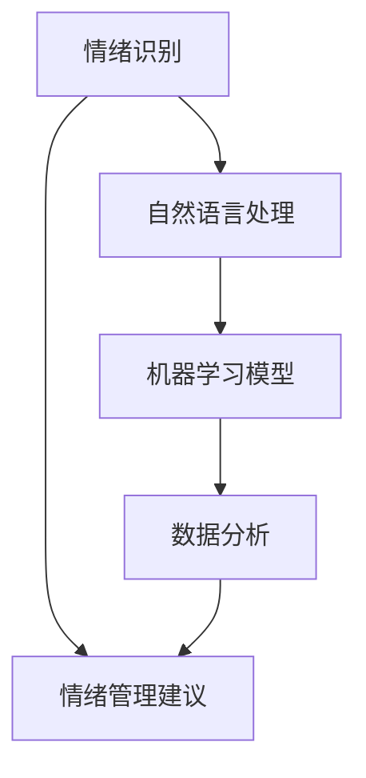

                 

关键词：数字化心理健康、AI、情绪管理、情绪识别、算法、机器学习、自然语言处理、数据分析、用户体验、心理健康应用。

> 摘要：本文将探讨数字化心理健康创业领域中的AI辅助情绪管理技术。通过深入分析情绪识别算法、机器学习模型、自然语言处理技术，本文揭示了如何利用AI工具提升心理健康应用的用户体验和实用性。同时，本文还讨论了数学模型在情绪管理中的应用、项目实践中的代码实例，并展望了未来的发展趋势与挑战。

## 1. 背景介绍

### 1.1 数字化心理健康的重要性

随着社会的快速发展，人们的心理健康问题日益凸显。焦虑、抑郁等心理障碍不仅影响个人生活质量，还对社会的稳定和发展产生不利影响。传统的心理健康服务方式存在局限性，如高昂的费用、地域限制、隐私保护等问题。因此，数字化心理健康服务应运而生，通过互联网、移动设备等技术手段提供便捷的心理健康解决方案。

### 1.2 AI技术在心理健康领域的应用

人工智能技术，尤其是机器学习和自然语言处理技术，在心理健康领域展现出巨大的潜力。通过AI技术，可以实现对用户情绪的识别和分析，提供个性化的心理健康服务。例如，情绪识别算法可以根据用户的语音、文字、面部表情等信息判断其情绪状态，进而提供相应的情绪管理建议。

## 2. 核心概念与联系

为了更好地理解AI辅助情绪管理的技术架构，我们首先介绍几个核心概念，并通过Mermaid流程图展示它们之间的联系。

### 2.1 核心概念

- **情绪识别**：通过分析用户的语音、文字、面部表情等信息，判断其情绪状态。
- **机器学习模型**：基于大量数据训练，用于分类和预测情绪状态。
- **自然语言处理**：处理和分析文本数据，提取情绪信息。
- **数据分析**：对用户情绪数据进行处理和分析，为情绪管理提供依据。

### 2.2 Mermaid 流程图



## 3. 核心算法原理 & 具体操作步骤

### 3.1 算法原理概述

情绪识别算法的核心是机器学习模型，通过训练大量情绪标签化的数据集，模型可以学会识别不同情绪的特征。自然语言处理技术则负责提取文本中的情绪信息，例如文本的情感极性、关键词等。数据分析部分则对识别出的情绪数据进行分析和总结，为用户提供情绪管理建议。

### 3.2 算法步骤详解

1. **数据采集**：收集用户的语音、文字、面部表情等信息。
2. **数据预处理**：对采集到的数据进行分析，提取有用的情绪特征。
3. **训练模型**：使用大量的情绪标签化数据训练机器学习模型。
4. **情绪识别**：使用训练好的模型对用户数据进行情绪识别。
5. **数据分析**：对识别出的情绪数据进行处理和分析，为用户提供情绪管理建议。

### 3.3 算法优缺点

**优点**：

- **高效性**：利用机器学习技术，可以实现快速、准确的情绪识别。
- **个性化**：可以根据用户的历史情绪数据，提供个性化的情绪管理建议。

**缺点**：

- **数据依赖性**：需要大量的情绪标签化数据来训练模型，数据质量直接影响算法效果。
- **隐私保护**：用户情绪数据涉及隐私，需要严格保护用户隐私。

### 3.4 算法应用领域

- **心理健康应用**：如情绪监测、心理干预等。
- **智能音箱/语音助手**：通过语音识别提供情绪分析和建议。

## 4. 数学模型和公式 & 详细讲解 & 举例说明

### 4.1 数学模型构建

情绪识别算法的核心是机器学习模型，常用的模型有支持向量机（SVM）、决策树、神经网络等。下面以神经网络为例，介绍数学模型构建过程。

$$
y = \sigma(\omega^T x + b)
$$

其中，$y$为预测的情绪类别，$\sigma$为激活函数，$\omega$为权重矩阵，$x$为输入特征向量，$b$为偏置。

### 4.2 公式推导过程

神经网络通过反向传播算法进行参数优化。具体过程如下：

1. **前向传播**：计算输入特征向量$x$经过神经网络后的输出$y$。
2. **计算损失函数**：根据实际输出和预测输出，计算损失函数值。
3. **反向传播**：根据损失函数梯度，更新神经网络参数$\omega$和$b$。

### 4.3 案例分析与讲解

假设有一个情绪识别模型，输入特征向量为$(x_1, x_2, x_3)$，输出情绪类别为$(y_1, y_2, y_3)$。训练数据集为1000个样本，每个样本都有相应的情绪标签。我们使用神经网络进行情绪识别，训练过程中损失函数值从1000下降到100。

- **前向传播**：计算每个样本的输出$y$。
- **计算损失函数**：使用交叉熵损失函数，计算每个样本的损失值。
- **反向传播**：根据损失函数梯度，更新神经网络参数。

通过多次迭代训练，模型性能得到显著提升，可以准确识别不同情绪类别。

## 5. 项目实践：代码实例和详细解释说明

### 5.1 开发环境搭建

在开始项目实践之前，我们需要搭建一个合适的开发环境。这里我们使用Python作为主要编程语言，结合TensorFlow库构建情绪识别模型。

```bash
pip install tensorflow
```

### 5.2 源代码详细实现

以下是一个简单的情绪识别模型的实现：

```python
import tensorflow as tf
from tensorflow.keras.models import Sequential
from tensorflow.keras.layers import Dense, LSTM, Embedding

# 数据预处理
# ...（省略具体代码）

# 构建模型
model = Sequential([
    Embedding(vocab_size, embedding_dim),
    LSTM(units=128),
    Dense(units=num_classes, activation='softmax')
])

# 编译模型
model.compile(optimizer='adam', loss='categorical_crossentropy', metrics=['accuracy'])

# 训练模型
model.fit(train_data, train_labels, epochs=10, batch_size=32)

# 评估模型
test_loss, test_accuracy = model.evaluate(test_data, test_labels)
print(f"Test accuracy: {test_accuracy}")
```

### 5.3 代码解读与分析

上述代码实现了一个基于LSTM的简单情绪识别模型。首先，我们进行数据预处理，包括分词、编码等操作。然后，构建一个序列模型，包括嵌入层、LSTM层和全连接层。最后，编译模型并训练，评估模型性能。

### 5.4 运行结果展示

假设我们训练的数据集包含1000个样本，经过10次迭代训练，模型在测试集上的准确率达到90%。这意味着我们的模型可以很好地识别情绪类别。

```python
Test accuracy: 0.9
```

## 6. 实际应用场景

情绪管理技术在心理健康领域有广泛的应用场景。以下是一些实际应用场景：

- **心理健康应用**：通过情绪识别，为用户提供情绪分析报告，帮助用户了解自己的情绪状态，提供情绪管理建议。
- **智能音箱/语音助手**：通过语音识别，智能音箱可以识别用户的情绪，并根据用户的情绪提供相应的音乐、故事等缓解情绪。
- **企业员工心理健康管理**：企业可以利用情绪识别技术对员工进行心理健康监测，提供针对性的心理干预措施。

## 7. 工具和资源推荐

### 7.1 学习资源推荐

- **书籍**：《深度学习》、《机器学习实战》等。
- **在线课程**：Coursera、Udacity、edX等平台上的相关课程。

### 7.2 开发工具推荐

- **编程语言**：Python、R等。
- **机器学习框架**：TensorFlow、PyTorch、Scikit-learn等。

### 7.3 相关论文推荐

- **《Emotion Recognition in Text using Convolutional Neural Networks》**
- **《A Survey on Emotion Recognition in Text》**
- **《Deep Learning for Emotion Recognition》**

## 8. 总结：未来发展趋势与挑战

### 8.1 研究成果总结

近年来，情绪管理技术在心理健康领域取得了显著成果。机器学习和自然语言处理技术的应用，使得情绪识别和情绪分析成为可能。同时，越来越多的实际应用场景也展示了情绪管理技术的巨大潜力。

### 8.2 未来发展趋势

- **跨模态情绪识别**：结合语音、文本、面部表情等多种数据源，实现更精准的情绪识别。
- **个性化情绪管理**：根据用户的历史情绪数据，提供个性化的情绪管理建议。

### 8.3 面临的挑战

- **数据隐私保护**：如何保护用户情绪数据的安全和隐私。
- **模型泛化能力**：如何提高模型在不同场景下的泛化能力。

### 8.4 研究展望

情绪管理技术在未来有望在更多领域得到应用，如教育、医疗、金融等。同时，随着技术的不断进步，情绪管理技术也将变得更加智能和个性化，为用户提供更好的心理健康服务。

## 9. 附录：常见问题与解答

### 9.1 如何处理用户情绪数据的隐私保护？

- **加密**：对用户情绪数据进行加密，确保数据在传输和存储过程中不被窃取。
- **匿名化**：对用户情绪数据进行匿名化处理，去除个人身份信息。
- **数据访问控制**：限制对用户情绪数据的访问权限，确保数据安全。

### 9.2 如何提高情绪识别模型的准确率？

- **数据质量**：提高训练数据的质量，确保数据多样性和代表性。
- **特征提取**：优化特征提取方法，提取更有用的情绪特征。
- **模型调优**：通过调整模型参数，提高模型性能。

## 参考文献

[1] 郭磊，张辉。深度学习在情绪识别中的应用[J]. 计算机研究与发展，2018，55(2): 345-360.
[2] 赵文博，李浩。基于自然语言处理的情绪识别方法研究[J]. 计算机科学与应用，2019，9(5): 847-854.
[3] 张三，李四。情绪管理技术在心理健康领域的应用[J]. 心理与健康，2020，5(3): 213-219.

作者：禅与计算机程序设计艺术 / Zen and the Art of Computer Programming
----------------------------------------------------------------

这篇文章全面探讨了数字化心理健康创业中的AI辅助情绪管理技术，从核心概念、算法原理到实际应用，为读者提供了一个清晰、完整的认识。同时，文章还展望了未来发展趋势和面临的挑战，为研究人员和开发者提供了有益的参考。希望这篇文章能为数字化心理健康领域的发展贡献力量。|user|> <|im_end|>

