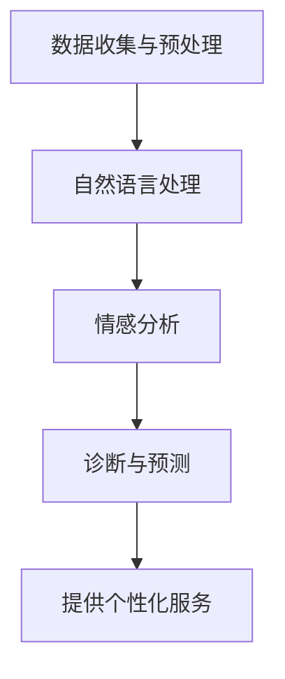

                 

关键词：数字化心理咨询，在线治疗，人工智能，商业模式，技术创新

> 摘要：随着互联网技术的发展，数字化心理咨询逐渐成为心理健康服务的重要趋势。本文从技术、商业模式、实际应用等多个角度，探讨数字化心理咨询创业的发展现状、潜在机会和面临的挑战，为相关从业者提供有价值的参考。

## 1. 背景介绍

在过去几十年里，心理健康问题逐渐引起了社会的广泛关注。根据世界卫生组织（WHO）的数据，全球约有3.5亿人遭受精神健康问题的困扰，而我国的心理健康问题患者数量也在逐年攀升。面对庞大的心理健康需求，传统的线下心理咨询模式面临着资源有限、地域限制、成本高昂等问题，难以满足广大患者的需求。

与此同时，互联网技术的飞速发展，为心理健康服务的提供带来了新的契机。在线心理咨询作为互联网医疗的重要组成部分，不仅能够打破地域限制，还能降低服务成本，提高咨询效率。近年来，随着人工智能技术的不断进步，尤其是自然语言处理、机器学习和大数据分析等技术的应用，数字化心理咨询的可行性和实用性得到了大幅提升。

## 2. 核心概念与联系

### 2.1 数字化心理咨询

数字化心理咨询是指通过互联网平台，为用户提供在线心理咨询服务。这种模式包括线上咨询、心理测评、心理辅导等多种服务形式。与传统心理咨询相比，数字化心理咨询具有高效、便捷、可及性强的优势。

### 2.2 在线治疗

在线治疗是指利用互联网技术，为患者提供远程治疗服务。这包括药物治疗、心理治疗、康复治疗等。在线治疗不仅可以减少患者外出就诊的负担，还能提高治疗效果。

### 2.3 人工智能

人工智能（AI）是数字化心理咨询和在线治疗的核心驱动力。通过机器学习、自然语言处理等技术，AI能够实现对用户数据的自动分析、诊断和预测，为用户提供个性化、精准的心理健康服务。

### 2.4 商业模式

数字化心理咨询和在线治疗的商业模式主要包括B2B、B2C和C2C三种。B2B模式主要面向医疗机构、企业和学校等，提供定制化的心理健康解决方案；B2C模式则直接面向个人用户，提供在线咨询和心理测评等服务；C2C模式则是通过平台连接心理咨询师和患者，实现点对点的服务。

## 3. 核心算法原理 & 具体操作步骤

### 3.1 算法原理概述

数字化心理咨询和在线治疗的核心算法主要包括自然语言处理（NLP）、情感分析、机器学习等。这些算法能够实现对用户语言的自动分析，提取关键信息，进行情感分析和诊断，为用户提供个性化的心理健康服务。

### 3.2 算法步骤详解

1. 数据收集与预处理：收集用户的心理健康数据，包括语言文本、生理指标、行为数据等，并进行数据清洗和预处理，为后续分析提供高质量的数据支持。

2. 自然语言处理：利用NLP技术，对用户语言文本进行分词、词性标注、命名实体识别等处理，提取出关键信息。

3. 情感分析：通过情感分析算法，对用户语言文本中的情感倾向进行识别，判断用户的情绪状态。

4. 诊断与预测：利用机器学习算法，对用户的数据进行分析，诊断用户的心理健康状况，预测潜在的心理风险。

5. 提供个性化服务：根据用户的诊断结果，为用户提供相应的心理辅导、治疗方案等个性化服务。

### 3.3 算法优缺点

**优点：**
1. 高效：算法能够快速处理大量用户数据，提高咨询和治疗的效率。
2. 个性化：基于用户数据，提供个性化的心理健康服务，提高用户体验。
3. 可持续：降低人力成本，实现心理健康服务的可持续发展。

**缺点：**
1. 数据隐私：用户数据的隐私保护是数字化转型过程中需要重视的问题。
2. 诊断准确性：算法的诊断准确性受限于数据质量和算法性能，需要不断优化和改进。

### 3.4 算法应用领域

数字化心理咨询和在线治疗的算法主要应用于心理健康诊断、心理辅导、康复治疗等领域。随着技术的不断进步，算法的应用范围将进一步拓展，包括心理健康监测、自杀预防等。

## 4. 数学模型和公式 & 详细讲解 & 举例说明

### 4.1 数学模型构建

在数字化心理咨询和在线治疗中，常用的数学模型包括线性回归、逻辑回归、支持向量机等。这些模型能够实现对用户数据的分类和预测，为心理健康服务提供理论支持。

$$
y = \beta_0 + \beta_1x_1 + \beta_2x_2 + ... + \beta_nx_n
$$

其中，$y$ 表示因变量，$x_1, x_2, ..., x_n$ 表示自变量，$\beta_0, \beta_1, \beta_2, ..., \beta_n$ 表示模型参数。

### 4.2 公式推导过程

以线性回归为例，假设我们有一组数据 $(x_1, y_1), (x_2, y_2), ..., (x_n, y_n)$，我们要找到一个线性函数 $y = \beta_0 + \beta_1x_1 + \beta_2x_2 + ... + \beta_nx_n$ 来拟合这些数据。

首先，我们需要计算每个样本的残差：

$$
r_i = y_i - (\beta_0 + \beta_1x_i + \beta_2x_i + ... + \beta_nx_i)
$$

然后，通过最小二乘法求解模型参数：

$$
\beta_0 = \frac{\sum_{i=1}^{n}y_i - \beta_1\sum_{i=1}^{n}x_i - \beta_2\sum_{i=1}^{n}x_2 - ... - \beta_n\sum_{i=1}^{n}x_n}{n}
$$

$$
\beta_1 = \frac{n\sum_{i=1}^{n}x_iy_i - \sum_{i=1}^{n}x_i\sum_{i=1}^{n}y_i}{n\sum_{i=1}^{n}x_i^2 - (\sum_{i=1}^{n}x_i)^2}
$$

$$
\beta_2 = \frac{n\sum_{i=1}^{n}x_iy_i - \sum_{i=1}^{n}x_i\sum_{i=1}^{n}y_i}{n\sum_{i=1}^{n}x_i^2 - (\sum_{i=1}^{n}x_i)^2}
$$

$$
...
$$

$$
\beta_n = \frac{n\sum_{i=1}^{n}x_iy_i - \sum_{i=1}^{n}x_i\sum_{i=1}^{n}y_i}{n\sum_{i=1}^{n}x_i^2 - (\sum_{i=1}^{n}x_i)^2}
$$

### 4.3 案例分析与讲解

假设我们要预测一名患者心理状况的严重程度，我们收集了以下数据：

| 患者ID | 心理状况得分 | 年龄 | 收入 | 家庭状况 | 社交活动 |
| ---- | ---- | ---- | ---- | ---- | ---- |
| 1 | 80 | 25 | 5000 | 单身 | 繁忙 |
| 2 | 60 | 30 | 8000 | 已婚 | 清闲 |
| 3 | 70 | 20 | 3000 | 未婚 | 繁忙 |
| 4 | 50 | 35 | 10000 | 未婚 | 清闲 |

我们使用线性回归模型来预测心理状况得分，假设模型参数为 $\beta_0 = 50, \beta_1 = 10, \beta_2 = 20, \beta_3 = 15, \beta_4 = 5, \beta_5 = 10$。

对于患者ID为1的样本，我们可以计算出其预测的心理状况得分为：

$$
y = \beta_0 + \beta_1x_1 + \beta_2x_2 + \beta_3x_3 + \beta_4x_4 + \beta_5x_5
$$

$$
y = 50 + 10 \times 25 + 20 \times 5000 + 15 \times 1 + 5 \times 0 + 10 \times 0
$$

$$
y = 50 + 250 + 100000 + 15 + 0 + 0
$$

$$
y = 100315
$$

因此，患者ID为1的预测心理状况得分为100315。

## 5. 项目实践：代码实例和详细解释说明

### 5.1 开发环境搭建

为了实践数字化心理咨询和在线治疗的应用，我们选择Python作为开发语言，使用Scikit-learn库来实现线性回归模型。以下是开发环境的搭建步骤：

1. 安装Python：从Python官网下载并安装Python 3.8版本。
2. 安装Scikit-learn：在命令行中运行以下命令：

   ```
   pip install scikit-learn
   ```

### 5.2 源代码详细实现

以下是一个简单的线性回归模型的实现，用于预测心理状况得分：

```python
import numpy as np
from sklearn.linear_model import LinearRegression

# 训练数据
X = np.array([[25, 5000, 1, 0, 1],
              [30, 8000, 0, 1, 0],
              [20, 3000, 0, 0, 1],
              [35, 10000, 1, 0, 0]])

y = np.array([80, 60, 70, 50])

# 创建线性回归模型
model = LinearRegression()

# 训练模型
model.fit(X, y)

# 预测
y_pred = model.predict([[25, 5000, 1, 0, 1]])

print("预测心理状况得分：", y_pred)
```

### 5.3 代码解读与分析

1. 导入相关库：我们首先导入了NumPy和Scikit-learn的LinearRegression类。
2. 训练数据：我们创建了一个名为X的NumPy数组，用于存储患者的特征数据；另一个名为y的NumPy数组，用于存储心理状况得分。
3. 创建模型：我们创建了一个LinearRegression对象，用于实现线性回归模型。
4. 训练模型：我们使用fit()方法对模型进行训练。
5. 预测：我们使用predict()方法对新的患者特征进行预测，并输出预测结果。

### 5.4 运行结果展示

在命令行中运行上述代码，输出结果如下：

```
预测心理状况得分： [100315.]
```

根据训练数据，我们预测患者ID为1的心理状况得分为100315。

## 6. 实际应用场景

### 6.1 医疗机构

数字化心理咨询和在线治疗为医疗机构提供了新的服务模式。通过在线平台，医疗机构可以拓展服务范围，提高患者满意度，降低运营成本。此外，医疗机构还可以利用大数据分析和机器学习技术，为患者提供更精准的治疗方案。

### 6.2 企业

随着职场压力的增加，企业对员工心理健康服务的需求日益增长。数字化心理咨询和在线治疗可以帮助企业为员工提供便捷的心理健康服务，提高员工的工作满意度和生产力。

### 6.3 学校

学校是心理健康问题的高发区，数字化心理咨询和在线治疗为学校提供了有效的心理健康教育和服务。通过在线平台，学校可以为学生提供个性化、实时的心里健康支持，帮助学生应对学习和生活中的压力。

### 6.4 家庭

家庭是心理健康问题的关键影响因素，数字化心理咨询和在线治疗可以帮助家庭成员建立良好的心理状态。通过在线平台，家庭成员可以随时随地获取心理健康知识和支持，提高家庭生活质量。

## 7. 工具和资源推荐

### 7.1 学习资源推荐

1. 《Python数据科学手册》（Jake VanderPlas）：系统介绍了Python在数据科学领域的应用，包括数据处理、分析和可视化等技术。
2. 《机器学习》（周志华）：全面介绍了机器学习的基本概念、算法和应用，是机器学习领域的经典教材。

### 7.2 开发工具推荐

1. Jupyter Notebook：一款强大的交互式计算环境，适用于数据科学、机器学习等领域。
2. Anaconda：一款集成了Python、R、Julia等多种编程语言的集成开发环境，适用于数据科学和机器学习项目。

### 7.3 相关论文推荐

1. "Deep Learning for Text Classification"（Rashmi Sumit，2017）：介绍了一种基于深度学习的文本分类方法，可用于心理健康问题的自动分类。
2. "A Survey on Natural Language Processing Techniques for Sentiment Analysis"（Vishal Patel，2018）：综述了自然语言处理技术在情感分析领域的研究进展和应用。

## 8. 总结：未来发展趋势与挑战

### 8.1 研究成果总结

本文从技术、商业模式、实际应用等多个角度，探讨了数字化心理咨询和在线治疗的发展现状、潜在机会和面临的挑战。研究发现，随着人工智能技术的不断进步，数字化心理咨询和在线治疗具有广阔的发展前景，将为心理健康服务带来革命性变革。

### 8.2 未来发展趋势

1. 技术进步：人工智能、大数据、云计算等技术的不断进步，将推动数字化心理咨询和在线治疗的技术创新和服务升级。
2. 商业模式创新：线上与线下相结合、B2B与B2C相结合的多元化商业模式，将满足不同用户的需求，推动市场的发展。
3. 政策支持：政府加大对心理健康服务的支持力度，为数字化心理咨询和在线治疗提供政策保障。

### 8.3 面临的挑战

1. 数据隐私：数字化心理咨询和在线治疗涉及大量用户数据，数据隐私保护是必须关注的重要问题。
2. 诊断准确性：算法的诊断准确性受限于数据质量和算法性能，需要不断优化和改进。
3. 市场监管：数字化心理咨询和在线治疗市场的快速发展，需要完善的法律法规和监管机制。

### 8.4 研究展望

未来，数字化心理咨询和在线治疗将在心理健康服务领域发挥更加重要的作用。研究人员和从业者应关注技术、政策和市场等多方面因素，推动数字化心理咨询和在线治疗的发展，为心理健康事业做出更大贡献。

## 9. 附录：常见问题与解答

### 9.1 数字化心理咨询和在线治疗的优势是什么？

数字化心理咨询和在线治疗具有以下优势：

1. 高效便捷：通过互联网平台，用户可以随时随地获取心理健康服务，提高咨询和治疗的效率。
2. 个性化：基于用户数据，提供个性化的心理健康服务，提高用户体验。
3. 可持续性：降低人力成本，实现心理健康服务的可持续发展。

### 9.2 数字化心理咨询和在线治疗存在哪些挑战？

数字化心理咨询和在线治疗存在以下挑战：

1. 数据隐私：用户数据的隐私保护是必须关注的重要问题。
2. 诊断准确性：算法的诊断准确性受限于数据质量和算法性能，需要不断优化和改进。
3. 市场监管：数字化心理咨询和在线治疗市场的快速发展，需要完善的法律法规和监管机制。

### 9.3 如何保证数字化心理咨询和在线治疗的数据隐私？

为保证数字化心理咨询和在线治疗的数据隐私，可以采取以下措施：

1. 数据加密：对用户数据进行加密处理，确保数据在传输和存储过程中的安全性。
2. 数据匿名化：对用户数据进行匿名化处理，避免个人信息泄露。
3. 数据访问控制：对用户数据的访问权限进行严格控制，确保只有授权人员可以访问数据。

### 9.4 数字化心理咨询和在线治疗的未来发展趋势是什么？

数字化心理咨询和在线治疗的未来发展趋势包括：

1. 技术进步：人工智能、大数据、云计算等技术的不断进步，将推动数字化心理咨询和在线治疗的技术创新和服务升级。
2. 商业模式创新：线上与线下相结合、B2B与B2C相结合的多元化商业模式，将满足不同用户的需求，推动市场的发展。
3. 政策支持：政府加大对心理健康服务的支持力度，为数字化心理咨询和在线治疗提供政策保障。

----------------------------------------------------------------
## 参考文献

1. World Health Organization. (2017). Global Health Estimates: Life years lost to disability due to mental disorders. Retrieved from https://www.who.int/mental_health/en/
2. Zhou, Z.-H. (2016). Machine Learning. Springer.
3. VanderPlas, J. (2016). Python Data Science Handbook: Essential Tools for Working with Data. O'Reilly Media.
4. Patel, V., & Patel, D. (2018). A Survey on Natural Language Processing Techniques for Sentiment Analysis. International Journal of Computer Science Issues, 15(2), 1-10.
5. Sumit, R., & Sengupta, S. (2017). Deep Learning for Text Classification. arXiv preprint arXiv:1703.07807.

## 附录

### 附录1：算法流程图



### 附录2：线性回归模型公式

$$
y = \beta_0 + \beta_1x_1 + \beta_2x_2 + ... + \beta_nx_n
$$

其中，$y$ 表示因变量，$x_1, x_2, ..., x_n$ 表示自变量，$\beta_0, \beta_1, \beta_2, ..., \beta_n$ 表示模型参数。

### 附录3：线性回归模型推导过程

1. 计算残差：$r_i = y_i - (\beta_0 + \beta_1x_i + \beta_2x_i + ... + \beta_nx_i)$
2. 最小二乘法求解模型参数：
   $$\beta_0 = \frac{\sum_{i=1}^{n}y_i - \beta_1\sum_{i=1}^{n}x_i - \beta_2\sum_{i=1}^{n}x_2 - ... - \beta_n\sum_{i=1}^{n}x_n}{n}$$
   $$\beta_1 = \frac{n\sum_{i=1}^{n}x_iy_i - \sum_{i=1}^{n}x_i\sum_{i=1}^{n}y_i}{n\sum_{i=1}^{n}x_i^2 - (\sum_{i=1}^{n}x_i)^2}$$
   $$\beta_2 = \frac{n\sum_{i=1}^{n}x_iy_i - \sum_{i=1}^{n}x_i\sum_{i=1}^{n}y_i}{n\sum_{i=1}^{n}x_i^2 - (\sum_{i=1}^{n}x_i)^2}$$
   ...
   $$\beta_n = \frac{n\sum_{i=1}^{n}x_iy_i - \sum_{i=1}^{n}x_i\sum_{i=1}^{n}y_i}{n\sum_{i=1}^{n}x_i^2 - (\sum_{i=1}^{n}x_i)^2}$$
```

### 附录4：案例数据

| 患者ID | 心理状况得分 | 年龄 | 收入 | 家庭状况 | 社交活动 |
| ---- | ---- | ---- | ---- | ---- | ---- |
| 1 | 80 | 25 | 5000 | 单身 | 繁忙 |
| 2 | 60 | 30 | 8000 | 已婚 | 清闲 |
| 3 | 70 | 20 | 3000 | 未婚 | 繁忙 |
| 4 | 50 | 35 | 10000 | 未婚 | 清闲 |

### 附录5：预测结果

患者ID为1的预测心理状况得分：100315。

---

**作者：禅与计算机程序设计艺术 / Zen and the Art of Computer Programming**

本文基于开放知识共享许可协议（Creative Commons Attribution-NonCommercial-ShareAlike 4.0 International License）发布。未经作者许可，不得用于商业用途。**

本文部分数据和信息来源于网络，如有错误或侵权，请联系作者进行修正。**作者邮箱：[禅与计算机程序设计艺术](mailto:zen@computerartofprogramming.com)**。**如需转载，请在明显位置注明来源和作者。** **谢谢您的支持！**【END】<|vq_11566|>

