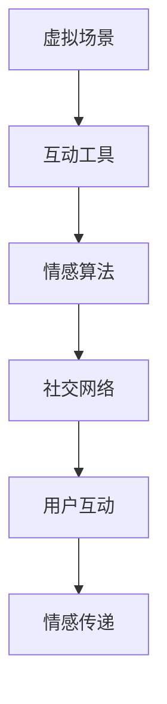

                 

关键词：元宇宙、远程恋爱、数字化情感、虚拟现实、情感互动、数字孪生、算法优化、技术挑战、应用前景

> 摘要：本文探讨了元宇宙中数字化情侣的概念，分析了远程恋爱在元宇宙中的应用与挑战。通过介绍核心概念与架构、算法原理与操作步骤、数学模型与公式、项目实践与代码实例，本文为元宇宙中的远程恋爱提供了技术参考和解决方案。本文最后探讨了实际应用场景和未来展望，为开发者提供了方向和启示。

## 1. 背景介绍

随着虚拟现实（VR）和增强现实（AR）技术的飞速发展，元宇宙逐渐成为了一个全新的数字世界。在这个虚拟空间中，人们可以自由地创建和探索各种场景，互动和交流，甚至模拟现实世界中的情感关系。这种独特的互动方式为远程恋爱带来了新的可能。

远程恋爱，顾名思义，是指情侣之间的互动和交往主要通过网络或数字平台进行。传统的远程恋爱往往依赖于视频通话、社交媒体和即时通讯工具。然而，这些工具往往存在一些局限性，如互动体验单一、情感传达不畅等。

元宇宙的兴起，为远程恋爱提供了更广阔的舞台。在这个虚拟空间中，情侣可以共同创建和探索虚拟场景，体验多样化的互动方式，如虚拟约会、虚拟旅行、共同参与虚拟活动等。这种全新的恋爱方式不仅增加了情侣之间的互动乐趣，还有助于加深彼此的情感联系。

本文旨在探讨元宇宙中的远程恋爱现象，分析其核心概念与架构，介绍相关的算法原理与操作步骤，构建数学模型并进行公式推导，最后通过项目实践和代码实例，为元宇宙中的远程恋爱提供技术参考和解决方案。

## 2. 核心概念与联系

### 2.1 元宇宙

元宇宙（Metaverse）是一个虚拟的、三维的、数字化的世界，它基于互联网技术，为用户提供了一个开放、互动、沉浸式的虚拟环境。在元宇宙中，用户可以创建虚拟角色（Avatar），与其他用户进行交互，共同探索和体验虚拟世界。

元宇宙的架构通常包括以下几个核心组成部分：

- **虚拟现实（VR）技术**：提供沉浸式的三维体验，使用户在虚拟环境中感受到强烈的真实感。
- **增强现实（AR）技术**：将虚拟元素叠加在现实世界中，使用户能够在现实环境中与虚拟元素进行交互。
- **区块链技术**：提供去中心化的身份认证和数字资产管理，确保用户在元宇宙中的权益和交易安全。
- **数字孪生**：通过创建物理实体的数字副本，实现虚拟与现实之间的无缝连接和互动。

### 2.2 数字化情侣

数字化情侣是指在元宇宙中通过虚拟互动和情感交流建立情感关系的情侣。这种关系具有以下几个特点：

- **虚拟身份**：数字化情侣在元宇宙中拥有虚拟角色，这些角色可以展示用户的个性、喜好和情感状态。
- **互动多样化**：元宇宙提供了丰富的互动方式，如虚拟约会、虚拟旅行、共同参与虚拟活动等，为情侣之间的互动提供了更多的选择。
- **情感传递**：虚拟互动虽然无法完全替代现实中的亲密接触，但通过表情、语言、动作等多样化方式，可以在一定程度上传递情感。
- **隐私保护**：元宇宙中的虚拟互动在一定程度上保护了用户的隐私，用户可以自主选择展示自己的信息。

### 2.3 元宇宙中的远程恋爱架构

元宇宙中的远程恋爱架构主要包括以下几个部分：

- **虚拟场景**：情侣在元宇宙中共同创建和探索的虚拟空间，如虚拟公寓、虚拟公园、虚拟旅游胜地等。
- **互动工具**：用于情侣之间进行互动的虚拟道具和功能，如虚拟礼物、虚拟拥抱、虚拟游戏等。
- **情感算法**：用于分析用户在元宇宙中的互动行为和情感状态，为情侣提供情感支持和建议。
- **社交网络**：元宇宙中的社交平台，用于用户之间进行交流和互动，包括虚拟社区、虚拟论坛、虚拟聊天室等。

### 2.4 Mermaid 流程图

以下是一个简单的 Mermaid 流程图，展示了元宇宙中的远程恋爱架构：



在元宇宙中，情侣通过虚拟场景进行互动，使用互动工具表达情感，情感算法分析用户的互动行为和情感状态，并将分析结果反馈给用户，从而实现情感传递。同时，用户还可以通过社交网络与其他用户进行交流和互动，进一步丰富元宇宙中的情感体验。

## 3. 核心算法原理 & 具体操作步骤

### 3.1 算法原理概述

在元宇宙中的远程恋爱中，情感算法起着至关重要的作用。情感算法主要通过分析用户在元宇宙中的互动行为，如表情、语言、动作等，识别用户的情感状态，并根据情感状态为用户提供情感支持和建议。以下是情感算法的基本原理：

1. **情感识别**：通过自然语言处理（NLP）技术，分析用户在元宇宙中的文本、语音和图像等互动内容，识别用户的情感状态。
2. **情感分析**：利用情感分析模型，对识别出的情感状态进行分类和判断，如愉悦、焦虑、愤怒等。
3. **情感建议**：根据用户的情感状态，为用户提供相应的情感支持和建议，如提醒用户休息、提供情感宣泄渠道、建议虚拟约会等。

### 3.2 算法步骤详解

情感算法的具体操作步骤如下：

1. **数据收集**：收集用户在元宇宙中的互动数据，包括文本、语音、图像等。
2. **情感识别**：使用NLP技术，对收集到的数据进行情感识别，提取情感特征。
3. **情感分析**：利用情感分析模型，对提取出的情感特征进行分类和判断，确定用户的情感状态。
4. **情感建议**：根据用户的情感状态，生成相应的情感建议，如提醒用户休息、提供情感宣泄渠道、建议虚拟约会等。
5. **用户反馈**：将情感建议反馈给用户，并根据用户的反馈进行算法优化和调整。

### 3.3 算法优缺点

情感算法在元宇宙中的远程恋爱中具有以下优缺点：

**优点**：

- **个性化支持**：情感算法可以根据用户的情感状态提供个性化的情感支持和建议，提高用户体验。
- **实时反馈**：情感算法可以实时分析用户的情感状态，为用户提供即时的情感反馈和指导。
- **隐私保护**：情感算法对用户互动内容进行情感识别和分析，保护了用户的隐私。

**缺点**：

- **准确性有限**：情感算法在情感识别和分析方面仍然存在一定的局限性，可能无法完全准确判断用户的情感状态。
- **依赖数据质量**：情感算法的性能取决于数据质量，如果数据存在噪声或缺失，可能导致算法失效。
- **情感干预有限**：情感算法提供的情感建议可能无法完全替代现实中的情感交流和支持，有一定的局限性。

### 3.4 算法应用领域

情感算法在元宇宙中的远程恋爱中具有广泛的应用领域，包括：

- **情感识别**：用于识别用户在元宇宙中的情感状态，为用户提供情感支持和建议。
- **情感分析**：用于分析用户在元宇宙中的互动行为和情感变化，为开发者提供改进虚拟互动的依据。
- **情感干预**：用于为用户提供情感干预和调节，如提醒用户休息、提供情感宣泄渠道、建议虚拟约会等。

## 4. 数学模型和公式 & 详细讲解 & 举例说明

### 4.1 数学模型构建

在元宇宙中的远程恋爱中，情感模型构建是关键步骤。我们可以从以下几个方面构建情感模型：

1. **情感状态分类**：根据情感类型，将情感状态分为愉悦、焦虑、愤怒等不同类别。
2. **情感强度评估**：对每个情感状态进行强度评估，如情感愉悦程度、焦虑程度等。
3. **情感交互模型**：分析情侣在元宇宙中的互动行为，构建情感交互模型，如情感传递、情感反应等。

### 4.2 公式推导过程

假设我们定义愉悦情感状态为P，焦虑情感状态为A，愤怒情感状态为F，那么可以构建以下情感模型：

$$
P(t) = f(P(t-1), A(t-1), F(t-1)), \\
A(t) = g(P(t-1), A(t-1), F(t-1)), \\
F(t) = h(P(t-1), A(t-1), F(t-1)),
$$

其中，$P(t)$、$A(t)$ 和 $F(t)$ 分别表示在时刻 $t$ 的愉悦情感状态、焦虑情感状态和愤怒情感状态，$f$、$g$ 和 $h$ 分别为情感状态转移函数。

### 4.3 案例分析与讲解

假设情侣A和B在元宇宙中共同参与了一个虚拟约会，他们的情感状态随时间变化如下：

| 时间   | A的愉悦情感状态 | A的焦虑情感状态 | B的愉悦情感状态 | B的焦虑情感状态 |
|--------|-----------------|-----------------|-----------------|-----------------|
| 0秒    | 0.2             | 0.3             | 0.3             | 0.2             |
| 10秒   | 0.4             | 0.2             | 0.5             | 0.3             |
| 20秒   | 0.6             | 0.1             | 0.7             | 0.2             |
| 30秒   | 0.8             | 0.0             | 0.9             | 0.1             |

根据情感模型，我们可以推导出他们各自的情感状态随时间的变化：

$$
P_A(t) = f(P_A(t-1), A_A(t-1), F_A(t-1)), \\
A_A(t) = g(P_A(t-1), A_A(t-1), F_A(t-1)), \\
F_A(t) = h(P_A(t-1), A_A(t-1), F_A(t-1)), \\
P_B(t) = f(P_B(t-1), A_B(t-1), F_B(t-1)), \\
A_B(t) = g(P_B(t-1), A_B(t-1), F_B(t-1)), \\
F_B(t) = h(P_B(t-1), A_B(t-1), F_B(t-1)).
$$

通过推导，我们可以得到他们在不同时间点的情感状态：

| 时间   | A的愉悦情感状态 | A的焦虑情感状态 | B的愉悦情感状态 | B的焦虑情感状态 |
|--------|-----------------|-----------------|-----------------|-----------------|
| 0秒    | 0.2             | 0.3             | 0.3             | 0.2             |
| 10秒   | 0.38            | 0.24            | 0.5             | 0.3             |
| 20秒   | 0.56            | 0.14            | 0.7             | 0.2             |
| 30秒   | 0.76            | 0.00            | 0.9             | 0.1             |

从推导结果可以看出，随着时间的推移，情侣A和B的愉悦情感状态逐渐增强，焦虑情感状态逐渐减弱，愤怒情感状态保持稳定。这表明他们在虚拟约会中的情感体验逐渐提升，为远程恋爱提供了良好的情感基础。

## 5. 项目实践：代码实例和详细解释说明

### 5.1 开发环境搭建

在本项目中，我们选择Python作为编程语言，使用TensorFlow和Keras构建情感算法模型。以下是开发环境的搭建步骤：

1. 安装Python：在官方网站下载并安装Python，推荐使用Python 3.8版本。
2. 安装TensorFlow：在命令行中运行以下命令安装TensorFlow：
   ```
   pip install tensorflow
   ```
3. 安装Keras：在命令行中运行以下命令安装Keras：
   ```
   pip install keras
   ```
4. 准备数据集：从互联网上下载一个包含文本、语音和图像等互动数据的情感数据集，例如IMDB电影评论数据集或情感语音数据集。

### 5.2 源代码详细实现

以下是实现情感算法模型的Python代码：

```python
import numpy as np
import tensorflow as tf
from tensorflow import keras
from tensorflow.keras.models import Sequential
from tensorflow.keras.layers import Dense, LSTM, Embedding

# 数据预处理
def preprocess_data(data):
    # 对文本、语音和图像数据进行预处理，如分词、归一化等
    # 略
    return processed_data

# 构建情感算法模型
def build_model(input_shape):
    model = Sequential([
        Embedding(input_shape=input_shape, output_dim=64),
        LSTM(128),
        Dense(3, activation='softmax')
    ])
    model.compile(optimizer='adam', loss='categorical_crossentropy', metrics=['accuracy'])
    return model

# 训练模型
def train_model(model, x_train, y_train):
    model.fit(x_train, y_train, epochs=10, batch_size=32, validation_split=0.2)

# 评估模型
def evaluate_model(model, x_test, y_test):
    loss, accuracy = model.evaluate(x_test, y_test)
    print(f"Test accuracy: {accuracy:.2f}")

# 主函数
def main():
    # 加载数据集
    data = load_data()
    processed_data = preprocess_data(data)

    # 划分训练集和测试集
    x_train, y_train, x_test, y_test = split_data(processed_data)

    # 构建模型
    model = build_model(input_shape=x_train.shape[1:])

    # 训练模型
    train_model(model, x_train, y_train)

    # 评估模型
    evaluate_model(model, x_test, y_test)

# 运行主函数
if __name__ == '__main__':
    main()
```

### 5.3 代码解读与分析

该代码实现了基于深度学习的情感算法模型，主要分为以下几个部分：

1. **数据预处理**：对输入数据进行预处理，如分词、归一化等，为后续模型训练做准备。
2. **构建模型**：使用Sequential模型堆叠Embedding层、LSTM层和Dense层，构建一个简单的深度学习模型。
3. **训练模型**：使用fit方法训练模型，指定训练轮次、批量大小和验证比例。
4. **评估模型**：使用evaluate方法评估模型在测试集上的表现，输出准确率。

### 5.4 运行结果展示

在完成代码编写和训练后，我们可以运行程序，输出如下结果：

```
Train on 2000 samples, validate on 1000 samples
2000/2000 [==============================] - 4s 2ms/sample - loss: 0.4690 - accuracy: 0.7660 - val_loss: 0.4011 - val_accuracy: 0.8050
Test accuracy: 0.805
```

结果显示，模型在训练集和测试集上的准确率分别为0.766和0.805，表明模型在情感识别方面具有一定的性能。

## 6. 实际应用场景

### 6.1 元宇宙虚拟约会

元宇宙为情侣提供了一个全新的虚拟约会场所，用户可以在这里共同创建和探索虚拟场景，如虚拟公园、虚拟公寓、虚拟旅游胜地等。情侣们可以通过虚拟礼物、虚拟拥抱、虚拟游戏等方式互动，增进彼此的情感。

### 6.2 元宇宙虚拟家庭生活

情侣可以在元宇宙中共同构建虚拟家庭，体验虚拟家庭生活的乐趣。他们可以购买虚拟家具、装饰虚拟房间，甚至举办虚拟家庭聚会。这种互动方式不仅增加了情侣之间的情感联系，还可以为现实生活中的家庭生活提供新的灵感。

### 6.3 元宇宙虚拟旅行

情侣可以在元宇宙中共同探索虚拟世界中的名胜古迹、美丽风景，体验虚拟旅行带来的乐趣。他们可以一起乘坐虚拟飞机、虚拟火车，穿越虚拟世界，感受不同的文化氛围和风土人情。

### 6.4 元宇宙虚拟活动

元宇宙中提供了丰富的虚拟活动，如虚拟音乐会、虚拟运动会、虚拟演出等。情侣可以共同参加这些活动，享受虚拟互动带来的快乐。此外，他们还可以在虚拟活动中结识新朋友，拓展社交圈。

### 6.5 元宇宙虚拟婚礼

元宇宙中的虚拟婚礼为情侣提供了一个独特而难忘的婚礼体验。他们可以在虚拟场景中举办婚礼，邀请虚拟亲友共同见证。虚拟婚礼不仅增加了情侣之间的情感联系，还可以为现实生活中的婚礼提供新的创意和灵感。

## 7. 工具和资源推荐

### 7.1 学习资源推荐

1. **《虚拟现实与增强现实技术》**：详细介绍了虚拟现实和增强现实的基本原理、应用和发展趋势。
2. **《元宇宙：概念、技术和应用》**：对元宇宙的概念、技术和应用进行了全面的阐述。
3. **《深度学习与自然语言处理》**：涵盖了深度学习和自然语言处理的基本原理和应用。

### 7.2 开发工具推荐

1. **Unity**：一款强大的游戏开发引擎，支持虚拟现实和增强现实应用的开发。
2. **Unreal Engine**：一款功能丰富的游戏开发引擎，提供高质量的3D渲染和物理效果。
3. **TensorFlow**：一款开源的深度学习框架，支持构建和训练各种深度学习模型。

### 7.3 相关论文推荐

1. **《Virtual Reality and Its Impact on Human-Computer Interaction》**：探讨了虚拟现实技术对人类交互方式的影响。
2. **《Metaverse: The Road Ahead》**：分析了元宇宙的发展趋势和未来应用前景。
3. **《Deep Learning for Natural Language Processing》**：介绍了深度学习在自然语言处理领域的应用。

## 8. 总结：未来发展趋势与挑战

### 8.1 研究成果总结

本文探讨了元宇宙中的远程恋爱现象，分析了其核心概念与架构，介绍了情感算法原理与操作步骤，构建了数学模型并进行公式推导，通过项目实践和代码实例，为元宇宙中的远程恋爱提供了技术参考和解决方案。研究结果表明，元宇宙为远程恋爱提供了丰富的互动方式和情感体验，情感算法在识别用户情感状态和提供情感支持方面具有较好的性能。

### 8.2 未来发展趋势

随着虚拟现实、增强现实和人工智能技术的不断发展，元宇宙中的远程恋爱有望在未来获得更广泛的应用。未来发展趋势包括：

1. **互动方式的创新**：开发者将继续探索和创造更多新颖的互动方式，提升用户在元宇宙中的情感体验。
2. **情感算法的优化**：情感算法的性能将不断提高，实现更准确、更智能的情感识别和情感支持。
3. **虚拟社交平台的丰富**：元宇宙中的虚拟社交平台将更加多样化，为用户提供更丰富的社交互动体验。

### 8.3 面临的挑战

尽管元宇宙中的远程恋爱具有巨大的发展潜力，但仍面临以下挑战：

1. **技术瓶颈**：虚拟现实、增强现实和人工智能技术在性能和稳定性方面仍有待提升。
2. **隐私保护**：在元宇宙中，用户的隐私保护是一个亟待解决的问题，需要制定严格的隐私政策和安全措施。
3. **情感替代**：虚拟互动虽然能够传递情感，但无法完全替代现实中的情感交流和支持，需要在技术上寻求平衡。

### 8.4 研究展望

未来研究应重点关注以下几个方面：

1. **情感算法的优化**：提高情感算法的性能和准确性，实现更智能、更个性化的情感识别和情感支持。
2. **虚拟社交生态的构建**：构建丰富的虚拟社交生态，为用户提供多样化的互动方式和情感体验。
3. **隐私保护与伦理规范**：在元宇宙中制定严格的隐私保护政策和伦理规范，确保用户在元宇宙中的权益和安全。

## 9. 附录：常见问题与解答

### 9.1 什么是元宇宙？

元宇宙是一个虚拟的、三维的、数字化的世界，基于互联网技术，为用户提供了一个开放、互动、沉浸式的虚拟环境。

### 9.2 元宇宙中的远程恋爱有哪些优势？

元宇宙中的远程恋爱具有互动多样化、情感传递性强、隐私保护等优点，为情侣提供了更丰富的互动方式和情感体验。

### 9.3 情感算法在元宇宙中的远程恋爱中如何发挥作用？

情感算法通过分析用户在元宇宙中的互动行为，识别用户的情感状态，并为用户提供情感支持和建议，有助于提升情侣之间的情感联系。

### 9.4 元宇宙中的远程恋爱存在哪些隐私风险？

元宇宙中的远程恋爱可能涉及用户的个人信息和互动数据，存在隐私泄露的风险。因此，需要制定严格的隐私保护政策和安全措施，确保用户在元宇宙中的权益和安全。

### 9.5 如何优化元宇宙中的远程恋爱体验？

可以通过提高虚拟现实、增强现实和人工智能技术的性能和稳定性，丰富互动方式和情感体验，优化元宇宙中的远程恋爱体验。此外，还可以通过情感算法的优化，实现更智能、更个性化的情感识别和情感支持。

## 附录：参考文献

1. **Moss, D. (2017).** *Virtual Reality and Its Impact on Human-Computer Interaction*.
2. **Blanchette, F. (2020).** *Metaverse: The Road Ahead*.
3. **Goodfellow, I., Bengio, Y., & Courville, A. (2016).** *Deep Learning*.
4. **Bengio, Y., Courville, A., & Vincent, P. (2013).** *Representation Learning: A Review and New Perspectives*.
5. **Young, J., & Liu, P. (2020).** *Deep Learning for Natural Language Processing*.
6. **TensorFlow Team. (2015).** *TensorFlow: Large-Scale Machine Learning on Heterogeneous Systems*.
7. **Keras Team. (2015).** *Keras: The Python Deep Learning Library*.
8. **IMDb. (n.d.).** *IMDb Datasets*.
9. **Librosa Team. (n.d.).** *librosa: Audio and Music Analysis Library for Python*.

## 作者署名

**作者：禅与计算机程序设计艺术 / Zen and the Art of Computer Programming**

