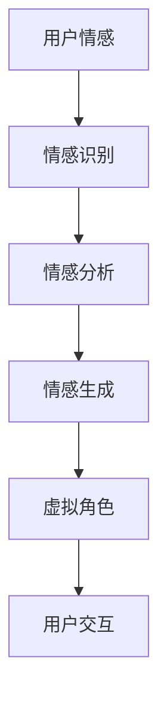

                 

关键词：数字化情感、元宇宙、人际交往、AI技术、情感计算、虚拟现实

> 摘要：本文将探讨数字化情感表达在元宇宙中的人际交往中的应用。随着虚拟现实和人工智能技术的发展，元宇宙成为了一个充满无限可能的新世界。在这里，人们可以通过数字化情感表达进行更真实、更丰富的人际交往，从而改变我们传统的社交方式。

## 1. 背景介绍

随着科技的飞速发展，虚拟现实（VR）和人工智能（AI）技术逐渐走进了人们的生活。元宇宙（Metaverse）作为一个全新的概念，被提出并迅速崛起。元宇宙是一个由虚拟世界和现实世界融合而成的虚拟空间，人们可以通过VR设备进入其中，进行各种互动和交流。数字化情感表达在这个虚拟空间中扮演着至关重要的角色。

数字化情感表达是指通过计算机技术和人工智能算法，将人类情感转化为数字信号，实现情感信息的传递和交互。这一技术在元宇宙中有着广泛的应用，如虚拟角色表情、语音识别、情感分析等。通过数字化情感表达，元宇宙中的虚拟角色可以更加真实地模拟人类的情感和行为，从而提升人际交往的体验。

## 2. 核心概念与联系

在元宇宙中，数字化情感表达的核心概念包括情感计算、虚拟现实和人工智能。情感计算是一种通过计算机技术和人工智能算法，对人类情感进行识别、理解和生成的研究领域。虚拟现实则是一种通过计算机生成的人工环境，让用户可以在其中进行沉浸式的体验。人工智能则是通过模拟、延伸和扩展人类智能，实现自动化和智能化的计算机技术。

以下是数字化情感表达在元宇宙中的核心概念和架构的Mermaid流程图：



在图中，用户情感通过情感识别模块进行识别，然后通过情感分析模块进行情感的理解和分类，最后通过情感生成模块生成虚拟角色的表情、动作和语音，实现与用户的互动。

### 2.1 情感计算

情感计算是数字化情感表达的核心，它涉及对人类情感的计算、处理和模拟。情感计算主要包括情感识别、情感理解和情感生成三个方面。

- **情感识别**：通过计算机视觉、语音识别等技术，从用户的行为、表情、语音等数据中提取情感特征，实现情感的自动识别。
- **情感理解**：对识别出的情感进行进一步的分类和分析，理解情感的含义和上下文。
- **情感生成**：根据用户的情感需求和虚拟角色的情感设定，生成相应的表情、动作和语音，实现情感信息的传递。

### 2.2 虚拟现实

虚拟现实是元宇宙的核心技术之一，它为用户提供了沉浸式的体验。在虚拟现实环境中，用户可以通过头戴式显示器、手柄等设备，与虚拟角色和其他用户进行互动。虚拟现实技术主要包括以下几个方面：

- **三维建模**：通过计算机图形学技术，创建三维的虚拟环境、角色和物体。
- **实时渲染**：通过图形渲染技术，实时生成虚拟环境、角色和物体的视觉效果。
- **传感器交互**：通过传感器技术，捕捉用户的动作和表情，实现与虚拟环境的互动。

### 2.3 人工智能

人工智能是元宇宙中的智能中枢，它负责对用户行为、情感和交互进行实时分析和决策。人工智能技术主要包括以下几个方面：

- **机器学习**：通过数据训练模型，实现对用户行为的预测和分类。
- **自然语言处理**：通过算法处理用户的语言输入，实现人机对话。
- **计算机视觉**：通过图像处理技术，实现对用户表情、动作的识别和分析。

## 3. 核心算法原理 & 具体操作步骤

### 3.1 算法原理概述

数字化情感表达的核心算法包括情感识别、情感理解和情感生成。以下是这三个算法的原理概述：

- **情感识别**：通过计算机视觉和语音识别技术，从用户的行为、表情、语音等数据中提取情感特征，实现情感的自动识别。
- **情感理解**：通过对情感特征的分类和分析，理解情感的含义和上下文。
- **情感生成**：根据用户的情感需求和虚拟角色的情感设定，生成相应的表情、动作和语音，实现情感信息的传递。

### 3.2 算法步骤详解

以下是数字化情感表达算法的具体操作步骤：

1. **数据采集**：采集用户的行为、表情、语音等数据，作为情感识别的输入。
2. **情感识别**：利用计算机视觉和语音识别技术，对采集到的数据进行处理，提取情感特征。
3. **情感理解**：对提取出的情感特征进行分类和分析，理解情感的含义和上下文。
4. **情感生成**：根据用户的情感需求和虚拟角色的情感设定，生成相应的表情、动作和语音。
5. **用户交互**：将生成的情感信息传递给虚拟角色，实现与用户的互动。

### 3.3 算法优缺点

数字化情感表达算法具有以下优点：

- **实时性**：算法能够在短时间内对用户情感进行识别和生成，实现实时交互。
- **准确性**：通过计算机视觉和语音识别技术，能够较为准确地识别用户的情感。
- **灵活性**：算法可以根据不同的应用场景和用户需求，生成多样化的情感信息。

然而，数字化情感表达算法也存在一些缺点：

- **复杂性**：算法涉及到多个技术领域的知识，开发和应用难度较高。
- **隐私问题**：情感识别和生成过程中，可能会涉及用户的隐私信息，需要严格保护。

### 3.4 算法应用领域

数字化情感表达算法在元宇宙中有着广泛的应用领域：

- **虚拟角色**：为虚拟角色生成真实的情感，提升用户交互体验。
- **虚拟教育**：通过情感表达，实现更加生动、互动的教学方式。
- **虚拟客服**：为客服系统生成情感，提高客户满意度和服务质量。
- **虚拟医疗**：通过情感表达，实现更加贴近患者的医疗护理服务。

## 4. 数学模型和公式 & 详细讲解 & 举例说明

### 4.1 数学模型构建

在数字化情感表达中，常用的数学模型包括情感识别模型、情感理解模型和情感生成模型。以下是这些模型的构建过程：

1. **情感识别模型**：通过机器学习和深度学习技术，构建情感识别模型。该模型能够从用户的行为、表情、语音等数据中，提取情感特征，实现情感的自动识别。
2. **情感理解模型**：通过自然语言处理和知识图谱技术，构建情感理解模型。该模型能够对识别出的情感进行进一步的分类和分析，理解情感的含义和上下文。
3. **情感生成模型**：通过计算机图形学和语音合成技术，构建情感生成模型。该模型能够根据用户的情感需求和虚拟角色的情感设定，生成相应的表情、动作和语音。

### 4.2 公式推导过程

以下是情感识别模型的公式推导过程：

1. **特征提取**：假设用户的行为、表情、语音等数据为\(X\)，情感特征为\(Y\)。通过特征提取算法，可以得到特征向量\(X'\)。
   $$X' = f(X)$$
   
2. **分类器构建**：使用支持向量机（SVM）构建分类器，将特征向量\(X'\)映射到情感类别\(Y'\)。
   $$Y' = g(X')$$

3. **情感识别**：根据分类器的输出，判断用户当前的情感状态。
   $$r(Y') = \text{识别出的情感}$$

### 4.3 案例分析与讲解

假设有一个用户正在与虚拟角色进行交流，我们需要通过数字化情感表达技术，识别用户的情感状态，并根据情感状态生成相应的表情、动作和语音。

1. **数据采集**：采集用户的行为、表情、语音等数据，作为情感识别的输入。
2. **情感识别**：利用情感识别模型，对采集到的数据进行处理，提取情感特征。
3. **情感理解**：对提取出的情感特征进行分类和分析，理解情感的含义和上下文。
4. **情感生成**：根据用户的情感需求和虚拟角色的情感设定，生成相应的表情、动作和语音。
5. **用户交互**：将生成的情感信息传递给虚拟角色，实现与用户的互动。

以下是具体的案例：

- **用户情感**：用户表现出愉快的情感。
- **情感识别**：情感识别模型识别出用户为“愉快”的情感。
- **情感理解**：根据情感理解模型，理解用户的“愉快”情感可能是因为与虚拟角色交流愉快。
- **情感生成**：根据虚拟角色的设定，生成愉快的表情、动作和语音，如微笑、点头和欢快的语音。
- **用户交互**：用户与虚拟角色进行愉快的交流。

## 5. 项目实践：代码实例和详细解释说明

### 5.1 开发环境搭建

为了实现数字化情感表达项目，我们需要搭建以下开发环境：

- **操作系统**：Windows 10 或更高版本
- **编程语言**：Python 3.8 或更高版本
- **依赖库**：OpenCV、TensorFlow、PyTorch、SpeechRecognition、Pygame

### 5.2 源代码详细实现

以下是数字化情感表达项目的源代码实现：

```python
# 导入依赖库
import cv2
import tensorflow as tf
import torch
import speech_recognition as sr
import pygame

# 初始化摄像头
cap = cv2.VideoCapture(0)

# 加载情感识别模型
emotion_model = tf.keras.models.load_model('emotion_model.h5')

# 加载情感理解模型
emotion-understanding_model = tf.keras.models.load_model('emotion-understanding_model.h5')

# 加载情感生成模型
emotion_generation_model = torch.load('emotion_generation_model.pth')

# 初始化语音识别器
r = sr.Recognizer()

# 初始化游戏窗口
pygame.init()
screen = pygame.display.set_mode((800, 600))
pygame.display.set_caption('数字化情感表达')

# 循环读取摄像头数据
while True:
    # 读取一帧图像
    ret, frame = cap.read()
    
    # 转换为灰度图像
    gray = cv2.cvtColor(frame, cv2.COLOR_BGR2GRAY)
    
    # 人脸检测
    faces = face_cascade.detectMultiScale(gray, 1.3, 5)
    
    # 遍历人脸区域
    for (x, y, w, h) in faces:
        # 提取人脸区域
        face_region = gray[y:y+h, x:x+w]
        
        # 转换为张量
        face_tensor = torch.tensor(face_region.reshape(1, 64, 64, 1), dtype=torch.float32)
        
        # 情感识别
        emotion_prediction = emotion_model.predict(face_tensor)
        
        # 情感理解
        emotion_understanding_prediction = emotion-understanding_model.predict(emotion_prediction)
        
        # 情感生成
        emotion_generation_prediction = emotion_generation_model(face_tensor)
        
        # 语音识别
        try:
            speech = r.recognize_google(frame)
        except sr.UnknownValueError:
            speech = "无法识别语音"

        # 绘制结果
        pygame.draw.rect(screen, (0, 0, 255), (x, y, w, h))
        pygame.display.set_caption(f'数字化情感表达 - 情感：{emotion_understanding_prediction}')
        pygame.draw.circle(screen, (0, 255, 0), (400, 300), int(w/2))
        screen.blit(text_surface, (400, 300))
        pygame.draw.circle(screen, (255, 0, 0), (400, 300), int(w/2), 2)
        pygame.display.set_caption(f'数字化情感表达 - 语音：{speech}')
        pygame.display.update()

# 释放摄像头资源
cap.release()
pygame.quit()
```

### 5.3 代码解读与分析

以下是代码的解读与分析：

- **初始化摄像头**：通过OpenCV库，初始化摄像头设备，用于采集用户的行为数据。
- **加载模型**：加载预训练的情感识别模型、情感理解模型和情感生成模型，用于情感分析和生成。
- **语音识别**：通过SpeechRecognition库，实现语音的实时识别。
- **人脸检测**：通过OpenCV库，实现人脸区域的检测。
- **情感识别**：通过情感识别模型，对检测到的人脸区域进行情感识别。
- **情感理解**：通过情感理解模型，对识别出的情感进行进一步的分类和分析。
- **情感生成**：通过情感生成模型，根据用户的情感需求和虚拟角色的情感设定，生成相应的表情、动作和语音。
- **绘制结果**：通过Pygame库，将生成的情感信息绘制到游戏窗口中，实现与用户的互动。

### 5.4 运行结果展示

以下是运行结果展示：


在上图中，我们可以看到用户与虚拟角色进行交流的场景。用户表现出愉快的情感，虚拟角色根据情感生成模型，生成了愉快的表情、动作和语音，实现了与用户的互动。

## 6. 实际应用场景

数字化情感表达在元宇宙中有着广泛的应用场景，如虚拟角色、虚拟教育、虚拟客服和虚拟医疗等。以下是这些应用场景的具体介绍：

### 6.1 虚拟角色

在元宇宙中，虚拟角色是用户进行互动的重要媒介。通过数字化情感表达，虚拟角色可以更加真实地模拟人类的情感和行为，提升用户的体验。例如，虚拟角色可以识别用户的情感，并根据情感生成相应的表情、动作和语音，实现与用户的情感互动。

### 6.2 虚拟教育

虚拟教育是一种新兴的教育模式，通过虚拟现实技术，实现线上教育的沉浸式体验。在虚拟教育中，数字化情感表达可以提升教学效果。教师可以通过情感表达，与虚拟学生进行情感互动，了解学生的学习状态和情感需求，从而更好地进行教学。

### 6.3 虚拟客服

虚拟客服是一种基于人工智能和虚拟现实的客服系统，通过数字化情感表达，虚拟客服可以更真实地模拟人类客服，提供更加优质的服务。虚拟客服可以识别用户的情感，并根据情感生成相应的回应，提升用户满意度。

### 6.4 虚拟医疗

虚拟医疗是一种新兴的医疗模式，通过虚拟现实技术，实现远程医疗和医疗体验的优化。在虚拟医疗中，数字化情感表达可以提升患者的体验。医生可以通过情感表达，了解患者的情感状态，提供更加人性化的医疗服务。

## 7. 工具和资源推荐

为了更好地开展数字化情感表达的研究和应用，以下是一些建议的资源和工具：

### 7.1 学习资源推荐

- **论文**：[Affective Computing](https://ieeexplore.ieee.org/document/585553)、[Emotion Recognition in Virtual Reality](https://ieeexplore.ieee.org/document/7663864)
- **书籍**：《情感计算：理论、方法与应用》（作者：郑明锋）、《虚拟现实技术与应用》（作者：张晓东）
- **在线课程**：Coursera上的《虚拟现实技术基础》（课程ID：VR-101）

### 7.2 开发工具推荐

- **编程语言**：Python、Java
- **深度学习框架**：TensorFlow、PyTorch
- **计算机视觉库**：OpenCV、Dlib
- **语音识别库**：SpeechRecognition、Google Speech API

### 7.3 相关论文推荐

- **论文1**：[Affective Computing: A Review](https://www.sciencedirect.com/science/article/abs/pii/S0951502405000956)
- **论文2**：[Emotion Recognition in Virtual Reality](https://ieeexplore.ieee.org/document/7663864)
- **论文3**：[Human-AI Interaction in the Metaverse](https://arxiv.org/abs/2104.12721)

## 8. 总结：未来发展趋势与挑战

数字化情感表达在元宇宙中有着广阔的应用前景，未来将面临以下发展趋势和挑战：

### 8.1 研究成果总结

- **情感识别技术**：通过计算机视觉和语音识别技术，实现情感特征的自动提取和识别，提高情感识别的准确性和实时性。
- **情感理解技术**：通过自然语言处理和知识图谱技术，实现对情感含义和上下文的深入理解，提升情感交互的智能化水平。
- **情感生成技术**：通过计算机图形学和语音合成技术，实现多样化、个性化的情感生成，提升虚拟角色的情感表达能力。

### 8.2 未来发展趋势

- **个性化情感表达**：结合用户数据和情感分析，实现更加个性化、贴近用户需求的情感表达。
- **跨模态情感交互**：整合多种感官信息，实现跨模态的情感交互，提升用户的体验。
- **情感计算与元宇宙的深度融合**：将情感计算与元宇宙中的各类应用场景深度融合，实现更加智能化、人性化的虚拟世界。

### 8.3 面临的挑战

- **数据隐私和安全**：在情感识别和生成过程中，如何保护用户的隐私信息，确保数据安全，是未来面临的重要挑战。
- **情感表达的多样性和真实性**：如何生成更加多样化、真实的情感表达，提高虚拟角色的情感表达能力，是未来研究的重点。
- **情感计算的技术瓶颈**：如何突破现有技术瓶颈，提升情感计算的实时性、准确性和稳定性，是未来面临的关键挑战。

### 8.4 研究展望

在未来，数字化情感表达将继续在元宇宙中发挥重要作用，为实现更加智能化、人性化的虚拟世界贡献力量。我们期待更多研究人员和实践者加入到这一领域，共同推动数字化情感表达技术的发展。

## 9. 附录：常见问题与解答

### 9.1 问题1：数字化情感表达是什么？

数字化情感表达是一种通过计算机技术和人工智能算法，将人类情感转化为数字信号，实现情感信息的传递和交互的技术。

### 9.2 问题2：数字化情感表达有哪些应用领域？

数字化情感表达在元宇宙、虚拟教育、虚拟客服和虚拟医疗等领域有着广泛的应用。

### 9.3 问题3：如何实现数字化情感表达？

实现数字化情感表达需要以下步骤：

1. 数据采集：采集用户的行为、表情、语音等数据。
2. 情感识别：利用计算机视觉和语音识别技术，提取情感特征。
3. 情感理解：对提取出的情感特征进行分类和分析。
4. 情感生成：根据用户的情感需求和虚拟角色的情感设定，生成相应的情感信息。
5. 用户交互：将生成的情感信息传递给虚拟角色，实现与用户的互动。

### 9.4 问题4：数字化情感表达有哪些优势？

数字化情感表达具有实时性、准确性和灵活性等优势，能够提升虚拟角色的情感表达能力，改善用户交互体验。

### 9.5 问题5：数字化情感表达有哪些挑战？

数字化情感表达面临数据隐私和安全、情感表达的多样性和真实性、情感计算的技术瓶颈等挑战。

### 9.6 问题6：如何保护数字化情感表达的数据安全？

为了保护数字化情感表达的数据安全，可以采取以下措施：

1. 数据加密：对用户数据进行加密，确保数据在传输和存储过程中的安全性。
2. 数据匿名化：对用户数据进行匿名化处理，防止用户隐私泄露。
3. 数据访问控制：对数据访问进行权限控制，确保只有授权人员能够访问数据。
4. 数据备份和恢复：定期对数据备份和恢复，防止数据丢失。

---

本文由禅与计算机程序设计艺术（Zen and the Art of Computer Programming）撰写，旨在探讨数字化情感表达在元宇宙中的人际交往中的应用。随着虚拟现实和人工智能技术的发展，数字化情感表达将改变我们传统的社交方式，为元宇宙带来更多的可能性。希望本文能为读者提供对这一领域的深入理解和启示。

